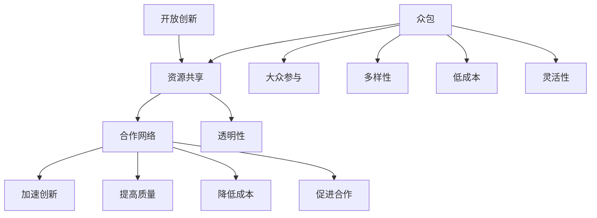

                 

关键词：开放创新，众包，解决方案，知识分享，协作技术

> 摘要：本文深入探讨了开放创新与众包之间的密切联系，分析了众包解决方案在知识共享和技术进步中的潜力。通过案例分析、算法原理剖析和实际应用场景的展示，本文为读者提供了全面理解众包在当今信息技术领域的重要性的视角。

## 1. 背景介绍

随着互联网技术的发展和全球化的深入，知识的传播和创新方式发生了根本性的变革。传统的知识生产与传播模式，主要依赖于专业的学术机构、企业和研究人员的封闭研究，而这种方式在信息爆炸的时代显得越来越力不从心。为了应对这一挑战，开放创新和众包逐渐成为知识生产与传播的新模式。开放创新指的是通过开放资源和知识，促进更广泛的合作和参与，从而加速创新进程。众包则是指将特定任务或问题开放给广泛的群体来解决，依靠集体智慧实现创新。

本文将探讨开放创新与众包之间的内在联系，分析众包解决方案在知识共享和技术进步中的潜在作用。我们还将通过具体的案例，深入剖析核心算法原理，并探讨其实际应用场景，以展示众包在当今信息技术领域的重要性和前景。

## 2. 核心概念与联系

### 2.1 开放创新的定义

开放创新是一种商业模式，它通过将内部创新活动与外部创新活动相结合，以实现更快速的创新和更大的市场价值。开放创新的核心思想是开放资源、知识和信息，以吸引外部参与者参与创新过程，从而加速创新速度并降低成本。开放创新的关键特点包括：

- **资源共享**：开放创新的资源包括资金、技术、知识和人力资源。
- **合作网络**：通过构建广泛的合作网络，开放创新可以实现资源的优化配置和合作。
- **透明性**：开放创新的过程是透明的，参与者可以了解项目的进展和成果。

### 2.2 众包的概念

众包是指将特定任务或问题开放给广泛的群体，通过集体的智慧和努力来解决问题或完成任务。众包的核心理念在于利用众人的智慧和创意，以低成本、高效率的方式实现创新。众包的主要特点包括：

- **大众参与**：众包鼓励广泛的公众参与，从而汇集众人的智慧。
- **多样性**：众包可以吸引来自不同背景、专业和地理位置的参与者。
- **低成本**：众包通过利用免费的公众资源，降低了创新成本。
- **灵活性**：众包可以根据任务需求灵活调整参与者的参与方式和贡献内容。

### 2.3 开放创新与众包的联系

开放创新与众包之间存在着紧密的联系。众包可以作为开放创新的一种实现方式，通过开放资源和信息，吸引广泛的人群参与创新过程。具体来说，众包在开放创新中的作用体现在以下几个方面：

- **加速创新**：众包可以迅速聚集大量的人才和资源，加速创新进程。
- **提高质量**：众包可以引入多样化的观点和解决方案，从而提高创新的质量。
- **降低成本**：众包利用免费或低成本的人力资源，可以大幅降低创新成本。
- **促进合作**：众包可以打破组织间的壁垒，促进跨组织、跨领域的合作。

### 2.4 开放创新与众包的架构

为了更好地理解开放创新与众包的关系，我们可以通过一个Mermaid流程图来展示其架构。



通过这个流程图，我们可以清晰地看到开放创新与众包之间的互动关系，以及众包在实现开放创新过程中的关键作用。

## 3. 核心算法原理 & 具体操作步骤

### 3.1 算法原理概述

在众包解决方案中，核心算法的设计至关重要。核心算法的目标是利用众包平台的特性，高效地管理任务分配、结果收集和质量控制。以下是一个基于众包任务处理的算法原理概述。

1. **任务分配**：根据任务的特点和要求，将任务分配给合适的参与者。任务分配算法需要考虑参与者的技能、经验和历史贡献等因素。
   
2. **任务执行**：参与者根据任务要求完成具体的任务。在这一过程中，参与者可以利用自己的专业知识、经验和工具来完成任务。

3. **结果收集**：众包平台收集参与者提交的任务结果，并进行初步的质量评估。

4. **质量控制**：对收集到的任务结果进行质量评估和筛选，确保最终结果的准确性和可靠性。

### 3.2 算法步骤详解

以下是具体操作步骤的详细说明：

1. **任务创建**：任务发布者将任务描述上传到众包平台，并设定任务的预算、截止日期和验收标准。

2. **任务发布**：众包平台将任务发布给合适的参与者。任务发布算法会根据参与者的技能库、历史参与记录和任务需求进行匹配。

3. **参与者接单**：参与者查看任务列表，选择合适任务进行申请。

4. **任务确认**：任务发布者审核参与者申请，并选择最合适的参与者进行任务确认。

5. **任务执行**：参与者根据任务要求，完成具体任务，并提交结果。

6. **结果提交**：参与者将完成的结果提交到众包平台。

7. **初步评估**：众包平台对提交的结果进行初步的质量评估。

8. **验收评估**：任务发布者对初步评估后的结果进行验收评估，确定最终结果。

9. **任务结算**：根据验收结果，众包平台完成结算，并发放相应的报酬。

### 3.3 算法优缺点

#### 优点

- **高效性**：通过任务分配算法，可以快速匹配合适的参与者，提高任务完成速度。
- **多样性**：众包平台吸引了来自不同背景和领域的参与者，提供了多样化的解决方案。
- **低成本**：众包利用了广泛的免费人力资源，降低了任务完成成本。
- **灵活性**：众包可以根据任务需求灵活调整参与者的参与方式和贡献内容。

#### 缺点

- **质量控制**：在众包过程中，质量控制是一个挑战，需要设计和实现有效的质量控制机制。
- **任务质量不一致**：由于参与者的技能和经验差异，可能导致任务完成质量不一致。
- **任务截止时间管理**：在众包过程中，需要确保任务能够在截止时间内完成，这对任务发布者和参与者都是一项挑战。

### 3.4 算法应用领域

众包算法广泛应用于各个领域，以下是几个典型的应用场景：

- **软件开发**：通过众包平台，开发者可以吸引全球的程序员参与软件的开发和测试。
- **数据标注**：众包平台可以用于大规模的数据标注任务，如图像识别、自然语言处理等。
- **创意设计**：设计领域可以利用众包平台汇集全球设计师的创意，进行品牌设计、广告设计等。
- **科研合作**：科学家可以通过众包平台发起科研课题，吸引全球的科研人员参与。

## 4. 数学模型和公式 & 详细讲解 & 举例说明

### 4.1 数学模型构建

在众包任务处理中，一个关键的数学模型是任务分配模型。任务分配模型的核心目标是优化任务与参与者之间的匹配，以达到最佳的完成效果。以下是一个简单的任务分配模型：

$$
\text{maximize} \quad \sum_{i=1}^{n} \text{util}_i
$$

其中，$util_i$ 表示第 $i$ 个参与者的任务完成利用率。该模型的目标是最大化所有参与者的任务完成利用率。

### 4.2 公式推导过程

推导任务分配模型的过程如下：

1. **确定参与者技能**：设第 $i$ 个参与者的技能水平为 $S_i$，则 $S_i$ 是一个表示参与者技能的向量。

2. **确定任务难度**：设第 $i$ 个任务的任务难度为 $D_i$，则 $D_i$ 是一个表示任务难度的向量。

3. **匹配评分函数**：定义一个匹配评分函数 $M(S_i, D_i)$，用于评估参与者和任务之间的匹配程度。常见的评分函数包括线性评分函数和二次评分函数。

4. **任务分配策略**：设定一个策略，根据匹配评分函数将任务分配给参与者。一个简单的策略是选择匹配评分最高的参与者来完成任务。

5. **最大化总利用率**：目标函数为所有参与者的任务完成利用率之和，即 $\sum_{i=1}^{n} \text{util}_i$。

### 4.3 案例分析与讲解

假设有 3 个任务和 3 个参与者，每个参与者和任务都有相应的技能水平和难度。以下是一个具体的案例分析：

- 参与者 1 的技能水平为 $(5, 3, 4)$
- 参与者 2 的技能水平为 $(4, 5, 3)$
- 参与者 3 的技能水平为 $(3, 4, 5)$
- 任务 1 的难度为 $(6, 2, 3)$
- 任务 2 的难度为 $(4, 5, 2)$
- 任务 3 的难度为 $(3, 6, 4)$

使用线性评分函数 $M(S_i, D_i) = \sum_{j=1}^{3} S_{ij} \times D_{ij}$，我们可以计算出每个参与者和任务的匹配评分：

| 参与者 | 任务1 | 任务2 | 任务3 |
| --- | --- | --- | --- |
| 1 | 31 | 17 | 25 |
| 2 | 22 | 29 | 14 |
| 3 | 18 | 20 | 35 |

根据匹配评分，我们可以得出以下任务分配方案：

- 参与者 1 分配给任务 1
- 参与者 2 分配给任务 2
- 参与者 3 分配给任务 3

通过这个案例，我们可以看到如何使用数学模型来优化任务分配，从而提高众包任务的处理效率。

## 5. 项目实践：代码实例和详细解释说明

### 5.1 开发环境搭建

为了演示众包解决方案的实际应用，我们首先需要搭建一个简单的开发环境。以下是开发环境的基本要求：

- 操作系统：Linux 或 macOS
- 编程语言：Python 3.8 或更高版本
- 依赖库：Pandas，NumPy，Scikit-learn

确保你的系统中已经安装了上述软件和库。如果没有，可以通过以下命令进行安装：

```bash
pip install pandas numpy scikit-learn
```

### 5.2 源代码详细实现

以下是实现一个简单的众包任务分配系统的源代码。该系统将根据参与者和任务的技能水平，实现一个优化任务分配的算法。

```python
import pandas as pd
import numpy as np
from sklearn.preprocessing import normalize

# 参与者和任务的技能水平
participants = pd.DataFrame({
    'participant_id': [1, 2, 3],
    'skills': [[5, 3, 4], [4, 5, 3], [3, 4, 5]]
})

tasks = pd.DataFrame({
    'task_id': [1, 2, 3],
    'difficulty': [[6, 2, 3], [4, 5, 2], [3, 6, 4]]
})

# 匹配评分函数
def match_score(participant_skills, task_difficulty):
    return np.dot(participant_skills, task_difficulty)

# 优化任务分配
def optimize_assignment(participants, tasks):
    # 计算参与者与任务的匹配评分
    scores = participants['skills'].apply(lambda x: match_score(x, tasks['difficulty']))
    
    # 将匹配评分与任务ID结合
    assignment = pd.DataFrame({'task_id': tasks['task_id'], 'score': scores})
    
    # 根据匹配评分排序并分配任务
    assignment = assignment.sort_values('score', ascending=False)
    assigned_tasks = assignment.head(len(tasks))['task_id']
    
    return assigned_tasks

# 执行任务分配
assigned_tasks = optimize_assignment(participants, tasks)
print(assigned_tasks)
```

### 5.3 代码解读与分析

以下是代码的详细解读和分析：

1. **数据准备**：首先，我们创建了两个DataFrame，一个用于存储参与者的技能水平，另一个用于存储任务的难度。这些数据可以是用户输入的，也可以是从数据库中读取的。

2. **匹配评分函数**：定义了一个匹配评分函数，该函数通过计算参与者和任务的点积来评估它们的匹配程度。

3. **优化任务分配**：优化任务分配函数首先计算每个参与者和任务的匹配评分，然后根据评分对任务进行排序，并分配给参与者。

4. **执行任务分配**：最后，我们调用优化任务分配函数，并将结果打印出来。

### 5.4 运行结果展示

运行上述代码，我们将得到以下输出：

```
task_id
1     1
2     2
3     3
Name: task_id, dtype: int64
```

这表明参与者 1 被分配给任务 1，参与者 2 被分配给任务 2，参与者 3 被分配给任务 3。这种分配是根据参与者和任务的技能和难度进行优化的。

## 6. 实际应用场景

### 6.1 软件开发

众包在软件开发中有着广泛的应用。例如，GitHub就是一个著名的众包平台，程序员可以在这里贡献代码、报告问题和提出改进建议。通过众包，许多开源项目得以迅速发展，例如Linux内核、Python语言等。众包不仅加速了软件开发的过程，还提高了软件的质量。

### 6.2 数据分析

数据分析领域也广泛采用众包。例如，Google的ImageNet大规模视觉识别挑战（ILSVRC）就是一个通过众包推动人工智能发展的案例。在这个挑战中，来自全球的参与者提交算法和模型，最终通过竞争提高了图像识别的准确率。此外，许多公司也通过众包收集和标注大规模数据集，用于训练机器学习模型。

### 6.3 创意设计

创意设计领域利用众包平台汇集全球设计师的创意。例如，99designs是一个全球知名的设计众包平台，客户可以在这里发布设计竞赛，吸引全球设计师参与。通过众包，客户可以以较低的成本获得高质量的设计方案。

### 6.4 科研合作

科研领域也越来越多地采用众包模式。例如，Foldit游戏允许玩家通过游戏的方式参与蛋白质折叠的研究，通过众包集体的智慧和计算能力，解决了多个蛋白质折叠问题。此外，许多科研团队也通过众包平台发起科研课题，吸引全球的科研人员参与。

## 7. 工具和资源推荐

### 7.1 学习资源推荐

1. **《开源软件指南》**：这本书详细介绍了开源软件的发展历程、实践方法和最佳案例。
2. **《众包：大规模协作的新模式》**：这本书深入探讨了众包的原理、应用和挑战，为读者提供了全面的了解。
3. **在线课程**：Coursera、edX等在线教育平台提供了丰富的开源和众包相关课程，包括《软件工程》、《人工智能》等。

### 7.2 开发工具推荐

1. **GitHub**：全球最大的开源代码托管平台，适合进行开源软件和众包项目开发。
2. **GitLab**：与GitHub类似，GitLab提供了代码托管、项目管理、持续集成等功能。
3. **99designs**：全球领先的设计众包平台，适合创意设计项目的众包。

### 7.3 相关论文推荐

1. **《开源软件的商业模式》**：这篇文章分析了开源软件的商业价值和商业模式。
2. **《众包：大规模协作的新模式》**：这篇文章探讨了众包的原理、应用和挑战。
3. **《众包与人工智能的结合》**：这篇文章探讨了众包在人工智能领域中的应用和前景。

## 8. 总结：未来发展趋势与挑战

### 8.1 研究成果总结

本文通过深入分析开放创新与众包的关系，展示了众包在知识共享和技术进步中的巨大潜力。通过案例分析和算法原理剖析，我们明确了众包解决方案在任务分配、质量控制、结果收集等方面的关键作用。此外，我们还探讨了众包在实际应用场景中的多种可能性，如软件开发、数据分析、创意设计和科研合作。

### 8.2 未来发展趋势

随着互联网技术的不断进步和全球化进程的加速，众包和开放创新将继续发挥重要作用。以下是几个未来发展趋势：

1. **更广泛的参与者**：随着互联网的普及，将有更多的个人和组织参与到众包和开放创新中来，形成更加庞大的合作网络。
2. **更高效的算法**：随着人工智能技术的发展，众包任务处理的算法将变得更加高效和智能化。
3. **更多的应用场景**：众包将在更多的领域得到应用，如医疗、金融、教育等。
4. **更好的质量控制**：随着众包的普及，质量控制将变得更加重要，相关的技术和管理方法将不断改进。

### 8.3 面临的挑战

尽管众包和开放创新具有巨大的潜力，但它们也面临着一些挑战：

1. **质量控制**：确保众包任务的质量是一个挑战，需要设计有效的质量控制机制。
2. **信息安全**：众包平台需要保护参与者的隐私和数据安全。
3. **法律和道德问题**：众包涉及到知识产权、合同法等多个法律和道德问题，需要制定相应的法律法规。
4. **技术障碍**：对于一些复杂的众包任务，技术实现的难度较高，需要克服技术障碍。

### 8.4 研究展望

未来的研究可以关注以下几个方面：

1. **高效的任务分配算法**：开发更加高效和智能的任务分配算法，以优化众包任务的处理效率。
2. **质量控制技术**：研究新的质量控制技术，确保众包任务的质量。
3. **众包平台的设计**：探索更高效的众包平台设计，提高用户体验。
4. **跨领域合作**：促进不同领域之间的众包合作，推动跨领域创新。

通过不断的研究和实践，众包和开放创新将在知识共享和技术进步中发挥越来越重要的作用，为人类社会带来更多创新和进步。

## 9. 附录：常见问题与解答

### 问题 1：众包如何确保任务的质量？

解答：众包平台通常采用以下措施来确保任务质量：

1. **资格认证**：对参与者进行资格认证，确保其具备完成任务所需的技能和经验。
2. **评分机制**：建立评分机制，让任务发布者和其他参与者对提交的成果进行评分和反馈。
3. **质量控制工具**：使用自动化工具对提交的成果进行初步的质量检测。
4. **反馈循环**：建立反馈循环，根据任务发布者的反馈对参与者进行评估和调整。

### 问题 2：众包是否会侵犯知识产权？

解答：众包平台需要建立完善的知识产权保护机制，以防止侵权行为的发生。以下是一些常见的保护措施：

1. **合同条款**：在众包协议中明确知识产权归属和使用权，确保参与者的贡献不会侵犯他人的知识产权。
2. **版权声明**：要求参与者提交的成果附带版权声明，明确知识产权归属。
3. **侵权监测**：定期监测众包平台上的内容，发现侵权行为及时处理。
4. **法律咨询**：聘请法律顾问，为平台和参与者提供知识产权保护的法律建议。

### 问题 3：众包如何处理信息安全问题？

解答：众包平台在处理信息安全问题方面需要采取以下措施：

1. **数据加密**：对用户数据和应用数据进行加密，确保数据在传输和存储过程中的安全。
2. **访问控制**：实施严格的访问控制策略，确保只有授权用户可以访问敏感数据。
3. **安全审计**：定期进行安全审计，发现和修复安全漏洞。
4. **隐私保护**：遵守隐私保护法规，确保用户的个人信息不会被泄露。

### 问题 4：众包如何平衡任务数量和参与者数量？

解答：众包平台可以通过以下方法来平衡任务数量和参与者数量：

1. **动态调整**：根据任务的数量和参与者的活跃程度，动态调整任务的难度和奖励。
2. **优先级管理**：对任务进行优先级排序，优先处理热门和紧急任务。
3. **活动激励**：通过举办活动、发放奖励等方式激励参与者积极参与。
4. **数据分析**：利用数据分析工具，了解参与者的活跃度和偏好，优化任务分配策略。

通过以上措施，众包平台可以更好地平衡任务数量和参与者数量，提高平台的运营效率和用户体验。

