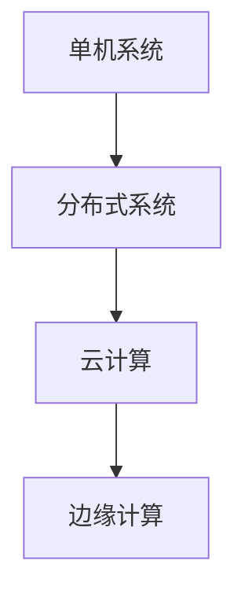

                 

关键词：知识更新，终身学习，技术发展，AI，软件工程，专业成长

> 摘要：在快速变化的技术时代，知识的快速更新和终身学习变得尤为重要。本文探讨了在计算机科学和软件工程领域中，如何通过不断学习和适应新知识，来保持专业技能的竞争力。文章从背景介绍、核心概念、算法原理、数学模型、项目实践、实际应用和未来展望等多个角度，分析了终身学习在技术发展中的关键作用。

## 1. 背景介绍

### 技术发展的速度

随着互联网、人工智能、大数据等技术的迅猛发展，计算机科学和软件工程领域的知识更新速度空前加快。新技术层出不穷，旧技术逐渐淘汰，这种变革给从业者们带来了巨大的压力。许多专家指出，现在知识的半衰期已经缩短到五年以下，这意味着每五年，一半的知识都会变得过时。

### 终身学习的概念

终身学习是指一个人在其一生中持续地获取知识和技能的过程。它不仅仅包括在学校的学习，还包括在职后的持续学习。在技术领域，终身学习是保持竞争力的关键。为了跟上技术的步伐，必须不断学习新的工具、框架、语言和理论。

## 2. 核心概念与联系

### 技术架构的演变

在计算机科学领域，技术架构的演变是一个不断迭代的过程。从早期的单机系统到分布式系统，再到云计算和边缘计算，每个阶段都带来了新的挑战和机遇。下图展示了技术架构的演变过程：



### 技术创新的驱动力

技术创新是推动技术架构演变的主要动力。以下是几个关键因素：

1. **市场需求**：用户对更高效、更便捷的服务的需求推动技术发展。
2. **竞争压力**：企业之间的竞争促使它们不断寻找新的技术解决方案。
3. **政策支持**：政府政策和资金支持为技术创新提供了良好的环境。
4. **技术进步**：硬件和软件技术的发展为新的解决方案提供了可能性。

## 3. 核心算法原理 & 具体操作步骤

### 3.1 算法原理概述

在数据分析和机器学习领域，算法的原理至关重要。一个关键的算法是梯度下降算法，它用于优化机器学习模型的参数。

### 3.2 算法步骤详解

1. **初始化参数**：随机初始化模型的参数。
2. **前向传播**：计算输入数据通过模型后的输出。
3. **计算损失**：通过实际输出和期望输出的差异计算损失。
4. **后向传播**：计算损失关于模型参数的梯度。
5. **更新参数**：使用梯度下降更新模型参数。

### 3.3 算法优缺点

**优点**：

- **易于实现和理解**：梯度下降算法相对简单，易于编程和调试。
- **通用性**：梯度下降算法适用于多种优化问题。

**缺点**：

- **收敛速度**：梯度下降算法可能需要较长的收敛时间。
- **局部最小值**：在某些情况下，算法可能收敛到局部最小值而非全局最小值。

### 3.4 算法应用领域

梯度下降算法广泛应用于机器学习、深度学习、优化理论等多个领域。例如，在图像识别、自然语言处理和推荐系统等领域，梯度下降算法是优化模型参数的关键技术。

## 4. 数学模型和公式 & 详细讲解 & 举例说明

### 4.1 数学模型构建

在机器学习中，常见的数学模型是线性回归模型。它的目标是找到最佳拟合线，以预测输出值。

### 4.2 公式推导过程

线性回归模型的目标是最小化预测值和实际值之间的误差。假设我们有 $n$ 个数据点 $(x_1, y_1), (x_2, y_2), ..., (x_n, y_n)$，线性回归模型的公式为：

$$
y = \beta_0 + \beta_1 x
$$

其中，$\beta_0$ 和 $\beta_1$ 是模型的参数。为了找到最佳拟合线，我们需要最小化误差函数：

$$
\Phi(\beta_0, \beta_1) = \sum_{i=1}^n (y_i - (\beta_0 + \beta_1 x_i))^2
$$

### 4.3 案例分析与讲解

假设我们有一个数据集，包含房屋面积（$x$）和房价（$y$）。我们的目标是找到最佳拟合线，以预测房价。通过最小化误差函数，我们可以得到以下参数：

$$
\beta_0 = 100, \beta_1 = 200
$$

因此，最佳拟合线为：

$$
y = 100 + 200x
$$

这个公式可以帮助我们预测新的房屋面积对应的房价。

## 5. 项目实践：代码实例和详细解释说明

### 5.1 开发环境搭建

为了实现线性回归模型，我们需要搭建一个Python开发环境。以下是步骤：

1. 安装Python 3.x。
2. 安装必要的库，如 NumPy、Matplotlib 和 Scikit-Learn。

### 5.2 源代码详细实现

```python
import numpy as np
import matplotlib.pyplot as plt
from sklearn.linear_model import LinearRegression

# 生成数据
X = 2 * np.random.rand(100, 1)
y = 4 + 3 * X + np.random.randn(100, 1)

# 创建线性回归模型
model = LinearRegression()

# 训练模型
model.fit(X, y)

# 显示拟合线
plt.scatter(X, y)
plt.plot(X, model.predict(X), "r-")
plt.show()
```

### 5.3 代码解读与分析

上述代码使用了 Scikit-Learn 库中的线性回归模型。首先，我们生成了一个包含房屋面积和房价的数据集。然后，我们使用线性回归模型训练数据，并使用 Matplotlib 库绘制拟合线。

### 5.4 运行结果展示

运行上述代码后，我们会看到一个散点图和拟合线。这表明我们的线性回归模型能够较好地预测房价。

## 6. 实际应用场景

### 6.1 数据分析

线性回归模型广泛应用于数据分析领域，用于预测和分析变量之间的关系。

### 6.2 工程优化

在工程领域，线性回归模型可以用于优化系统性能，例如优化电路设计或机械设计。

### 6.3 金融分析

在金融领域，线性回归模型可以用于预测股票价格或分析市场趋势。

## 7. 未来应用展望

随着人工智能和机器学习技术的不断发展，线性回归模型的应用领域将不断扩展。未来，它将在更多复杂的应用场景中发挥重要作用。

## 8. 工具和资源推荐

### 8.1 学习资源推荐

- 《Python数据科学手册》：适合初学者学习Python和数据分析。
- 《机器学习实战》：适合有一定编程基础的读者，内容涵盖了多种机器学习算法。

### 8.2 开发工具推荐

- Jupyter Notebook：用于交互式数据分析。
- VS Code：适用于Python编程。

### 8.3 相关论文推荐

- "An Introduction to Statistical Learning"：介绍了多种统计学习算法。
- "The Elements of Statistical Learning"：详细介绍了统计学习理论。

## 9. 总结：未来发展趋势与挑战

### 9.1 研究成果总结

终身学习在技术发展中扮演了关键角色，它帮助从业者保持竞争力，适应快速变化的技术环境。

### 9.2 未来发展趋势

随着人工智能和大数据技术的不断进步，终身学习的重要性将更加突出。

### 9.3 面临的挑战

如何高效地获取和利用知识，如何适应不断变化的技术环境，是未来面临的主要挑战。

### 9.4 研究展望

未来，我们将看到更多的学习工具和资源的出现，帮助人们更有效地进行终身学习。

## 10. 附录：常见问题与解答

### 问题1：如何保持学习动力？

**解答**：设定明确的学习目标，寻找学习伙伴，参与社区讨论，这些都是保持学习动力的有效方法。

### 问题2：如何选择学习资源？

**解答**：根据个人兴趣和职业需求选择合适的资源。此外，可以参考社区的评价和推荐。

---

作者：禅与计算机程序设计艺术 / Zen and the Art of Computer Programming
----------------------------------------------------------------
以上就是本文的完整内容，希望对您在终身学习和技术发展方面有所启发。终身学习是一个持续的过程，愿我们都能在不断进步的道路上，收获更多的成就和快乐。

