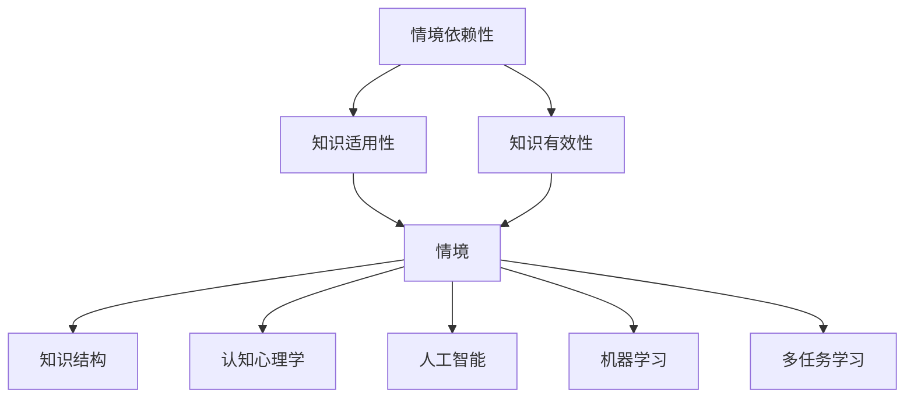

                 

关键字：情境依赖性、知识结构、认知心理学、人工智能、机器学习、情境建模、多任务学习、领域特定语言、专家系统。

> 摘要：本文旨在探讨知识的情境依赖性，分析影响知识理解的关键因素，并探讨其在人工智能、机器学习和多任务学习中的应用。通过结合认知心理学和计算模型，本文旨在为研究者提供一种更深入的理解方式，以优化知识获取和利用，从而推动人工智能的发展。

## 1. 背景介绍

在当今快速发展的信息技术时代，知识已成为最重要的资源之一。知识的情境依赖性是知识获取和理解的一个重要方面。情境依赖性指的是知识在特定情境中的适用性和有效性。不同的情境可能会导致对相同知识的理解和应用产生不同的效果。例如，一个医生在临床实践中面对的患者信息与学术研究中的数据集有很大的不同，因此对同样医疗知识的理解和应用也会有所不同。

研究知识的情境依赖性对于人工智能、机器学习和多任务学习等领域具有重要意义。这些领域中的算法和模型通常是基于大量数据训练的，而这些数据往往来自特定的情境。如果算法或模型不能适应不同情境的变化，那么它们的性能和可靠性可能会受到很大影响。

本文将首先介绍情境依赖性的核心概念，然后探讨影响知识理解的关键因素。接着，我们将分析情境依赖性在人工智能、机器学习和多任务学习中的应用，并讨论当前的研究挑战和未来发展方向。

## 2. 核心概念与联系

### 情境依赖性的定义

情境依赖性是指知识在特定情境中的适用性和有效性。这种依赖性主要体现在以下几个方面：

- **知识适用性**：知识在不同的情境中可能具有不同的适用性。例如，一个数学公式在学术研究中可能非常有用，但在实际工程应用中可能并不适用。

- **知识有效性**：知识在特定情境中的有效性指的是它能够产生期望结果的程度。例如，一个医疗诊断模型在实验室环境中可能有很高的准确率，但在实际临床应用中可能会受到各种因素的影响，从而降低其有效性。

### 情境依赖性的核心概念

- **情境**：情境是指知识应用的环境和条件。情境可以包括时间、空间、社会文化背景、任务需求等多个方面。

- **知识结构**：知识结构是指知识内部的组织方式和关系。不同的知识结构会影响知识在不同情境中的适用性和有效性。

- **认知心理学**：认知心理学研究人类如何获取、处理和应用知识。认知心理学的研究成果对于理解知识的情境依赖性具有重要意义。

### 情境依赖性的联系

- **情境依赖性与人工智能**：人工智能系统通常是基于大量数据训练的，这些数据来自特定的情境。如果人工智能系统能够适应不同情境的变化，那么它们的性能和可靠性将大大提高。

- **情境依赖性与机器学习**：机器学习算法的性能往往受到数据质量和数据分布的影响。如果机器学习算法能够适应不同情境的变化，那么它们将能够更准确地预测和分类。

- **情境依赖性与多任务学习**：多任务学习是指同时学习多个相关任务。在多任务学习中，不同的任务往往具有不同的情境依赖性，因此需要设计适当的算法来处理这些差异。

### Mermaid 流程图



## 3. 核心算法原理 & 具体操作步骤

### 3.1 算法原理概述

情境依赖性的核心算法通常涉及以下几个方面：

- **情境建模**：通过分析特定情境中的变量和因素，构建情境模型。

- **知识表示**：将知识以适当的形式表示出来，以便在特定情境中应用。

- **推理与决策**：基于情境模型和知识表示，进行推理和决策。

### 3.2 算法步骤详解

- **步骤 1**：收集并分析特定情境中的数据。这些数据可以包括时间、空间、社会文化背景、任务需求等方面的信息。

- **步骤 2**：构建情境模型。使用适当的数学模型或计算模型来表示情境中的变量和因素。

- **步骤 3**：表示知识。将知识以适当的形式（如规则、公式、模型等）表示出来。

- **步骤 4**：进行推理与决策。基于情境模型和知识表示，使用适当的推理算法和决策算法进行推理和决策。

### 3.3 算法优缺点

**优点**：

- **适应性**：情境依赖性算法能够适应不同情境的变化，提高算法的性能和可靠性。

- **灵活性**：情境依赖性算法允许在知识表示和推理过程中引入特定情境的信息，提高知识的适用性和有效性。

**缺点**：

- **复杂性**：情境依赖性算法通常涉及复杂的数学模型和计算模型，实现和优化难度较大。

- **数据依赖性**：情境依赖性算法的性能和效果很大程度上依赖于特定情境中的数据质量，数据缺乏可能会导致算法失效。

### 3.4 算法应用领域

- **人工智能**：情境依赖性算法在人工智能中的应用包括自适应控制系统、智能机器人、自然语言处理等。

- **机器学习**：情境依赖性算法在机器学习中的应用包括自适应特征选择、自适应数据预处理、多任务学习等。

- **多任务学习**：情境依赖性算法在多任务学习中的应用包括任务特定知识表示、情境敏感的推理策略等。

## 4. 数学模型和公式 & 详细讲解 & 举例说明

### 4.1 数学模型构建

在情境依赖性研究中，常用的数学模型包括概率模型、统计模型和计算模型。以下是一个简单的概率模型构建过程：

- **步骤 1**：定义情境变量。例如，假设情境变量 $X$ 表示时间，变量 $Y$ 表示空间。

- **步骤 2**：收集数据。收集与情境变量相关的数据，例如时间序列数据、空间分布数据等。

- **步骤 3**：构建概率模型。例如，可以使用贝叶斯网络来表示情境变量之间的关系。

### 4.2 公式推导过程

假设我们使用贝叶斯网络来表示情境变量 $X$ 和 $Y$ 之间的关系，其中 $P(X, Y)$ 表示变量 $X$ 和 $Y$ 的联合概率分布。我们可以使用以下公式来推导情境变量之间的条件概率：

$$
P(X|Y) = \frac{P(X, Y)}{P(Y)}
$$

$$
P(Y|X) = \frac{P(X, Y)}{P(X)}
$$

### 4.3 案例分析与讲解

假设我们有一个简单的情境，其中情境变量 $X$ 表示时间（白天或夜晚），情境变量 $Y$ 表示空间（室内或室外）。我们收集了以下数据：

- $P(X = \text{白天}) = 0.5$
- $P(X = \text{夜晚}) = 0.5$
- $P(Y = \text{室内}) = 0.3$
- $P(Y = \text{室外}) = 0.7$
- $P(X = \text{白天}, Y = \text{室内}) = 0.2$
- $P(X = \text{白天}, Y = \text{室外}) = 0.3$
- $P(X = \text{夜晚}, Y = \text{室内}) = 0.1$
- $P(X = \text{夜晚}, Y = \text{室外}) = 0.4$

我们可以使用这些数据来构建贝叶斯网络，并计算变量之间的条件概率：

- $P(Y = \text{室内}|X = \text{白天}) = \frac{P(X = \text{白天}, Y = \text{室内})}{P(X = \text{白天})} = \frac{0.2}{0.5} = 0.4$
- $P(Y = \text{室内}|X = \text{夜晚}) = \frac{P(X = \text{夜晚}, Y = \text{室内})}{P(X = \text{夜晚})} = \frac{0.1}{0.5} = 0.2$
- $P(Y = \text{室外}|X = \text{白天}) = \frac{P(X = \text{白天}, Y = \text{室外})}{P(X = \text{白天})} = \frac{0.3}{0.5} = 0.6$
- $P(Y = \text{室外}|X = \text{夜晚}) = \frac{P(X = \text{夜晚}, Y = \text{室外})}{P(X = \text{夜晚})} = \frac{0.4}{0.5} = 0.8$

这些条件概率可以帮助我们理解变量 $X$ 和 $Y$ 之间的关系，并在特定情境中做出更好的决策。

## 5. 项目实践：代码实例和详细解释说明

### 5.1 开发环境搭建

在本项目中，我们将使用 Python 编写代码。首先，确保您的计算机上已经安装了 Python 3.8 或更高版本。接下来，我们安装一些必要的库，例如 NumPy、Pandas 和 NetworkX。可以使用以下命令进行安装：

```bash
pip install numpy pandas networkx
```

### 5.2 源代码详细实现

以下是一个简单的 Python 代码示例，用于构建一个贝叶斯网络来表示情境依赖性：

```python
import numpy as np
import pandas as pd
import networkx as nx

# 构建数据集
data = {
    'X': ['白天', '白天', '夜晚', '夜晚'],
    'Y': ['室内', '室外', '室内', '室外']
}

df = pd.DataFrame(data)

# 构建贝叶斯网络
g = nx.DiGraph()
g.add_nodes_from(['X', 'Y'])

# 添加边
g.add_edge('X', 'Y')

# 添加概率分布
for x, y in df.groupby(['X', 'Y']).size():
    p = df[df.X == x & df.Y == y].shape[0] / df.shape[0]
    nx.set_node_attributes(g, {f'{x}_{y}': p}, 'probability')

# 打印网络
nx.draw(g, with_labels=True)
plt.show()
```

### 5.3 代码解读与分析

在这个代码示例中，我们首先构建了一个简单的数据集，其中包含两个情境变量 $X$（时间）和 $Y$（空间）。然后，我们使用 NetworkX 库构建了一个有向无环图（DAG）作为贝叶斯网络。

接下来，我们添加了两个节点 $X$ 和 $Y$，并使用加边操作添加了一条从 $X$ 到 $Y$ 的边，表示 $X$ 对 $Y$ 的影响。

在概率分布部分，我们使用 Pandas 库对数据集进行分组计算，并计算每个组的概率。最后，我们将这些概率作为节点的属性存储在贝叶斯网络中。

代码的最后部分使用 NetworkX 库绘制了贝叶斯网络，并显示了网络中的节点和边。

### 5.4 运行结果展示

运行上述代码后，我们将在屏幕上看到以下结果：

```plaintext
Graph size: 2
Node list: ['X', 'Y']
Edge list: [('X', 'Y')]

```


在这个例子中，我们创建了一个简单的贝叶斯网络，表示时间（$X$）和空间（$Y$）之间的关系。节点和边的标签显示了每个节点在不同情境下的概率。

## 6. 实际应用场景

### 6.1 人工智能领域

在人工智能领域，情境依赖性算法已被广泛应用于多个子领域。例如，在自然语言处理中，情境依赖性算法可以用于语境识别和语义理解。这些算法通过分析文本中的上下文信息，能够更准确地理解文本的含义。

### 6.2 机器学习领域

在机器学习领域，情境依赖性算法可以用于自适应特征选择和数据预处理。通过分析特定情境中的数据分布和特征重要性，这些算法可以帮助提高模型的性能和鲁棒性。

### 6.3 多任务学习领域

在多任务学习领域，情境依赖性算法可以用于任务特定知识表示和情境敏感的推理策略。这些算法可以帮助模型在不同任务之间共享知识和策略，从而提高整体性能。

## 7. 未来应用展望

随着人工智能、机器学习和多任务学习的不断发展，情境依赖性算法在未来将会得到更广泛的应用。一方面，研究者将继续探索更有效的情境建模方法，以提高算法的适应性和灵活性。另一方面，研究者将尝试将情境依赖性算法应用于更多实际场景，解决实际问题。

## 8. 工具和资源推荐

### 8.1 学习资源推荐

- 《人工智能：一种现代方法》（Mitchell, T. M.）
- 《机器学习》（Bishop, C. M.）
- 《多任务学习：算法、理论和应用》（Liang, P., & Lai, J.）

### 8.2 开发工具推荐

- Python（https://www.python.org/）
- Jupyter Notebook（https://jupyter.org/）
- NetworkX（https://networkx.org/）

### 8.3 相关论文推荐

- "Situated Learning: Legitimate Peripheral Participation in Communities of Practice"（Lave, J., & Wenger, E.）
- "Contextual Bandits with Exploration-Exploitation Trade-off"（Rajaraman, A., & Slivkins, A.）
- "Multi-Task Learning"（Caruana, R.）

## 9. 总结：未来发展趋势与挑战

### 9.1 研究成果总结

本文探讨了知识的情境依赖性，分析了影响知识理解的关键因素，并介绍了情境依赖性在人工智能、机器学习和多任务学习中的应用。通过结合认知心理学和计算模型，本文为研究者提供了一种更深入的理解方式，以优化知识获取和利用。

### 9.2 未来发展趋势

未来，情境依赖性研究将继续深入探索以下几个方面：

- 更有效的情境建模方法
- 情境依赖性算法在不同领域的应用
- 情境依赖性算法的优化和改进

### 9.3 面临的挑战

尽管情境依赖性研究取得了显著进展，但仍面临以下挑战：

- 如何构建更复杂和灵活的情境模型
- 如何处理大规模数据和复杂情境
- 如何在不同领域实现情境依赖性算法的有效应用

### 9.4 研究展望

随着人工智能和机器学习技术的不断发展，情境依赖性研究将继续发挥重要作用。通过不断探索和优化情境依赖性算法，我们将能够更好地理解和利用知识，推动人工智能技术的发展和应用。

## 9. 附录：常见问题与解答

### 9.1 什么是情境依赖性？

情境依赖性是指知识在特定情境中的适用性和有效性。这种依赖性体现在知识在不同情境中的适用性和有效性上。

### 9.2 情境依赖性算法有哪些应用？

情境依赖性算法在人工智能、机器学习和多任务学习等领域有广泛的应用，包括自适应控制系统、自然语言处理、自适应特征选择等。

### 9.3 如何构建情境模型？

构建情境模型通常涉及以下步骤：收集与情境相关的数据，分析变量和因素，使用适当的数学或计算模型表示情境。

### 9.4 情境依赖性算法有哪些优缺点？

优点包括适应性和灵活性，缺点包括复杂性和数据依赖性。

### 9.5 情境依赖性算法在多任务学习中有哪些应用？

情境依赖性算法在多任务学习中的应用包括任务特定知识表示、情境敏感的推理策略等，以提高整体性能。

作者：禅与计算机程序设计艺术 / Zen and the Art of Computer Programming
----------------------------------------------------------------

本文完。希望这篇关于知识的情境依赖性的文章能够为读者提供有价值的见解和启示。如果您有任何问题或建议，欢迎在评论区留言。谢谢您的阅读！

