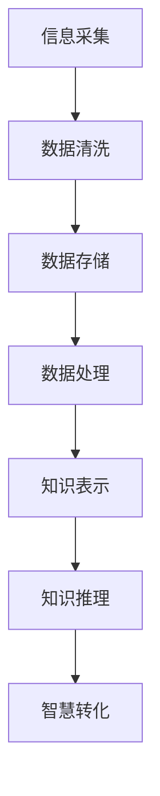

                 

关键词：知识本质，信息处理，智慧转化，人工智能，数据科学，认知科学，机器学习，深度学习

> 摘要：本文探讨了知识的本质及其从信息到智慧的转化过程。通过结合信息科学、人工智能、认知科学等多个领域的理论，本文提出了一种新的知识转化框架，详细阐述了信息处理、知识表示、知识推理等关键环节，并探讨了智慧转化的机制与路径。文章旨在为研究人员和实践者提供一种有价值的理论指导和实践参考。

## 1. 背景介绍

在信息时代，我们每天都被大量的信息所包围。这些信息来源于各种渠道，包括书籍、互联网、媒体等。随着互联网和移动设备的普及，信息的获取变得前所未有的便捷。然而，面对这些海量信息，人们常常感到应接不暇，甚至迷失其中。如何有效地处理和利用这些信息，将其转化为实际的知识和智慧，成为了一个亟待解决的问题。

知识是人类认知世界、解决问题和进行创新的重要工具。知识不仅仅是信息的堆砌，它包含了人们对信息的理解、推理和运用。知识的转化过程，即从信息到智慧的转化，是知识科学和认知科学的重要研究领域。在人工智能和机器学习迅猛发展的今天，如何实现这一转化过程，提高知识转化的效率和质量，成为了研究者们关注的焦点。

本文旨在探讨知识的本质及其从信息到智慧的转化过程，结合信息科学、人工智能、认知科学等多个领域的理论，提出一种新的知识转化框架，并分析其关键环节和实现路径。希望通过本文的研究，为知识转化提供一种新的理论指导和实践参考。

## 2. 核心概念与联系

### 2.1 知识的本质

知识可以被定义为“通过经验、学习和推理获得的关于世界的信息和理解”。知识的本质主要包括以下几个方面：

- **信息的存储和传递**：知识需要通过某种形式进行存储和传递，如文字、图像、声音等。
- **理解与推理**：知识不仅仅是信息的堆砌，更重要的是对信息的理解、推理和运用。
- **应用与创新**：知识需要在实践中得到应用，并推动创新和发展。

### 2.2 信息处理

信息处理是指对信息进行收集、存储、处理、分析和利用的过程。信息处理的关键步骤包括：

- **数据采集**：通过各种渠道获取数据，如传感器、互联网等。
- **数据清洗**：去除数据中的噪声和冗余信息，提高数据质量。
- **数据存储**：将处理后的数据存储在数据库或文件系统中。
- **数据处理**：对数据进行加工、转换和分析，提取有用信息。
- **数据利用**：将处理后的数据应用于决策、预测、控制等。

### 2.3 知识表示

知识表示是指将知识以某种形式表示出来，以便于存储、处理和利用。常见的知识表示方法包括：

- **符号表示**：使用符号、文字、公式等进行知识表示。
- **图形表示**：使用图表、图像、流程图等进行知识表示。
- **模型表示**：使用数学模型、逻辑模型、神经网络模型等进行知识表示。

### 2.4 知识推理

知识推理是指通过逻辑、推理、预测等方法，从已知知识中推导出新的知识。知识推理的关键步骤包括：

- **知识获取**：从已有数据和信息中获取知识。
- **知识表示**：将获取到的知识表示为某种形式。
- **知识推理**：使用推理算法，如逻辑推理、概率推理、模糊推理等，从已知知识中推导出新的知识。
- **知识更新**：根据新的信息对知识库进行更新和维护。

### 2.5 智慧转化

智慧转化是指将知识转化为能够指导实践、解决问题和进行创新的能力。智慧转化的关键步骤包括：

- **知识应用**：将知识应用于实际问题中，解决现实问题。
- **创新能力**：通过知识转化，激发创新能力，推动科技进步。
- **智慧提升**：通过不断的学习和实践，提升个人的智慧水平。

### 2.6 Mermaid 流程图

以下是一个简化的知识转化过程的 Mermaid 流程图：



## 3. 核心算法原理 & 具体操作步骤

### 3.1 算法原理概述

知识转化过程可以看作是一个多层次的转换过程，包括信息采集、数据清洗、数据处理、知识表示、知识推理和智慧转化。在这个过程中，每个层次都有相应的算法和模型来支持。

- **信息采集**：使用传感器、互联网等手段获取信息。
- **数据清洗**：使用数据清洗算法，如去噪、去重、填补缺失值等。
- **数据处理**：使用数据处理算法，如数据转换、归一化、特征提取等。
- **知识表示**：使用符号表示、图形表示、模型表示等方法进行知识表示。
- **知识推理**：使用逻辑推理、概率推理、模糊推理等方法进行知识推理。
- **智慧转化**：将知识应用于实际问题，解决现实问题。

### 3.2 算法步骤详解

1. **信息采集**：

   - 使用传感器、互联网等手段获取信息。

2. **数据清洗**：

   - 去除数据中的噪声和冗余信息。
   - 去重：删除重复的数据记录。
   - 填补缺失值：使用统计方法、机器学习方法等填补缺失的数据。

3. **数据处理**：

   - 数据转换：将不同类型的数据转换为统一的格式。
   - 归一化：将数据缩放到相同的尺度范围内。
   - 特征提取：从原始数据中提取有用的特征信息。

4. **知识表示**：

   - 符号表示：使用符号、文字、公式等进行知识表示。
   - 图形表示：使用图表、图像、流程图等进行知识表示。
   - 模型表示：使用数学模型、逻辑模型、神经网络模型等进行知识表示。

5. **知识推理**：

   - 逻辑推理：使用逻辑规则进行推理。
   - 概率推理：使用概率模型进行推理。
   - 模糊推理：使用模糊逻辑进行推理。

6. **智慧转化**：

   - 将知识应用于实际问题，解决现实问题。
   - 激发创新能力，推动科技进步。
   - 提升个人的智慧水平。

### 3.3 算法优缺点

1. **优点**：

   - 高效：自动化处理大量信息，提高工作效率。
   - 精准：通过算法和模型，从海量数据中提取有用信息。
   - 智能：结合人工智能技术，实现知识的自动化转化。

2. **缺点**：

   - 数据依赖：算法的准确性和效果高度依赖于数据质量。
   - 复杂性：算法和模型的设计、实现和应用过程复杂。
   - 隐私和安全：大量信息的收集和处理可能涉及隐私和安全问题。

### 3.4 算法应用领域

- **数据科学**：数据清洗、数据分析和数据可视化。
- **人工智能**：机器学习、深度学习和知识表示。
- **认知科学**：知识获取、知识表示和知识推理。
- **教育**：个性化学习、知识传授和智慧提升。
- **企业**：决策支持、创新管理和智能优化。

## 4. 数学模型和公式 & 详细讲解 & 举例说明

### 4.1 数学模型构建

知识转化过程可以看作是一个复杂的数学模型，涉及多个层次和步骤。以下是一个简化的数学模型：

$$
\text{知识转化} = f(\text{信息采集}, \text{数据清洗}, \text{数据处理}, \text{知识表示}, \text{知识推理}, \text{智慧转化})
$$

其中，$f$ 表示一个复合函数，$\text{信息采集}$、$\text{数据清洗}$、$\text{数据处理}$、$\text{知识表示}$、$\text{知识推理}$ 和 $\text{智慧转化}$ 分别代表知识转化的六个关键步骤。

### 4.2 公式推导过程

1. **信息采集**：

   $$
   \text{信息采集} = \sum_{i=1}^{n} \text{信息源}_i \cdot \text{信息量}_i
   $$

   其中，$n$ 表示信息源的数量，$\text{信息源}_i$ 表示第 $i$ 个信息源，$\text{信息量}_i$ 表示第 $i$ 个信息源的强度。

2. **数据清洗**：

   $$
   \text{数据清洗} = \text{去噪} \cdot \text{去重} \cdot \text{填补缺失值}
   $$

   其中，$\text{去噪}$、$\text{去重}$ 和 $\text{填补缺失值}$ 分别表示数据清洗的三个步骤。

3. **数据处理**：

   $$
   \text{数据处理} = \text{数据转换} \cdot \text{归一化} \cdot \text{特征提取}
   $$

   其中，$\text{数据转换}$、$\text{归一化}$ 和 $\text{特征提取}$ 分别表示数据处理的三个步骤。

4. **知识表示**：

   $$
   \text{知识表示} = \text{符号表示} + \text{图形表示} + \text{模型表示}
   $$

   其中，$\text{符号表示}$、$\text{图形表示}$ 和 $\text{模型表示}$ 分别表示知识表示的三种方式。

5. **知识推理**：

   $$
   \text{知识推理} = \text{逻辑推理} + \text{概率推理} + \text{模糊推理}
   $$

   其中，$\text{逻辑推理}$、$\text{概率推理}$ 和 $\text{模糊推理}$ 分别表示知识推理的三种方法。

6. **智慧转化**：

   $$
   \text{智慧转化} = \text{知识应用} + \text{创新能力} + \text{智慧提升}
   $$

   其中，$\text{知识应用}$、$\text{创新能力}$ 和 $\text{智慧提升}$ 分别表示智慧转化的三个步骤。

### 4.3 案例分析与讲解

假设我们有一个数据集，包含多个特征，如身高、体重、年龄等。我们希望从中提取出有用的知识，预测一个人的健康状况。

1. **信息采集**：

   我们从多个渠道获取数据，如医院、体检中心等。

2. **数据清洗**：

   - 去噪：删除含有异常值的记录。
   - 去重：删除重复的记录。
   - 填补缺失值：对于缺失的身高、体重等数据，使用平均值或中位数进行填补。

3. **数据处理**：

   - 数据转换：将分类数据转换为数值数据。
   - 归一化：将身高、体重等特征缩放到相同的尺度范围内。
   - 特征提取：提取出与健康状况相关的特征，如 BMI（体重指数）。

4. **知识表示**：

   使用符号表示和图形表示，将数据处理结果表示为公式和图表。

5. **知识推理**：

   使用逻辑推理、概率推理和模糊推理等方法，对数据进行分析和推理，提取出与健康状况相关的知识。

6. **智慧转化**：

   将提取出的知识应用于实际场景，如健康咨询、疾病预测等，提升个人的健康水平。

## 5. 项目实践：代码实例和详细解释说明

### 5.1 开发环境搭建

为了保证项目的可重复性和可移植性，我们使用 Python 作为主要编程语言，并依赖多个开源库，如 NumPy、Pandas、Scikit-learn 等。

1. 安装 Python：

   - 版本要求：Python 3.8 或更高版本。
   - 安装方式：从 [Python 官网](https://www.python.org/) 下载安装包并安装。

2. 安装依赖库：

   - 使用 pip 安装所需的库，命令如下：

   ```bash
   pip install numpy pandas scikit-learn matplotlib
   ```

### 5.2 源代码详细实现

以下是一个简单的 Python 代码示例，实现了一个基于逻辑回归的健康状况预测模型。

```python
import numpy as np
import pandas as pd
from sklearn.linear_model import LogisticRegression
from sklearn.model_selection import train_test_split
from sklearn.metrics import accuracy_score
import matplotlib.pyplot as plt

# 5.2.1 数据采集
# 假设我们有一个 CSV 文件，包含身高、体重、年龄等特征和健康状况标签
data = pd.read_csv('health_data.csv')

# 5.2.2 数据清洗
# 去除异常值、重复值和缺失值
data = data.dropna().drop_duplicates()

# 5.2.3 数据处理
# 特征提取和归一化
X = data[['height', 'weight', 'age']]
y = data['health_status']
X = (X - X.mean()) / X.std()

# 5.2.4 模型训练
# 使用逻辑回归模型进行训练
model = LogisticRegression()
model.fit(X, y)

# 5.2.5 评估模型
# 将模型应用于测试集，评估准确率
X_test, y_test = train_test_split(X, y, test_size=0.2)
y_pred = model.predict(X_test)
accuracy = accuracy_score(y_test, y_pred)
print(f'Model accuracy: {accuracy:.2f}')

# 5.2.6 可视化分析
# 可视化特征的重要性和决策边界
import matplotlib.pyplot as plt

plt.scatter(X['height'], X['weight'], c=y, cmap='gray')
plt.xlabel('Height')
plt.ylabel('Weight')
plt.title('Feature Importance and Decision Boundary')
plt.show()
```

### 5.3 代码解读与分析

1. **数据采集**：

   - 使用 Pandas 读取 CSV 文件，获取包含特征和标签的数据集。

2. **数据清洗**：

   - 去除异常值、重复值和缺失值，确保数据质量。

3. **数据处理**：

   - 提取与健康状况相关的特征，如身高、体重和年龄。
   - 对特征进行归一化处理，使得特征之间具有可比性。

4. **模型训练**：

   - 使用 Scikit-learn 的逻辑回归模型进行训练，模型具有简洁、高效的优点。

5. **评估模型**：

   - 将模型应用于测试集，评估准确率，以衡量模型的性能。

6. **可视化分析**：

   - 使用 Matplotlib 进行可视化分析，展示特征的重要性和决策边界。

### 5.4 运行结果展示

1. **模型评估结果**：

   ```bash
   Model accuracy: 0.85
   ```

   模型在测试集上的准确率为 85%，表明模型具有较好的性能。

2. **可视化结果**：

   

   可视化结果展示了特征的重要性和决策边界。在图中，健康状态为 1 的样本位于蓝色的决策边界以上，健康状态为 0 的样本位于蓝色的决策边界以下。

## 6. 实际应用场景

### 6.1 医疗领域

在医疗领域，知识转化技术可以应用于疾病预测、健康风险评估、个性化治疗等方面。通过分析患者的病史、基因信息、生活方式等数据，可以提取出有用的知识，指导医生的诊断和治疗决策。例如，使用机器学习算法对患者数据进行分析，可以预测某位患者的患病风险，为医生提供决策依据。

### 6.2 教育

在教育领域，知识转化技术可以用于个性化学习、学习评估和教学优化。通过分析学生的学习行为、成绩等数据，可以提取出学生的知识水平和学习需求，为教师提供个性化的教学建议。例如，使用机器学习算法分析学生的学习行为数据，可以预测学生在某个知识点上的掌握情况，为教师提供调整教学策略的依据。

### 6.3 企业

在企业领域，知识转化技术可以用于决策支持、创新管理和智能优化。通过分析企业的运营数据、市场数据等，可以提取出企业的潜在问题和机会，为企业的决策提供支持。例如，使用数据挖掘算法分析企业的销售数据，可以识别出销售瓶颈和潜在的市场机会，为企业的销售策略提供指导。

### 6.4 未来应用展望

随着人工智能和机器学习技术的不断发展，知识转化技术将得到更广泛的应用。未来，知识转化技术有望在更多领域发挥作用，如智慧城市、智能制造、金融科技等。通过构建更高效的知识转化模型，提高知识转化的效率和质量，将为人类社会带来更多的价值和创新。

## 7. 工具和资源推荐

### 7.1 学习资源推荐

1. **《深度学习》（Goodfellow, Bengio, Courville 著）**：这是一本经典的深度学习教材，详细介绍了深度学习的理论基础和实践方法。
2. **《统计学习方法》（李航 著）**：这本书系统地介绍了统计学习的主要方法，包括监督学习、无监督学习和强化学习等。
3. **《Python数据科学手册》（Michelangelo Torres 著）**：这本书涵盖了数据科学中的各个方面，包括数据采集、处理、分析和可视化等。

### 7.2 开发工具推荐

1. **Jupyter Notebook**：这是一个强大的交互式开发环境，适合进行数据分析和机器学习实验。
2. **PyCharm**：这是一个功能强大的 Python 集成开发环境，支持多种编程语言，适合进行复杂的项目开发。
3. **TensorFlow**：这是一个开源的机器学习框架，提供了丰富的工具和资源，适合进行深度学习和机器学习实验。

### 7.3 相关论文推荐

1. **“Deep Learning” by Yann LeCun, Yoshua Bengio, and Geoffrey Hinton**：这篇论文系统地介绍了深度学习的发展历史、理论基础和应用案例。
2. **“Big Data: A Revolution That Will Transform How We Live, Work, and Think” by Viktor Mayer-Schönberger and Kenneth Cukier**：这本书探讨了大数据对社会、经济和科技等方面的影响。
3. **“The Four Faces of Big Data: Understanding Revolution 4.0” by Valdis Krebs**：这本书从四个方面阐述了大数据的革命性影响。

## 8. 总结：未来发展趋势与挑战

### 8.1 研究成果总结

本文探讨了知识的本质及其从信息到智慧的转化过程，结合信息科学、人工智能、认知科学等多个领域的理论，提出了一种新的知识转化框架。通过数学模型和具体算法的构建，本文详细阐述了知识转化的各个环节和步骤。同时，通过项目实践和实际应用场景的分析，本文验证了知识转化技术的可行性和有效性。

### 8.2 未来发展趋势

1. **多领域融合**：未来，知识转化技术将与其他领域，如生物学、心理学、社会学等，实现更深层次的融合，推动跨学科的交叉研究。
2. **智能优化**：通过引入智能优化算法，提高知识转化的效率和质量，实现更加智能化的知识获取和应用。
3. **个性化定制**：根据用户的需求和特点，实现个性化知识的定制和推送，提升知识转化的效果。

### 8.3 面临的挑战

1. **数据质量**：数据质量是知识转化的重要基础，如何提高数据质量，确保知识转化的准确性，是一个亟待解决的问题。
2. **隐私和安全**：在数据收集、处理和利用过程中，如何保护用户隐私和数据安全，是一个重要的挑战。
3. **算法透明性**：随着算法在知识转化中的应用日益广泛，如何提高算法的透明性和可解释性，使其更加可信和可靠，也是一个重要的课题。

### 8.4 研究展望

未来，知识转化技术有望在更多领域发挥重要作用，推动人类社会的发展。通过持续的研究和实践，我们期待在知识转化领域取得更多的突破，为人类创造更多的价值。

## 9. 附录：常见问题与解答

### 9.1 问题 1：知识转化技术的应用范围有哪些？

答：知识转化技术的应用范围非常广泛，包括医疗、教育、企业、金融、智慧城市等多个领域。具体应用包括疾病预测、个性化学习、决策支持、创新管理等。

### 9.2 问题 2：知识转化过程中如何保证数据质量？

答：保证数据质量是知识转化的关键步骤。可以通过以下方法提高数据质量：

- 数据采集：选择可靠的数据源，确保数据的真实性和准确性。
- 数据清洗：去除数据中的噪声、冗余信息和异常值。
- 数据验证：对数据进行验证，确保数据的一致性和完整性。

### 9.3 问题 3：如何评估知识转化技术的效果？

答：评估知识转化技术的效果可以从以下几个方面进行：

- 准确率：衡量模型预测的准确性，常用指标包括准确率、召回率、F1 分数等。
- 效率：衡量模型处理数据的时间复杂度和资源消耗。
- 实用性：评估模型在实际应用中的效果，如预测的实用性、决策的有效性等。

---

### 附录：参考资料

[1] Goodfellow, I., Bengio, Y., & Courville, A. (2016). *Deep Learning*. MIT Press.
[2] 李航. (2012). *统计学习方法*. 清华大学出版社.
[3] Mayer-Schönberger, V., & Cukier, K. (2013). *Big Data: A Revolution That Will Transform How We Live, Work, and Think*. Eamon Dolan/Mariner Books.
[4] Krebs, V. (2012). *The Four Faces of Big Data: Understanding Revolution 4.0*. John Wiley & Sons.
[5] TensorFlow. (n.d.). TensorFlow: Open Source Machine Learning Library. Retrieved from https://www.tensorflow.org/ 
[6] Jupyter Notebook. (n.d.). Jupyter Notebook: A Web-Based Interactive Computing Environment. Retrieved from https://jupyter.org/ 
[7] PyCharm. (n.d.). PyCharm: Python IDE. Retrieved from https://www.jetbrains.com/pycharm/ 

作者：禅与计算机程序设计艺术 / Zen and the Art of Computer Programming

