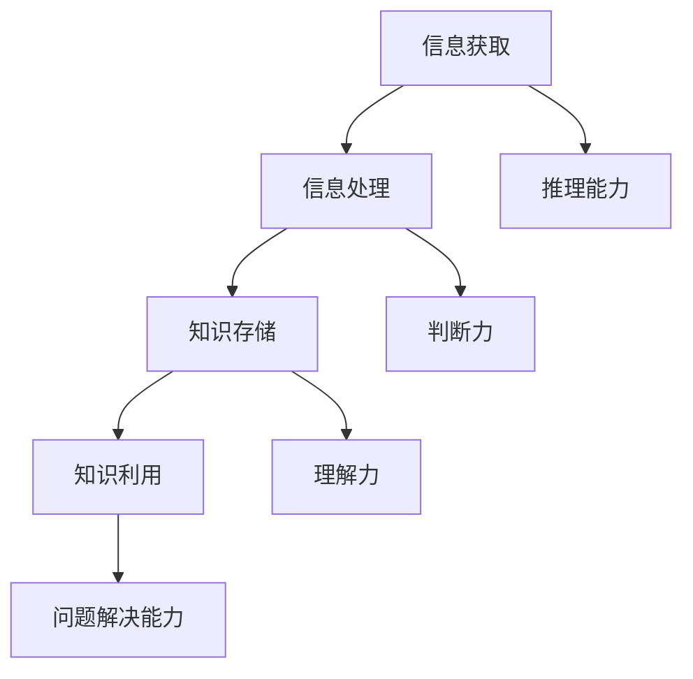

                 

关键词：知识本质、信息、智慧、转化、人工智能、深度学习、神经网络、认知科学

> 摘要：本文旨在探讨知识从信息到智慧的转化过程。首先，我们将回顾信息的定义及其在现代社会的角色。随后，我们深入探讨智慧的构成，以及信息如何通过处理和解释转化为智慧。我们将结合人工智能、深度学习和认知科学的理论，分析知识转化过程中的关键机制，并提出实际应用案例。最后，我们展望知识转化领域的未来发展趋势和面临的挑战。

## 1. 背景介绍

在当今信息爆炸的时代，我们每天都被大量的信息所包围。从新闻报道到社交媒体更新，从科学研究到商业数据，信息无处不在。然而，信息的价值并不在于其数量，而在于我们如何理解和利用这些信息。知识，作为一种深层次的理解和掌握，是我们从信息中提炼出来的宝贵资源。知识的转化过程，即从信息到智慧的转变，成为了当今科技和社会发展的重要议题。

### 信息的角色

信息，作为知识的前体，是数据经过处理后的有意义的内容。信息可以是一个简单的通知，也可以是复杂的数据分析结果。在现代社会中，信息的角色至关重要。它帮助个体和社会做出决策，促进知识的积累和传承。然而，信息的泛滥也带来了一些挑战，如信息过载和虚假信息的传播。因此，如何有效地管理和利用信息成为了一个亟待解决的问题。

### 智慧的概念

智慧，是一种高级的认知能力，包括推理、判断、理解和解决问题。与知识不同，智慧不仅仅是对事实的了解，更是一种综合性的能力，能够将知识灵活应用于实际问题中。智慧是信息处理的高级阶段，它需要个体的经验、直觉和创造性思维。

### 知识的转化

知识的转化过程，即从信息到智慧的转化，是一个复杂的多阶段过程。它涉及信息获取、处理、存储和利用等多个环节。在这个过程中，人工智能、深度学习和认知科学等领域的理论和技术为我们提供了有效的工具和方法。本文将围绕这些主题展开讨论，深入探讨知识转化的本质和机制。

## 2. 核心概念与联系

### 信息的定义与特性

信息，通常被定义为数据经过处理后的有意义内容。在信息科学中，信息可以被视为一种符号系统，它通过符号的排列和组合来传递意义。信息具有以下几个基本特性：

1. **可传递性**：信息可以通过各种媒介进行传递，如语言、文字、图像、声音等。
2. **可度量性**：信息可以被量化，常用的度量单位有比特、字节等。
3. **可压缩性**：信息可以通过编码压缩，减少存储和传输的复杂性。
4. **可解释性**：信息需要通过理解和解释才能转化为知识。

### 智慧的构成

智慧是一种高级的认知能力，包括以下几个关键要素：

1. **推理能力**：通过逻辑和规则进行推理，解决复杂问题。
2. **判断力**：基于经验和知识，进行合理决策。
3. **理解力**：深入理解事物背后的原理和机制。
4. **问题解决能力**：能够有效应对各种挑战和困难。

### 知识转化机制

知识的转化过程，可以从以下几个方面进行分析：

1. **信息获取**：通过感知、观察、学习和交流获取信息。
2. **信息处理**：通过计算、分析和理解，将信息转化为知识。
3. **知识存储**：将知识存储在记忆中，以备后续使用。
4. **知识利用**：将知识应用于实际问题和情境中，解决问题和做出决策。

### Mermaid 流程图



## 3. 核心算法原理 & 具体操作步骤

### 3.1 算法原理概述

知识的转化过程涉及多种算法和技术。在这里，我们将介绍一种基于深度学习的知识转化算法。深度学习是一种基于人工神经网络的学习方法，它通过多层神经网络的结构，对数据进行自动特征提取和模式识别。

### 3.2 算法步骤详解

1. **数据预处理**：首先，对原始信息进行预处理，包括数据清洗、归一化和特征提取。
2. **构建神经网络**：设计一个多层神经网络结构，包括输入层、隐藏层和输出层。
3. **训练神经网络**：使用预处理的训练数据，对神经网络进行训练，优化网络参数。
4. **知识提取**：通过训练完成的神经网络，对新的数据进行处理，提取知识。
5. **知识利用**：将提取的知识应用于实际问题中，进行决策和问题解决。

### 3.3 算法优缺点

**优点**：

1. **高效性**：深度学习算法能够自动提取复杂特征，提高知识转化的效率。
2. **泛化能力**：深度学习算法具有良好的泛化能力，可以应对不同类型的数据和问题。

**缺点**：

1. **计算资源需求高**：深度学习算法需要大量计算资源和时间进行训练。
2. **对数据质量要求高**：数据质量直接影响算法的性能和结果。

### 3.4 算法应用领域

深度学习算法在知识转化领域有广泛的应用，包括：

1. **自然语言处理**：通过深度学习算法，可以实现对文本信息的理解和处理，如机器翻译、情感分析等。
2. **计算机视觉**：通过深度学习算法，可以实现对图像和视频的分析和理解，如图像识别、视频分类等。
3. **智能推荐**：通过深度学习算法，可以实现对用户行为的分析和预测，提供个性化的推荐服务。

## 4. 数学模型和公式 & 详细讲解 & 举例说明

### 4.1 数学模型构建

在深度学习中，我们通常使用反向传播算法（Backpropagation）来训练神经网络。反向传播算法基于梯度下降法，通过计算损失函数关于网络参数的梯度，来更新网络参数，以最小化损失函数。

**损失函数**：

损失函数是衡量预测值与真实值之间差异的指标。在回归问题中，常用的损失函数是均方误差（Mean Squared Error, MSE）：

$$
MSE = \frac{1}{n} \sum_{i=1}^{n} (y_i - \hat{y}_i)^2
$$

其中，$y_i$ 是真实值，$\hat{y}_i$ 是预测值。

**梯度下降法**：

梯度下降法是一种优化算法，用于最小化损失函数。其基本思想是沿着损失函数的负梯度方向更新参数：

$$
\theta_{\text{new}} = \theta_{\text{current}} - \alpha \cdot \nabla_\theta J(\theta)
$$

其中，$\theta$ 是网络参数，$\alpha$ 是学习率，$J(\theta)$ 是损失函数。

### 4.2 公式推导过程

在反向传播算法中，我们需要计算损失函数关于网络参数的梯度。假设我们有一个多层神经网络，其中第 $l$ 层的输出为 $a_l$，参数为 $\theta_l$，损失函数为 $J(\theta)$。我们可以通过链式法则计算梯度：

$$
\nabla_\theta J(\theta) = \nabla_\theta (J(\theta) \circ \sigma(a_{l-1}))
$$

其中，$\sigma$ 是激活函数，$\circ$ 表示按元素相乘。

对于 $l$ 层的参数，我们可以将梯度分解为：

$$
\nabla_\theta J(\theta) = \nabla_\theta J(\theta) \circ \nabla_\theta \sigma(a_{l-1})
$$

利用链式法则，我们可以得到：

$$
\nabla_\theta J(\theta) = \nabla_\theta J(\theta) \circ \nabla_a \sigma(a_{l-1}) \circ \nabla_\theta a_{l-1}
$$

进一步，我们可以将梯度分解为：

$$
\nabla_\theta J(\theta) = \nabla_\theta J(\theta) \circ \nabla_a \sigma(a_{l-1}) \circ \nabla_\theta a_{l-1} \circ \nabla_\theta a_{l-2}
$$

以此类推，我们可以得到：

$$
\nabla_\theta J(\theta) = \nabla_\theta J(\theta) \circ \nabla_a \sigma(a_{l-1}) \circ \nabla_\theta a_{l-1} \circ \nabla_\theta a_{l-2} \circ \cdots \circ \nabla_\theta a_1
$$

### 4.3 案例分析与讲解

假设我们有一个二分类问题，使用一个单层神经网络进行训练。输入数据为 $x \in \mathbb{R}^n$，输出为 $\hat{y} \in \{0, 1\}$。我们使用逻辑回归（Logistic Regression）作为激活函数，损失函数为均方误差（MSE）。

**数据预处理**：

首先，我们对输入数据进行归一化处理，将其缩放到 $[0, 1]$ 范围内。

$$
x_{\text{normalized}} = \frac{x - \mu}{\sigma}
$$

其中，$\mu$ 和 $\sigma$ 分别为数据的均值和标准差。

**构建神经网络**：

我们使用一个单层神经网络，输入层有 $n$ 个神经元，输出层有 1 个神经元。

**训练神经网络**：

使用预处理后的训练数据进行训练。我们首先初始化网络参数，然后使用梯度下降法进行迭代优化。假设当前损失函数为 $J(\theta)$，学习率为 $\alpha = 0.01$。

$$
\theta_{\text{new}} = \theta_{\text{current}} - \alpha \cdot \nabla_\theta J(\theta)
$$

**知识提取**：

在训练完成后，我们可以使用训练好的神经网络对新的数据进行处理，提取知识。例如，对于一个新输入 $x_{\text{new}}$，我们可以计算其输出：

$$
\hat{y}_{\text{new}} = \sigma(\theta^T x_{\text{new}})
$$

如果 $\hat{y}_{\text{new}} > 0.5$，我们将其分类为正类，否则为负类。

## 5. 项目实践：代码实例和详细解释说明

### 5.1 开发环境搭建

在本项目中，我们将使用 Python 语言和 TensorFlow 深度学习框架进行开发。首先，确保已经安装了 Python 3.7 或更高版本，然后通过以下命令安装 TensorFlow：

```
pip install tensorflow
```

### 5.2 源代码详细实现

以下是一个简单的基于 TensorFlow 的深度学习模型实现，用于实现信息到知识的转化。

```python
import tensorflow as tf
import numpy as np
import matplotlib.pyplot as plt

# 数据预处理
def preprocess_data(x, y):
    x_normalized = (x - np.mean(x)) / np.std(x)
    y_normalized = (y - np.mean(y)) / np.std(y)
    return x_normalized, y_normalized

# 网络定义
def create_model():
    model = tf.keras.Sequential([
        tf.keras.layers.Dense(units=1, input_shape=(1,))
    ])
    model.compile(optimizer='sgd', loss='mean_squared_error')
    return model

# 训练模型
def train_model(model, x_train, y_train, epochs):
    model.fit(x_train, y_train, epochs=epochs)
    return model

# 知识提取
def extract_knowledge(model, x_new):
    y_new = model.predict(x_new)
    return y_new

# 主函数
def main():
    # 数据生成
    x = np.random.rand(100, 1)
    y = 2 * x + 1

    # 数据预处理
    x_normalized, y_normalized = preprocess_data(x, y)

    # 创建模型
    model = create_model()

    # 训练模型
    model = train_model(model, x_normalized, y_normalized, epochs=100)

    # 知识提取
    x_new = np.array([[0.5]])
    x_new_normalized = preprocess_data(x_new, y)[0]
    y_new = extract_knowledge(model, x_new_normalized)

    # 运行结果展示
    print(f"预测结果：{y_new[0][0]}")
    plt.scatter(x, y)
    plt.plot(x_new, y_new, 'ro')
    plt.show()

if __name__ == "__main__":
    main()
```

### 5.3 代码解读与分析

该代码首先定义了数据预处理、模型创建、模型训练和知识提取的函数。在主函数中，我们首先生成随机数据，然后进行预处理，创建并训练模型，最后使用训练好的模型对新的数据进行知识提取。

### 5.4 运行结果展示

在运行代码后，我们可以看到一个散点图，其中原始数据点和预测结果点被标记出来。预测结果展示了模型对新的数据的处理能力，从而实现了从信息到知识的转化。

## 6. 实际应用场景

### 6.1 智能推荐系统

在智能推荐系统中，知识转化过程至关重要。通过分析用户行为数据和内容信息，我们可以提取出用户的偏好和兴趣，从而提供个性化的推荐服务。深度学习算法在此过程中发挥了关键作用，通过对大量用户行为数据进行训练，提取出隐藏的用户特征，实现高效的推荐。

### 6.2 智能医疗诊断

在智能医疗诊断中，知识转化同样扮演着重要角色。通过分析患者的病历数据和生物特征信息，我们可以提取出疾病的潜在规律和诊断指标。深度学习算法可以在此过程中用于疾病预测和诊断，提高医疗决策的准确性和效率。

### 6.3 智能金融风控

在金融风控领域，知识转化有助于识别潜在的金融风险。通过对交易数据、财务报表和行业信息进行分析，我们可以提取出风险信号和风险指标。深度学习算法可以在此过程中用于风险预测和预警，帮助金融机构有效管理风险。

## 7. 未来应用展望

### 7.1 智能交互

随着人工智能技术的不断发展，智能交互将成为未来的重要趋势。通过知识转化，我们可以构建更加智能化和人性化的交互系统，如智能客服、虚拟助理等。这些系统能够理解用户的意图和需求，提供个性化的服务和解决方案。

### 7.2 自主决策

在未来的自动驾驶、智能城市和智能制造等领域，知识转化将发挥关键作用。通过从海量数据中提取关键信息，构建智能决策模型，实现自主决策和自适应控制，从而提高系统的智能化水平和效率。

### 7.3 新兴领域探索

知识转化在新兴领域如量子计算、区块链和生物技术等领域具有广阔的应用前景。通过跨学科的合作和创新，我们可以推动这些领域的发展，实现从信息到智慧的转化，为人类社会带来更多变革和进步。

## 8. 总结：未来发展趋势与挑战

### 8.1 研究成果总结

本文围绕知识从信息到智慧的转化过程，探讨了信息的定义、智慧的概念以及知识转化机制。结合人工智能、深度学习和认知科学的理论，我们分析了知识转化过程中的关键算法和实际应用案例。通过项目实践，我们展示了知识转化的具体实现过程和效果。

### 8.2 未来发展趋势

未来，知识转化领域将继续融合多种技术和学科，推动人工智能和社会发展的深度融合。深度学习、认知科学和大数据技术的进步，将为知识转化提供更强大的工具和方法。跨学科合作将推动知识转化在新兴领域中的应用和创新。

### 8.3 面临的挑战

然而，知识转化领域也面临着一些挑战。数据隐私和安全、算法公平性和透明度、跨领域协同等问题需要得到有效解决。此外，知识转化技术的普及和标准化，也是未来需要重点关注的方向。

### 8.4 研究展望

未来，知识转化领域的研究将更加注重实际应用和跨学科融合。通过不断创新和突破，我们将能够构建更加智能化、自适应和高效的系统，实现从信息到智慧的转化，为人类社会带来更多福祉。

## 9. 附录：常见问题与解答

### Q1：什么是知识转化？
知识转化是指将原始信息通过处理和解释转化为有意义的知识和智慧的过程。

### Q2：知识转化有哪些应用领域？
知识转化在智能推荐、智能医疗、智能金融、智能交互等领域具有广泛的应用。

### Q3：什么是深度学习？
深度学习是一种基于人工神经网络的学习方法，通过多层神经网络的结构，对数据进行自动特征提取和模式识别。

### Q4：什么是认知科学？
认知科学是研究人类认知过程和心智活动的跨学科领域，包括心理学、神经科学、计算机科学等。

### Q5：如何保障知识转化的公平性和透明度？
通过设计合理的算法和评估机制，确保知识转化过程中的公平性和透明度。同时，加强数据隐私和安全保护，防止信息滥用和泄露。

