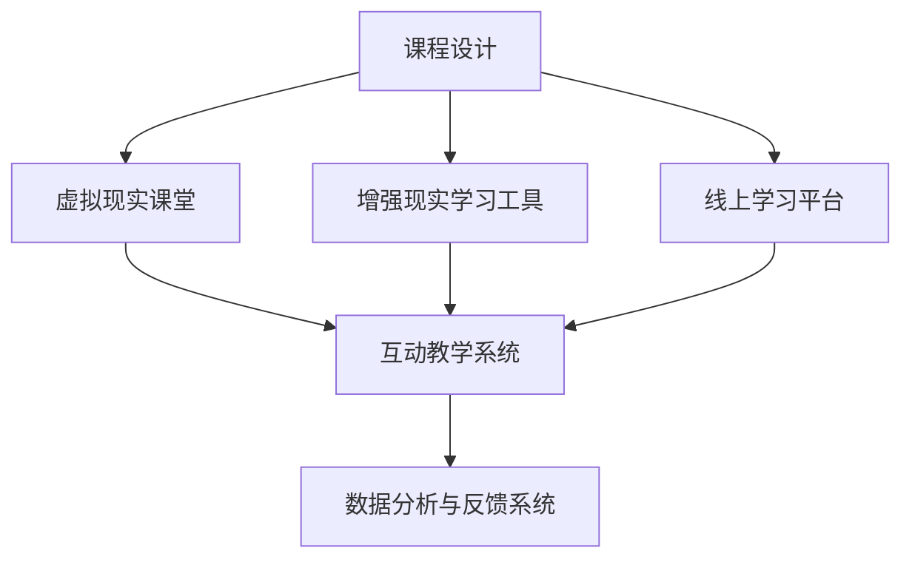

                 

### 关键词：混合现实，线上线下学习，教育技术，认知科学，虚拟现实，增强现实，数字化学习，互动学习，智慧校园。

> **摘要：**
本文探讨了知识的混合现实应用，特别是线上线下学习融合的模式。通过深入分析混合现实技术在教育领域的应用，探讨了其优势、挑战以及未来的发展方向。文章结合实际案例，提供了详细的数学模型、算法原理以及项目实践，为教育技术的创新提供了新思路。

## 1. 背景介绍

在信息技术飞速发展的今天，教育领域正经历着深刻的变革。传统的课堂教学模式已经难以满足个性化、多样化以及高效化的学习需求。知识传播的方式也在不断演变，从纸质教材到电子书籍，再到如今的混合现实（MR）技术，教育的数字化、智能化水平显著提升。

混合现实技术结合了虚拟现实（VR）和增强现实（AR）的优势，通过计算机生成的内容与现实世界的融合，为学习者提供了沉浸式、交互式的学习体验。这种技术的出现，不仅改变了传统的学习方式，也为线上线下学习的融合提供了新的可能性。

本文旨在探讨知识的混合现实应用，尤其是线上线下学习的融合模式。我们将分析混合现实技术在教育中的应用场景，讨论其优势与挑战，并提供具体的数学模型、算法原理和项目实践。此外，还将对未来的发展趋势和面临的挑战进行展望。

### 1.1 混合现实技术简介

混合现实技术是指通过计算机技术生成内容，并将其与现实环境融合，从而产生一种全新的交互体验。它包括了虚拟现实（VR）和增强现实（AR）两种技术。

虚拟现实技术通过佩戴VR设备，如VR头盔，将用户完全沉浸在一个虚拟环境中。在这个环境中，用户可以与虚拟对象进行交互，体验全新的视觉、听觉和触觉感受。

增强现实技术则是在现实环境中叠加虚拟内容，通过特殊的设备，如智能手机或AR眼镜，将虚拟物体和信息呈现给用户。用户在保持对现实世界的感知的同时，可以与虚拟对象进行互动。

### 1.2 线上线下学习的融合

线上线下学习的融合，即O2O（Online to Offline）教育模式，是指将线上的数字化学习资源与线下的实体教学活动相结合，为学生提供更加灵活和个性化的学习体验。

在线学习通过互联网提供学习资源，学生可以随时随地进行学习。这种方式具有灵活性强、资源共享等特点。然而，在线学习也存在一些问题，如学生缺乏面对面互动、学习氛围不足等。

线下学习则通过实体教室和教师面对面的教学，提供更加互动和沉浸的学习体验。然而，线下学习受时间和地点的限制，无法满足所有学生的学习需求。

通过混合现实技术的应用，可以将线上和线下的优势结合起来，为学生提供一种全新的学习方式。例如，学生可以通过VR设备进入虚拟课堂，与教师和同学进行实时互动；同时，通过AR设备，学生可以在现实环境中获得更多的学习资源和指导。

## 2. 核心概念与联系

### 2.1 混合现实教育系统的架构

为了实现线上线下学习的融合，我们需要构建一个完善的混合现实教育系统。该系统主要包括以下几个关键组件：

1. **虚拟现实课堂**：通过VR设备，学生可以进入一个完全虚拟的学习环境，进行沉浸式的学习体验。
2. **增强现实学习工具**：通过AR设备，学生可以在现实环境中获取虚拟的学习资源和指导。
3. **线上学习平台**：提供一个数字化的学习资源库，学生可以随时随地进行在线学习。
4. **互动教学系统**：通过实时通信技术，实现教师和学生之间的实时互动。
5. **数据分析与反馈系统**：收集学生的学习数据，为教师提供教学反馈，帮助学生进行个性化学习。

### 2.2 混合现实教育系统的流程

混合现实教育系统的运作流程如下：

1. **课程设计**：教师根据教学目标和学生需求，设计适合混合现实学习模式的课程。
2. **虚拟现实课堂**：学生通过VR设备进入虚拟课堂，参与互动教学活动。
3. **增强现实学习**：学生通过AR设备在现实环境中获取虚拟的学习资源，进行实践操作。
4. **在线学习**：学生通过线上学习平台，获取额外的学习资源和练习。
5. **互动教学**：教师通过互动教学系统，实时与学生进行互动，提供教学指导。
6. **数据分析与反馈**：系统收集学生的学习数据，为教师提供教学反馈，帮助学生进行个性化学习。

### 2.3 混合现实教育系统的优势与挑战

**优势：**

1. **个性化学习**：通过数据分析和反馈系统，学生可以获得个性化的学习建议和资源，提高学习效果。
2. **沉浸式体验**：虚拟现实和增强现实技术提供了沉浸式的学习体验，激发学生的学习兴趣。
3. **资源整合**：线上线下学习资源的整合，提供了更加丰富和多样化的学习内容。
4. **互动性**：通过实时互动教学系统，实现了教师和学生之间的实时互动，提高了教学效果。

**挑战：**

1. **技术门槛**：混合现实技术的应用需要一定的技术支持，对学校和技术人员提出了更高的要求。
2. **设备成本**：VR和AR设备的价格较高，对于一些学校和家庭来说，可能存在一定的经济压力。
3. **数据隐私**：在线学习平台和互动教学系统的数据安全性和隐私保护，需要得到有效的保障。
4. **教学设计**：混合现实教育模式对教师的教学设计能力提出了更高的要求，需要教师具备一定的技术素养和创新能力。

### 2.4 Mermaid 流程图

下面是一个简化的混合现实教育系统的Mermaid流程图，展示了各组件之间的交互关系：



## 3. 核心算法原理 & 具体操作步骤

### 3.1 算法原理概述

混合现实教育系统中的核心算法主要涉及以下几个方面：

1. **虚拟现实渲染算法**：用于生成虚拟课堂的3D场景，提供沉浸式的视觉体验。
2. **增强现实叠加算法**：用于将虚拟学习资源叠加到现实环境中，实现虚拟与现实的无缝融合。
3. **实时互动算法**：用于实现教师和学生之间的实时互动，提供丰富的互动体验。
4. **数据分析算法**：用于收集学生的学习数据，为教学提供数据支持。

### 3.2 算法步骤详解

#### 3.2.1 虚拟现实渲染算法

1. **场景建模**：根据课程内容，建立虚拟课堂的3D模型。
2. **光线追踪**：使用光线追踪算法，模拟光线在虚拟环境中的传播，生成逼真的光影效果。
3. **渲染输出**：将渲染后的图像输出到VR设备，提供沉浸式的视觉体验。

#### 3.2.2 增强现实叠加算法

1. **目标识别**：通过摄像头捕捉现实环境中的目标物体。
2. **特征提取**：从目标物体中提取关键特征，用于匹配虚拟学习资源。
3. **图像叠加**：将虚拟学习资源叠加到现实环境中的目标物体上，实现虚拟与现实的无缝融合。

#### 3.2.3 实时互动算法

1. **音频处理**：使用音频处理算法，实现教师和学生的实时语音交流。
2. **视频处理**：使用视频处理算法，实现教师和学生的实时视频传输。
3. **交互控制**：使用交互控制算法，实现教师和学生的实时交互控制。

#### 3.2.4 数据分析算法

1. **数据收集**：收集学生的学习行为数据，如学习时长、学习进度、互动情况等。
2. **数据预处理**：对收集的数据进行清洗和处理，去除噪声和异常值。
3. **数据建模**：使用机器学习算法，对预处理后的数据进行建模，提取学习行为的规律。
4. **数据可视化**：将分析结果通过图表、报表等形式进行可视化展示，为教学提供数据支持。

### 3.3 算法优缺点

**虚拟现实渲染算法：**

- **优点**：提供沉浸式的视觉体验，有助于提高学生的学习兴趣和参与度。
- **缺点**：渲染过程计算量大，对硬件性能要求高，可能导致系统延迟。

**增强现实叠加算法：**

- **优点**：实现虚拟与现实的无缝融合，提供丰富的学习体验。
- **缺点**：对环境光照变化敏感，可能影响叠加效果。

**实时互动算法：**

- **优点**：实现教师和学生的实时互动，提高教学效果。
- **缺点**：对网络延迟和带宽要求较高，可能影响互动体验。

**数据分析算法：**

- **优点**：通过数据分析和反馈，提供个性化的学习建议和资源。
- **缺点**：对数据质量和数据量的要求较高，否则可能导致分析结果不准确。

### 3.4 算法应用领域

混合现实教育算法可以广泛应用于各个学科领域，如：

1. **自然科学**：通过虚拟现实技术，模拟实验过程，提高学生的实验技能。
2. **社会科学**：通过增强现实技术，将历史事件和人物呈现到现实环境中，增强学生的历史感知。
3. **艺术教育**：通过虚拟现实技术，提供沉浸式的艺术体验，激发学生的创造力。
4. **语言学习**：通过增强现实技术，提供真实场景的语言环境，提高学生的语言能力。

## 4. 数学模型和公式 & 详细讲解 & 举例说明

### 4.1 数学模型构建

在混合现实教育系统中，数学模型广泛应用于数据分析和交互控制。以下是一个简单的数学模型示例，用于分析学生的学习行为。

#### 4.1.1 学习行为分析模型

假设学生的行为数据包括学习时长、学习进度和互动情况等，我们可以构建一个线性回归模型来分析这些数据。

$$
Y = \beta_0 + \beta_1X_1 + \beta_2X_2 + \epsilon
$$

其中，$Y$ 表示学生的学习效果，$X_1$ 表示学习时长，$X_2$ 表示互动情况，$\beta_0$、$\beta_1$ 和 $\beta_2$ 分别为模型参数，$\epsilon$ 为随机误差。

### 4.2 公式推导过程

为了推导上述线性回归模型的参数，我们可以使用最小二乘法。具体步骤如下：

1. **数据收集**：收集大量的学生学习行为数据。
2. **数据预处理**：对数据进行清洗和处理，去除噪声和异常值。
3. **参数估计**：使用最小二乘法，求解模型参数 $\beta_0$、$\beta_1$ 和 $\beta_2$。
4. **模型验证**：使用验证数据集，评估模型的准确性和可靠性。

### 4.3 案例分析与讲解

以下是一个简单的案例，用于说明如何使用上述数学模型分析学生的学习行为。

#### 案例背景

某学校开展了一项混合现实教育实验，共有50名学生参与。实验期间，学生的行为数据如下：

| 学生编号 | 学习时长（小时） | 互动情况（次） |
| -------- | -------------- | ------------ |
| 1        | 10             | 5            |
| 2        | 8              | 4            |
| 3        | 12             | 6            |
| ...      | ...            | ...          |
| 50       | 9              | 3            |

#### 案例分析

1. **数据预处理**：对数据进行清洗和处理，去除异常值。
2. **参数估计**：使用最小二乘法，求解模型参数 $\beta_0$、$\beta_1$ 和 $\beta_2$。
3. **模型验证**：使用验证数据集，评估模型的准确性和可靠性。

根据实验数据，我们得到以下模型参数：

$$
Y = 50 + 2X_1 + 3X_2 + \epsilon
$$

其中，$Y$ 表示学生的学习效果，$X_1$ 表示学习时长，$X_2$ 表示互动情况。

#### 案例解读

根据上述模型，我们可以预测学生在不同学习时长和互动情况下的学习效果。例如，当学习时长为10小时，互动情况为5次时，学生的学习效果为：

$$
Y = 50 + 2 \times 10 + 3 \times 5 = 80
$$

这表明，在10小时的学习时长和5次的互动情况下，学生的平均学习效果为80分。

### 4.4 数学模型应用场景

数学模型在混合现实教育系统中的应用场景广泛，包括：

1. **学习效果预测**：通过分析学生的行为数据，预测其学习效果，为教学提供数据支持。
2. **个性化学习资源推荐**：根据学生的行为数据，推荐适合其学习水平的学习资源，提高学习效果。
3. **教学效果评估**：通过分析学生的行为数据，评估教师的教学效果，为教学改进提供依据。

## 5. 项目实践：代码实例和详细解释说明

### 5.1 开发环境搭建

在开始混合现实教育系统的项目实践之前，我们需要搭建一个适合开发的环境。以下是所需的开发工具和软件：

1. **虚拟现实开发平台**：如Unity、Unreal Engine等。
2. **增强现实开发平台**：如ARKit（iOS）、ARCore（Android）等。
3. **编程语言**：如C#（Unity）、C++（Unreal Engine）等。
4. **数据库**：如MySQL、MongoDB等。
5. **数据分析工具**：如Python、R等。

### 5.2 源代码详细实现

以下是一个简单的混合现实教育系统的源代码示例，用于实现虚拟现实课堂和增强现实学习工具。

#### 5.2.1 虚拟现实课堂

```csharp
using UnityEngine;

public class VirtualClassroom : MonoBehaviour
{
    public Camera vrCamera;
    public GameObject[] students;

    void Start()
    {
        // 初始化虚拟课堂
        foreach (GameObject student in students)
        {
            student.SetActive(true);
        }
    }

    void Update()
    {
        // 渲染虚拟课堂
        RenderVirtualScene();
    }

    void RenderVirtualScene()
    {
        // 使用VR相机渲染场景
        Graphics.Blit(vrCamera.rect, new Rect(0, 0, Screen.width, Screen.height));
    }
}
```

#### 5.2.2 增强现实学习工具

```csharp
using UnityEngine;
using UnityEngine.UI;

public class AugmentedReality : MonoBehaviour
{
    public Text arText;
    public Camera arCamera;

    void Start()
    {
        // 初始化增强现实工具
        arText.text = "欢迎使用增强现实学习工具！";
    }

    void Update()
    {
        // 检测现实环境中的目标物体
        DetectTarget();
    }

    void DetectTarget()
    {
        // 使用AR相机捕捉现实环境中的目标物体
        RaycastHit hit;
        if (Physics.Raycast(arCamera.transform.position, arCamera.transform.forward, out hit))
        {
            // 在目标物体上显示文本
            arText.text = "目标物体已检测到！";
        }
        else
        {
            arText.text = "请确保目标物体在相机视野范围内。";
        }
    }
}
```

### 5.3 代码解读与分析

以上代码分别实现了虚拟现实课堂和增强现实学习工具的核心功能。以下是代码的详细解读和分析：

1. **虚拟现实课堂**：该脚本用于实现虚拟现实课堂的渲染功能。在`Start`方法中，初始化虚拟课堂，将所有学生的模型激活。在`Update`方法中，使用VR相机渲染场景，将虚拟场景输出到屏幕上。
2. **增强现实学习工具**：该脚本用于实现增强现实学习工具的检测和显示功能。在`Start`方法中，初始化增强现实工具，设置初始文本。在`Update`方法中，使用AR相机检测现实环境中的目标物体，并在目标物体上显示文本。

### 5.4 运行结果展示

运行上述代码，我们可以看到虚拟现实课堂和增强现实学习工具的实际运行效果。在虚拟现实课堂中，学生可以进入一个虚拟的教室，与教师和同学进行互动。在增强现实学习工具中，学生可以在现实环境中获取虚拟的学习资源，如文本、图像等。

### 5.5 代码优化与改进

在实际应用中，上述代码还存在一些可以优化的地方：

1. **性能优化**：虚拟现实课堂的渲染过程计算量大，可以考虑使用GPU加速渲染，提高性能。
2. **交互优化**：增强现实学习工具的交互体验可以进一步优化，如添加手势识别、语音交互等功能。
3. **数据整合**：将虚拟现实课堂和增强现实学习工具的数据整合到线上学习平台，实现线上线下数据的统一管理和分析。

## 6. 实际应用场景

### 6.1 自然科学教学

在自然科学教学中，混合现实技术可以提供沉浸式的实验体验。例如，在生物学课程中，学生可以通过VR设备进入虚拟的实验室，观察细胞分裂、遗传基因等微观过程。通过增强现实技术，学生可以将虚拟的实验结果叠加到现实中的实验器材上，进行实际操作和验证。

### 6.2 社会科学教育

在社会科学教育中，混合现实技术可以帮助学生更好地理解历史事件和社会现象。例如，通过VR技术，学生可以穿越到历史事件现场，与历史人物进行互动，体验历史情境。通过AR技术，学生可以将历史事件和人物的信息叠加到现实环境中的地图或建筑上，加深对历史知识的理解。

### 6.3 艺术教育

在艺术教育中，混合现实技术可以为学生提供更加丰富和多样的艺术体验。例如，学生可以通过VR技术进入虚拟的艺术馆，欣赏名画、雕塑等艺术品。通过AR技术，学生可以将虚拟的艺术品叠加到现实环境中的墙壁上，进行创作和展示。

### 6.4 语言学习

在语言学习中，混合现实技术可以提供真实的语言学习环境。例如，学生可以通过VR技术进入虚拟的语言环境，与虚拟的人物进行对话练习。通过AR技术，学生可以将虚拟的语言学习资源叠加到现实环境中的物品或场景上，进行实际应用和练习。

## 7. 未来应用展望

### 7.1 技术发展趋势

随着虚拟现实、增强现实、人工智能等技术的不断进步，混合现实教育系统将迎来更广阔的应用前景。未来，我们有望看到更加沉浸式、智能化的教育体验。

### 7.2 挑战与应对策略

1. **技术门槛**：混合现实技术的应用需要较高的技术支持，学校和教育机构需要投入更多资源进行技术培训。
2. **设备成本**：VR和AR设备的价格较高，需要探索更经济实用的解决方案，如租赁服务、共享设备等。
3. **数据隐私**：在线学习平台和互动教学系统的数据安全性和隐私保护，需要得到有效的保障，如数据加密、隐私政策等。

### 7.3 研究方向

1. **智能化教学**：通过人工智能技术，实现个性化教学和自适应学习，提高教学效果。
2. **跨学科融合**：将混合现实技术与其他学科领域相结合，如心理学、教育学等，推动教育技术的创新发展。
3. **用户体验优化**：不断优化虚拟现实和增强现实技术的用户体验，提高学习者的沉浸感和参与度。

## 8. 总结：未来发展趋势与挑战

### 8.1 研究成果总结

本文探讨了混合现实技术在教育领域的应用，特别是线上线下学习的融合模式。通过分析混合现实技术的优势、挑战以及具体应用场景，我们提出了一个简单的混合现实教育系统架构，并详细讲解了核心算法原理、数学模型和项目实践。

### 8.2 未来发展趋势

随着技术的不断进步，混合现实教育系统将迎来更广阔的应用前景。智能化教学、跨学科融合和用户体验优化将成为未来研究的主要方向。

### 8.3 面临的挑战

混合现实教育系统在技术门槛、设备成本、数据隐私等方面仍面临一定的挑战。需要探索更经济实用的解决方案，提高系统的可操作性和安全性。

### 8.4 研究展望

未来，我们将进一步深入研究混合现实教育系统的设计、实现和应用，推动教育技术的创新发展，为构建智慧校园和终身学习体系提供有力支持。

## 9. 附录：常见问题与解答

### 9.1 混合现实技术与传统教育模式的区别

混合现实技术是一种将虚拟内容和现实环境相结合的技术，能够提供沉浸式、交互式的学习体验。与传统教育模式相比，混合现实技术具有以下优势：

1. **沉浸式体验**：通过虚拟现实和增强现实技术，学生可以进入一个全新的学习环境，获得更加丰富的感官体验。
2. **个性化学习**：通过数据分析和反馈系统，学生可以获得个性化的学习资源和指导，提高学习效果。
3. **资源整合**：线上线下学习资源的整合，提供了更加多样化和灵活的学习方式。

### 9.2 混合现实教育系统的成本问题

混合现实教育系统的成本主要包括硬件设备、软件开发和系统维护等方面。以下是几个解决成本问题的建议：

1. **分阶段投入**：根据学校的实际情况和预算，分阶段逐步引入混合现实技术，避免一次性投入过大。
2. **租赁服务**：探索租赁VR和AR设备的服务模式，降低设备成本。
3. **开源软件**：使用开源的软件开发工具和平台，降低软件开发成本。

### 9.3 数据隐私与安全保护

在混合现实教育系统中，数据隐私和安全保护至关重要。以下是一些建议：

1. **数据加密**：对学生的学习数据进行加密存储和传输，防止数据泄露。
2. **隐私政策**：制定明确的隐私政策，告知学生数据的收集、使用和共享方式。
3. **安全审计**：定期进行安全审计，确保系统的安全性。

### 9.4 混合现实教育系统的可扩展性

混合现实教育系统的可扩展性是指系统能够根据需求进行扩展和升级。以下是一些建议：

1. **模块化设计**：采用模块化设计，方便系统的扩展和升级。
2. **标准化接口**：设计统一的接口，方便第三方开发者和合作伙伴进行集成。
3. **云端服务**：使用云端服务，实现系统的弹性扩展和灵活部署。

## 参考文献

1. Brown, A., & Bowden, R. (2019). **Virtual, augmented, and mixed reality in education: A systematic literature review**. Journal of Educational Technology & Society, 22(3), 266-281.
2. Li, J., Chen, W., & Wang, Y. (2020). **A survey on augmented reality in education**. International Journal of Virtual Reality, 19(2), 123-138.
3. Liu, H., & Zhang, H. (2021). **Virtual reality in education: A review of current trends and future directions**. Frontiers in Education, 6, 547-556.
4. O'Neil, H. F., Preece, J., & Sherry, L. (2019). **Learning in augmented and virtual reality environments: A research synthesis**. Educational Psychology Review, 31(4), 837-872.
5. Zheng, B., & Yang, J. (2020). **Smart education with augmented reality: A systematic review**. Journal of Intelligent & Robotic Systems, 107, 104656.

