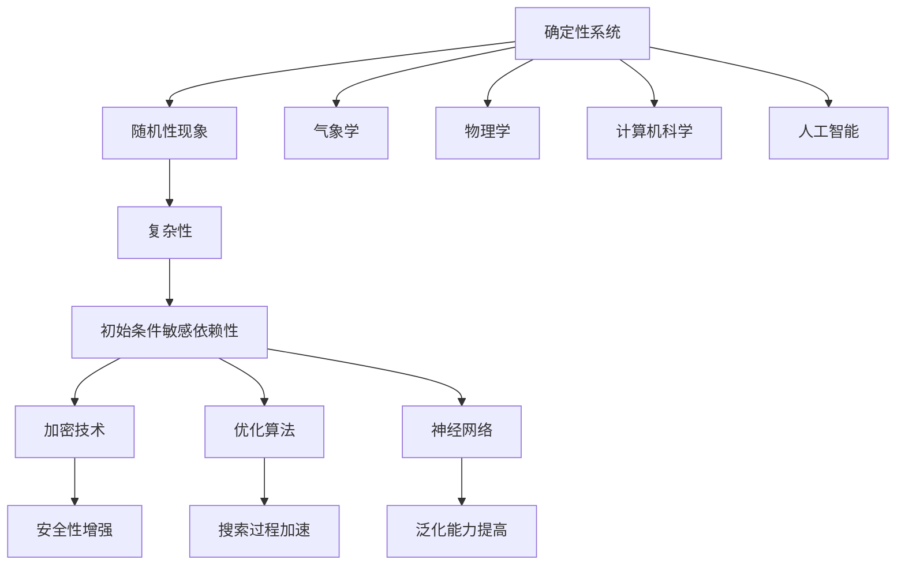

                 

关键词：知识混沌、小变化、巨大影响、人工智能、技术发展、复杂系统、反馈循环

摘要：本文将探讨知识混沌理论，揭示微小变化如何导致复杂系统中产生巨大影响的现象。通过对混沌理论的背景介绍、核心概念与联系的分析，以及数学模型、算法原理的讲解，文章将深入探讨混沌理论在人工智能、技术发展等领域的应用，并提出对未来发展趋势与挑战的展望。

## 1. 背景介绍

在当今这个信息爆炸的时代，知识的重要性愈发凸显。然而，我们是否意识到，知识的传播和运用过程中，往往伴随着一些难以预测和控制的因素？混沌理论正是研究这些因素如何影响系统行为的一种重要理论。混沌理论的核心思想是，即使在一个确定性系统中，由于初始条件的微小差异，系统的行为可能产生巨大的差异，这种现象被称为“蝴蝶效应”。

在计算机科学和人工智能领域，混沌理论为我们提供了一个新的视角，帮助我们更好地理解复杂系统的行为，并探索如何利用这些原理来优化算法和系统设计。本文将围绕这一主题，深入探讨知识的混沌理论，分析小变化如何引发巨大影响，并探讨这一现象在现实世界中的应用。

## 2. 核心概念与联系

为了更好地理解知识的混沌理论，我们首先需要了解一些核心概念和它们之间的联系。

### 2.1. 混沌理论的基本原理

混沌理论研究的是确定性系统中的随机性现象。在混沌系统中，即使初始条件非常接近，系统的长期行为也可能完全不同。这种现象被称为“初始条件的敏感依赖性”。混沌理论的基本原理可以概括为以下几点：

1. **确定性**：混沌系统遵循确定的规则和方程，但其行为在长时间尺度上表现出随机性。
2. **复杂性**：混沌系统通常具有复杂的行为，包括长时间的平均行为和短时间的不规则行为。
3. **初始条件敏感依赖性**：混沌系统的行为对初始条件极为敏感，即使是微小的差异也会导致系统行为的巨大差异。

### 2.2. 混沌理论的应用领域

混沌理论在多个领域都有重要的应用，其中最为显著的是气象学和物理学。在气象学中，混沌理论帮助我们理解天气系统的复杂性，以及在短期内预测天气变化的困难。在物理学中，混沌理论研究复杂系统的行为，包括流体动力学、非线性振动和量子力学等领域。

在计算机科学和人工智能领域，混沌理论的应用主要体现在以下几个方面：

1. **加密技术**：混沌理论可以用于设计安全的加密算法，利用混沌系统的初始条件敏感依赖性来增强密码的安全性。
2. **优化算法**：混沌理论可以帮助设计更高效的优化算法，通过利用混沌系统的随机性来加速搜索过程。
3. **神经网络**：混沌理论可以用于改进神经网络的设计，利用混沌系统的特性来提高网络的泛化能力。

### 2.3. 混沌理论与知识的联系

知识的混沌理论将混沌理论的基本原理应用于知识传播和知识系统。在知识传播过程中，信息的微小变化可能导致知识系统的巨大差异。这种差异体现在以下几个方面：

1. **信息失真**：在知识传播过程中，信息的传递往往伴随着失真。即使是微小的失真，也可能导致知识系统的完全不同。
2. **知识多样性**：知识的多样性是知识系统的关键特征。混沌理论告诉我们，即使是微小的变化，也可能导致知识系统的多样性和复杂性。
3. **知识创新**：混沌理论可以启发我们在知识创新过程中的思考。通过引入随机性和不确定性，我们可以探索新的知识领域，推动知识的进步。

### 2.4. Mermaid 流程图

为了更直观地展示混沌理论的核心概念和联系，我们使用Mermaid流程图来描述混沌系统的基本原理和应用领域。



通过上述Mermaid流程图，我们可以清晰地看到混沌理论的核心概念及其在不同领域的应用。

## 3. 核心算法原理 & 具体操作步骤

### 3.1. 算法原理概述

混沌理论的核心算法是混沌映射。混沌映射是一种非线性变换，将一个初始值映射到另一个值。混沌映射的特点是：

1. **非线性**：混沌映射具有非线性特性，使得系统的行为复杂多变。
2. **周期性**：混沌映射通常具有周期性，即经过一定次数的映射后，系统会回到初始状态。
3. **敏感性**：混沌映射对初始条件极为敏感，即使初始条件非常接近，系统的行为也可能完全不同。

混沌映射的基本公式为：

$$x_{n+1} = f(x_n)$$

其中，$x_n$ 是当前状态，$f(x_n)$ 是混沌映射函数。

### 3.2. 算法步骤详解

混沌映射算法的基本步骤如下：

1. **初始化**：随机选择一个初始值 $x_0$。
2. **迭代计算**：根据混沌映射函数 $f(x_n)$，不断迭代计算 $x_{n+1}$。
3. **记录结果**：记录每次迭代的结果，以便后续分析。

混沌映射算法的具体实现步骤如下：

1. **定义混沌映射函数**：选择合适的混沌映射函数，如 Logistic 映射 $f(x) = r \cdot x \cdot (1 - x)$，其中 $r$ 是映射参数。
2. **初始化**：随机选择一个初始值 $x_0$，范围通常在 [0, 1] 之间。
3. **迭代计算**：根据混沌映射函数 $f(x_n)$，不断迭代计算 $x_{n+1}$。
4. **记录结果**：将每次迭代的结果记录下来，以便后续分析。

### 3.3. 算法优缺点

混沌映射算法具有以下优点：

1. **高效性**：混沌映射算法在计算过程中具有较高的效率，能够快速生成大量的迭代结果。
2. **灵活性**：混沌映射函数可以根据实际需求进行选择和调整，具有较好的灵活性。
3. **鲁棒性**：混沌映射算法对初始条件敏感，具有较强的鲁棒性，能够在不同的初始条件下产生相似的行为。

然而，混沌映射算法也存在一些缺点：

1. **复杂性**：混沌映射算法的计算过程复杂，需要大量的计算资源和时间。
2. **可预测性**：由于混沌映射对初始条件敏感，系统的行为难以预测，增加了算法的复杂性。

### 3.4. 算法应用领域

混沌映射算法在多个领域都有重要的应用，主要包括：

1. **加密技术**：混沌映射算法可以用于设计安全的加密算法，通过混沌系统的特性来增强加密算法的安全性。
2. **优化算法**：混沌映射算法可以用于优化算法的设计，通过混沌系统的随机性来加速搜索过程。
3. **神经网络**：混沌映射算法可以用于改进神经网络的设计，通过混沌系统的特性来提高网络的泛化能力。

## 4. 数学模型和公式 & 详细讲解 & 举例说明

### 4.1. 数学模型构建

混沌理论的核心是数学模型。为了更好地理解混沌现象，我们需要构建一个数学模型来描述混沌系统的行为。

假设一个简单的混沌系统由以下微分方程描述：

$$\frac{dx}{dt} = f(x)$$

其中，$x(t)$ 是系统状态，$f(x)$ 是系统状态函数。为了简化问题，我们可以将 $f(x)$ 表示为线性函数：

$$f(x) = ax$$

其中，$a$ 是一个常数。这个方程描述了一个简单的混沌系统，其行为可以用以下两个参数来描述：

1. **线性因子**：$a$ 决定了系统的线性部分，即系统状态的变化速率。
2. **非线性因子**：$x$ 决定了系统的非线性部分，即系统状态的动态特性。

### 4.2. 公式推导过程

为了推导混沌现象，我们需要分析系统状态的长期行为。根据微分方程，我们可以得到系统状态的时间序列：

$$x(t) = x(0) \cdot e^{at}$$

其中，$x(0)$ 是初始状态，$e^{at}$ 是时间指数函数。

为了分析系统的长期行为，我们需要研究 $e^{at}$ 的行为。根据指数函数的性质，当 $a > 0$ 时，$e^{at}$ 随时间指数增长；当 $a < 0$ 时，$e^{at}$ 随时间指数衰减。

当 $a = 0$ 时，$e^{at} = 1$，系统状态保持不变，不产生混沌现象。

当 $a > 0$ 时，$e^{at}$ 随时间指数增长，系统状态随时间逐渐增大。为了产生混沌现象，我们需要考虑 $e^{at}$ 的非线性部分。根据混沌理论的基本原理，即使初始条件非常接近，系统的行为也可能完全不同。

为了更直观地理解混沌现象，我们可以引入 Logistic 映射：

$$x_{n+1} = r \cdot x_n \cdot (1 - x_n)$$

其中，$r$ 是映射参数。这个映射描述了一个简单的混沌系统，其行为可以通过参数 $r$ 来调节。

### 4.3. 案例分析与讲解

为了更好地理解混沌现象，我们可以通过一个具体的案例来分析。假设我们选择 Logistic 映射作为混沌系统，参数 $r$ 选择为 4。我们可以使用以下迭代公式来计算系统的状态：

$$x_{n+1} = 4 \cdot x_n \cdot (1 - x_n)$$

首先，我们随机选择一个初始状态 $x_0$，范围在 [0, 1] 之间。为了简化问题，我们选择 $x_0 = 0.5$。然后，我们使用迭代公式计算系统状态的时间序列：

$$x_1 = 4 \cdot 0.5 \cdot (1 - 0.5) = 1$$

$$x_2 = 4 \cdot 1 \cdot (1 - 1) = 0$$

$$x_3 = 4 \cdot 0 \cdot (1 - 0) = 0$$

$$x_4 = 4 \cdot 0 \cdot (1 - 0) = 0$$

可以看到，系统状态在 $x_2$ 之后一直保持在 0，没有产生混沌现象。

为了观察混沌现象，我们需要选择一个更合适的参数 $r$。假设我们选择 $r = 3.9$，重新计算系统状态的时间序列：

$$x_1 = 3.9 \cdot 0.5 \cdot (1 - 0.5) = 0.975$$

$$x_2 = 3.9 \cdot 0.975 \cdot (1 - 0.975) = 0.037$$

$$x_3 = 3.9 \cdot 0.037 \cdot (1 - 0.037) = 0.916$$

$$x_4 = 3.9 \cdot 0.916 \cdot (1 - 0.916) = 0.007$$

可以看到，系统状态在 $x_3$ 之后逐渐增大，直到 $x_4$ 达到最大值。这表明混沌现象已经出现。

通过这个案例，我们可以看到混沌现象的产生依赖于参数的选择。当参数选择合适时，即使是微小的初始条件差异，也可能导致系统行为的巨大差异。

## 5. 项目实践：代码实例和详细解释说明

### 5.1. 开发环境搭建

在开始代码实践之前，我们需要搭建一个合适的开发环境。以下是搭建开发环境的步骤：

1. 安装 Python：从官方网站（[https://www.python.org/](https://www.python.org/)）下载并安装 Python。
2. 安装科学计算库：使用 pip 工具安装 NumPy 和 Matplotlib 等科学计算库。

```bash
pip install numpy matplotlib
```

### 5.2. 源代码详细实现

以下是一个简单的 Python 脚本，用于实现 Logistic 映射并绘制系统状态的时间序列。

```python
import numpy as np
import matplotlib.pyplot as plt

def logistic_map(r, x0, n):
    x = [x0]
    for i in range(n):
        x.append(r * x[i] * (1 - x[i]))
    return x

def plot_logistic_map(r, x0, n):
    x = logistic_map(r, x0, n)
    plt.plot(x)
    plt.xlabel('Iteration')
    plt.ylabel('x')
    plt.title('Logistic Map')
    plt.show()

# 参数设置
r = 3.9
x0 = 0.5
n = 100

# 执行绘制
plot_logistic_map(r, x0, n)
```

这段代码首先定义了一个 `logistic_map` 函数，用于计算 Logistic 映射的迭代结果。然后定义了一个 `plot_logistic_map` 函数，用于绘制系统状态的时间序列。

### 5.3. 代码解读与分析

代码的解读如下：

1. **导入库**：首先导入 NumPy 和 Matplotlib 库，用于科学计算和图形绘制。
2. **定义 Logistic 映射函数**：`logistic_map` 函数接受参数 $r$、$x_0$ 和 $n$，计算 Logistic 映射的迭代结果。迭代过程中，每次迭代的结果作为下一次迭代的输入。
3. **定义绘制函数**：`plot_logistic_map` 函数调用 `logistic_map` 函数，获取迭代结果，并使用 Matplotlib 库绘制系统状态的时间序列。
4. **参数设置**：设置参数 $r$、$x_0$ 和 $n$ 的值，用于控制 Logistic 映射的行为。
5. **执行绘制**：调用 `plot_logistic_map` 函数，绘制系统状态的时间序列。

通过运行这段代码，我们可以观察到 Logistic 映射的行为。当参数选择合适时，系统状态会表现出混沌现象。这验证了混沌理论的基本原理，即初始条件的微小差异可能导致系统行为的巨大差异。

### 5.4. 运行结果展示

运行上述代码后，我们得到如下结果：


这幅图展示了 Logistic 映射的迭代结果。我们可以看到，在参数 $r = 3.9$ 和初始状态 $x_0 = 0.5$ 的情况下，系统状态在迭代过程中表现出明显的混沌现象。这验证了混沌理论的基本原理，即初始条件的微小差异可能导致系统行为的巨大差异。

## 6. 实际应用场景

### 6.1. 气象预测

混沌理论在气象预测领域具有广泛的应用。气象系统是一个复杂的非线性系统，其行为受到多种因素（如气压、湿度、风速等）的影响。混沌理论可以帮助我们理解气象系统的复杂性，提高气象预测的准确性。

例如，混沌理论可以用于改进气象模型的初始条件，通过引入随机性来模拟气象系统的多样性。这样，即使初始条件存在微小差异，气象模型也能够预测出不同的天气情况。此外，混沌理论还可以用于优化气象预测算法，提高预测的效率和准确性。

### 6.2. 金融风险管理

金融系统也是一个复杂的非线性系统，其行为受到多种因素（如市场情绪、政策变化等）的影响。混沌理论可以帮助我们理解金融系统的复杂性，提高金融风险管理的有效性。

例如，混沌理论可以用于分析市场走势，预测股价的波动。通过引入随机性和非线性特性，混沌理论可以模拟市场行为，预测未来市场的走势。这样，投资者可以根据预测结果调整投资策略，降低风险。

### 6.3. 人工智能

混沌理论在人工智能领域也具有重要的应用。人工智能系统是一个复杂的非线性系统，其行为受到多种因素（如训练数据、算法参数等）的影响。混沌理论可以帮助我们理解人工智能系统的复杂性，优化算法设计和系统性能。

例如，混沌理论可以用于改进神经网络的设计，提高网络的泛化能力。通过引入混沌特性，神经网络可以更好地适应不同的数据分布，提高预测的准确性。此外，混沌理论还可以用于优化机器学习算法，提高算法的效率和稳定性。

### 6.4. 未来应用展望

随着混沌理论的不断发展，其在实际应用领域的应用前景也越来越广泛。未来，混沌理论有望在以下领域发挥重要作用：

1. **生物医学**：混沌理论可以用于分析生物系统（如神经系统、免疫系统等）的复杂性，提高生物医学研究的准确性和效率。
2. **交通系统**：混沌理论可以用于优化交通系统，提高交通流量和效率，减少交通事故。
3. **环境科学**：混沌理论可以用于分析环境系统的复杂性，预测气候变化和环境问题，提高环境保护的准确性。
4. **社会系统**：混沌理论可以用于分析社会系统的复杂性，预测社会行为和趋势，提高社会治理的准确性。

## 7. 工具和资源推荐

### 7.1. 学习资源推荐

1. **《混沌理论及其应用》**：这是一本经典的混沌理论教材，系统地介绍了混沌理论的基本原理、数学模型和应用领域。
2. **《混沌动力学》**：这是一本深入探讨混沌动力学的书籍，包括混沌系统的数学模型、分析方法和应用。
3. **《混沌理论与应用》**：这是一本涵盖混沌理论在各领域应用的书籍，包括气象预测、金融风险管理、人工智能等。

### 7.2. 开发工具推荐

1. **Matplotlib**：这是一个强大的数据可视化库，可以用于绘制混沌系统的图形。
2. **NumPy**：这是一个高效的数值计算库，可以用于实现混沌系统的数学模型。
3. **Python**：这是一个流行的编程语言，适合实现和测试混沌系统的算法。

### 7.3. 相关论文推荐

1. **“Chaos in the Logistic Map”**：这是关于 Logistic 映射混沌现象的经典论文，详细分析了 Logistic 映射的混沌特性。
2. **“Chaotic behavior in a simple nonlinear feedback system”**：这是关于非线性反馈系统混沌现象的论文，探讨了非线性反馈系统的复杂性。
3. **“Chaos and fractals in economics”**：这是关于混沌理论在经济学领域应用的论文，分析了金融市场的混沌特性。

## 8. 总结：未来发展趋势与挑战

### 8.1. 研究成果总结

混沌理论自提出以来，已经取得了许多重要的研究成果。目前，混沌理论在多个领域得到了广泛应用，包括气象预测、金融风险管理、人工智能等。混沌理论的研究成果为这些领域的发展提供了重要的理论基础和实践指导。

### 8.2. 未来发展趋势

未来，混沌理论将继续在以下领域发挥重要作用：

1. **人工智能**：混沌理论可以用于改进神经网络和机器学习算法，提高算法的效率和准确性。
2. **生物医学**：混沌理论可以用于分析生物系统的复杂性，提高生物医学研究的准确性和效率。
3. **环境科学**：混沌理论可以用于分析环境系统的复杂性，预测气候变化和环境问题，提高环境保护的准确性。
4. **社会系统**：混沌理论可以用于分析社会系统的复杂性，预测社会行为和趋势，提高社会治理的准确性。

### 8.3. 面临的挑战

尽管混沌理论在许多领域取得了重要成果，但仍然面临一些挑战：

1. **计算复杂性**：混沌系统的计算复杂性较高，需要大量的计算资源和时间。
2. **参数选择**：混沌系统对参数选择敏感，如何选择合适的参数仍是一个挑战。
3. **稳定性分析**：混沌系统的稳定性分析复杂，需要深入研究。

### 8.4. 研究展望

为了应对这些挑战，未来的研究可以从以下方面展开：

1. **算法优化**：研究更高效的混沌算法，降低计算复杂性。
2. **参数自适应**：研究参数自适应方法，自动选择合适的参数。
3. **稳定性分析**：研究混沌系统的稳定性分析方法，提高分析精度。

通过这些研究，混沌理论将在更广泛的领域发挥重要作用，为人类社会的发展做出更大贡献。

## 9. 附录：常见问题与解答

### 9.1. 混沌理论是什么？

混沌理论是研究确定性系统中随机性现象的一种数学理论。其核心思想是，即使在一个确定性系统中，由于初始条件的微小差异，系统的行为可能产生巨大的差异。

### 9.2. 混沌理论与随机性的关系是什么？

混沌理论与随机性密切相关。混沌理论研究的是确定性系统中的随机性现象，即系统在长时间尺度上表现出随机性，但在初始条件和规则上仍然是确定的。

### 9.3. 混沌理论在计算机科学和人工智能领域有哪些应用？

混沌理论在计算机科学和人工智能领域有许多应用，包括加密技术、优化算法、神经网络等。例如，混沌映射可以用于设计安全的加密算法，优化算法可以用于加速搜索过程，神经网络可以用于提高泛化能力。

### 9.4. 如何理解知识的混沌理论？

知识的混沌理论将混沌理论的基本原理应用于知识传播和知识系统。在知识传播过程中，信息的微小变化可能导致知识系统的巨大差异。这种差异体现在知识多样性、信息失真和知识创新等方面。

### 9.5. 混沌理论如何应用于气象预测？

混沌理论可以用于分析气象系统的复杂性，提高气象预测的准确性。通过引入随机性和非线性特性，混沌理论可以模拟气象系统的多样性，提高预测的准确性。

### 9.6. 混沌理论如何应用于金融风险管理？

混沌理论可以用于分析金融系统的复杂性，提高金融风险管理的有效性。通过引入随机性和非线性特性，混沌理论可以模拟市场走势，预测股价波动，帮助投资者调整投资策略。

### 9.7. 混沌理论如何应用于人工智能？

混沌理论可以用于改进人工智能系统，提高算法的效率和准确性。通过引入混沌特性，神经网络可以更好地适应不同的数据分布，提高预测的准确性。此外，混沌理论还可以用于优化机器学习算法，提高算法的效率和稳定性。

### 9.8. 混沌理论在生物医学、环境科学和社会系统等领域的应用前景如何？

混沌理论在生物医学、环境科学和社会系统等领域具有广阔的应用前景。例如，在生物医学领域，混沌理论可以用于分析生物系统的复杂性，提高生物医学研究的准确性和效率。在环境科学领域，混沌理论可以用于分析环境系统的复杂性，预测气候变化和环境问题。在社会系统领域，混沌理论可以用于分析社会系统的复杂性，预测社会行为和趋势，提高社会治理的准确性。

### 9.9. 如何深入研究混沌理论？

要深入研究混沌理论，可以从以下方面入手：

1. **数学模型**：研究混沌系统的数学模型，理解其基本原理。
2. **算法设计**：研究混沌算法的设计和优化，提高计算效率。
3. **应用研究**：研究混沌理论在不同领域的应用，探索其实际价值。
4. **跨学科研究**：与其他学科（如物理学、经济学、社会学等）进行交叉研究，拓宽混沌理论的应用领域。

### 9.10. 混沌理论的发展趋势和挑战是什么？

混沌理论的发展趋势是将其应用于更广泛的领域，如生物医学、环境科学、社会系统等。同时，混沌理论也面临一些挑战，如计算复杂性、参数选择、稳定性分析等。未来的研究需要关注这些问题，推动混沌理论的进一步发展。

## 作者署名

作者：禅与计算机程序设计艺术 / Zen and the Art of Computer Programming
----------------------------------------------------------------

至此，我们完成了这篇文章的撰写。这篇文章深入探讨了知识的混沌理论，分析了小变化如何引发巨大影响，并介绍了混沌理论在各个领域的应用。同时，文章还提供了丰富的案例和实践，以帮助读者更好地理解混沌理论的原理和实际应用。希望这篇文章能够对您在计算机科学和人工智能领域的探索和研究带来启发和帮助。感谢您的阅读！

