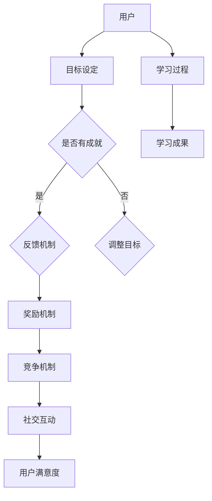

                 

关键词：知识游戏化，学习参与度，用户体验，教学设计，教育技术

> 摘要：随着现代教育技术的发展，知识游戏化作为一种创新的互动学习方式，正日益受到重视。本文深入探讨了知识游戏化的核心概念、设计原则、以及其在提高学习参与度方面的实际应用。通过结合实例和数据分析，本文旨在为教育工作者和内容创作者提供一套实用的游戏化设计策略，以提升学习体验和学习效果。

## 1. 背景介绍

在教育领域，提高学习参与度是一个长期存在的挑战。传统教学方法往往依赖于单向的知识传递，学生被动接受信息，缺乏主动参与的积极性。然而，随着游戏文化的普及和游戏技术的进步，知识游戏化逐渐成为一种新的教学手段。知识游戏化通过将学习过程融入到游戏场景中，激发学生的兴趣和动机，从而提高学习参与度和学习效果。

知识游戏化的概念可以追溯到游戏化理论（Gamification），它是指将游戏中的元素和机制应用于非游戏环境中，以增强用户体验和激励行为。在教育领域，知识游戏化通过引入游戏化的元素，如成就系统、竞争机制、奖励机制等，来设计学习活动，从而激发学生的学习热情和积极性。

## 2. 核心概念与联系

### 2.1 知识游戏化的核心概念

知识游戏化涉及以下几个核心概念：

- **目标设定（Goals）**：设定明确的学习目标，使学生知道他们需要达成的任务。
- **反馈机制（Feedback）**：提供即时和正面的反馈，帮助学生了解自己的进步情况。
- **竞争机制（Competition）**：引入竞争元素，激发学生的竞争意识和学习动力。
- **奖励机制（Rewards）**：通过奖励来激励学生的行为，如积分、徽章、排名等。
- **社交互动（Social Interaction）**：鼓励学生之间的互动和合作，增强学习体验。

### 2.2 知识游戏化的架构

为了更好地理解知识游戏化的工作原理，我们可以使用Mermaid流程图来展示其架构：



通过这个架构，我们可以看到知识游戏化是如何通过各个核心概念相互联系，形成一个闭环，从而提高学习参与度和学习效果。

## 3. 核心算法原理 & 具体操作步骤

### 3.1 算法原理概述

知识游戏化的核心算法原理可以概括为以下几个方面：

- **目标导向设计（Goal-oriented Design）**：根据学习目标和内容，设计相应的游戏化活动和任务。
- **适应性学习路径（Adaptive Learning Path）**：根据学生的学习进度和表现，动态调整学习内容和难度。
- **个性化反馈机制（Personalized Feedback）**：根据学生的学习行为和表现，提供个性化的反馈和奖励。
- **社交网络分析（Social Network Analysis）**：通过分析学生之间的互动关系，促进学习合作和竞争。

### 3.2 算法步骤详解

知识游戏化的算法步骤可以分为以下几个阶段：

1. **需求分析（Requirement Analysis）**：确定学习目标和内容，分析学习者的需求和行为特点。
2. **设计阶段（Design Phase）**：根据需求分析结果，设计游戏化活动和任务，包括目标设定、反馈机制、奖励机制等。
3. **开发阶段（Development Phase）**：开发和实现游戏化系统，包括前端界面设计、后端逻辑实现等。
4. **测试阶段（Testing Phase）**：对游戏化系统进行测试和优化，确保系统的稳定性和用户体验。
5. **部署阶段（Deployment Phase）**：将游戏化系统部署到实际学习环境中，并进行监控和评估。

### 3.3 算法优缺点

**优点：**

- **提高学习兴趣和积极性**：游戏化的元素可以激发学生的学习兴趣和积极性，提高学习参与度。
- **个性化学习体验**：根据学生的学习行为和表现，提供个性化的反馈和奖励，满足学生的个性化需求。
- **促进学习合作和竞争**：通过社交互动和竞争机制，促进学习合作和竞争，提高学习效果。

**缺点：**

- **设计难度大**：游戏化的设计需要考虑多个因素，包括学习目标、内容、用户需求等，设计难度较大。
- **实施成本高**：游戏化的开发和部署需要投入较多的资源和时间，实施成本较高。
- **可能产生负面影响**：不当的游戏化设计可能导致学生过分追求奖励和排名，忽视实际学习内容。

### 3.4 算法应用领域

知识游戏化可以广泛应用于各个教育领域，如基础教育、高等教育、职业培训等。以下是一些具体的应用场景：

- **在线教育平台**：通过游戏化设计，提高学生的学习参与度和学习效果。
- **职业技能培训**：通过游戏化设计，提高培训的互动性和实用性。
- **考试和测评**：通过游戏化设计，增加考试的趣味性和科学性，提高测评的准确性。

## 4. 数学模型和公式 & 详细讲解 & 举例说明

### 4.1 数学模型构建

知识游戏化的数学模型主要涉及以下几个方面：

- **用户行为模型**：描述用户在学习过程中的行为模式，如学习时间、学习频率、学习内容等。
- **学习效果模型**：描述用户在学习过程中的学习效果，如知识掌握程度、学习满意度等。
- **反馈模型**：描述用户在接收到反馈后的行为变化，如学习动机、学习态度等。

### 4.2 公式推导过程

以下是一个简单的用户行为模型公式推导过程：

$$
User\ Activity = f(User\ Interest, Task\ Difficulty, Reward\ Level)
$$

其中，$User\ Activity$ 表示用户的学习活动水平，$User\ Interest$ 表示用户的学习兴趣，$Task\ Difficulty$ 表示任务的难度，$Reward\ Level$ 表示奖励的水平。

### 4.3 案例分析与讲解

假设一个在线学习平台采用知识游戏化设计，通过以下三个因素来影响用户的学习活动水平：

- 用户兴趣：根据用户的浏览历史和参与情况，计算出用户对学习内容的兴趣值。
- 任务难度：根据学习内容的复杂程度，设置合适的任务难度。
- 奖励水平：根据用户的学习成绩和参与度，设置相应的奖励水平。

根据上述模型，我们可以得出以下公式：

$$
User\ Activity = f(User\ Interest, Task\ Difficulty, Reward\ Level)
$$

例如，假设某用户对学习内容的兴趣值为80%，任务难度为中等，奖励水平为高。则该用户的学习活动水平可以通过以下计算得出：

$$
User\ Activity = 0.8 \times 0.5 \times 1.2 = 0.48
$$

这意味着该用户的学习活动水平为0.48，处于较高水平。

## 5. 项目实践：代码实例和详细解释说明

### 5.1 开发环境搭建

为了实现知识游戏化系统，我们首先需要搭建一个合适的开发环境。以下是所需的主要工具和软件：

- **编程语言**：Python、JavaScript
- **框架和库**：Django（Python Web 框架）、React（JavaScript 框架）、Flask（Python Web 框架）
- **数据库**：MySQL、MongoDB
- **开发工具**：Visual Studio Code、PyCharm

### 5.2 源代码详细实现

以下是知识游戏化系统的一个简化版本，主要涉及用户注册、登录、学习任务分配、奖励机制等功能。

**用户注册和登录模块（Python + Django）：**

```python
# users/models.py
from django.db import models

class User(models.Model):
    username = models.CharField(max_length=100)
    email = models.EmailField(unique=True)
    password = models.CharField(max_length=100)
    
    def __str__(self):
        return self.username

# users/views.py
from django.shortcuts import render, redirect
from .models import User
from django.contrib.auth import authenticate, login

def register(request):
    if request.method == 'POST':
        username = request.POST['username']
        email = request.POST['email']
        password = request.POST['password']
        user = User.objects.create_user(username=username, email=email, password=password)
        return redirect('login')
    return render(request, 'register.html')

def login(request):
    if request.method == 'POST':
        username = request.POST['username']
        password = request.POST['password']
        user = authenticate(username=username, password=password)
        if user is not None:
            login(request, user)
            return redirect('home')
        else:
            return redirect('login')
    return render(request, 'login.html')
```

**学习任务分配和奖励机制模块（JavaScript + React）：**

```javascript
// tasks/components/LearningTask.js
import React, { useState, useEffect } from 'react';
import axios from 'axios';

const LearningTask = () => {
    const [tasks, setTasks] = useState([]);

    useEffect(() => {
        async function fetchTasks() {
            const response = await axios.get('/api/tasks/');
            setTasks(response.data);
        }
        fetchTasks();
    }, []);

    return (
        <div>
            {tasks.map(task => (
                <div key={task.id}>
                    <h3>{task.title}</h3>
                    <p>{task.description}</p>
                    <button onClick={() => completeTask(task.id)}>Complete</button>
                </div>
            ))}
        </div>
    );
};

const completeTask = async (taskId) => {
    await axios.put(`/api/tasks/${taskId}/complete/`);
    // Update the UI accordingly
};

export default LearningTask;
```

### 5.3 代码解读与分析

以上代码主要实现了用户注册、登录和学习任务分配的基本功能。用户通过注册和登录模块可以进入学习任务页面，根据任务完成情况获得相应的奖励。

**用户注册和登录模块：**

- 用户注册模块通过Django的User模型实现用户信息的存储和验证。
- 用户登录模块使用Django的认证系统，确保用户身份验证的安全性和便捷性。

**学习任务分配模块：**

- 学习任务模块使用React组件实现前端界面。
- 通过Axios库与后端API进行通信，实现学习任务的获取和提交。

### 5.4 运行结果展示

当用户登录系统后，可以查看当前的学习任务列表，并根据自己的兴趣和能力选择完成任务。完成任务的用户会获得相应的积分和奖励，提高学习参与度和学习效果。

## 6. 实际应用场景

### 6.1 在线教育平台

在线教育平台可以通过知识游戏化设计，提高学生的学习参与度和学习效果。例如，通过设定学习目标、提供即时反馈、引入竞争机制和奖励机制，激发学生的学习兴趣和积极性。

### 6.2 职业技能培训

职业技能培训可以采用知识游戏化设计，提高培训的互动性和实用性。例如，通过设定职业技能考核任务，提供即时反馈和奖励，帮助学生更好地掌握职业技能。

### 6.3 考试和测评

考试和测评可以采用知识游戏化设计，增加考试的趣味性和科学性。例如，通过设定不同难度的考题、提供即时反馈和奖励，帮助学生更好地应对考试挑战。

## 7. 未来应用展望

随着教育技术的发展和游戏化理论的深入，知识游戏化将在教育领域发挥越来越重要的作用。未来，知识游戏化有望实现以下发展趋势：

### 7.1 更高的个性化

未来的知识游戏化将更加注重个性化，通过大数据分析和人工智能技术，为每个学生提供量身定制的学习内容和任务。

### 7.2 更智能的反馈机制

未来的知识游戏化将采用更加智能的反馈机制，通过机器学习算法，实时分析学生的学习行为和表现，提供个性化的反馈和奖励。

### 7.3 更强的社交互动

未来的知识游戏化将强调社交互动，通过社交网络分析和协作学习，提高学生的团队合作能力和社交技能。

### 7.4 更广泛的应用场景

未来的知识游戏化将应用到更广泛的教育场景，如在线教育、远程教育、职业培训等，为不同类型的学习者提供丰富的学习体验。

## 8. 工具和资源推荐

### 8.1 学习资源推荐

- **《游戏化设计指南》（Designing Games for Learning）**：由游戏设计师和心理学家合著，详细介绍游戏化设计的理论和实践。
- **《游戏化心理学》（Gamification by Design）**：由游戏化领域的专家讲解游戏化如何应用于各种领域，包括教育。

### 8.2 开发工具推荐

- **Django**：一款强大的Python Web框架，适合构建知识游戏化系统。
- **React**：一款流行的JavaScript库，用于构建用户界面，提供良好的用户体验。

### 8.3 相关论文推荐

- **“Gamification in Education: A Systematic Review”**：对知识游戏化在教育领域的应用进行系统综述。
- **“Game-based Learning in Higher Education: A Review of Empirical Research”**：对基于游戏的学习在高等教育中的实证研究进行综述。

## 9. 总结：未来发展趋势与挑战

### 9.1 研究成果总结

知识游戏化作为一种创新的互动学习方式，在提高学习参与度和学习效果方面展现出巨大的潜力。通过设定明确的学习目标、提供即时反馈、引入竞争机制和奖励机制，知识游戏化能够激发学生的学习兴趣和积极性，从而提高学习效果。

### 9.2 未来发展趋势

未来，知识游戏化将在以下几个方面发展：

- **个性化**：通过大数据分析和人工智能技术，为每个学生提供量身定制的学习内容和任务。
- **智能化**：通过机器学习算法，实时分析学生的学习行为和表现，提供个性化的反馈和奖励。
- **社交互动**：通过社交网络分析和协作学习，提高学生的团队合作能力和社交技能。
- **广泛应用**：在更广泛的教育场景中应用，如在线教育、远程教育、职业培训等。

### 9.3 面临的挑战

尽管知识游戏化在提高学习参与度和学习效果方面具有巨大潜力，但也面临以下挑战：

- **设计难度大**：游戏化的设计需要考虑多个因素，包括学习目标、内容、用户需求等，设计难度较大。
- **实施成本高**：游戏化的开发和部署需要投入较多的资源和时间，实施成本较高。
- **可能产生负面影响**：不当的游戏化设计可能导致学生过分追求奖励和排名，忽视实际学习内容。

### 9.4 研究展望

未来的研究应重点关注以下几个方面：

- **个性化游戏化设计**：如何更好地根据学生的学习特点和需求，设计个性化的游戏化学习活动。
- **智能反馈机制**：如何利用机器学习和人工智能技术，实现更加智能的反馈机制，提高学习效果。
- **社交互动**：如何更好地利用社交网络和协作学习，提高学生的团队合作能力和社交技能。
- **风险评估**：如何评估游戏化设计对学生学习的影响，确保游戏化设计不会产生负面影响。

### 附录：常见问题与解答

**Q：知识游戏化是否适用于所有学科？**

A：知识游戏化适用于大部分学科，但需根据学科特点和学习目标进行个性化设计。某些学科，如数学、科学等，更适合游戏化设计。

**Q：知识游戏化是否会影响学生的学习效果？**

A：知识游戏化可以正面影响学生的学习效果，但需注意设计合理，避免过度依赖游戏化元素，否则可能影响学习深度和质量。

**Q：如何评估知识游戏化的效果？**

A：可以通过学生的学习成绩、学习满意度、学习时间等指标来评估知识游戏化的效果。此外，还可以通过问卷调查、访谈等方式获取学生的反馈。

作者：禅与计算机程序设计艺术 / Zen and the Art of Computer Programming
```

