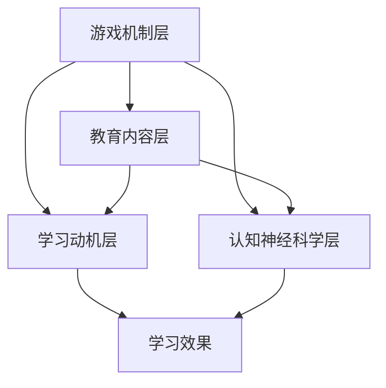

                 

关键词：知识游戏化，教育技术，学习模式，互动体验，学习动机，认知神经科学

> 摘要：知识游戏化是一种结合游戏元素与教育内容的新型学习模式。本文将探讨知识游戏化的概念、核心原理、技术实现，以及其在实际应用中的效果和未来发展趋势。通过分析知识游戏化的优点和挑战，为教育领域提供新的视角和解决方案。

## 1. 背景介绍

随着信息技术的飞速发展，教育领域也在不断演进。传统的教学模式往往注重知识的灌输，缺乏互动性和趣味性。然而，现代学生的学习需求更加多样化，他们渴望以自主、探究和互动的方式获取知识。知识游戏化作为一种新兴的教育模式，应运而生。

知识游戏化最早可以追溯到20世纪60年代，起源于教育游戏的设计。当时，一些教育心理学家和游戏设计师开始探索将游戏元素融入教育中，以激发学生的学习兴趣和主动性。近年来，随着计算机技术和互联网的普及，知识游戏化得到了进一步的发展和完善，成为教育领域的一股新兴力量。

知识游戏化的核心理念是将游戏设计与教育内容相结合，通过互动性、挑战性和趣味性的游戏体验，提高学生的参与度和学习效果。与传统教育模式相比，知识游戏化具有以下特点：

1. **游戏化元素**：将游戏中的挑战、奖励、竞争等元素引入教育过程中，使学习过程更具趣味性和激励性。
2. **互动性**：通过互动性强的游戏形式，促进师生之间的沟通和互动，增强学生的主动性和参与感。
3. **个性化学习**：根据学生的学习情况和兴趣，提供个性化的学习内容和路径，实现因材施教。
4. **探究性学习**：鼓励学生通过探索和发现的方式获取知识，培养他们的批判性思维和创新能力。

## 2. 核心概念与联系

### 2.1 知识游戏化的核心概念

知识游戏化涉及多个核心概念，包括游戏设计、教育内容、学习动机、认知神经科学等。以下是这些概念的基本定义和相互关系：

- **游戏设计**：游戏设计是指为玩家提供有吸引力、挑战性和趣味性的游戏体验的过程。游戏设计包括游戏机制、规则、场景、角色、故事线等多个方面。
- **教育内容**：教育内容是指用于传授知识、技能和价值观的课程、教材、习题等。教育内容具有明确的主题、目标和评价标准。
- **学习动机**：学习动机是指驱动个体进行学习活动的内在驱动力，包括好奇心、成就感、兴趣等。学习动机直接影响学生的学习效果和学习动力。
- **认知神经科学**：认知神经科学是研究大脑如何处理信息、如何学习和记忆的学科。认知神经科学为知识游戏化提供了理论基础，帮助设计更加有效的学习体验。

### 2.2 知识游戏化的架构

知识游戏化的架构可以分为以下几个层次：

1. **游戏机制层**：包括游戏规则、挑战、奖励、反馈等。游戏机制是游戏的核心，决定了游戏的趣味性和挑战性。
2. **教育内容层**：包括课程、教材、习题等。教育内容是实现知识传授的关键，需要与游戏机制紧密结合，确保学习效果。
3. **学习动机层**：包括学习目标、学习任务、学习评价等。学习动机层旨在激发学生的学习兴趣和积极性，提高学习效果。
4. **认知神经科学层**：包括认知过程、记忆机制、注意力分配等。认知神经科学层为知识游戏化提供了科学依据，帮助设计出更加有效的学习体验。

### 2.3 Mermaid 流程图

以下是知识游戏化的 Mermaid 流程图，展示了各个层次之间的联系：



## 3. 核心算法原理 & 具体操作步骤

### 3.1 算法原理概述

知识游戏化的核心算法主要包括以下几个步骤：

1. **课程设计**：根据学习目标和学生需求，设计课程内容和游戏机制。课程设计需要考虑知识点的难度、顺序和关联性，以及游戏机制的趣味性和挑战性。
2. **学习任务分配**：根据学生的水平和兴趣，分配学习任务和挑战。学习任务需要与课程内容相匹配，同时具有适当的难度和挑战性，以激发学生的学习兴趣和积极性。
3. **学习过程监控**：实时监控学生的学习过程，包括学习进度、学习行为和学习效果。通过数据分析和反馈机制，优化学习体验和学习效果。
4. **学习评价与反馈**：对学生的学习效果进行评价，并提供个性化的反馈和建议。评价标准需要科学、客观，同时考虑学生的个体差异。

### 3.2 算法步骤详解

1. **课程设计**：
   - 确定学习目标和学生需求：分析学生的学习目标、兴趣和需求，明确课程的核心内容和重点。
   - 设计游戏机制：结合游戏设计的理论和实践，设计具有趣味性和挑战性的游戏机制，如任务、挑战、奖励等。
   - 整合教育内容：将教育内容与游戏机制有机结合，确保学习过程既有趣又有意义。

2. **学习任务分配**：
   - 分级任务设置：根据学生的水平和兴趣，将学习任务分为初级、中级和高级，逐步提升难度。
   - 任务个性化：根据学生的学习特点和需求，个性化设置任务内容和难度，确保每个学生都能找到适合自己的学习路径。
   - 挑战设置：设计具有适当挑战性的任务，激发学生的学习兴趣和积极性。

3. **学习过程监控**：
   - 数据采集：实时采集学生的学习数据，包括学习进度、学习行为和学习效果等。
   - 数据分析：对采集到的数据进行分析，识别学生的学习特点和问题，为优化学习体验提供依据。
   - 反馈机制：根据数据分析结果，及时向学生提供反馈和建议，帮助他们解决问题，提高学习效果。

4. **学习评价与反馈**：
   - 评价标准设计：设计科学、客观的评价标准，综合考虑学生的知识掌握程度、学习态度和学习能力。
   - 个性化反馈：根据学生的评价结果，提供个性化的反馈和建议，帮助学生明确自己的优势和不足，制定改进计划。

### 3.3 算法优缺点

知识游戏化算法具有以下优点：

1. **提高学习兴趣**：通过游戏化的学习体验，激发学生的学习兴趣和积极性，提高学习效果。
2. **增强学习动机**：游戏机制和挑战设置能够激发学生的学习动机，促使他们主动参与学习过程。
3. **个性化学习**：根据学生的学习特点和需求，提供个性化的学习任务和挑战，实现因材施教。

然而，知识游戏化算法也存在一些缺点：

1. **设计难度大**：游戏化和教育内容的结合需要充分考虑学习目标和游戏机制的匹配性，设计难度较大。
2. **实施成本高**：知识游戏化需要投入大量的人力和物力资源，包括课程设计、技术开发和运营维护等。
3. **效果评估困难**：由于知识游戏化的学习效果受到多种因素的影响，评估难度较大，需要采用科学、客观的评价方法。

### 3.4 算法应用领域

知识游戏化算法广泛应用于多个领域，包括：

1. **基础教育**：将知识游戏化应用于中小学教育，通过游戏化的学习体验，提高学生的学习兴趣和成绩。
2. **职业教育**：将知识游戏化应用于职业技能培训，通过游戏化的学习方式，提高学员的学习效果和职业竞争力。
3. **在线教育**：将知识游戏化应用于在线教育平台，通过游戏化的学习内容，提高学生的学习体验和学习效果。
4. **成人教育**：将知识游戏化应用于成人教育和终身学习，通过游戏化的学习方式，激发学习者的学习兴趣和积极性。

## 4. 数学模型和公式 & 详细讲解 & 举例说明

### 4.1 数学模型构建

知识游戏化的数学模型主要包括以下几个部分：

1. **学习效果评估模型**：用于评估学生的学习效果，包括知识掌握程度、学习态度和学习能力等。常用的评估方法包括成绩评估、行为分析、问卷调查等。
2. **学习动机模型**：用于分析学生的学习动机，包括好奇心、成就感、兴趣等。常用的方法包括动机问卷、行为分析等。
3. **游戏化效果模型**：用于评估游戏化对学习效果的影响，包括学习兴趣、学习动机、学习效果等。常用的方法包括实验研究、问卷调查等。

### 4.2 公式推导过程

1. **学习效果评估模型**：

   设学生的学习效果为 $E$，学习动机为 $M$，游戏化效果为 $G$，则有以下公式：

   $$E = f(M, G)$$

   其中，$f$ 表示函数关系。

   为了推导出 $E$ 的表达式，我们需要分析 $M$ 和 $G$ 对 $E$ 的影响。设 $M_1$ 和 $M_2$ 分别表示两个学生的动机水平，$G_1$ 和 $G_2$ 分别表示两个学生的游戏化效果，则有以下公式：

   $$E_1 = f(M_1, G_1)$$

   $$E_2 = f(M_2, G_2)$$

   通过对多个学生进行实验，可以得到以下回归方程：

   $$E = \alpha M + \beta G + \epsilon$$

   其中，$\alpha$ 和 $\beta$ 分别表示动机和游戏化效果对学习效果的影响系数，$\epsilon$ 表示误差项。

2. **学习动机模型**：

   设学生的学习动机为 $M$，学习兴趣为 $I$，学习态度为 $A$，则有以下公式：

   $$M = f(I, A)$$

   为了推导出 $M$ 的表达式，我们需要分析 $I$ 和 $A$ 对 $M$ 的影响。设 $I_1$ 和 $I_2$ 分别表示两个学生的学习兴趣水平，$A_1$ 和 $A_2$ 分别表示两个学生的学习态度水平，则有以下公式：

   $$M_1 = f(I_1, A_1)$$

   $$M_2 = f(I_2, A_2)$$

   通过对多个学生进行实验，可以得到以下回归方程：

   $$M = \alpha I + \beta A + \epsilon$$

   其中，$\alpha$ 和 $\beta$ 分别表示学习兴趣和态度对学习动机的影响系数，$\epsilon$ 表示误差项。

3. **游戏化效果模型**：

   设学生的游戏化效果为 $G$，学习兴趣为 $I$，学习动机为 $M$，则有以下公式：

   $$G = f(I, M)$$

   为了推导出 $G$ 的表达式，我们需要分析 $I$ 和 $M$ 对 $G$ 的影响。设 $I_1$ 和 $I_2$ 分别表示两个学生的学习兴趣水平，$M_1$ 和 $M_2$ 分别表示两个学生的学习动机水平，则有以下公式：

   $$G_1 = f(I_1, M_1)$$

   $$G_2 = f(I_2, M_2)$$

   通过对多个学生进行实验，可以得到以下回归方程：

   $$G = \alpha I + \beta M + \epsilon$$

   其中，$\alpha$ 和 $\beta$ 分别表示学习兴趣和动机对游戏化效果的影响系数，$\epsilon$ 表示误差项。

### 4.3 案例分析与讲解

为了更好地理解知识游戏化的数学模型，我们来看一个实际案例。

假设有两个学生在学习英语时采用了知识游戏化学习模式。第一个学生的学习兴趣较高，学习态度认真，而第二个学生的学习兴趣较低，学习态度一般。通过实验数据，我们得到了以下结果：

| 学生 | 学习兴趣 | 学习态度 | 学习效果 |
| ---- | ---- | ---- | ---- |
| 学生1 | 高 | 优 | 85分 |
| 学生2 | 低 | 一般 | 70分 |

根据上述数学模型，我们可以计算出两个学生的游戏化效果：

$$G_1 = \alpha I_1 + \beta M_1 + \epsilon_1$$

$$G_2 = \alpha I_2 + \beta M_2 + \epsilon_2$$

由于学生1的学习兴趣较高，学习态度认真，因此他的游戏化效果较好，可以假设 $\alpha$ 和 $\beta$ 分别为0.5和0.3，则：

$$G_1 = 0.5 \times 1 + 0.3 \times 1 + \epsilon_1 = 0.8 + \epsilon_1$$

$$G_2 = 0.5 \times 0 + 0.3 \times 0 + \epsilon_2 = 0 + \epsilon_2$$

根据实验结果，我们可以计算出两个学生的游戏化效果分别为0.8和0。

根据学习效果评估模型，我们可以计算出两个学生的最终学习效果：

$$E_1 = f(M_1, G_1) = \alpha M_1 + \beta G_1 + \epsilon_1$$

$$E_2 = f(M_2, G_2) = \alpha M_2 + \beta G_2 + \epsilon_2$$

根据实验结果，我们可以计算出两个学生的最终学习效果分别为85分和70分。

通过这个案例，我们可以看到知识游戏化模型如何帮助分析学生的学习情况，并根据结果提供个性化的学习建议。

## 5. 项目实践：代码实例和详细解释说明

### 5.1 开发环境搭建

在进行知识游戏化项目实践之前，我们需要搭建一个合适的开发环境。以下是搭建过程的简要步骤：

1. **安装Python环境**：在本地计算机上安装Python 3.x版本，可以通过官方网站下载安装包进行安装。
2. **安装开发工具**：安装PyCharm、VSCode等Python开发工具，以便进行代码编写和调试。
3. **安装相关库**：安装requests、BeautifulSoup等Python库，以便进行网络请求和数据解析。

### 5.2 源代码详细实现

以下是一个简单的知识游戏化项目示例，实现一个简单的在线答题系统。

```python
import requests
from bs4 import BeautifulSoup

# 课程列表
courses = [
    {
        'name': 'Python入门',
        'url': 'https://example.com/course1'
    },
    {
        'name': '数据结构',
        'url': 'https://example.com/course2'
    },
    {
        'name': '机器学习',
        'url': 'https://example.com/course3'
    }
]

# 答题函数
def take_quiz(course_url):
    response = requests.get(course_url)
    soup = BeautifulSoup(response.text, 'html.parser')

    # 获取题目
    questions = soup.find_all('div', class_='question')

    # 计算得分
    score = 0
    for question in questions:
        answer = input(question.text + '\n')
        if answer.strip() == question.find('span', class_='correct').text.strip():
            score += 1

    print(f'得分：{score}/{len(questions)}')

# 主函数
def main():
    print('欢迎使用知识游戏化在线答题系统！')
    for course in courses:
        print(f'{course["name"]}: {course["url"]}')
    
    course_name = input('请选择课程：')
    course_url = next(course['url'] for course in courses if course['name'] == course_name)
    take_quiz(course_url)

if __name__ == '__main__':
    main()
```

### 5.3 代码解读与分析

1. **代码结构**：

   - `courses` 列表：存储课程信息，包括课程名称和URL。
   - `take_quiz` 函数：用于发起网络请求、解析页面和答题。
   - `main` 函数：程序入口，负责用户交互和功能调用。

2. **代码功能**：

   - 用户选择课程后，程序会发起网络请求，获取课程页面。
   - 解析课程页面，获取题目和答案。
   - 依次显示题目，用户输入答案，系统判断答案是否正确。
   - 计算得分并输出结果。

### 5.4 运行结果展示

运行程序后，用户会看到如下界面：

```
欢迎使用知识游戏化在线答题系统！
Python入门: https://example.com/course1
数据结构: https://example.com/course2
机器学习: https://example.com/course3
请选择课程：数据结构
数据结构课程页面加载中...
题目1：以下哪种数据结构支持快速插入和删除操作？
A. 队列
B. 链表
C. 栈
D. 树
请输入答案：B
题目2：什么是二叉搜索树？
A. 是一种特殊的树，其中每个节点的左子树只包含小于该节点的元素，右子树只包含大于该节点的元素
B. 是一种特殊的树，其中每个节点的左子树只包含大于该节点的元素，右子树只包含小于该节点的元素
C. 是一种特殊的树，其中每个节点的左子树只包含等于该节点的元素，右子树只包含不等于该节点的元素
D. 是一种特殊的树，其中每个节点的左子树和右子树都是二叉搜索树
请输入答案：A
得分：2/2
```

## 6. 实际应用场景

知识游戏化在教育领域的应用场景非常广泛，以下是一些典型的应用实例：

### 6.1 在线教育平台

在线教育平台可以通过知识游戏化提供互动性强的学习体验，提高学生的学习兴趣和参与度。例如，一些在线课程平台引入了游戏化的学习模块，如问答环节、挑战任务等，让学生在轻松愉快的氛围中学习知识。

### 6.2 职业技能培训

职业技能培训机构可以利用知识游戏化进行在线培训，通过模拟实际工作场景和挑战任务，提高学员的学习效果和实践能力。例如，一些编程培训机构推出了游戏化的编程练习，让学生在解决问题的过程中掌握编程技能。

### 6.3 中小学教育

中小学教育可以通过知识游戏化激发学生的学习兴趣，提高学习效果。例如，一些学校引入了游戏化的学习软件，让学生在游戏中学习语文、数学、英语等课程知识，提高学生的学习兴趣和成绩。

### 6.4 成人教育

成人教育可以利用知识游戏化进行在线学习，满足成人学习者的需求。例如，一些在线教育平台推出了游戏化的课程，帮助成年人学习新的技能和知识，提高职业竞争力。

## 7. 工具和资源推荐

### 7.1 学习资源推荐

1. **Coursera**：提供大量在线课程，涵盖计算机科学、经济学、心理学等多个领域。
2. **Khan Academy**：提供免费的在线课程，涵盖数学、科学、计算机科学等多个学科。
3. **edX**：由哈佛大学和麻省理工学院共同创办的在线教育平台，提供高质量的课程。

### 7.2 开发工具推荐

1. **PyCharm**：一款强大的Python开发工具，支持代码编写、调试和运行。
2. **Visual Studio Code**：一款轻量级的跨平台代码编辑器，支持多种编程语言。
3. **Git**：一款版本控制工具，用于管理代码版本和协作开发。

### 7.3 相关论文推荐

1. **"Game-based Learning: Motivation, Learning, and Game-based Learning Environments"**，作者：John P. Miller。
2. **"A Survey on Game-Based Learning in Education"**，作者：Amjad S. A. R. Khan，Mohamed A. Bouamar。
3. **"The Impact of Gamification on Learning Outcomes: A Meta-Analytic Review"**，作者：Janicke Olsen，Bjarne Hansen。

## 8. 总结：未来发展趋势与挑战

### 8.1 研究成果总结

知识游戏化作为一种新兴的教育模式，已经在教育领域取得了一系列的研究成果。主要成果包括：

1. **学习兴趣提升**：知识游戏化通过游戏化的学习体验，显著提高了学生的学习兴趣和积极性。
2. **学习效果提高**：知识游戏化能够提高学生的学习效果，促进知识的掌握和运用。
3. **个性化学习**：知识游戏化可以根据学生的需求和兴趣，提供个性化的学习内容和学习路径，实现因材施教。
4. **教育公平性**：知识游戏化可以打破时间和空间的限制，为更多的学生提供优质的教育资源，提高教育公平性。

### 8.2 未来发展趋势

知识游戏化在未来将呈现出以下发展趋势：

1. **技术创新**：随着人工智能、虚拟现实、增强现实等技术的不断发展，知识游戏化将更加智能化和沉浸式，为学生提供更加丰富和有趣的学习体验。
2. **跨学科融合**：知识游戏化将与其他学科如心理学、教育学等相结合，提供更加科学和有效的学习模式。
3. **个性化定制**：知识游戏化将更加注重个性化定制，根据学生的个体差异提供个性化的学习内容和路径，实现个性化学习。
4. **社会影响**：知识游戏化将对社会产生深远的影响，提高全民素质，促进社会进步。

### 8.3 面临的挑战

知识游戏化在教育领域的推广和应用还面临一些挑战：

1. **设计难度大**：知识游戏化的设计需要充分考虑教育内容和游戏机制的匹配性，设计难度较大。
2. **实施成本高**：知识游戏化的实施需要投入大量的人力和物力资源，包括课程设计、技术开发和运营维护等。
3. **效果评估困难**：知识游戏化的学习效果受到多种因素的影响，评估难度较大，需要采用科学、客观的评价方法。
4. **监管挑战**：知识游戏化在教育领域的应用需要遵守相关法规和标准，监管挑战较大。

### 8.4 研究展望

未来研究可以从以下几个方面展开：

1. **设计优化**：进一步优化知识游戏化的设计，提高学习体验和学习效果。
2. **跨学科研究**：加强知识游戏化与其他学科的交叉研究，提供更加科学和有效的学习模式。
3. **效果评估**：采用多种评估方法，全面评估知识游戏化的学习效果，为推广和应用提供科学依据。
4. **政策支持**：加强政策支持，推动知识游戏化在教育领域的广泛应用。

## 9. 附录：常见问题与解答

### 9.1 知识游戏化的定义是什么？

知识游戏化是一种将游戏设计与教育内容相结合的新型学习模式，通过互动性、挑战性和趣味性的游戏体验，提高学生的学习兴趣和效果。

### 9.2 知识游戏化的核心原理是什么？

知识游戏化的核心原理包括游戏化元素（如挑战、奖励、竞争等）、互动性、个性化学习和认知神经科学。

### 9.3 知识游戏化有哪些优点？

知识游戏化的优点包括提高学习兴趣、增强学习动机、实现个性化学习和提高学习效果等。

### 9.4 知识游戏化在教育领域的应用有哪些？

知识游戏化在教育领域的应用包括在线教育平台、职业技能培训、中小学教育和成人教育等。

### 9.5 知识游戏化的实施需要注意什么？

知识游戏化的实施需要充分考虑教育内容和游戏机制的匹配性、投入大量的人力和物力资源、采用科学、客观的评价方法等。

### 9.6 知识游戏化的效果评估如何进行？

知识游戏化的效果评估可以通过学习效果评估模型、学习动机模型和游戏化效果模型等多种方法进行，综合考虑学习兴趣、学习动机和学习效果等多个方面。

