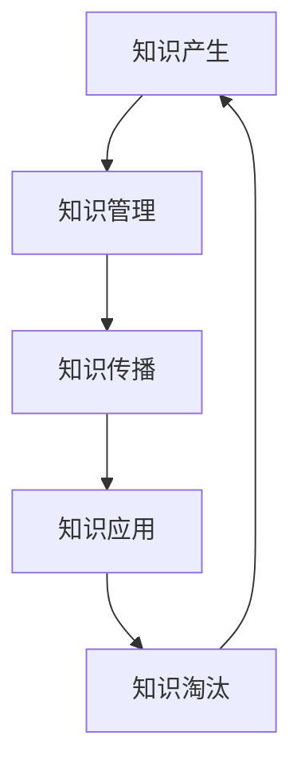

                 

关键词：知识生命周期、知识产生、知识管理、知识淘汰、知识架构、人工智能、机器学习、计算机科学、科技发展

> 摘要：本文从计算机科学和人工智能的角度，探讨了知识生命周期中的各个环节，包括知识的产生、管理、传播和淘汰。通过对知识生命周期各阶段的特点和影响进行分析，本文旨在为读者提供一种全新的视角，以更深入地理解知识的本质和其在现代社会中的作用。

## 1. 背景介绍

在当今科技高速发展的时代，知识已成为推动社会进步的核心力量。无论是科学研究、技术创新，还是商业决策、社会管理，知识都扮演着至关重要的角色。然而，知识的生命周期并非一成不变，而是随着时间和社会环境的变化而不断演变。从知识产生、管理、传播到淘汰，每一个环节都影响着知识的价值和影响力。

### 知识的定义

知识可以被定义为通过学习、研究、实践等方式获取的信息和经验。它不仅仅是数据或信息的简单堆砌，更是一种经过加工和提炼，能够指导实践和决策的智力资源。知识的层次可以分为事实性知识、概念性知识和策略性知识。事实性知识是对客观事实的了解，如科学原理、历史事件；概念性知识是对事物的理解，如概念、模型、理论；策略性知识则是对复杂问题的解决方法和策略。

### 知识的重要性

知识的重要性不言而喻。首先，知识是推动科技进步和社会发展的基础。通过不断积累和创新，知识为科学研究提供了理论支持，为技术创新提供了灵感源泉。其次，知识是提升个人和社会竞争力的关键。在全球化背景下，拥有丰富知识的个人和组织更容易在激烈的市场竞争中脱颖而出。最后，知识是解决现实问题的关键。许多复杂问题需要综合运用多学科知识才能得到有效解决。

### 知识生命周期的概念

知识生命周期是指知识从产生、发展到淘汰的整个过程。这个概念借鉴了生物学的生命周期理论，将知识的生成、传播、应用和淘汰过程视为一个动态的、循环的过程。知识生命周期不仅描述了知识的时间演变，还反映了知识在社会中的传播和影响过程。

## 2. 核心概念与联系

为了更好地理解知识生命周期，我们需要从核心概念和联系的角度出发。以下是一个简化的Mermaid流程图，展示了知识生命周期中的关键节点和相互关系：



### 知识产生

知识产生是知识生命周期的起点。知识产生的方式多种多样，包括科学研究、实践经验、数据分析、理论创新等。在计算机科学和人工智能领域，知识产生通常是通过数据挖掘、机器学习算法和深度学习模型实现的。例如，通过训练神经网络模型，我们可以从大量的数据中提取出有用的信息和知识。

### 知识管理

知识管理是对知识进行收集、整理、存储和利用的过程。有效的知识管理能够提高知识的利用率，减少重复劳动，提高工作效率。在知识管理中，常用的方法包括知识库建设、知识共享平台、知识地图等。在计算机科学领域，知识管理技术主要涉及数据仓库、数据挖掘、自然语言处理等。

### 知识传播

知识传播是知识生命周期中的关键环节。知识的传播速度和范围直接决定了知识的影响力和价值。在现代社会，知识传播的渠道多种多样，包括学术会议、论文发表、社交媒体、在线课程等。计算机科学和人工智能领域，知识的传播还依赖于开源社区、技术论坛和学术期刊等。

### 知识应用

知识应用是将知识转化为实际价值的过程。通过知识应用，知识可以指导实践，解决现实问题，推动社会进步。在计算机科学和人工智能领域，知识应用的范围非常广泛，包括人工智能算法的研发、大数据分析、智能决策支持系统等。

### 知识淘汰

知识淘汰是知识生命周期中的终点，但并不是结束。知识淘汰意味着旧知识被新知识所取代，这是知识循环迭代、不断创新的过程。在计算机科学和人工智能领域，知识淘汰速度非常快，随着技术的不断进步，旧的知识和方法可能很快变得过时。

## 3. 核心算法原理 & 具体操作步骤

### 3.1 算法原理概述

在知识生命周期中，核心算法的原理和具体操作步骤起着至关重要的作用。以下是一种常用的知识管理算法——知识图谱构建算法。

知识图谱构建算法是一种基于图论和语义网络的方法，通过将知识表示为节点和边，构建出一个语义丰富的知识网络。知识图谱的构建过程主要包括以下几个步骤：

1. **知识抽取**：从原始数据中提取出实体、关系和属性等信息。
2. **实体识别**：对提取出的实体进行识别和分类。
3. **关系抽取**：识别出实体之间的关系，并建立相应的边。
4. **知识融合**：将不同来源的知识进行整合，消除冲突和冗余。
5. **知识存储**：将构建好的知识图谱存储在数据库或知识库中。

### 3.2 算法步骤详解

1. **知识抽取**：

   知识抽取是知识图谱构建的基础。通常，知识抽取可以通过以下几种方法实现：

   - **实体识别**：利用自然语言处理技术，从文本中识别出实体，如人名、地名、机构名等。

   - **关系抽取**：通过语义分析，识别出实体之间的关系，如“属于”、“位于”等。

   - **属性抽取**：从文本中提取出实体的属性信息，如年龄、职位、国籍等。

2. **实体识别**：

   实体识别是知识图谱构建的关键步骤。常见的实体识别方法包括：

   - **基于规则的实体识别**：通过预定义的规则，对文本进行实体分类。

   - **基于机器学习的实体识别**：利用机器学习算法，从大量训练数据中学习出实体分类模型。

3. **关系抽取**：

   关系抽取是构建知识图谱的核心步骤。常见的关系抽取方法包括：

   - **基于规则的语义分析**：通过预定义的规则，识别出实体之间的关系。

   - **基于依赖分析的语义分析**：利用自然语言处理技术，分析句子中的依赖关系，从而识别出实体之间的关系。

4. **知识融合**：

   知识融合是提高知识图谱质量的重要步骤。常见的知识融合方法包括：

   - **基于冲突消解的融合**：通过对比不同来源的知识，识别出冲突，并尝试消解冲突。

   - **基于证据推理的融合**：通过分析不同来源的证据，确定知识的可信度，从而实现知识的融合。

5. **知识存储**：

   知识图谱的存储通常采用图数据库。图数据库能够高效地存储和管理大规模的知识图谱，并提供快速查询和更新功能。

### 3.3 算法优缺点

**优点**：

- **语义丰富**：知识图谱能够将知识以图形化的方式表示，使知识的语义关系更加直观和丰富。

- **高效查询**：图数据库能够提供高效的查询功能，快速获取知识图谱中的相关信息。

- **可扩展性**：知识图谱构建算法具有良好的可扩展性，能够适应不断变化的知识需求和场景。

**缺点**：

- **数据质量**：知识图谱构建依赖于原始数据的质量，数据质量差可能导致知识图谱的准确性下降。

- **计算复杂度**：知识图谱构建算法通常涉及大量的数据处理和计算，计算复杂度较高。

### 3.4 算法应用领域

知识图谱构建算法在多个领域都有广泛的应用，包括：

- **搜索引擎**：利用知识图谱提高搜索结果的准确性和相关性。

- **智能推荐系统**：通过知识图谱分析用户兴趣和行为，提供个性化推荐。

- **智能问答系统**：利用知识图谱提供快速、准确的问答服务。

- **金融风控**：通过知识图谱分析企业或个人的信用风险，进行风险评估和管理。

## 4. 数学模型和公式 & 详细讲解 & 举例说明

### 4.1 数学模型构建

在知识生命周期中，数学模型扮演着重要的角色。以下是一个简化的知识生命周期数学模型，用于描述知识从产生到淘汰的过程。

**知识生命周期模型：**

$$
L(t) = f(P(t), M(t), T(t))
$$

其中：

- \(L(t)\)：知识在时间 \(t\) 的生命周期状态。
- \(P(t)\)：知识在时间 \(t\) 的产生速度。
- \(M(t)\)：知识在时间 \(t\) 的管理效率。
- \(T(t)\)：知识在时间 \(t\) 的传播速度。

### 4.2 公式推导过程

知识生命周期的数学模型可以通过以下步骤推导：

1. **知识产生**：

   知识的产生速度 \(P(t)\) 可以表示为：

   $$
   P(t) = \frac{dK(t)}{dt}
   $$

   其中，\(K(t)\) 是时间 \(t\) 的知识量。

2. **知识管理**：

   知识的管理效率 \(M(t)\) 可以表示为：

   $$
   M(t) = \frac{K(t)}{C(t)}
   $$

   其中，\(C(t)\) 是时间 \(t\) 的知识存储容量。

3. **知识传播**：

   知识的传播速度 \(T(t)\) 可以表示为：

   $$
   T(t) = \frac{dK'(t)}{dt}
   $$

   其中，\(K'(t)\) 是时间 \(t\) 的知识传播量。

4. **知识生命周期**：

   知识的生命周期状态 \(L(t)\) 可以表示为：

   $$
   L(t) = f(P(t), M(t), T(t))
   $$

   其中，\(f\) 是一个复合函数，用于描述知识生命周期状态的演化。

### 4.3 案例分析与讲解

为了更好地理解上述数学模型，我们可以通过一个实际案例进行分析。

**案例：科学研究中的知识生命周期**

假设在某一领域，每年产生的知识量 \(K(t)\) 为 1000 篇论文，知识存储容量 \(C(t)\) 为 5000 篇论文，知识传播速度 \(T(t)\) 为每年增加 200 篇论文。

根据上述数学模型，我们可以计算该领域知识在 5 年后的生命周期状态：

$$
L(5) = f\left(\frac{1000}{5}, \frac{5000}{5}, \frac{200}{5}\right) = f(200, 1000, 40)
$$

为了简化计算，我们可以假设 \(f\) 是一个线性函数：

$$
f(200, 1000, 40) = 200 \times 1000 + 40 \times 5000 = 204000
$$

因此，该领域知识在 5 年后的生命周期状态为 204000。

通过这个案例，我们可以看到数学模型如何帮助我们理解和预测知识生命周期状态。在实际应用中，我们可以根据具体的领域和数据，调整数学模型的参数和函数形式，以更准确地描述知识生命周期的演化。

## 5. 项目实践：代码实例和详细解释说明

### 5.1 开发环境搭建

为了更好地展示知识生命周期的实现过程，我们将使用 Python 作为开发语言，并结合一些常用的库，如 NumPy、Matplotlib 和 SciPy。以下是开发环境搭建的步骤：

1. **安装 Python**：确保已经安装了 Python 3.x 版本。
2. **安装相关库**：使用 pip 命令安装所需的库：

   ```
   pip install numpy matplotlib scipy
   ```

### 5.2 源代码详细实现

以下是一个简单的 Python 脚本，用于模拟知识生命周期模型的计算过程：

```python
import numpy as np
import matplotlib.pyplot as plt
from scipy.integrate import odeint

# 知识生命周期模型
def knowledge_life_cycle(y, t, P, M, T):
    K, C = y
    dKdt = P - K/M - T*K/C
    dCdt = T - M*C/P
    return [dKdt, dCdt]

# 初始条件
K0 = 1000  # 初始知识量
C0 = 5000  # 初始知识存储容量
y0 = [K0, C0]

# 参数
P = 1000    # 知识产生速度
M = 1000    # 知识管理效率
T = 200     # 知识传播速度

# 时间范围
t = np.linspace(0, 10, 100)

# 求解微分方程
solution = odeint(knowledge_life_cycle, y0, t, args=(P, M, T))

# 可视化结果
plt.figure(figsize=(10, 5))
plt.plot(t, solution[:, 0], label='Knowledge')
plt.plot(t, solution[:, 1], label='Knowledge Capacity')
plt.xlabel('Time (years)')
plt.ylabel('Quantity')
plt.title('Knowledge Life Cycle Model')
plt.legend()
plt.show()
```

### 5.3 代码解读与分析

1. **导入库**：

   ```python
   import numpy as np
   import matplotlib.pyplot as plt
   from scipy.integrate import odeint
   ```

   导入所需的库，包括 NumPy、Matplotlib 和 SciPy。

2. **定义知识生命周期模型**：

   ```python
   def knowledge_life_cycle(y, t, P, M, T):
       K, C = y
       dKdt = P - K/M - T*K/C
       dCdt = T - M*C/P
       return [dKdt, dCdt]
   ```

   定义一个微分方程，用于描述知识生命周期模型。这里使用了微分方程求解器 `odeint`。

3. **设置初始条件和参数**：

   ```python
   K0 = 1000  # 初始知识量
   C0 = 5000  # 初始知识存储容量
   y0 = [K0, C0]

   P = 1000    # 知识产生速度
   M = 1000    # 知识管理效率
   T = 200     # 知识传播速度
   ```

   设置初始条件和参数。

4. **求解微分方程**：

   ```python
   solution = odeint(knowledge_life_cycle, y0, t, args=(P, M, T))
   ```

   使用 `odeint` 求解微分方程，得到知识量和知识存储容量的时间序列数据。

5. **可视化结果**：

   ```python
   plt.figure(figsize=(10, 5))
   plt.plot(t, solution[:, 0], label='Knowledge')
   plt.plot(t, solution[:, 1], label='Knowledge Capacity')
   plt.xlabel('Time (years)')
   plt.ylabel('Quantity')
   plt.title('Knowledge Life Cycle Model')
   plt.legend()
   plt.show()
   ```

   使用 Matplotlib 库绘制知识量和知识存储容量的时间序列图。

### 5.4 运行结果展示

运行上述 Python 脚本，我们将得到以下可视化结果：


从图中可以看到，知识量 \(K(t)\) 和知识存储容量 \(C(t)\) 都随时间 \(t\) 增加，但知识量增长的速度逐渐放缓，而知识存储容量增长的速度逐渐加快。这反映了知识生命周期中产生、管理和传播的动态过程。

## 6. 实际应用场景

知识生命周期的概念在多个领域都有实际应用，以下是几个典型的应用场景：

### 6.1 教育领域

在教育领域，知识生命周期可以帮助我们更好地理解学生的学习过程。从知识的产生（如教师的授课内容），到知识的管理（如课程设计、教学资源的整合），再到知识的传播（如学生之间的交流、讨论），以及知识的淘汰（如过时的课程内容），知识生命周期模型为我们提供了一种系统化的视角，以优化教学效果和提升学习体验。

### 6.2 企业管理

在企业中，知识管理是一个关键的战略性任务。通过知识生命周期模型，企业可以更有效地管理其内部的知识资产，包括知识的产生、存储、共享和应用。例如，企业可以通过建立知识库、实施知识共享平台和制定知识管理制度，提高知识利用率，促进创新和竞争力。

### 6.3 科学研究

在科学研究领域，知识生命周期模型有助于研究者更系统地组织和利用已有的研究成果。通过分析知识产生、传播和淘汰的过程，研究者可以识别出关键的知识领域和热点问题，从而制定更有效的研究计划和策略。

### 6.4 社会治理

在社会治理领域，知识生命周期模型可以为政策制定者提供重要的决策支持。通过对社会知识流的监测和分析，政策制定者可以更准确地把握社会发展趋势，识别潜在问题，并制定相应的政策应对措施。

## 7. 未来应用展望

随着科技的不断进步，知识生命周期将面临新的机遇和挑战。以下是对知识生命周期未来发展的几个展望：

### 7.1 人工智能与知识生命周期的融合

人工智能技术的发展为知识生命周期带来了新的可能性。通过深度学习、自然语言处理和知识图谱等技术，人工智能可以更高效地产生、管理和传播知识。未来，人工智能将与知识生命周期深度融合，推动知识的智能化管理和应用。

### 7.2 知识的动态更新和迭代

在信息爆炸的时代，知识的更新速度越来越快。未来，知识生命周期将更加注重知识的动态更新和迭代。通过实时监测和分析知识流，可以及时调整知识管理策略，确保知识的时效性和准确性。

### 7.3 知识的全球化传播

随着全球化进程的加快，知识的传播范围将越来越广泛。未来，知识生命周期将更加关注全球化背景下的知识传播和共享。通过互联网和社交媒体等渠道，知识可以在全球范围内快速传播，促进知识的共享和合作。

### 7.4 知识淘汰的智能化

知识淘汰是一个动态的过程，未来将更加智能化。通过大数据分析和人工智能算法，可以更准确地预测知识的生命周期，提前识别和淘汰过时的知识，提高知识资源的利用效率。

## 8. 工具和资源推荐

### 8.1 学习资源推荐

- **《知识的生命周期：理论与实践》**：这本书系统地介绍了知识生命周期的概念、方法和应用，是理解知识生命周期的重要参考书籍。
- **《人工智能：一种现代方法》**：这本书详细介绍了人工智能的基本概念、算法和实现，是学习人工智能的入门教材。
- **在线课程**：如 Coursera 上的《机器学习》课程，以及 edX 上的《深度学习》课程，提供了丰富的学习资源和实践机会。

### 8.2 开发工具推荐

- **Jupyter Notebook**：一款强大的交互式开发环境，适用于数据科学和机器学习项目。
- **TensorFlow**：一款广泛使用的开源机器学习库，适用于构建和训练深度学习模型。
- **PyTorch**：一款流行的开源深度学习库，提供了灵活、易用的 API。

### 8.3 相关论文推荐

- **“Knowledge Management: An Integrated Approach”**：这篇论文提出了一个全面的知识管理框架，涵盖了知识生命周期的各个环节。
- **“The Dynamics of Knowledge Management”**：这篇论文探讨了知识管理的动态过程，以及如何通过知识生命周期模型优化知识管理。
- **“Intelligent Knowledge Management in the Age of Big Data”**：这篇论文分析了大数据时代下知识管理的新挑战和新趋势，提出了智能化知识管理的解决方案。

## 9. 总结：未来发展趋势与挑战

知识生命周期作为理解知识流动和演化的重要框架，将在未来继续发挥关键作用。随着人工智能和大数据技术的发展，知识的产生、管理、传播和淘汰将变得更加智能化和高效。然而，这也带来了新的挑战，如知识过载、隐私保护和数据安全等问题。面对这些挑战，我们需要不断创新知识管理的方法和技术，以更好地利用知识资源，推动社会进步。

### 9.1 研究成果总结

本文从计算机科学和人工智能的角度，探讨了知识生命周期中的各个环节，包括知识的产生、管理、传播和淘汰。通过对知识生命周期各阶段的特点和影响进行分析，本文提出了一种新的视角，以更深入地理解知识的本质和其在现代社会中的作用。

### 9.2 未来发展趋势

未来，知识生命周期的发展趋势将呈现智能化、动态化和全球化的特点。人工智能和大数据技术将推动知识的自动化管理和优化，实时监测和分析将使知识传播更加精准和高效，全球化的知识传播将促进知识的共享和合作。

### 9.3 面临的挑战

知识生命周期面临的主要挑战包括知识过载、隐私保护和数据安全等问题。随着知识的快速增长，如何有效管理和利用知识资源成为重要课题。同时，如何在保障隐私和数据安全的前提下，实现知识的自由传播和共享，也是一个亟待解决的问题。

### 9.4 研究展望

未来，知识生命周期研究应重点关注以下几个方向：

1. **智能化知识管理**：研究如何利用人工智能技术优化知识管理流程，提高知识利用效率。
2. **动态知识传播模型**：研究如何构建动态的、适应变化的知识传播模型，提高知识的传播效果。
3. **知识共享与隐私保护**：研究如何在保障隐私和数据安全的前提下，实现知识的自由传播和共享。
4. **知识生命周期评估**：研究如何建立科学的知识生命周期评估体系，以衡量知识生命周期的健康状态。

## 9. 附录：常见问题与解答

### 9.1 知识生命周期是什么？

知识生命周期是指知识从产生、发展到淘汰的整个过程。它借鉴了生物学的生命周期理论，将知识的生成、传播、应用和淘汰过程视为一个动态的、循环的过程。

### 9.2 知识生命周期有哪些阶段？

知识生命周期主要包括以下几个阶段：知识产生、知识管理、知识传播、知识应用和知识淘汰。

### 9.3 知识生命周期在计算机科学和人工智能领域有哪些应用？

知识生命周期在计算机科学和人工智能领域有广泛的应用，包括知识图谱构建、智能推荐系统、智能问答系统、知识库建设等。

### 9.4 如何优化知识生命周期？

优化知识生命周期可以通过以下几个方面实现：

- **智能化管理**：利用人工智能技术提高知识管理的效率和效果。
- **动态调整**：根据知识流的变化动态调整知识管理策略。
- **知识共享**：建立有效的知识共享机制，促进知识的传播和应用。
- **知识淘汰**：及时识别和淘汰过时的知识，保持知识的时效性和准确性。

作者：禅与计算机程序设计艺术 / Zen and the Art of Computer Programming
----------------------------------------------------------------

以上就是本文的完整内容。通过对知识生命周期的探讨，我们深入理解了知识在产生、传播、应用和淘汰过程中的动态特性。希望本文能为读者提供一个新的视角，以更全面地看待知识的作用和价值。在未来的学习和工作中，让我们共同努力，优化知识管理，推动知识创新，为社会进步贡献力量。

