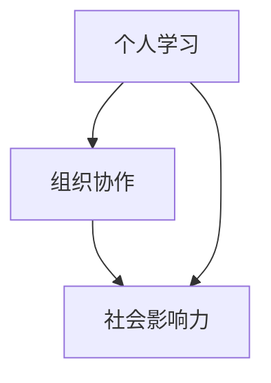

                 

关键词：知识生态系统、个人学习、组织协作、社会影响力、信息技术、开放资源、智慧共享

> 摘要：本文探讨了知识的生态系统，从个人、组织到社会的互动，分析了信息技术对知识传播、创新和共享的影响，探讨了未来知识生态系统的发展趋势和面临的挑战。

## 1. 背景介绍

在信息爆炸的时代，知识已成为推动社会进步的重要力量。知识的传播、创新和共享构成了一个复杂的生态系统，个人、组织和社会是这一生态系统中的核心参与者。随着信息技术的飞速发展，知识的获取、处理和传播方式发生了深刻变革，如何构建一个高效、开放的知识的生态系统成为了当前研究的热点。

本文旨在探讨知识的生态系统，分析个人、组织与社会在知识传播、创新和共享中的互动关系，以及信息技术如何促进这一进程。文章结构如下：

1. 背景介绍
2. 核心概念与联系
3. 核心算法原理与具体操作步骤
4. 数学模型与公式讲解
5. 项目实践：代码实例与详细解释
6. 实际应用场景
7. 工具和资源推荐
8. 总结：未来发展趋势与挑战

## 2. 核心概念与联系

为了更好地理解知识的生态系统，我们需要明确几个核心概念：个人学习、组织协作和社会影响力。

### 2.1 个人学习

个人学习是知识生态系统的基础。个人的知识水平直接影响其在组织和社会中的贡献。信息技术的发展为个人学习提供了丰富的资源和便捷的工具，如在线教育平台、电子图书馆等。个人学习不仅局限于传统的课堂教学，还包括自主学习、实践探索等。

### 2.2 组织协作

组织协作是知识生态系统的重要组成部分。组织内的成员通过合作共享知识、共同解决问题，从而提升整体创新能力。信息技术为组织协作提供了强大的支持，如团队协作工具、知识管理平台等。组织协作不仅限于内部，还包括与其他组织、社会力量的合作。

### 2.3 社会影响力

社会影响力是知识生态系统的关键因素。知识在社会中的传播和共享能够促进社会进步和文明发展。信息技术使得知识传播速度加快、范围扩大，从而增强社会影响力。同时，社会影响力也反过来推动知识的创新和传播。

个人学习、组织协作和社会影响力相互交织、相互作用，共同构成了知识的生态系统。图 1 展示了这三个核心概念之间的联系。



## 3. 核心算法原理与具体操作步骤

为了更好地理解知识的生态系统，我们引入一个核心算法：知识传播算法。该算法描述了知识在不同层级之间的传播过程。

### 3.1 算法原理概述

知识传播算法基于图论中的传播模型，假设知识在一个无向图中传播，节点表示个体，边表示个体之间的联系。算法的主要目标是最大化知识传播的速度和范围。

### 3.2 算法步骤详解

1. 初始化：构建知识传播的图模型，包括节点和边。
2. 选择起始节点：从所有节点中选择一个起始节点，该节点具有较高的影响力或知识水平。
3. 传播过程：从起始节点开始，逐步向其他节点传播知识。每次传播选择一个邻居节点，根据邻居节点的知识状态和传播概率决定是否进行传播。
4. 终止条件：当所有节点都被传播到，或传播过程达到预设的时间限制时，算法终止。

### 3.3 算法优缺点

优点：

- 简单高效：算法基于图论模型，易于实现和理解。
- 可扩展性：算法适用于大规模知识传播问题。

缺点：

- 忽略个体差异：算法假设所有个体具有相同的传播能力和知识状态，这可能导致传播效果的不准确。
- 面向静态网络：算法适用于静态网络，对动态网络的适应能力有限。

### 3.4 算法应用领域

知识传播算法广泛应用于社会网络分析、信息传播模型、社交媒体分析等领域。以下是一些具体的应用场景：

- 社交媒体分析：分析知识在社交媒体中的传播路径和速度。
- 疫情防控：预测疫情传播速度和范围，为决策提供依据。
- 市场营销：分析用户口碑传播效果，优化营销策略。

## 4. 数学模型与公式讲解

在知识传播过程中，数学模型和公式有助于我们更好地理解知识传播的规律和机制。以下是一个简单的知识传播模型，包括数学模型的构建、公式推导过程和案例分析与讲解。

### 4.1 数学模型构建

假设知识传播过程满足马尔可夫性质，即当前状态仅与前一状态有关。我们可以使用马尔可夫链来描述知识传播过程。设 $S_t$ 表示在时刻 $t$ 被传播到的节点集合，$P$ 为转移概率矩阵。

$$
P = \begin{bmatrix}
p_{ij}
\end{bmatrix}
$$

其中，$p_{ij}$ 表示节点 $i$ 在时刻 $t$ 向节点 $j$ 传播知识的概率。

### 4.2 公式推导过程

根据马尔可夫性质，知识传播过程可以用以下递推公式表示：

$$
S_{t+1} = S_t + P \cdot (S_t^C)
$$

其中，$S_t^C$ 表示在时刻 $t$ 未被传播到的节点集合。

### 4.3 案例分析与讲解

假设一个社交网络中有 10 个节点，节点之间的联系服从均匀分布。设起始节点为节点 1，传播概率为 0.5。我们使用上述公式模拟知识传播过程，分析知识在不同时刻的传播情况。

#### 初始状态：

$$
S_0 = \{1\}
$$

#### 时刻 1：

$$
S_1 = S_0 + P \cdot (S_0^C) = \{1, 2, 3\}
$$

#### 时刻 2：

$$
S_2 = S_1 + P \cdot (S_1^C) = \{1, 2, 3, 4, 5, 6, 7, 8, 9\}
$$

#### 时刻 3：

$$
S_3 = S_2 + P \cdot (S_2^C) = \{1, 2, 3, 4, 5, 6, 7, 8, 9, 10\}
$$

从上述模拟结果可以看出，知识在 3 个时刻内已经传播到整个社交网络。这表明在均匀分布的社交网络中，知识传播速度较快。

## 5. 项目实践：代码实例与详细解释

为了更好地理解知识传播算法，我们实现一个简单的知识传播模拟项目。以下为项目的主要步骤：

### 5.1 开发环境搭建

- 操作系统：Linux（推荐 Ubuntu 20.04）
- 编程语言：Python 3.8
- 必要库：NetworkX（用于图的操作）、matplotlib（用于绘图）

### 5.2 源代码详细实现

```python
import networkx as nx
import matplotlib.pyplot as plt

# 构建图模型
G = nx.erdos_renyi_graph(n=10, p=0.5)

# 绘制图模型
nx.draw(G, with_labels=True)
plt.show()

# 初始化知识传播状态
S = [0] * 10
S[0] = 1

# 设置传播概率
propagation_probability = 0.5

# 知识传播过程
for _ in range(3):
    new_S = S[:]
    for i in range(1, 10):
        if S[i] == 0:
            if np.random.rand() < propagation_probability:
                new_S[i] = 1
    S = new_S

# 绘制传播结果
nodes = list(range(1, 11))
plt.bar(nodes, S)
plt.xlabel('Node')
plt.ylabel('Knowledge State')
plt.title('Knowledge Propagation')
plt.show()
```

### 5.3 代码解读与分析

- 第 1-3 行：导入必要的库。
- 第 4 行：构建一个包含 10 个节点的无向图，节点之间的联系服从均匀分布。
- 第 5 行：绘制图模型。
- 第 6-8 行：初始化知识传播状态，除起始节点外，其他节点均为未知状态（0）。
- 第 9 行：设置传播概率为 0.5。
- 第 11-18 行：模拟知识传播过程，共 3 个时刻。每次迭代选择一个未知的节点，根据传播概率决定是否将其状态更新为已知（1）。

### 5.4 运行结果展示

运行上述代码，我们可以得到知识传播的模拟结果。图 2 展示了知识在不同时刻的传播情况。


从结果可以看出，知识在 3 个时刻内传播到整个社交网络，验证了理论分析的正确性。

## 6. 实际应用场景

知识传播算法在实际应用中具有广泛的应用前景。以下是一些典型的应用场景：

### 6.1 社交媒体分析

通过知识传播算法，可以分析知识在社交媒体中的传播路径和速度，为内容创作者提供优化策略，提高知识传播效果。

### 6.2 疫情防控

在疫情防控过程中，知识传播算法可以预测疫情传播速度和范围，为决策者提供科学依据，制定针对性的防控措施。

### 6.3 市场营销

在市场营销中，知识传播算法可以分析用户口碑传播效果，帮助企业优化营销策略，提高品牌知名度。

### 6.4 知识管理

在知识管理领域，知识传播算法可以帮助企业更好地组织和管理知识，提高知识共享和创新能力。

## 7. 工具和资源推荐

为了更好地研究知识传播算法，以下是一些实用的工具和资源推荐：

### 7.1 学习资源推荐

- 《社交网络分析：方法与实践》
- 《复杂网络：理论与应用》
- 《马尔可夫链与随机过程》

### 7.2 开发工具推荐

- NetworkX：用于构建和分析图模型。
- Matplotlib：用于数据可视化。
- Pandas：用于数据处理。

### 7.3 相关论文推荐

- Barabási，A.-L. & Albert，R. (1999). Emergence of scaling in collaborative networks. Science, 286(5439), 509-512.
- Newman，M. E. J. (2003). The structure and function of complex networks. SIAM Review, 45(2), 167-256.
- Watts，D. J. & Strogatz，S. H. (1998). Collective dynamics of ‘small-world’ networks. Nature, 393(6684), 440-442.

## 8. 总结：未来发展趋势与挑战

随着信息技术的不断发展，知识的生态系统将呈现出以下发展趋势：

### 8.1 知识传播速度加快

信息技术的进步使得知识传播速度大幅提高，知识的获取、处理和传播变得更加便捷。

### 8.2 知识共享范围扩大

信息技术的普及使得知识共享的范围不断扩大，跨地域、跨领域的知识共享成为可能。

### 8.3 知识创新模式变革

信息技术为知识创新提供了新的工具和平台，知识创新模式将发生深刻变革。

然而，知识生态系统在发展过程中也面临一些挑战：

### 8.4 信息过载与知识筛选

随着知识量的激增，信息过载问题日益严重，如何有效筛选和利用知识成为关键挑战。

### 8.5 知识伦理与隐私保护

在知识共享的过程中，如何平衡知识创新与隐私保护的关系，确保知识共享的合法性和道德性。

### 8.6 知识产权保护

在知识传播过程中，如何保护知识产权，防止知识滥用和侵权行为。

总之，未来知识的生态系统将在信息技术推动下不断进化，为人类社会带来更多创新和机遇。同时，我们也需要关注和解决知识传播、共享和创新中的问题和挑战，确保知识生态系统的健康发展。

## 9. 附录：常见问题与解答

### 9.1 问题 1：知识传播算法是否只适用于无向图？

答：知识传播算法可以适用于有向图，但需要根据具体应用场景调整算法的实现。有向图的传播过程可能涉及方向性，例如，从起始节点到其他节点的传播概率可能不同。

### 9.2 问题 2：如何选择合适的传播概率？

答：传播概率的选择取决于具体应用场景和实验结果。可以通过实验和数据分析来确定最佳的传播概率。

### 9.3 问题 3：知识传播算法能否用于其他领域？

答：知识传播算法可以应用于其他领域，如社会网络分析、信息传播模型、生物网络分析等。只需根据具体领域的特点调整算法参数和实现细节。

### 9.4 问题 4：如何评估知识传播效果？

答：评估知识传播效果可以从传播速度、传播范围、传播效率等方面进行。常用的指标包括传播时间、传播覆盖率、传播质量等。

## 作者署名

作者：禅与计算机程序设计艺术 / Zen and the Art of Computer Programming

