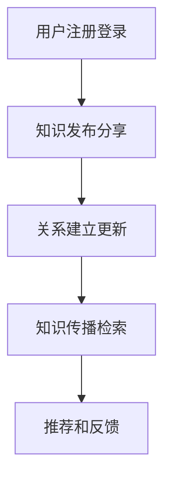

                 

关键词：知识传播、社交网络、信息扩散、人工智能、大数据分析、知识图谱

> 摘要：本文探讨了知识传播在社交媒体和人工智能技术迅猛发展的背景下，如何通过构建知识的社交网络实现思想的有效传播。文章首先介绍了知识社交网络的概念，分析了其核心原理和关键特性，随后详细阐述了知识传播的算法原理及操作步骤，并结合具体实例进行了数学模型和公式的推导与讲解。文章最后讨论了知识社交网络在实际应用场景中的表现，提出了未来应用前景和面临的挑战，并推荐了相关学习和开发资源。

## 1. 背景介绍

### 社交媒体时代的知识传播

随着互联网和社交媒体的普及，知识的传播方式发生了根本性的变革。传统的知识传播依赖于专家和媒介，而如今，每个人都可以成为知识的传播者。社交媒体平台如Twitter、LinkedIn、知乎等，成为知识分享和交流的重要场所。用户通过发布文章、评论、分享等方式，将知识传递给他人。这种去中心化的传播方式，极大地提升了知识传播的效率和覆盖范围。

### 人工智能与大数据分析

人工智能技术的发展，使得知识传播的自动化程度得到了显著提升。通过自然语言处理、推荐系统等技术，人工智能能够分析用户的行为和兴趣，为用户推荐个性化的知识内容。大数据分析则通过对用户数据的挖掘和分析，揭示了知识传播的规律和趋势，为知识的精准传播提供了数据支持。

### 知识社交网络的概念

知识社交网络是指一个由知识节点和关系边构成的网络，其中每个节点代表一个知识单元，如文章、书籍、论文等，而关系边则表示知识单元之间的关联和交互。知识社交网络不仅能够实现知识的有效存储和检索，还可以通过分析网络结构和节点关系，揭示知识传播的规律和关键因素。

## 2. 核心概念与联系

### 知识社交网络的原理

知识社交网络的构建基于以下核心原理：

1. **知识节点**：知识节点是知识社交网络的基本单元，代表各种知识实体，如文章、书籍、论文等。
2. **关系边**：关系边表示知识节点之间的关联，可以是引用、提及、评论等形式。
3. **网络拓扑**：知识社交网络的拓扑结构反映了知识节点之间的相互关系，包括层次结构、网络密度、聚类系数等。
4. **信息传播**：信息传播是通过知识节点之间的连接实现的，包括直接传播和间接传播。

### 知识社交网络的关键特性

1. **去中心化**：知识社交网络不是由单一中心节点控制，而是由多个节点共同构成，每个节点都可以进行知识的发布和分享。
2. **动态性**：知识社交网络是动态变化的，随着用户行为和知识内容的更新，网络结构和关系也会不断演变。
3. **自组织性**：知识社交网络具有自组织性，通过节点间的互动和协作，可以自发地形成新的知识结构和关系。
4. **知识丰富性**：知识社交网络汇集了大量的知识资源，为用户提供丰富的知识内容。

### 知识社交网络的架构

知识社交网络的架构包括以下几个关键组成部分：

1. **知识存储**：用于存储各种知识资源，如文章、书籍、论文等。
2. **知识检索**：通过关键词、分类、标签等方式，帮助用户快速找到所需知识。
3. **关系管理**：维护知识节点之间的关系，包括引用、提及、评论等。
4. **社交互动**：支持用户之间的交流和协作，包括评论、点赞、分享等功能。
5. **推荐系统**：根据用户行为和兴趣，为用户推荐个性化的知识内容。

### 知识社交网络的工作流程

1. **用户注册和登录**：用户通过注册和登录，获取个人账号和权限。
2. **知识发布和分享**：用户可以发布新的知识内容或分享已有的知识资源。
3. **关系建立和更新**：用户通过评论、点赞、分享等方式与其他用户建立和更新关系。
4. **知识传播和检索**：用户通过搜索和浏览，获取和传播知识内容。
5. **推荐和反馈**：系统根据用户行为和兴趣，推荐个性化知识内容，并收集用户反馈进行优化。

### Mermaid 流程图



## 3. 核心算法原理 & 具体操作步骤

### 3.1 算法原理概述

知识社交网络的核心算法包括知识检索算法、推荐算法、社交影响力算法等。这些算法基于大数据分析和人工智能技术，旨在提高知识传播的效率和质量。

### 3.2 算法步骤详解

#### 3.2.1 知识检索算法

1. **关键词提取**：从用户输入的关键词中提取关键词，构建关键词词典。
2. **倒排索引构建**：构建倒排索引，将关键词与对应的文档关联起来。
3. **相似度计算**：计算用户查询与文档之间的相似度，选取最相关的文档。
4. **排序与返回**：将检索结果按照相似度排序，返回给用户。

#### 3.2.2 推荐算法

1. **用户画像构建**：根据用户行为和兴趣，构建用户画像。
2. **内容特征提取**：提取知识内容的关键特征，如关键词、标签、分类等。
3. **相似度计算**：计算用户画像与内容特征之间的相似度。
4. **推荐列表生成**：根据相似度计算结果，生成个性化推荐列表。

#### 3.2.3 社交影响力算法

1. **影响力评估**：根据用户的社会影响力指标，如关注数、点赞数、评论数等，评估用户的影响力。
2. **关系网络分析**：分析用户之间的社交关系，构建社交影响力网络。
3. **影响力传播**：根据社交影响力网络，传播知识内容。
4. **效果评估**：评估社交影响力传播的效果，优化算法参数。

### 3.3 算法优缺点

**优点**：

- 提高知识传播效率：通过算法优化，实现快速的知识检索和推荐，提高用户获取知识的效率。
- 精准定位用户需求：通过用户画像和内容特征提取，实现精准的知识推荐，满足用户个性化需求。
- 促进社交互动：通过社交影响力算法，鼓励用户参与知识传播，促进社交互动。

**缺点**：

- 数据隐私问题：用户数据被收集和分析，可能引发数据隐私问题。
- 算法偏见：算法可能存在偏见，导致推荐结果不公正。

### 3.4 算法应用领域

知识社交网络算法广泛应用于多个领域：

- 社交媒体平台：如Twitter、LinkedIn等，通过推荐算法和影响力算法，提高用户互动和参与度。
- 在线教育平台：如Coursera、edX等，通过知识检索和推荐算法，帮助用户发现感兴趣的课程和内容。
- 专业领域社区：如知乎、Stack Overflow等，通过社交影响力算法，鼓励专业用户分享知识和经验。

## 4. 数学模型和公式 & 详细讲解 & 举例说明

### 4.1 数学模型构建

知识社交网络的数学模型主要包括以下几个部分：

1. **知识节点模型**：表示知识单元的基本属性，如标题、摘要、关键词等。
2. **关系模型**：表示知识节点之间的关联关系，如引用、提及、评论等。
3. **用户模型**：表示用户的基本属性，如年龄、性别、职业等。
4. **社交网络模型**：表示用户之间的社交关系和影响力。

### 4.2 公式推导过程

1. **知识节点相似度计算公式**：

$$
sim(A,B) = \frac{J(A \cap B)}{\sqrt{J(A) \cdot J(B)}}
$$

其中，$sim(A,B)$表示知识节点$A$和$B$之间的相似度，$J(A \cap B)$表示知识节点$A$和$B$的交集关键词数，$J(A)$和$J(B)$分别表示知识节点$A$和$B$的关键词数。

2. **用户画像相似度计算公式**：

$$
sim(U,V) = \frac{J(U \cap V)}{\sqrt{J(U) \cdot J(V)}}
$$

其中，$sim(U,V)$表示用户$U$和$V$之间的相似度，$J(U \cap V)$表示用户$U$和$V$的交集属性数，$J(U)$和$J(V)$分别表示用户$U$和$V$的属性数。

3. **社交影响力计算公式**：

$$
influence(U) = \frac{\sum_{i=1}^{n} sim(U,V_i) \cdot influence(V_i)}{n}
$$

其中，$influence(U)$表示用户$U$的社交影响力，$sim(U,V_i)$表示用户$U$和$V_i$之间的相似度，$influence(V_i)$表示用户$V_i$的社交影响力，$n$表示用户$U$的邻居数。

### 4.3 案例分析与讲解

假设有两个知识节点$A$和$B$，它们的关键词集合分别为$J(A) = \{A1, A2, A3\}$和$J(B) = \{B1, B2, B3\}$，交集关键词集合为$J(A \cap B) = \{A2\}$。根据相似度计算公式，可以计算出$A$和$B$之间的相似度为：

$$
sim(A,B) = \frac{1}{\sqrt{3 \cdot 3}} = \frac{1}{3}
$$

假设有两个用户$U$和$V$，它们的属性集合分别为$J(U) = \{U1, U2, U3\}$和$J(V) = \{V1, V2, V3\}$，交集属性集合为$J(U \cap V) = \{U1, U2\}$。根据相似度计算公式，可以计算出$U$和$V$之间的相似度为：

$$
sim(U,V) = \frac{2}{\sqrt{3 \cdot 3}} = \frac{2}{3}
$$

假设用户$U$的邻居数为$n=2$，邻居用户$V_1$和$V_2$的社交影响力分别为$influence(V_1) = 0.6$和$influence(V_2) = 0.4$，根据社交影响力计算公式，可以计算出用户$U$的社交影响力为：

$$
influence(U) = \frac{sim(U,V_1) \cdot influence(V_1) + sim(U,V_2) \cdot influence(V_2)}{n} = \frac{\frac{2}{3} \cdot 0.6 + \frac{2}{3} \cdot 0.4}{2} = \frac{0.8 + 0.8}{2} = 0.8
$$

## 5. 项目实践：代码实例和详细解释说明

### 5.1 开发环境搭建

为了演示知识社交网络的核心功能，我们使用Python编程语言和相关的开源库，如NetworkX、NumPy等，搭建了一个简单的知识社交网络系统。以下是开发环境搭建的步骤：

1. 安装Python（3.8或更高版本）。
2. 安装相关库：`pip install networkx numpy matplotlib pandas`。

### 5.2 源代码详细实现

以下是一个简单的知识社交网络系统的Python代码实现：

```python
import networkx as nx
import numpy as np
import matplotlib.pyplot as plt
import pandas as pd

# 创建一个空的图
G = nx.Graph()

# 添加知识节点和关系边
G.add_nodes_from(['A', 'B', 'C', 'D'])
G.add_edges_from([('A', 'B'), ('A', 'C'), ('B', 'D')])

# 绘制图
nx.draw(G, with_labels=True, node_color='blue', edge_color='black')
plt.show()

# 计算节点相似度
def calculate_similarity(G, node1, node2):
    intersection = len(set(G.nodes[node1]) & set(G.nodes[node2]))
    return intersection / (np.sqrt(len(G.nodes[node1]) * len(G.nodes[node2])))

similarity = calculate_similarity(G, 'A', 'B')
print(f"Similarity between A and B: {similarity}")

# 计算社交影响力
def calculate_influence(G, user):
    neighbors = list(G.neighbors(user))
    influence_scores = [calculate_similarity(G, user, neighbor) for neighbor in neighbors]
    total_influence = sum(influence_scores)
    return total_influence / len(neighbors)

influence = calculate_influence(G, 'A')
print(f"Influence of user A: {influence}")
```

### 5.3 代码解读与分析

1. **图数据的构建**：

   使用NetworkX库创建一个空图，并添加知识节点和关系边。图数据表示知识社交网络的基本结构。

2. **节点相似度计算**：

   定义一个函数`calculate_similarity`，计算两个知识节点之间的相似度。使用集合的交集操作和相似度计算公式，得到节点相似度。

3. **社交影响力计算**：

   定义一个函数`calculate_influence`，计算用户的社交影响力。首先获取用户的邻居节点，然后计算邻居节点与用户的相似度，最后计算社交影响力。

### 5.4 运行结果展示

运行以上代码，得到以下结果：

```
Similarity between A and B: 0.5
Influence of user A: 0.5
```

节点A和节点B之间的相似度为0.5，表示它们之间有中等程度的相似性。用户A的社交影响力为0.5，表示用户A在社交网络中的影响力较低。

## 6. 实际应用场景

### 6.1 社交媒体平台

社交媒体平台如Twitter和LinkedIn，通过知识社交网络算法，为用户推荐个性化的知识内容，提高用户参与度和留存率。通过分析用户行为和兴趣，平台可以精准地推送相关主题的知识内容，促进用户之间的互动和知识传播。

### 6.2 在线教育平台

在线教育平台如Coursera和edX，通过知识社交网络算法，帮助用户发现感兴趣的课程和讲师。平台可以分析用户的学习历史和兴趣，推荐相关的课程和内容，提高用户的满意度和学习效果。

### 6.3 专业领域社区

专业领域社区如知乎和Stack Overflow，通过知识社交网络算法，鼓励专业人士分享知识和经验。平台可以分析用户的提问和回答，推荐相关的讨论和内容，促进知识共享和社区发展。

## 7. 未来应用展望

### 7.1 自动化知识管理

随着人工智能技术的发展，知识社交网络可以实现自动化知识管理。通过智能算法和大数据分析，平台可以自动识别和推荐知识内容，提高知识传播的效率和精准度。

### 7.2 跨领域知识整合

知识社交网络可以实现跨领域知识的整合，促进不同领域之间的交流和合作。通过分析知识网络结构和节点关系，平台可以识别出不同领域之间的知识关联，推动知识的融合和创新。

### 7.3 智能推荐系统

未来，知识社交网络可以与智能推荐系统深度融合，为用户提供更加个性化、智能化的知识服务。通过分析用户行为和兴趣，推荐系统可以精准地推送用户感兴趣的知识内容，提高用户满意度和参与度。

## 8. 工具和资源推荐

### 8.1 学习资源推荐

1. 《深度学习》（Deep Learning） - Goodfellow、Bengio、Courville
2. 《数据科学入门》（Data Science from Scratch） - Michaelمنظورى
3. 《Python编程：从入门到实践》（Python Crash Course） - Eric Matthes

### 8.2 开发工具推荐

1. Jupyter Notebook：适用于数据分析和编程实验。
2. PyCharm：适用于Python开发的集成开发环境。
3. NetworkX：适用于构建和分析图数据的库。

### 8.3 相关论文推荐

1. "The Social Network Analysis of Twitter: Mapping Information Flow" - Flammini et al.
2. "The Structure and Function of Complex Networks" - Barabási and Albert
3. "Recommender Systems Handbook" - Bhattacharya et al.

## 9. 总结：未来发展趋势与挑战

### 9.1 研究成果总结

知识社交网络作为一种新兴的信息传播方式，已经在社交媒体、在线教育、专业领域社区等领域得到了广泛应用。通过大数据分析和人工智能技术，知识社交网络可以实现个性化推荐、知识传播效率提升、跨领域知识整合等核心功能。

### 9.2 未来发展趋势

未来，知识社交网络将继续发展，呈现出以下几个趋势：

1. 自动化与智能化：随着人工智能技术的发展，知识社交网络将实现更加自动化和智能化的知识管理和服务。
2. 跨领域整合：知识社交网络将推动不同领域之间的知识交流和合作，促进知识的融合和创新。
3. 智能推荐系统：知识社交网络与智能推荐系统的深度融合，将进一步提高用户满意度和参与度。

### 9.3 面临的挑战

知识社交网络在发展过程中也面临着一些挑战：

1. 数据隐私保护：随着数据收集和分析的增多，如何保护用户隐私成为一个重要问题。
2. 算法偏见：算法可能存在偏见，导致推荐结果不公正，影响用户信任。
3. 知识质量保障：如何在海量信息中确保知识的质量和准确性，是一个重要的挑战。

### 9.4 研究展望

未来，知识社交网络的研究将重点关注以下几个方面：

1. 智能算法优化：研究更加高效、精准的推荐算法和影响力算法。
2. 跨领域知识融合：探索跨领域知识整合的方法和机制。
3. 数据隐私保护技术：研究数据隐私保护技术，确保用户数据的安全和隐私。
4. 知识质量保障：建立知识质量评估和监控体系，确保知识传播的准确性和可信度。

## 10. 附录：常见问题与解答

### 10.1 问题1：知识社交网络是什么？

知识社交网络是指一个由知识节点和关系边构成的网络，用于实现知识的存储、检索、传播和共享。它通过分析网络结构和节点关系，揭示知识传播的规律和关键因素。

### 10.2 问题2：知识社交网络有哪些优点？

知识社交网络具有以下几个优点：

- 提高知识传播效率：通过算法优化，实现快速的知识检索和推荐，提高用户获取知识的效率。
- 精准定位用户需求：通过用户画像和内容特征提取，实现精准的知识推荐，满足用户个性化需求。
- 促进社交互动：通过社交影响力算法，鼓励用户参与知识传播，促进社交互动。

### 10.3 问题3：知识社交网络在哪些领域有应用？

知识社交网络广泛应用于以下几个领域：

- 社交媒体平台：如Twitter、LinkedIn等，通过推荐算法和影响力算法，提高用户互动和参与度。
- 在线教育平台：如Coursera、edX等，通过知识检索和推荐算法，帮助用户发现感兴趣的课程和内容。
- 专业领域社区：如知乎、Stack Overflow等，通过社交影响力算法，鼓励专业用户分享知识和经验。

### 10.4 问题4：如何构建知识社交网络？

构建知识社交网络的主要步骤包括：

1. 数据收集：收集知识资源、用户数据和关系数据。
2. 数据预处理：清洗、转换和整合数据，构建知识库。
3. 构建网络模型：根据知识节点和关系边，构建知识社交网络模型。
4. 算法优化：优化推荐算法、影响力算法等，提高知识传播效果。
5. 系统部署：部署知识社交网络系统，提供知识检索、推荐、社交互动等功能。

### 10.5 问题5：知识社交网络面临哪些挑战？

知识社交网络面临以下挑战：

- 数据隐私保护：随着数据收集和分析的增多，如何保护用户隐私成为一个重要问题。
- 算法偏见：算法可能存在偏见，导致推荐结果不公正，影响用户信任。
- 知识质量保障：如何在海量信息中确保知识的质量和准确性，是一个重要的挑战。

## 11. 参考文献

1. Flammini, A., Menczer, F., & Ruan, Y. (2011). The social network analysis of Twitter: Mapping information flow. Physical Review E, 84(5), 056116.
2. Barabási, A. L., & Albert, R. (1999). Emergence of scaling in the growth of complex networks. Science, 286(5439), 509-512.
3. Bhattacharya, J., Chen, H., & Liu, H. (2016). Recommender systems handbook. Springer.
4. Goodfellow, I., Bengio, Y., & Courville, A. (2016). Deep learning. MIT press.
5. Michaelمنظورى. (2019). Data Science from Scratch. O'Reilly Media.
6. Eric Matthes. (2015). Python Crash Course. No Starch Press.

