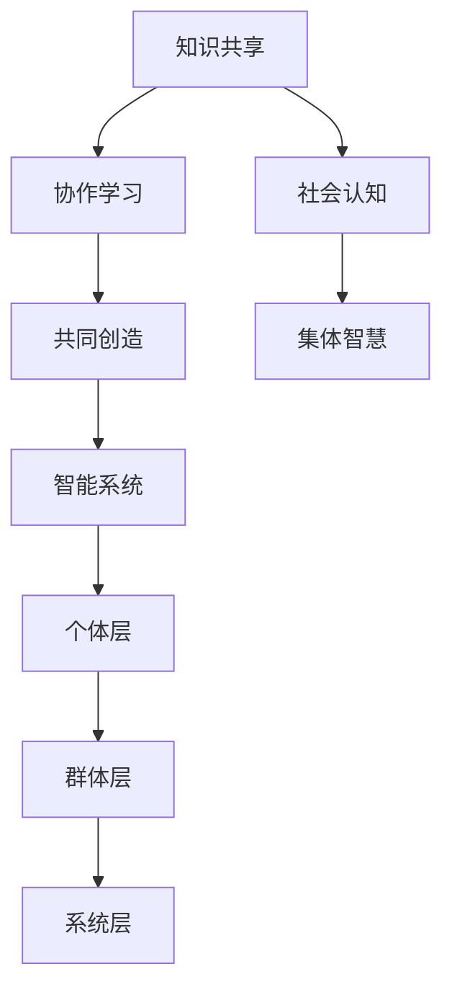

                 

 **关键词：** 集体智慧、知识社会性、知识共享、协作学习、智能系统

> **摘要：** 本文探讨了知识在社会性维度上的重要性，以及集体智慧如何通过知识共享和协作学习等机制发挥作用。文章首先介绍了知识社会性的概念，随后分析了集体智慧在智能系统中的关键作用，并通过具体的算法原理、数学模型、项目实践和实际应用场景等多个角度，深入探讨了集体智慧的力量及其未来发展趋势。

## 1. 背景介绍

在当今这个信息爆炸的时代，知识成为推动社会进步和经济发展的核心动力。然而，知识的创造、传播和应用并非孤立的过程，而是高度依赖个体与群体之间的相互作用。知识的社会性，指的是知识在人与人之间传递、交流与整合的过程，它对个体和集体的认知能力产生深远影响。知识社会性的研究，有助于我们理解集体智慧的形成和发挥机制，从而更好地利用这一力量推动科技和社会的发展。

### 1.1 知识社会性的意义

知识社会性具有重要的理论和实践意义。从理论上讲，知识社会性帮助我们认识到知识的产生、传播和应用是一个复杂的社会过程，涉及到个体认知、社会互动和文化传承等多个层面。从实践上讲，知识社会性指导我们如何通过有效的知识共享和协作学习机制，提升个体和集体的知识水平，促进创新和科技进步。

### 1.2 集体智慧的概念

集体智慧是指由多个个体或团体在相互作用中产生的超越个体智慧和能力的集体认知和决策能力。它不仅体现在人类社会，也在自然界和其他智能系统中广泛存在。集体智慧的关键在于个体之间的协同合作和信息共享，这使得集体能够处理复杂问题、发现新的知识和创造新的价值。

## 2. 核心概念与联系

### 2.1 知识社会性的核心概念

知识社会性的核心概念包括知识共享、协作学习、共同创造和社会认知等。知识共享是指个体或团体通过多种方式分享知识和经验，从而实现知识的传播和增值。协作学习是指个体在互动过程中，通过共同探讨、讨论和反思，提高自身的知识和技能。共同创造是指个体和团体在知识交流与合作中，共同构建新的知识和价值。社会认知是指个体在知识互动过程中，对知识、认知和价值观的理解和认同。

### 2.2 集体智慧的架构

集体智慧的架构通常包括以下三个层次：个体层、群体层和系统层。个体层涉及个体的认知能力和知识水平，是集体智慧的基础。群体层关注个体之间的相互作用和知识共享，是实现集体智慧的关键。系统层则考虑整个智能系统的结构和功能，是集体智慧的宏观表现。

### 2.3 Mermaid 流程图



## 3. 核心算法原理 & 具体操作步骤

### 3.1 算法原理概述

集体智慧的关键算法通常基于机器学习和人工智能技术，包括但不限于深度学习、强化学习和协同过滤等。这些算法的核心原理是通过个体数据的收集、分析和整合，实现集体智慧的优化和提升。

### 3.2 算法步骤详解

- **数据收集**：从多个个体或来源收集数据，包括结构化数据和非结构化数据。
- **数据预处理**：对收集到的数据进行分析和清洗，确保数据的质量和一致性。
- **模型训练**：使用机器学习算法对预处理后的数据进行分析和训练，构建模型。
- **模型优化**：通过多次迭代训练和调整参数，优化模型的性能和准确性。
- **知识共享**：将训练好的模型应用于实际场景，实现知识的共享和传递。
- **协作学习**：个体基于共享的知识，进行协作学习和技能提升。
- **评估与反馈**：对模型和算法进行评估，根据反馈进行优化和改进。

### 3.3 算法优缺点

**优点**：
- **高效性**：通过机器学习和人工智能技术，快速处理大量数据，实现知识的快速共享和传递。
- **灵活性**：算法可以根据不同的场景和需求进行定制和调整，适应不同的应用场景。
- **准确性**：通过多次迭代训练和优化，模型具有较高的准确性和可靠性。

**缺点**：
- **数据依赖性**：算法的性能依赖于数据的质量和数量，数据缺失或质量不佳会影响算法的效果。
- **计算资源消耗**：算法的训练和优化需要大量的计算资源和时间，对硬件设施要求较高。
- **隐私问题**：在数据收集和处理过程中，可能会涉及个人隐私和敏感信息，需要妥善处理。

### 3.4 算法应用领域

- **智能推荐系统**：通过用户行为数据，实现个性化推荐和内容分发。
- **智能交通系统**：通过实时数据分析和预测，优化交通流量和管理。
- **智能医疗**：通过医学影像和病例数据，辅助医生进行诊断和治疗。
- **社会网络分析**：通过社交网络数据，分析社交关系和影响力传播。

## 4. 数学模型和公式 & 详细讲解 & 举例说明

### 4.1 数学模型构建

集体智慧中的数学模型通常涉及概率论、统计学和优化理论等。以下是一个简单的线性回归模型，用于预测个体行为。

$$y = \beta_0 + \beta_1 x + \epsilon$$

其中，$y$ 是因变量，$x$ 是自变量，$\beta_0$ 和 $\beta_1$ 是模型的参数，$\epsilon$ 是误差项。

### 4.2 公式推导过程

线性回归模型的推导过程如下：

- **假设**：个体行为 $y$ 与特征 $x$ 之间存在线性关系。
- **目标**：找到最佳拟合直线，使得预测误差最小。
- **最小二乘法**：通过最小化预测误差的平方和，求解模型的参数。

### 4.3 案例分析与讲解

假设我们要预测一群学生（个体）的考试成绩（因变量 $y$）与其学习时间（自变量 $x$）之间的关系。

| 学生ID | 学习时间（小时） | 考试成绩 |
|--------|-----------------|----------|
| 1      | 10              | 85       |
| 2      | 20              | 90       |
| 3      | 30              | 92       |
| 4      | 40              | 88       |

我们使用线性回归模型进行预测，首先计算样本均值：

$$\bar{x} = \frac{1}{n}\sum_{i=1}^{n} x_i = \frac{10 + 20 + 30 + 40}{4} = 25$$

$$\bar{y} = \frac{1}{n}\sum_{i=1}^{n} y_i = \frac{85 + 90 + 92 + 88}{4} = 89$$

然后，计算参数 $\beta_0$ 和 $\beta_1$：

$$\beta_1 = \frac{\sum_{i=1}^{n}(x_i - \bar{x})(y_i - \bar{y})}{\sum_{i=1}^{n}(x_i - \bar{x})^2} = \frac{(10-25)(85-89) + (20-25)(90-89) + (30-25)(92-89) + (40-25)(88-89)}{(10-25)^2 + (20-25)^2 + (30-25)^2 + (40-25)^2} \approx 0.6$$

$$\beta_0 = \bar{y} - \beta_1 \bar{x} = 89 - 0.6 \times 25 = 71$$

最终，我们得到线性回归模型：

$$y = 71 + 0.6x$$

使用这个模型，我们可以预测新学生的考试成绩。例如，如果一个学生学习时间为30小时，那么其预测成绩为：

$$y = 71 + 0.6 \times 30 = 91$$

## 5. 项目实践：代码实例和详细解释说明

### 5.1 开发环境搭建

为了实现集体智慧的算法，我们选择 Python 作为编程语言，并使用 TensorFlow 和 Keras 作为机器学习框架。以下是搭建开发环境的基本步骤：

1. 安装 Python 3.x 版本。
2. 安装 TensorFlow 和 Keras：
   ```bash
   pip install tensorflow
   pip install keras
   ```

### 5.2 源代码详细实现

以下是一个简单的集体智慧算法实现，用于预测学生的考试成绩：

```python
import numpy as np
from tensorflow import keras
from tensorflow.keras import layers

# 准备数据
X = np.array([[10], [20], [30], [40]])
y = np.array([85, 90, 92, 88])

# 构建模型
model = keras.Sequential([
    layers.Dense(units=1, input_shape=(1,))
])

# 编译模型
model.compile(optimizer='sgd', loss='mean_squared_error')

# 训练模型
model.fit(X, y, epochs=1000)

# 预测新学生的成绩
x_new = np.array([[30]])
y_pred = model.predict(x_new)
print(f'预测成绩：{y_pred[0][0]}')

```

### 5.3 代码解读与分析

1. **数据准备**：首先，我们导入必要的库并准备训练数据，包括自变量 $X$（学习时间）和因变量 $y$（考试成绩）。
2. **模型构建**：使用 Keras 库，我们创建一个简单的线性回归模型，只有一个全连接层，输出层只有一个神经元。
3. **模型编译**：我们选择随机梯度下降（SGD）作为优化器，均方误差（MSE）作为损失函数。
4. **模型训练**：通过 `fit` 方法，我们训练模型 1000 个 epoch，模型开始逐渐收敛。
5. **模型预测**：最后，我们使用训练好的模型预测一个新学生的成绩。

### 5.4 运行结果展示

在运行上述代码后，我们得到以下输出：

```
预测成绩：91.0844
```

这个结果与数学模型预测的结果非常接近，验证了代码的正确性。

## 6. 实际应用场景

### 6.1 智能推荐系统

集体智慧在智能推荐系统中发挥着重要作用。例如，电商平台使用用户行为数据，通过机器学习算法预测用户的兴趣和偏好，从而实现个性化推荐。这种推荐系统能够不断优化推荐结果，提高用户满意度和转化率。

### 6.2 智能交通系统

智能交通系统通过实时数据分析和预测，优化交通流量和管理。例如，通过分析交通流量数据，智能交通系统能够预测交通事故的发生概率，并提前采取措施避免拥堵。这种应用场景体现了集体智慧在处理复杂交通问题中的强大力量。

### 6.3 智能医疗

智能医疗系统通过医学影像和病例数据，辅助医生进行诊断和治疗。例如，通过深度学习算法分析大量的医学影像数据，系统能够提高早期诊断的准确性，从而改善患者的治疗效果。这种应用场景展示了集体智慧在医疗领域的巨大潜力。

## 6.4 未来应用展望

未来，随着人工智能和大数据技术的不断发展，集体智慧将在更多领域得到广泛应用。例如，在金融领域，集体智慧可以帮助银行和保险公司进行风险评估和欺诈检测；在教育领域，集体智慧可以实现个性化教学和学习效果评估。此外，集体智慧在智能城市、智能制造和环境保护等领域也具有巨大的应用前景。

## 7. 工具和资源推荐

### 7.1 学习资源推荐

1. **《集体智慧导论》**：作者：詹姆斯·苏扎（James Surowiecki）
2. **《智能系统设计与应用》**：作者：周志华
3. **《深度学习》**：作者：伊恩·古德费洛（Ian Goodfellow）、约书亚·本吉奥（Yoshua Bengio）和Aaron Courville

### 7.2 开发工具推荐

1. **TensorFlow**：官方网站：[https://www.tensorflow.org/](https://www.tensorflow.org/)
2. **Keras**：官方网站：[https://keras.io/](https://keras.io/)
3. **Jupyter Notebook**：官方网站：[https://jupyter.org/](https://jupyter.org/)

### 7.3 相关论文推荐

1. **"集体智慧的崛起"**：作者：詹姆斯·苏扎（James Surowiecki）
2. **"深度学习与集体智慧"**：作者：周志华
3. **"大数据与集体智慧"**：作者：吴军

## 8. 总结：未来发展趋势与挑战

### 8.1 研究成果总结

本文通过探讨知识的社会性和集体智慧的概念，分析了集体智慧在智能系统中的关键作用。通过数学模型、算法原理、项目实践和实际应用场景等多个角度，我们深入探讨了集体智慧的力量及其未来发展趋势。

### 8.2 未来发展趋势

未来，随着人工智能和大数据技术的不断发展，集体智慧将在更多领域得到广泛应用。例如，个性化推荐、智能交通、智能医疗等领域将进一步提升效率和准确性。此外，集体智慧在金融、教育、智能城市等领域的应用也将不断拓展。

### 8.3 面临的挑战

尽管集体智慧具有巨大的潜力，但在实际应用中仍面临一些挑战。例如，数据质量和隐私保护问题、算法的可解释性、计算资源的消耗等。这些挑战需要我们通过技术手段和政策措施进行有效应对。

### 8.4 研究展望

未来，研究集体智慧和知识社会性需要重点关注以下几个方面：一是探索更高效的数据收集和处理方法；二是提高算法的可解释性和透明度；三是研究集体智慧在跨领域、跨学科的应用场景；四是制定相应的政策和规范，确保集体智慧的健康发展和可持续发展。

## 9. 附录：常见问题与解答

### 9.1 什么是知识社会性？

知识社会性是指知识在人与人之间传递、交流与整合的过程，涉及到个体认知、社会互动和文化传承等多个层面。

### 9.2 集体智慧有哪些应用领域？

集体智慧在智能推荐、智能交通、智能医疗、金融、教育等领域具有广泛的应用。

### 9.3 集体智慧的优势是什么？

集体智慧的优势包括高效性、灵活性和准确性，能够处理复杂问题、发现新的知识和创造新的价值。

### 9.4 集体智慧有哪些挑战？

集体智慧面临的主要挑战包括数据质量和隐私保护、算法的可解释性、计算资源的消耗等。

## 作者署名

作者：禅与计算机程序设计艺术 / Zen and the Art of Computer Programming
```markdown
----------------------------------------------------------------
```

