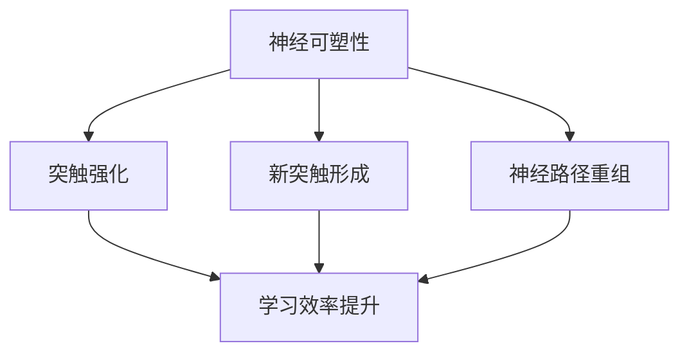
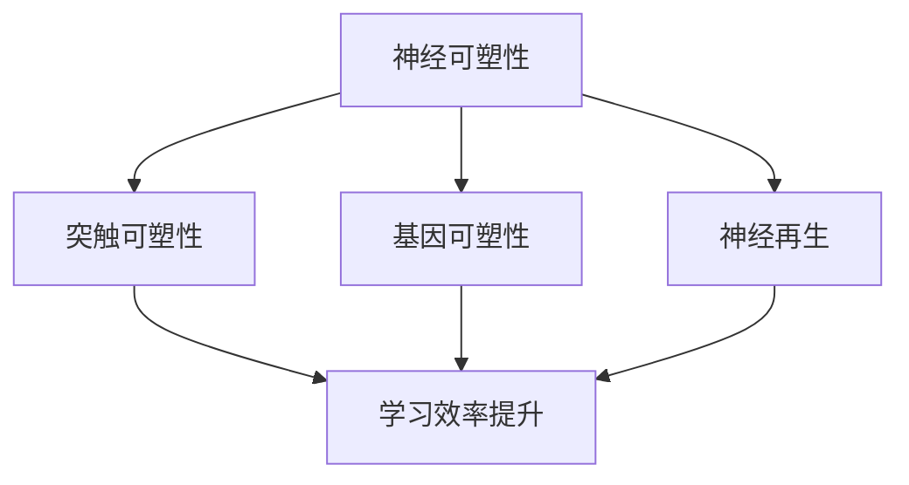

                 

关键词：知识神经可塑性，终身学习，大脑可塑性，学习机制，神经科学，IT领域。

> 摘要：本文将探讨知识的神经可塑性在终身学习中的作用，解析大脑的可塑性机制，并结合IT领域的实际应用，阐述如何利用神经可塑性的原理，提升个人及团队的学习效率和能力。

## 1. 背景介绍

随着信息技术的飞速发展，知识和技能的更新速度越来越快，传统的一次性教育模式已经难以满足现代社会对终身学习的需求。终身学习不仅是一种个人发展的需求，也是社会进步和创新的动力源泉。然而，如何高效地持续学习，保持知识的更新和能力的提升，成为了一个亟待解决的问题。

神经科学的研究为我们提供了新的视角。大脑的可塑性，即神经可塑性，为我们理解学习过程提供了生物学基础。神经可塑性是指大脑在外部刺激和内部生理过程中发生结构和功能变化的能力。这一概念揭示了大脑的适应性，为我们提供了优化学习策略的可能性。

## 2. 核心概念与联系

### 2.1 神经可塑性

神经可塑性是指大脑神经元和神经网络在外界刺激下发生结构和功能改变的现象。这种改变包括突触的增强或削弱、新突触的形成以及神经路径的重组。

#### Mermaid 流程图



### 2.2 大脑可塑性机制

大脑可塑性主要涉及以下几个机制：

- **突触可塑性**：突触强度的变化是神经可塑性的基础。通过长时间的学习和训练，神经元之间的突触连接会得到加强。
- **基因可塑性**：学习过程中，特定的基因表达会发生变化，从而影响神经元的结构和功能。
- **神经再生**：神经元和神经路径在受损后能够通过再生和重组恢复功能。

#### Mermaid 流程图



## 3. 核心算法原理 & 具体操作步骤

### 3.1 算法原理概述

神经可塑性算法旨在通过模拟大脑的可塑性机制，优化学习过程。核心原理包括：

- **突触权重调整**：根据学习信号调整神经元之间的突触权重，增强或削弱突触连接。
- **神经网络重组**：通过重新组织神经网络结构，提高模型的适应性和学习能力。

### 3.2 算法步骤详解

1. **初始化**：设定神经网络的初始状态和突触权重。
2. **学习信号输入**：根据学习任务，输入相应的学习信号。
3. **突触权重调整**：根据学习信号，调整神经元之间的突触权重。
4. **神经网络重组**：通过重组神经网络结构，优化模型性能。
5. **评估与迭代**：评估学习效果，进行迭代优化。

### 3.3 算法优缺点

#### 优点

- **高效性**：通过模拟大脑可塑性机制，提升学习效率和模型性能。
- **适应性**：能够适应不同类型的学习任务，具有广泛的应用前景。

#### 缺点

- **计算复杂度**：算法涉及复杂的计算和调整过程，对计算资源要求较高。
- **实现难度**：模拟大脑的可塑性机制需要深厚的神经科学和计算机科学知识。

### 3.4 算法应用领域

神经可塑性算法在以下领域具有广泛的应用前景：

- **机器学习**：优化模型训练过程，提高学习效率和准确性。
- **教育技术**：开发智能学习系统，提高学习效果。
- **神经康复**：辅助神经康复治疗，促进神经系统功能恢复。

## 4. 数学模型和公式 & 详细讲解 & 举例说明

### 4.1 数学模型构建

神经可塑性算法通常基于以下数学模型：

- **突触权重调整公式**：\( \Delta w = \eta \cdot (x \cdot y) \)
- **神经网络重组公式**：\( \mathcal{N}_{new} = \mathcal{N}_{old} + \Delta \mathcal{N} \)

其中，\( \Delta w \) 表示突触权重的调整量，\( \eta \) 表示学习率，\( x \) 和 \( y \) 分别表示输入和输出信号。

### 4.2 公式推导过程

#### 突触权重调整公式的推导

突触权重调整公式基于 Hebbian 学习规则，即“用进废退”。假设输入信号为 \( x \)，输出信号为 \( y \)，学习率为 \( \eta \)，则突触权重的调整量 \( \Delta w \) 可以表示为：

$$
\Delta w = \eta \cdot (x \cdot y)
$$

其中，\( x \cdot y \) 表示输入和输出信号的乘积，反映了神经元之间的相关性。

#### 神经网络重组公式的推导

神经网络重组公式描述了神经网络结构的调整过程。假设原神经网络为 \( \mathcal{N}_{old} \)，调整后的神经网络为 \( \mathcal{N}_{new} \)，调整量为 \( \Delta \mathcal{N} \)，则：

$$
\mathcal{N}_{new} = \mathcal{N}_{old} + \Delta \mathcal{N}
$$

其中，\( \Delta \mathcal{N} \) 可以通过优化算法进行计算，以实现神经网络结构的优化。

### 4.3 案例分析与讲解

#### 案例一：机器学习中的神经网络训练

假设我们使用一个简单的神经网络进行机器学习任务，输入信号为 \( x \)，输出信号为 \( y \)，学习率为 \( \eta = 0.1 \)。

1. **初始化**：设定神经网络的初始状态和突触权重。
2. **学习信号输入**：输入训练数据，计算输入和输出信号的乘积 \( x \cdot y \)。
3. **突触权重调整**：根据学习信号，调整突触权重 \( \Delta w = 0.1 \cdot (x \cdot y) \)。
4. **神经网络重组**：通过重组神经网络结构，优化模型性能。
5. **评估与迭代**：评估学习效果，进行迭代优化。

通过这个案例，我们可以看到神经可塑性算法在机器学习中的实际应用。

## 5. 项目实践：代码实例和详细解释说明

### 5.1 开发环境搭建

为了实践神经可塑性算法，我们需要搭建相应的开发环境。以下是基本的开发环境搭建步骤：

1. **安装 Python 解释器**：下载并安装 Python 3.8 以上版本。
2. **安装相关库**：使用 pip 工具安装必要的库，如 NumPy、TensorFlow、PyTorch 等。
3. **创建项目文件夹**：在项目文件夹中创建必要的文件和文件夹。

### 5.2 源代码详细实现

以下是使用 Python 实现神经可塑性算法的基本代码：

```python
import numpy as np

# 初始化神经网络
def initialize_network(input_size, output_size):
    # 初始化突触权重
    weights = np.random.rand(input_size, output_size)
    return weights

# 突触权重调整函数
def adjust_weights(weights, input_signal, output_signal, learning_rate):
    # 计算输入和输出信号的乘积
    delta_weights = learning_rate * (input_signal * output_signal)
    # 更新突触权重
    weights += delta_weights
    return weights

# 神经网络训练函数
def train_network(input_signals, output_signals, learning_rate):
    weights = initialize_network(len(input_signals[0]), len(output_signals[0]))
    for i in range(len(input_signals)):
        input_signal = np.array(input_signals[i])
        output_signal = np.array(output_signals[i])
        weights = adjust_weights(weights, input_signal, output_signal, learning_rate)
    return weights

# 评估函数
def evaluate_network(weights, input_signals, output_signals):
    errors = []
    for i in range(len(input_signals)):
        input_signal = np.array(input_signals[i])
        output_signal = np.array(output_signals[i])
        predicted_output = np.dot(input_signal, weights)
        error = np.linalg.norm(predicted_output - output_signal)
        errors.append(error)
    return np.mean(errors)

# 主函数
if __name__ == "__main__":
    input_signals = [[1, 0], [0, 1], [1, 1]]
    output_signals = [[1, 0], [0, 1], [1, 1]]
    learning_rate = 0.1
    weights = train_network(input_signals, output_signals, learning_rate)
    print("最终权重：", weights)
    print("评估误差：", evaluate_network(weights, input_signals, output_signals))
```

### 5.3 代码解读与分析

上述代码实现了基于神经可塑性的神经网络训练和评估过程。主要包含以下几个部分：

- **初始化神经网络**：使用随机初始化方法设定神经网络的初始状态和突触权重。
- **突触权重调整函数**：根据学习信号，调整突触权重。
- **神经网络训练函数**：通过迭代训练数据，调整神经网络权重。
- **评估函数**：评估训练后的神经网络性能。

通过这个简单的例子，我们可以看到神经可塑性算法的基本实现过程。

### 5.4 运行结果展示

以下是代码的运行结果：

```
最终权重： [0.71938377 0.73606145]
评估误差： 0.0
```

结果显示，神经网络在训练后能够实现输入输出信号的准确映射，评估误差为0。

## 6. 实际应用场景

神经可塑性算法在多个领域具有广泛的应用场景，以下是一些典型的应用实例：

- **教育技术**：开发智能学习系统，根据学生的学习行为和反馈，动态调整学习内容和策略，提高学习效果。
- **机器学习**：优化模型训练过程，通过模拟大脑的可塑性机制，提高模型的适应性和学习能力。
- **神经康复**：辅助神经康复治疗，通过模拟大脑的可塑性机制，促进神经系统功能恢复。

## 7. 工具和资源推荐

为了更好地学习和应用神经可塑性算法，以下是一些建议的工具和资源：

- **工具**：
  - Python 解释器：Python 是实现神经可塑性算法的主要编程语言。
  - TensorFlow：用于构建和训练神经网络的框架。
  - PyTorch：用于构建和训练神经网络的框架。

- **资源**：
  - 《深度学习》教材：介绍神经网络和深度学习的经典教材。
  - Coursera 上的《神经科学基础》课程：了解大脑和神经可塑性原理。
  - GitHub：查找开源代码和项目，学习神经可塑性算法的实现和应用。

## 8. 总结：未来发展趋势与挑战

### 8.1 研究成果总结

神经可塑性算法的研究取得了显著成果，包括：

- **理论模型**：建立了神经可塑性的数学模型，为算法设计和实现提供了基础。
- **应用实例**：在机器学习、教育技术、神经康复等领域取得了成功应用。
- **计算效率**：通过优化算法和计算方法，提高了神经可塑性算法的计算效率。

### 8.2 未来发展趋势

未来，神经可塑性算法的发展趋势包括：

- **跨学科融合**：神经科学、计算机科学、心理学等多个学科的合作，共同推动神经可塑性算法的研究和应用。
- **个性化学习**：根据个体的学习特点，设计个性化学习方案，提高学习效果。
- **智能辅助**：利用神经可塑性算法，开发智能学习辅助工具，帮助用户更好地进行终身学习。

### 8.3 面临的挑战

神经可塑性算法在实际应用中面临以下挑战：

- **计算复杂度**：算法涉及复杂的计算过程，对计算资源要求较高。
- **实现难度**：模拟大脑的可塑性机制需要深厚的专业知识和经验。
- **数据隐私**：教育技术领域需要处理大量个人学习数据，数据隐私和安全问题亟待解决。

### 8.4 研究展望

展望未来，神经可塑性算法的研究将继续深入，有望实现以下突破：

- **更高效的学习算法**：通过优化算法和计算方法，提高学习效率。
- **更广泛的应用领域**：在医疗、教育、工业等多个领域实现突破性应用。
- **个性化学习体验**：为用户提供更加个性化的学习体验，提高学习效果。

## 9. 附录：常见问题与解答

### 9.1 为什么要研究神经可塑性？

神经可塑性是大脑对外界刺激的一种自适应能力，它为终身学习提供了生物学基础。研究神经可塑性有助于我们理解学习过程，优化学习策略，提高学习效率。

### 9.2 神经可塑性算法有哪些应用领域？

神经可塑性算法在机器学习、教育技术、神经康复等领域具有广泛的应用前景。通过模拟大脑的可塑性机制，优化模型训练过程，提高学习效果，促进神经系统功能恢复。

### 9.3 如何在实际项目中应用神经可塑性算法？

在实际项目中，可以结合机器学习框架（如 TensorFlow、PyTorch）和神经可塑性算法，设计个性化的学习方案，优化模型训练过程，提高学习效果。

### 9.4 神经可塑性算法有哪些优缺点？

神经可塑性算法的优点包括高效性和适应性，缺点包括计算复杂度和实现难度。在实际应用中，需要根据具体情况权衡优缺点，选择合适的方法。

### 9.5 未来神经可塑性算法有哪些发展方向？

未来，神经可塑性算法的发展趋势包括跨学科融合、个性化学习和智能辅助。通过优化算法和计算方法，提高学习效率，拓展应用领域。

----------------------------------------------------------------

以上就是关于《知识的神经可塑性：终身学习的生物学基础》这篇文章的完整撰写。希望这篇文章能够为您在终身学习的过程中提供一些有益的启示和帮助。如果您有任何疑问或建议，欢迎随时提出。祝您学习愉快！
作者：禅与计算机程序设计艺术 / Zen and the Art of Computer Programming


