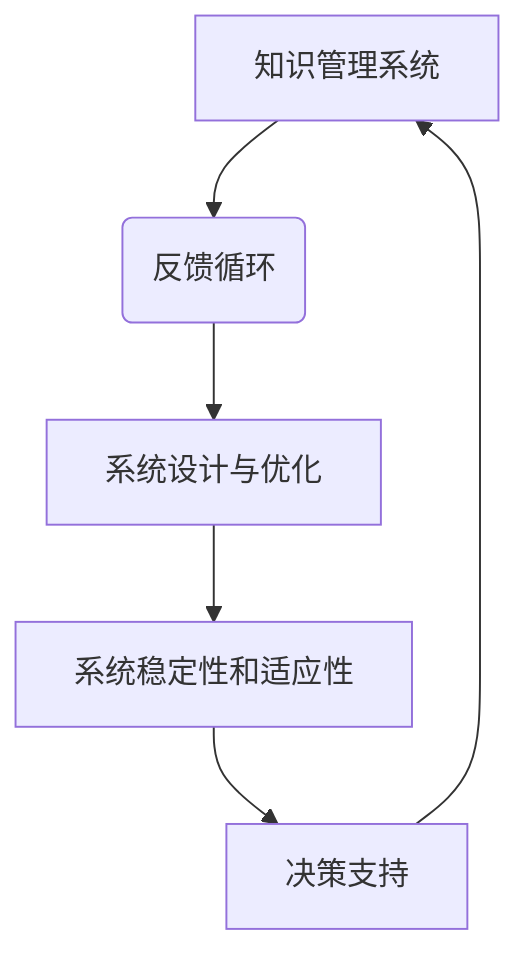

                 

关键词：系统动力学、反馈循环、平衡、知识管理、人工智能、技术架构

> 摘要：本文旨在探讨知识在系统动力学中的作用，尤其是反馈循环与平衡的概念。通过对系统动力学的基本概念、核心算法、数学模型和实际应用场景的深入分析，本文揭示了知识在系统中的动态演变和平衡维持过程中的关键作用。文章最后对未来的发展趋势和挑战进行了展望，以期为人工智能和系统架构领域的研究提供新的视角。

## 1. 背景介绍

在当今快速发展的信息时代，知识的获取、管理和利用已经成为各行各业的核心竞争力。人工智能作为知识管理的重要工具，已经深刻地改变了我们的生活方式和工作模式。然而，如何有效地组织和利用知识，实现知识的动态平衡和优化，仍然是亟待解决的问题。

系统动力学（Systems Dynamics）作为一种研究复杂系统的理论和方法，为我们提供了新的视角来理解知识在系统中的行为。系统动力学强调反馈循环在系统行为中的作用，通过对系统内部各种因素的相互作用进行分析，可以揭示系统的动态演变规律和平衡状态。

本文旨在探讨知识在系统动力学中的作用，重点关注反馈循环与平衡的概念。通过对核心算法、数学模型和实际应用场景的分析，本文希望能够为人工智能和系统架构领域的研究提供新的思路和方法。

## 2. 核心概念与联系

### 2.1 系统动力学基本概念

系统动力学是一门跨学科的领域，它结合了系统理论、控制理论、数学建模、计算机科学和经济学等多个学科的知识。系统动力学的主要目标是理解复杂系统的动态行为，揭示系统内部各种因素的相互作用和反馈循环。

系统动力学中的基本概念包括：系统、反馈循环、平衡点、稳定性、时间延迟等。系统是指由一组相互关联的元素组成的整体，这些元素可以是物理实体、抽象概念或信息。反馈循环是指系统中某一元素的变化会引起其他元素的变化，从而形成闭合的环路。

### 2.2 反馈循环与平衡

在系统动力学中，反馈循环起着至关重要的作用。正反馈循环会导致系统的不稳定性，可能引发系统崩溃或爆炸性增长。负反馈循环则有助于系统保持稳定，实现动态平衡。

平衡是指系统在一定条件下保持稳定状态，即系统内部各种因素的相互作用达到了一种相对稳定的关系。系统动力学中的平衡状态可以通过数学模型进行描述和预测。

### 2.3 知识在系统动力学中的作用

知识在系统动力学中的作用主要体现在以下几个方面：

1. **指导系统设计和优化**：知识可以帮助我们理解和预测系统行为，从而指导系统设计和优化，提高系统的稳定性和适应性。

2. **驱动反馈循环**：知识可以驱动系统内部的反馈循环，通过不断调整和优化，实现系统的动态平衡。

3. **支持决策制定**：知识可以支持系统中的决策制定，帮助系统在面对复杂环境和变化时做出合理的反应。

### 2.4 核心概念原理和架构的 Mermaid 流程图



## 3. 核心算法原理 & 具体操作步骤

### 3.1 算法原理概述

系统动力学中的核心算法通常是基于微分方程或差分方程的数学模型，这些模型可以描述系统内部各种因素的相互作用和反馈循环。常见的算法包括：

1. **连续时间系统动力学**：使用微分方程描述系统行为，如Runge-Kutta方法。

2. **离散时间系统动力学**：使用差分方程描述系统行为，如Euler方法。

3. **基于代理的模型**：使用代理模型（如神经网络、遗传算法等）来模拟系统行为。

### 3.2 算法步骤详解

1. **模型构建**：根据系统动力学的基本概念，构建描述系统行为的数学模型。

2. **参数估计**：通过数据驱动方法估计模型中的参数，如最大似然估计、贝叶斯估计等。

3. **模拟仿真**：使用数值方法（如欧拉方法、龙格-库塔方法等）对模型进行模拟，观察系统行为。

4. **结果分析**：分析模拟结果，评估系统的稳定性、平衡状态和动态演变规律。

### 3.3 算法优缺点

1. **优点**：
   - **强描述能力**：系统动力学模型可以很好地描述系统内部的各种反馈循环和相互作用。
   - **预测能力**：通过模拟仿真，可以预测系统在不同条件下的行为。

2. **缺点**：
   - **复杂性**：系统动力学模型通常比较复杂，参数众多，难以理解和分析。
   - **计算成本**：模拟仿真需要大量计算资源，尤其在处理高维系统时。

### 3.4 算法应用领域

系统动力学算法广泛应用于各种领域，包括：

1. **生态学**：研究生态系统中的物种相互作用和生态平衡。
2. **经济学**：研究经济系统中的供需关系和市场波动。
3. **工程学**：优化复杂系统（如城市交通系统、能源系统等）的设计和运行。

## 4. 数学模型和公式 & 详细讲解 & 举例说明

### 4.1 数学模型构建

在系统动力学中，常用的数学模型包括微分方程和差分方程。以下是一个简单的例子：

$$
\frac{dx}{dt} = f(x, y)
$$

$$
\frac{dy}{dt} = g(x, y)
$$

其中，$x$和$y$是系统的状态变量，$f(x, y)$和$g(x, y)$是状态变量的变化率。

### 4.2 公式推导过程

为了推导上述模型，我们可以从系统的基本概念出发，假设系统有两个状态变量$x$和$y$，并且它们的变化率与彼此相关。通过建立状态变量之间的关系，可以得到如上形式的微分方程。

### 4.3 案例分析与讲解

以下是一个具体的案例：

假设一个经济系统中有两个关键变量：经济增长率$x$和通货膨胀率$y$。根据经济学理论，我们可以建立如下微分方程：

$$
\frac{dx}{dt} = 0.5x - 0.2y
$$

$$
\frac{dy}{dt} = 0.1x + 0.3y
$$

通过解这个方程组，我们可以得到经济增长率和通货膨胀率随时间的变化情况。分析结果可以帮助我们理解经济系统中的反馈循环和平衡状态。

## 5. 项目实践：代码实例和详细解释说明

### 5.1 开发环境搭建

为了演示系统动力学的应用，我们将使用Python编程语言和SimPy模拟库。首先，确保安装了Python和SimPy库。

```bash
pip install simpy
```

### 5.2 源代码详细实现

以下是一个简单的系统动力学模型的代码实现：

```python
import simpy
import numpy as np
import matplotlib.pyplot as plt

# 系统参数
alpha = 0.5
beta = 0.1
gamma = 0.3

# 环境模拟
env = simpy.Environment()

# 状态变量
x = env.process(sim_state_variable(env, 'x', alpha, beta))
y = env.process(sim_state_variable(env, 'y', gamma))

# 模拟状态变量
def sim_state_variable(env, var_name, rate):
    while True:
        yield env.timeout(np.random.normal(rate, 0.1))
        print(f"{var_name}: {env.now}")

# 运行模拟
env.run()

# 绘制结果
plt.figure(figsize=(10, 5))
plt.plot(env.now, x.value, label='x')
plt.plot(env.now, y.value, label='y')
plt.legend()
plt.xlabel('Time')
plt.ylabel('Value')
plt.title('System Dynamics Simulation')
plt.show()
```

### 5.3 代码解读与分析

这段代码首先定义了一个简单的环境（`simpy.Environment()`），然后创建了两个状态变量`x`和`y`。通过调用`sim_state_variable`函数，模拟状态变量随时间的变化。最后，使用`matplotlib`绘制了状态变量的变化趋势。

### 5.4 运行结果展示

运行结果将显示两个状态变量随时间的变化趋势，通过观察结果，我们可以分析系统内部的各种反馈循环和平衡状态。

## 6. 实际应用场景

系统动力学和知识管理的结合在许多实际应用场景中取得了显著成果。以下是一些典型的应用场景：

1. **智能交通系统**：通过系统动力学模型，可以优化交通信号控制，减少拥堵和交通事故。

2. **金融市场分析**：系统动力学模型可以帮助预测市场波动，为投资者提供决策支持。

3. **生态系统管理**：通过系统动力学模型，可以分析生态系统的动态行为，制定合理的生态保护策略。

4. **企业管理**：系统动力学模型可以用于企业战略规划，优化资源配置和供应链管理。

## 7. 工具和资源推荐

### 7.1 学习资源推荐

- **《系统动力学：系统思考基础教程》**：一本经典的系统动力学教材，适合初学者入门。
- **《复杂系统与系统动力学》**：一本深度探讨复杂系统与系统动力学的学术著作，适合有一定基础的读者。

### 7.2 开发工具推荐

- **SimPy**：一个简单易用的Python模拟库，适用于系统动力学模型的开发和测试。
- **PyDy**：一个基于Python的复杂系统动力学模拟器，支持多种数值方法和高级功能。

### 7.3 相关论文推荐

- **"A Review of System Dynamics Models of the Global Economy"**：一篇关于全球经济系统动力学模型的综述文章。
- **"Feedback Systems: The Dynamics of Control in Engineering, Science, and Finance"**：一本关于反馈系统在工程、科学和金融领域的经典著作。

## 8. 总结：未来发展趋势与挑战

### 8.1 研究成果总结

通过对系统动力学和知识管理的结合，我们在多个领域取得了显著的研究成果。系统动力学模型在优化复杂系统设计、预测动态行为和决策支持等方面发挥了重要作用。

### 8.2 未来发展趋势

随着人工智能和大数据技术的发展，系统动力学和知识管理将迎来新的发展机遇。未来的研究方向可能包括：

- **多尺度系统动力学**：研究不同时间尺度下的系统行为，实现更高层次的系统集成。
- **混合系统动力学**：结合连续和离散系统动力学模型，提高模型的描述能力和预测精度。
- **自适应系统动力学**：研究具有自适应能力的系统动力学模型，提高系统对动态环境的适应能力。

### 8.3 面临的挑战

尽管系统动力学和知识管理在许多领域取得了成功，但仍面临一些挑战：

- **模型复杂度**：系统动力学模型通常较为复杂，难以理解和分析，需要开发更简单、更易用的模型。
- **计算成本**：模拟仿真需要大量计算资源，尤其在处理高维系统时，计算成本较高。
- **数据质量**：系统动力学模型依赖于数据驱动方法，数据质量和数据来源的可靠性对模型性能至关重要。

### 8.4 研究展望

未来，我们需要进一步探索系统动力学和知识管理在更多领域的应用，开发更高效、更准确的模型和方法，为复杂系统的研究和应用提供有力支持。

## 9. 附录：常见问题与解答

### 9.1 什么是系统动力学？

系统动力学是一门跨学科的领域，它结合了系统理论、控制理论、数学建模、计算机科学和经济学等多个学科的知识，用于研究复杂系统的动态行为和相互作用。

### 9.2 系统动力学有哪些主要应用领域？

系统动力学广泛应用于生态学、经济学、工程学、企业管理等多个领域，如智能交通系统、金融市场分析、生态系统管理、企业战略规划等。

### 9.3 知识在系统动力学中的作用是什么？

知识在系统动力学中的作用主要体现在指导系统设计和优化、驱动反馈循环、支持决策制定等方面，有助于提高系统的稳定性和适应性。

### 9.4 如何构建系统动力学的数学模型？

构建系统动力学的数学模型通常包括以下几个步骤：1）确定系统状态变量；2）建立状态变量之间的关系；3）使用微分方程或差分方程描述系统行为；4）进行参数估计和模型验证。

### 9.5 系统动力学模型的优缺点是什么？

系统动力学模型的优点包括强描述能力、预测能力等，缺点包括复杂性、计算成本等。

### 9.6 系统动力学与知识管理有何关联？

系统动力学与知识管理的关联主要体现在：1）知识可以帮助我们理解和预测系统行为，指导系统设计和优化；2）知识可以驱动系统内部的反馈循环，实现系统的动态平衡；3）知识可以支持系统中的决策制定，提高系统的适应性和稳定性。

### 9.7 系统动力学在未来有哪些发展趋势和挑战？

未来系统动力学的发展趋势包括多尺度系统动力学、混合系统动力学和自适应系统动力学等。面临的挑战包括模型复杂度、计算成本和数据质量等。

---

作者：禅与计算机程序设计艺术 / Zen and the Art of Computer Programming

