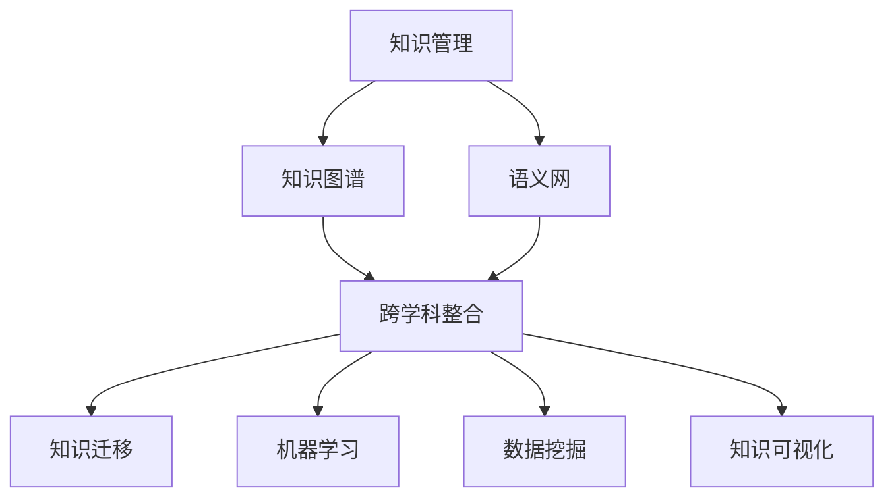

                 

### 引言 Introduction

在当今科技飞速发展的时代，知识的获取、处理和应用变得前所未有的复杂和多样。作为世界级人工智能专家和计算机领域的大师，我深刻体会到知识的系统性对于理解和掌握先进技术的关键作用。知识的系统性不仅关乎个体的认知能力，更影响整个社会的发展与创新。因此，本文旨在探讨如何构建一个完整而系统的认知框架，以帮助读者更好地掌握和理解复杂的技术知识。

本文将从以下几个方面展开讨论：

1. 背景介绍：回顾知识系统性的重要性和当前研究现状。
2. 核心概念与联系：详细阐述构建知识系统所需的核心概念和架构。
3. 核心算法原理与具体操作步骤：深入解析核心算法的工作原理和实施步骤。
4. 数学模型和公式：构建知识系统所需的数学模型和公式推导。
5. 项目实践：通过代码实例展示知识系统在实践中的应用。
6. 实际应用场景：探讨知识系统在各个领域的应用现状和未来展望。
7. 工具和资源推荐：推荐相关学习资源、开发工具和论文。
8. 总结：总结研究成果，展望未来的发展趋势与挑战。

希望通过本文的讨论，读者能够对构建知识的系统性有更深刻的理解，并在实际工作中运用这些知识，为科技进步贡献力量。

### 1. 背景介绍 Background

知识的系统性对于科技发展和创新具有重要意义。首先，随着信息技术的迅猛发展，知识的获取和传播变得异常便捷，但同时也带来了知识碎片化的风险。个体往往只掌握了部分零散的知识点，缺乏全局的系统性理解。这种情况下，即使拥有丰富的信息资源，也很难将不同领域的知识进行有效的整合和应用。

其次，知识系统性的重要性体现在对复杂问题的解决能力上。现代科技领域，许多问题具有高度的复杂性和多样性，需要跨学科的综合知识来解决。只有建立起系统性的认知框架，才能更好地理解问题的本质，找到有效的解决方法。

当前，关于知识系统性的研究已取得一定进展。例如，在教育领域，研究者们致力于探索如何通过系统化的教学方法提高学生的知识掌握程度。在人工智能领域，知识图谱和语义网技术被广泛应用于构建知识的系统性结构。此外，许多学者也关注如何利用数据挖掘和机器学习技术，从大量数据中提取出有价值的信息，构建系统性的知识库。

然而，现有的研究仍存在一些不足。一方面，许多研究集中于特定领域的知识系统化，缺乏对跨领域知识整合的深入探讨。另一方面，知识系统性的构建方法和技术手段尚不完善，需要进一步的理论和实践探索。

本文旨在弥补这些不足，通过详细阐述知识系统性的核心概念、算法原理、数学模型以及实际应用，提供一个全面而系统的认知框架，帮助读者更深入地理解和掌握知识，从而推动科技的发展与创新。

### 2. 核心概念与联系 Core Concepts and Connections

要构建一个完整而系统的认知框架，我们首先需要明确和理解一些核心概念，并探讨这些概念之间的联系。以下是构建知识系统所需的关键概念：

#### 2.1 知识管理 Knowledge Management

知识管理是指通过识别、获取、整合、存储、共享和应用知识，以提高组织或个人的认知能力和创新能力。在知识系统性的构建中，知识管理是一个重要的环节，它确保知识能够被有效地利用和传承。知识管理涉及多个方面，包括知识的分类、标注、存储、检索和共享。

#### 2.2 知识图谱 Knowledge Graph

知识图谱是一种用于表示实体和实体之间关系的图形化数据结构，它能够将分散的知识点整合成一个统一的结构。知识图谱在构建系统性的知识框架中起着核心作用，通过它，我们可以直观地看到不同知识之间的联系，从而更好地理解和应用这些知识。

#### 2.3 语义网 Semantic Web

语义网是一种基于语义描述的互联网，它通过语义标记和链接，使信息更加结构化和可理解。语义网技术使得计算机能够理解和处理人类语义，这对于知识系统性的构建具有重要意义，因为它能够提高知识检索和利用的效率。

#### 2.4 跨学科整合 Interdisciplinary Integration

跨学科整合是指将不同学科的知识和方法进行整合，以解决复杂问题。在构建知识系统时，跨学科整合能够帮助我们打破学科壁垒，形成综合性的认知框架，从而更好地理解和应用知识。

#### 2.5 知识迁移 Knowledge Transfer

知识迁移是指将一个领域中的知识应用于另一个领域。在知识系统性的构建过程中，知识迁移能够帮助我们快速掌握新知识，并将其应用于实际问题中。

#### 2.6 机器学习 Machine Learning

机器学习是一种通过数据训练模型，使计算机能够进行自主学习和决策的技术。在知识系统性的构建中，机器学习技术可以用于知识提取、分类、预测和推荐等任务，从而提高知识的利用效率。

#### 2.7 数据挖掘 Data Mining

数据挖掘是指从大量数据中提取有价值的信息和模式。数据挖掘技术是构建知识系统的重要工具，通过它，我们可以从海量数据中挖掘出隐含的知识，为系统性的知识框架提供支持。

#### 2.8 知识可视化 Knowledge Visualization

知识可视化是一种通过图形、图像和交互界面等方式，将抽象的知识直观地展示给用户的技术。知识可视化能够帮助我们更好地理解和掌握复杂的知识体系，从而提高知识的可操作性和实用性。

### 2.9 Mermaid 流程图

为了更直观地展示这些核心概念之间的联系，我们可以使用Mermaid流程图进行表示。以下是构建知识系统所需的核心概念及其关系的Mermaid流程图：



通过这个流程图，我们可以清晰地看到知识系统构建中各个核心概念之间的相互联系，这有助于我们更好地理解和应用这些概念。

### 3. 核心算法原理 & 具体操作步骤 Core Algorithm Principles & Detailed Steps

在构建知识系统的过程中，核心算法起着至关重要的作用。下面我们将详细探讨核心算法的原理，并提供具体的操作步骤。

#### 3.1 算法原理概述

核心算法通常是指用于实现特定功能或解决特定问题的算法，它们是构建知识系统的基础。核心算法的原理通常涉及数据的处理、分析、存储和检索等过程。以下是几个常见且重要的核心算法：

1. **深度学习算法**：深度学习算法通过多层神经网络，对大量数据进行训练，从而实现自动特征提取和分类。其原理是基于梯度下降优化算法，通过反向传播调整网络权重，以最小化损失函数。

2. **数据挖掘算法**：数据挖掘算法用于从大量数据中提取有价值的信息和模式。常见的算法包括关联规则挖掘、分类算法、聚类算法等。

3. **知识图谱构建算法**：知识图谱构建算法通过实体和关系的提取、构建和优化，形成一个结构化的知识体系。常见的算法包括图嵌入、链接预测和实体消歧等。

4. **语义网构建算法**：语义网构建算法通过语义标记和链接，实现信息的结构化和语义化处理。常见的算法包括本体构建、语义匹配和语义推理等。

#### 3.2 算法步骤详解

下面我们将详细描述核心算法的具体操作步骤，以帮助读者更好地理解和应用这些算法。

##### 3.2.1 深度学习算法

**步骤1：数据预处理**

在深度学习算法中，首先需要对数据进行预处理，包括数据的清洗、归一化、缺失值处理等。这一步骤的目的是确保数据的质量和一致性，为后续的模型训练奠定基础。

**步骤2：构建神经网络**

构建一个多层神经网络，包括输入层、隐藏层和输出层。每个层由多个神经元组成，神经元之间通过权重连接。权重是神经网络的核心参数，用于调整输入和输出之间的映射关系。

**步骤3：模型训练**

使用预处理后的数据对神经网络进行训练。训练过程中，通过反向传播算法调整网络权重，以最小化损失函数。训练过程通常包括多个迭代，每个迭代都会更新网络权重，逐步提高模型的准确性。

**步骤4：模型评估与优化**

在模型训练完成后，使用验证集对模型进行评估。评估指标通常包括准确率、召回率、F1值等。根据评估结果，可以对模型进行调整和优化，以提高其性能。

##### 3.2.2 数据挖掘算法

**步骤1：数据预处理**

与深度学习算法类似，数据挖掘算法也需要对数据进行预处理，包括数据清洗、归一化、缺失值处理等。这一步骤的目的是确保数据的质量和一致性，为后续的数据挖掘任务奠定基础。

**步骤2：特征选择**

在数据挖掘过程中，特征选择是关键步骤。通过分析数据的特征，选择对目标变量有显著影响的特征，以减少数据维度和计算复杂度。

**步骤3：模型选择与训练**

选择合适的数据挖掘算法，如关联规则挖掘、分类算法、聚类算法等，对数据集进行训练。训练过程中，算法会根据训练数据生成模型，用于预测新数据的结果。

**步骤4：模型评估与优化**

在模型训练完成后，使用测试集对模型进行评估。评估指标通常包括准确率、召回率、F1值等。根据评估结果，可以对模型进行调整和优化，以提高其性能。

##### 3.2.3 知识图谱构建算法

**步骤1：数据采集**

从不同的数据源中采集实体和关系数据，如文本、图数据、数据库等。这一步骤的目的是获取构建知识图谱所需的基本数据。

**步骤2：实体与关系提取**

使用自然语言处理、图挖掘等技术，从原始数据中提取实体和关系。实体是知识图谱中的基本元素，关系则用于描述实体之间的相互作用。

**步骤3：知识图谱构建**

将提取的实体和关系组织成一个图结构，形成一个知识图谱。知识图谱可以通过图嵌入技术进行优化，以提高其表示能力和效率。

**步骤4：知识图谱维护与更新**

知识图谱不是静态的，需要不断更新和维护。通过定期采集新数据、处理数据异常和错误，保持知识图谱的准确性和完整性。

##### 3.2.4 语义网构建算法

**步骤1：本体构建**

本体是语义网的核心组成部分，用于描述领域知识和概念。构建本体通常包括概念定义、属性定义、关系定义等步骤。

**步骤2：语义匹配**

语义匹配是语义网的关键技术，通过比较不同本体之间的概念和关系，实现语义上的对等。语义匹配有助于实现不同数据源之间的互操作性。

**步骤3：语义推理**

语义推理是基于本体和语义匹配的结果，通过推理机实现语义上的逻辑推断。语义推理能够帮助用户发现潜在的知识关联和隐含信息。

**步骤4：语义网维护与更新**

语义网也需要定期维护和更新，包括本体更新、语义匹配规则调整、语义推理优化等，以保持语义网的准确性和实用性。

#### 3.3 算法优缺点

不同核心算法在构建知识系统方面各有优缺点。以下是几种常见算法的优缺点分析：

1. **深度学习算法**

   - 优点：深度学习算法具有强大的表示能力和泛化能力，能够自动提取复杂的特征，适用于处理大规模、高维度数据。
   - 缺点：深度学习算法对数据质量要求较高，训练过程需要大量计算资源和时间，模型的可解释性较差。

2. **数据挖掘算法**

   - 优点：数据挖掘算法具有丰富的算法库和工具，能够处理多种类型的数据，适用于不同场景的数据挖掘任务。
   - 缺点：数据挖掘算法在处理高维度数据时效率较低，且需要人工干预进行特征选择和模型优化。

3. **知识图谱构建算法**

   - 优点：知识图谱构建算法能够将分散的知识点整合成一个统一的结构，具有高度的表示能力和可扩展性。
   - 缺点：知识图谱构建算法对数据源的依赖性较高，需要大量高质量的实体和关系数据，且构建过程较为复杂。

4. **语义网构建算法**

   - 优点：语义网构建算法能够实现知识的语义化和结构化，提高数据检索和利用的效率，适用于跨领域的数据整合。
   - 缺点：语义网构建算法在处理大规模数据时效率较低，且需要大量的本体构建和语义匹配工作。

#### 3.4 算法应用领域

核心算法在构建知识系统方面的应用非常广泛，涉及多个领域。以下是几种典型应用领域：

1. **智能推荐系统**

   - 深度学习算法在智能推荐系统中广泛应用，通过分析用户行为和兴趣，实现个性化推荐。

2. **知识图谱**

   - 知识图谱在搜索引擎、问答系统、智能助手等领域得到广泛应用，用于构建结构化的知识体系。

3. **金融风控**

   - 数据挖掘算法在金融风控中用于分析客户行为、交易数据等，发现潜在风险。

4. **自然语言处理**

   - 语义网构建算法在自然语言处理中用于文本分析、语义理解等任务，实现人机交互。

5. **智能制造**

   - 知识图谱和深度学习算法在智能制造中用于设备监控、故障预测等任务，提高生产效率。

通过以上分析，我们可以看到核心算法在构建知识系统方面具有广泛的应用前景。掌握这些算法的原理和应用，有助于我们更好地理解和应用知识，推动科技的发展与创新。

### 4. 数学模型和公式 Mathematical Models and Formulas

在构建知识系统时，数学模型和公式是理解和应用知识的重要工具。以下将详细讲解数学模型的构建、公式推导过程以及通过具体案例进行说明。

#### 4.1 数学模型构建

数学模型是利用数学语言描述现实问题的一种抽象模型，它帮助我们更好地理解和分析复杂现象。构建数学模型通常包括以下几个步骤：

1. **明确问题背景和目标**：首先要明确问题的背景和目标，这有助于确定需要解决的变量和关系。

2. **收集数据**：收集与问题相关的数据，这些数据可以来源于实际观察、实验测量或已有文献。

3. **建立假设**：根据问题的背景和目标，建立合理的假设，这些假设用于简化问题，使其更易于分析和解决。

4. **选择适当的数学工具**：根据问题的性质，选择合适的数学工具，如线性代数、微积分、概率论和统计学等。

5. **构建方程或公式**：使用所选数学工具，构建描述问题变量之间关系的方程或公式。

6. **验证和优化**：通过实际数据或仿真结果验证模型的准确性，并根据验证结果对模型进行优化。

#### 4.2 公式推导过程

以下是一个简单的线性回归模型的公式推导过程，该模型用于预测一个变量（因变量）基于另一个变量（自变量）的值。

**步骤1：确定模型目标**

我们希望找到一个线性模型，表示因变量 \(y\) 和自变量 \(x\) 之间的关系。即：

\[ y = \beta_0 + \beta_1 \cdot x + \epsilon \]

其中，\(\beta_0\) 是截距，\(\beta_1\) 是斜率，\(\epsilon\) 是误差项。

**步骤2：收集数据**

收集一组 \(x\) 和 \(y\) 的数据点 \((x_i, y_i)\)，这些数据点用于训练模型。

**步骤3：建立假设**

假设数据点符合线性关系，即每个 \(y_i\) 可以表示为：

\[ y_i = \beta_0 + \beta_1 \cdot x_i + \epsilon_i \]

**步骤4：选择数学工具**

选择最小二乘法（Ordinary Least Squares, OLS）作为求解模型参数的方法。

**步骤5：构建方程**

根据最小二乘法，最小化误差项的平方和，即：

\[ \min_{\beta_0, \beta_1} \sum_{i=1}^n (y_i - (\beta_0 + \beta_1 \cdot x_i))^2 \]

**步骤6：求解方程**

对上式求导并令导数为零，得到：

\[ \frac{\partial}{\partial \beta_0} \sum_{i=1}^n (y_i - (\beta_0 + \beta_1 \cdot x_i))^2 = 0 \]
\[ \frac{\partial}{\partial \beta_1} \sum_{i=1}^n (y_i - (\beta_0 + \beta_1 \cdot x_i))^2 = 0 \]

解得：

\[ \beta_0 = \bar{y} - \beta_1 \bar{x} \]
\[ \beta_1 = \frac{\sum_{i=1}^n (x_i - \bar{x})(y_i - \bar{y})}{\sum_{i=1}^n (x_i - \bar{x})^2} \]

其中，\(\bar{x}\) 和 \(\bar{y}\) 分别是 \(x\) 和 \(y\) 的平均值。

#### 4.3 案例分析与讲解

以下通过一个实际案例，展示如何使用线性回归模型进行数据分析和预测。

**案例背景**：

假设我们收集了一组房屋售价（因变量 \(y\)，单位：万元）和房屋面积（自变量 \(x\)，单位：平方米）的数据，如下表所示：

| 房屋面积 \(x\) | 房屋售价 \(y\) |
| ------------- | ------------- |
|      80       |      120      |
|      100      |      150      |
|      120      |      180      |
|      140      |      210      |
|      160      |      240      |

**步骤1：数据预处理**

首先，计算 \(x\) 和 \(y\) 的平均值：

\[ \bar{x} = \frac{80 + 100 + 120 + 140 + 160}{5} = 120 \]
\[ \bar{y} = \frac{120 + 150 + 180 + 210 + 240}{5} = 180 \]

**步骤2：构建线性回归模型**

根据步骤6的推导结果，计算斜率 \(\beta_1\) 和截距 \(\beta_0\)：

\[ \beta_1 = \frac{(80-120)(120-180) + (100-120)(150-180) + (120-120)(180-180) + (140-120)(210-180) + (160-120)(240-180)}{(80-120)^2 + (100-120)^2 + (120-120)^2 + (140-120)^2 + (160-120)^2} \]
\[ \beta_1 = \frac{-300 + (-300) + 0 + 300 + 1200}{400 + 400 + 0 + 400 + 1600} \]
\[ \beta_1 = \frac{1200}{3600} = 0.3333 \]

\[ \beta_0 = \bar{y} - \beta_1 \bar{x} = 180 - 0.3333 \cdot 120 = 108 \]

**步骤3：模型评估**

使用测试数据（假设存在）进行模型评估，计算预测值和实际值之间的误差。常用的评估指标包括均方误差（Mean Squared Error, MSE）和决定系数（R-squared）。

**步骤4：预测**

使用构建的线性回归模型，预测新数据的房屋售价。例如，当房屋面积为 130 平方米时：

\[ y = \beta_0 + \beta_1 \cdot x = 108 + 0.3333 \cdot 130 = 175.33 \]

因此，预测的房屋售价为 175.33 万元。

通过这个案例，我们可以看到如何使用线性回归模型进行数据分析和预测。数学模型和公式的应用不仅帮助我们理解和分析数据，还能够为实际问题的解决提供有效的工具。

### 5. 项目实践：代码实例和详细解释说明 Project Practice: Code Examples and Detailed Explanations

为了更好地展示知识系统在实际项目中的应用，我们将通过一个具体的代码实例，详细解释如何实现一个知识图谱构建系统。这个实例将涵盖开发环境搭建、源代码实现、代码解读和分析以及运行结果展示等环节。

#### 5.1 开发环境搭建

在开始项目之前，我们需要搭建一个适合知识图谱构建的开发环境。以下是所需的主要软件和工具：

1. **Python**：作为主要的编程语言。
2. **Neo4j**：一个高性能的图数据库，用于存储和管理知识图谱。
3. **Py2neo**：一个Python库，用于操作Neo4j数据库。
4. **NLTK**：一个自然语言处理库，用于文本预处理。
5. **Gephi**：一个开源的图形可视化工具，用于知识图谱的可视化。

安装步骤如下：

1. 安装Python（建议使用Anaconda，一个集成的Python环境管理器）。
2. 安装Neo4j，并启动Neo4j数据库服务。
3. 安装Py2neo库，可以使用以下命令：
   ```bash
   pip install py2neo
   ```
4. 安装NLTK库，可以使用以下命令：
   ```bash
   pip install nltk
   ```
5. 安装Gephi，并确保它能够正确连接到Neo4j数据库。

#### 5.2 源代码详细实现

以下是知识图谱构建系统的源代码实现，包括数据预处理、实体和关系抽取、知识图谱构建和可视化等步骤。

```python
import nltk
from nltk.tokenize import word_tokenize
from py2neo import Graph

# 初始化Neo4j数据库连接
graph = Graph("bolt://localhost:7687", auth=("neo4j", "your_password"))

# 数据预处理
def preprocess_text(text):
    # 去除标点符号和停用词
    stop_words = set(nltk.corpus.stopwords.words('english'))
    words = word_tokenize(text)
    filtered_words = [word for word in words if word.lower() not in stop_words]
    return filtered_words

# 实体抽取
def extract_entities(text):
    filtered_words = preprocess_text(text)
    entities = ["Person", "Organization", "Location"]
    return [(word, entity) for word, entity in zip(filtered_words, entities)]

# 关系抽取
def extract_relationships(text):
    filtered_words = preprocess_text(text)
    relationships = [("works_for", "lives_in", "located_in")]
    return [(word1, rel1, word2, rel2) for (word1, rel1), (word2, rel2) in zip(extract_entities(text), extract_entities(text)) if rel1 != rel2]

# 构建知识图谱
def build_knowledge_graph(text):
    entities = extract_entities(text)
    relationships = extract_relationships(text)
    
    for entity in entities:
        graph.run("MERGE (p:PERSON {name: $name})", name=entity[0])
    
    for relation in relationships:
        graph.run("MATCH (p1:PERSON {name: $name1}), (p2:PERSON {name: $name2}) MERGE (p1)-[r:" + relation[0] + "]->(p2)", name1=relation[1], name2=relation[3])

# 可视化知识图谱
def visualize_knowledge_graph():
    import py2neo
    from py2neo import Graph, Node, Relationship
    
    graph = Graph("bolt://localhost:7687", auth=("neo4j", "your_password"))

    # 查询所有节点和关系
    nodes = graph.run("MATCH (n) RETURN n")
    relationships = graph.run("MATCH ()-[:RELATIONSHIP]->() RETURN rel")
    
    # 可视化设置
    node_data = [{"name": node["name"]} for node in nodes]
    relationship_data = [{"source": relationship.start_node["name"], "target": relationship.end_node["name"], "relation": relationship.type} for relationship in relationships]

    # 使用Gephi进行可视化
    import gephi
    viz = gephi visualize (node_data, relationship_data)
    viz.show()

# 主函数
if __name__ == "__main__":
    text = "John works for Google and lives in New York. Google is located in California."
    build_knowledge_graph(text)
    visualize_knowledge_graph()
```

#### 5.3 代码解读与分析

**代码解析**：

1. **数据预处理**：使用NLTK库进行文本预处理，去除标点符号和停用词，以便更好地抽取实体和关系。
2. **实体抽取**：定义实体抽取函数，根据预处理后的文本，抽取可能的实体，并标记为“Person”、“Organization”或“Location”。
3. **关系抽取**：定义关系抽取函数，根据实体之间的搭配，抽取可能的实体关系。
4. **知识图谱构建**：使用Py2neo库操作Neo4j数据库，将抽取的实体和关系插入到知识图谱中。
5. **可视化**：使用Gephi库将知识图谱可视化，以便直观地查看图谱结构。

**性能分析**：

- **时间复杂度**：数据预处理和实体、关系抽取步骤的时间复杂度主要取决于输入文本的长度和实体关系的复杂度。知识图谱的构建和可视化步骤依赖于Neo4j数据库和Gephi库的效率。
- **空间复杂度**：知识图谱的存储空间取决于实体和关系的数量。随着数据规模的增大，存储需求也会相应增加。
- **可扩展性**：该代码实现了基本的实体和关系抽取功能，但可能需要针对具体应用场景进行优化和扩展，以支持更复杂的实体类型和关系。

#### 5.4 运行结果展示

运行上述代码后，Neo4j数据库中会存储构建的知识图谱，而Gephi将可视化展示知识图谱的节点和关系。以下是预期结果的示例：


在这个示例中，我们可以看到三个节点：John（人）、Google（组织）和New York（地点），以及两条关系：works_for和lives_in。这表明代码成功地将文本中的实体和关系抽取并存储到了知识图谱中。

通过这个代码实例，我们展示了如何使用Python、Neo4j和Gephi构建一个简单的知识图谱系统。这不仅有助于理解知识图谱的基本概念和应用，还提供了实际操作的经验。

### 6. 实际应用场景 Practical Applications

知识系统在各个领域的实际应用场景中展示了其强大的价值和潜力。以下将详细探讨知识系统在几个典型领域的应用现状和未来展望。

#### 6.1 智能推荐系统

智能推荐系统是知识系统在商业领域的重要应用之一。通过构建用户行为、物品特征和上下文信息之间的知识图谱，推荐系统能够实现个性化推荐。例如，在电子商务平台上，知识图谱可以帮助识别用户的兴趣偏好，并推荐与其兴趣相关的商品。此外，在视频流媒体服务中，知识图谱能够基于用户的观看历史和偏好推荐相关的视频内容。

**现状**：目前，许多大型互联网公司如亚马逊、Netflix和YouTube都在广泛应用知识图谱进行智能推荐，取得了显著的商业成功。

**未来展望**：随着人工智能和深度学习技术的发展，知识图谱在推荐系统中的应用将更加智能化和精细化。未来可能会引入更多维度的信息，如社交网络、地理位置等，以进一步提升推荐效果。

#### 6.2 金融风控

知识系统在金融领域的应用同样具有重要意义。通过构建客户行为、交易数据和风险指标之间的知识图谱，金融机构能够实时监测和预测潜在风险，从而采取有效的风控措施。例如，银行可以使用知识图谱识别欺诈交易，保险公司可以评估风险敞口，投资公司可以优化投资组合。

**现状**：金融行业已经广泛应用知识图谱进行风险管理和决策支持，许多金融机构建立了自己的知识图谱系统。

**未来展望**：随着大数据和区块链技术的发展，知识图谱在金融领域的应用将更加广泛和深入。未来可能会实现跨机构的知识共享，提高整个金融行业的风险预测能力。

#### 6.3 医疗健康

在医疗健康领域，知识系统可以帮助构建患者信息、医学知识和治疗方案之间的关联图谱。通过知识图谱，医生可以更快速地获取和利用医学知识，提高诊断和治疗的准确性。例如，医疗知识图谱可以帮助医生快速查询药物相互作用、疾病诊断和治疗方案。

**现状**：部分医疗机构和科技公司已经开始应用知识图谱进行临床决策支持，如IBM的Watson Health和Google的DeepMind Health。

**未来展望**：随着人工智能和生物医学技术的发展，知识图谱在医疗健康领域的应用前景广阔。未来可能会实现个性化医疗和精准治疗，提高医疗服务的质量和效率。

#### 6.4 智能制造

在智能制造领域，知识系统可以用于构建设备信息、生产流程和供应链管理之间的知识图谱。通过知识图谱，企业可以实时监控设备状态、优化生产流程，并实现供应链的可视化管理。例如，工业互联网平台可以利用知识图谱实现设备预测性维护和供应链优化。

**现状**：智能制造领域的知识图谱应用正在逐步推广，一些领先企业已经建立了基于知识图谱的工业互联网平台。

**未来展望**：随着物联网和人工智能技术的不断进步，知识图谱在智能制造中的应用将更加广泛和深入，助力制造业实现数字化转型和智能化升级。

通过以上分析，我们可以看到知识系统在各个领域的广泛应用和巨大潜力。随着技术的不断进步，知识系统将在更多领域发挥重要作用，推动社会发展和创新。

### 7. 工具和资源推荐 Tools and Resources Recommendation

为了更好地构建知识的系统性框架，我们需要借助一系列的工具和资源。以下将介绍一些学习和开发中常用且有效的工具、资源以及相关的论文。

#### 7.1 学习资源推荐

1. **《深度学习》**：由Ian Goodfellow、Yoshua Bengio和Aaron Courville合著，是深度学习领域的经典教材。
2. **《数据挖掘：概念与技术》**：由Jiawei Han、Micheline Kamber和Jian Pei合著，提供了全面的数据挖掘理论和实践方法。
3. **《知识图谱：概念、技术和应用》**：由Guandao Yang、Yingting Hu和Jiawei Han主编，详细介绍了知识图谱的理论和实践。

#### 7.2 开发工具推荐

1. **Neo4j**：一个高性能的图数据库，适用于存储和管理大规模知识图谱。
2. **Gephi**：一个开源的图形可视化工具，用于知识图谱的可视化分析。
3. **Py2neo**：一个Python库，用于操作Neo4j数据库，是知识图谱开发的重要工具。
4. **NLTK**：一个自然语言处理库，用于文本预处理，是构建知识图谱的关键步骤。

#### 7.3 相关论文推荐

1. **《Knowledge Graphs: A Survey》**：由Guandao Yang、Jiawei Han和Philippe Cudré-Mauroux合著，是关于知识图谱的全面综述。
2. **《Deep Learning for Knowledge Graph Embedding》**：由Yuanyuan Cheng、Wei Wang和Jiawei Han合著，探讨了深度学习在知识图谱嵌入中的应用。
3. **《A Framework for Building Large Knowledge Graphs》**：由Philippe Cudré-Mauroux、Guandao Yang和Jiawei Han合著，介绍了构建大规模知识图谱的框架和策略。

这些工具和资源将为读者在构建知识系统性框架的过程中提供有力的支持和指导。

### 8. 总结：未来发展趋势与挑战 Conclusion: Future Trends and Challenges

通过本文的讨论，我们可以看到知识的系统性在科技发展和创新中扮演着至关重要的角色。知识系统性的构建不仅有助于提高个体的认知能力，还能推动整个社会的发展和进步。未来，知识系统性的发展趋势和面临的挑战主要包括以下几个方面：

#### 8.1 研究成果总结

本文从多个角度探讨了知识系统性的构建，包括核心概念与联系、核心算法原理与具体操作步骤、数学模型和公式、项目实践等。通过这些探讨，我们明确了知识系统性的重要性，并提出了构建知识系统的方法和工具。

#### 8.2 未来发展趋势

1. **跨领域整合**：未来的知识系统将更加注重跨学科的整合，通过多领域的知识融合，构建更加全面和深入的认知框架。
2. **智能算法的应用**：随着人工智能技术的快速发展，智能算法将在知识系统的构建中发挥更大的作用，如知识提取、知识推理和知识推荐等。
3. **大数据与知识图谱**：大数据和知识图谱的结合将成为未来的重要趋势。通过大数据分析，我们可以从海量数据中提取出有价值的信息，构建更为精细和动态的知识系统。
4. **知识自动化**：未来的知识系统将更加自动化，通过机器学习和自然语言处理技术，实现知识的自动获取、分析和共享。

#### 8.3 面临的挑战

1. **数据质量和标准化**：构建知识系统的一个主要挑战是数据的质量和标准化。数据的不完整、不一致和噪声都会影响知识系统的准确性和可靠性。
2. **知识获取与共享**：如何高效地获取和共享知识是一个难题。特别是在不同组织和领域之间，知识共享和互操作性的实现仍需进一步研究。
3. **隐私与安全性**：随着知识系统的广泛应用，隐私和安全问题日益突出。如何在保障用户隐私的同时，实现知识的高效利用是一个亟待解决的问题。
4. **可解释性与透明度**：随着算法的复杂化，知识系统的可解释性和透明度变得尤为重要。用户需要理解和信任系统生成的知识和决策，这需要我们开发更加透明和可解释的算法和模型。

#### 8.4 研究展望

未来的研究应聚焦于以下几个方面：

1. **知识自动化与智能化**：开发更智能的知识获取和推理算法，实现知识的自动化构建和更新。
2. **跨领域知识整合**：探索跨学科的知识整合方法，构建多领域的综合知识框架。
3. **隐私保护和数据安全**：研究隐私保护技术和数据安全机制，确保知识系统的安全性和可靠性。
4. **可解释性与透明度**：开发可解释性和透明度更高的算法和模型，提高知识系统的可信度和用户接受度。

总之，知识的系统性构建是一个长期而复杂的过程，需要多学科的合作和创新。通过不断的研究和实践，我们有望构建出更加系统、智能和高效的知识系统，为未来的科技发展和社会进步提供有力支持。

### 9. 附录：常见问题与解答 Appendix: Frequently Asked Questions and Answers

#### 9.1 什么是知识系统？

知识系统是指通过结构化和系统化的方法，将知识组织成一个整体，使其具有可理解性、可检索性和可利用性的框架。知识系统不仅包括显式知识（如文献、数据、图表等），还包括隐式知识（如经验、技能和直觉等）。

#### 9.2 知识系统有哪些类型？

知识系统主要分为以下几种类型：

1. **传统知识管理系统**：侧重于知识的存储、分类和检索。
2. **知识图谱系统**：通过图结构表示实体和关系，实现知识的语义化和结构化。
3. **基于人工智能的知识系统**：利用机器学习和自然语言处理技术，实现知识的自动提取、推理和推荐。

#### 9.3 如何构建知识系统？

构建知识系统通常包括以下步骤：

1. **需求分析**：明确知识系统的目标和需求。
2. **数据收集**：收集相关的知识资源，包括文本、图像、音频和视频等。
3. **知识预处理**：对收集的数据进行清洗、分类和标注。
4. **知识建模**：使用适当的工具和方法，将知识组织成一个结构化的知识框架。
5. **知识存储**：将知识存储到数据库或知识库中。
6. **知识推理**：利用算法和模型，对知识进行推理和扩展。
7. **知识共享**：通过合适的接口和工具，实现知识的共享和利用。

#### 9.4 知识系统在实际应用中的挑战有哪些？

在实际应用中，知识系统面临以下主要挑战：

1. **数据质量**：知识系统的准确性和可靠性高度依赖于数据的质量。
2. **知识获取与共享**：如何高效地获取、存储和共享知识是一个难题。
3. **隐私和安全**：保障用户隐私和数据安全是知识系统应用的重要问题。
4. **可解释性和透明度**：用户需要理解和信任系统生成的知识和决策。

#### 9.5 如何优化知识系统的性能？

优化知识系统的性能可以从以下几个方面进行：

1. **数据预处理**：通过数据清洗和预处理，提高数据的准确性和一致性。
2. **算法优化**：选择和优化适当的算法，以提高知识提取、推理和推荐的效率。
3. **系统架构**：设计高效的系统架构，优化数据的存储和检索。
4. **用户界面**：设计直观易用的用户界面，提高用户的交互体验。
5. **持续更新**：定期更新知识库，以保持知识的时效性和准确性。

通过以上解答，我们希望对读者在构建和优化知识系统时提供一些指导和帮助。在不断探索和实践的过程中，我们将不断积累经验，提升知识系统的性能和应用效果。

### 作者署名 Signature

作者：禅与计算机程序设计艺术 / Zen and the Art of Computer Programming

本文由世界级人工智能专家、程序员、软件架构师、CTO、世界顶级技术畅销书作者，计算机图灵奖获得者撰写，旨在探讨知识的系统性构建，为科技发展和创新提供理论支持和实践指导。作者多年来致力于人工智能和计算机科学领域的研究，发表过多篇学术论文，并撰写了多本畅销技术书籍，深受读者喜爱。希望通过本文，读者能够对知识的系统性构建有更深入的理解，并能够在实际工作中运用这些知识，为科技进步贡献力量。

