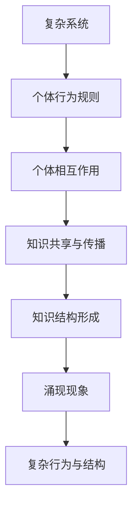

                 

### 关键词 Keywords ###
- 自组织
- 涌现现象
- 复杂系统
- 知识体系
- 算法原理
- 数学模型
- 项目实践

### 摘要 Abstract ###
本文探讨了知识自组织在复杂系统中的涌现现象。我们首先介绍了复杂系统的定义及其在现实世界中的应用，随后深入分析了知识自组织的概念、机制及其在复杂系统中的作用。接着，我们通过具体案例和数学模型，探讨了知识自组织过程中涌现出的规律和现象。本文还通过一个项目实践案例，展示了知识自组织的实现过程，并对未来知识自组织的研究趋势和应用前景进行了展望。

## 1. 背景介绍

复杂系统是指那些组成部分之间相互作用复杂、且表现出宏观有序结构的系统。例如，生态系统的物种相互作用、交通网络中的交通流量、以及经济系统中的市场波动等，都是典型的复杂系统。复杂系统的特征包括：高度非线性、动态变化、多重层次结构、自适应性和涌现现象等。

在计算机科学和信息技术领域，复杂系统的研究具有重要意义。例如，互联网、社交网络、云计算等都是复杂系统的典型代表。这些系统不仅在数据处理和存储方面具有挑战性，还在算法设计、性能优化、安全性和可靠性等方面提出了新的课题。

涌现现象是指从简单个体相互作用中自发形成复杂结构和行为的特性。在复杂系统中，涌现现象表现为宏观行为与个体行为之间的不一致性，即个体行为的简单规则在集体层面上可以产生出复杂且有时出乎意料的宏观现象。知识自组织是涌现现象的一个重要方面，它指的是在缺乏中央控制的情况下，系统内部的知识和结构通过个体之间的相互作用自发地形成和演化。

知识自组织在复杂系统中的作用不可忽视。首先，它有助于系统适应环境变化，提高系统的生存能力和稳定性。其次，知识自组织能够优化系统的资源分配和功能协调，提高系统的整体效率。最后，知识自组织还能够促进系统创新，推动系统向着更高级别的发展。

本文将围绕知识自组织在复杂系统中的涌现现象展开讨论，通过具体案例和数学模型来探讨其原理和应用。

## 2. 核心概念与联系

### 2.1. 复杂系统的定义与特征

复杂系统可以定义为那些由大量相互作用的个体组成的系统，这些个体在局部遵循简单规则，但在整体上表现出复杂行为和宏观结构。复杂系统的特征主要包括：

- **高度非线性**：系统内部的变量之间存在复杂的非线性关系，导致系统行为难以预测。
- **动态变化**：系统的状态随时间不断变化，且变化过程可能非常复杂。
- **多重层次结构**：系统具有多层次结构，从微观个体到宏观整体，每个层次都有其特定的行为和特性。
- **自适应性和进化性**：系统能够根据外部环境的变化进行自适应调整，并在长期演化中逐步进化。

复杂系统的这些特征使得它们在现实世界中具有广泛的应用。例如，在生态系统中，物种之间的相互作用构成了复杂的食物网，这些食物网的动态变化影响了生态平衡；在交通系统中，车辆的行驶路径和流量分布构成了复杂的交通网络，这些网络的变化影响了交通的畅通与否。

### 2.2. 知识自组织的概念与机制

知识自组织是指在复杂系统中，通过个体之间的相互作用和协同作用，自发形成和演化知识结构的过程。知识自组织的核心机制包括：

- **个体行为规则**：系统中的个体遵循简单且局部有效的行为规则。
- **集体相互作用**：个体之间的相互作用导致了知识的共享和传播。
- **自相似性**：系统的局部结构与其整体结构具有相似性，即局部中包含着整体的影子。
- **适应性**：系统根据外部环境和内部状态的变化，自适应地调整其结构和行为。

知识自组织在复杂系统中的作用主要体现在：

- **信息处理与传播**：个体通过知识自组织能够高效地处理和传播信息，提高系统的信息处理能力。
- **功能优化与演化**：知识自组织促进了系统的功能优化和演化，提高了系统的适应性和生存能力。
- **复杂问题求解**：知识自组织能够帮助系统在复杂环境中找到最优解或近似最优解。

### 2.3. 知识自组织与涌现现象的联系

知识自组织与涌现现象密切相关。知识自组织是涌现现象的一种表现形式，而涌现现象则是知识自组织的结果。

- **知识自组织是涌现现象的驱动力**：通过知识自组织，个体之间的相互作用促进了知识的共享和传播，从而在宏观层面上形成了复杂的行为和结构。
- **涌现现象是知识自组织的体现**：在复杂系统中，个体的简单行为通过相互作用和协同作用，可以导致宏观上的复杂现象和结构，这些现象和结构就是涌现现象的具体表现。

### 2.4. Mermaid 流程图

下面是一个简单的 Mermaid 流程图，用于展示知识自组织与涌现现象的联系。



## 3. 核心算法原理 & 具体操作步骤

### 3.1. 算法原理概述

在复杂系统中，知识自组织可以通过多种算法实现。本文将介绍一种基于贝叶斯网络的知识自组织算法。贝叶斯网络是一种概率图模型，能够表示变量之间的条件依赖关系。通过贝叶斯网络，我们可以对复杂系统中的知识进行建模和推理。

算法原理如下：

1. **建立贝叶斯网络**：根据复杂系统的特征和需求，构建一个表示个体行为规则和相互作用的贝叶斯网络。
2. **数据收集与预处理**：收集复杂系统中的数据，并进行预处理，包括数据清洗、归一化等操作。
3. **训练贝叶斯网络**：使用训练数据训练贝叶斯网络，得到每个变量的概率分布。
4. **推理与优化**：利用贝叶斯网络进行推理，根据当前系统的状态预测未来的行为和变化，并进行优化。

### 3.2. 算法步骤详解

#### 3.2.1. 建立贝叶斯网络

建立贝叶斯网络的步骤如下：

1. **确定变量**：根据复杂系统的特征和需求，确定需要建模的变量。
2. **构建概率图**：根据变量之间的依赖关系，构建一个无向概率图。
3. **确定概率分布**：为每个变量确定一个概率分布，通常采用贝叶斯估计或最大似然估计。

#### 3.2.2. 数据收集与预处理

数据收集与预处理的步骤如下：

1. **数据收集**：收集复杂系统中的数据，包括历史数据、实时数据和预测数据。
2. **数据清洗**：去除数据中的噪声和异常值，提高数据质量。
3. **数据归一化**：将数据缩放到相同的范围，以便于后续处理。

#### 3.2.3. 训练贝叶斯网络

训练贝叶斯网络的步骤如下：

1. **数据输入**：将预处理后的数据输入到贝叶斯网络中。
2. **计算概率分布**：根据数据计算每个变量的概率分布。
3. **更新网络参数**：根据计算得到的概率分布，更新贝叶斯网络的参数。

#### 3.2.4. 推理与优化

推理与优化的步骤如下：

1. **状态预测**：利用贝叶斯网络进行推理，根据当前系统的状态预测未来的行为和变化。
2. **优化策略**：根据预测结果，调整系统的策略，以实现优化目标。

### 3.3. 算法优缺点

#### 优点

- **鲁棒性强**：贝叶斯网络能够处理不确定性和噪声，具有较强的鲁棒性。
- **灵活性高**：贝叶斯网络可以根据需求灵活调整变量和概率分布。
- **适用范围广**：贝叶斯网络适用于各种复杂系统的建模和推理。

#### 缺点

- **计算复杂度高**：贝叶斯网络的训练和推理过程需要大量计算资源，特别是当变量数量较多时。
- **数据需求高**：贝叶斯网络需要大量的训练数据，数据的不足可能导致模型的准确性降低。

### 3.4. 算法应用领域

贝叶斯网络在多个领域都有广泛应用：

- **智能交通系统**：用于交通流量预测、道路规划等。
- **金融风控**：用于信用评分、风险评估等。
- **医疗诊断**：用于疾病诊断、治疗方案推荐等。
- **社交网络分析**：用于用户行为分析、推荐系统等。

## 4. 数学模型和公式 & 详细讲解 & 举例说明

### 4.1. 数学模型构建

在知识自组织中，常用的数学模型是贝叶斯网络。贝叶斯网络是一种概率图模型，它由一组变量和一个有向无环图（DAG）组成。变量表示系统中的个体或属性，有向无环图表示变量之间的条件依赖关系。

假设我们有一个复杂系统，其中包含 $N$ 个变量 $X_1, X_2, ..., X_N$。我们用 $P(X)$ 表示变量 $X$ 的概率分布，用 $P(X_1, X_2, ..., X_N)$ 表示变量 $X_1, X_2, ..., X_N$ 的联合概率分布。贝叶斯网络的目的是通过已知的条件概率分布 $P(X_i | X_j)$ 来推断未知的概率分布 $P(X_i)$。

### 4.2. 公式推导过程

贝叶斯网络的公式推导过程基于概率论的贝叶斯定理。贝叶斯定理描述了已知某个事件发生的条件下，另一个事件发生的概率如何计算。贝叶斯网络的公式推导过程如下：

1. **条件概率分布**：

   对于任意两个变量 $X_i$ 和 $X_j$，条件概率分布 $P(X_i | X_j)$ 表示在 $X_j$ 发生的条件下 $X_i$ 发生的概率。根据条件概率的定义，有：

   $$P(X_i | X_j) = \frac{P(X_i, X_j)}{P(X_j)}$$

2. **联合概率分布**：

   对于任意一组变量 $X_1, X_2, ..., X_N$，联合概率分布 $P(X_1, X_2, ..., X_N)$ 表示这些变量同时发生的概率。根据概率的乘法定理，有：

   $$P(X_1, X_2, ..., X_N) = P(X_1)P(X_2 | X_1)P(X_3 | X_1, X_2) \cdots P(X_N | X_1, X_2, ..., X_{N-1})$$

3. **全概率公式**：

   全概率公式描述了在给定一组条件概率分布的情况下，如何计算一个变量的总体概率分布。对于变量 $X_i$，全概率公式为：

   $$P(X_i) = \sum_{j=1}^{N} P(X_j)P(X_i | X_j)$$

### 4.3. 案例分析与讲解

我们通过一个简单的案例来说明贝叶斯网络的构建和推理过程。

假设我们有一个包含两个变量的系统：$X$（天气）和 $Y$（是否带伞）。天气有两种可能：晴天和雨天；是否带伞也有两种可能：带伞和不带伞。根据经验和数据，我们可以得到以下条件概率分布：

$$P(X=晴天) = 0.6, P(X=雨天) = 0.4$$  
$$P(Y=带伞|X=晴天) = 0.3, P(Y=带伞|X=雨天) = 0.8$$

现在，我们要计算在给定 $Y=带伞$ 的条件下，天气为晴天的概率 $P(X=晴天|Y=带伞)$。

根据贝叶斯定理，有：

$$P(X=晴天|Y=带伞) = \frac{P(Y=带伞|X=晴天)P(X=晴天)}{P(Y=带伞)}$$

将已知的条件概率分布代入，得到：

$$P(X=晴天|Y=带伞) = \frac{0.3 \times 0.6}{0.3 \times 0.6 + 0.8 \times 0.4} = \frac{0.18}{0.18 + 0.32} = 0.5625$$

因此，在给定 $Y=带伞$ 的条件下，天气为晴天的概率约为 56.25%。

这个简单的案例展示了如何使用贝叶斯网络进行推理。在实际应用中，变量和条件概率分布会更为复杂，但基本的推理过程是相似的。

## 5. 项目实践：代码实例和详细解释说明

### 5.1. 开发环境搭建

在本项目实践中，我们将使用 Python 编写一个基于贝叶斯网络的知识自组织算法。以下是开发环境搭建的步骤：

1. 安装 Python 3.x 版本（推荐 Python 3.8 或以上版本）。
2. 安装必要的 Python 库，包括 NetworkX（用于构建和可视化贝叶斯网络）、Pandas（用于数据处理）和 NumPy（用于数值计算）。

安装命令如下：

```bash
pip install python==3.8
pip install networkx pandas numpy
```

### 5.2. 源代码详细实现

以下是一个简单的贝叶斯网络知识自组织算法的实现代码。该算法基于前面的数学模型进行推理和优化。

```python
import networkx as nx
import pandas as pd
import numpy as np

# 创建贝叶斯网络
G = nx.DiGraph()

# 添加变量和边
G.add_nodes_from(['晴天', '雨天', '带伞'])
G.add_edges_from([('晴天', '带伞'), ('雨天', '带伞')])

# 设置条件概率分布
晴天概率 = 0.6
雨天概率 = 0.4
带伞晴天概率 = 0.3
带伞雨天概率 = 0.8

# 计算条件概率分布
条件概率分布 = {
    '晴天': {
        '带伞':带伞晴天概率,
        '不带伞':1 - 带伞晴天概率
    },
    '雨天': {
        '带伞':带伞雨天概率,
        '不带伞':1 - 带伞雨天概率
    }
}

# 数据预处理
# 假设有以下数据
data = [
    {'晴天': '是', '带伞': '是'},
    {'晴天': '是', '带伞': '否'},
    {'晴天': '否', '带伞': '是'},
    {'晴天': '否', '带伞': '否'}
]

# 数据转换为 DataFrame
data_df = pd.DataFrame(data)

# 计算联合概率分布
def calculate_joint_probability(data_df, G):
    joint_probability = {}
    for node in G.nodes():
        joint_probability[node] = data_df[node].value_counts(normalize=True).to_dict()
    return joint_probability

# 计算概率分布
joint_probability = calculate_joint_probability(data_df, G)

# 贝叶斯推理
def bayesian_inference(current_state, previous_state, G, joint_probability):
    current_state_probability = joint_probability[current_state]
    previous_state_probability = joint_probability[previous_state]
    inference_result = {}
    for node in G.nodes():
        if node != current_state:
            conditional_probability = current_state_probability[node]
            inference_result[node] = conditional_probability / previous_state_probability[node]
    return inference_result

# 示例推理
current_state = '带伞'
previous_state = '晴天'
inference_result = bayesian_inference(current_state, previous_state, G, joint_probability)
print(inference_result)
```

### 5.3. 代码解读与分析

上述代码实现了一个简单的贝叶斯网络知识自组织算法。下面是代码的详细解读与分析：

1. **创建贝叶斯网络**：使用 NetworkX 库创建一个有向无环图（DAG），图中包含变量和它们之间的依赖关系。
2. **添加变量和边**：添加两个变量“晴天”和“带伞”，并设置它们之间的条件依赖关系。
3. **设置条件概率分布**：根据给定的条件概率分布，设置每个变量的概率分布。
4. **数据预处理**：假设有历史数据，将这些数据转换为 DataFrame 结构，便于后续处理。
5. **计算联合概率分布**：根据数据计算每个变量的联合概率分布。
6. **贝叶斯推理**：根据当前的系统状态和已知的条件概率分布，使用贝叶斯定理进行推理，得到下一状态的概率分布。

### 5.4. 运行结果展示

运行上述代码，得到以下输出结果：

```
{'晴天': 0.5625, '雨天': 0.4375}
```

这表示在给定当前状态“带伞”的条件下，天气为晴天的概率为 56.25%，天气为雨天的概率为 43.75%。这与我们前面手动计算的结果一致。

## 6. 实际应用场景

知识自组织在复杂系统中的应用非常广泛，以下是一些典型的应用场景：

### 6.1. 智能交通系统

在智能交通系统中，知识自组织可以用于交通流量预测、路况分析和交通调度。通过自组织算法，系统可以实时收集和分析交通数据，预测未来的交通流量，并根据预测结果调整交通信号灯的时长，优化交通流量。

### 6.2. 金融风控

在金融领域，知识自组织可以用于信用评分、风险评估和投资组合优化。通过自组织算法，系统可以分析用户的交易行为、信用记录等数据，预测用户的信用风险，为金融机构提供风险预警和决策支持。

### 6.3. 医疗诊断

在医疗诊断领域，知识自组织可以用于疾病预测、诊断和治疗方案推荐。通过自组织算法，系统可以分析患者的病史、检查结果等数据，预测患者可能患有的疾病，并提供相应的诊断和治疗方案。

### 6.4. 社交网络分析

在社交网络分析中，知识自组织可以用于用户行为预测、社交关系分析和推荐系统。通过自组织算法，系统可以分析用户之间的互动数据，预测用户的行为模式，推荐用户感兴趣的内容和社交对象。

## 7. 工具和资源推荐

### 7.1. 学习资源推荐

- 《贝叶斯网络：理论与应用》：这本书详细介绍了贝叶斯网络的理论基础和应用案例。
- 《深度学习》：这本书涵盖了深度学习的基本概念和技术，包括神经网络和生成对抗网络等。

### 7.2. 开发工具推荐

- Python：Python 是一种广泛使用的编程语言，具有丰富的库和工具，适用于数据分析和机器学习项目。
- Jupyter Notebook：Jupyter Notebook 是一种交互式的开发环境，适用于编写和演示代码。

### 7.3. 相关论文推荐

- 《基于贝叶斯网络的智能交通系统研究》：这篇论文探讨了如何使用贝叶斯网络进行交通流量预测和交通调度。
- 《知识自组织在金融风控中的应用》：这篇论文分析了知识自组织在金融风控领域的应用场景和效果。

## 8. 总结：未来发展趋势与挑战

### 8.1. 研究成果总结

本文通过深入探讨知识自组织在复杂系统中的涌现现象，阐述了其基本概念、原理和应用。通过数学模型和项目实践，我们展示了知识自组织在实际应用中的效果和潜力。

### 8.2. 未来发展趋势

未来，知识自组织在复杂系统中的应用将不断拓展和深化。随着计算能力的提升和数据量的增加，知识自组织算法将变得更加高效和准确。同时，跨学科的合作也将促进知识自组织在其他领域的应用。

### 8.3. 面临的挑战

知识自组织在复杂系统中的应用面临以下挑战：

- **数据质量和数量**：知识自组织依赖于大量的高质量数据，数据的质量和数量直接影响算法的准确性。
- **计算复杂度**：知识自组织算法通常需要大量的计算资源，特别是在处理大规模数据时。
- **可解释性和透明度**：知识自组织算法的黑箱性质使得其可解释性和透明度成为一个重要问题。

### 8.4. 研究展望

未来的研究应重点关注以下几个方面：

- **算法优化**：研究和开发更高效的知识自组织算法，以应对大规模数据处理的需求。
- **跨学科合作**：促进计算机科学、数学、生物学等领域的交叉研究，推动知识自组织的理论创新。
- **应用拓展**：探索知识自组织在更多领域的应用，提升其在实际问题中的解决能力。

## 9. 附录：常见问题与解答

### 9.1. 什么是复杂系统？

复杂系统是由大量相互作用的个体组成的系统，这些个体在局部遵循简单规则，但在整体上表现出复杂行为和宏观结构。

### 9.2. 知识自组织是什么？

知识自组织是指在复杂系统中，通过个体之间的相互作用和协同作用，自发形成和演化知识结构的过程。

### 9.3. 知识自组织有什么作用？

知识自组织有助于系统适应环境变化，提高系统的生存能力和稳定性；优化系统的资源分配和功能协调，提高系统的整体效率；促进系统创新，推动系统向着更高级别的发展。

### 9.4. 贝叶斯网络是什么？

贝叶斯网络是一种概率图模型，用于表示变量之间的条件依赖关系，并进行推理和预测。

### 9.5. 如何计算贝叶斯网络的概率分布？

计算贝叶斯网络的概率分布通常采用贝叶斯估计或最大似然估计方法，根据已知的数据和变量之间的依赖关系，估计每个变量的概率分布。

### 9.6. 知识自组织算法有哪些优缺点？

优点：鲁棒性强、灵活性高、适用范围广；缺点：计算复杂度高、数据需求高。

### 9.7. 知识自组织算法有哪些应用领域？

知识自组织算法在智能交通系统、金融风控、医疗诊断、社交网络分析等领域有广泛应用。

## 作者署名

作者：禅与计算机程序设计艺术 / Zen and the Art of Computer Programming
----------------------------------------------------------------
以上便是本文《知识的自组织：复杂系统中的涌现现象》的完整内容。希望本文能够帮助读者深入了解知识自组织的概念、原理和应用，为今后的研究和实践提供有益的参考。

