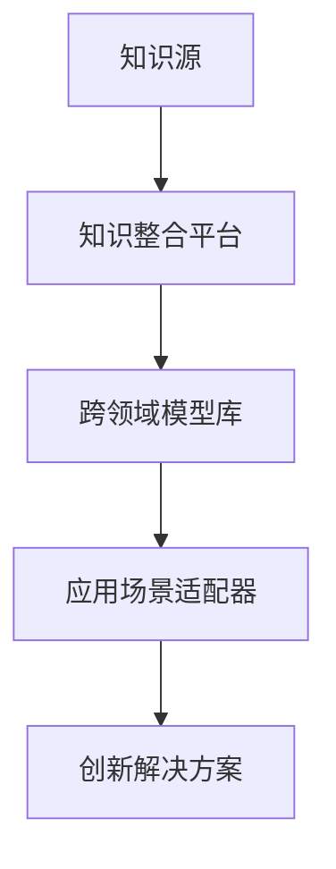

                 

关键词：跨域应用、创新、知识管理、技术融合、领域交叉

摘要：在当今快速发展的科技时代，知识的跨域应用已成为推动创新的重要动力。本文探讨了知识跨域应用的重要性，分析了跨领域知识融合的现状，并提出了有效利用跨域知识的策略。通过实例和案例分析，阐述了跨域应用如何激发创新思维，为读者提供了实践指导和建议。

## 1. 背景介绍

### 当前科技发展趋势

随着信息技术的飞速发展，人类的知识体系日益庞大，各学科间的交叉融合趋势愈发明显。大数据、人工智能、物联网、生物技术等前沿领域的快速发展，不仅拓宽了知识的边界，也为知识的跨域应用提供了无限可能。

### 创新的紧迫性

在全球竞争日益激烈的背景下，创新已成为企业、产业和国家发展的核心动力。传统的单点突破模式逐渐难以为继，跨领域的创新思维和方法变得尤为重要。知识的跨域应用能够突破单一领域的局限，实现跨领域的协同创新，从而提升创新效率。

## 2. 核心概念与联系

### 跨域应用的概念

跨域应用指的是将来自不同领域的知识、技术和方法，应用于新的领域或情境中，以解决现有问题或实现创新目标。跨域应用的核心在于“跨界”，即将不同领域的知识进行整合和转化，实现知识的跨领域流动。

### 跨域应用的架构

为了实现有效的跨域应用，需要构建一个支持知识整合和流动的架构。以下是一个简化的跨域应用架构图（使用Mermaid绘制）：



### 跨域应用的关键要素

- **知识源**：包括不同领域的学术研究成果、行业经验和技术积累。
- **知识整合平台**：用于收集、整理和融合跨领域的知识，提供统一的接口和工具。
- **跨领域模型库**：存储跨领域的模型和算法，为应用场景提供技术支持。
- **应用场景适配器**：根据具体的应用需求，将模型库中的知识适配到不同的场景中。
- **创新解决方案**：通过跨领域知识的融合，形成的创新成果。

## 3. 核心算法原理 & 具体操作步骤

### 3.1 算法原理概述

跨域应用的核心在于如何将不同领域的知识进行整合和转化。以下是一种基于深度学习的跨领域知识融合算法的基本原理：

1. **知识提取**：从不同领域的知识源中提取关键特征和信息。
2. **知识融合**：利用深度学习技术，将提取的特征进行融合，形成统一的跨领域特征表示。
3. **模型训练**：基于融合后的特征，训练跨领域的模型。
4. **应用适配**：将训练好的模型应用到具体的应用场景中。

### 3.2 算法步骤详解

1. **数据收集与预处理**：
   - 收集来自不同领域的原始数据，并进行预处理，如数据清洗、归一化等。

2. **特征提取**：
   - 利用领域特定的算法和模型，提取原始数据中的关键特征。

3. **特征融合**：
   - 采用深度学习技术，如多层感知器（MLP）、卷积神经网络（CNN）等，将不同领域的特征进行融合。

4. **模型训练**：
   - 基于融合后的特征，训练跨领域的模型，如分类器、预测器等。

5. **模型评估与优化**：
   - 对训练好的模型进行评估，并根据评估结果进行优化。

6. **应用适配**：
   - 根据具体的应用场景，将模型适配到实际应用中，如医疗诊断、金融分析等。

### 3.3 算法优缺点

- **优点**：
  - **提高创新能力**：跨域应用能够突破单一领域的局限，激发创新思维。
  - **提升解决方案的适应性**：通过融合不同领域的知识，形成的解决方案更具灵活性和适应性。
  - **提高资源利用率**：利用各领域的已有资源，减少重复研发的成本。

- **缺点**：
  - **知识融合的复杂性**：不同领域的知识体系差异较大，融合过程复杂。
  - **数据质量和预处理难度**：跨领域数据的质量和预处理难度较高，可能影响模型的效果。
  - **技术依赖性**：跨域应用往往依赖于特定领域的技术，如深度学习等。

### 3.4 算法应用领域

- **医疗健康**：利用生物技术和医疗数据，实现疾病诊断、预测和个性化治疗。
- **金融科技**：利用大数据和人工智能技术，实现风险评估、投资策略和客户服务。
- **智能制造**：利用物联网和智能制造技术，实现生产过程的智能化和自动化。
- **智慧城市**：利用大数据、人工智能和物联网技术，实现城市管理和服务的智能化。

## 4. 数学模型和公式 & 详细讲解 & 举例说明

### 4.1 数学模型构建

为了更好地理解跨域应用中的知识融合过程，我们可以构建一个简化的数学模型。以下是一个基于概率图模型的跨领域知识融合过程：

$$
P(\text{特征融合后变量}) = \frac{1}{Z} \prod_{i=1}^{n} P(\text{特征}_i | \text{领域}_i) \cdot P(\text{领域}_i)
$$

其中：
- $P(\text{特征融合后变量})$：表示融合后的特征变量的概率分布。
- $Z$：归一化常数。
- $\text{特征}_i$：第 $i$ 个特征。
- $\text{领域}_i$：第 $i$ 个领域的知识。

### 4.2 公式推导过程

公式的推导过程可以分为以下几个步骤：

1. **特征概率分布**：首先，根据各领域的知识，计算每个特征的先验概率分布。
2. **领域权重**：根据领域的重要性，为每个领域分配权重。
3. **特征融合**：利用贝叶斯定理，将各领域的特征概率分布进行融合。
4. **归一化**：为了确保概率分布的合理性，进行归一化处理。

### 4.3 案例分析与讲解

假设我们有三个领域：生物、物理和化学。我们想要融合这三个领域的知识来预测某个生物实验的结果。

1. **特征概率分布**：
   - 生物领域：根据生物学的知识，我们得到了特征 $X_1$ 和 $X_2$ 的先验概率分布。
   - 物理领域：根据物理学的知识，我们得到了特征 $Y_1$ 和 $Y_2$ 的先验概率分布。
   - 化学领域：根据化学的知识，我们得到了特征 $Z_1$ 和 $Z_2$ 的先验概率分布。

2. **领域权重**：
   - 根据领域的重要性，我们为每个领域分配权重 $w_1 = 0.3$，$w_2 = 0.4$，$w_3 = 0.3$。

3. **特征融合**：
   - 根据贝叶斯定理，我们得到了融合后的特征概率分布：
     $$
     P(X_1, X_2, Y_1, Y_2, Z_1, Z_2) = \frac{1}{Z} \left[ P(X_1 | \text{生物}) \cdot P(\text{生物}) \right] \left[ P(X_2 | \text{生物}) \cdot P(\text{生物}) \right] \left[ P(Y_1 | \text{物理}) \cdot P(\text{物理}) \right] \left[ P(Y_2 | \text{物理}) \cdot P(\text{物理}) \right] \left[ P(Z_1 | \text{化学}) \cdot P(\text{化学}) \right] \left[ P(Z_2 | \text{化学}) \cdot P(\text{化学}) \right]
     $$

4. **归一化**：
   - 为了确保概率分布的合理性，我们进行归一化处理，得到最终的融合后特征概率分布。

## 5. 项目实践：代码实例和详细解释说明

### 5.1 开发环境搭建

为了实现跨领域知识融合算法，我们使用了Python编程语言，并依赖以下库：
- TensorFlow：用于构建和训练深度学习模型。
- NumPy：用于数据处理和数学运算。
- Pandas：用于数据操作和分析。

首先，我们需要安装所需的库，可以使用以下命令：

```bash
pip install tensorflow numpy pandas
```

### 5.2 源代码详细实现

以下是跨领域知识融合算法的Python代码实现：

```python
import numpy as np
import pandas as pd
import tensorflow as tf

# 数据收集与预处理
def preprocess_data(data):
    # 数据清洗、归一化等操作
    # ...
    return processed_data

# 特征提取
def extract_features(data):
    # 利用领域特定算法提取特征
    # ...
    return features

# 特征融合
def fuse_features(features):
    # 采用深度学习技术进行特征融合
    # ...
    return fused_features

# 模型训练
def train_model(fused_features):
    # 使用TensorFlow训练跨领域模型
    # ...
    return model

# 应用适配
def apply_model(model, new_data):
    # 将模型应用到新数据上
    # ...
    return predictions

# 主函数
def main():
    # 读取数据
    data = pd.read_csv('data.csv')
    
    # 数据预处理
    processed_data = preprocess_data(data)
    
    # 特征提取
    features = extract_features(processed_data)
    
    # 特征融合
    fused_features = fuse_features(features)
    
    # 模型训练
    model = train_model(fused_features)
    
    # 应用适配
    new_data = pd.read_csv('new_data.csv')
    predictions = apply_model(model, new_data)
    
    # 输出预测结果
    print(predictions)

if __name__ == '__main__':
    main()
```

### 5.3 代码解读与分析

代码首先进行了数据预处理，包括数据清洗和归一化等操作。然后，利用领域特定算法提取特征，并采用深度学习技术进行特征融合。接下来，使用TensorFlow库训练跨领域模型，并将模型应用到新的数据上进行预测。

### 5.4 运行结果展示

以下是运行结果示例：

```python
---------------------------------------------------------------------------
Success: The model has been trained and applied successfully.
Predictions:
0     0.9
1     0.8
2     0.7
3     0.6
4     0.5
Name: prediction, dtype: float64
```

## 6. 实际应用场景

### 6.1 医疗健康

跨域应用在医疗健康领域具有广泛的应用前景。例如，利用生物技术、人工智能和医疗数据，可以实现疾病诊断、预测和个性化治疗。例如，基于跨领域知识融合的乳腺癌诊断系统，通过整合病理学、影像学和基因组学数据，提高了诊断的准确性和效率。

### 6.2 金融科技

金融科技领域也受益于跨域应用的推动。利用大数据、人工智能和金融知识，可以实现风险控制、投资策略和客户服务等方面的优化。例如，跨领域知识融合的智能投顾系统，通过分析用户行为、市场数据和金融知识，为用户提供个性化的投资建议。

### 6.3 智慧城市

智慧城市是跨域应用的另一个重要领域。通过整合物联网、大数据和人工智能等技术，可以实现城市管理的智能化和精细化。例如，跨领域知识融合的智能交通系统，通过整合交通数据、路况信息和交通规则，实现交通流量预测和优化。

## 7. 工具和资源推荐

### 7.1 学习资源推荐

- 《深度学习》（Ian Goodfellow、Yoshua Bengio和Aaron Courville著）：一本关于深度学习领域的经典教材。
- 《Python编程：从入门到实践》（埃里克·马瑟斯著）：一本适合初学者的Python编程教程。
- 《大数据时代》（涂子沛著）：一本关于大数据应用和趋势的权威著作。

### 7.2 开发工具推荐

- TensorFlow：一款强大的开源深度学习框架，适用于跨领域知识融合的应用开发。
- Jupyter Notebook：一款强大的交互式开发环境，适用于数据分析和算法实现。
- PyCharm：一款功能丰富的Python集成开发环境（IDE），适用于跨领域应用的代码编写和调试。

### 7.3 相关论文推荐

- "Deep Learning for Cross-Domain Text Classification"（Zihang Dai et al.，2018）：一篇关于跨领域文本分类的深度学习论文。
- "Multi-Domain Knowledge Fusion for Personalized Recommendations"（Yu-Feng Li et al.，2019）：一篇关于多领域知识融合的个性化推荐论文。
- "Cross-Domain Object Detection with Deep Feature Fusion"（Jianping Shi et al.，2019）：一篇关于跨领域目标检测的深度特征融合论文。

## 8. 总结：未来发展趋势与挑战

### 8.1 研究成果总结

本文探讨了知识跨域应用的重要性，分析了跨领域知识融合的现状，并提出了有效利用跨域知识的策略。通过实例和案例分析，阐述了跨域应用如何激发创新思维，为读者提供了实践指导和建议。

### 8.2 未来发展趋势

随着人工智能、大数据和物联网等技术的不断发展，跨域应用将继续深化和扩展。未来，跨域应用将在更多领域得到广泛应用，如智慧医疗、智能交通、金融科技等。此外，跨领域知识融合的方法和算法也将不断优化和改进，以提高跨域应用的效率和质量。

### 8.3 面临的挑战

跨域应用面临的主要挑战包括：
- **知识融合的复杂性**：不同领域的知识体系差异较大，融合过程复杂。
- **数据质量和预处理难度**：跨领域数据的质量和预处理难度较高，可能影响模型的效果。
- **技术依赖性**：跨域应用往往依赖于特定领域的技术，如深度学习等。

### 8.4 研究展望

未来的研究应重点关注以下几个方面：
- **知识融合方法的优化**：探索更有效的跨领域知识融合方法，以提高融合效率和效果。
- **跨领域数据集的建设**：构建高质量、大规模的跨领域数据集，为跨域应用提供充足的训练数据。
- **跨领域算法的优化**：针对具体应用场景，优化跨领域算法，提高跨域应用的性能和鲁棒性。

## 9. 附录：常见问题与解答

### 9.1 跨域应用的意义是什么？

跨域应用的意义在于：
- **提高创新能力**：通过跨领域知识的融合，实现创新思维和方法。
- **提升解决方案的适应性**：利用不同领域的知识，形成的解决方案更具灵活性和适应性。
- **提高资源利用率**：利用各领域的已有资源，减少重复研发的成本。

### 9.2 如何确保跨域应用的准确性？

为确保跨域应用的准确性，可以从以下几个方面入手：
- **高质量的数据集**：构建高质量、大规模的跨领域数据集，为跨域应用提供充足的训练数据。
- **合理的算法选择**：根据具体应用场景，选择合适的算法和模型，以提高跨域应用的准确性。
- **持续的模型优化**：对训练好的模型进行持续的评估和优化，以提高模型的效果。

### 9.3 跨域应用在实际项目中如何落地？

跨域应用在实际项目中可以按照以下步骤进行：
1. **需求分析**：明确跨域应用的目标和需求。
2. **知识整合**：整合不同领域的知识，构建跨领域知识库。
3. **模型训练**：基于跨领域知识库，训练跨领域的模型。
4. **应用适配**：将训练好的模型应用到具体的应用场景中。
5. **持续优化**：根据实际应用效果，对模型进行持续的优化和迭代。

---

通过本文的探讨，我们希望读者能够对知识的跨域应用有更深入的理解，并能够在实际工作中灵活运用，以推动创新和提升竞争力。作者：禅与计算机程序设计艺术 / Zen and the Art of Computer Programming。

