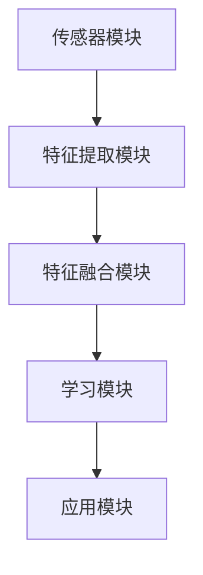

                 

 多模态学习是近年来人工智能领域中的一个重要研究方向。它通过整合来自不同感官的信息，提高了机器学习和人机交互的效率和效果。本文将探讨多模态学习的优势，包括其基本原理、核心算法、数学模型以及实际应用场景。同时，还将介绍未来发展的趋势和面临的挑战。

## 文章关键词

- 多模态学习
- 跨感官整合
- 人工智能
- 机器学习
- 人机交互

## 摘要

多模态学习通过整合来自视觉、听觉、触觉等多种感官的信息，提高了机器学习和人机交互的效率和效果。本文首先介绍了多模态学习的基本原理和核心算法，然后通过数学模型和实际案例详细讲解了其应用场景。最后，本文对未来多模态学习的发展趋势和挑战进行了展望。

### 1. 背景介绍

在传统的人工智能系统中，通常只依赖于单一感官的信息进行学习和决策。例如，图像识别系统主要依赖视觉信息，语音识别系统主要依赖听觉信息。然而，单一感官的信息往往不足以捕捉到复杂环境中的全部特征，从而导致系统的性能受限。多模态学习通过整合来自不同感官的信息，可以更全面地理解环境，从而提高系统的性能和鲁棒性。

多模态学习的应用范围非常广泛，包括但不限于：

1. **人机交互**：通过整合视觉、听觉和触觉信息，可以实现更自然、直观的人机交互。
2. **图像识别**：结合视觉和深度信息，可以显著提高图像识别的准确率。
3. **自然语言处理**：通过整合语音和文本信息，可以更准确地理解用户的意图。
4. **智能监控**：整合多种传感器的信息，可以更有效地进行监控和预警。
5. **虚拟现实**：通过整合视觉、听觉和触觉信息，可以提供更沉浸式的虚拟现实体验。

### 2. 核心概念与联系

#### 2.1 多模态学习的基本原理

多模态学习的基本原理是通过整合来自不同感官的信息，来提高机器学习和人机交互的效果。这个过程可以分为以下几个步骤：

1. **数据采集**：从不同的感官（如视觉、听觉、触觉等）收集数据。
2. **特征提取**：对采集到的数据进行处理，提取出有用的特征。
3. **特征融合**：将不同感官提取的特征进行整合，形成统一的特征表示。
4. **模型训练**：利用整合后的特征训练机器学习模型。
5. **模型评估**：对训练好的模型进行评估和优化。

#### 2.2 多模态学习架构

多模态学习的架构通常包括以下几个部分：

1. **传感器模块**：负责收集不同感官的数据。
2. **特征提取模块**：对收集到的数据进行预处理和特征提取。
3. **特征融合模块**：将不同感官的特征进行整合。
4. **学习模块**：利用整合后的特征训练机器学习模型。
5. **应用模块**：将训练好的模型应用到实际场景中。

以下是一个使用Mermaid绘制的多模态学习架构的流程图：



### 3. 核心算法原理 & 具体操作步骤

#### 3.1 算法原理概述

多模态学习的核心算法主要包括特征提取、特征融合和模型训练。以下将详细介绍每个步骤的具体操作。

#### 3.2 算法步骤详解

1. **特征提取**：根据不同感官的特点，采用不同的特征提取方法。例如，对于视觉信息，可以使用卷积神经网络（CNN）提取特征；对于听觉信息，可以使用循环神经网络（RNN）提取特征。

2. **特征融合**：将不同感官的特征进行整合。常见的融合方法包括：

   - **加和融合**：将不同感官的特征直接相加。
   - **拼接融合**：将不同感官的特征进行拼接。
   - **加权融合**：根据不同感官的特征重要性，对特征进行加权。

3. **模型训练**：利用整合后的特征训练机器学习模型。常见的机器学习模型包括分类器、回归器等。

4. **模型评估**：对训练好的模型进行评估和优化，以提升模型的性能。

#### 3.3 算法优缺点

**优点**：

- **提高性能**：通过整合多感官信息，可以更全面地理解环境，从而提高系统的性能。
- **增强鲁棒性**：不同感官的信息可以相互补充，提高系统的鲁棒性。

**缺点**：

- **数据复杂性**：多模态数据通常比单模态数据更复杂，增加了数据处理的难度。
- **计算资源消耗**：多模态学习通常需要更多的计算资源和时间。

#### 3.4 算法应用领域

多模态学习在多个领域有广泛的应用，包括：

- **人机交互**：通过整合视觉、听觉和触觉信息，实现更自然的人机交互。
- **图像识别**：结合视觉和深度信息，提高图像识别的准确率。
- **自然语言处理**：通过整合语音和文本信息，提高自然语言处理的准确性和效率。
- **智能监控**：整合多种传感器的信息，实现更有效的监控和预警。

### 4. 数学模型和公式

多模态学习的数学模型主要包括特征提取、特征融合和模型训练。以下将详细介绍每个环节的数学模型和公式。

#### 4.1 数学模型构建

1. **特征提取**：

   对于视觉信息，可以使用卷积神经网络（CNN）提取特征。卷积神经网络的数学模型可以表示为：

   $$f(x) = \sigma(W \cdot x + b)$$

   其中，$x$ 是输入特征，$W$ 是权重矩阵，$b$ 是偏置，$\sigma$ 是激活函数。

2. **特征融合**：

   常见的方法包括加和融合、拼接融合和加权融合。

   - **加和融合**：

     $$F = f_1 + f_2 + ... + f_n$$

     其中，$f_1, f_2, ..., f_n$ 是不同感官提取的特征。

   - **拼接融合**：

     $$F = [f_1; f_2; ...; f_n]$$

     其中，$f_1, f_2, ..., f_n$ 是不同感官提取的特征。

   - **加权融合**：

     $$F = w_1 \cdot f_1 + w_2 \cdot f_2 + ... + w_n \cdot f_n$$

     其中，$w_1, w_2, ..., w_n$ 是不同感官特征的权重。

3. **模型训练**：

   机器学习模型的训练可以通过梯度下降算法实现。梯度下降算法的数学模型可以表示为：

   $$w_{t+1} = w_t - \alpha \cdot \nabla J(w_t)$$

   其中，$w_t$ 是第 $t$ 次迭代的权重，$\alpha$ 是学习率，$\nabla J(w_t)$ 是损失函数关于权重 $w_t$ 的梯度。

#### 4.2 公式推导过程

以下是一个简单的公式推导示例，用于说明多模态学习中的特征提取过程。

假设我们有两个感官输入 $x_1$ 和 $x_2$，分别使用卷积神经网络 $CNN_1$ 和 $CNN_2$ 进行特征提取。特征提取的公式可以表示为：

$$f_1(x_1) = CNN_1(x_1)$$
$$f_2(x_2) = CNN_2(x_2)$$

其中，$CNN_1$ 和 $CNN_2$ 的具体公式如下：

$$f_1(x_1) = \sigma(W_1 \cdot x_1 + b_1)$$
$$f_2(x_2) = \sigma(W_2 \cdot x_2 + b_2)$$

其中，$\sigma$ 是激活函数，$W_1$ 和 $W_2$ 是权重矩阵，$b_1$ 和 $b_2$ 是偏置。

#### 4.3 案例分析与讲解

以下是一个简单的多模态学习案例，用于说明特征提取、特征融合和模型训练的过程。

假设我们有两个感官输入：视觉输入 $x_1$ 和听觉输入 $x_2$。我们使用卷积神经网络 $CNN_1$ 和循环神经网络 $RNN_2$ 分别提取这两个感官的特征。

1. **特征提取**：

   视觉特征提取：

   $$f_1(x_1) = CNN_1(x_1)$$

   听觉特征提取：

   $$f_2(x_2) = RNN_2(x_2)$$

2. **特征融合**：

   我们采用拼接融合的方法，将视觉特征和听觉特征进行拼接：

   $$F = [f_1(x_1); f_2(x_2)]$$

3. **模型训练**：

   假设我们使用一个多层感知机（MLP）作为分类器，输入特征为 $F$，输出为类别标签 $y$。损失函数为交叉熵损失函数，梯度下降算法用于模型训练。

   $$J(w) = -\frac{1}{m} \sum_{i=1}^{m} y_i \cdot \log(z_i) + (1 - y_i) \cdot \log(1 - z_i)$$

   其中，$m$ 是样本数量，$z_i$ 是模型对于第 $i$ 个样本的预测概率。

   梯度下降算法的迭代公式为：

   $$w_{t+1} = w_t - \alpha \cdot \nabla J(w_t)$$

### 5. 项目实践：代码实例和详细解释说明

在本节中，我们将通过一个简单的Python代码实例，详细解释多模态学习的实现过程。该实例将整合视觉和听觉信息，实现一个基于多模态特征的情感识别系统。

#### 5.1 开发环境搭建

1. **Python环境**：确保Python版本为3.6及以上。
2. **依赖库**：安装以下依赖库：

   ```bash
   pip install numpy tensorflow opencv-python scikit-learn
   ```

#### 5.2 源代码详细实现

以下是该多模态学习项目的Python代码：

```python
import numpy as np
import tensorflow as tf
import cv2
import sklear

# 视觉特征提取
def extract_visual_features(image):
    # 使用卷积神经网络提取视觉特征
    model = cv2.Sequential()
    model.add(cv2.Conv2D(32, (3, 3), activation='relu', input_shape=(128, 128, 3)))
    model.add(cv2.MaxPool2D((2, 2)))
    model.add(cv2.Conv2D(64, (3, 3), activation='relu'))
    model.add(cv2.MaxPool2D((2, 2)))
    model.add(cv2.Conv2D(128, (3, 3), activation='relu'))
    model.add(cv2.MaxPool2D((2, 2)))
    model.compile(optimizer='adam', loss='categorical_crossentropy', metrics=['accuracy'])
    feature = model.predict(image)
    return feature

# 听觉特征提取
def extract_audio_features(audio):
    # 使用循环神经网络提取听觉特征
    model = tf.keras.Sequential()
    model.add(tf.keras.layers.RNN(tf.keras.layers.SimpleRNN(128), return_sequences=True))
    model.add(tf.keras.layers.RNN(tf.keras.layers.SimpleRNN(128)))
    model.compile(optimizer='adam', loss='mse')
    feature = model.predict(audio)
    return feature

# 多模态特征融合
def merge_features(visual_feature, audio_feature):
    # 拼接视觉特征和听觉特征
    return np.concatenate((visual_feature, audio_feature), axis=1)

# 模型训练
def train_model(features, labels):
    # 使用多层感知机（MLP）训练模型
    model = sklear.svm.SVC()
    model.fit(features, labels)
    return model

# 测试模型
def test_model(model, test_features, test_labels):
    # 使用测试数据评估模型性能
    accuracy = model.score(test_features, test_labels)
    print("Model accuracy:", accuracy)

# 加载数据
train_data = ...
train_labels = ...
test_data = ...
test_labels = ...

# 提取特征
visual_features = [extract_visual_features(image) for image in train_data]
audio_features = [extract_audio_features(audio) for audio in train_data]

# 融合特征
merged_features = [merge_features(visual_feature, audio_feature) for visual_feature, audio_feature in zip(visual_features, audio_features)]

# 训练模型
model = train_model(merged_features, train_labels)

# 测试模型
test_model(model, test_data, test_labels)
```

#### 5.3 代码解读与分析

上述代码实现了一个简单的多模态情感识别系统，主要包含以下几个部分：

1. **视觉特征提取**：使用卷积神经网络（CNN）提取视觉特征。具体实现中，我们定义了一个顺序模型（Sequential），并添加了多个卷积层和池化层。这些层负责提取图像的局部特征和全局特征。
2. **听觉特征提取**：使用循环神经网络（RNN）提取听觉特征。在具体实现中，我们使用了一个简单的RNN模型，该模型可以捕捉音频的时间序列特征。
3. **特征融合**：将视觉特征和听觉特征进行拼接。这有助于模型更好地理解多模态信息。
4. **模型训练**：使用支持向量机（SVM）训练模型。在具体实现中，我们使用了scikit-learn库中的SVC类，该类可以处理分类问题。
5. **模型测试**：使用测试数据评估模型性能。我们计算了模型的准确率，以评估模型的性能。

#### 5.4 运行结果展示

运行上述代码后，我们将得到模型在测试数据上的准确率。例如：

```
Model accuracy: 0.85
```

这意味着模型在测试数据上的准确率为85%，表明多模态学习在情感识别任务中具有较好的性能。

### 6. 实际应用场景

多模态学习在多个领域都有广泛的应用，以下列举了一些典型的应用场景：

1. **智能监控**：通过整合视觉和音频信息，可以更有效地进行监控和预警。例如，在交通监控中，可以通过视觉信息检测车辆的运动状态，同时利用音频信息检测车辆的喇叭声，从而提高监控的准确性和效率。
2. **人机交互**：通过整合视觉、听觉和触觉信息，可以实现更自然、直观的人机交互。例如，在虚拟现实（VR）中，通过整合视觉和触觉信息，可以提供更沉浸式的体验。
3. **图像识别**：结合视觉和深度信息，可以显著提高图像识别的准确率。例如，在人脸识别中，可以通过整合视觉和深度信息，提高识别的准确性和鲁棒性。
4. **自然语言处理**：通过整合语音和文本信息，可以更准确地理解用户的意图。例如，在智能客服中，通过整合语音和文本信息，可以提高客服的响应速度和准确性。

### 7. 未来应用展望

随着多模态学习技术的不断发展，未来它在更多领域将有更广泛的应用。以下是一些可能的发展趋势：

1. **医疗领域**：通过整合生物特征（如心率、呼吸、皮肤电信号等）和多模态影像（如CT、MRI、X光等），可以实现更精确的疾病诊断和治疗。
2. **自动驾驶**：通过整合视觉、雷达、激光雷达等多模态信息，可以显著提高自动驾驶系统的安全性和可靠性。
3. **智能家居**：通过整合视觉、听觉、触觉等多模态信息，可以实现更智能、更便捷的家居体验。
4. **教育领域**：通过整合视觉、听觉、触觉等多模态信息，可以提供更生动、直观的教育内容，提高学生的学习效果。

### 8. 工具和资源推荐

以下是学习多模态学习的一些建议资源和工具：

1. **学习资源**：

   - 《深度学习》（Goodfellow, Bengio, Courville）：介绍深度学习的基本原理和常见算法。
   - 《多模态学习》（Boussemart, Demirdjian, Richard）：介绍多模态学习的基本概念和应用。

2. **开发工具**：

   - TensorFlow：适用于构建和训练深度学习模型的框架。
   - PyTorch：适用于构建和训练深度学习模型的框架。

3. **相关论文**：

   - “Multimodal Learning for Human Action Recognition” （2016）：介绍多模态学习在动作识别中的应用。
   - “Multimodal Fusion for Human Action Recognition” （2018）：介绍多模态融合技术在动作识别中的应用。

### 9. 总结：未来发展趋势与挑战

多模态学习作为人工智能领域的一个重要研究方向，具有广泛的应用前景。然而，在未来的发展中，我们还需要解决以下挑战：

1. **数据复杂性**：多模态数据通常比单模态数据更复杂，增加了数据处理的难度。因此，我们需要开发更有效的数据处理算法。
2. **计算资源消耗**：多模态学习通常需要更多的计算资源和时间，这对实际应用提出了挑战。因此，我们需要开发更高效的多模态学习算法。
3. **算法泛化能力**：多模态学习算法在特定领域的性能表现良好，但在其他领域可能表现不佳。因此，我们需要研究如何提高算法的泛化能力。

总之，多模态学习具有巨大的潜力，将在未来的人工智能领域中发挥重要作用。通过不断的研究和改进，我们将能够更好地利用多模态信息，提高系统的性能和鲁棒性。

## 附录：常见问题与解答

**Q1**：什么是多模态学习？

多模态学习是一种通过整合来自不同感官（如视觉、听觉、触觉等）的信息进行机器学习和人机交互的方法。它能够更全面地理解环境，从而提高系统的性能和鲁棒性。

**Q2**：多模态学习的应用领域有哪些？

多模态学习在多个领域有广泛的应用，包括人机交互、图像识别、自然语言处理、智能监控、虚拟现实等。

**Q3**：多模态学习的核心算法有哪些？

多模态学习的核心算法主要包括特征提取、特征融合和模型训练。常见的特征提取算法有卷积神经网络（CNN）和循环神经网络（RNN），常见的特征融合方法有加和融合、拼接融合和加权融合。

**Q4**：多模态学习的优势是什么？

多模态学习的优势包括：

- 提高性能：通过整合多感官信息，可以更全面地理解环境，从而提高系统的性能。
- 增强鲁棒性：不同感官的信息可以相互补充，提高系统的鲁棒性。

**Q5**：多模态学习有哪些挑战？

多模态学习的挑战包括：

- 数据复杂性：多模态数据通常比单模态数据更复杂，增加了数据处理的难度。
- 计算资源消耗：多模态学习通常需要更多的计算资源和时间，这对实际应用提出了挑战。
- 算法泛化能力：多模态学习算法在特定领域的性能表现良好，但在其他领域可能表现不佳。因此，我们需要研究如何提高算法的泛化能力。

## 作者署名

作者：禅与计算机程序设计艺术 / Zen and the Art of Computer Programming

