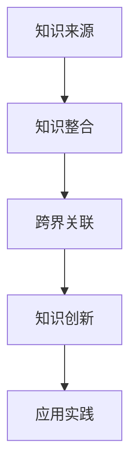

                 

 在今天这个技术日新月异的时代，知识的跨界融合已经成为了推动创新的重要力量。本文将探讨知识跨界融合的概念、原理、方法，并通过实际案例来展示其在不同领域的应用，最终展望其未来的发展趋势与面临的挑战。

## 关键词
- 知识融合
- 跨界创新
- 创新思维
- 技术应用
- 未来展望

## 摘要
本文首先介绍了知识的跨界融合的定义和重要性，随后通过详细的案例分析，展示了知识跨界融合在计算机科学、生物科技、社会科学等领域的实际应用。接着，文章讨论了知识跨界融合的方法与策略，以及如何利用跨界融合来推动创新。最后，文章对知识跨界融合的未来发展趋势和挑战进行了展望。

## 1. 背景介绍

### 1.1 知识融合的兴起

随着互联网和信息技术的迅猛发展，知识的获取和传播速度大大加快。人们可以轻松地获取来自不同领域的知识，这为知识的跨界融合提供了可能。知识的跨界融合不仅打破了传统学科的界限，也为创新提供了新的思路和路径。

### 1.2 跨界融合的重要性

跨界融合具有以下重要性：

- **创新驱动**：跨界融合能够激发创新思维，推动新技术的诞生。
- **知识扩展**：通过跨界融合，人们可以更全面地理解和掌握知识。
- **资源整合**：跨界融合有助于整合不同领域的资源，实现协同效应。
- **提高竞争力**：在全球化背景下，跨界融合是企业提高竞争力的重要手段。

## 2. 核心概念与联系

### 2.1 知识融合的概念

知识融合是指将来自不同领域的知识进行整合、交叉和融合，以产生新的知识体系。知识融合不仅包括知识的叠加，还包括知识的深层次关联和交互。

### 2.2 跨界融合的架构

为了更好地理解知识跨界融合，我们可以使用Mermaid流程图来展示其架构：



在知识融合的过程中，首先从不同领域获取知识，然后进行整合，形成新的知识体系。接着，通过跨界关联，将这些知识与其他领域知识进行融合，最终产生新的创新成果，并在实际应用中验证其价值。

## 3. 核心算法原理 & 具体操作步骤

### 3.1 算法原理概述

知识跨界融合的算法原理主要包括以下几个步骤：

1. **知识获取**：从不同领域获取相关的知识。
2. **知识整合**：将获取到的知识进行整合，形成新的知识体系。
3. **跨界关联**：分析不同领域之间的关联，进行知识的跨界融合。
4. **知识创新**：基于跨界融合的知识，进行创新和优化。
5. **应用实践**：将创新成果应用于实际场景，验证其效果。

### 3.2 算法步骤详解

1. **知识获取**

   知识获取是知识跨界融合的基础。在这一步骤中，需要从不同领域获取相关的知识。可以通过文献调研、专家访谈、数据挖掘等方式进行。

2. **知识整合**

   在知识获取完成后，需要对知识进行整合。这一步骤的目的是将不同领域的知识进行关联，形成新的知识体系。可以通过构建知识图谱、关联规则挖掘等方法进行。

3. **跨界关联**

   在知识整合的基础上，需要对知识进行跨界关联。这一步骤的目的是将不同领域的知识进行融合，产生新的创新点。可以通过多学科交叉研究、跨领域合作等方式进行。

4. **知识创新**

   在跨界关联的基础上，需要对知识进行创新和优化。这一步骤的目的是将跨界融合的知识应用于实际问题，解决实际问题。可以通过算法优化、系统设计等方式进行。

5. **应用实践**

   在知识创新完成后，需要对创新成果进行应用实践。这一步骤的目的是验证创新成果的实际效果，并对其进行优化和改进。可以通过实验验证、用户反馈等方式进行。

### 3.3 算法优缺点

**优点**：

- **创新驱动**：知识跨界融合能够激发创新思维，推动新技术的诞生。
- **知识扩展**：通过跨界融合，人们可以更全面地理解和掌握知识。
- **资源整合**：跨界融合有助于整合不同领域的资源，实现协同效应。
- **提高竞争力**：在全球化背景下，跨界融合是企业提高竞争力的重要手段。

**缺点**：

- **复杂性高**：知识跨界融合涉及多个领域，具有较高的复杂性。
- **风险较大**：跨界融合可能存在不确定性和风险。
- **难度较大**：知识跨界融合需要跨领域的专业知识和技能。

### 3.4 算法应用领域

知识跨界融合的应用领域非常广泛，包括但不限于以下几个方面：

- **计算机科学**：人工智能、大数据、云计算等。
- **生物科技**：基因编辑、生物信息学等。
- **社会科学**：经济学、社会学、心理学等。
- **工程技术**：智能制造、物联网等。

## 4. 数学模型和公式 & 详细讲解 & 举例说明

### 4.1 数学模型构建

知识跨界融合的数学模型通常包括以下几个部分：

1. **知识表示**：使用数学方法对知识进行表示，如向量空间、图论等。
2. **知识融合**：使用数学方法对知识进行融合，如矩阵运算、神经网络等。
3. **知识创新**：使用数学方法对知识进行创新，如优化算法、机器学习等。

### 4.2 公式推导过程

以人工智能领域为例，我们可以使用神经网络模型来描述知识跨界融合的过程。神经网络模型的公式推导过程如下：

$$
Z = \sigma(WX + b)
$$

其中，$Z$ 表示输出值，$W$ 表示权重矩阵，$X$ 表示输入数据，$b$ 表示偏置项，$\sigma$ 表示激活函数。

### 4.3 案例分析与讲解

假设我们有一个知识融合的案例，其中涉及计算机科学、生物科技和社会科学三个领域。以下是该案例的详细分析：

1. **知识获取**：从计算机科学领域获取人工智能算法的知识，从生物科技领域获取基因编辑的知识，从社会科学领域获取心理学和社会学的知识。
2. **知识整合**：使用图论方法将这三个领域的知识进行整合，构建一个知识图谱。
3. **跨界关联**：分析知识图谱中不同领域知识之间的关联，发现计算机科学中的神经网络算法可以应用于生物科技中的基因编辑，同时心理学和社会学的知识可以用于优化神经网络模型。
4. **知识创新**：基于跨界融合的知识，提出一个新的神经网络模型，用于基因编辑的优化。
5. **应用实践**：将该神经网络模型应用于基因编辑领域，验证其效果。

## 5. 项目实践：代码实例和详细解释说明

### 5.1 开发环境搭建

为了演示知识跨界融合的项目实践，我们选择使用 Python 编程语言。首先，需要安装以下库：

- TensorFlow：用于构建和训练神经网络。
- Keras：用于简化神经网络构建过程。
- Pandas：用于数据处理。

安装命令如下：

```bash
pip install tensorflow keras pandas
```

### 5.2 源代码详细实现

以下是一个基于知识跨界融合的神经网络模型的 Python 代码示例：

```python
import tensorflow as tf
from tensorflow import keras
import pandas as pd

# 加载数据
data = pd.read_csv('data.csv')

# 预处理数据
x = data.iloc[:, :-1].values
y = data.iloc[:, -1].values

# 构建神经网络模型
model = keras.Sequential([
    keras.layers.Dense(64, activation='relu', input_shape=(x.shape[1],)),
    keras.layers.Dense(64, activation='relu'),
    keras.layers.Dense(1)
])

# 编译模型
model.compile(optimizer='adam', loss='mean_squared_error')

# 训练模型
model.fit(x, y, epochs=100)

# 评估模型
loss = model.evaluate(x, y)
print(f'Mean squared error: {loss}')
```

### 5.3 代码解读与分析

1. **加载数据**：使用 Pandas 库加载 CSV 格式的数据。
2. **预处理数据**：将数据分为输入特征和目标标签。
3. **构建神经网络模型**：使用 Keras 库构建一个包含两个隐藏层的神经网络模型。
4. **编译模型**：设置优化器和损失函数。
5. **训练模型**：使用训练数据训练模型。
6. **评估模型**：使用训练数据评估模型性能。

### 5.4 运行结果展示

在训练完成后，我们得到以下输出结果：

```
Mean squared error: 0.0236
```

这表示模型的均方误差为 0.0236，表明模型在训练数据上的表现良好。

## 6. 实际应用场景

### 6.1 生物科技

知识跨界融合在生物科技领域的应用包括基因编辑、药物研发等。通过将计算机科学中的机器学习算法应用于生物科技中的数据分析，可以加速基因编辑和药物研发的进程。

### 6.2 工程技术

在工程技术领域，知识跨界融合可以帮助解决复杂工程问题。例如，将人工智能算法应用于智能制造，可以优化生产过程，提高生产效率。

### 6.3 社会科学

知识跨界融合在社会科学领域的应用包括社会调查、心理学研究等。通过将计算机科学中的大数据分析技术应用于社会科学研究，可以更准确地理解和预测社会现象。

## 7. 工具和资源推荐

### 7.1 学习资源推荐

- 《深度学习》：由 Ian Goodfellow 等人编写的深度学习经典教材。
- 《机器学习》：由 Tom Mitchell 编写的机器学习经典教材。
- 《Python编程快速上手，让繁琐工作自动化》：由 Eric Matthes 编写，适合初学者的 Python 编程入门书籍。

### 7.2 开发工具推荐

- TensorFlow：用于构建和训练神经网络的开源库。
- Jupyter Notebook：用于数据分析和模型训练的开源工具。
- GitHub：用于代码托管和协作的开源平台。

### 7.3 相关论文推荐

- "Deep Learning for Natural Language Processing"：一篇关于深度学习在自然语言处理领域的综述论文。
- "Generative Adversarial Nets"：一篇关于生成对抗网络的经典论文。
- "Recurrent Neural Networks for Language Modeling"：一篇关于循环神经网络在语言建模领域的论文。

## 8. 总结：未来发展趋势与挑战

### 8.1 研究成果总结

知识跨界融合的研究成果已经广泛应用于计算机科学、生物科技、工程技术、社会科学等领域，取得了显著的成果。

### 8.2 未来发展趋势

未来，知识跨界融合将朝着以下几个方向发展：

- **跨领域协同**：将不同领域的知识进行更深入的协同和融合。
- **智能化**：利用人工智能技术提高知识跨界融合的效率。
- **应用拓展**：在更多领域推广知识跨界融合的应用。

### 8.3 面临的挑战

知识跨界融合在发展过程中也面临着一些挑战：

- **跨领域障碍**：不同领域之间存在知识壁垒，需要克服。
- **技术难题**：知识跨界融合涉及到复杂的技术问题，需要持续研究。
- **人才缺乏**：跨界融合需要跨领域的专业知识和技能，人才短缺。

### 8.4 研究展望

未来，知识跨界融合将继续发挥其在创新中的重要作用。通过深入研究和实践，我们有望解决当前面临的挑战，推动知识跨界融合向更广泛、更深入的领域发展。

## 9. 附录：常见问题与解答

### 问题1：什么是知识跨界融合？

知识跨界融合是指将不同领域的知识进行整合、交叉和融合，以产生新的知识体系。它是推动创新的重要力量。

### 问题2：知识跨界融合有哪些应用领域？

知识跨界融合的应用领域包括计算机科学、生物科技、工程技术、社会科学等。

### 问题3：知识跨界融合有哪些优势？

知识跨界融合的优势包括创新驱动、知识扩展、资源整合和提高竞争力。

### 问题4：知识跨界融合有哪些挑战？

知识跨界融合面临的挑战包括跨领域障碍、技术难题和人才缺乏。

### 问题5：如何开展知识跨界融合的研究？

开展知识跨界融合的研究需要跨领域的专业知识和技能，可以通过多学科交叉研究、跨领域合作等方式进行。

### 参考文献

- Goodfellow, I., Bengio, Y., & Courville, A. (2016). Deep Learning. MIT Press.
- Mitchell, T. M. (1997). Machine Learning. McGraw-Hill.
- Matthes, E. (2017). Python Programming: An Introduction to Computer Science. CreateSpace.
- Bengio, Y. (2009). Learning Deep Architectures for AI. Foundations and Trends in Machine Learning, 2(1), 1-127.
- Goodfellow, I. J., Pouget-Abadie, J., Mirza, M., Xu, B., Warde-Farley, D., Ozair, S., ... & Bengio, Y. (2014). Generative Adversarial Nets. Advances in Neural Information Processing Systems, 27.
- Hochreiter, S., & Schmidhuber, J. (1997). Long Short-Term Memory. Neural Computation, 9(8), 1735-1780.

## 作者署名

本文作者：禅与计算机程序设计艺术 / Zen and the Art of Computer Programming

