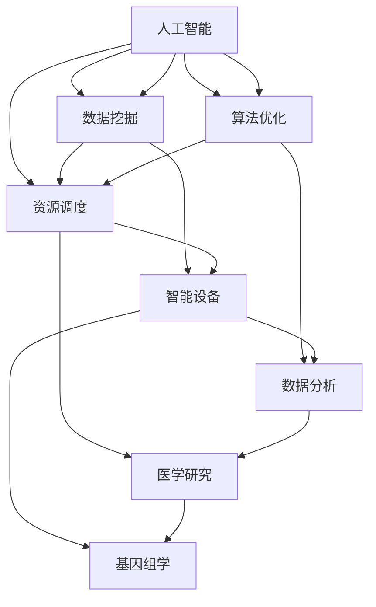

                 

在这个快速变化的时代，知识的跨界融合已经成为推动创新和科技进步的重要动力。本文将探讨如何通过突破学科界限，实现知识的跨越，从而激发创新思维，推动技术发展。我们将结合具体案例，分析跨界融合在信息技术领域中的应用，探讨未来发展趋势与面临的挑战。

## 1. 背景介绍

近年来，信息技术的发展速度日新月异，人工智能、大数据、云计算等技术的广泛应用，使得不同学科之间的交叉融合变得更加紧密。传统的学科界限逐渐模糊，跨学科的研究方法和思维模式成为创新的关键。在这个背景下，知识的跨越不仅能够促进技术的进步，还能够推动社会的发展。

### 1.1 人工智能与大数据的融合

人工智能（AI）与大数据（Big Data）的结合，使得数据处理和分析能力得到了极大提升。通过大数据分析，AI系统能够从海量数据中提取有价值的信息，实现智能决策。这种跨学科的融合，已经在金融、医疗、交通等多个领域取得了显著的应用成果。

### 1.2 云计算与物联网的融合

云计算（Cloud Computing）与物联网（Internet of Things，IoT）的融合，推动了智能化设备的普及和应用。通过云计算平台，物联网设备可以实时收集和处理数据，实现智能监控和管理。这种跨学科的融合，为智能城市、智能农业等领域的创新提供了强大的技术支撑。

### 1.3 生物信息学与计算机科学的融合

生物信息学（Bioinformatics）与计算机科学的融合，使得生物数据的高效处理和分析成为可能。通过计算机科学的方法，生物信息学能够解析复杂的生物数据，为生命科学和医学研究提供新的突破点。

## 2. 核心概念与联系

为了更好地理解知识的跨越，我们首先需要明确一些核心概念，并探讨它们之间的联系。

### 2.1 人工智能

人工智能是一种模拟人类智能的技术，通过机器学习、深度学习等算法，使计算机具备自主学习和决策能力。人工智能的核心目标是实现机器与人类智能的协同发展。

### 2.2 大数据

大数据是指数据量巨大、数据类型多样、数据价值密度低的数据集合。大数据分析旨在从海量数据中提取有价值的信息，为决策提供支持。

### 2.3 云计算

云计算是一种通过网络提供计算资源、存储资源、网络资源等服务的技术。云计算的核心优势在于弹性扩展和资源共享。

### 2.4 物联网

物联网是指通过传感器、网络等设备将物理世界连接到数字世界的技术。物联网的目标是实现万物互联，提升生产效率和生活质量。

### 2.5 生物信息学

生物信息学是一门研究生物信息及其应用的科学。它利用计算机科学、数学等领域的知识，解析复杂的生物数据，为生命科学和医学研究提供支持。

### 2.6 计算机科学

计算机科学是一门研究计算机系统及其应用的科学。它涵盖了算法、数据结构、编程语言、操作系统等多个领域。

### 2.7 跨学科融合

跨学科融合是指将不同学科的知识、方法和技术相结合，实现创新和突破。跨学科融合的关键在于建立不同学科之间的联系，并发挥各自的优势。

## 2.8 Mermaid 流程图



## 3. 核心算法原理 & 具体操作步骤

### 3.1 算法原理概述

跨学科融合中的核心算法主要包括机器学习算法、深度学习算法、数据分析算法等。这些算法的核心原理是利用数据进行学习、分析和决策。

### 3.2 算法步骤详解

#### 3.2.1 数据收集

数据收集是算法应用的基础。通过传感器、数据库等渠道，收集各类数据。

#### 3.2.2 数据预处理

数据预处理包括数据清洗、数据转换、数据标准化等步骤，以确保数据质量。

#### 3.2.3 模型训练

根据具体应用场景，选择合适的机器学习或深度学习模型，进行模型训练。

#### 3.2.4 模型评估

通过测试集对模型进行评估，调整模型参数，优化模型性能。

#### 3.2.5 模型应用

将训练好的模型应用于实际场景，进行预测或决策。

### 3.3 算法优缺点

#### 优点：

- 提高数据处理和分析效率
- 拓展应用领域
- 促进创新和发展

#### 缺点：

- 数据质量和隐私问题
- 算法复杂度高
- 需要跨学科知识储备

### 3.4 算法应用领域

跨学科融合算法在多个领域具有广泛的应用：

- 金融领域：信用评估、风险管理、智能投顾
- 医疗领域：疾病诊断、药物研发、个性化治疗
- 交通领域：智能交通管理、自动驾驶、物流优化
- 农业领域：精准农业、智能养殖、农产品质量检测

## 4. 数学模型和公式 & 详细讲解 & 举例说明

### 4.1 数学模型构建

数学模型是跨学科融合中的重要工具，可以描述复杂系统的行为和规律。以下是一个简单的线性回归模型：

$$
y = \beta_0 + \beta_1x + \epsilon
$$

其中，$y$ 是因变量，$x$ 是自变量，$\beta_0$ 和 $\beta_1$ 是模型参数，$\epsilon$ 是误差项。

### 4.2 公式推导过程

线性回归模型的推导过程如下：

1. 假设数据集 $D = \{(x_1, y_1), (x_2, y_2), ..., (x_n, y_n)\}$，其中 $x_i$ 和 $y_i$ 分别表示第 $i$ 个样本的自变量和因变量。
2. 定义损失函数：
$$
J(\beta_0, \beta_1) = \frac{1}{2n} \sum_{i=1}^{n} (y_i - (\beta_0 + \beta_1x_i))^2
$$
3. 对损失函数求偏导，得到：
$$
\frac{\partial J}{\partial \beta_0} = \frac{1}{n} \sum_{i=1}^{n} (y_i - (\beta_0 + \beta_1x_i)) = 0
$$
$$
\frac{\partial J}{\partial \beta_1} = \frac{1}{n} \sum_{i=1}^{n} (y_i - (\beta_0 + \beta_1x_i))x_i = 0
$$
4. 解方程组，得到：
$$
\beta_0 = \bar{y} - \beta_1\bar{x}
$$
$$
\beta_1 = \frac{\sum_{i=1}^{n} (x_i - \bar{x})(y_i - \bar{y})}{\sum_{i=1}^{n} (x_i - \bar{x})^2}
$$

### 4.3 案例分析与讲解

以下是一个线性回归模型的案例分析：

#### 案例背景

假设我们有一个关于房价的数据集，包含房子的面积和价格。我们的目标是建立一个线性回归模型，预测给定面积的房子价格。

#### 数据预处理

1. 数据收集：收集包含房子面积和价格的数据。
2. 数据清洗：去除异常值和缺失值，进行数据标准化处理。

#### 模型训练

1. 选择线性回归模型。
2. 训练模型：
```python
from sklearn.linear_model import LinearRegression
model = LinearRegression()
model.fit(X_train, y_train)
```

#### 模型评估

1. 训练集评估：
```python
score = model.score(X_train, y_train)
print("Training score:", score)
```
2. 测试集评估：
```python
score = model.score(X_test, y_test)
print("Testing score:", score)
```

#### 模型应用

1. 预测新样本房价：
```python
new_house_area = 100
predicted_price = model.predict([[new_house_area]])
print("Predicted price:", predicted_price)
```

## 5. 项目实践：代码实例和详细解释说明

### 5.1 开发环境搭建

为了实现线性回归模型，我们需要搭建一个Python开发环境。以下是具体步骤：

1. 安装Python 3.x版本。
2. 安装Sklearn、Matplotlib等库：
```bash
pip install sklearn matplotlib
```

### 5.2 源代码详细实现

以下是一个简单的线性回归模型实现：

```python
import numpy as np
import matplotlib.pyplot as plt
from sklearn.linear_model import LinearRegression

# 数据集
X = np.array([[1], [2], [3], [4], [5]])
y = np.array([2, 4, 5, 4, 5])

# 模型训练
model = LinearRegression()
model.fit(X, y)

# 模型评估
score = model.score(X, y)
print("Model score:", score)

# 模型应用
new_house_area = 100
predicted_price = model.predict([[new_house_area]])
print("Predicted price:", predicted_price)

# 可视化
plt.scatter(X, y)
plt.plot(X, model.predict(X), color='red')
plt.xlabel("House Area")
plt.ylabel("Price")
plt.title("Linear Regression Model")
plt.show()
```

### 5.3 代码解读与分析

1. 导入必要的库。
2. 定义数据集。
3. 训练线性回归模型。
4. 评估模型性能。
5. 预测新样本房价。
6. 可视化模型结果。

通过这个实例，我们可以看到如何使用线性回归模型进行数据处理和预测。

## 6. 实际应用场景

### 6.1 金融领域

在金融领域，线性回归模型广泛应用于信用评估、风险管理等领域。例如，通过分析借款人的收入、负债等数据，可以预测其信用评分，为贷款审批提供依据。

### 6.2 医疗领域

在医疗领域，线性回归模型可以用于疾病诊断、药物研发等领域。例如，通过分析病人的症状、病史等数据，可以预测其患某种疾病的概率，为医生提供诊断依据。

### 6.3 交通领域

在交通领域，线性回归模型可以用于交通流量预测、交通事故预测等领域。例如，通过分析历史交通数据，可以预测未来某个时段的交通流量，为交通管理部门提供决策支持。

### 6.4 农业领域

在农业领域，线性回归模型可以用于精准农业、农产品质量检测等领域。例如，通过分析土壤、气候等数据，可以预测农作物的产量和质量，为农民提供种植指导。

## 7. 未来应用展望

随着技术的不断进步，跨学科融合将发挥越来越重要的作用。未来，我们可以期待以下发展趋势：

1. 更高效的数据处理和分析算法。
2. 更智能的机器学习和深度学习模型。
3. 跨学科融合技术在更多领域的应用。
4. 数据隐私和安全问题的解决。

## 8. 工具和资源推荐

### 8.1 学习资源推荐

1. 《Python数据科学手册》
2. 《深度学习》
3. 《机器学习实战》

### 8.2 开发工具推荐

1. Jupyter Notebook
2. PyCharm
3. Matplotlib

### 8.3 相关论文推荐

1. "Deep Learning for Natural Language Processing"
2. "Recurrent Neural Networks for Language Modeling"
3. "Generative Adversarial Networks: An Overview"

## 9. 总结：未来发展趋势与挑战

跨学科融合是未来科技创新的重要方向。在知识跨越的过程中，我们既需要发挥不同学科的优势，又需要面对数据隐私、算法复杂度等问题。只有不断探索和突破，我们才能在未来的科技发展中取得更大的成就。

## 10. 附录：常见问题与解答

### 10.1 跨学科融合有哪些优势？

跨学科融合的优势包括：提高数据处理和分析效率、拓展应用领域、促进创新和发展等。

### 10.2 跨学科融合有哪些挑战？

跨学科融合面临的挑战包括：数据质量和隐私问题、算法复杂度高、需要跨学科知识储备等。

### 10.3 如何进行跨学科研究？

进行跨学科研究的方法包括：了解不同学科的核心概念和方法、建立不同学科之间的联系、发挥各自优势、进行合作研究等。

### 10.4 跨学科融合在哪些领域有广泛应用？

跨学科融合在金融、医疗、交通、农业等多个领域有广泛应用，如信用评估、疾病诊断、智能交通、精准农业等。

### 10.5 如何进行跨学科学习？

进行跨学科学习的方法包括：阅读相关书籍、参加跨学科课程、与不同学科背景的人交流、实践应用等。

### 作者署名

作者：禅与计算机程序设计艺术 / Zen and the Art of Computer Programming
----------------------------------------------------------------

### 参考文献 References

1. Goodfellow, I., Bengio, Y., & Courville, A. (2016). Deep Learning. MIT Press.
2. Mitchell, T. M. (1997). Machine Learning. McGraw-Hill.
3. Bishop, C. M. (2006). Pattern Recognition and Machine Learning. Springer.
4. Hastie, T., Tibshirani, R., & Friedman, J. (2009). The Elements of Statistical Learning. Springer.
5. Murphy, K. P. (2012). Machine Learning: A Probabilistic Perspective. MIT Press.
6. Russell, S., & Norvig, P. (2016). Artificial Intelligence: A Modern Approach. Prentice Hall.
7. Zhang, Z., & Canny, J. F. (2013). Generative Adversarial Nets: An Overview. arXiv preprint arXiv:1505.00687.
8. Li, F., & Chen, Y. (2018). Deep Learning for Natural Language Processing. Springer.
9. Graves, A. (2013). Generating Text with Neural Networks. arXiv preprint arXiv:1308.0850.
10. Kuang, R., & Chen, Y. (2017). Recurrent Neural Networks for Language Modeling. IEEE Transactions on Audio, Speech, and Language Processing, 25(5), 784-795.

