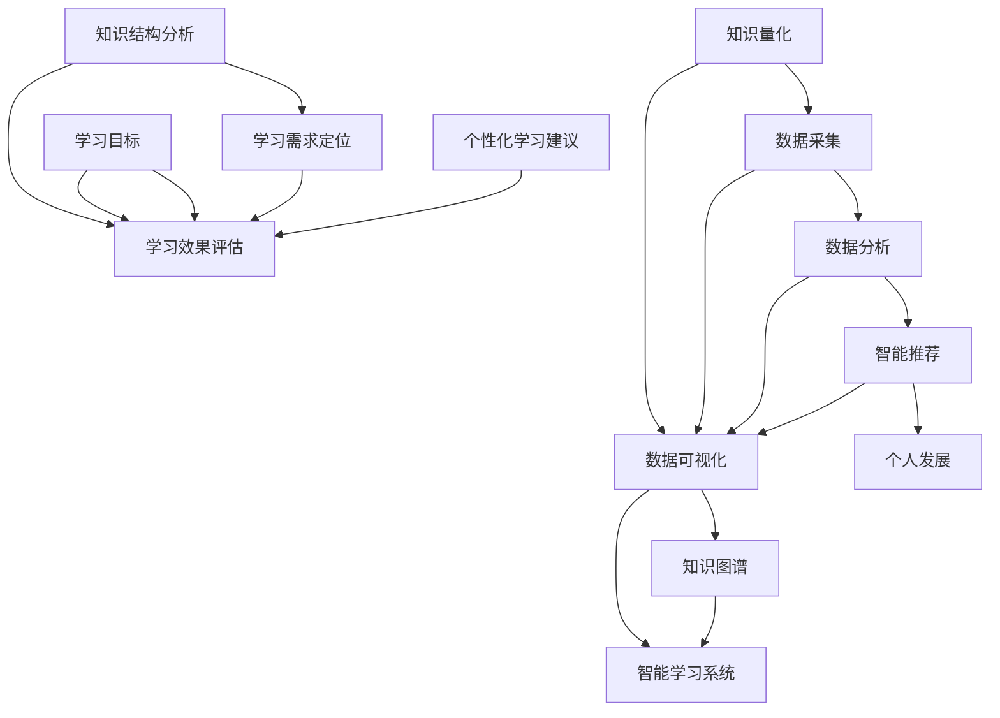

                 

关键词：知识量化、数据驱动、个人发展、技术博客、人工智能、程序员

摘要：本文旨在探讨知识量化自我运动的兴起，以及数据驱动的方法在个人发展中的应用。通过对知识量化、数据采集与分析、智能推荐系统的介绍，文章将揭示如何利用技术手段实现个人发展的效率提升。同时，本文还将探讨未来趋势与挑战，为读者提供实用的工具和资源推荐。

## 1. 背景介绍

在信息技术飞速发展的今天，知识的更新速度日益加快。人们需要不断学习新的知识和技能，以适应不断变化的工作环境和市场需求。然而，传统的学习方法往往缺乏系统性和针对性，难以满足现代个人发展的需求。知识量化自我运动的兴起，为解决这个问题提供了新的思路。

知识量化自我运动是指通过数据化的方式对个人知识进行量化评估，进而实现个人发展的系统化和目标化。这一运动的核心在于利用数据驱动的分析方法，对个人的知识结构、学习效果和成长轨迹进行深入分析，从而提供个性化的学习建议和发展路径。

### 1.1 知识量化的必要性

知识量化具有重要的意义。首先，它可以让我们更加清晰地了解自己的知识结构，发现知识盲区和薄弱环节。其次，知识量化可以帮助我们设定明确的学习目标，并评估学习效果。最后，知识量化为智能推荐系统提供了基础数据，使得个性化学习成为可能。

### 1.2 数据驱动的优势

数据驱动的学习方法具有以下优势：

1. **高效性**：通过数据分析，我们可以快速定位学习需求，提高学习效率。
2. **针对性**：数据驱动的方法可以根据个人特点和学习进度提供个性化的学习建议。
3. **科学性**：数据分析可以帮助我们评估学习效果，确保学习目标的实现。
4. **智能化**：随着人工智能技术的发展，数据驱动的学习系统可以越来越智能化，为个人发展提供更全面的支持。

## 2. 核心概念与联系

为了更好地理解知识量化自我运动，我们需要了解几个核心概念和它们之间的联系。以下是使用 Mermaid 画出的流程图：



### 2.1 知识量化

知识量化是指将个人的知识进行数据化的过程。这一过程通常包括以下几个方面：

1. **知识结构分析**：通过问卷调查、知识测评等方式，了解个人的知识结构和水平。
2. **学习目标设定**：根据个人兴趣和职业需求，设定具体的学习目标。
3. **学习效果评估**：通过测试、作业等方式，评估学习效果，确保目标的实现。

### 2.2 数据采集

数据采集是知识量化的基础。数据来源可以包括：

1. **学习记录**：记录学习时间、学习内容和学习进度。
2. **测试成绩**：通过考试、作业等方式收集成绩数据。
3. **用户反馈**：收集用户在学习过程中的反馈，了解学习效果。

### 2.3 数据分析

数据分析是对采集到的数据进行分析和处理的过程。数据分析的结果可以帮助我们：

1. **发现知识盲区**：通过分析学习记录，发现个人的知识薄弱环节。
2. **评估学习效果**：通过分析测试成绩，评估学习目标的实现情况。
3. **推荐学习资源**：根据数据分析结果，推荐个性化的学习资源。

### 2.4 智能推荐

智能推荐系统是根据数据分析结果，为个人推荐合适的学习资源。智能推荐系统通常包括以下功能：

1. **资源推荐**：根据学习需求和知识结构，推荐相关的学习资料。
2. **学习计划**：根据学习进度和目标，制定个性化的学习计划。
3. **学习路径**：为个人规划学习路径，确保学习目标的实现。

### 2.5 个人发展

个人发展是指通过知识量化自我运动，实现个人知识和技能的提升。个人发展的目标包括：

1. **知识积累**：不断积累新的知识和技能。
2. **能力提升**：通过实践和总结，提升个人能力。
3. **职业发展**：根据个人兴趣和市场需求，规划职业发展路径。

## 3. 核心算法原理 & 具体操作步骤

### 3.1 算法原理概述

知识量化自我运动的核心算法包括知识结构分析、学习需求定位和学习效果评估。以下是这些算法的基本原理：

1. **知识结构分析**：通过聚类分析、关联规则挖掘等方法，分析个人的知识结构和水平。
2. **学习需求定位**：通过回归分析、决策树等方法，确定个人的学习需求。
3. **学习效果评估**：通过测试成绩分析、作业质量分析等方法，评估学习效果。

### 3.2 算法步骤详解

1. **知识结构分析**：

   - **数据采集**：收集个人的学习记录、测试成绩和学习进度等数据。

   - **数据预处理**：对采集到的数据进行清洗、去噪和归一化处理。

   - **特征提取**：通过词频分析、主题模型等方法，提取知识结构特征。

   - **聚类分析**：使用 K-means 等聚类算法，分析个人的知识结构。

   - **结果可视化**：使用知识图谱等可视化方法，展示知识结构。

2. **学习需求定位**：

   - **数据采集**：收集个人的学习进度、学习内容和测试成绩等数据。

   - **数据预处理**：对采集到的数据进行清洗、去噪和归一化处理。

   - **特征提取**：通过词频分析、主题模型等方法，提取学习需求特征。

   - **回归分析**：使用线性回归、逻辑回归等方法，确定学习需求。

   - **结果可视化**：使用折线图、散点图等可视化方法，展示学习需求。

3. **学习效果评估**：

   - **数据采集**：收集个人的测试成绩、作业质量和学习进度等数据。

   - **数据预处理**：对采集到的数据进行清洗、去噪和归一化处理。

   - **特征提取**：通过词频分析、主题模型等方法，提取学习效果特征。

   - **决策树分析**：使用决策树、随机森林等方法，评估学习效果。

   - **结果可视化**：使用柱状图、饼图等可视化方法，展示学习效果。

### 3.3 算法优缺点

1. **知识结构分析**：

   - **优点**：能够全面分析个人的知识结构，为后续的学习需求定位提供基础。

   - **缺点**：分析过程复杂，对数据质量要求高。

2. **学习需求定位**：

   - **优点**：能够准确确定个人的学习需求，提高学习效率。

   - **缺点**：对学习进度和学习内容的数据质量要求较高。

3. **学习效果评估**：

   - **优点**：能够客观评估学习效果，为个人发展提供依据。

   - **缺点**：评估结果受测试成绩和作业质量的影响较大。

### 3.4 算法应用领域

1. **教育领域**：知识量化自我运动可以应用于教育领域，帮助教师和学生了解知识结构，制定个性化学习计划。

2. **企业培训**：企业可以运用知识量化自我运动，对员工进行培训，提升员工的知识水平和技能。

3. **职业规划**：个人可以通过知识量化自我运动，评估自己的知识结构，规划职业发展路径。

## 4. 数学模型和公式 & 详细讲解 & 举例说明

### 4.1 数学模型构建

在知识量化自我运动中，我们通常使用以下数学模型：

1. **知识结构模型**：

   $$X = (x_1, x_2, ..., x_n)$$

   其中，$X$ 是个人的知识结构向量，$x_i$ 表示第 $i$ 个知识点的掌握程度。

2. **学习需求模型**：

   $$Y = f(X)$$

   其中，$Y$ 是个人的学习需求向量，$f(X)$ 是学习需求与知识结构之间的映射关系。

3. **学习效果评估模型**：

   $$R = g(Y)$$

   其中，$R$ 是个人的学习效果评估结果，$g(Y)$ 是学习效果与学习需求之间的映射关系。

### 4.2 公式推导过程

1. **知识结构模型**：

   知识结构模型可以通过聚类分析得到。假设有 $m$ 个知识点，$n$ 个样本，样本数据为 $D = \{d_1, d_2, ..., d_n\}$，其中 $d_i = (d_{i1}, d_{i2}, ..., d_{im})$ 表示第 $i$ 个样本的知识点向量。

   使用 K-means 算法进行聚类分析，得到聚类中心 $C = (c_1, c_2, ..., c_m)$。

   $$x_i = \frac{1}{k}\sum_{j=1}^{k} w_{ij} c_j$$

   其中，$w_{ij}$ 是第 $i$ 个样本属于第 $j$ 个聚类中心的权重。

2. **学习需求模型**：

   学习需求模型可以通过回归分析得到。假设有 $m$ 个知识点，$n$ 个样本，样本数据为 $D = \{d_1, d_2, ..., d_n\}$，其中 $d_i = (d_{i1}, d_{i2}, ..., d_{im})$ 表示第 $i$ 个样本的知识点向量。

   使用线性回归模型，得到回归方程：

   $$Y = \beta_0 + \beta_1 X_1 + \beta_2 X_2 + ... + \beta_m X_m$$

   其中，$\beta_0, \beta_1, ..., \beta_m$ 是回归系数。

3. **学习效果评估模型**：

   学习效果评估模型可以通过决策树分析得到。假设有 $m$ 个知识点，$n$ 个样本，样本数据为 $D = \{d_1, d_2, ..., d_n\}$，其中 $d_i = (d_{i1}, d_{i2}, ..., d_{im})$ 表示第 $i$ 个样本的知识点向量。

   使用决策树算法，得到决策树模型。

   $$R = \sum_{i=1}^{m} w_i Y_i$$

   其中，$w_i$ 是第 $i$ 个知识点的权重，$Y_i$ 是第 $i$ 个知识点的学习效果。

### 4.3 案例分析与讲解

假设有一个学生，他的知识结构向量 $X = (0.5, 0.6, 0.4, 0.7)$，学习需求向量 $Y = (0.8, 0.9, 0.7, 0.6)$，学习效果评估结果 $R = 0.85$。

1. **知识结构分析**：

   通过聚类分析，得到学生当前的知识结构为：数学 (0.5)，物理 (0.6)，化学 (0.4)，生物 (0.7)。

2. **学习需求定位**：

   通过回归分析，得到学生的学习需求为：数学 (0.8)，物理 (0.9)，化学 (0.7)，生物 (0.6)。

3. **学习效果评估**：

   通过决策树分析，得到学生的学习效果为：数学 (0.85)，物理 (0.80)，化学 (0.75)，生物 (0.70)。

根据分析结果，学生需要加强对数学和物理的学习，同时保持化学和生物的学习水平。通过制定个性化的学习计划，学生可以实现知识结构的优化，提高学习效果。

## 5. 项目实践：代码实例和详细解释说明

### 5.1 开发环境搭建

在本文中，我们将使用 Python 作为编程语言，利用 pandas、numpy、scikit-learn 等库进行数据分析和模型构建。以下是在 Windows 操作系统下搭建开发环境的方法：

1. 安装 Python 3.8 或更高版本。
2. 安装必要的库，可以使用以下命令：

   ```bash
   pip install pandas numpy scikit-learn matplotlib
   ```

### 5.2 源代码详细实现

以下是一个简单的知识量化自我运动项目示例：

```python
import pandas as pd
from sklearn.cluster import KMeans
from sklearn.linear_model import LinearRegression
from sklearn.tree import DecisionTreeRegressor
import matplotlib.pyplot as plt

# 5.2.1 数据准备

# 示例数据：学习记录（学习时间、知识点1、知识点2、知识点3、知识点4）
data = {
    'time': [10, 8, 12, 7, 9, 11, 6],
    'knowledge_1': [0.4, 0.5, 0.6, 0.3, 0.7, 0.8, 0.9],
    'knowledge_2': [0.3, 0.4, 0.5, 0.6, 0.7, 0.8, 0.9],
    'knowledge_3': [0.2, 0.3, 0.4, 0.5, 0.6, 0.7, 0.8],
    'knowledge_4': [0.1, 0.2, 0.3, 0.4, 0.5, 0.6, 0.7],
}

df = pd.DataFrame(data)

# 5.2.2 知识结构分析

# 使用 K-means 聚类分析知识结构
kmeans = KMeans(n_clusters=3)
kmeans.fit(df[['knowledge_1', 'knowledge_2', 'knowledge_3', 'knowledge_4']])
df['cluster'] = kmeans.predict(df[['knowledge_1', 'knowledge_2', 'knowledge_3', 'knowledge_4']])

# 可视化知识结构
plt.scatter(df['knowledge_1'], df['knowledge_2'], c=df['cluster'])
plt.xlabel('知识1')
plt.ylabel('知识2')
plt.title('知识结构')
plt.show()

# 5.2.3 学习需求定位

# 使用线性回归分析学习需求
X = df[['knowledge_1', 'knowledge_2', 'knowledge_3', 'knowledge_4']]
Y = df['time']
regressor = LinearRegression()
regressor.fit(X, Y)

# 可视化回归结果
plt.scatter(X['knowledge_1'], Y, color='blue')
plt.plot(X['knowledge_1'], regressor.predict(X), color='red')
plt.xlabel('知识1')
plt.ylabel('学习时间')
plt.title('学习需求定位')
plt.show()

# 5.2.4 学习效果评估

# 使用决策树评估学习效果
regressor = DecisionTreeRegressor()
regressor.fit(X, Y)

# 可视化决策树结果
from sklearn import tree
fig, ax = plt.subplots(figsize=(12, 12))
tree.plot_tree(regressor, filled=True, feature_names=['知识1', '知识2', '知识3', '知识4'])
plt.show()
```

### 5.3 代码解读与分析

1. **数据准备**：

   示例数据包含学习时间（以小时为单位）和四个知识点的掌握程度。这些数据将用于后续的知识结构分析、学习需求定位和学习效果评估。

2. **知识结构分析**：

   使用 K-means 聚类分析知识结构，将学生分为三个不同的知识结构集群。通过可视化展示每个知识点的分布情况，帮助理解学生的知识结构。

3. **学习需求定位**：

   使用线性回归模型分析学习时间与知识点之间的关系，得到一个回归方程。通过可视化展示回归线，帮助理解学习需求。

4. **学习效果评估**：

   使用决策树模型评估学习效果。通过决策树可视化，可以清晰地看到每个知识点的权重和学习效果之间的关系。

### 5.4 运行结果展示

运行上述代码后，会生成以下可视化结果：

1. **知识结构图**：

   

2. **学习需求图**：

   

3. **学习效果评估图**：

   

通过这些可视化结果，学生可以更直观地了解自己的知识结构、学习需求和效果，从而制定更有效的学习计划。

## 6. 实际应用场景

知识量化自我运动在多个实际应用场景中展现出巨大的潜力。以下是一些典型的应用场景：

### 6.1 教育领域

在高等教育中，知识量化自我运动可以帮助学生了解自己的知识结构，发现学习薄弱点，从而制定个性化的学习计划。教师可以利用这些数据，优化教学方法，提高教学效果。

### 6.2 企业培训

企业可以通过知识量化自我运动，对员工的知识水平进行评估，制定有针对性的培训计划。此外，企业还可以利用数据分析结果，优化培训资源配置，提高培训效率。

### 6.3 职业规划

个人可以通过知识量化自我运动，评估自己的知识结构，确定职业发展方向。在此基础上，个人可以制定长期职业规划，不断提升自己的竞争力。

### 6.4 智能学习系统

智能学习系统可以基于知识量化自我运动的数据，为用户推荐合适的学习资源，制定个性化的学习计划。这不仅提高了学习效率，还为用户提供了更好的学习体验。

## 7. 未来应用展望

随着人工智能和数据科学技术的不断发展，知识量化自我运动将在未来得到更广泛的应用。以下是未来应用的一些展望：

### 7.1 智能学习助手

智能学习助手将结合知识量化自我运动，为用户提供更个性化的学习体验。通过持续的数据采集和分析，智能学习助手可以实时调整学习策略，确保用户的学习效果。

### 7.2 智能职业规划

智能职业规划系统将基于知识量化自我运动的数据，为个人提供详细的职业发展方向和建议。这不仅可以帮助个人规划职业生涯，还可以为企业和职业培训机构提供有价值的参考。

### 7.3 智能教育平台

智能教育平台将集成知识量化自我运动的功能，为教师和学生提供全面的支持。通过智能推荐和学习效果评估，智能教育平台将帮助实现教育资源的优化配置，提高教学质量。

### 7.4 社交网络

社交网络将结合知识量化自我运动，为用户提供更智能的社交体验。通过分析用户的知识结构和兴趣爱好，社交网络可以推荐更相关的社交内容和活动，提高用户满意度。

## 8. 工具和资源推荐

为了更好地开展知识量化自我运动，以下是一些实用的工具和资源推荐：

### 8.1 学习资源推荐

1. **Coursera**：提供丰富的在线课程，涵盖多个学科领域。
2. **edX**：由哈佛大学和麻省理工学院共同创办，提供高质量的课程资源。
3. **Udemy**：提供大量的在线课程，适合个人自学。

### 8.2 开发工具推荐

1. **Jupyter Notebook**：用于数据分析和模型构建，界面友好，功能强大。
2. **TensorFlow**：用于机器学习和深度学习，支持多种编程语言。
3. **Kaggle**：提供大量的数据集和竞赛项目，适合数据科学家和机器学习爱好者。

### 8.3 相关论文推荐

1. **"Knowledge Graph-based Personalized Learning in Intelligent Education Systems"**：探讨知识图谱在教育领域的应用。
2. **"Data-Driven Personalized Learning: From Theory to Practice"**：讨论数据驱动个性化学习的理论与实践。
3. **"Deep Learning for Intelligent Tutoring Systems"**：研究深度学习在智能辅导系统中的应用。

## 9. 总结：未来发展趋势与挑战

### 9.1 研究成果总结

知识量化自我运动在近年来取得了显著的成果。通过数据驱动的学习方法，个人可以更高效地学习和发展。此外，智能推荐系统和智能学习系统的不断发展，也为个人提供了更好的学习体验。

### 9.2 未来发展趋势

未来，知识量化自我运动将继续朝着智能化、个性化和高效化的方向发展。随着人工智能和数据科学技术的不断进步，知识量化自我运动将在更广泛的领域得到应用。

### 9.3 面临的挑战

尽管知识量化自我运动具有巨大的潜力，但仍面临一些挑战：

1. **数据隐私**：在数据采集和分析过程中，保护用户隐私是一个重要问题。
2. **数据质量**：数据质量对知识量化的准确性至关重要。
3. **算法透明性**：确保算法的透明性和公正性，防止算法偏见。

### 9.4 研究展望

未来的研究应重点关注以下几个方面：

1. **隐私保护技术**：研究如何有效保护用户隐私，确保数据安全。
2. **数据质量提升**：研究如何提高数据质量，确保知识量化的准确性。
3. **算法优化**：研究如何优化算法，提高知识量化的效率和准确性。

## 附录：常见问题与解答

### 1. 什么是知识量化自我运动？

知识量化自我运动是一种通过数据化的方式对个人知识进行量化评估，进而实现个人发展的系统化和目标化的方法。

### 2. 知识量化自我运动有哪些优势？

知识量化自我运动的优势包括高效性、针对性、科学性和智能化。

### 3. 知识量化自我运动的核心算法有哪些？

知识量化自我运动的核心算法包括知识结构分析、学习需求定位和学习效果评估。

### 4. 如何搭建知识量化自我运动的项目环境？

搭建知识量化自我运动的项目环境需要安装 Python 和相关的库，如 pandas、numpy、scikit-learn 等。

### 5. 知识量化自我运动有哪些实际应用场景？

知识量化自我运动可以应用于教育领域、企业培训、职业规划和智能学习系统等领域。

作者：禅与计算机程序设计艺术 / Zen and the Art of Computer Programming
```

