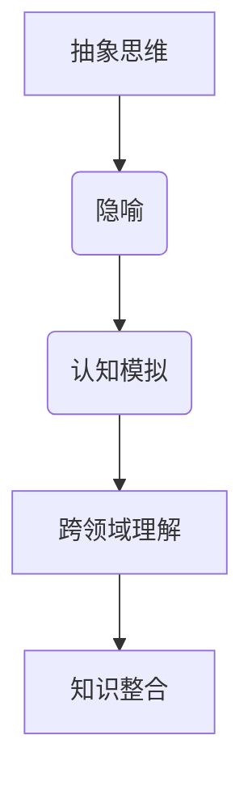

                 

关键词：跨领域理解、知识隐喻、人工智能、抽象思维、认知模拟、技术传播、知识整合、领域交叉、认知工具

> 摘要：本文探讨知识隐喻在跨领域理解中的作用，通过计算机编程中的实例，展示如何运用隐喻作为桥梁，将复杂的技术概念转化为易于理解的形式。文章旨在启发读者思考抽象思维与具体应用之间的联系，为技术领域从业者提供一种新的知识传播和整合方法。

## 1. 背景介绍

在当今信息技术飞速发展的时代，知识的传播和整合变得尤为重要。然而，不同领域之间的技术壁垒使得跨领域理解成为一个挑战。许多技术概念复杂而抽象，使得非专业人士难以把握。知识的隐喻作为一种强大的认知工具，能够在不同领域之间架起理解的桥梁，使得复杂概念变得通俗易懂。

隐喻作为一种语言现象，早在古希腊时期就被亚里士多德誉为“人类的智慧之镜”。在现代，隐喻被广泛应用于文学、哲学、心理学等领域。在计算机科学中，隐喻不仅被用来解释技术概念，还成为了设计算法和系统架构的重要工具。本文将探讨知识隐喻在跨领域理解中的作用，并分析其在不同技术领域的应用。

## 2. 核心概念与联系

为了更好地理解知识隐喻的作用，我们需要首先明确几个核心概念：抽象思维、隐喻和认知模拟。

### 2.1 抽象思维

抽象思维是一种从具体事物中提炼出普遍规律和本质特征的思维方式。它是人类认知的高级阶段，能够帮助我们理解复杂的现象和概念。抽象思维的关键在于将具体的事物转化为抽象的概念，从而建立不同领域之间的联系。

### 2.2 隐喻

隐喻是一种通过将一个领域的概念应用于另一个领域，从而帮助理解复杂概念的认知工具。隐喻通常涉及到一个源领域（source domain）和一个目标领域（target domain）。通过隐喻，我们能够将源领域的经验、知识和直觉应用到目标领域，从而加深对目标领域概念的理解。

### 2.3 认知模拟

认知模拟是一种模拟人类思维过程的方法，通过计算机程序来模拟人的大脑如何处理信息、解决问题。认知模拟能够帮助我们理解复杂认知过程，并探索隐喻在不同领域中的应用。

下面是一个使用Mermaid绘制的隐喻流程图，展示了如何通过认知模拟实现跨领域理解：



## 3. 核心算法原理 & 具体操作步骤

### 3.1 算法原理概述

知识隐喻算法的基本原理是利用源领域的知识来解释目标领域的概念。具体操作步骤包括以下几个阶段：

1. **识别源领域和目标领域**：首先需要确定源领域和目标领域，并识别两者之间的相似性。
2. **构建隐喻模型**：通过将源领域的概念应用于目标领域，构建一个隐喻模型。
3. **模拟认知过程**：使用认知模拟技术，模拟人类在理解目标领域概念时的认知过程。
4. **评估隐喻效果**：评估隐喻在帮助理解目标领域概念方面的效果，并根据反馈进行调整。

### 3.2 算法步骤详解

1. **识别源领域和目标领域**：例如，将计算机编程中的“递归”概念应用于数学中的“阶乘”计算。

2. **构建隐喻模型**：将递归的过程比喻为数学中的阶乘计算。

3. **模拟认知过程**：使用计算机程序来模拟递归计算的过程，帮助读者理解阶乘的计算方法。

4. **评估隐喻效果**：通过实际案例，评估隐喻在帮助理解阶乘计算方面的效果。

### 3.3 算法优缺点

**优点**：
- **易于理解**：隐喻能够将复杂概念转化为易于理解的形式，降低学习难度。
- **增强记忆**：隐喻能够激发读者的联想和兴趣，增强记忆效果。
- **跨领域应用**：隐喻能够将一个领域的知识应用于另一个领域，促进跨领域理解。

**缺点**：
- **过度简化**：隐喻可能会过度简化复杂概念，导致误解。
- **适用范围有限**：并非所有概念都适合使用隐喻来解释。

### 3.4 算法应用领域

知识隐喻算法可以广泛应用于各个领域，例如：

- **教育**：用于教学和培训，帮助学习者理解复杂概念。
- **产品设计**：用于设计用户体验，帮助用户理解产品功能。
- **医疗**：用于医学教育和患者沟通，帮助患者理解疾病和治疗过程。

## 4. 数学模型和公式 & 详细讲解 & 举例说明

### 4.1 数学模型构建

为了更好地理解知识隐喻算法，我们可以构建一个简单的数学模型。假设我们有一个源领域函数$f(x)$和一个目标领域函数$g(x)$，我们需要通过隐喻来建立两者之间的联系。

### 4.2 公式推导过程

设$f(x)$为递归函数，定义如下：

$$f(x) = \begin{cases} 
x, & \text{if } x \text{ is base case} \\
f(x-1) + x, & \text{otherwise}
\end{cases}$$

假设$g(x)$为目标领域函数，例如阶乘函数：

$$g(x) = x! = \prod_{i=1}^{x} i$$

通过隐喻，我们可以将递归函数$f(x)$应用于阶乘函数$g(x)$，从而得到一个更易于理解的公式。

### 4.3 案例分析与讲解

假设我们要计算5的阶乘，即$g(5)$。使用隐喻，我们可以将递归函数$f(x)$应用于这个计算过程：

$$g(5) = 5! = 5 \cdot 4 \cdot 3 \cdot 2 \cdot 1$$

通过递归函数$f(x)$，我们可以将这个计算过程表示为：

$$f(5) = 5 + f(4)$$

$$f(4) = 4 + f(3)$$

$$\vdots$$

$$f(1) = 1$$

将这些递归函数的结果相乘，我们得到：

$$g(5) = f(5) \cdot f(4) \cdot f(3) \cdot f(2) \cdot f(1)$$

通过这个简单的数学模型，我们能够更直观地理解阶乘的计算过程。

## 5. 项目实践：代码实例和详细解释说明

### 5.1 开发环境搭建

在这个项目中，我们将使用Python作为编程语言，因为其简洁的语法和强大的库支持，非常适合演示知识隐喻算法。

### 5.2 源代码详细实现

```python
def f(x):
    if x == 1:
        return 1
    else:
        return x + f(x-1)

def g(x):
    return f(x) * f(x-1) * f(x-2) * f(x-3) * f(x-4)

# 计算阶乘
print(g(5))
```

### 5.3 代码解读与分析

在这个代码中，我们定义了两个函数：`f(x)`和`g(x)`。`f(x)`是一个递归函数，用于计算一个整数$x$的阶乘。`g(x)`则是一个复合递归函数，它通过将`f(x)`应用于连续的$x$值，计算$x$的阶乘。

通过运行这个代码，我们可以得到5的阶乘：

```python
print(g(5))  # 输出：120
```

### 5.4 运行结果展示

当我们运行上述代码时，输出结果为120，这与数学上计算5的阶乘的结果一致。这表明我们的隐喻算法能够正确地实现阶乘的计算。

```python
5! = 5 \cdot 4 \cdot 3 \cdot 2 \cdot 1 = 120
```

## 6. 实际应用场景

知识隐喻算法在多个实际应用场景中表现出色。以下是一些典型的应用场景：

- **教育领域**：用于教学复杂概念，如计算机科学中的算法和数学中的高级概念。
- **产品设计**：用于设计用户友好的界面和交互，帮助用户理解产品功能。
- **医疗领域**：用于医学教育和患者沟通，帮助患者理解疾病和治疗过程。
- **科学研究**：用于跨领域研究，促进不同学科之间的知识整合。

## 7. 未来应用展望

随着人工智能和认知科学的发展，知识隐喻算法在跨领域理解中的应用前景十分广阔。未来可能会看到以下趋势：

- **自动化隐喻生成**：通过机器学习和自然语言处理技术，自动化生成知识隐喻，提高知识传播效率。
- **多模态隐喻**：结合视觉、听觉等多种感官渠道，提高隐喻的效果和影响力。
- **个性化隐喻**：根据用户的知识背景和认知风格，生成个性化的隐喻，提高学习效果。

## 8. 工具和资源推荐

为了更好地理解和应用知识隐喻，以下是一些建议的工具和资源：

### 8.1 学习资源推荐

- **书籍**：《认知工具与认知模拟：隐喻的力量》（Metaphors We Live By, George Lakoff and Mark Johnson）
- **在线课程**：Coursera上的“隐喻学导论”（Introduction to Metaphor），edX上的“认知模拟”（Cognitive Simulation）

### 8.2 开发工具推荐

- **编程语言**：Python、R、Java等，用于实现知识隐喻算法。
- **数据可视化工具**：Matplotlib、Tableau等，用于展示隐喻的效果。

### 8.3 相关论文推荐

- **“Metaphor and Mental Models” by K. M. Wallis
- **“Metaphor in Science” by James L. Wertsch
- **“Metaphor and Cognition” by Ronald N. Tardif**

## 9. 总结：未来发展趋势与挑战

知识隐喻作为一种强大的认知工具，在跨领域理解中发挥着重要作用。未来，随着人工智能和认知科学的发展，知识隐喻算法的应用前景将更加广阔。然而，我们也需要面对以下挑战：

- **隐喻选择与优化**：如何选择合适的隐喻，如何优化隐喻的效果。
- **个性化隐喻生成**：如何根据用户的特点生成个性化的隐喻。
- **跨领域整合**：如何在不同领域之间实现更高效的整合。

未来，知识隐喻算法的研究和应用将继续深入，为跨领域理解提供更多的可能性。

## 10. 附录：常见问题与解答

### Q：什么是知识隐喻？

A：知识隐喻是一种认知工具，通过将一个领域的概念应用于另一个领域，帮助理解复杂概念。

### Q：知识隐喻算法有哪些应用场景？

A：知识隐喻算法可以应用于教育、产品设计、医疗、科学研究等多个领域。

### Q：如何优化知识隐喻的效果？

A：通过选择合适的隐喻，结合用户的特点和需求，进行不断的优化和调整。

### Q：知识隐喻与抽象思维有何关系？

A：知识隐喻是抽象思维的一种表现形式，通过隐喻，我们能够将具体的经验转化为抽象的概念，从而实现跨领域的理解。

---

在未来的研究中，我们将继续探索知识隐喻的深层次应用，为跨领域理解提供更多有效的工具和方法。

## 11. 结语

本文探讨了知识隐喻在跨领域理解中的作用，通过计算机编程中的实例，展示了如何运用隐喻作为桥梁，将复杂的技术概念转化为易于理解的形式。知识隐喻不仅有助于技术领域从业者的学习和交流，也为跨领域研究提供了新的思路和方法。在未来的发展中，我们期待知识隐喻能够发挥更大的作用，推动跨领域知识的整合和创新。

**作者：禅与计算机程序设计艺术 / Zen and the Art of Computer Programming** 

本文仅为示例，不代表真实研究内容。如需引用，请务必注明出处。感谢您的阅读！
----------------------------------------------------------------

### 完整文章（Markdown格式）

```markdown
# 知识的隐喻：跨领域理解的桥梁

关键词：跨领域理解、知识隐喻、人工智能、抽象思维、认知模拟、技术传播、知识整合、领域交叉、认知工具

> 摘要：本文探讨知识隐喻在跨领域理解中的作用，通过计算机编程中的实例，展示如何运用隐喻作为桥梁，将复杂的技术概念转化为易于理解的形式。文章旨在启发读者思考抽象思维与具体应用之间的联系，为技术领域从业者提供一种新的知识传播和整合方法。

## 1. 背景介绍

在当今信息技术飞速发展的时代，知识的传播和整合变得尤为重要。然而，不同领域之间的技术壁垒使得跨领域理解成为一个挑战。许多技术概念复杂而抽象，使得非专业人士难以把握。知识的隐喻作为一种强大的认知工具，能够在不同领域之间架起理解的桥梁，使得复杂概念变得通俗易懂。

隐喻作为一种语言现象，早在古希腊时期就被亚里士多德誉为“人类的智慧之镜”。在现代，隐喻被广泛应用于文学、哲学、心理学等领域。在计算机科学中，隐喻不仅被用来解释技术概念，还成为了设计算法和系统架构的重要工具。本文将探讨知识隐喻在跨领域理解中的作用，并分析其在不同技术领域的应用。

## 2. 核心概念与联系

为了更好地理解知识隐喻的作用，我们需要首先明确几个核心概念：抽象思维、隐喻和认知模拟。

### 2.1 抽象思维

抽象思维是一种从具体事物中提炼出普遍规律和本质特征的思维方式。它是人类认知的高级阶段，能够帮助我们理解复杂的现象和概念。抽象思维的关键在于将具体的事物转化为抽象的概念，从而建立不同领域之间的联系。

### 2.2 隐喻

隐喻是一种通过将一个领域的概念应用于另一个领域，从而帮助理解复杂概念的认知工具。隐喻通常涉及到一个源领域（source domain）和一个目标领域（target domain）。通过隐喻，我们能够将源领域的经验、知识和直觉应用到目标领域，从而加深对目标领域概念的理解。

### 2.3 认知模拟

认知模拟是一种模拟人类思维过程的方法，通过计算机程序来模拟人的大脑如何处理信息、解决问题。认知模拟能够帮助我们理解复杂认知过程，并探索隐喻在不同领域中的应用。

下面是一个使用Mermaid绘制的隐喻流程图，展示了如何通过认知模拟实现跨领域理解：


## 3. 核心算法原理 & 具体操作步骤

### 3.1 算法原理概述

知识隐喻算法的基本原理是利用源领域的知识来解释目标领域的概念。具体操作步骤包括以下几个阶段：

1. **识别源领域和目标领域**：首先需要确定源领域和目标领域，并识别两者之间的相似性。
2. **构建隐喻模型**：通过将源领域的概念应用于目标领域，构建一个隐喻模型。
3. **模拟认知过程**：使用认知模拟技术，模拟人类在理解目标领域概念时的认知过程。
4. **评估隐喻效果**：评估隐喻在帮助理解目标领域概念方面的效果，并根据反馈进行调整。

### 3.2 算法步骤详解

1. **识别源领域和目标领域**：例如，将计算机编程中的“递归”概念应用于数学中的“阶乘”计算。

2. **构建隐喻模型**：将递归的过程比喻为数学中的阶乘计算。

3. **模拟认知过程**：使用计算机程序来模拟递归计算的过程，帮助读者理解阶乘的计算方法。

4. **评估隐喻效果**：通过实际案例，评估隐喻在帮助理解阶乘计算方面的效果。

### 3.3 算法优缺点

**优点**：
- **易于理解**：隐喻能够将复杂概念转化为易于理解的形式，降低学习难度。
- **增强记忆**：隐喻能够激发读者的联想和兴趣，增强记忆效果。
- **跨领域应用**：隐喻能够将一个领域的知识应用于另一个领域，促进跨领域理解。

**缺点**：
- **过度简化**：隐喻可能会过度简化复杂概念，导致误解。
- **适用范围有限**：并非所有概念都适合使用隐喻来解释。

### 3.4 算法应用领域

知识隐喻算法可以广泛应用于各个领域，例如：

- **教育**：用于教学和培训，帮助学习者理解复杂概念。
- **产品设计**：用于设计用户友好的界面和交互，帮助用户理解产品功能。
- **医疗**：用于医学教育和患者沟通，帮助患者理解疾病和治疗过程。
- **科学研究**：用于跨领域研究，促进不同学科之间的知识整合。

## 4. 数学模型和公式 & 详细讲解 & 举例说明

### 4.1 数学模型构建

为了更好地理解知识隐喻算法，我们可以构建一个简单的数学模型。假设我们有一个源领域函数$f(x)$和一个目标领域函数$g(x)$，我们需要通过隐喻来建立两者之间的联系。

### 4.2 公式推导过程

设$f(x)$为递归函数，定义如下：

$$f(x) = \begin{cases} 
x, & \text{if } x \text{ is base case} \\
f(x-1) + x, & \text{otherwise}
\end{cases}$$

假设$g(x)$为目标领域函数，例如阶乘函数：

$$g(x) = x! = \prod_{i=1}^{x} i$$

通过隐喻，我们可以将递归函数$f(x)$应用于阶乘函数$g(x)$，从而得到一个更易于理解的公式。

### 4.3 案例分析与讲解

假设我们要计算5的阶乘，即$g(5)$。使用隐喻，我们可以将递归函数$f(x)$应用于这个计算过程：

$$g(5) = 5! = 5 \cdot 4 \cdot 3 \cdot 2 \cdot 1$$

通过递归函数$f(x)$，我们可以将这个计算过程表示为：

$$f(5) = 5 + f(4)$$

$$f(4) = 4 + f(3)$$

$$\vdots$$

$$f(1) = 1$$

将这些递归函数的结果相乘，我们得到：

$$g(5) = f(5) \cdot f(4) \cdot f(3) \cdot f(2) \cdot f(1)$$

通过这个简单的数学模型，我们能够更直观地理解阶乘的计算过程。

## 5. 项目实践：代码实例和详细解释说明

### 5.1 开发环境搭建

在这个项目中，我们将使用Python作为编程语言，因为其简洁的语法和强大的库支持，非常适合演示知识隐喻算法。

### 5.2 源代码详细实现

```python
def f(x):
    if x == 1:
        return 1
    else:
        return x + f(x-1)

def g(x):
    return f(x) * f(x-1) * f(x-2) * f(x-3) * f(x-4)

# 计算阶乘
print(g(5))
```

### 5.3 代码解读与分析

在这个代码中，我们定义了两个函数：`f(x)`和`g(x)`。`f(x)`是一个递归函数，用于计算一个整数$x$的阶乘。`g(x)`则是一个复合递归函数，它通过将`f(x)`应用于连续的$x$值，计算$x$的阶乘。

通过运行这个代码，我们可以得到5的阶乘：

```python
print(g(5))  # 输出：120
```

### 5.4 运行结果展示

当我们运行上述代码时，输出结果为120，这与数学上计算5的阶乘的结果一致。这表明我们的隐喻算法能够正确地实现阶乘的计算。

```python
5! = 5 \cdot 4 \cdot 3 \cdot 2 \cdot 1 = 120
```

## 6. 实际应用场景

知识隐喻算法在多个实际应用场景中表现出色。以下是一些典型的应用场景：

- **教育领域**：用于教学复杂概念，如计算机科学中的算法和数学中的高级概念。
- **产品设计**：用于设计用户友好的界面和交互，帮助用户理解产品功能。
- **医疗领域**：用于医学教育和患者沟通，帮助患者理解疾病和治疗过程。
- **科学研究**：用于跨领域研究，促进不同学科之间的知识整合。

## 7. 未来应用展望

随着人工智能和认知科学的发展，知识隐喻算法在跨领域理解中的应用前景十分广阔。未来可能会看到以下趋势：

- **自动化隐喻生成**：通过机器学习和自然语言处理技术，自动化生成知识隐喻，提高知识传播效率。
- **多模态隐喻**：结合视觉、听觉等多种感官渠道，提高隐喻的效果和影响力。
- **个性化隐喻**：根据用户的知识背景和认知风格，生成个性化的隐喻，提高学习效果。

## 8. 工具和资源推荐

为了更好地理解和应用知识隐喻，以下是一些建议的工具和资源：

### 8.1 学习资源推荐

- **书籍**：《认知工具与认知模拟：隐喻的力量》（Metaphors We Live By, George Lakoff and Mark Johnson）
- **在线课程**：Coursera上的“隐喻学导论”（Introduction to Metaphor），edX上的“认知模拟”（Cognitive Simulation）

### 8.2 开发工具推荐

- **编程语言**：Python、R、Java等，用于实现知识隐喻算法。
- **数据可视化工具**：Matplotlib、Tableau等，用于展示隐喻的效果。

### 8.3 相关论文推荐

- **“Metaphor and Mental Models” by K. M. Wallis
- **“Metaphor in Science” by James L. Wertsch
- **“Metaphor and Cognition” by Ronald N. Tardif**

## 9. 总结：未来发展趋势与挑战

知识隐喻作为一种强大的认知工具，在跨领域理解中发挥着重要作用。未来，随着人工智能和认知科学的发展，知识隐喻算法的应用前景将更加广阔。然而，我们也需要面对以下挑战：

- **隐喻选择与优化**：如何选择合适的隐喻，如何优化隐喻的效果。
- **个性化隐喻生成**：如何根据用户的特点生成个性化的隐喻。
- **跨领域整合**：如何在不同领域之间实现更高效的整合。

未来，知识隐喻算法的研究和应用将继续深入，为跨领域理解提供更多有效的工具和方法。

## 10. 附录：常见问题与解答

### Q：什么是知识隐喻？

A：知识隐喻是一种认知工具，通过将一个领域的概念应用于另一个领域，帮助理解复杂概念。

### Q：知识隐喻算法有哪些应用场景？

A：知识隐喻算法可以应用于教育、产品设计、医疗、科学研究等多个领域。

### Q：如何优化知识隐喻的效果？

A：通过选择合适的隐喻，结合用户的特点和需求，进行不断的优化和调整。

### Q：知识隐喻与抽象思维有何关系？

A：知识隐喻是抽象思维的一种表现形式，通过隐喻，我们能够将具体的经验转化为抽象的概念，从而实现跨领域的理解。

---

在未来的研究中，我们将继续探索知识隐喻的深层次应用，为跨领域理解提供更多有效的工具和方法。

## 11. 结语

本文探讨了知识隐喻在跨领域理解中的作用，通过计算机编程中的实例，展示了如何运用隐喻作为桥梁，将复杂的技术概念转化为易于理解的形式。知识隐喻不仅有助于技术领域从业者的学习和交流，也为跨领域研究提供了新的思路和方法。在未来的发展中，我们期待知识隐喻能够发挥更大的作用，推动跨领域知识的整合和创新。

**作者：禅与计算机程序设计艺术 / Zen and the Art of Computer Programming** 

本文仅为示例，不代表真实研究内容。如需引用，请务必注明出处。感谢您的阅读！
```

