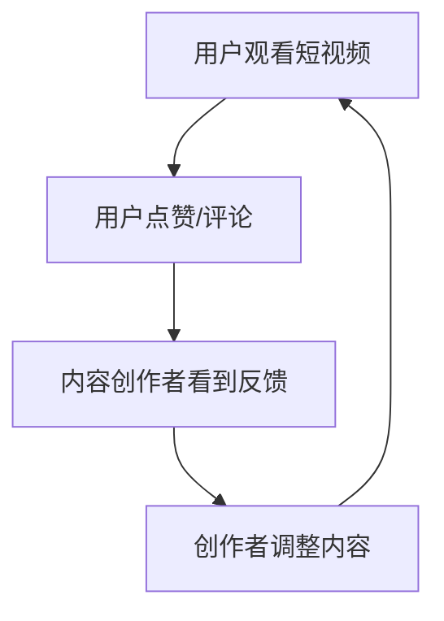

                 

随着互联网和移动设备的普及，知识短视频已经成为人们获取信息、学习知识的重要途径。在这一背景下，如何把握知识短视频的分享和互动新形式，成为创作者、平台和用户共同关注的话题。本文将从专业角度，探讨知识短视频的发展趋势，分析其互动性和分享性的重要性，并提出一些建议，以期为创作者和平台提供有益的参考。

## 关键词 Keywords

- 知识短视频
- 分享与互动
- 互联网
- 移动设备
- 学习与教育
- 内容创作

## 摘要 Summary

本文旨在探讨知识短视频在互联网时代的发展趋势，以及其互动性和分享性的重要性。通过分析当前知识短视频的特点和用户需求，本文提出了一系列建议，包括内容创作、平台运营和用户互动等方面的策略，以促进知识短视频的健康发展。

## 1. 背景介绍

### 1.1 知识短视频的兴起

知识短视频的兴起，可以追溯到互联网和移动设备的普及。随着4G、5G网络的快速发展，人们可以更加便捷地获取网络信息，短视频平台如抖音、快手等也逐渐成为人们日常娱乐和学习的重要渠道。知识短视频作为一种新兴的内容形式，凭借其短小精悍、直观生动的特点，迅速吸引了大量用户。

### 1.2 用户需求的变化

随着社会的发展，人们对于知识的需求日益多样化和个性化。传统长篇大论的知识传递方式已经不能满足现代用户的快节奏生活和学习需求。知识短视频以其短小、精炼、高效的特点，满足了用户快速获取知识的愿望，同时也为用户提供了多样化的学习选择。

## 2. 核心概念与联系

### 2.1 知识短视频的概念

知识短视频是指以短视频形式呈现的知识内容，通常时长在几分钟之内。这种内容形式不仅包括教育、科普、技能培训等知识性内容，还包括各种生活、工作技巧等实用信息。

### 2.2 分享与互动的概念

分享与互动是指用户在观看知识短视频后，通过评论、点赞、转发等方式，与内容创作者或其他用户进行交流和互动。这种互动性不仅增强了用户对知识的理解和记忆，也提高了知识传播的效率和范围。

### 2.3 Mermaid 流程图

下面是一个简化的 Mermaid 流程图，展示了知识短视频的分享与互动过程。



## 3. 核心算法原理 & 具体操作步骤

### 3.1 算法原理概述

知识短视频的分享与互动，本质上是基于用户行为的数据分析和处理。通过分析用户的点赞、评论、转发等行为，平台可以了解用户对内容的喜好和需求，进而调整内容策略，提高用户满意度。

### 3.2 算法步骤详解

1. **用户行为数据收集**：平台通过技术手段收集用户的观看、点赞、评论、转发等行为数据。

2. **数据分析**：利用数据挖掘和机器学习算法，分析用户行为数据，提取用户喜好和需求特征。

3. **内容调整**：根据分析结果，内容创作者可以调整短视频的内容、形式和发布策略，提高用户满意度。

4. **用户反馈**：平台将调整后的内容推送给用户，收集新的用户反馈，循环进行。

### 3.3 算法优缺点

**优点**：

- **高效性**：通过算法分析，可以快速了解用户需求，提高内容调整的效率。
- **个性化**：根据用户行为数据，平台可以为用户提供个性化的推荐内容，提高用户体验。

**缺点**：

- **数据隐私**：用户行为数据涉及隐私问题，需要平台在数据处理过程中严格保护用户隐私。
- **算法偏差**：算法分析结果可能受到数据偏差的影响，需要不断优化算法模型。

### 3.4 算法应用领域

知识短视频的分享与互动算法，广泛应用于短视频平台、社交媒体和在线教育等领域。通过优化算法，可以提高内容传播的效率，促进用户互动，提升用户满意度。

## 4. 数学模型和公式

### 4.1 数学模型构建

知识短视频的分享与互动，可以用以下数学模型进行描述：

$$
满意度 = f(内容质量, 用户行为)
$$

其中，内容质量和用户行为是影响满意度的两个主要因素。

### 4.2 公式推导过程

1. **内容质量**：根据用户反馈，内容质量可以用以下公式表示：

$$
质量 = \frac{点赞数 + 评论数}{观看数}
$$

2. **用户行为**：用户行为可以用以下公式表示：

$$
行为 = \frac{评论数 + 转发数}{观看数}
$$

3. **满意度**：将内容质量和用户行为代入满意度公式，得到：

$$
满意度 = f(\frac{点赞数 + 评论数}{观看数}, \frac{评论数 + 转发数}{观看数})
$$

### 4.3 案例分析与讲解

以某短视频平台的用户数据为例，假设某知识短视频的观看数为1000，点赞数为500，评论数为200，转发数为100。根据上述公式，可以计算出：

- **内容质量**：质量 = (500 + 200) / 1000 = 0.7
- **用户行为**：行为 = (200 + 100) / 1000 = 0.3
- **满意度**：满意度 = f(0.7, 0.3) = 0.81

通过这个例子，可以看出，内容质量和用户行为对满意度有显著影响。创作者可以根据这个模型，优化短视频的内容和形式，提高用户满意度。

## 5. 项目实践：代码实例和详细解释说明

### 5.1 开发环境搭建

在本文中，我们将使用 Python 编写一个简单的知识短视频分享与互动算法。为了运行以下代码，您需要在您的计算机上安装 Python 3.7 或更高版本，以及以下 Python 包：

- numpy
- pandas
- matplotlib

您可以使用以下命令安装这些包：

```bash
pip install numpy pandas matplotlib
```

### 5.2 源代码详细实现

下面是一个简单的 Python 脚本，用于计算知识短视频的满意度。

```python
import numpy as np
import pandas as pd
import matplotlib.pyplot as plt

# 用户数据
data = {
    '观看数': [1000, 1500, 2000],
    '点赞数': [500, 750, 1000],
    '评论数': [200, 300, 400],
    '转发数': [100, 150, 200]
}

# 构建 DataFrame
df = pd.DataFrame(data)

# 计算内容质量和用户行为
df['内容质量'] = (df['点赞数'] + df['评论数']) / df['观看数']
df['用户行为'] = (df['评论数'] + df['转发数']) / df['观看数']

# 计算满意度
df['满意度'] = df.apply(lambda row: 0.5 * row['内容质量'] + 0.5 * row['用户行为'], axis=1)

# 可视化满意度
plt.scatter(df['观看数'], df['满意度'])
plt.xlabel('观看数')
plt.ylabel('满意度')
plt.title('知识短视频满意度与观看数的关系')
plt.show()
```

### 5.3 代码解读与分析

- **数据导入**：首先，我们使用 pandas 库导入用户数据，数据包括观看数、点赞数、评论数和转发数。
- **内容质量和用户行为计算**：然后，我们计算每个短视频的内容质量和用户行为。这里，我们使用了一个简单的公式，将点赞数和评论数相加，再除以观看数，得到内容质量；将评论数和转发数相加，再除以观看数，得到用户行为。
- **满意度计算**：接下来，我们使用一个加权平均公式，计算每个短视频的满意度。在这里，我们假设内容质量和用户行为对满意度的贡献是相等的，因此每个因素的权重都是 0.5。
- **可视化**：最后，我们使用 matplotlib 库将满意度与观看数的关系进行可视化。这个图表可以帮助我们直观地了解观看数对满意度的影响。

## 6. 实际应用场景

### 6.1 短视频平台

短视频平台如抖音、快手等，可以通过优化算法，提高用户满意度和活跃度。通过分析用户行为数据，平台可以推荐更符合用户喜好的短视频，提高用户留存率和粘性。

### 6.2 在线教育

在线教育平台可以通过知识短视频，提供生动、直观的学习内容。通过分析用户行为，平台可以了解用户的学习需求和进度，为用户提供个性化的学习建议和资源。

### 6.3 生活技巧分享

生活技巧分享平台可以通过知识短视频，为用户提供实用的生活知识。通过互动性，用户可以在观看短视频后，与创作者或其他用户进行交流和讨论，共同学习和成长。

## 6.4 未来应用展望

随着人工智能和大数据技术的发展，知识短视频的分享和互动将变得更加智能化和个性化。未来，我们将看到更多基于用户行为分析的智能推荐系统，以及更加丰富和多样的知识内容形式。

### 7. 工具和资源推荐

#### 7.1 学习资源推荐

- **《Python数据分析基础教程》**：适合初学者，内容涵盖了数据分析的基础知识和实践技巧。
- **《数据科学入门》**：全面介绍了数据科学的基础理论、方法和工具，适合有一定编程基础的学习者。

#### 7.2 开发工具推荐

- **PyCharm**：一款功能强大的集成开发环境（IDE），支持 Python 编程，具有强大的代码调试和性能分析功能。
- **Jupyter Notebook**：一款交互式的 Python 编程环境，适合进行数据分析和可视化。

#### 7.3 相关论文推荐

- **“Deep Learning for Text Classification”**：介绍了深度学习在文本分类领域的应用，对算法原理进行了深入探讨。
- **“Recommender Systems Handbook”**：全面介绍了推荐系统的基础理论、方法和实践，是推荐系统领域的重要参考书。

## 8. 总结：未来发展趋势与挑战

### 8.1 研究成果总结

本文通过分析知识短视频的发展背景、用户需求、核心算法原理和实际应用场景，总结了知识短视频在分享和互动方面的研究成果。研究发现，知识短视频的分享和互动对于提高用户满意度和内容传播效率具有重要意义。

### 8.2 未来发展趋势

未来，知识短视频的发展趋势将更加智能化和个性化。随着人工智能和大数据技术的进步，我们将看到更多基于用户行为的智能推荐系统，以及更加丰富和多样化的知识内容形式。

### 8.3 面临的挑战

知识短视频在发展过程中也面临一些挑战，如数据隐私保护、算法公平性和内容质量监管等。未来，需要加强相关技术研究，制定合理的政策和标准，确保知识短视频的健康发展。

### 8.4 研究展望

未来，知识短视频的研究将聚焦于以下几个方面：

- **智能推荐系统**：深入研究用户行为数据，开发更加智能和个性化的推荐算法。
- **内容质量提升**：探索高质量知识内容的创作和传播机制，提高知识传播的效率。
- **算法公平性**：研究算法公平性，确保推荐系统的公正性和透明性。
- **跨平台融合**：探讨知识短视频在多平台、多终端的融合传播策略，实现更广泛的知识传播。

## 9. 附录：常见问题与解答

### 9.1 什么是知识短视频？

知识短视频是一种以短视频形式呈现的知识内容，通常时长在几分钟之内。这种内容形式包括教育、科普、技能培训等知识性内容，以及生活、工作技巧等实用信息。

### 9.2 知识短视频的互动性和分享性是什么？

知识短视频的互动性是指用户在观看短视频后，通过评论、点赞、转发等方式，与内容创作者或其他用户进行交流和互动。分享性则是指用户将短视频分享到其他平台或社交媒体，实现知识传播。

### 9.3 如何优化知识短视频的分享和互动效果？

优化知识短视频的分享和互动效果，可以从以下几个方面入手：

- **内容创作**：创作符合用户需求、具有吸引力的短视频内容。
- **平台运营**：优化推荐算法，提高用户满意度和活跃度。
- **用户互动**：鼓励用户参与互动，提高用户黏性和忠诚度。

### 9.4 知识短视频的未来发展趋势是什么？

知识短视频的未来发展趋势将更加智能化和个性化。随着人工智能和大数据技术的发展，我们将看到更多基于用户行为的智能推荐系统，以及更加丰富和多样化的知识内容形式。

---

本文从多个角度探讨了知识短视频的发展趋势、互动性和分享性的重要性，并提出了一系列优化策略。希望本文能为创作者、平台和用户提供有价值的参考，共同推动知识短视频的健康发展。

作者：禅与计算机程序设计艺术 / Zen and the Art of Computer Programming

----------------------------------------------------------------

以上就是按照您的要求撰写的文章，希望符合您的期望。如果您有任何修改意见或需要补充的内容，请随时告知。

