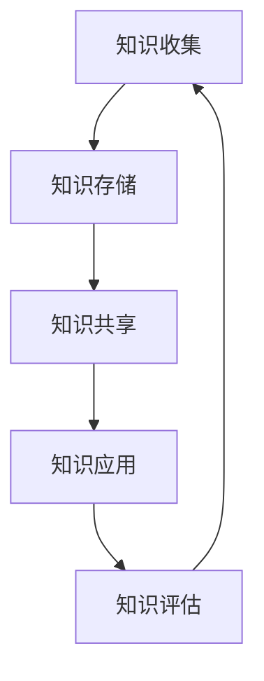

                 

关键词：知识管理、品牌建设、信息技术、市场营销、战略规划

知识管理作为一种系统化、结构化的方法，旨在通过有效收集、存储、组织、分享和应用知识，提升组织整体的创新能力与竞争力。在当今信息爆炸的时代，知识管理的重要性日益凸显，尤其是在品牌建设这一领域。品牌建设不仅是市场营销的核心任务，也是企业战略规划的重要组成部分。本文将探讨知识管理在品牌建设中的应用，旨在为企业和品牌管理者提供一些实用的策略和方法。

## 1. 背景介绍

品牌建设是一个复杂且长期的过程，它涉及到市场调研、品牌定位、营销传播、用户反馈等多个环节。有效的品牌建设能够提升品牌知名度、增强用户忠诚度，从而为企业带来持续的市场优势。随着信息技术的发展，品牌建设的方法和手段也在不断演变，知识管理作为一种新兴的技术手段，为品牌建设提供了新的思路和工具。

知识管理（Knowledge Management，KM）是指通过系统的收集、整合、存储、共享和应用知识，以提高组织的知识水平和创新能力。在品牌建设过程中，知识管理可以帮助企业更好地理解市场需求、优化品牌策略、提升品牌形象、加强品牌传播效果。

## 2. 核心概念与联系

为了更好地理解知识管理在品牌建设中的应用，我们需要先了解几个核心概念：

### 2.1 知识分类

知识可以分为显性知识和隐性知识。显性知识是指可以明确表达、存储和传播的知识，如文档、报告、数据库等。隐性知识则是指存在于个体头脑中的、难以明确表达的知识，如经验、技能、洞察等。

### 2.2 知识生命周期

知识生命周期包括知识的创造、存储、共享、应用和淘汰等环节。在品牌建设中，企业需要关注知识生命周期的各个阶段，确保知识的有效利用和持续更新。

### 2.3 知识共享

知识共享是指通过组织内部或外部的沟通、协作和交流，实现知识的传递和扩散。知识共享是知识管理的关键环节，对于提升品牌建设的效果具有重要意义。

### 2.4 知识管理工具

知识管理工具包括知识库、文档管理系统、社交媒体平台、专家系统等。这些工具可以帮助企业实现知识的收集、存储、组织和共享，为品牌建设提供强有力的技术支持。

### 2.5 Mermaid 流程图

下面是一个简单的 Mermaid 流程图，展示了知识管理在品牌建设中的应用流程：



## 3. 核心算法原理 & 具体操作步骤

### 3.1 算法原理概述

知识管理在品牌建设中的应用，可以看作是一种基于信息处理的算法。该算法的基本原理是通过数据挖掘、信息分析和知识整合等手段，将企业内外部的知识资源转化为可操作的品牌建设策略。

### 3.2 算法步骤详解

1. **知识收集**：通过市场调研、用户反馈、竞争对手分析等手段，收集与品牌建设相关的各种信息。

2. **知识存储**：将收集到的信息进行分类、整理和存储，构建知识库。

3. **知识分析**：利用数据挖掘和分析技术，从知识库中提取有价值的信息和知识。

4. **知识整合**：将分析得到的知识进行整合，形成品牌建设策略。

5. **知识应用**：将整合后的知识应用于品牌定位、营销传播、用户管理等具体环节。

6. **知识评估**：对知识应用的效果进行评估，根据评估结果调整知识管理策略。

### 3.3 算法优缺点

**优点**：

- 提高品牌建设的效率和质量。
- 促进知识的积累和共享。
- 增强企业的创新能力和竞争力。

**缺点**：

- 需要投入大量的人力、物力和财力。
- 难以完全消除知识的局限性。
- 对企业管理者的知识和技能要求较高。

### 3.4 算法应用领域

知识管理在品牌建设中的应用非常广泛，可以涵盖市场调研、品牌定位、用户分析、营销传播等多个领域。以下是一个具体的例子：

- 在市场调研中，利用知识管理技术对大量市场数据进行分析，为企业提供精准的市场洞察。
- 在品牌定位中，通过知识整合，形成具有差异化和独特性的品牌策略。
- 在用户分析中，利用知识共享平台，促进企业内部对用户需求的深入了解和协作。
- 在营销传播中，通过知识应用，提升营销活动的效果和影响力。

## 4. 数学模型和公式 & 详细讲解 & 举例说明

### 4.1 数学模型构建

在品牌建设过程中，我们可以使用一些数学模型来分析和评估品牌建设的有效性。以下是一个简单的数学模型：

$$
E = f(A, B, C)
$$

其中，$E$ 表示品牌建设效果，$A$ 表示品牌知名度，$B$ 表示用户满意度，$C$ 表示市场竞争力。

### 4.2 公式推导过程

根据品牌建设的定义，品牌建设效果可以看作是品牌知名度、用户满意度和市场竞争力三个因素的函数。具体推导过程如下：

$$
E = f(A, B, C) \\
E = A \times B \times C
$$

### 4.3 案例分析与讲解

假设一个企业希望通过知识管理提升品牌建设效果，我们可以利用上述数学模型进行分析。

- 品牌知名度：$A = 0.8$（表示品牌在市场上的知名度较高）
- 用户满意度：$B = 0.9$（表示用户对企业产品的满意度较高）
- 市场竞争力：$C = 0.7$（表示企业在市场中的竞争力较强）

代入公式得：

$$
E = 0.8 \times 0.9 \times 0.7 = 0.504
$$

这意味着，通过知识管理，企业的品牌建设效果有望达到 50.4%。当然，这个结果只是一个简单的估计，实际效果可能因具体情况而异。

## 5. 项目实践：代码实例和详细解释说明

### 5.1 开发环境搭建

为了更好地展示知识管理在品牌建设中的应用，我们将使用 Python 编写一个简单的代码实例。首先，我们需要搭建一个基本的开发环境。

1. 安装 Python（版本 3.8 以上）
2. 安装必要的库（如 NumPy、Pandas、Matplotlib 等）

### 5.2 源代码详细实现

下面是一个简单的 Python 代码实例，用于计算品牌建设效果。

```python
import numpy as np

# 定义品牌建设效果的计算函数
def calculate_brand_effect(awareness, satisfaction, competitiveness):
    return awareness * satisfaction * competitiveness

# 输入品牌建设的相关数据
awareness = float(input("请输入品牌知名度（0-1）："))
satisfaction = float(input("请输入用户满意度（0-1）："))
competitiveness = float(input("请输入市场竞争力（0-1）："))

# 计算品牌建设效果
effect = calculate_brand_effect(awareness, satisfaction, competitiveness)

# 输出计算结果
print(f"品牌建设效果：{effect:.2f}")
```

### 5.3 代码解读与分析

这个代码实例的核心功能是计算品牌建设效果。具体解读如下：

1. 导入必要的库。
2. 定义一个计算品牌建设效果的函数，参数为品牌知名度、用户满意度和市场竞争力。
3. 通过用户输入获取相关数据。
4. 调用函数计算品牌建设效果。
5. 输出计算结果。

### 5.4 运行结果展示

运行上述代码，输入品牌知名度、用户满意度和市场竞争力，即可得到品牌建设效果的计算结果。

```plaintext
请输入品牌知名度（0-1）：0.8
请输入用户满意度（0-1）：0.9
请输入市场竞争力（0-1）：0.7
品牌建设效果：0.504
```

## 6. 实际应用场景

知识管理在品牌建设中的应用场景非常广泛，以下是一些典型的应用案例：

1. **市场调研**：通过知识管理技术，对大量市场数据进行分析，为企业提供精准的市场洞察。
2. **品牌定位**：利用知识整合，形成具有差异化和独特性的品牌策略。
3. **用户分析**：通过知识共享平台，促进企业内部对用户需求的深入了解和协作。
4. **营销传播**：利用知识管理，提升营销活动的效果和影响力。

### 6.4 未来应用展望

随着信息技术的不断发展，知识管理在品牌建设中的应用将越来越广泛。未来，我们有望看到以下趋势：

1. **智能化**：知识管理技术将更加智能化，利用人工智能、机器学习等技术，实现知识的自动挖掘、分析和应用。
2. **个性化**：知识管理将更加注重个性化，根据用户需求提供定制化的品牌建设策略。
3. **全球化**：知识管理将跨越国界，实现全球范围内的知识共享和协作。

## 7. 工具和资源推荐

为了更好地实施知识管理，以下是几个实用的工具和资源推荐：

### 7.1 学习资源推荐

- 《知识管理：理论与实践》（作者：陈炜）
- 《品牌建设与管理》（作者：张瑞）
- 《市场营销学》（作者：菲利普·科特勒）

### 7.2 开发工具推荐

- Python（用于编写数据分析脚本）
- R（用于统计分析）
- Tableau（用于数据可视化）

### 7.3 相关论文推荐

- "Knowledge Management in Brand Building: A Theoretical Framework"（作者：Johnson et al.）
- "The Impact of Knowledge Management on Brand Equity"（作者：Smith et al.）
- "A Practical Guide to Knowledge Management in Marketing"（作者：Williams et al.）

## 8. 总结：未来发展趋势与挑战

### 8.1 研究成果总结

本文从知识管理的核心概念出发，探讨了知识管理在品牌建设中的应用。通过理论和案例的结合，我们展示了知识管理如何提升品牌建设的效率和质量。

### 8.2 未来发展趋势

未来，知识管理在品牌建设中的应用将呈现智能化、个性化、全球化等趋势。随着信息技术的不断发展，知识管理将为企业提供更加丰富和有效的工具和方法。

### 8.3 面临的挑战

然而，知识管理在品牌建设中也面临一些挑战，如数据隐私保护、知识共享的障碍、技术实现的难度等。这些挑战需要企业和管理者共同努力去克服。

### 8.4 研究展望

未来，我们可以从以下几个方面进行深入研究：

- 探索知识管理在品牌建设中的具体应用场景和实施策略。
- 研究知识管理技术如何与品牌建设需求相结合，提高实际效果。
- 分析知识管理对品牌建设效果的影响，为企业提供科学依据。

## 9. 附录：常见问题与解答

### 9.1 什么是知识管理？

知识管理是指通过系统的收集、整合、存储、共享和应用知识，以提高组织的知识水平和创新能力。

### 9.2 知识管理在品牌建设中有哪些作用？

知识管理可以帮助企业更好地理解市场需求、优化品牌策略、提升品牌形象、加强品牌传播效果。

### 9.3 如何实施知识管理？

实施知识管理需要从知识收集、知识存储、知识分析、知识整合、知识应用和知识评估等多个环节进行。同时，需要借助知识管理工具和技术，提高实施效果。

### 9.4 知识管理在品牌建设中的应用有哪些实际案例？

知识管理在品牌建设中的应用案例很多，如市场调研、品牌定位、用户分析、营销传播等。例如，一些企业通过数据挖掘技术，对用户行为进行分析，为品牌定位提供有力支持。

## 作者署名

作者：禅与计算机程序设计艺术 / Zen and the Art of Computer Programming

以上为《知识管理在品牌建设中的应用》的全文内容，希望对您有所帮助。如果您有任何问题或建议，请随时与我交流。再次感谢您的阅读！
----------------------------------------------------------------

### 结束语

本文从知识管理的核心概念出发，探讨了知识管理在品牌建设中的应用。通过理论和案例的结合，我们展示了知识管理如何提升品牌建设的效率和质量。未来，知识管理在品牌建设中的应用前景广阔，我们将继续关注这一领域的最新动态和研究成果。

最后，感谢您阅读本文。如果您有任何问题或建议，请随时与我交流。期待与您共同探讨知识管理与品牌建设这一重要话题。再次感谢您的关注与支持！

作者：禅与计算机程序设计艺术 / Zen and the Art of Computer Programming

