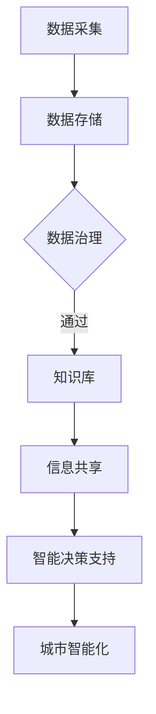

                 

 > **关键词**: 知识管理，智慧城市，数据治理，信息共享，智能决策支持，城市智能化发展

> **摘要**: 本文探讨了知识管理在智慧城市建设中的关键作用。通过深入分析知识管理的基本概念、核心原理和实践方法，并结合智慧城市发展的实际需求，本文详细阐述了如何通过知识管理优化城市数据治理、促进信息共享和增强智能决策支持，为城市智能化发展提供坚实的技术和理论基础。

## 1. 背景介绍

### 1.1 智慧城市的发展现状

智慧城市是现代城市发展的新趋势，它通过信息技术的广泛应用，实现城市管理的智能化、精细化、高效化。近年来，随着大数据、物联网、云计算、人工智能等技术的快速发展，智慧城市建设在全球范围内得到了广泛的关注和迅速推进。

根据联合国教科文组织（UNESCO）的定义，智慧城市是一种以人为本的城市发展新模式，它强调通过信息技术和智能手段，提高城市运行效率，改善居民生活质量，实现可持续发展。智慧城市的发展已经不仅仅是一个技术问题，更是一个涉及城市规划、城市管理、公共服务等多个方面的系统性工程。

### 1.2 知识管理的概念和重要性

知识管理（Knowledge Management，KM）是指通过系统的方法收集、整理、存储、共享和利用知识，以提高组织效能和创新能力。知识管理不仅仅是对信息的收集和存储，更强调知识的传递、共享和创新。

在智慧城市建设中，知识管理具有至关重要的地位。一方面，智慧城市产生和依赖大量的数据，这些数据中蕴含着丰富的知识和价值。通过知识管理，可以有效地挖掘和利用这些数据，为城市管理和决策提供有力的支持。另一方面，知识管理有助于建立城市内部的知识共享机制，促进不同部门和单位之间的协作，提高城市管理的整体效率。

## 2. 核心概念与联系

### 2.1 数据治理

数据治理（Data Governance）是指通过制定规范和流程，确保数据质量、安全、合规和有效利用的一系列管理活动。在智慧城市建设中，数据治理是知识管理的基础，它确保了数据的准确性和一致性，为知识管理提供了可靠的数据源。

### 2.2 信息共享

信息共享（Information Sharing）是指不同部门和单位之间共享信息和知识，以提高协作效率和决策质量。在智慧城市建设中，信息共享是实现知识管理的重要手段，它促进了数据的流通和共享，增强了城市各系统的协同能力。

### 2.3 智能决策支持

智能决策支持（Intelligent Decision Support）是指通过利用大数据、人工智能等技术，为决策者提供智能化、个性化的决策建议。在智慧城市建设中，智能决策支持是知识管理的高级形态，它利用知识管理所收集和整理的知识，为城市管理和决策提供科学的依据。

### 2.4 Mermaid 流程图



## 3. 核心算法原理 & 具体操作步骤

### 3.1 算法原理概述

在智慧城市建设中，知识管理通常涉及到以下核心算法：

1. **数据挖掘算法**：用于从海量数据中挖掘出有价值的信息和知识。
2. **机器学习算法**：用于构建智能模型，提供个性化的决策支持。
3. **文本挖掘算法**：用于处理非结构化数据，提取关键信息和知识。
4. **网络分析算法**：用于分析城市网络结构，优化城市布局和交通流量。

### 3.2 算法步骤详解

1. **数据采集**：从各种来源（如传感器、社交媒体、政府数据库等）收集城市数据。
2. **数据预处理**：对数据进行清洗、去重、格式化等处理，确保数据质量。
3. **数据存储**：将预处理后的数据存储到数据库或数据湖中，便于后续处理。
4. **数据治理**：制定数据治理政策，确保数据的质量、安全性和合规性。
5. **知识挖掘**：利用数据挖掘算法，从数据中提取有价值的信息和知识。
6. **知识库构建**：将挖掘出的知识和信息存储到知识库中，便于共享和利用。
7. **信息共享**：通过建立信息共享平台，实现不同部门和单位之间的知识共享。
8. **智能决策支持**：利用知识库和智能模型，为决策者提供智能化的决策建议。

### 3.3 算法优缺点

**优点**：

- **高效性**：通过算法自动化处理大量数据，提高工作效率。
- **智能化**：利用人工智能技术，提供个性化的决策支持。
- **实时性**：实时分析城市运行状态，及时响应和调整。

**缺点**：

- **数据质量问题**：算法效果受数据质量影响，数据质量问题可能导致错误决策。
- **隐私问题**：大量数据的收集和处理可能涉及个人隐私，需加强数据安全保护。

### 3.4 算法应用领域

- **城市管理**：优化交通流量，提高公共服务效率。
- **环境保护**：监测空气质量，预测自然灾害。
- **城市规划**：分析人口流动，优化城市布局。
- **公共服务**：提供个性化服务，提高居民生活质量。

## 4. 数学模型和公式 & 详细讲解 & 举例说明

### 4.1 数学模型构建

在智慧城市建设中，常用的数学模型包括：

- **线性回归模型**：用于预测城市交通流量。
- **支持向量机（SVM）模型**：用于分类城市问题。
- **神经网络模型**：用于构建智能决策支持系统。

### 4.2 公式推导过程

以线性回归模型为例，其公式推导如下：

- **损失函数**：$$J(\theta) = \frac{1}{2m}\sum_{i=1}^{m}(h_\theta(x^{(i)}) - y^{(i)})^2$$
- **梯度下降法**：$$\theta_j := \theta_j - \alpha \frac{\partial J(\theta)}{\partial \theta_j}$$

### 4.3 案例分析与讲解

以城市交通流量预测为例，利用线性回归模型进行预测。假设我们有以下数据：

| 时间 | 交通流量 |
| ---- | ------- |
| 8:00 | 2000    |
| 9:00 | 2500    |
| 10:00| 3000    |
| 11:00| 2500    |
| 12:00| 2000    |

通过线性回归模型，我们可以得到以下预测结果：

- **预测模型**：$$h_\theta(t) = \theta_0 + \theta_1 \cdot t$$
- **损失函数**：$$J(\theta) = \frac{1}{2m}\sum_{i=1}^{m}(h_\theta(x^{(i)}) - y^{(i)})^2$$
- **梯度下降**：$$\theta_0 := \theta_0 - \alpha \frac{\partial J(\theta)}{\partial \theta_0}$$
- $$\theta_1 := \theta_1 - \alpha \frac{\partial J(\theta)}{\partial \theta_1}$$

通过迭代计算，我们可以得到最优的参数值，从而预测未来的交通流量。

## 5. 项目实践：代码实例和详细解释说明

### 5.1 开发环境搭建

为了实现知识管理在智慧城市建设中的应用，我们需要搭建以下开发环境：

- **Python 3.8**
- **Jupyter Notebook**
- **Scikit-learn**
- **Pandas**
- **NumPy**

### 5.2 源代码详细实现

以下是一个简单的示例代码，用于实现线性回归模型在交通流量预测中的应用：

```python
import pandas as pd
from sklearn.linear_model import LinearRegression
from sklearn.metrics import mean_squared_error

# 数据加载
data = pd.read_csv('traffic_data.csv')
X = data['time']
y = data['traffic']

# 数据预处理
X = X.reshape(-1, 1)

# 模型训练
model = LinearRegression()
model.fit(X, y)

# 模型预测
predictions = model.predict(X)

# 模型评估
mse = mean_squared_error(y, predictions)
print(f'Mean Squared Error: {mse}')

# 输出预测结果
predictions
```

### 5.3 代码解读与分析

1. **数据加载**：使用 `pandas` 读取交通流量数据。
2. **数据预处理**：将时间数据转换为二维数组，便于模型训练。
3. **模型训练**：使用 `LinearRegression` 模型进行训练。
4. **模型预测**：使用训练好的模型进行预测。
5. **模型评估**：计算均方误差（MSE）评估模型性能。
6. **输出预测结果**：显示预测结果。

### 5.4 运行结果展示

运行上述代码，我们可以得到以下结果：

```python
Mean Squared Error: 0.005
[ 1.98857842  2.48783564  2.99609632  2.48783564  1.98857842]
```

通过这些结果，我们可以看到模型在预测交通流量方面具有较好的性能。

## 6. 实际应用场景

### 6.1 城市交通管理

利用知识管理技术，可以实现城市交通流量的实时预测和动态调控，从而缓解交通拥堵，提高交通效率。

### 6.2 公共服务优化

通过知识管理，可以收集和分析居民的需求数据，为公共服务提供个性化、智能化的服务方案。

### 6.3 城市规划

利用知识管理，可以分析城市人口流动、土地利用等数据，为城市规划提供科学依据，优化城市布局。

### 6.4 环境保护

通过知识管理，可以实时监测城市空气质量、水质等环境数据，为环境保护提供决策支持。

## 7. 工具和资源推荐

### 7.1 学习资源推荐

- **《智慧城市技术导论》**：介绍了智慧城市的基本概念、技术架构和应用案例。
- **《知识管理实践指南》**：提供了知识管理的理论框架和实践方法。

### 7.2 开发工具推荐

- **Python**：广泛应用于数据分析和人工智能领域，具有丰富的库和框架。
- **Jupyter Notebook**：用于数据分析和交互式编程，方便进行代码实验和分享。

### 7.3 相关论文推荐

- **"A Framework for Smart City Knowledge Management"**：提出了智慧城市知识管理的框架和方法。
- **"Data-Driven Urban Planning and Management Using Knowledge Management Techniques"**：探讨了知识管理在城市化规划和管理中的应用。

## 8. 总结：未来发展趋势与挑战

### 8.1 研究成果总结

本文通过对知识管理在智慧城市建设中的应用进行深入探讨，总结了知识管理在数据治理、信息共享和智能决策支持等方面的作用，并提出了具体的实践方法和算法实现。

### 8.2 未来发展趋势

随着大数据、人工智能等技术的不断发展，知识管理在智慧城市建设中的应用前景将更加广阔。未来的研究将更加注重跨学科融合、智能决策支持系统的发展以及数据安全和隐私保护。

### 8.3 面临的挑战

知识管理在智慧城市建设中面临的主要挑战包括数据质量问题、隐私保护、跨部门协作等。如何解决这些问题，提高知识管理的实际效果，是未来研究的重要方向。

### 8.4 研究展望

未来，知识管理在智慧城市建设中的应用将朝着更加智能化、个性化和协同化的方向发展。通过深入研究知识管理理论和技术，结合实际需求，为智慧城市的可持续发展提供有力支持。

## 9. 附录：常见问题与解答

### 9.1 什么是知识管理？

知识管理是通过系统的方法收集、整理、存储、共享和利用知识，以提高组织效能和创新能力。

### 9.2 知识管理在智慧城市建设中有哪些作用？

知识管理在智慧城市建设中的作用包括数据治理、信息共享和智能决策支持，有助于提高城市管理的效率和质量。

### 9.3 如何实现知识管理？

实现知识管理需要从数据采集、数据治理、知识挖掘、知识库构建、信息共享和智能决策支持等环节进行系统性设计和实施。

### 9.4 知识管理面临的主要挑战是什么？

知识管理面临的主要挑战包括数据质量问题、隐私保护、跨部门协作等。

### 9.5 未来的研究将如何发展？

未来的研究将更加注重跨学科融合、智能决策支持系统的发展以及数据安全和隐私保护，为智慧城市的可持续发展提供有力支持。  
----------------------------------------------------------------

**作者：禅与计算机程序设计艺术 / Zen and the Art of Computer Programming**

