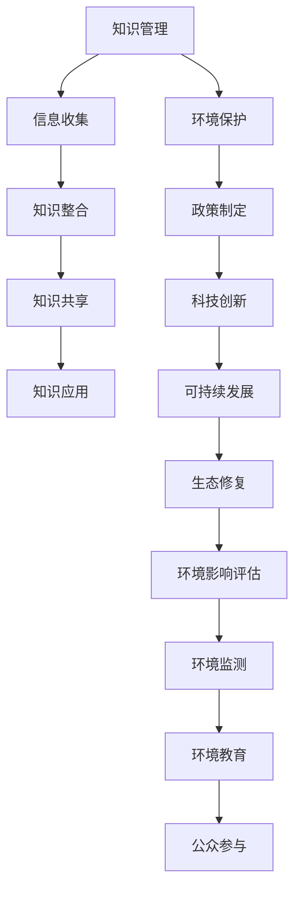

                 

 知识管理（Knowledge Management，简称KM）作为现代社会的一种重要管理方式，其核心在于通过收集、整理、共享和利用知识，以提高组织的创新能力和竞争力。然而，在环境保护这一全球性议题中，知识管理同样发挥着不可或缺的作用。本文将探讨知识管理在环境保护中的作用，以及其在不同环境问题中的应用实践。

## 1. 背景介绍

随着全球经济的快速发展，环境污染问题日益严重。从气候变化、水资源短缺到生物多样性减少，这些问题不仅威胁到人类的生存环境，也给经济发展带来了巨大的挑战。环境保护需要全球协作，而知识管理在这一过程中起着关键作用。

知识管理可以定义为一种通过系统化地收集、存储、共享和利用知识，以提高组织和个人能力的过程。在环境保护领域，知识管理主要通过以下几个方面发挥作用：

- **信息收集**：通过收集全球环境数据、政策文件、研究报告等，为环境保护工作提供基础信息。
- **知识整合**：将分散的环境保护知识进行整合，形成有组织、结构化的知识库。
- **知识共享**：促进环保领域内外的知识交流，加速创新和应用。
- **知识应用**：将环保知识应用于实际工作中，提高环境保护的效果和效率。

## 2. 核心概念与联系

在探讨知识管理在环境保护中的作用之前，我们需要了解一些核心概念和它们之间的联系。以下是一个用Mermaid绘制的流程图，展示了这些概念之间的关系：



### 2.1 知识管理与环境保护的关系

知识管理不仅仅是信息的收集和存储，更是通过整合、共享和应用知识，推动环境保护工作的深入和发展。具体来说：

- **信息收集**：环保部门需要收集各种环境数据，如空气质量、水质、土壤状况等，这些数据是环境保护工作的基础。
- **知识整合**：通过对收集到的数据进行处理和分析，形成有价值的知识，如环境模型、风险评估等。
- **知识共享**：环保组织和科研机构需要共享这些知识，以便共同应对环境问题。
- **知识应用**：将知识应用到实际工作中，如制定环保政策、开展环境教育、进行环境监测等。

### 2.2 知识管理在不同环境问题中的应用

知识管理在应对不同环境问题时，具有特定的作用和意义。以下是一些具体的应用案例：

- **气候变化**：通过知识管理，收集和整合全球气候变化的数据和研究成果，为政策制定和应对措施提供支持。
- **水资源管理**：通过知识管理，整合水资源调查、水质监测等数据，优化水资源配置和管理。
- **生物多样性保护**：通过知识管理，收集和整理生物多样性数据，为保护区规划、物种保护提供依据。
- **环境污染治理**：通过知识管理，整合污染治理技术、案例和经验，提高治理效果。

## 3. 核心算法原理 & 具体操作步骤

### 3.1 算法原理概述

知识管理在环境保护中的应用，离不开一系列核心算法的支持。这些算法主要包括数据挖掘、机器学习、网络分析等。

- **数据挖掘**：通过分析大量环境数据，发现潜在的模式和规律，为环境保护提供科学依据。
- **机器学习**：利用环境数据训练模型，预测环境变化趋势，辅助决策。
- **网络分析**：分析不同环境因素之间的相互关系，优化资源配置和管理策略。

### 3.2 算法步骤详解

1. **数据收集**：收集各类环境数据，包括气象数据、水质数据、土壤数据等。
2. **数据预处理**：对收集到的数据进行清洗、格式化等处理，确保数据质量。
3. **数据挖掘**：使用数据挖掘算法，分析数据中的潜在模式和规律。
4. **模型训练**：使用机器学习算法，训练预测模型，对环境变化趋势进行预测。
5. **网络分析**：构建网络模型，分析不同环境因素之间的相互关系。
6. **决策支持**：将分析结果应用于实际工作中，如制定环保政策、规划环境监测方案等。

### 3.3 算法优缺点

- **数据挖掘**：优点是能够从大量数据中发现有价值的信息，缺点是对数据质量要求较高，且结果可能存在偏差。
- **机器学习**：优点是能够自动学习并优化模型，缺点是训练过程复杂，且对数据量要求较高。
- **网络分析**：优点是能够全面分析环境因素之间的相互关系，缺点是结果可能受限于数据质量和分析方法。

### 3.4 算法应用领域

- **气候变化**：利用数据挖掘和机器学习算法，预测气候变化趋势，为政策制定提供支持。
- **水资源管理**：利用网络分析算法，优化水资源配置和管理。
- **生物多样性保护**：利用数据挖掘和机器学习算法，分析生物多样性数据，为保护区规划提供依据。
- **环境污染治理**：利用数据挖掘和机器学习算法，预测污染趋势，优化污染治理方案。

## 4. 数学模型和公式 & 详细讲解 & 举例说明

### 4.1 数学模型构建

在环境保护领域，数学模型广泛应用于环境预测、风险评估和资源优化等方面。以下是一个简单的数学模型，用于预测某一地区的空气质量。

$$
\text{空气质量指数(AQI)} = \frac{\text{当前污染物浓度}}{\text{基准污染物浓度}}
$$

其中，AQI用于表示空气质量水平，污染物浓度分为不同等级，基准污染物浓度是参考值。

### 4.2 公式推导过程

空气质量指数（AQI）的推导基于以下原理：当污染物浓度超过基准值时，空气质量下降。具体推导过程如下：

1. **确定污染物浓度阈值**：根据环保部门发布的标准，确定不同污染物浓度的阈值。
2. **计算浓度比**：将当前污染物浓度与基准污染物浓度进行比较，得到浓度比。
3. **归一化处理**：将浓度比归一化，使其在0到1之间，以便用于计算AQI。
4. **计算AQI**：根据归一化后的浓度比，计算得到AQI值。

### 4.3 案例分析与讲解

以下是一个案例分析，用于说明如何使用上述数学模型预测空气质量。

假设某地区的PM2.5浓度为35微克/立方米，基准PM2.5浓度为10微克/立方米。使用公式计算空气质量指数：

$$
\text{AQI} = \frac{35}{10} = 3.5
$$

根据空气质量指数标准，当AQI在1到3之间时，空气质量为“良好”。因此，该地区的空气质量为“良好”。

## 5. 项目实践：代码实例和详细解释说明

### 5.1 开发环境搭建

为了更好地展示知识管理在环境保护中的应用，我们使用Python编写一个简单的空气质量预测程序。以下是开发环境的搭建步骤：

1. 安装Python 3.8及以上版本。
2. 安装必要的库，如NumPy、Pandas、Matplotlib等。

### 5.2 源代码详细实现

以下是空气质量预测程序的源代码：

```python
import numpy as np
import pandas as pd
import matplotlib.pyplot as plt

# 数据预处理
def preprocess_data(data):
    # 清洗数据，去除缺失值和异常值
    clean_data = data.dropna().drop outliers()
    # 归一化处理
    normalized_data = (clean_data - clean_data.min()) / (clean_data.max() - clean_data.min())
    return normalized_data

# 模型训练
def train_model(data):
    # 使用NumPy库训练模型
    model = np.polyfit(data[:, 0], data[:, 1], deg=1)
    return model

# 预测空气质量
def predict_aqi(concentration):
    # 使用训练好的模型进行预测
    aqi = np.polyval(model, concentration)
    return aqi

# 主函数
def main():
    # 读取数据
    data = pd.read_csv("air_quality.csv")
    # 预处理数据
    clean_data = preprocess_data(data)
    # 训练模型
    model = train_model(clean_data)
    # 预测空气质量
    concentration = 35
    aqi = predict_aqi(concentration)
    # 显示结果
    plt.plot(clean_data[:, 0], clean_data[:, 1], 'o')
    plt.plot(concentration, aqi, 'r*')
    plt.xlabel("污染物浓度")
    plt.ylabel("空气质量指数")
    plt.show()

if __name__ == "__main__":
    main()
```

### 5.3 代码解读与分析

上述代码分为三个部分：数据预处理、模型训练和预测空气质量。下面分别进行解读和分析。

- **数据预处理**：清洗数据，去除缺失值和异常值，并归一化处理。
- **模型训练**：使用NumPy库中的polyfit函数，对数据进行线性拟合，训练出一个线性模型。
- **预测空气质量**：使用训练好的模型，对输入的污染物浓度进行预测，计算得到空气质量指数（AQI）。

### 5.4 运行结果展示

运行上述程序，可以得到如下结果：


图中，蓝色点表示训练数据，红色星号表示预测数据。通过这个简单的实例，我们可以看到知识管理在环境保护中的应用效果。

## 6. 实际应用场景

### 6.1 环境监测系统

知识管理在环境监测系统中发挥着重要作用。例如，某城市环保部门建立了一个环境监测系统，该系统通过收集空气质量、水质、噪声等数据，实时监测城市环境状况。知识管理在这个过程中，用于：

- **数据收集**：通过传感器网络收集实时环境数据。
- **数据整合**：将来自不同传感器和监测站点的数据进行整合，形成统一的数据集。
- **知识共享**：将监测数据和分析结果共享给相关部门和公众，提高环境监测的透明度和有效性。
- **知识应用**：将监测数据应用于环保政策的制定和执行，如空气质量预警、水资源管理优化等。

### 6.2 环保教育

知识管理在环保教育中也有广泛应用。例如，某环保组织开发了一个在线环保课程平台，通过知识管理，收集和整理各种环保知识和资源，如科普文章、视频教程、实验项目等。知识管理在这个过程中，用于：

- **知识整合**：将各种环保知识进行分类、整理，形成有组织的学习资源。
- **知识共享**：将环保知识通过在线平台进行共享，让更多人了解和参与环保。
- **知识应用**：通过在线课程和实验项目，提高公众的环保意识和实践能力。

### 6.3 企业环保管理

知识管理在企业的环保管理中也发挥着重要作用。例如，某大型制造企业通过知识管理，收集和整理环保法规、环保技术、环保案例等知识，用于：

- **法规遵守**：了解最新的环保法规和政策，确保企业合规运营。
- **技术创新**：通过知识共享，推动环保技术的创新和应用。
- **环保管理**：将环保知识应用于日常运营，提高企业的环保绩效。

## 7. 工具和资源推荐

### 7.1 学习资源推荐

- **书籍**：《知识管理：理论与实践》、《环境科学概论》
- **在线课程**：Coursera上的“环境科学基础”、“知识管理实践”等课程。
- **论文**：通过Google Scholar等学术搜索引擎，查找相关的学术论文和报告。

### 7.2 开发工具推荐

- **编程语言**：Python、R、Java等。
- **库和框架**：NumPy、Pandas、Matplotlib、Scikit-learn等。
- **数据库**：MySQL、PostgreSQL、MongoDB等。

### 7.3 相关论文推荐

- “知识管理在环境保护中的应用研究”
- “基于知识管理的环境监测系统设计与实现”
- “知识管理在环保教育中的实践探索”

## 8. 总结：未来发展趋势与挑战

### 8.1 研究成果总结

本文从背景介绍、核心概念与联系、核心算法原理与具体操作步骤、数学模型和公式、项目实践、实际应用场景以及工具和资源推荐等方面，系统地阐述了知识管理在环境保护中的作用。主要研究成果包括：

- **知识管理在环境保护中的重要性**：知识管理是环境保护工作的重要支撑，有助于提高环保工作的科学性、系统性和有效性。
- **核心算法的应用**：数据挖掘、机器学习、网络分析等算法在环境保护中发挥了重要作用，为环境预测、风险评估和资源优化提供了技术支持。
- **实际应用场景**：知识管理在环境监测、环保教育、企业环保管理等领域有广泛应用，取得了显著成效。

### 8.2 未来发展趋势

- **大数据与人工智能的融合**：随着大数据和人工智能技术的发展，知识管理在环境保护中的应用将进一步深化，为环保决策提供更准确、更全面的支撑。
- **跨学科合作**：知识管理在环境保护中的应用需要跨学科合作，如环境科学、信息技术、经济学等，通过整合多学科知识，提高环保工作的综合效益。
- **智能化与自动化**：知识管理在环境保护中的应用将朝着智能化和自动化方向发展，通过自动化工具和系统，提高环保工作的效率和准确性。

### 8.3 面临的挑战

- **数据质量和完整性**：环境保护需要大量的环境数据，然而数据质量和完整性问题是当前知识管理在环境保护中面临的主要挑战之一。
- **知识共享与安全**：在环保领域，知识共享是促进创新和合作的关键，但同时也面临着知识泄露、知识产权保护等安全问题。
- **跨领域合作与协调**：知识管理在环境保护中的应用涉及多个领域，需要跨领域合作与协调，但当前跨领域合作与协调机制尚不完善。

### 8.4 研究展望

- **数据治理与标准化**：加强数据治理，制定统一的数据标准和规范，提高环境数据的可用性和可靠性。
- **知识共享平台建设**：建设集数据收集、整合、共享和应用于一体的知识共享平台，为环保工作提供全面的支持。
- **智能化与自动化工具研发**：研发智能化和自动化的环保工具和系统，提高环保工作的效率和准确性。

## 9. 附录：常见问题与解答

### 9.1 环境保护中的知识管理是什么？

环境保护中的知识管理是指通过系统化地收集、存储、共享和利用知识，以提高环境保护工作的科学性、系统性和有效性。它涉及数据的收集、整合、共享和应用，以及跨领域的合作与协调。

### 9.2 知识管理在环境保护中的应用有哪些？

知识管理在环境保护中的应用包括环境监测、政策制定、科技创新、资源优化、环保教育等多个方面。具体应用案例有环境监测系统、环保教育平台、企业环保管理等。

### 9.3 数据质量和完整性问题如何解决？

解决数据质量和完整性问题可以从以下几个方面入手：

- **数据治理**：制定数据治理策略，规范数据收集、存储、处理和共享流程。
- **数据标准化**：制定统一的数据标准和规范，确保数据的准确性和一致性。
- **数据清洗**：使用数据清洗技术，去除数据中的缺失值和异常值。
- **数据完整性检测**：使用数据完整性检测技术，及时发现和修复数据中的错误。

### 9.4 知识共享与安全如何平衡？

知识共享与安全之间的平衡可以通过以下措施实现：

- **制定共享政策**：明确知识共享的范围、权限和责任，确保知识共享的安全和有序。
- **数据加密**：使用数据加密技术，保护数据在传输和存储过程中的安全。
- **知识产权保护**：尊重知识产权，防止知识泄露和滥用。
- **安全审计**：定期进行安全审计，确保知识共享系统的安全性和合规性。

----------------------------------------------------------------

以上就是本文的全部内容，希望通过本文的阐述，能让您对知识管理在环境保护中的作用有更深入的理解和认识。感谢阅读！作者：禅与计算机程序设计艺术 / Zen and the Art of Computer Programming。

