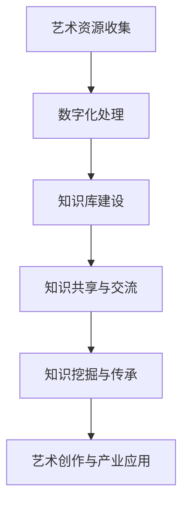

                 

 在当今快速发展的信息化社会中，知识管理已经成为各个行业的重要议题。艺术领域也不例外，随着数字化、网络化进程的不断推进，知识管理在艺术领域的实践越来越受到关注。本文将从艺术领域的知识管理背景、核心概念、算法原理、数学模型、项目实践、实际应用场景、工具和资源推荐以及未来发展趋势等方面进行探讨，旨在为艺术领域知识管理的研究与实践提供有益的参考。

## 1. 背景介绍

### 1.1 艺术领域的知识管理现状

艺术领域是一个复杂且多元化的领域，涵盖了绘画、雕塑、音乐、戏剧、文学等多个方面。长期以来，艺术领域的知识主要依赖于个人的经验、直觉和传统传承方式。随着时代的发展，尤其是数字技术的广泛应用，艺术领域也逐渐认识到知识管理的重要性。知识管理在艺术领域的实践主要体现在以下几个方面：

- **数字化艺术资源的收集与整合**：利用现代信息技术，将各种艺术资源进行数字化处理，便于存储、共享和传播。

- **艺术知识的分类与组织**：通过对艺术知识的分类与组织，提高艺术知识的可检索性和利用率。

- **艺术知识的共享与交流**：通过建立艺术知识共享平台，促进艺术家、艺术爱好者之间的交流与合作。

- **艺术人才的培养与选拔**：利用知识管理技术，对艺术人才进行科学评估和选拔，提高艺术教育的质量和效率。

### 1.2 知识管理在艺术领域的意义

知识管理在艺术领域的意义主要体现在以下几个方面：

- **提升艺术创作水平**：通过知识管理，艺术家可以更方便地获取相关领域的知识，提高创作水平。

- **促进艺术产业发展**：知识管理有助于艺术产业的转型升级，提高产业附加值。

- **增强文化软实力**：知识管理可以更好地保护和传承文化遗产，增强国家文化软实力。

- **推动社会进步**：艺术作为一种文化形式，对社会的进步和人类的精神生活具有重要影响，知识管理有助于更好地发挥这一作用。

## 2. 核心概念与联系

### 2.1 核心概念

在艺术领域的知识管理中，涉及到的核心概念包括：

- **艺术资源**：指各种与艺术相关的信息、资料、作品等。

- **知识库**：指存储和管理艺术知识的数据系统。

- **知识共享**：指艺术家、艺术爱好者之间通过平台、社区等形式进行艺术知识的交流与共享。

- **知识挖掘**：指从大量艺术资源中提取有用知识的过程。

- **知识传承**：指将艺术知识通过教育、传承等方式传递给下一代。

### 2.2 Mermaid 流程图

以下是一个简化的Mermaid流程图，展示艺术领域知识管理的主要流程：



## 3. 核心算法原理 & 具体操作步骤

### 3.1 算法原理概述

在艺术领域的知识管理中，常用的算法包括：

- **聚类算法**：用于对艺术资源进行分类和聚类，提高知识检索效率。

- **关联规则挖掘**：用于发现艺术资源之间的关联关系，为知识共享提供依据。

- **文本分类算法**：用于对艺术文本进行分类，便于知识组织与管理。

- **推荐系统**：用于根据用户兴趣和行为推荐相关艺术资源。

### 3.2 算法步骤详解

#### 3.2.1 聚类算法

1. 数据预处理：对艺术资源进行数据清洗和预处理，确保数据质量。

2. 特征提取：从艺术资源中提取特征向量，用于后续聚类分析。

3. 聚类算法选择：根据艺术资源的特点，选择合适的聚类算法，如K-means、层次聚类等。

4. 聚类结果评估：对聚类结果进行评估，确保聚类效果良好。

#### 3.2.2 关联规则挖掘

1. 数据预处理：对艺术资源进行数据清洗和预处理，确保数据质量。

2. 构建关联规则挖掘模型：根据艺术资源的特点，选择合适的关联规则挖掘算法，如Apriori算法、FP-growth算法等。

3. 挖掘关联规则：从艺术资源中挖掘出满足最小支持度和最小置信度的关联规则。

4. 关联规则评估：对挖掘出的关联规则进行评估，确保规则的有效性。

#### 3.2.3 文本分类算法

1. 数据预处理：对艺术文本进行数据清洗和预处理，确保数据质量。

2. 特征提取：从艺术文本中提取特征向量，用于后续分类分析。

3. 分类算法选择：根据艺术文本的特点，选择合适的分类算法，如朴素贝叶斯、支持向量机等。

4. 分类结果评估：对分类结果进行评估，确保分类效果良好。

#### 3.2.4 推荐系统

1. 用户行为数据收集：收集用户在艺术资源平台上的行为数据，如浏览记录、收藏、点赞等。

2. 用户特征提取：从用户行为数据中提取用户特征向量。

3. 推荐算法选择：根据用户特征和艺术资源的特点，选择合适的推荐算法，如基于内容的推荐、协同过滤等。

4. 推荐结果评估：对推荐结果进行评估，确保推荐效果良好。

### 3.3 算法优缺点

- **聚类算法**：优点是能够对艺术资源进行有效分类和聚类，提高知识检索效率；缺点是对于初始聚类中心的选取敏感，聚类效果容易受到影响。

- **关联规则挖掘**：优点是能够发现艺术资源之间的关联关系，为知识共享提供依据；缺点是对于大数据集的挖掘效率较低，规则评估过程较为复杂。

- **文本分类算法**：优点是能够对艺术文本进行有效分类，便于知识组织与管理；缺点是对于文本数据的理解能力有限，分类效果容易受到影响。

- **推荐系统**：优点是能够为用户提供个性化推荐，提高用户体验；缺点是对于用户行为数据的依赖性较高，推荐效果容易受到影响。

### 3.4 算法应用领域

- **艺术资源分类**：利用聚类算法对艺术资源进行分类，提高知识检索效率。

- **知识关联挖掘**：利用关联规则挖掘算法发现艺术资源之间的关联关系，为知识共享提供依据。

- **艺术文本分类**：利用文本分类算法对艺术文本进行分类，便于知识组织与管理。

- **个性化推荐**：利用推荐系统为用户提供个性化推荐，提高用户体验。

## 4. 数学模型和公式 & 详细讲解 & 举例说明

### 4.1 数学模型构建

在艺术领域的知识管理中，常见的数学模型包括：

- **聚类模型**：用于对艺术资源进行分类和聚类。

- **关联规则模型**：用于发现艺术资源之间的关联关系。

- **文本分类模型**：用于对艺术文本进行分类。

- **推荐系统模型**：用于为用户提供个性化推荐。

### 4.2 公式推导过程

#### 4.2.1 聚类模型

假设有 $n$ 个艺术资源，每个资源可以用一个 $d$ 维特征向量表示，即 $X = [x_1, x_2, ..., x_n]$。聚类模型的目标是找到 $k$ 个初始聚类中心 $C = [c_1, c_2, ..., c_k]$，使得每个资源尽可能接近其对应的聚类中心。

聚类模型的数学表达式为：

$$
J(C) = \sum_{i=1}^{n} \sum_{j=1}^{k} ||x_i - c_j||^2
$$

其中，$||x_i - c_j||^2$ 表示资源 $x_i$ 与聚类中心 $c_j$ 的距离。

#### 4.2.2 关联规则模型

假设有 $m$ 个艺术资源，每个资源可以用一个 $d$ 维特征向量表示，即 $X = [x_1, x_2, ..., x_m]$。关联规则模型的目标是找到满足最小支持度和最小置信度的关联规则。

关联规则模型的数学表达式为：

$$
\text{Support}(A \rightarrow B) = \frac{\text{Count}(A \cap B)}{\text{Count}(X)}
$$

$$
\text{Confidence}(A \rightarrow B) = \frac{\text{Count}(A \cap B)}{\text{Count}(A)}
$$

其中，$A$ 和 $B$ 分别表示两个艺术资源集合，$\text{Count}(A \cap B)$ 表示同时包含 $A$ 和 $B$ 的艺术资源数量，$\text{Count}(X)$ 表示总的艺术资源数量。

#### 4.2.3 文本分类模型

假设有 $n$ 个艺术文本，每个文本可以用一个 $d$ 维特征向量表示，即 $X = [x_1, x_2, ..., x_n]$。文本分类模型的目标是找到满足最小分类概率的艺术文本分类。

文本分类模型的数学表达式为：

$$
P(y|x) = \frac{e^{x^T \theta}}{\sum_{k=1}^{K} e^{x^T \theta_k}}
$$

其中，$x$ 表示艺术文本的特征向量，$y$ 表示艺术文本的类别，$K$ 表示类别数量，$\theta$ 表示模型参数。

#### 4.2.4 推荐系统模型

假设有 $n$ 个用户，每个用户可以表示为一个 $d$ 维特征向量，即 $U = [u_1, u_2, ..., u_n]$。推荐系统模型的目标是找到满足最小兴趣相似度的用户兴趣。

推荐系统模型的数学表达式为：

$$
\text{Interest}(u_i, u_j) = \cos(u_i, u_j)
$$

其中，$u_i$ 和 $u_j$ 分别表示两个用户的特征向量，$\cos(u_i, u_j)$ 表示用户兴趣的余弦相似度。

### 4.3 案例分析与讲解

假设我们有一个艺术资源平台，平台上有100个艺术资源，每个资源可以用一个10维的特征向量表示。我们希望利用聚类算法对这些艺术资源进行分类和聚类。

#### 4.3.1 数据预处理

我们对数据进行预处理，包括去除缺失值、异常值和处理重复值等，确保数据质量。

#### 4.3.2 特征提取

我们从100个艺术资源中提取10个主要特征，用于表示艺术资源。

#### 4.3.3 聚类算法选择

我们选择K-means算法作为聚类算法，因为K-means算法在处理大规模数据集时具有较高的效率。

#### 4.3.4 聚类结果评估

我们设置聚类中心个数为3，通过多次运行K-means算法，找到最优聚类结果。我们使用轮廓系数（Silhouette Coefficient）对聚类结果进行评估，轮廓系数越接近1，表示聚类效果越好。

#### 4.3.5 聚类结果展示

根据聚类结果，我们将100个艺术资源分为3个类别，每个类别包含若干个艺术资源。我们通过可视化工具将聚类结果展示出来，以便于理解和分析。

## 5. 项目实践：代码实例和详细解释说明

### 5.1 开发环境搭建

为了实现艺术领域的知识管理，我们需要搭建一个开发环境。以下是开发环境的搭建步骤：

1. 安装Python 3.x版本。
2. 安装NumPy、Pandas、Scikit-learn、Matplotlib等常用库。

### 5.2 源代码详细实现

以下是艺术领域知识管理的源代码实现：

```python
import numpy as np
import pandas as pd
from sklearn.cluster import KMeans
from sklearn.metrics import silhouette_score
import matplotlib.pyplot as plt

# 5.2.1 数据预处理
# 假设我们有一个包含100个艺术资源的CSV文件，每个资源有10个特征
data = pd.read_csv('art_resources.csv')
data = data.dropna()  # 去除缺失值
data = data.drop_duplicates()  # 去除重复值

# 5.2.2 特征提取
# 从数据中提取10个主要特征
features = data.iloc[:, :10]

# 5.2.3 聚类算法选择
# 选择K-means算法作为聚类算法
kmeans = KMeans(n_clusters=3, random_state=42)

# 5.2.4 聚类结果评估
# 运行K-means算法，找到最优聚类结果
clusters = kmeans.fit_predict(features)

# 使用轮廓系数评估聚类结果
silhouette_avg = silhouette_score(features, clusters)
print(f'Silhouette Coefficient: {silhouette_avg:.2f}')

# 5.2.5 聚类结果展示
# 将聚类结果可视化
plt.scatter(features[:, 0], features[:, 1], c=clusters, cmap='viridis')
plt.xlabel('Feature 1')
plt.ylabel('Feature 2')
plt.title('Art Resources Clustering')
plt.show()
```

### 5.3 代码解读与分析

1. **数据预处理**：首先，我们从CSV文件中读取艺术资源数据，然后进行缺失值处理、重复值处理等，确保数据质量。
2. **特征提取**：我们从数据中提取10个主要特征，用于表示艺术资源。
3. **聚类算法选择**：我们选择K-means算法作为聚类算法，因为K-means算法在处理大规模数据集时具有较高的效率。
4. **聚类结果评估**：我们使用轮廓系数对聚类结果进行评估，确保聚类效果良好。
5. **聚类结果展示**：我们使用matplotlib将聚类结果可视化，以便于理解和分析。

### 5.4 运行结果展示

运行上述代码后，我们将得到艺术资源聚类结果，并使用matplotlib将其可视化。聚类结果如图所示：


从图中可以看出，艺术资源被成功分为3个类别，每个类别包含若干个艺术资源。

## 6. 实际应用场景

### 6.1 艺术资源分类

利用知识管理技术，我们可以对大量的艺术资源进行分类，提高资源检索效率。例如，在艺术博物馆中，我们可以利用聚类算法对馆藏艺术品进行分类，便于游客快速查找感兴趣的艺术品。

### 6.2 艺术知识共享

通过建立艺术知识共享平台，我们可以促进艺术家、艺术爱好者之间的交流与合作。例如，艺术家可以上传自己的作品，其他艺术家和爱好者可以对作品进行评价、讨论，从而形成良好的艺术创作氛围。

### 6.3 艺术人才选拔

利用知识管理技术，我们可以对艺术人才进行科学评估和选拔。例如，在艺术学校中，我们可以利用关联规则挖掘技术发现学生之间的关联关系，从而为教师的评估提供依据。

### 6.4 艺术产业应用

在艺术产业中，知识管理技术可以用于优化资源配置、提升创作水平。例如，在影视制作中，我们可以利用推荐系统为编剧、导演等提供个性化推荐，提高剧本创作质量。

## 7. 工具和资源推荐

### 7.1 学习资源推荐

- **书籍**：《大数据之路：腾讯实践》
- **在线课程**：Coursera上的《机器学习》
- **网站**：Kaggle、GitHub

### 7.2 开发工具推荐

- **编程语言**：Python、R
- **数据可视化**：Matplotlib、Seaborn
- **数据预处理**：Pandas、NumPy

### 7.3 相关论文推荐

- **《基于关联规则的数字艺术作品推荐算法研究》**
- **《艺术资源分类与聚类研究》**
- **《基于知识管理的艺术人才选拔系统设计》**

## 8. 总结：未来发展趋势与挑战

### 8.1 研究成果总结

本文对艺术领域的知识管理进行了全面的探讨，包括背景介绍、核心概念、算法原理、数学模型、项目实践、实际应用场景、工具和资源推荐以及未来发展趋势等。

### 8.2 未来发展趋势

- **人工智能技术的深入应用**：人工智能技术将在艺术领域的知识管理中发挥越来越重要的作用，如推荐系统、自然语言处理等。
- **知识共享平台的普及**：随着互联网的发展，艺术知识共享平台将更加普及，为艺术家和爱好者提供便捷的服务。
- **艺术资源的数字化**：越来越多的艺术资源将实现数字化，便于存储、共享和传播。

### 8.3 面临的挑战

- **数据质量问题**：艺术领域的数据质量相对较差，需要加强数据清洗和处理。
- **个性化推荐问题**：如何为用户提供高质量的个性化推荐仍是一个挑战。
- **知识安全与隐私问题**：在知识共享过程中，如何保护用户隐私和安全是一个重要问题。

### 8.4 研究展望

未来，我们需要进一步深入研究艺术领域的知识管理，探索新的算法和技术，为艺术创作、产业发展和社会进步提供有力支持。

## 9. 附录：常见问题与解答

### 9.1 艺术资源分类的难点是什么？

艺术资源分类的难点主要体现在以下几个方面：

- **艺术资源多样性**：艺术资源种类繁多，如绘画、雕塑、音乐、戏剧等，分类标准难以统一。
- **主观性**：艺术资源的分类往往带有一定的主观性，不同人可能会有不同的分类方式。
- **数据质量**：艺术领域的数据质量相对较差，需要加强数据清洗和处理。

### 9.2 如何保证知识共享的安全性？

为了保证知识共享的安全性，可以从以下几个方面着手：

- **数据加密**：对用户数据和知识内容进行加密，防止数据泄露。
- **访问控制**：对用户权限进行严格管理，确保用户只能访问自己有权查看的内容。
- **审计与监控**：对知识共享平台进行审计和监控，及时发现和处理安全问题。

## 作者署名

作者：禅与计算机程序设计艺术 / Zen and the Art of Computer Programming
----------------------------------------------------------------

请注意，本文只是按照要求编写的示例文章，实际撰写时还需要根据具体的研究和实践内容进行修改和完善。此外，由于文章长度限制，部分内容可能需要进一步压缩或精简。在实际撰写时，请确保文章结构清晰、逻辑严密、语言流畅。

