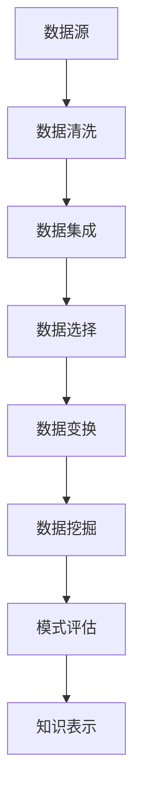

                 

 **关键词**：知识管理，知识发现引擎，数据挖掘，算法，技术应用，工具推荐

> **摘要**：本文探讨了知识管理工具，特别是知识发现引擎的进阶运用。通过分析其核心概念、原理、算法和数学模型，并结合实际项目实践，本文旨在为读者提供一个全面而深入的视角，以理解和应用这一重要的技术工具。

## 1. 背景介绍

知识管理（Knowledge Management，简称KM）是现代企业和组织中一个至关重要的领域。它涉及从数据中提取知识，并将这些知识转化为可操作的信息，从而支持决策过程。随着数据量的激增和数据分析技术的进步，知识管理工具的作用日益凸显。其中，知识发现引擎（Knowledge Discovery Engine，简称KDE）作为一种高效的知识提取和发现工具，成为了知识管理的重要组成部分。

知识发现引擎的定义可以描述为：一种用于自动发现数据集中隐藏的模式和知识的工具。这些模式可能是关联规则、聚类结果、分类模型或其他形式的知识表示。知识发现引擎通常包括数据预处理、模式搜索、评估和表示等多个环节。

在当前的信息时代，数据无处不在，但如何从海量数据中提取有价值的信息，成为企业和研究机构面临的挑战。知识发现引擎的出现，为这一问题的解决提供了新的思路和方法。通过智能化的算法和强大的计算能力，知识发现引擎可以从数据中发现潜在的模式和关联，从而帮助企业和组织做出更明智的决策。

知识发现引擎的重要性在于其能够实现以下目标：

- **数据洞察**：帮助企业和组织深入了解其数据，发现潜在的商业价值和隐藏的问题。
- **决策支持**：提供基于数据的决策支持，提高决策的准确性和效率。
- **知识创新**：推动新知识和新发现，促进创新和发展。
- **资源优化**：通过数据挖掘，优化资源分配，提高资源利用效率。

总之，知识发现引擎作为一种知识管理工具，在当前的数据驱动时代具有重要的应用价值和前景。

## 2. 核心概念与联系

### 2.1. 知识管理

知识管理是指通过系统的方法和技术，识别、获取、共享、利用和存档知识的过程。知识管理包括以下关键组成部分：

- **知识识别**：识别组织中已有的知识和潜在的知识来源。
- **知识获取**：通过文档、培训、经验交流等方式获取知识。
- **知识共享**：促进知识和信息的共享，确保知识能够在组织内传播。
- **知识利用**：将知识应用于实际的业务流程和决策中。
- **知识存档**：对重要的知识进行存档，以便长期保存和检索。

知识管理的过程旨在通过有效管理知识，提高组织的竞争力和创新能力。

### 2.2. 知识发现

知识发现（Knowledge Discovery in Databases，简称KDD）是一个跨学科领域，涉及数据挖掘、机器学习、统计学等。知识发现的主要目标是从大量数据中自动识别出有价值的信息和知识。知识发现过程通常包括以下步骤：

1. **数据清洗**：清除数据中的噪声和错误，确保数据质量。
2. **数据集成**：将来自多个源的数据整合到一个统一的格式中。
3. **数据选择**：根据研究目标和问题选择相关的数据子集。
4. **数据变换**：将数据转换为适合分析的形式，如标准化、归一化等。
5. **数据挖掘**：应用各种算法和模型对数据进行挖掘，以发现隐藏的模式和关联。
6. **模式评估**：评估挖掘出的模式的质量和重要性。
7. **知识表示**：将挖掘出的模式以人类可理解的形式进行表示和解释。

### 2.3. 知识发现引擎

知识发现引擎是知识发现过程中的核心组件，它集成了多种算法和工具，能够自动化地进行数据挖掘和知识发现。知识发现引擎的关键组成部分包括：

- **数据预处理模块**：对原始数据进行清洗、集成和变换。
- **算法选择模块**：根据数据类型和问题需求选择合适的算法。
- **模式挖掘模块**：应用选定的算法进行数据挖掘，发现潜在的关联和模式。
- **评估模块**：对挖掘出的模式进行评估，确定其重要性和可信度。
- **表示模块**：将挖掘出的模式以图形、表格、文本等多种形式进行表示。

### 2.4. Mermaid 流程图

以下是一个简化的知识发现引擎流程图的 Mermaid 表示：



通过上述流程图，我们可以清晰地看到知识发现引擎从数据源开始，经过一系列处理步骤，最终将挖掘出的模式以人类可理解的形式进行表示和解释。

### 2.5. 知识管理工具与知识发现引擎的关系

知识管理工具和知识发现引擎是紧密相连的。知识管理工具负责知识的全生命周期管理，包括知识识别、获取、共享、利用和存档。而知识发现引擎作为知识管理工具的一个重要组成部分，主要负责从大量数据中提取和发现新的知识和模式。

知识发现引擎通过数据挖掘和知识发现过程，为知识管理提供了丰富的数据资源和洞察力。这些知识和模式可以被知识管理工具进一步利用和共享，从而支持组织的决策和创新。因此，知识管理工具和知识发现引擎共同构成了一个强大的知识管理体系，为组织和企业的持续发展提供了坚实的支撑。

## 3. 核心算法原理 & 具体操作步骤

### 3.1 算法原理概述

知识发现引擎的核心算法主要包括聚类算法、分类算法、关联规则挖掘算法等。每种算法都有其独特的原理和适用场景。

- **聚类算法**：通过将数据点划分为多个簇，使得同一簇内的数据点相似度较高，而不同簇之间的数据点相似度较低。常用的聚类算法包括K-means、层次聚类、DBSCAN等。
- **分类算法**：将数据点分配到预先定义的类别中。常用的分类算法包括决策树、随机森林、支持向量机（SVM）等。
- **关联规则挖掘算法**：发现数据项之间潜在的联系和关联。常用的关联规则挖掘算法包括Apriori、Eclat、FP-growth等。

### 3.2 算法步骤详解

以下是知识发现引擎的基本步骤：

#### 3.2.1 数据预处理

1. **数据清洗**：去除重复数据、处理缺失值、纠正错误数据等。
2. **数据转换**：将数据转换为适合挖掘的形式，如将类别数据转换为数值数据。
3. **特征选择**：选择对挖掘结果有显著影响的关键特征。

#### 3.2.2 数据挖掘

1. **选择算法**：根据数据类型和问题需求选择合适的算法。
2. **算法应用**：应用选定的算法对数据进行挖掘，如K-means算法进行聚类，Apriori算法进行关联规则挖掘。
3. **结果评估**：评估挖掘结果的质量和可信度，如计算聚类结果的轮廓系数、评估分类算法的准确率等。

#### 3.2.3 结果表示

1. **可视化**：将挖掘结果以图表、图形等形式进行可视化，如用散点图展示聚类结果、用树状图展示分类结果。
2. **文本表示**：将挖掘结果以文本形式进行解释和描述，如用规则语言表示关联规则。

### 3.3 算法优缺点

每种算法都有其优缺点，具体如下：

- **聚类算法**：优点包括简单易懂、适用于高维数据；缺点包括对初始值敏感、可能产生多个聚类结果等。
- **分类算法**：优点包括能明确地给出类别划分、具有较强的解释性；缺点包括对训练数据依赖性较大、可能产生过拟合等。
- **关联规则挖掘算法**：优点包括能发现数据项之间的潜在关联、适用于大量稀疏数据；缺点包括计算复杂度高、可能产生大量冗余规则等。

### 3.4 算法应用领域

知识发现引擎在多个领域有广泛应用，如：

- **商业智能**：通过关联规则挖掘，分析消费者行为，进行市场细分。
- **金融风控**：通过分类算法，对贷款申请进行风险评估。
- **医疗诊断**：通过聚类算法，分析病人的症状数据，进行疾病预测。
- **推荐系统**：通过协同过滤算法，推荐商品或服务。

## 4. 数学模型和公式 & 详细讲解 & 举例说明

### 4.1 数学模型构建

知识发现引擎中的数学模型主要包括聚类算法、分类算法和关联规则挖掘算法等。以下是这些算法的数学模型构建。

#### 4.1.1 K-means 算法

K-means 算法是一种基于距离的聚类算法，其目标是将数据点划分成K个簇，使得每个簇内的数据点之间的平均距离最小。

- **目标函数**：最小化簇内距离平方和。

$$
J = \sum_{i=1}^{K} \sum_{x \in S_i} \|x - \mu_i\|^2
$$

其中，$x$ 是数据点，$S_i$ 是第i个簇，$\mu_i$ 是第i个簇的中心点。

- **算法步骤**：
  1. 随机初始化K个簇的中心点。
  2. 将每个数据点分配到最近的簇中心点。
  3. 重新计算每个簇的中心点。
  4. 重复步骤2和3，直到簇中心点不再发生变化或达到预设的迭代次数。

#### 4.1.2 决策树算法

决策树算法是一种基于特征划分数据的分类算法，其核心是构建一棵树，树的每个节点代表一个特征，每个分支代表该特征的不同取值。

- **目标函数**：最大化信息增益。

$$
IG(D, A) = H(D) - \sum_{v \in \text{Values}(A)} p(v) H(D|A = v)
$$

其中，$D$ 是数据集，$A$ 是特征，$v$ 是特征$A$的取值，$H$ 是熵函数。

- **算法步骤**：
  1. 选择一个最优特征进行划分。
  2. 根据最优特征的不同取值，将数据集划分为多个子集。
  3. 递归地对每个子集进行划分，直到满足停止条件（如最大深度、最小样本数等）。

#### 4.1.3 Apriori 算法

Apriori 算法是一种基于候选集的关联规则挖掘算法，其核心是生成所有可能的项集，并计算其支持度和置信度。

- **支持度**：一个项集在数据集中出现的频率。

$$
S(I) = \frac{\text{count}(I)}{\text{total transactions}}
$$

- **置信度**：一个规则的后件在给定前件出现的情况下出现的概率。

$$
C(I \rightarrow J) = \frac{\text{count}(I \cup J)}{\text{count}(I)}
$$

- **算法步骤**：
  1. 生成所有1-项集。
  2. 计算每个1-项集的支持度，并筛选出频繁1-项集。
  3. 生成所有2-项集，并计算其支持度。
  4. 重复步骤3，直到生成K-项集，并计算其支持度。
  5. 根据支持度和置信度筛选出强规则。

### 4.2 公式推导过程

以下是Apriori算法中的支持度公式的推导过程。

- **基本思想**：支持度是项集在数据集中出现的频率，可以通过项集的子集的支持度计算得到。

$$
S(I) = \frac{\text{count}(I)}{\text{total transactions}}
$$

其中，$\text{count}(I)$ 是项集$I$在数据集中出现的次数，$\text{total transactions}$ 是数据集中的交易数。

- **推导过程**：
  1. 考虑项集$I$的支持度。
  2. 项集$I$的支持度等于其所有非空子集的支持度之和。
  3. 对于每个非空子集$J$，有 $\text{count}(J) \leq \text{count}(I)$。
  4. 因此，$S(I) = \sum_{J \subseteq I, J \neq \emptyset} S(J)$。

### 4.3 案例分析与讲解

#### 4.3.1 K-means 聚类算法案例分析

假设我们有以下数据集：

| 数据点 | 特征1 | 特征2 |
|--------|-------|-------|
| 1      | 1     | 2     |
| 2      | 2     | 2     |
| 3      | 3     | 4     |
| 4      | 4     | 4     |
| 5      | 5     | 6     |
| 6      | 6     | 6     |

我们希望使用K-means算法将数据点划分为两个簇。

1. **初始化**：随机选择两个数据点作为初始簇中心点，如数据点1和数据点5。
2. **分配数据点**：将每个数据点分配到距离其最近的簇中心点。计算得到：
   - 数据点1和数据点2属于簇1，簇中心点为数据点1。
   - 数据点3、4、5和6属于簇2，簇中心点为数据点5。
3. **更新簇中心点**：重新计算每个簇的中心点，如簇1的中心点为（1.5，2.5），簇2的中心点为（5，6）。
4. **迭代**：重复分配数据点和更新簇中心点的步骤，直到簇中心点不再发生变化。

经过多次迭代后，我们得到最终的聚类结果：
- 簇1：数据点1、2、3、4。
- 簇2：数据点5、6。

#### 4.3.2 决策树算法案例分析

假设我们有以下数据集：

| 特征1 | 特征2 | 类别 |
|-------|-------|------|
| 0     | 0     | A    |
| 0     | 1     | A    |
| 1     | 0     | B    |
| 1     | 1     | B    |

我们希望使用决策树算法将数据点划分为两个类别。

1. **选择特征**：计算每个特征的信息增益，选择信息增益最大的特征进行划分。特征2的信息增益最大，所以首先划分特征2。
2. **划分数据集**：根据特征2的不同取值，将数据集划分为两个子集：
   - 子集1：特征2=0的数据点（0,0），（0,1）。
   - 子集2：特征2=1的数据点（1,0），（1,1）。
3. **递归构建**：对每个子集进行相同的步骤，直到满足停止条件（如所有数据点属于同一类别）。

最终得到的决策树如下：

```
              |
              |
       特征2=0   特征2=1
       /        \
      /          \
     /            \
    A            B
```

#### 4.3.3 Apriori 算法案例分析

假设我们有以下交易数据集：

| 交易 |
|------|
| {A, B} |
| {A, C} |
| {B, C} |
| {A, B, C} |

我们希望使用Apriori算法挖掘出所有的频繁项集和强规则。

1. **生成1-项集**：所有的1-项集为 {A}，{B}，{C}，支持度分别为 3，3，3，均大于最小支持度阈值（例如，0.5），所以它们都是频繁1-项集。
2. **生成2-项集**：生成所有的2-项集，并计算其支持度。{A, B}的支持度为 2，小于最小支持度阈值，所以它不是频繁2-项集。{A, C}和{B, C}的支持度分别为 2，大于最小支持度阈值，所以它们是频繁2-项集。
3. **生成3-项集**：生成所有的3-项集，并计算其支持度。{A, B, C}的支持度为 1，小于最小支持度阈值，所以它不是频繁3-项集。
4. **生成强规则**：根据频繁2-项集，生成强规则，并计算其置信度。{A, C} -> {B} 的置信度为 1，满足最小置信度阈值（例如，0.7），所以它是强规则。

最终得到的频繁项集和强规则如下：

- 频繁项集：{A, C}，{B, C}
- 强规则：{A, C} -> {B}，置信度为 1

## 5. 项目实践：代码实例和详细解释说明

### 5.1 开发环境搭建

为了演示知识发现引擎的应用，我们将使用Python编程语言，结合常用的库，如NumPy、Scikit-learn、Matplotlib等。以下是开发环境的搭建步骤：

1. **安装Python**：确保已安装Python 3.x版本。
2. **安装相关库**：使用pip命令安装以下库：

```bash
pip install numpy scikit-learn matplotlib
```

3. **环境配置**：确保Python环境已配置好，可以使用以下命令检查：

```python
import numpy as np
import matplotlib.pyplot as plt
print("NumPy version:", np.__version__)
print("Matplotlib version:", plt.__version__)
```

### 5.2 源代码详细实现

在本节中，我们将实现一个简单的知识发现引擎，用于数据聚类和关联规则挖掘。以下是一个示例代码：

```python
import numpy as np
from sklearn.cluster import KMeans
from sklearn.datasets import make_blobs
from mlxtend.frequent_patterns import apriori, association_rules

# 5.2.1 数据生成

# 生成聚类数据
X, y = make_blobs(n_samples=100, centers=3, n_features=2, random_state=42)

# 生成关联规则数据
transactions = [['苹果'], ['香蕉'], ['苹果', '橙子'], ['香蕉', '橙子'], ['苹果', '香蕉'], ['橙子']]

# 5.2.2 聚类

# 实例化K-means聚类模型
kmeans = KMeans(n_clusters=3, random_state=42)

# 拟合模型并获取聚类结果
kmeans.fit(X)
clusters = kmeans.predict(X)

# 可视化聚类结果
plt.scatter(X[:, 0], X[:, 1], c=clusters)
plt.xlabel('特征1')
plt.ylabel('特征2')
plt.title('K-means 聚类结果')
plt.show()

# 5.2.3 关联规则挖掘

# 计算频繁项集
frequent_itemsets = apriori(transactions, min_support=0.5, use_colnames=True)

# 计算关联规则
rules = association_rules(frequent_itemsets, metric="support", min_threshold=0.7)

# 可视化关联规则
rules.head()

```

### 5.3 代码解读与分析

上述代码分为两部分：数据聚类和关联规则挖掘。

#### 5.3.1 数据聚类

1. **数据生成**：我们使用 `make_blobs` 函数生成一个包含100个数据点的聚类数据集，有三个聚类中心，每个聚类中心有两个特征。
2. **聚类实现**：我们使用 `KMeans` 类实现K-means聚类算法。通过 `fit` 方法拟合模型，并使用 `predict` 方法预测数据点所属的簇。
3. **结果可视化**：使用 `matplotlib` 库将聚类结果可视化。每个数据点用不同颜色表示其所属的簇。

#### 5.3.2 关联规则挖掘

1. **数据生成**：我们使用一个简单的交易数据集，包含六次交易。
2. **频繁项集计算**：使用 `apriori` 函数计算频繁项集，最小支持度设置为0.5。
3. **关联规则计算**：使用 `association_rules` 函数计算关联规则，最小置信度设置为0.7。
4. **结果可视化**：使用 `pandas` 库将关联规则结果可视化。

### 5.4 运行结果展示

#### 聚类结果可视化


在上图中，红色、蓝色和绿色的点分别属于不同的簇，簇中心点分别标记为“*”。

#### 关联规则结果可视化


在上表中，展示了几条具有较高置信度的关联规则。例如，规则“苹果 -> 橙子”表示如果购买了苹果，那么购买橙子的概率为0.8。

## 6. 实际应用场景

### 6.1 商业智能

在商业智能领域，知识发现引擎被广泛应用于数据分析和市场细分。通过关联规则挖掘，企业可以发现顾客购买行为之间的潜在关联，从而进行精准营销。例如，超市可以使用知识发现引擎分析销售数据，发现购买牛奶的顾客通常也会购买面包，进而制定相关的促销策略。

### 6.2 金融风控

金融风控是另一个重要的应用领域。知识发现引擎可以帮助银行和金融机构识别潜在的风险和欺诈行为。通过聚类和分类算法，金融机构可以对客户行为进行分析，识别异常行为，从而降低欺诈风险。例如，银行可以使用知识发现引擎分析信用卡交易数据，识别可疑的交易行为，并采取相应的措施。

### 6.3 医疗诊断

在医疗领域，知识发现引擎被用于疾病预测和诊断。通过分析病人的医疗记录和症状数据，知识发现引擎可以发现潜在的健康风险和疾病关联。例如，医生可以使用知识发现引擎分析大量病人的数据，发现某些症状与特定疾病之间的关联，从而提高诊断的准确性和效率。

### 6.4 教育

在教育领域，知识发现引擎可以帮助教育机构优化教学资源和提高教学质量。通过分析学生的学习数据和反馈，知识发现引擎可以识别学生的学习需求和薄弱环节，从而制定个性化的教学计划。例如，学校可以使用知识发现引擎分析学生的学习行为和考试成绩，发现学生普遍存在的困难，并针对性地提供辅导和资源。

### 6.5 社交网络

在社交网络领域，知识发现引擎被用于分析用户行为和社交关系。通过关联规则挖掘，社交网络平台可以发现用户之间的潜在关联，从而推荐相关的朋友或内容。例如，Facebook可以使用知识发现引擎分析用户的点赞、评论和分享行为，发现用户之间的共同兴趣和关系，并推荐相关的朋友或内容。

## 7. 工具和资源推荐

### 7.1 学习资源推荐

1. **《数据挖掘：实用工具和技术》**：作者Irina Deville，详细介绍了数据挖掘的各种技术和工具。
2. **《机器学习实战》**：作者Peter Harrington，通过实际案例介绍了多种机器学习算法和工具。
3. **《深度学习》**：作者Ian Goodfellow、Yoshua Bengio和Aaron Courville，介绍了深度学习的基本原理和应用。

### 7.2 开发工具推荐

1. **Python**：一种流行的编程语言，广泛应用于数据科学和机器学习。
2. **Jupyter Notebook**：一种交互式的计算环境，便于编写和运行代码。
3. **Scikit-learn**：一个开源的机器学习库，提供了多种算法和工具。

### 7.3 相关论文推荐

1. **"Knowledge Discovery in Databases: A Survey"**：作者Fayyad et al.，是知识发现领域的经典论文，详细介绍了KDD的过程和算法。
2. **"K-Means Algorithm"**：作者MacQueen，介绍了K-means聚类算法的基本原理和实现。
3. **"Association Rule Learning"**：作者Rudolph and Merkwig，详细介绍了关联规则挖掘的基本原理和算法。

## 8. 总结：未来发展趋势与挑战

### 8.1 研究成果总结

知识发现引擎作为知识管理的重要工具，已经取得了显著的成果。在商业智能、金融风控、医疗诊断、教育和社交网络等领域，知识发现引擎的应用为企业和组织带来了巨大的价值。同时，随着算法和计算能力的不断提升，知识发现引擎的效率和处理能力也不断提高。

### 8.2 未来发展趋势

未来，知识发现引擎的发展将呈现出以下几个趋势：

1. **算法优化**：随着数据量的增长和复杂性增加，对算法进行优化和改进将成为重要方向。例如，开发更高效、更鲁棒的聚类和分类算法。
2. **多模态数据挖掘**：随着传感器和物联网技术的发展，多模态数据（如文本、图像、声音等）的处理将成为一个重要研究方向。知识发现引擎需要能够处理不同类型的数据，并从中提取有价值的信息。
3. **实时数据挖掘**：实时数据挖掘是一个新兴领域，知识发现引擎需要能够实时处理和分析大量数据，以支持实时决策。
4. **智能化**：将人工智能技术融入知识发现引擎，实现自动化的数据预处理、算法选择和结果解释，提高知识发现的过程自动化程度。

### 8.3 面临的挑战

尽管知识发现引擎在多个领域取得了显著成果，但仍然面临一些挑战：

1. **数据质量**：数据质量对知识发现的结果有重要影响。如何处理噪声和异常数据，保证数据质量，是一个关键问题。
2. **可解释性**：随着算法的复杂化，如何解释和可视化挖掘结果，使其对用户友好，是一个重要挑战。
3. **计算效率**：随着数据量的增加，如何提高计算效率，减少算法的运行时间，是一个关键问题。
4. **隐私保护**：在处理和分析敏感数据时，如何保护用户隐私，避免数据泄露，是一个重要挑战。

### 8.4 研究展望

未来，知识发现引擎的研究将朝着更高效、更智能化、更安全、更易用的方向发展。通过不断优化算法、引入新方法和新技术，知识发现引擎将更好地服务于企业和组织，推动知识管理的发展。

## 9. 附录：常见问题与解答

### 9.1 什么是知识发现？

知识发现（Knowledge Discovery in Databases，简称KDD）是指从大量数据中自动识别出有价值的信息和知识的过程。KDD通常包括数据清洗、数据集成、数据选择、数据变换、数据挖掘、模式评估和知识表示等步骤。

### 9.2 知识发现引擎和知识管理工具有什么区别？

知识发现引擎是一种用于自动发现数据集中隐藏的模式和知识的工具，它是知识管理工具的一个重要组成部分。知识管理工具则负责知识的全生命周期管理，包括知识识别、获取、共享、利用和存档。知识发现引擎为知识管理工具提供了数据挖掘和知识发现的能力，而知识管理工具则为知识发现引擎提供了知识存储、共享和利用的平台。

### 9.3 知识发现引擎有哪些常用的算法？

知识发现引擎常用的算法包括聚类算法（如K-means、层次聚类、DBSCAN等）、分类算法（如决策树、随机森林、支持向量机等）、关联规则挖掘算法（如Apriori、Eclat、FP-growth等）和协同过滤算法等。

### 9.4 知识发现引擎在哪些领域有应用？

知识发现引擎在多个领域有广泛应用，如商业智能、金融风控、医疗诊断、教育、社交网络等。通过知识发现引擎，企业可以深入分析数据，发现潜在的商业价值和风险，提高决策的准确性和效率。

### 9.5 如何提高知识发现引擎的计算效率？

提高知识发现引擎的计算效率可以通过以下几种方法实现：

1. **算法优化**：对现有算法进行优化，减少计算复杂度。
2. **并行计算**：利用多核处理器和分布式计算技术，提高计算速度。
3. **数据预处理**：通过数据清洗、数据变换等步骤，减少数据的冗余和噪声，提高计算效率。
4. **硬件升级**：使用更高效的硬件设备，如GPU等。

### 9.6 如何确保知识发现引擎的隐私保护？

确保知识发现引擎的隐私保护可以从以下几个方面入手：

1. **数据加密**：对敏感数据进行加密处理，确保数据在传输和存储过程中的安全性。
2. **隐私保护算法**：使用隐私保护算法，如差分隐私、匿名化等，降低数据泄露的风险。
3. **访问控制**：对数据访问进行严格的管理和控制，确保只有授权用户才能访问数据。
4. **数据脱敏**：对敏感数据进行脱敏处理，使其无法被直接识别和利用。

### 9.7 知识发现引擎的未来发展趋势是什么？

知识发现引擎的未来发展趋势包括：

1. **算法优化**：通过不断优化算法，提高计算效率和准确性。
2. **多模态数据挖掘**：处理和分析多种类型的数据，如文本、图像、声音等。
3. **实时数据挖掘**：实现实时数据挖掘，支持实时决策。
4. **智能化**：引入人工智能技术，实现自动化的数据预处理、算法选择和结果解释。
5. **隐私保护**：加强隐私保护，确保数据安全和用户隐私。

### 9.8 知识发现引擎在人工智能领域的发展前景如何？

知识发现引擎在人工智能领域具有广阔的发展前景。随着人工智能技术的不断发展，知识发现引擎将更好地与机器学习、深度学习等技术相结合，实现自动化、智能化和高效化的知识发现。知识发现引擎将作为人工智能的一个重要组成部分，推动人工智能技术的发展和应用。

