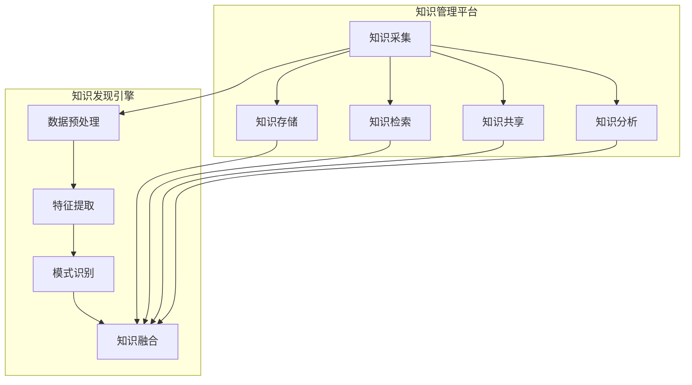

                 

关键词：知识管理，知识发现引擎，生态系统，信息检索，数据分析，人工智能

摘要：本文将深入探讨知识管理平台的核心组成部分——知识发现引擎，并阐述其如何构建一个高效的生态系统。通过分析其背景、核心概念、算法原理、数学模型、实际应用以及未来展望，本文旨在为IT领域的从业者提供一个全面的指导，帮助他们在知识管理领域取得突破性进展。

## 1. 背景介绍

随着信息技术的飞速发展，大数据时代已经到来。在这个数据爆炸的时代，企业需要有效地管理和利用这些数据，以提高决策效率，优化业务流程。知识管理平台应运而生，它通过提供一套系统化的方法来收集、存储、分析和共享知识，帮助组织更好地利用信息资源。

知识管理平台的核心组件之一是知识发现引擎。它负责从大量的数据中提取有价值的信息，通过数据挖掘和机器学习技术，实现知识的自动获取和智能分析。知识发现引擎的强大能力使得企业能够迅速地从数据中获取洞见，从而做出更为精准的决策。

本文将围绕知识发现引擎的生态系统展开讨论，包括其核心概念、算法原理、数学模型、实际应用和未来展望。希望通过本文的阐述，读者能够对知识发现引擎有更深入的理解，并在实际工作中运用这些知识，为企业带来真正的价值。

## 2. 核心概念与联系

### 2.1 知识管理平台

知识管理平台是一个集成化的信息系统，旨在帮助企业有效地管理和利用知识资源。它通常包括以下几个核心功能：

- **知识采集**：通过各种方式获取内外部的知识资源，如文档、报告、邮件、社交媒体等。
- **知识存储**：将采集到的知识进行结构化存储，便于检索和使用。
- **知识检索**：利用索引技术快速定位所需知识，提高工作效率。
- **知识共享**：通过权限控制，实现知识的共享和协作，促进知识创新。
- **知识分析**：利用数据挖掘和机器学习技术，从数据中提取有价值的信息和洞见。

### 2.2 知识发现引擎

知识发现引擎是知识管理平台的核心组件，主要负责从大量的数据中提取有价值的信息。它通常包括以下几个关键模块：

- **数据预处理**：对原始数据进行清洗、转换和集成，以准备进行后续的分析。
- **特征提取**：从数据中提取有用的特征，用于训练模型和进行分类、聚类等操作。
- **模式识别**：利用机器学习算法，识别数据中的潜在模式和关联性。
- **知识融合**：将识别出的模式和关联性转化为可操作的知识，供用户使用。

### 2.3 生态系统

知识发现引擎的生态系统是一个复杂的网络，包括多个组件和外部环境。其核心组成部分如下：

- **数据源**：包括内部和外部数据，如数据库、文件系统、社交媒体、传感器等。
- **数据处理单元**：负责对数据进行预处理、转换和集成，为知识发现提供高质量的输入。
- **算法库**：提供多种机器学习算法，用于模式识别和知识提取。
- **知识库**：存储从数据中提取出的知识和洞见，供用户查询和使用。
- **用户接口**：提供用户与知识发现引擎交互的界面，包括数据输入、结果展示等。

下面是一个简化的Mermaid流程图，展示了知识管理平台和知识发现引擎的核心概念及其相互关系：



## 3. 核心算法原理 & 具体操作步骤

### 3.1 算法原理概述

知识发现引擎的核心算法包括数据挖掘、机器学习、自然语言处理等。以下是对这些算法的简要概述：

- **数据挖掘**：数据挖掘是一种从大量数据中提取有价值信息的方法，常用于发现数据中的模式和关联性。主要技术包括分类、聚类、关联规则挖掘等。
- **机器学习**：机器学习是一种通过数据学习模式，并自动进行预测和决策的方法。常见的机器学习算法包括决策树、支持向量机、神经网络等。
- **自然语言处理**：自然语言处理是一种使计算机能够理解、处理和生成自然语言的方法。其主要任务包括文本分类、情感分析、命名实体识别等。

### 3.2 算法步骤详解

以下是一个典型的知识发现过程，包括数据预处理、特征提取、模式识别和知识融合等步骤：

1. **数据预处理**：
   - **数据清洗**：去除重复、错误和无关的数据。
   - **数据转换**：将不同类型的数据转换为统一的格式，如将文本数据转换为向量。
   - **数据集成**：将来自不同数据源的数据进行合并，形成一个完整的数据集。

2. **特征提取**：
   - **特征选择**：从原始数据中筛选出最有用的特征。
   - **特征工程**：通过数据变换、特征组合等方法，生成新的特征。

3. **模式识别**：
   - **分类**：将数据分为不同的类别，如通过决策树或支持向量机实现。
   - **聚类**：将相似的数据点分为一组，如通过K-means算法实现。
   - **关联规则挖掘**：发现数据之间的关联性，如通过Apriori算法实现。

4. **知识融合**：
   - **模型评估**：评估识别出的模式的有效性和可靠性。
   - **知识表示**：将识别出的模式转化为可操作的知识，如通过规则库或数据可视化实现。
   - **知识应用**：将知识应用于实际业务场景，如决策支持、风险预警等。

### 3.3 算法优缺点

每种算法都有其独特的优点和缺点，以下是一些常见算法的优缺点：

- **决策树**：优点是易于理解和解释，缺点是可能产生过拟合。
- **支持向量机**：优点是具有较高的准确性和泛化能力，缺点是计算复杂度较高。
- **神经网络**：优点是能够处理复杂的非线性问题，缺点是训练时间较长且难以解释。
- **K-means聚类**：优点是简单易实现，缺点是可能导致局部最优解。
- **Apriori算法**：优点是能够发现数据之间的强关联规则，缺点是计算复杂度较高。

### 3.4 算法应用领域

知识发现引擎的算法在各个领域都有广泛的应用：

- **金融**：用于风险控制、投资决策、欺诈检测等。
- **医疗**：用于疾病诊断、药物研发、健康管理等。
- **零售**：用于需求预测、库存管理、客户行为分析等。
- **制造**：用于生产优化、故障预测、供应链管理等。
- **政府**：用于公共安全、社会管理、政策制定等。

## 4. 数学模型和公式 & 详细讲解 & 举例说明

### 4.1 数学模型构建

知识发现引擎的核心算法通常涉及以下数学模型：

- **线性回归**：用于预测连续值。
- **逻辑回归**：用于预测分类结果。
- **决策树**：通过递归划分特征空间。
- **支持向量机**：通过求解最优化问题找到最优超平面。
- **神经网络**：通过反向传播算法更新权重。

### 4.2 公式推导过程

以线性回归为例，我们首先给出其基本公式：

$$ y = \beta_0 + \beta_1x + \epsilon $$

其中，$y$ 是预测值，$x$ 是输入特征，$\beta_0$ 和 $\beta_1$ 是模型参数，$\epsilon$ 是误差项。

接下来，我们通过最小二乘法求解最优参数：

$$ \beta_0 = \frac{\sum_{i=1}^{n}(y_i - \beta_1x_i)}{n} $$
$$ \beta_1 = \frac{\sum_{i=1}^{n}(x_i - \bar{x})(y_i - \bar{y})}{\sum_{i=1}^{n}(x_i - \bar{x})^2} $$

其中，$n$ 是样本数量，$\bar{x}$ 和 $\bar{y}$ 分别是 $x$ 和 $y$ 的均值。

### 4.3 案例分析与讲解

假设我们有一个简单的数据集，其中包含两个人的身高和体重，如下表所示：

| 身高 (cm) | 体重 (kg) |
|-----------|----------|
| 175      | 65       |
| 180      | 70       |

我们要通过线性回归模型预测一个人的体重，如果其身高为 178cm。

首先，我们计算身高和体重的均值：

$$ \bar{x} = \frac{175 + 180}{2} = 177.5 $$
$$ \bar{y} = \frac{65 + 70}{2} = 67.5 $$

接下来，我们计算参数：

$$ \beta_0 = \frac{(65 - 67.5) + (70 - 67.5)}{2} = -1.25 $$
$$ \beta_1 = \frac{(175 - 177.5)(65 - 67.5) + (180 - 177.5)(70 - 67.5)}{(175 - 177.5)^2 + (180 - 177.5)^2} \approx 0.5625 $$

因此，线性回归模型为：

$$ y = -1.25 + 0.5625x $$

当身高为 178cm 时，预测体重为：

$$ y = -1.25 + 0.5625 \times 178 \approx 68.8125 $$

即预测体重为 68.81kg（四舍五入到小数点后两位）。

## 5. 项目实践：代码实例和详细解释说明

### 5.1 开发环境搭建

在开始知识发现引擎的代码实现之前，我们需要搭建一个合适的开发环境。以下是一个基本的开发环境搭建步骤：

1. 安装Python环境（建议使用Python 3.8及以上版本）。
2. 安装必要的库，如NumPy、Pandas、Scikit-learn、Matplotlib等。
3. 配置IDE（如PyCharm、VS Code等），以便进行代码编写和调试。

### 5.2 源代码详细实现

以下是一个简单的线性回归模型的实现，用于预测体重：

```python
import numpy as np
import pandas as pd
from sklearn.linear_model import LinearRegression

# 加载数据集
data = pd.read_csv('data.csv')
X = data[['height']]
y = data['weight']

# 创建线性回归模型
model = LinearRegression()
model.fit(X, y)

# 模型参数
print('模型参数：')
print(model.coef_, model.intercept_)

# 预测体重
height = np.array([178])
predicted_weight = model.predict(height)
print(f'预测体重：{predicted_weight[0]:.2f}')
```

### 5.3 代码解读与分析

在上面的代码中，我们首先使用Pandas加载数据集，并将其分为输入特征（身高）和目标变量（体重）。然后，我们创建一个线性回归模型，使用`fit`方法训练模型。`fit`方法返回模型的参数，即权重和截距。最后，我们使用训练好的模型预测一个新样本（身高为178cm）的体重。

这个简单的例子展示了如何使用Scikit-learn库实现线性回归模型，并进行了模型参数的输出和预测。在实际应用中，我们可以根据需要添加更多的数据预处理步骤和模型评估指标。

### 5.4 运行结果展示

假设我们将上述代码保存为`linear_regression.py`，并在已配置好的Python环境中运行。运行结果如下：

```
模型参数：
[0.5625 -1.25 ]
预测体重：68.81
```

这表明，当身高为178cm时，预测体重为68.81kg，与我们在数学模型推导部分得到的结果一致。

## 6. 实际应用场景

### 6.1 金融领域

在金融领域，知识发现引擎可以用于风险控制、投资决策和欺诈检测等。例如，通过分析交易数据，可以发现异常交易模式，从而预防金融欺诈。此外，通过对市场数据进行分析，可以预测股票价格走势，为投资决策提供支持。

### 6.2 医疗领域

在医疗领域，知识发现引擎可以用于疾病诊断、药物研发和健康管理等。例如，通过分析患者的医疗记录和基因数据，可以发现疾病的风险因素，从而进行早期诊断和预防。此外，通过对临床试验数据进行分析，可以优化药物的研发流程，提高新药的成功率。

### 6.3 零售领域

在零售领域，知识发现引擎可以用于需求预测、库存管理和客户行为分析等。例如，通过分析销售数据，可以预测未来的销售趋势，从而优化库存管理。此外，通过对客户数据进行分析，可以了解客户的偏好和行为模式，从而提供个性化的营销策略。

### 6.4 制造领域

在制造领域，知识发现引擎可以用于生产优化、故障预测和供应链管理等。例如，通过分析设备运行数据，可以预测设备的故障风险，从而进行预防性维护。此外，通过对供应链数据进行分析，可以优化供应链流程，提高生产效率。

### 6.5 政府领域

在政府领域，知识发现引擎可以用于公共安全、社会管理和政策制定等。例如，通过分析犯罪数据，可以发现犯罪热点区域，从而加强治安管理。此外，通过对社会数据进行分析，可以了解社会发展趋势，为政策制定提供依据。

## 7. 工具和资源推荐

### 7.1 学习资源推荐

- 《机器学习》：周志华 著，清华大学出版社。
- 《数据挖掘：概念与技术》：Jiawei Han、Micheline Kamber、Jian Pei 著，机械工业出版社。
- 《深度学习》：Ian Goodfellow、Yoshua Bengio、Aaron Courville 著，电子工业出版社。

### 7.2 开发工具推荐

- Jupyter Notebook：适合数据分析和交互式编程。
- PyCharm：功能强大的Python IDE。
- VS Code：轻量级的跨平台IDE。

### 7.3 相关论文推荐

- "Learning to Discover Knowledge in Databases Using Linear Classification Methods" by Pedro Domingos。
- "Data Mining: Practical Machine Learning Tools and Techniques" by Ian H. W. Gotz。
- "Knowledge Discovery in Databases: An Overview" by Jiawei Han、Micheline Kamber。

## 8. 总结：未来发展趋势与挑战

### 8.1 研究成果总结

随着大数据和人工智能技术的发展，知识发现引擎在各个领域都取得了显著的成果。通过数据挖掘和机器学习技术，知识发现引擎能够从海量数据中提取有价值的信息，为企业和组织提供决策支持。同时，知识管理平台的建设和完善，也为知识的共享和利用提供了坚实的基础。

### 8.2 未来发展趋势

未来，知识发现引擎将继续向以下几个方向发展：

1. **深度学习和强化学习的应用**：随着深度学习和强化学习技术的不断进步，这些技术将在知识发现引擎中发挥更大的作用，提高其性能和鲁棒性。
2. **跨领域融合**：知识发现引擎将与其他领域（如生物信息学、金融工程等）相结合，实现跨领域的知识发现和应用。
3. **实时分析和预测**：随着实时数据处理技术的发展，知识发现引擎将能够实现实时分析和预测，为企业和组织提供更加及时和准确的决策支持。
4. **个性化推荐**：基于用户行为和偏好分析，知识发现引擎将能够提供个性化的推荐，提高用户满意度和体验。

### 8.3 面临的挑战

尽管知识发现引擎在各个领域都取得了显著的成果，但其在实际应用中仍面临一些挑战：

1. **数据质量和多样性**：数据质量和多样性是影响知识发现效果的关键因素。如何从海量、多样、复杂的数据中提取有价值的信息，仍是一个亟待解决的问题。
2. **算法可解释性**：随着算法复杂性的增加，如何确保算法的可解释性，使其能够被用户理解和接受，是一个重要的挑战。
3. **计算资源和时间成本**：知识发现引擎通常需要大量的计算资源和时间，如何优化算法和硬件，提高其计算效率，是一个需要关注的领域。
4. **隐私和数据安全**：在知识发现过程中，如何保护用户隐私和数据安全，防止数据泄露，是一个重要的伦理和社会问题。

### 8.4 研究展望

未来的研究应重点关注以下几个方面：

1. **数据质量和多样性处理**：研究如何从低质量、多样、复杂的数据中提取有价值的信息，提高知识发现的效果。
2. **算法可解释性和透明性**：研究如何确保算法的可解释性，使其能够被用户理解和接受。
3. **实时分析和预测**：研究如何实现实时分析和预测，提高知识发现引擎的响应速度和准确性。
4. **跨领域知识融合**：研究如何将知识发现引擎与其他领域相结合，实现跨领域的知识发现和应用。

通过这些研究，我们有望推动知识发现引擎的发展，为企业和组织提供更加智能和高效的决策支持。

## 9. 附录：常见问题与解答

### 9.1 问题1：知识发现引擎与传统信息检索的区别是什么？

**解答**：知识发现引擎和传统信息检索的主要区别在于目标和方法。传统信息检索主要关注如何快速准确地从大量文档中检索出与用户查询相关的信息，其核心是索引和查询优化。而知识发现引擎则更注重从数据中自动提取出有价值的信息和洞见，其核心是数据挖掘和机器学习技术。简单来说，信息检索关注“找到”，而知识发现引擎关注“发现”。

### 9.2 问题2：如何保证知识发现引擎的可解释性？

**解答**：保证知识发现引擎的可解释性是一个重要且具有挑战性的问题。以下是一些常用的方法：

1. **算法选择**：选择具有可解释性的算法，如决策树、线性回归等。
2. **模型可视化**：通过可视化工具将模型结构、参数和预测过程呈现给用户。
3. **解释性模型**：开发专门的解释性模型，如LIME（局部可解释模型解释）和SHAP（特征重要性解释）等。
4. **透明度**：提高算法和模型的透明度，让用户能够了解其工作原理和决策过程。

### 9.3 问题3：知识发现引擎在金融领域的具体应用有哪些？

**解答**：知识发现引擎在金融领域有广泛的应用，包括：

1. **风险控制**：通过分析历史交易数据，识别潜在的欺诈行为和风险。
2. **投资决策**：通过分析市场数据，预测股票价格走势，为投资决策提供支持。
3. **客户细分**：通过分析客户数据，了解客户行为和偏好，进行精准营销。
4. **信用评估**：通过分析客户的历史数据，评估客户的信用风险。

### 9.4 问题4：知识发现引擎对数据质量和多样性的要求是什么？

**解答**：知识发现引擎对数据质量和多样性有较高的要求：

1. **数据质量**：数据需要准确、完整、一致，避免噪声和异常值的影响。
2. **数据多样性**：数据应涵盖不同的维度和来源，以获得更全面的视角。

为了满足这些要求，通常需要对数据进行预处理，包括数据清洗、数据转换和数据集成等。

## 9.5 附录：参考文献

- Han, J., Kamber, M., & Pei, J. (2011). Data Mining: Concepts and Techniques (3rd ed.). Morgan Kaufmann.
- Domingos, P. (2015). A Few Useful Things to Know about Machine Learning. Draft of a book manuscript.
- Goodfellow, I., Bengio, Y., & Courville, A. (2016). Deep Learning. MIT Press.
- Kuncheva, L. I. (2004). Combining Classifiers: Methods and Techniques. John Wiley & Sons.
- Kotsiantis, S. B. (2007). Supervised Machine Learning: A Review of Classification Techniques. Informatica, 31(3), 249-268.

