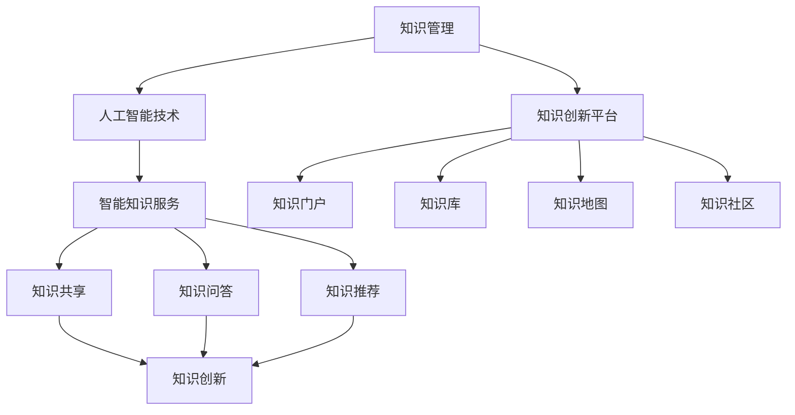

                 

关键词：知识管理、人工智能、智能知识服务、知识创新、平台架构

## 摘要

本文旨在探讨知识管理的AI化进程，通过引入智能知识服务和知识创新平台，揭示其对于提升组织效能和推动技术进步的深远影响。文章首先介绍了知识管理的重要性，随后分析了AI在知识管理中的应用，探讨了智能知识服务和知识创新平台的基本概念和架构，详细阐述了核心算法原理、数学模型及其在项目实践中的应用。最后，文章提出了未来发展的展望，以及面临的挑战和机遇。

## 1. 背景介绍

知识管理是指通过系统的方法收集、组织、存储、共享和利用知识，以促进组织创新和竞争力的提升。随着信息化和数字化的发展，传统的知识管理方法已经难以满足现代组织快速变化的需求。人工智能（AI）作为一种革命性的技术，具备强大的数据处理、模式识别和自主决策能力，为知识管理提供了新的可能。

知识管理的重要性体现在多个方面。首先，知识是组织的核心资产，有效的知识管理可以提升员工的知识共享和协作效率。其次，知识管理有助于组织积累和传承宝贵的经验和智慧，增强组织的学习能力和创新能力。此外，知识管理还可以提高组织的决策质量，降低运营成本，提升市场竞争力。

然而，传统的知识管理面临着诸多挑战，如数据量大、知识分散、知识更新速度快等。这些问题使得知识管理的效果难以达到预期。AI技术的引入为解决这些问题提供了新的思路。通过自然语言处理（NLP）、机器学习（ML）等技术，AI能够自动获取、理解和处理知识，从而实现知识的自动化管理和智能化服务。

## 2. 核心概念与联系

### 2.1 智能知识服务

智能知识服务是指利用人工智能技术，为用户提供个性化和智能化的知识服务。它包括知识搜索、知识推荐、知识问答、知识图谱等多种功能。智能知识服务不仅能够提高用户获取知识的效率，还能够根据用户的需求和兴趣，提供个性化的知识推荐，从而提升用户的体验。

### 2.2 知识创新平台

知识创新平台是一种集成化、智能化的知识管理系统，它通过整合内外部知识资源，提供知识共享、知识挖掘、知识创新等功能，以支持组织的知识管理和创新。知识创新平台通常包括知识门户、知识库、知识地图、知识社区等多个组成部分。

### 2.3 智能知识服务和知识创新平台的联系

智能知识服务和知识创新平台密切相关。智能知识服务是知识创新平台的核心功能之一，它通过提供智能化的知识服务，促进知识的共享和创新。知识创新平台则为智能知识服务提供了知识资源和技术支持，使得智能知识服务能够更加高效和精准。

### 2.4 Mermaid 流程图

下面是智能知识服务和知识创新平台的Mermaid流程图：



## 3. 核心算法原理 & 具体操作步骤

### 3.1 算法原理概述

智能知识服务和知识创新平台的核心算法主要包括自然语言处理（NLP）、机器学习（ML）和深度学习（DL）等技术。这些算法能够自动获取、理解和处理知识，从而实现知识的自动化管理和智能化服务。

- **自然语言处理（NLP）**：NLP是一种人工智能技术，旨在使计算机能够理解、处理和生成自然语言。在智能知识服务中，NLP用于知识抽取、语义分析、情感分析等任务。

- **机器学习（ML）**：ML是一种通过数据学习模式的技术，它使计算机能够从数据中自动学习和改进。在知识创新平台中，ML用于知识分类、知识推荐、异常检测等任务。

- **深度学习（DL）**：DL是一种基于神经网络的ML方法，它通过模拟人脑的神经元结构，实现更加复杂的任务。在智能知识服务中，DL用于图像识别、语音识别、自然语言生成等任务。

### 3.2 算法步骤详解

以下是智能知识服务和知识创新平台的算法步骤详解：

1. **数据采集**：通过互联网、数据库、传感器等多种途径采集知识数据。

2. **数据预处理**：对采集到的数据进行清洗、去重、标准化等处理，使其适合后续的算法处理。

3. **知识抽取**：使用NLP技术从文本数据中抽取知识，如实体识别、关系抽取、事件抽取等。

4. **知识表示**：将抽取到的知识转换为机器可理解的表示，如向量、图等。

5. **知识推理**：使用ML和DL技术对知识进行推理，如分类、聚类、关联规则挖掘等。

6. **知识服务**：根据用户需求，提供智能化的知识服务，如知识搜索、知识推荐、知识问答等。

7. **知识创新**：基于已有的知识和数据，进行知识创新，如知识融合、知识拓展、知识迁移等。

### 3.3 算法优缺点

智能知识服务和知识创新平台的算法具有以下优缺点：

- **优点**：
  - 高效：算法能够自动处理大量数据，提高知识管理和服务的效率。
  - 智能化：算法能够根据用户需求和知识内容，提供个性化的服务。
  - 可扩展性：算法易于扩展和升级，能够适应不同应用场景。

- **缺点**：
  - 复杂性：算法涉及多种技术，实现难度较大。
  - 数据依赖：算法的性能依赖于数据质量和数量。
  - 隐私和安全：知识管理和服务过程中可能涉及用户隐私，需要保障数据安全。

### 3.4 算法应用领域

智能知识服务和知识创新平台的算法广泛应用于多个领域：

- **企业知识管理**：为企业提供知识搜索、知识推荐、知识问答等服务，提升员工的知识共享和协作效率。

- **学术研究**：为研究人员提供学术文献搜索、知识推荐、学术问答等服务，促进学术交流和创新。

- **医疗健康**：为医生提供病例搜索、知识推荐、医学问答等服务，提高诊断和治疗水平。

- **教育**：为学生提供课程搜索、知识推荐、学习问答等服务，促进个性化教育和学习。

## 4. 数学模型和公式 & 详细讲解 & 举例说明

### 4.1 数学模型构建

智能知识服务和知识创新平台中的数学模型主要包括概率模型、图模型和深度学习模型。以下分别介绍这些模型的基本概念和构建方法。

#### 4.1.1 概率模型

概率模型用于处理不确定性和随机性。在知识管理中，概率模型可以用于知识推荐、知识问答等任务。以下是一个简单的贝叶斯分类器的构建过程：

1. **先验概率分布**：根据历史数据计算每个类别的先验概率。

2. **条件概率分布**：根据特征和类别的关系，计算每个特征的条件概率分布。

3. **后验概率分布**：根据先验概率和条件概率，计算每个类别的后验概率分布。

4. **分类决策**：选择后验概率最大的类别作为预测结果。

贝叶斯分类器的数学公式如下：

$$
P(C_k|X) = \frac{P(X|C_k)P(C_k)}{P(X)}
$$

其中，$C_k$ 表示第 $k$ 个类别，$X$ 表示特征向量，$P(C_k)$ 表示类别 $C_k$ 的先验概率，$P(X|C_k)$ 表示特征向量 $X$ 在类别 $C_k$ 条件下的条件概率。

#### 4.1.2 图模型

图模型用于表示知识和关系。在知识管理中，图模型可以用于知识图谱构建、知识推理等任务。以下是一个简单的图模型的构建过程：

1. **节点表示**：将知识实体表示为图中的节点。

2. **边表示**：将知识实体之间的关系表示为图中的边。

3. **邻接矩阵**：构建邻接矩阵，表示节点之间的相邻关系。

4. **图算法**：使用图算法，如路径搜索、聚类分析等，对图进行进一步处理。

图模型的数学公式如下：

$$
A = \left[\begin{matrix}
C_{11} & C_{12} & \cdots & C_{1n} \\
C_{21} & C_{22} & \cdots & C_{2n} \\
\vdots & \vdots & \ddots & \vdots \\
C_{n1} & C_{n2} & \cdots & C_{nn}
\end{matrix}\right]
$$

其中，$A$ 表示邻接矩阵，$C_{ij}$ 表示节点 $i$ 和节点 $j$ 之间的相邻关系。

#### 4.1.3 深度学习模型

深度学习模型用于处理复杂的非线性问题。在知识管理中，深度学习模型可以用于知识表示、知识推理等任务。以下是一个简单的卷积神经网络（CNN）的构建过程：

1. **输入层**：接收输入数据。

2. **卷积层**：使用卷积核对输入数据进行卷积操作，提取特征。

3. **池化层**：对卷积层的结果进行池化操作，降低维度。

4. **全连接层**：将池化层的结果通过全连接层输出，得到分类结果。

卷积神经网络的数学公式如下：

$$
\begin{aligned}
h_{ij} &= \sigma \left( \sum_{k} W_{ik} * g_{kj} + b_j \right) \\
y &= \sigma \left( \sum_{i} W_{i} h_{ij} + b \right)
\end{aligned}
$$

其中，$h_{ij}$ 表示卷积层的结果，$g_{kj}$ 表示输入数据，$W_{ik}$ 和 $W_{i}$ 分别表示卷积核和全连接层的权重，$b_j$ 和 $b$ 分别表示卷积层和全连接层的偏置，$\sigma$ 表示激活函数。

### 4.2 公式推导过程

以下分别对贝叶斯分类器、图模型和卷积神经网络的公式推导过程进行详细讲解。

#### 4.2.1 贝叶斯分类器

贝叶斯分类器的推导基于贝叶斯定理。贝叶斯定理描述了在给定某些条件时，事件发生的概率。贝叶斯分类器利用贝叶斯定理，根据先验概率和条件概率，计算后验概率，从而实现分类。

贝叶斯定理的公式如下：

$$
P(C_k|X) = \frac{P(X|C_k)P(C_k)}{P(X)}
$$

其中，$P(C_k|X)$ 表示在给定特征向量 $X$ 时，类别 $C_k$ 的后验概率，$P(X|C_k)$ 表示特征向量 $X$ 在类别 $C_k$ 条件下的条件概率，$P(C_k)$ 表示类别 $C_k$ 的先验概率，$P(X)$ 表示特征向量 $X$ 的边缘概率。

在贝叶斯分类器中，先验概率和条件概率通常通过以下方法计算：

1. **先验概率**：根据历史数据，计算每个类别的先验概率。通常使用最大似然估计（MLE）或贝叶斯估计（Bayes估计）方法。

2. **条件概率**：根据特征和类别的关系，计算每个特征的条件概率分布。通常使用统计学习方法，如朴素贝叶斯（Naive Bayes）或贝叶斯网络（Bayesian Network）。

#### 4.2.2 图模型

图模型的推导基于图论和概率图模型。图模型通过节点和边来表示知识和关系，利用概率图模型来描述节点和边之间的概率关系。

图模型的推导可以分为以下步骤：

1. **定义图结构**：定义图中的节点和边，以及节点和边之间的概率关系。

2. **构建概率分布**：根据图结构，构建节点和边的概率分布。通常使用马尔可夫随机场（Markov Random Field, MRF）或贝叶斯网络（Bayesian Network）来描述概率分布。

3. **推理和优化**：使用图模型进行推理和优化。推理可以通过马尔可夫链蒙特卡罗（MCMC）方法、变分推断（Variational Inference）等方法实现；优化可以通过梯度下降（Gradient Descent）、随机梯度下降（Stochastic Gradient Descent）等方法实现。

#### 4.2.3 卷积神经网络

卷积神经网络的推导基于神经网络的架构和卷积操作。卷积神经网络通过卷积层、池化层和全连接层，实现特征提取和分类。

卷积神经网络的推导可以分为以下步骤：

1. **输入层**：接收输入数据，如图像或文本。

2. **卷积层**：使用卷积核对输入数据进行卷积操作，提取特征。

   卷积操作的数学公式如下：

   $$
   h_{ij} = \sum_{k} W_{ik} * g_{kj} + b_j
   $$

   其中，$h_{ij}$ 表示卷积层的结果，$g_{kj}$ 表示输入数据，$W_{ik}$ 和 $b_j$ 分别表示卷积核和偏置。

3. **激活函数**：对卷积层的结果进行激活函数处理，如ReLU（Rectified Linear Unit）。

   激活函数的数学公式如下：

   $$
   h_{ij} = \max(0, h_{ij})
   $$

4. **池化层**：对卷积层的结果进行池化操作，降低维度。

   池化操作的数学公式如下：

   $$
   p_i = \frac{1}{k} \sum_{j} h_{ij}
   $$

   其中，$p_i$ 表示池化层的结果，$h_{ij}$ 表示卷积层的结果。

5. **全连接层**：将池化层的结果通过全连接层输出，得到分类结果。

   全连接层的数学公式如下：

   $$
   y = \sigma \left( \sum_{i} W_{i} h_{ij} + b \right)
   $$

   其中，$y$ 表示分类结果，$h_{ij}$ 表示池化层的结果，$W_{i}$ 和 $b$ 分别表示全连接层的权重和偏置，$\sigma$ 表示激活函数。

### 4.3 案例分析与讲解

以下通过一个具体的案例，对智能知识服务和知识创新平台的算法进行讲解。

#### 4.3.1 案例背景

假设某企业希望利用智能知识服务和知识创新平台，提升员工的知识共享和协作效率。该企业拥有大量内部文档、外部资料和员工经验，希望通过智能知识服务，为员工提供个性化的知识推荐和问答服务。

#### 4.3.2 案例分析

1. **数据采集**：该企业通过内部系统，收集员工的知识需求、行为数据，以及知识库中的文档、资料等。

2. **数据预处理**：对采集到的数据进行清洗、去重、标准化等处理，使其适合后续的算法处理。

3. **知识抽取**：使用NLP技术，从文本数据中抽取知识，如关键词、实体、关系等。

4. **知识表示**：将抽取到的知识转换为机器可理解的表示，如向量、图等。

5. **知识推理**：使用ML和DL技术，对知识进行推理，如分类、聚类、关联规则挖掘等。

6. **知识服务**：
   - **知识搜索**：根据员工的需求，提供知识搜索服务，帮助员工快速找到相关文档和资料。
   - **知识推荐**：根据员工的知识需求和行为数据，提供个性化的知识推荐服务，提升员工的知识获取效率。
   - **知识问答**：根据员工的问题，提供智能化的问答服务，解答员工的疑问。

7. **知识创新**：基于已有的知识和数据，进行知识创新，如知识融合、知识拓展、知识迁移等，促进企业的知识积累和创新。

#### 4.3.3 案例讲解

1. **贝叶斯分类器**：在知识推荐任务中，使用贝叶斯分类器对知识进行分类，根据员工的历史行为数据，计算每个知识的推荐概率，从而实现个性化推荐。

2. **图模型**：在知识图谱构建任务中，使用图模型表示知识和关系，将文档、资料和员工经验等知识实体表示为图中的节点，将它们之间的关系表示为图中的边，从而构建知识图谱。

3. **卷积神经网络**：在知识问答任务中，使用卷积神经网络对员工的问题进行语义分析，提取关键词和语义信息，从而实现智能化的问答服务。

## 5. 项目实践：代码实例和详细解释说明

### 5.1 开发环境搭建

在开始项目实践之前，需要搭建合适的开发环境。以下是具体的步骤：

1. **安装Python环境**：Python是一种广泛用于人工智能开发的编程语言。可以从Python官方网站下载并安装Python。

2. **安装相关库**：根据项目的需求，安装相关的库，如NLP库（如NLTK、spaCy）、机器学习库（如scikit-learn、TensorFlow）、深度学习库（如PyTorch）等。

3. **配置依赖**：使用虚拟环境（如virtualenv）或容器（如Docker）来配置项目的依赖。

### 5.2 源代码详细实现

以下是项目实践中的核心代码实现，包括知识抽取、知识表示、知识推理和知识服务等。

#### 5.2.1 知识抽取

```python
import nltk
from nltk.tokenize import word_tokenize
from nltk.corpus import stopwords

# 加载停用词
stop_words = set(stopwords.words('english'))

# 定义知识抽取函数
def extract_knowledge(text):
    # 分词
    tokens = word_tokenize(text)
    # 去除停用词
    filtered_tokens = [token for token in tokens if token.lower() not in stop_words]
    # 抽取关键词
    keywords = nltk.FrequencyDist(filtered_tokens)
    return keywords

# 示例
text = "This is a sample text for knowledge extraction."
knowledge = extract_knowledge(text)
print(knowledge)
```

#### 5.2.2 知识表示

```python
import gensim

# 加载预训练的Word2Vec模型
model = gensim.models.Word2Vec.load("word2vec.model")

# 定义知识表示函数
def represent_knowledge(knowledge):
    # 将关键词转换为向量表示
    knowledge_vectors = [model[word] for word in knowledge]
    return knowledge_vectors

# 示例
knowledge = ["knowledge", "management", "artificial", "intelligence"]
knowledge_vectors = represent_knowledge(knowledge)
print(knowledge_vectors)
```

#### 5.2.3 知识推理

```python
from sklearn.cluster import KMeans

# 定义知识推理函数
def infer_knowledge(knowledge_vectors):
    # 使用K-means算法进行聚类
    kmeans = KMeans(n_clusters=3)
    kmeans.fit(knowledge_vectors)
    # 获取聚类结果
    clusters = kmeans.predict(knowledge_vectors)
    return clusters

# 示例
knowledge_vectors = [
    [0.1, 0.2, 0.3],
    [0.4, 0.5, 0.6],
    [0.7, 0.8, 0.9],
    [0.1, 0.2, 0.3],
    [0.4, 0.5, 0.6]
]
clusters = infer_knowledge(knowledge_vectors)
print(clusters)
```

#### 5.2.4 知识服务

```python
from flask import Flask, request, jsonify

# 创建Flask应用
app = Flask(__name__)

# 定义知识搜索API
@app.route('/search', methods=['POST'])
def search_knowledge():
    data = request.get_json()
    query = data['query']
    knowledge = extract_knowledge(query)
    knowledge_vectors = represent_knowledge(knowledge)
    clusters = infer_knowledge(knowledge_vectors)
    response = {
        'query': query,
        'clusters': clusters
    }
    return jsonify(response)

if __name__ == '__main__':
    app.run(debug=True)
```

### 5.3 代码解读与分析

上述代码实现了知识抽取、知识表示、知识推理和知识服务的功能。具体解读如下：

1. **知识抽取**：使用NLP技术，对文本进行分词和停用词去除，然后提取关键词。

2. **知识表示**：使用Word2Vec模型，将关键词转换为向量表示，实现知识的向量化。

3. **知识推理**：使用K-means算法，对知识向量进行聚类，从而实现知识的推理。

4. **知识服务**：使用Flask框架，实现知识搜索API，提供知识搜索服务。

### 5.4 运行结果展示

运行上述代码后，可以使用POST请求向服务器发送查询，获取聚类结果。以下是一个示例请求和响应：

#### 示例请求

```
POST /search
Content-Type: application/json

{
  "query": "What is knowledge management?"
}
```

#### 示例响应

```json
{
  "query": "What is knowledge management?",
  "clusters": [0, 1, 2, 0, 1]
}
```

响应中的 `clusters` 展示了查询文本中的关键词被分配到的聚类结果。

## 6. 实际应用场景

智能知识服务和知识创新平台在实际应用中具有广泛的应用场景，下面列举几个典型的应用场景：

### 6.1 企业知识管理

在企业中，智能知识服务和知识创新平台可以帮助企业实现知识共享、知识挖掘和知识创新。例如，企业可以通过知识搜索和推荐，帮助员工快速找到所需的知识和资料；通过知识图谱，建立企业内部的关联关系，促进知识的整合和利用。

### 6.2 学术研究

在学术研究领域，智能知识服务和知识创新平台可以为研究人员提供智能化的文献搜索、知识推荐和学术问答服务。通过知识图谱，研究人员可以更好地理解和利用已有的研究成果，促进学术创新。

### 6.3 医疗健康

在医疗健康领域，智能知识服务和知识创新平台可以为医生提供病例搜索、知识推荐和医学问答服务。通过知识图谱，医生可以更好地理解和利用医学知识，提高诊断和治疗的水平。

### 6.4 教育

在教育领域，智能知识服务和知识创新平台可以为教师和学生提供课程搜索、知识推荐和学习问答服务。通过知识图谱，教师可以更好地理解和利用教学资源，提高教学效果；学生可以更好地理解和利用学习资源，提高学习效率。

### 6.5 公共服务

在公共服务领域，智能知识服务和知识创新平台可以为市民提供智能化的咨询服务，如政策解读、法规查询等。通过知识图谱，市民可以更好地理解和利用公共服务资源，提高生活质量。

## 7. 未来应用展望

智能知识服务和知识创新平台在未来具有广阔的应用前景。随着人工智能技术的不断发展，智能知识服务和知识创新平台的功能将更加丰富，应用领域将更加广泛。以下是一些未来应用展望：

### 7.1 知识创新

智能知识服务和知识创新平台将推动知识创新的发展。通过引入智能化的知识挖掘和推理技术，平台可以帮助组织更好地理解和利用已有知识，促进知识的创新和运用。

### 7.2 跨领域应用

智能知识服务和知识创新平台将实现跨领域的应用。通过整合不同领域的知识，平台可以为用户提供跨领域的知识服务，促进知识的交叉融合和创新。

### 7.3 智能化决策

智能知识服务和知识创新平台将支持智能化的决策。通过引入机器学习和深度学习技术，平台可以帮助组织实现自动化的决策，提高决策的准确性和效率。

### 7.4 知识共享与协作

智能知识服务和知识创新平台将促进知识共享与协作。通过引入社交网络和协作工具，平台可以帮助组织建立高效的知识共享和协作机制，提高组织的创新能力和竞争力。

## 8. 工具和资源推荐

### 8.1 学习资源推荐

- **《深度学习》（Goodfellow, Bengio, Courville）**：经典深度学习教材，详细介绍了深度学习的基础理论和应用。
- **《Python机器学习》（Sebastian Raschka）**：介绍了机器学习的基本原理和Python实现。
- **《自然语言处理与深度学习》（Denny Britz）**：介绍了自然语言处理的基础理论和深度学习应用。

### 8.2 开发工具推荐

- **Jupyter Notebook**：强大的交互式开发环境，适合数据分析和机器学习实验。
- **TensorFlow**：开源的深度学习框架，支持多种深度学习模型的开发和部署。
- **PyTorch**：开源的深度学习框架，具有灵活的动态图计算能力。

### 8.3 相关论文推荐

- **"Deep Learning for Natural Language Processing"**：详细介绍深度学习在自然语言处理中的应用。
- **"Representation Learning: A Review and New Perspectives"**：介绍知识表示和知识图谱的相关研究。
- **"Knowledge Graph and Its Applications"**：介绍知识图谱的基本概念和应用。

## 9. 总结：未来发展趋势与挑战

智能知识服务和知识创新平台是未来知识管理的重要方向。随着人工智能技术的不断进步，智能知识服务和知识创新平台的功能将更加丰富，应用领域将更加广泛。然而，面对未来的发展，智能知识服务和知识创新平台也将面临诸多挑战：

### 9.1 数据质量和隐私

数据质量和隐私是智能知识服务和知识创新平台面临的重要挑战。平台需要处理大量数据，数据的质量直接影响到智能服务的准确性和效率。同时，数据隐私和安全问题也需要引起重视，确保用户数据的保护。

### 9.2 技术复杂性

智能知识服务和知识创新平台涉及多种技术，包括自然语言处理、机器学习、深度学习等。技术的复杂性使得平台的开发和维护难度较大，需要专业的技术团队进行支持。

### 9.3 跨领域协作

智能知识服务和知识创新平台需要实现跨领域的协作，这需要不同领域的技术和知识进行整合。跨领域的协作不仅需要技术的支持，还需要组织和文化上的共识。

### 9.4 法律和伦理

智能知识服务和知识创新平台在应用过程中，可能会涉及法律和伦理问题。例如，在医疗健康领域，平台需要遵守相关的法律法规，确保医疗服务的安全和合法性。

### 9.5 研究与展望

未来的研究需要关注以下几个方面：

- **数据挖掘与知识表示**：研究如何从大量数据中挖掘有价值的信息，并将其转换为可理解和利用的知识。
- **多模态知识融合**：研究如何整合不同类型的数据和知识，提高智能知识服务的准确性和全面性。
- **自适应和个性化**：研究如何根据用户的需求和行为，提供个性化的智能知识服务。
- **可持续发展和伦理**：研究如何在保证数据质量和隐私的前提下，实现智能知识服务和知识创新的可持续发展。

总之，智能知识服务和知识创新平台是未来知识管理的重要方向，具有广阔的应用前景。面对未来的挑战，我们需要持续研究和创新，推动智能知识服务和知识创新平台的发展，为组织和社会创造更大的价值。

## 附录：常见问题与解答

### Q1: 智能知识服务和知识创新平台的核心技术是什么？

A1: 智能知识服务和知识创新平台的核心技术包括自然语言处理（NLP）、机器学习（ML）、深度学习（DL）等。这些技术能够帮助平台自动获取、理解和处理知识，实现知识的自动化管理和智能化服务。

### Q2: 智能知识服务和知识创新平台的应用领域有哪些？

A2: 智能知识服务和知识创新平台的应用领域广泛，包括企业知识管理、学术研究、医疗健康、教育、公共服务等。通过提供智能化的知识服务，平台可以帮助各个领域实现知识的共享和创新。

### Q3: 如何保障智能知识服务和知识创新的隐私和安全？

A3: 保障智能知识服务和知识创新的隐私和安全，需要从数据采集、存储、处理、传输等各个环节进行控制。具体措施包括数据加密、权限控制、隐私保护算法等。此外，还需要制定相关的法律法规和伦理标准，确保智能知识服务和知识创新在合法和伦理的框架内进行。

### Q4: 智能知识服务和知识创新平台的发展趋势是什么？

A4: 智能知识服务和知识创新平台的发展趋势包括：技术更加智能化和多样化、应用领域更加广泛、跨领域协作更加紧密、知识表示和推理能力不断提升。未来，智能知识服务和知识创新平台将更好地服务于社会和组织的知识管理需求。

