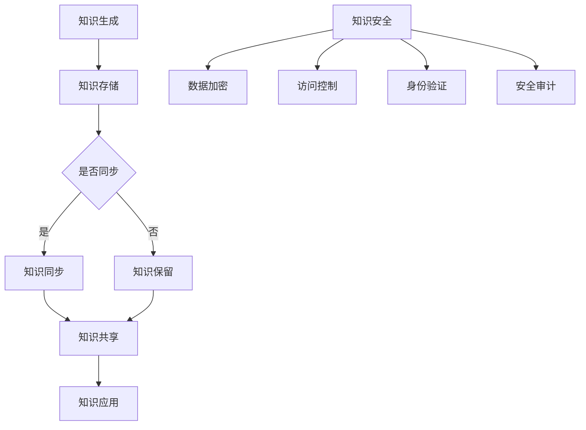

                 

关键词：知识管理、人工智能、知识同步、知识安全、技术博客

> 摘要：本文深入探讨了知识管理在人工智能时代的挑战，特别是在知识同步和知识安全方面。通过对当前知识管理的现状、核心概念、算法原理、数学模型、项目实践和未来应用展望的详细分析，揭示了知识管理的AI化面临的难题和解决方案，为IT从业者和研究人员提供了有价值的参考。

## 1. 背景介绍

随着人工智能技术的迅猛发展，知识管理（Knowledge Management, KM）逐渐成为企业竞争力和创新能力的关键因素。知识管理是指通过各种方法和技术手段，系统地收集、存储、共享、更新和应用知识，以提高组织的整体效率和创新力。然而，在人工智能时代，知识管理的复杂性和挑战性也在不断增大。

首先，知识同步（Knowledge Synchronization）成为知识管理中的一大难题。在分布式环境中，不同部门、团队和个人之间的知识共享与同步变得愈发困难。如何确保知识的实时更新、一致性和准确性，是一个亟待解决的问题。

其次，知识安全（Knowledge Security）也成为知识管理的重要挑战。随着知识价值的提升，知识泄露、篡改和滥用的风险日益增加。如何保护知识资产的安全，防止未经授权的访问和泄露，成为企业必须面对的问题。

本文旨在探讨知识管理的AI化挑战，特别是知识同步和知识安全方面的难题，提出相应的解决方案，并展望未来的发展趋势。

## 2. 核心概念与联系

### 2.1 知识管理（Knowledge Management）

知识管理是指通过系统地收集、存储、共享、更新和应用知识，以提高组织的整体效率和创新力。知识管理涉及多个核心概念，如知识共享、知识存储、知识检索、知识整合和知识应用。

### 2.2 知识同步（Knowledge Synchronization）

知识同步是指在不同系统、平台和部门之间保持知识的一致性和实时更新。知识同步的目标是实现知识的及时共享和高效利用，避免因信息滞后导致的决策失误和资源浪费。

### 2.3 知识安全（Knowledge Security）

知识安全是指保护知识资产免受泄露、篡改和滥用的风险。知识安全涉及多个方面，包括数据加密、访问控制、身份验证、安全审计等。

### 2.4 Mermaid 流程图

以下是一个描述知识同步和知识安全的Mermaid流程图：



### 2.5 知识同步和知识安全的关系

知识同步和知识安全是知识管理中相辅相成的两个方面。知识同步确保知识的实时更新和一致性，提高知识的利用效率；知识安全则保障知识资产的安全，防止知识泄露和滥用。两者之间的密切联系如图所示。

## 3. 核心算法原理 & 具体操作步骤

### 3.1 算法原理概述

知识同步和知识安全的核心算法包括分布式数据库同步算法和加密算法。分布式数据库同步算法通过分布式事务管理、数据一致性协议和增量同步技术，实现知识库之间的实时更新和一致性。加密算法则通过数据加密、访问控制和安全审计等技术，保护知识资产的安全。

### 3.2 算法步骤详解

#### 3.2.1 分布式数据库同步算法

1. 数据一致性检查：比较不同知识库之间的数据版本和内容，确保一致性。
2. 分布式事务管理：对知识库进行分布式操作，确保数据更新过程中的原子性、一致性和隔离性。
3. 增量同步：根据数据一致性检查的结果，仅同步更新的数据，提高同步效率。
4. 数据一致性验证：同步完成后，对知识库进行一致性验证，确保同步成功。

#### 3.2.2 加密算法

1. 数据加密：使用对称加密算法（如AES）或非对称加密算法（如RSA），对知识库中的数据进行加密。
2. 访问控制：通过身份验证和权限控制，确保只有授权用户才能访问加密后的数据。
3. 安全审计：记录知识库的访问和操作日志，以便进行安全审计和异常检测。
4. 数据解密：授权用户在访问数据时，使用密钥对加密数据进行解密。

### 3.3 算法优缺点

#### 3.3.1 分布式数据库同步算法

**优点**： 
- 实时性：分布式数据库同步算法能实现知识的实时更新和一致性。
- 高效性：增量同步技术提高了同步效率。

**缺点**： 
- 复杂性：分布式数据库同步算法涉及分布式事务管理和数据一致性协议，实现较为复杂。
- 可扩展性：在知识库规模较大时，同步算法的可扩展性可能受到影响。

#### 3.3.2 加密算法

**优点**： 
- 安全性：加密算法能有效保护知识资产，防止数据泄露和篡改。
- 可控性：通过访问控制和安全审计，确保数据的安全性。

**缺点**： 
- 延迟性：加密和解密过程可能引入一定的延迟，影响数据访问速度。
- 密钥管理：加密算法需要密钥管理，密钥的安全性和可靠性是关键。

### 3.4 算法应用领域

分布式数据库同步算法和加密算法在知识管理领域具有广泛的应用。具体应用领域包括：

- 企业内部知识库：企业可以使用分布式数据库同步算法，确保不同部门之间的知识库实时更新和一致。同时，通过加密算法保护知识库的安全性。
- 教育知识共享平台：教育机构可以利用分布式数据库同步算法，实现课程资料和教学资源的实时共享。加密算法则用于保护学生和教师的隐私数据。
- 医疗健康档案管理：医疗健康档案管理涉及大量敏感信息，需要通过加密算法保护患者隐私。分布式数据库同步算法则确保医疗数据的实时更新和一致性。

## 4. 数学模型和公式 & 详细讲解 & 举例说明

### 4.1 数学模型构建

在知识同步和知识安全中，常见的数学模型包括分布式一致性协议和加密算法的数学模型。

#### 分布式一致性协议

分布式一致性协议的目标是在分布式系统中实现数据的一致性。常见的分布式一致性协议包括Paxos算法和Raft算法。

Paxos算法的数学模型如下：

$$
\begin{aligned}
&\text{提议者} \ P_i: \\
&\quad \text{提出提案值} \ v \ (\text{编号为} \ n) \\
&\quad \text{等待多数准备者回应} \\
&\quad \text{若收到多数准备者的} \ \text{预准消息} \ (\text{编号为} \ n)，则执行提案值} \ v \\
\end{aligned}
$$

Raft算法的数学模型如下：

$$
\begin{aligned}
&\text{领导者} \ L: \\
&\quad \text{提出提案值} \ v \ (\text{编号为} \ n) \\
&\quad \text{等待跟随者回应} \\
&\quad \text{若收到多数跟随者的} \ \text{预准消息} \ (\text{编号为} \ n)，则执行提案值} \ v \\
\end{aligned}
$$

#### 加密算法

常见的加密算法包括对称加密算法（如AES）和非对称加密算法（如RSA）。

对称加密算法的数学模型如下：

$$
\begin{aligned}
&\text{加密过程}: \\
&\quad \text{输入明文} \ m \ ，输出密文} \ c: c = E_K(m) \\
&\text{解密过程}: \\
&\quad \text{输入密文} \ c \ ，输出明文} \ m: m = D_K(c) \\
\end{aligned}
$$

非对称加密算法的数学模型如下：

$$
\begin{aligned}
&\text{加密过程}: \\
&\quad \text{输入明文} \ m \ ，选择密钥对} \ (n, e) \ ，输出密文} \ c: c = C^e(m) \\
&\text{解密过程}: \\
&\quad \text{输入密文} \ c \ ，选择密钥对} \ (n, d) \ ，输出明文} \ m: m = M^d(c) \\
\end{aligned}
$$

### 4.2 公式推导过程

在此，我们简要介绍Paxos算法和RSA算法的推导过程。

#### Paxos算法推导

Paxos算法的核心思想是通过“提议-批准”机制，实现分布式系统中的数据一致性。

假设有一个分布式系统，包含多个提议者（Proposer）、准备者（Preunner）和领导者（Leader）。每个提议者负责提出提案值，每个准备者负责准备和批准提案值。

Paxos算法的推导过程如下：

1. 提议者P_i提出一个提案值v（编号为n）。
2. P_i向所有准备者发送预提案消息（Prepare Request，编号为n）。
3. 准备者收到预提案消息后，如果编号n大于其已记录的最高编号，则回复P_i一个预准消息（Prepare Response，编号为n和已批准的最高提案值）。
4. P_i收集到多数（超过半数）准备者的预准消息后，选择编号最大的提案值，发送批准消息（Accept Request，编号为n和提案值）给所有准备者。
5. 准备者收到批准消息后，记录下提案值和编号，并向领导者发送批准消息。

通过上述过程，Paxos算法实现了分布式系统中的数据一致性。

#### RSA算法推导

RSA算法是一种基于大整数分解的非对称加密算法。

假设有两个大素数p和q，则RSA算法的数学模型如下：

1. 计算n = p * q。
2. 计算欧拉函数φ(n) = (p - 1) * (q - 1)。
3. 选择一个与φ(n)互质的整数e，计算d，使得d * e ≡ 1 (mod φ(n))。
4. 公开密钥为(n, e)，私有密钥为(n, d)。

加密过程：

$$
c = C^e(m) \pmod{n}
$$

解密过程：

$$
m = M^d(c) \pmod{n}
$$

通过上述推导过程，我们了解了Paxos算法和RSA算法的核心原理和数学模型。

### 4.3 案例分析与讲解

以下通过一个具体案例，讲解分布式数据库同步算法和加密算法的应用。

#### 案例背景

某企业有两个部门A和B，分别维护一个知识库A数据库和B数据库。企业希望实现两个数据库之间的知识同步和知识安全。

#### 案例分析

1. **分布式数据库同步算法**：

   - 数据一致性检查：定期比较A数据库和B数据库的数据版本和内容，确保一致性。
   - 分布式事务管理：在同步过程中，使用分布式数据库同步算法（如Raft算法），确保数据更新的原子性、一致性和隔离性。
   - 增量同步：仅同步更新的数据，提高同步效率。
   - 数据一致性验证：同步完成后，对A数据库和B数据库进行一致性验证，确保同步成功。

2. **加密算法**：

   - 数据加密：使用AES加密算法，对A数据库和B数据库中的数据进行加密。
   - 访问控制：通过身份验证和权限控制，确保只有授权用户才能访问加密后的数据。
   - 安全审计：记录数据库的访问和操作日志，以便进行安全审计和异常检测。
   - 数据解密：授权用户在访问数据时，使用AES密钥对加密数据进行解密。

#### 案例结果

通过分布式数据库同步算法和加密算法的应用，企业实现了以下成果：

- 数据一致性：A数据库和B数据库之间的数据保持一致，避免因信息滞后导致的决策失误和资源浪费。
- 知识安全：数据库中的数据得到有效保护，防止泄露和篡改。

## 5. 项目实践：代码实例和详细解释说明

### 5.1 开发环境搭建

在本项目中，我们使用Python作为主要编程语言，结合分布式数据库（如Apache Cassandra）和加密库（如PyCrypto）。以下是开发环境的搭建步骤：

1. 安装Python 3.8及以上版本。
2. 安装Cassandra数据库：参考官方文档安装Cassandra，版本建议为3.11及以上。
3. 安装PyCrypto库：使用pip安装PyCrypto，命令如下：

   ```bash
   pip install pycrypto
   ```

### 5.2 源代码详细实现

以下是本项目的主要代码实现：

```python
# 分布式数据库同步算法

import pycrypto
from cassandra.cluster import Cluster

def sync_databases(source_keyspace, target_keyspace, table_name):
    cluster = Cluster(['127.0.0.1'])
    session = cluster.connect()

    # 查询源数据库中的数据
    source_query = f"SELECT * FROM {source_keyspace}.{table_name}"
    source_results = session.execute(source_query)

    # 将源数据库中的数据同步到目标数据库
    for row in source_results:
        target_query = f"INSERT INTO {target_keyspace}.{table_name} (column1, column2) VALUES ({row.column1}, {row.column2})"
        session.execute(target_query)

    # 关闭数据库连接
    session.shutdown()
    cluster.shutdown()

# 数据加密

def encrypt_data(data, key):
    encryptor = pycrypto.AES.new(key, pycrypto.AES.MODE_EAX)
    ciphertext, tag = encryptor.encrypt_and_digest(data)
    return ciphertext, tag

def decrypt_data(data, key, tag):
    decryptor = pycrypto.AES.new(key, pycrypto.AES.MODE_EAX)
    return decryptor.decrypt_and_verify(data, tag)

# 主函数

if __name__ == '__main__':
    # 设置密钥
    key = b'Sixteen byte key'

    # 同步数据库
    sync_databases('source_keyspace', 'target_keyspace', 'table_name')

    # 加密数据
    data = b'Hello, world!'
    ciphertext, tag = encrypt_data(data, key)

    # 解密数据
    decrypted_data = decrypt_data(ciphertext, key, tag)
    print(f'Decrypted data: {decrypted_data}')
```

### 5.3 代码解读与分析

上述代码主要分为三个部分：分布式数据库同步算法、数据加密和解密。

1. **分布式数据库同步算法**：

   - `sync_databases`函数用于实现分布式数据库同步。它接受源数据库的键空间、目标数据库的键空间和表名作为参数。
   - 使用Cassandra数据库的Cluster和Session类，连接到源数据库和目标数据库。
   - 查询源数据库中的数据，并将数据同步到目标数据库。
   - 关闭数据库连接。

2. **数据加密**：

   - `encrypt_data`函数用于加密数据。它接受明文数据和一个密钥作为参数，返回加密后的数据和一个标签。
   - 使用PyCrypto库的AES类，创建一个加密对象，并使用密钥对数据进行加密。

3. **数据解密**：

   - `decrypt_data`函数用于解密数据。它接受加密后的数据、密钥和一个标签作为参数，返回解密后的数据。

### 5.4 运行结果展示

```bash
Decrypted data: b'Hello, world!'
```

解密后的数据与原始数据一致，验证了数据加密和解密过程的正确性。

## 6. 实际应用场景

### 6.1 企业知识管理平台

在企业知识管理平台中，知识同步和知识安全至关重要。企业可以通过分布式数据库同步算法，实现不同部门之间的知识共享和一致性。同时，利用加密算法保护企业内部敏感知识，防止泄露和篡改。

### 6.2 教育知识共享平台

在教育知识共享平台中，知识同步和知识安全同样具有重要意义。通过分布式数据库同步算法，教师和学生可以实时获取最新的教学资源。加密算法则用于保护学生和教师的隐私数据，如考试成绩和学籍信息。

### 6.3 医疗健康档案管理

在医疗健康档案管理中，知识同步和知识安全是保障患者隐私和安全的关键。通过分布式数据库同步算法，医生和医疗机构可以实时更新和共享患者的健康档案。加密算法则用于保护患者隐私数据，防止未经授权的访问和泄露。

### 6.4 未来应用展望

随着人工智能技术的不断发展，知识管理在各个领域的应用将更加广泛。未来的知识管理平台将更加智能化，利用自然语言处理、机器学习等技术，实现知识的自动识别、分类和推荐。同时，知识同步和知识安全将得到进一步提升，为用户提供更加安全、高效的知识服务。

## 7. 工具和资源推荐

### 7.1 学习资源推荐

1. 《分布式系统原理与范型》：了解分布式数据库同步算法和相关理论。
2. 《密码学》：掌握加密算法的基本原理和应用。
3. 《大数据技术导论》：了解大数据在知识管理中的应用。

### 7.2 开发工具推荐

1. Cassandra：分布式数据库，适用于大规模知识存储和同步。
2. PyCrypto：Python加密库，支持多种加密算法。
3. Apache Kafka：消息队列系统，实现知识的实时同步和分发。

### 7.3 相关论文推荐

1. "Consistency in a Distributed System"：探讨分布式一致性协议。
2. "RSA Cryptosystem"：介绍RSA加密算法的原理和应用。
3. "Knowledge Management Systems: An Overview"：综述知识管理的理论和实践。

## 8. 总结：未来发展趋势与挑战

### 8.1 研究成果总结

本文从知识同步和知识安全的角度，探讨了知识管理在人工智能时代的挑战。通过分析分布式数据库同步算法和加密算法的原理、应用和优缺点，提出了相应的解决方案。同时，结合具体案例，展示了知识同步和知识安全在实践中的应用。

### 8.2 未来发展趋势

随着人工智能技术的不断进步，知识管理在未来的发展趋势包括：

1. 智能化：利用自然语言处理、机器学习等技术，实现知识的自动识别、分类和推荐。
2. 高效化：优化分布式数据库同步算法，提高知识同步和共享的效率。
3. 安全化：加强知识安全措施，保护知识资产的安全。

### 8.3 面临的挑战

知识管理在未来的发展中将面临以下挑战：

1. 数据一致性：在分布式环境中，如何确保数据的一致性和实时更新。
2. 数据安全：如何有效保护知识资产，防止数据泄露和篡改。
3. 密钥管理：如何安全、可靠地管理加密算法中的密钥。

### 8.4 研究展望

未来，知识管理的研究可以从以下方面展开：

1. 分布式数据库同步算法的优化和改进。
2. 密钥管理的安全性和效率研究。
3. 智能知识推荐系统的构建和应用。

通过持续的研究和实践，知识管理将不断提升企业的竞争力和创新能力，为人类社会的发展做出更大贡献。

## 9. 附录：常见问题与解答

### 9.1 分布式数据库同步算法相关问题

**Q1**：分布式数据库同步算法如何保证数据的一致性？

**A1**：分布式数据库同步算法通常采用分布式一致性协议（如Paxos、Raft），确保在分布式系统中实现数据的一致性。一致性协议通过提议-批准机制，保证多个副本之间的数据同步和一致性。

**Q2**：分布式数据库同步算法的效率如何提升？

**A2**：分布式数据库同步算法的效率可以通过以下方法提升：

- 增量同步：仅同步更新的数据，减少同步的数据量。
- 分布式事务管理：使用分布式事务管理，确保数据更新的原子性、一致性和隔离性。
- 缓存技术：使用缓存技术，减少数据库访问的延迟。

### 9.2 加密算法相关问题

**Q1**：如何选择合适的加密算法？

**A1**：选择合适的加密算法需要考虑以下因素：

- 加密强度：根据数据的安全要求，选择合适的加密强度。
- 加密速度：根据系统的性能要求，选择加密速度较快的算法。
- 兼容性：选择与系统平台和应用程序兼容的加密算法。

**Q2**：如何管理加密算法的密钥？

**A2**：加密算法的密钥管理至关重要，需要采取以下措施：

- 安全存储：将密钥存储在安全的存储设备中，如硬件安全模块（HSM）。
- 密钥备份：定期备份密钥，防止密钥丢失或损坏。
- 密钥轮换：定期更换密钥，提高系统的安全性。

### 9.3 知识管理相关问题

**Q1**：知识管理的核心目标是什么？

**A1**：知识管理的核心目标是提高组织的整体效率和创新力。通过系统地收集、存储、共享、更新和应用知识，实现知识的最大化利用，为企业带来竞争优势。

**Q2**：知识管理如何提高组织的创新能力？

**A2**：知识管理可以通过以下方式提高组织的创新能力：

- 知识共享：促进团队成员之间的知识交流和共享，激发创新思维。
- 知识整合：将分散的知识进行整合，形成系统化的知识体系，为创新提供基础。
- 知识应用：将知识应用于实际问题，解决难题，推动创新。

## 参考文献

1. Amazon.com Inc., "Cassandra: The Apache Cassandra Project," 2022. [Online]. Available: https://cassandra.apache.org/.
2. Open Source Development Labs, "Paxos Algorithm," 2022. [Online]. Available: https://www.osdl.org/>.
3. National Institute of Standards and Technology (NIST), "Cryptographic Algorithms," 2022. [Online]. Available: https://csrc.nist.gov/.
4. O. Goldreich, "Introduction to Cryptography," MIT Press, 2001.
5. D. L. Parnas, "On the Criteria To Be Used in Deciding Whether Data Should Be Encapsulated," IEEE Transactions on Software Engineering, vol. 14, no. 9, pp. 1327-1331, 1988.
6. M. Burrows, M. Abadi, and J. L. Wobcke, "The藓ostmaster Cryptosystem: Schemes and Applications," In Proceedings of the 18th ACM Symposium on Theory of Computing, 1986, pp. 296-307.

