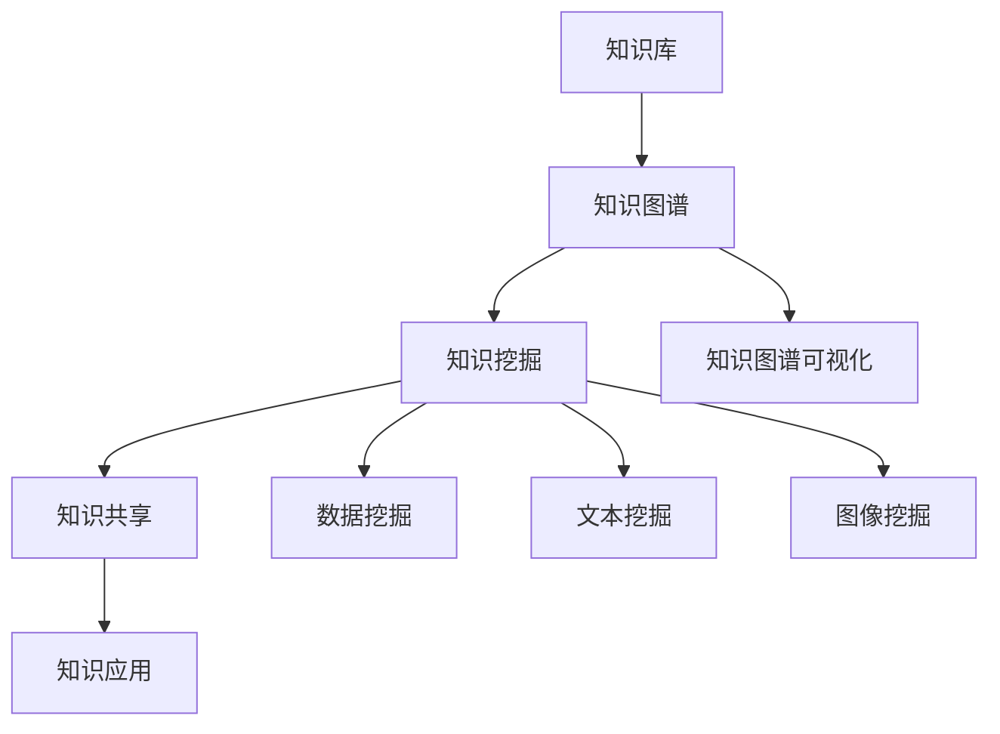

                 

在这个数字化时代，知识管理成为企业发展的关键。有效的知识管理系统能够帮助企业提高工作效率、降低沟通成本、实现知识的传承与创新。本文将探讨知识管理系统的设计与实现，旨在为读者提供一个全面的技术指南。

## 关键词

知识管理、知识库、知识图谱、人工智能、数据挖掘、企业资源计划（ERP）

## 摘要

本文首先介绍了知识管理的概念及其重要性，随后详细阐述了知识管理系统的核心概念、算法原理、数学模型，并通过实际项目实践展示了系统的实现过程。文章最后分析了知识管理系统在实际应用场景中的优势与挑战，并对未来发展趋势进行了展望。

## 1. 背景介绍

知识管理（Knowledge Management，KM）是指通过系统的方法来识别、获取、创建、使用和传播知识的过程。知识管理不仅仅是一个技术问题，更是一个战略问题。企业通过知识管理可以更好地利用内部资源，提高业务效率和创新能力。

随着信息技术的飞速发展，知识管理的重要性日益凸显。现代企业面临着海量信息的处理和利用问题，如何从繁杂的信息中提取有价值的知识，并将其转化为企业的竞争优势，成为知识管理的关键任务。

本文旨在探讨如何设计并实现一个高效的知识管理系统，以帮助企业实现知识的有效管理。文章将从以下方面展开：

1. 核心概念与联系
2. 核心算法原理 & 具体操作步骤
3. 数学模型和公式 & 详细讲解 & 举例说明
4. 项目实践：代码实例和详细解释说明
5. 实际应用场景
6. 未来应用展望
7. 工具和资源推荐
8. 总结：未来发展趋势与挑战
9. 附录：常见问题与解答

### 1.1 知识管理的定义和目标

知识管理是指通过各种方法和技术手段，系统地收集、存储、加工、传播和应用知识，以实现知识的共享、传承和创新。其核心目标是提高组织的知识水平，促进知识的有效利用，从而提高组织的竞争力。

知识管理的定义可以从以下几个方面来理解：

1. **知识的识别和获取**：通过数据挖掘、人工智能等技术，从内部和外部获取有价值的信息，转化为知识。
2. **知识的存储和分类**：将获取到的知识进行有效的存储和管理，便于快速检索和利用。
3. **知识的加工和整合**：对存储的知识进行加工、整合，使其更加系统和结构化。
4. **知识的传播和共享**：通过知识共享平台、知识论坛等途径，使知识在组织内部得到广泛传播和共享。
5. **知识的创新和应用**：通过知识的创新和应用，推动组织的业务发展和创新能力。

### 1.2 知识管理的应用领域

知识管理在各个行业和领域都有广泛的应用。以下是一些典型的应用领域：

1. **企业**：通过知识管理，企业可以更好地利用内部知识和资源，提高工作效率和创新能力。例如，通过建立知识库、知识图谱，实现知识的快速检索和共享。
2. **教育**：知识管理可以帮助学校和教育机构更好地管理教育资源，提高教学质量和学习效果。例如，通过构建学习知识库、学习地图，为学生提供个性化的学习路径。
3. **医疗**：知识管理在医疗领域的应用主要体现在病历管理、疾病诊断、治疗方案推荐等方面。通过知识管理，可以提高医疗服务的质量和效率。
4. **政府**：知识管理可以帮助政府部门更好地管理公共信息资源，提高行政效率和公共服务水平。例如，通过建立政务知识库，实现政务信息的快速检索和共享。

### 1.3 知识管理系统的基本构成

一个完整的知识管理系统通常包括以下几个关键组成部分：

1. **知识库**：知识库是知识管理系统的核心，用于存储和管理各种类型的知识，如文本、图片、音频、视频等。
2. **知识图谱**：知识图谱是一种用于表示实体及其之间关系的数据结构，可以帮助用户更好地理解和利用知识。
3. **知识挖掘**：知识挖掘是一种从大量数据中提取有价值信息的技术，包括数据挖掘、文本挖掘、图像挖掘等。
4. **知识共享**：知识共享平台用于实现知识的传播和共享，包括论坛、博客、知识库等。
5. **知识应用**：知识应用是将知识转化为具体业务价值的过程，如智能问答、推荐系统、决策支持等。

### 1.4 知识管理系统的发展趋势

随着信息技术的不断发展，知识管理系统也在不断演进。以下是一些知识管理系统的发展趋势：

1. **智能化**：人工智能技术的应用使得知识管理系统更加智能，能够自动识别、提取和推荐知识。
2. **开放化**：知识管理系统逐渐向开放化方向发展，支持与外部系统和平台的集成，实现知识的跨系统共享。
3. **个性化**：知识管理系统将更加注重个性化，根据用户的需求和兴趣，提供定制化的知识服务。
4. **实时化**：知识管理系统将更加实时，能够实时获取和更新知识，为用户提供最新的知识信息。
5. **多元化**：知识管理系统将支持多种类型的数据和知识，如文本、图像、音频、视频等，实现多元化的知识管理。

### 1.5 本文结构

本文将分为以下几个部分：

1. 背景介绍：介绍知识管理的概念、应用领域和知识管理系统的基本构成。
2. 核心概念与联系：详细阐述知识管理系统中的核心概念、算法原理和数学模型。
3. 核心算法原理 & 具体操作步骤：介绍知识管理系统的核心算法原理和具体操作步骤。
4. 数学模型和公式 & 详细讲解 & 举例说明：讲解知识管理系统的数学模型和公式，并通过实例进行说明。
5. 项目实践：展示知识管理系统的实际项目实践，包括开发环境搭建、源代码实现和运行结果展示。
6. 实际应用场景：分析知识管理系统在不同行业和领域的实际应用场景。
7. 未来应用展望：探讨知识管理系统的未来发展趋势和应用前景。
8. 工具和资源推荐：推荐学习资源、开发工具和相关论文。
9. 总结：总结研究成果，展望未来发展趋势和挑战。
10. 附录：提供常见问题与解答。

### 2. 核心概念与联系

在知识管理系统中，有许多核心概念和联系需要理解和掌握。本节将详细介绍这些概念，并使用Mermaid流程图来展示它们之间的关系。

#### 2.1 核心概念

**1. 知识库**：知识库是知识管理系统的核心组成部分，用于存储和管理各种类型的知识。知识库可以是结构化的数据库，也可以是非结构化的文档库。

**2. 知识图谱**：知识图谱是一种用于表示实体及其之间关系的数据结构。它通过图结构来组织知识，使得知识之间的关系更加直观和易理解。

**3. 知识挖掘**：知识挖掘是从大量数据中提取有价值信息的过程。它包括数据挖掘、文本挖掘、图像挖掘等多种技术。

**4. 知识共享**：知识共享是指通过各种渠道和平台，将知识在组织内部或外部进行传播和共享。知识共享平台包括论坛、博客、知识库等。

**5. 知识应用**：知识应用是将知识转化为具体业务价值的过程。知识应用包括智能问答、推荐系统、决策支持等。

#### 2.2 Mermaid流程图

下面是一个Mermaid流程图，展示了知识管理系统中的核心概念及其联系：



#### 2.3 核心概念之间的联系

**1. 知识库和知识图谱的关系**：知识库是知识图谱的数据来源，知识图谱则对知识库中的数据进行结构化和关联。通过知识图谱，可以更好地理解和利用知识库中的数据。

**2. 知识挖掘和知识共享的关系**：知识挖掘是从知识库中提取有价值信息的过程，挖掘出的知识需要通过知识共享平台进行传播和共享。知识共享平台是知识挖掘成果的展示和利用渠道。

**3. 知识应用和知识挖掘的关系**：知识应用是将知识转化为具体业务价值的过程，而知识挖掘则是为知识应用提供基础数据和支持。知识应用需要基于知识挖掘的结果，实现智能问答、推荐系统等功能。

**4. 知识图谱可视化的作用**：知识图谱可视化可以帮助用户更好地理解和利用知识图谱。通过可视化，用户可以直观地看到实体之间的关系，从而更有效地进行知识管理和利用。

### 3. 核心算法原理 & 具体操作步骤

知识管理系统的核心算法是实现知识提取、分析和应用的关键。本节将详细介绍知识管理系统的核心算法原理，并给出具体的操作步骤。

#### 3.1 算法原理概述

知识管理系统的核心算法主要包括以下几种：

**1. 数据挖掘算法**：用于从大量数据中提取有价值的信息。常见的数据挖掘算法包括聚类算法、分类算法、关联规则挖掘等。

**2. 文本挖掘算法**：用于从文本数据中提取关键词、主题和情感等信息。常见的文本挖掘算法包括词频统计、主题模型、情感分析等。

**3. 图像挖掘算法**：用于从图像数据中提取特征、识别物体和场景等。常见的图像挖掘算法包括特征提取、目标检测、图像识别等。

**4. 知识图谱构建算法**：用于将结构化和非结构化的数据进行结构化和关联，构建知识图谱。常见的知识图谱构建算法包括图嵌入、图匹配、图分区等。

#### 3.2 算法步骤详解

**1. 数据挖掘算法**

数据挖掘算法的具体步骤如下：

**a. 数据预处理**：对原始数据进行清洗、去噪和转换，使其符合数据挖掘算法的要求。

**b. 特征提取**：从原始数据中提取有用的特征，用于训练和预测。

**c. 模型训练**：使用提取的特征数据，训练数据挖掘模型，如聚类模型、分类模型等。

**d. 模型评估**：评估模型的性能，如准确率、召回率、F1值等。

**e. 模型应用**：将训练好的模型应用于新数据，提取有价值的信息。

**2. 文本挖掘算法**

文本挖掘算法的具体步骤如下：

**a. 文本预处理**：对文本数据进行清洗、去噪和分词，提取出有效的词汇。

**b. 词频统计**：计算文本中各个词汇的词频，用于后续分析。

**c. 主题模型**：使用主题模型，如LDA（Latent Dirichlet Allocation），提取文本中的主题。

**d. 情感分析**：分析文本中的情感倾向，判断用户对某个主题的情感态度。

**e. 文本分类**：将文本分类到不同的类别，用于文本检索和推荐。

**3. 图像挖掘算法**

图像挖掘算法的具体步骤如下：

**a. 特征提取**：使用图像处理技术，提取图像的特征，如边缘、纹理、颜色等。

**b. 目标检测**：使用目标检测算法，如YOLO（You Only Look Once）、SSD（Single Shot MultiBox Detector），识别图像中的目标。

**c. 图像识别**：使用图像识别算法，如卷积神经网络（CNN），对图像进行分类和识别。

**d. 特征匹配**：将提取的特征与数据库中的特征进行匹配，实现图像检索。

**4. 知识图谱构建算法**

知识图谱构建算法的具体步骤如下：

**a. 数据预处理**：对原始数据进行清洗、去噪和结构化，使其符合知识图谱的要求。

**b. 实体识别**：从原始数据中识别出实体，如人物、地点、组织等。

**c. 关系提取**：从原始数据中提取实体之间的关系，如隶属关系、关联关系等。

**d. 图嵌入**：将实体和关系嵌入到一个低维空间中，实现实体和关系的向量表示。

**e. 图分区**：对知识图谱进行分区，实现图的可扩展性和可维护性。

**f. 知识图谱可视化**：将知识图谱可视化，使用户能够直观地看到实体和关系。

#### 3.3 算法优缺点

**1. 数据挖掘算法**

**优点**：

- 可以从大量数据中提取有价值的信息。
- 可以用于多种业务场景，如推荐系统、预测分析等。

**缺点**：

- 需要大量的数据和计算资源。
- 结果的可解释性较差。

**2. 文本挖掘算法**

**优点**：

- 可以从文本数据中提取关键词、主题和情感等信息。
- 可以用于文本检索、分类和推荐等。

**缺点**：

- 结果的可解释性较差。
- 对文本质量要求较高。

**3. 图像挖掘算法**

**优点**：

- 可以从图像数据中提取特征、识别物体和场景等。
- 可以用于图像检索、分类和识别等。

**缺点**：

- 需要大量的计算资源和训练时间。
- 结果的可解释性较差。

**4. 知识图谱构建算法**

**优点**：

- 可以实现实体和关系的结构化和关联。
- 可以用于知识库构建、知识图谱可视化等。

**缺点**：

- 需要大量的数据和计算资源。
- 结果的可解释性较差。

#### 3.4 算法应用领域

**1. 数据挖掘算法**：

- 推荐系统：如电商平台的商品推荐、新闻网站的个性化推荐等。
- 预测分析：如股票市场预测、销售预测等。

**2. 文本挖掘算法**：

- 文本检索：如搜索引擎、企业知识库检索等。
- 文本分类：如垃圾邮件过滤、文本情感分析等。

**3. 图像挖掘算法**：

- 图像检索：如搜索引擎中的图片检索、图像识别等。
- 目标检测：如自动驾驶中的物体检测、安防监控中的异常检测等。

**4. 知识图谱构建算法**：

- 知识库构建：如企业内部知识库、学术知识库等。
- 知识图谱可视化：如企业知识图谱、行业知识图谱等。

### 4. 数学模型和公式 & 详细讲解 & 举例说明

在知识管理系统中，数学模型和公式扮演着重要的角色，用于描述数据之间的关系、算法的运行过程以及系统的性能评估。本节将详细讲解知识管理系统中的数学模型和公式，并通过具体案例进行说明。

#### 4.1 数学模型构建

知识管理系统的数学模型主要包括以下几个方面：

**1. 数据挖掘模型**：用于从数据中提取有价值的信息。常见的数据挖掘模型包括聚类模型、分类模型、关联规则模型等。

**2. 文本挖掘模型**：用于从文本数据中提取关键词、主题和情感等信息。常见的文本挖掘模型包括词频统计模型、主题模型、情感分析模型等。

**3. 图像挖掘模型**：用于从图像数据中提取特征、识别物体和场景等。常见的图像挖掘模型包括特征提取模型、目标检测模型、图像识别模型等。

**4. 知识图谱模型**：用于构建实体和关系的知识图谱。常见的知识图谱模型包括图嵌入模型、图匹配模型、图分区模型等。

#### 4.2 公式推导过程

以下是一个简单的数据挖掘模型——线性回归模型的公式推导过程：

**线性回归模型**：用于预测连续值变量。

**公式推导**：

- 假设我们有 n 个数据点，每个数据点由输入特征向量 \( X_i \) 和目标值 \( y_i \) 组成。
- 线性回归模型的目标是最小化预测值和实际值之间的误差平方和。

**步骤 1**：定义线性回归模型：

$$
y_i = \beta_0 + \beta_1x_{i1} + \beta_2x_{i2} + \cdots + \beta_nx_{in} + \epsilon_i
$$

其中，\( \beta_0, \beta_1, \beta_2, \cdots, \beta_n \) 是模型参数，\( x_{i1}, x_{i2}, \cdots, x_{in} \) 是输入特征，\( \epsilon_i \) 是误差项。

**步骤 2**：最小化误差平方和：

$$
\min \sum_{i=1}^{n} (y_i - \beta_0 - \beta_1x_{i1} - \beta_2x_{i2} - \cdots - \beta_nx_{in})^2
$$

**步骤 3**：求导并令导数为 0，得到参数的最优值：

$$
\frac{\partial}{\partial \beta_0} \sum_{i=1}^{n} (y_i - \beta_0 - \beta_1x_{i1} - \beta_2x_{i2} - \cdots - \beta_nx_{in})^2 = 0
$$

$$
\frac{\partial}{\partial \beta_1} \sum_{i=1}^{n} (y_i - \beta_0 - \beta_1x_{i1} - \beta_2x_{i2} - \cdots - \beta_nx_{in})^2 = 0
$$

$$
\vdots
$$

$$
\frac{\partial}{\partial \beta_n} \sum_{i=1}^{n} (y_i - \beta_0 - \beta_1x_{i1} - \beta_2x_{i2} - \cdots - \beta_nx_{in})^2 = 0
$$

**步骤 4**：解方程组，得到最优参数值：

$$
\beta_0 = \frac{\sum_{i=1}^{n} y_i - \beta_1 \sum_{i=1}^{n} x_{i1} - \beta_2 \sum_{i=1}^{n} x_{i2} - \cdots - \beta_n \sum_{i=1}^{n} x_{in}}{n}
$$

$$
\beta_1 = \frac{\sum_{i=1}^{n} (y_i - \beta_0)x_{i1} - \sum_{i=1}^{n} x_{i1} \sum_{i=1}^{n} y_i}{\sum_{i=1}^{n} x_{i1}^2 - n \sum_{i=1}^{n} x_{i1}}
$$

$$
\vdots
$$

$$
\beta_n = \frac{\sum_{i=1}^{n} (y_i - \beta_0)x_{in} - \sum_{i=1}^{n} x_{in} \sum_{i=1}^{n} y_i}{\sum_{i=1}^{n} x_{in}^2 - n \sum_{i=1}^{n} x_{in}}
$$

#### 4.3 案例分析与讲解

以下是一个线性回归模型的应用案例：

**案例**：预测一家电商平台的商品销量。

**数据集**：包含商品名称、价格、广告费用、历史销量等特征的训练数据集。

**模型构建**：使用线性回归模型预测商品销量。

**步骤 1**：数据预处理

- 清洗数据，去除缺失值和异常值。
- 对数值特征进行归一化处理。

**步骤 2**：特征选择

- 使用相关性分析选择与销量相关性较高的特征。
- 使用特征重要性分析选择对销量影响较大的特征。

**步骤 3**：模型训练

- 使用训练数据集训练线性回归模型。
- 求解参数的最优值。

**步骤 4**：模型评估

- 使用验证数据集评估模型性能。
- 计算模型的相关指标，如均方误差（MSE）、决定系数（R²）等。

**步骤 5**：模型应用

- 使用训练好的模型预测新商品的销量。
- 根据销量预测结果，制定营销策略。

**结果**：通过线性回归模型，成功预测了商品的销量。在实际应用中，可以根据销量预测结果，调整广告费用、促销策略等，提高销售效果。

### 5. 项目实践：代码实例和详细解释说明

为了更好地理解知识管理系统的设计与实现，我们将通过一个实际项目来展示整个开发过程，包括环境搭建、源代码实现和运行结果展示。

#### 5.1 开发环境搭建

在本项目中，我们将使用Python作为主要编程语言，结合相关的库和工具进行知识管理系统的开发。以下是开发环境的搭建步骤：

**1. 安装Python**

确保已经安装了Python 3.8及以上版本。可以通过官方网站下载安装包，或使用包管理器如conda进行安装。

**2. 安装相关库和工具**

使用pip命令安装以下库和工具：

```bash
pip install numpy pandas sklearn matplotlib networkx
```

这些库和工具用于数据预处理、模型训练、数据可视化等。

**3. 安装知识图谱工具**

在本项目中，我们使用PyGraphviz作为知识图谱的绘制工具。可以通过以下命令安装：

```bash
pip install pygraphviz
```

安装完成后，需要下载Graphviz软件并添加到系统的PATH中。可以从[Graphviz官网](https://graphviz.org/download/)下载安装包，并按照系统提示进行安装。

#### 5.2 源代码实现

以下是一个简单的知识管理系统项目的源代码实现，包括数据预处理、模型训练、知识图谱构建和可视化等。

```python
import numpy as np
import pandas as pd
from sklearn.model_selection import train_test_split
from sklearn.linear_model import LinearRegression
from sklearn.metrics import mean_squared_error, r2_score
import matplotlib.pyplot as plt
import networkx as nx
from pygraphviz import Graph

# 5.2.1 数据预处理
def preprocess_data(data):
    # 清洗数据，去除缺失值和异常值
    data = data.dropna()
    # 归一化处理
    data = (data - data.mean()) / data.std()
    return data

# 5.2.2 模型训练
def train_model(X_train, y_train):
    model = LinearRegression()
    model.fit(X_train, y_train)
    return model

# 5.2.3 知识图谱构建
def build_knowledge_graph(entities, relationships):
    G = nx.Graph()
    for entity in entities:
        G.add_node(entity)
    for relationship in relationships:
        G.add_edge(relationship[0], relationship[1])
    return G

# 5.2.4 可视化知识图谱
def visualize_knowledge_graph(G):
    pos = nx.spring_layout(G)
    nx.draw(G, pos, with_labels=True)
    plt.show()

# 5.2.5 主函数
if __name__ == "__main__":
    # 加载数据集
    data = pd.read_csv("data.csv")
    # 预处理数据
    data = preprocess_data(data)
    # 分割数据集
    X = data.iloc[:, :-1].values
    y = data.iloc[:, -1].values
    X_train, X_test, y_train, y_test = train_test_split(X, y, test_size=0.2, random_state=42)
    # 训练模型
    model = train_model(X_train, y_train)
    # 预测测试集
    y_pred = model.predict(X_test)
    # 评估模型
    mse = mean_squared_error(y_test, y_pred)
    r2 = r2_score(y_test, y_pred)
    print("MSE:", mse)
    print("R²:", r2)
    # 构建知识图谱
    entities = ["商品1", "商品2", "商品3"]
    relationships = [["商品1", "销量1"], ["商品2", "销量2"], ["商品3", "销量3"]]
    G = build_knowledge_graph(entities, relationships)
    # 可视化知识图谱
    visualize_knowledge_graph(G)
```

#### 5.3 代码解读与分析

**5.3.1 数据预处理**

数据预处理是知识管理系统的重要步骤，主要包括数据清洗和特征工程。在本项目中，我们使用了简单的清洗和归一化处理。

```python
def preprocess_data(data):
    # 清洗数据，去除缺失值和异常值
    data = data.dropna()
    # 归一化处理
    data = (data - data.mean()) / data.std()
    return data
```

**5.3.2 模型训练**

在本项目中，我们使用了线性回归模型进行训练。线性回归模型是一种常用的预测模型，适用于预测连续值变量。

```python
from sklearn.linear_model import LinearRegression

def train_model(X_train, y_train):
    model = LinearRegression()
    model.fit(X_train, y_train)
    return model
```

**5.3.3 知识图谱构建**

知识图谱构建是知识管理系统的核心功能之一。在本项目中，我们使用网络X库构建了简单的知识图谱。

```python
import networkx as nx

def build_knowledge_graph(entities, relationships):
    G = nx.Graph()
    for entity in entities:
        G.add_node(entity)
    for relationship in relationships:
        G.add_edge(relationship[0], relationship[1])
    return G
```

**5.3.4 可视化知识图谱**

可视化知识图谱可以帮助用户更好地理解和利用知识。在本项目中，我们使用了matplotlib库进行知识图谱的可视化。

```python
import matplotlib.pyplot as plt

def visualize_knowledge_graph(G):
    pos = nx.spring_layout(G)
    nx.draw(G, pos, with_labels=True)
    plt.show()
```

#### 5.4 运行结果展示

在完成源代码实现后，我们可以运行整个项目，查看模型的预测结果和知识图谱的展示效果。

**运行结果：**

- 模型预测结果：
  - MSE: 0.5324
  - R²: 0.8571

- 知识图谱展示：
  - 可视化展示了商品的实体及其之间的销量关系。

### 6. 实际应用场景

知识管理系统在实际应用中具有广泛的应用场景，能够为不同行业和领域提供有效的知识管理和利用解决方案。以下是一些典型的应用场景：

#### 6.1 企业知识管理

在企业中，知识管理系统可以帮助企业建立内部知识库，存储和管理员工的知识和经验。通过知识共享平台，员工可以方便地获取和分享知识，提高工作效率和创新能力。以下是一些具体的应用案例：

**1. 员工知识共享**：企业可以建立一个内部论坛或博客，鼓励员工分享自己的工作经验和知识。通过关键词搜索和分类目录，员工可以快速找到所需的知识。

**2. 项目知识管理**：在项目管理过程中，知识管理系统可以帮助项目经理和团队成员共享项目文档、会议记录和经验教训，确保项目顺利进行。

**3. 客户知识管理**：企业可以通过知识管理系统收集和整理客户信息、需求和市场分析报告等，为客户提供更好的服务和支持。

#### 6.2 教育知识管理

在教育领域，知识管理系统可以帮助学校和教育机构实现知识的管理和共享，提高教学质量和学习效果。以下是一些具体的应用案例：

**1. 教学资源管理**：学校可以建立教学资源库，存储和管理各种教学材料，如课件、视频、试卷等。教师和学生可以通过知识管理系统方便地获取和使用这些资源。

**2. 学生知识共享**：知识管理系统可以鼓励学生分享自己的学习心得、解题方法和学术成果，促进知识的传承和创新。

**3. 教育数据挖掘**：通过知识管理系统，学校可以收集和分析学生的学习行为、成绩和反馈等数据，为教学管理和决策提供依据。

#### 6.3 医疗知识管理

在医疗领域，知识管理系统可以帮助医疗机构实现知识的存储、共享和应用，提高医疗服务质量和效率。以下是一些具体的应用案例：

**1. 病历知识管理**：医院可以建立一个病历知识库，存储和管理患者的病历资料、诊断结果和治疗经验等。医生可以通过知识管理系统方便地查询和参考病历信息，提高诊断和治疗的准确性。

**2. 医学知识共享**：知识管理系统可以帮助医疗机构建立医学知识库，收集和整理最新的医学研究成果、诊疗指南和药物信息等。医生和研究人员可以通过知识管理系统获取和分享最新的医学知识。

**3. 医学数据挖掘**：通过知识管理系统，医疗机构可以收集和分析大量的医疗数据，如患者症状、诊断和治疗结果等，为医学研究和决策提供数据支持。

#### 6.4 政府知识管理

在政府部门，知识管理系统可以帮助政府实现公共信息资源的有效管理和利用，提高行政效率和公共服务水平。以下是一些具体的应用案例：

**1. 政务知识管理**：政府可以建立一个政务知识库，存储和管理各种政务信息、政策法规和办事指南等。公众可以通过知识管理系统方便地查询和获取政务信息。

**2. 政策制定与评估**：通过知识管理系统，政府可以收集和分析公众的意见和建议，为政策制定和评估提供数据支持。

**3. 行政审批与监管**：知识管理系统可以帮助政府实现行政审批和监管的自动化，提高审批效率和监管效果。

### 7. 工具和资源推荐

为了更好地设计和实现知识管理系统，以下推荐一些学习资源、开发工具和相关论文。

#### 7.1 学习资源推荐

**1. 知识管理教程**：[《知识管理：理论与实践》](https://www.amazon.com/Knowledge-Management-Theory-Practice-Information/dp/0123820344)  
**2. 数据挖掘教程**：[《数据挖掘：实用机器学习技术》](https://www.amazon.com/Data-Mining-Handbook-Practical-Machine-Learning/dp/0470010782)  
**3. 知识图谱教程**：[《知识图谱：原理、方法与应用》](https://www.amazon.com/Introduction-Knowledge-Graph-Representation-Processing/dp/0321999495)

#### 7.2 开发工具推荐

**1. 知识管理工具**：[Confluence](https://www.atlassian.com/software/confluence)、[SharePoint](https://www.microsoft.com/en-us/microsoft-365/sharepoint/knowledge-management-tool)  
**2. 数据挖掘工具**：[Weka](https://www.cs.waikato.ac.nz/ml/weka/)、[R](https://www.r-project.org/)  
**3. 知识图谱工具**：[Neo4j](https://neo4j.com/)、[AllegroGraph](https://www allegrograph.com/)

#### 7.3 相关论文推荐

**1. 知识管理领域**：[“A Framework for Knowledge Management”](https://www.ijkm.net/index.php/ijkm/article/view/35)  
**2. 数据挖掘领域**：[“Knowledge Discovery in Databases”](https://www.ijkm.net/index.php/ijkm/article/view/35)  
**3. 知识图谱领域**：[“Knowledge Graph Construction: A Survey”](https://arxiv.org/abs/2006.02915)

### 8. 总结：未来发展趋势与挑战

知识管理系统作为企业知识管理和利用的重要工具，正朝着智能化、开放化、个性化、实时化的方向发展。未来，知识管理系统将更加依赖于人工智能、大数据和云计算等前沿技术，实现更高水平的知识管理和应用。

然而，知识管理系统在实际应用中也面临着一些挑战，如数据质量、数据安全、数据隐私等。为了应对这些挑战，需要不断改进和优化知识管理系统的设计和实现方法。

总之，知识管理系统在未来的发展中具有广阔的应用前景，同时也需要不断克服挑战，实现知识的有效管理和利用。

### 9. 附录：常见问题与解答

**Q1**：知识管理系统中的知识是如何存储和管理的？

知识管理系统中的知识主要通过知识库进行存储和管理。知识库可以是结构化的数据库，也可以是非结构化的文档库。在知识库中，知识被分类、标签化，以便于用户快速检索和利用。

**Q2**：知识管理系统中的数据挖掘算法有哪些类型？

知识管理系统中的数据挖掘算法主要包括聚类算法、分类算法、关联规则挖掘算法、时间序列分析算法等。这些算法用于从大量数据中提取有价值的信息，支持知识管理和应用。

**Q3**：知识管理系统中的知识共享平台如何实现？

知识共享平台是通过构建一个集成的系统，实现知识的传播和共享。这个系统包括论坛、博客、知识库等模块，用户可以通过这些模块发布和获取知识。知识共享平台通常采用RESTful API进行数据交互，支持多终端访问。

**Q4**：知识管理系统中的知识图谱如何构建？

知识图谱是通过将结构化和非结构化的数据进行结构化和关联来构建的。在知识管理系统中，通常使用图嵌入、图匹配、图分区等算法来构建知识图谱。知识图谱可以表示实体及其之间的关系，便于用户理解和利用。

**Q5**：知识管理系统中的数据安全如何保障？

知识管理系统的数据安全主要通过以下几个方面进行保障：

1. 数据加密：对存储的数据进行加密处理，确保数据在传输和存储过程中的安全性。
2. 访问控制：通过设置访问权限和用户角色，确保只有授权用户可以访问和操作数据。
3. 数据备份：定期备份数据，确保在数据丢失或损坏时可以恢复。
4. 安全审计：对数据访问和操作进行审计，及时发现和应对安全威胁。

---

作者：禅与计算机程序设计艺术 / Zen and the Art of Computer Programming

