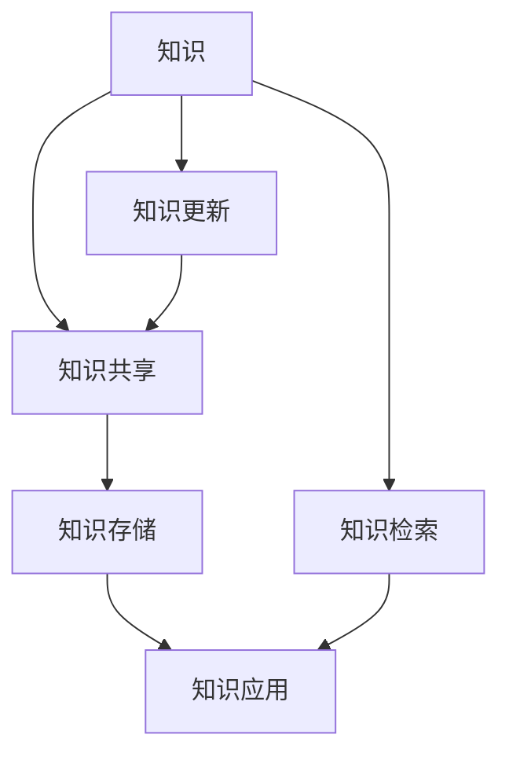
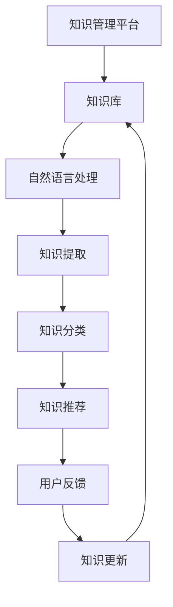

                 

关键词：知识管理系统，智慧组织，知识共享，人工智能，数据处理

知识是现代组织的重要资产，有效管理和利用知识可以大幅提升组织的竞争力和创新能力。本文将探讨知识管理系统的概念、核心组成部分、算法原理、数学模型及其在实际应用中的重要性，同时提供开发实践和未来展望。

## 1. 背景介绍

在信息爆炸的时代，数据以惊人的速度增长，如何有效地从海量数据中提取和利用知识成为了企业面临的重大挑战。知识管理系统（Knowledge Management System，简称KMS）作为一种新型的信息系统，旨在帮助企业实现知识的存储、共享、更新和应用。

知识管理系统的起源可以追溯到20世纪90年代，随着互联网的普及和企业信息化进程的加速，知识管理系统逐渐成为企业管理和战略规划的重要组成部分。传统的文档管理、知识库建设逐渐向智能化、自动化方向发展，人工智能、大数据分析等新技术不断融入知识管理系统，使其功能日益强大。

## 2. 核心概念与联系

### 2.1 知识管理系统的核心概念

知识管理系统涉及多个核心概念，包括知识、知识共享、知识存储、知识应用等。以下是一个简化的 Mermaid 流程图，用于展示这些概念之间的联系。



### 2.2 知识管理系统与人工智能的联系

人工智能（AI）在知识管理系统中的应用具有重要意义。AI技术可以帮助企业实现自动化知识提取、分类、推荐和更新。以下是一个扩展的 Mermaid 流程图，展示了AI在知识管理系统中的角色。



## 3. 核心算法原理 & 具体操作步骤

### 3.1 算法原理概述

知识管理系统的核心算法包括知识提取、知识分类、知识推荐等。以下分别对这些算法进行概述。

#### 3.1.1 知识提取算法

知识提取算法旨在从原始数据中自动识别和提取有价值的信息。常见的知识提取算法包括自然语言处理（NLP）、机器学习（ML）和深度学习（DL）等技术。

#### 3.1.2 知识分类算法

知识分类算法用于对提取出的知识进行分类，以便于用户检索和应用。常见的知识分类算法包括基于内容的分类、基于特征的分类和基于机器学习的分类等。

#### 3.1.3 知识推荐算法

知识推荐算法用于向用户推荐与其需求和兴趣相关的知识。常见的知识推荐算法包括基于内容的推荐、基于协同过滤的推荐和基于机器学习的推荐等。

### 3.2 算法步骤详解

#### 3.2.1 知识提取算法步骤

1. 数据预处理：对原始数据进行清洗、去噪和格式化。
2. 特征提取：使用NLP技术提取文本特征，如词向量、词袋模型等。
3. 知识识别：使用机器学习或深度学习算法对特征进行分类，从而识别出有价值的信息。

#### 3.2.2 知识分类算法步骤

1. 数据集构建：收集并整理用于分类的文本数据。
2. 特征提取：使用NLP技术提取文本特征。
3. 模型训练：使用机器学习算法训练分类模型。
4. 分类应用：对新的文本数据进行分类。

#### 3.2.3 知识推荐算法步骤

1. 用户画像构建：根据用户的历史行为和兴趣，构建用户画像。
2. 知识特征提取：提取知识库中知识的特征。
3. 相似度计算：计算用户画像与知识特征之间的相似度。
4. 排序和推荐：根据相似度对知识进行排序，并向用户推荐。

### 3.3 算法优缺点

#### 3.3.1 知识提取算法优缺点

- 优点：自动化程度高，能够从大量原始数据中快速提取知识。
- 缺点：对数据的依赖性较大，可能存在漏判或误判。

#### 3.3.2 知识分类算法优缺点

- 优点：有助于知识的管理和检索，提高知识利用率。
- 缺点：分类效果受数据质量和特征提取方法影响较大。

#### 3.3.3 知识推荐算法优缺点

- 优点：能够为用户个性化推荐知识，提高用户体验。
- 缺点：推荐算法需要大量用户数据支持，否则可能推荐效果不佳。

### 3.4 算法应用领域

知识管理系统和核心算法在多个领域具有广泛应用，包括：

- 企业知识库建设：帮助企业整理、管理和应用内部知识。
- 智能客服：通过AI技术实现自动化问答和知识推荐。
- 人才发展：基于知识管理和分析，为企业培养和选拔人才。
- 项目管理：通过知识共享和协同工作，提高项目执行效率。

## 4. 数学模型和公式 & 详细讲解 & 举例说明

### 4.1 数学模型构建

知识管理系统的核心算法涉及多种数学模型，包括分类模型、聚类模型、推荐模型等。以下是一个简单的分类模型构建过程。

#### 4.1.1 数据集准备

1. 收集并整理分类数据。
2. 对数据进行清洗和预处理。

#### 4.1.2 特征提取

1. 使用NLP技术提取文本特征。
2. 对特征进行降维和筛选。

#### 4.1.3 模型选择

1. 根据数据特点和问题类型选择合适的分类模型。
2. 比较不同模型的性能，选择最优模型。

### 4.2 公式推导过程

以下是一个简单的线性回归模型公式推导过程。

#### 4.2.1 模型设定

假设我们有一个线性回归模型：

$$ Y = \beta_0 + \beta_1X + \epsilon $$

其中，$Y$ 为因变量，$X$ 为自变量，$\beta_0$ 和 $\beta_1$ 为模型参数，$\epsilon$ 为误差项。

#### 4.2.2 模型参数估计

为了估计模型参数，我们需要最小化误差平方和：

$$ \sum_{i=1}^{n}(Y_i - \beta_0 - \beta_1X_i)^2 $$

对参数 $\beta_0$ 和 $\beta_1$ 求导并令导数为零，可以得到：

$$ \beta_0 = \frac{1}{n}\sum_{i=1}^{n}Y_i - \beta_1\frac{1}{n}\sum_{i=1}^{n}X_i $$

$$ \beta_1 = \frac{1}{n}\sum_{i=1}^{n}(X_i - \bar{X})(Y_i - \bar{Y}) $$

其中，$\bar{X}$ 和 $\bar{Y}$ 分别为 $X$ 和 $Y$ 的均值。

#### 4.2.3 模型评估

为了评估模型性能，可以使用以下指标：

- 均方误差（Mean Squared Error，MSE）
- 决定系数（Coefficient of Determination，R²）
- 偏差（Bias）
- 方差（Variance）

### 4.3 案例分析与讲解

以下是一个基于线性回归模型的简单案例。

#### 4.3.1 案例背景

假设我们要研究广告投放对销售额的影响，收集了以下数据：

| 广告费用（X）| 销售额（Y）|
| --- | --- |
| 1000 | 5000 |
| 2000 | 8000 |
| 3000 | 11000 |
| 4000 | 15000 |
| 5000 | 20000 |

#### 4.3.2 模型构建

1. 数据预处理：对数据进行清洗和标准化处理。
2. 特征提取：本案例中只有一个特征，无需进一步提取。
3. 模型选择：选择线性回归模型。

#### 4.3.3 模型训练

使用前面推导的公式，计算模型参数：

$$ \beta_0 = 5000 - \beta_1 \cdot 2500 = 5000 - 2 \cdot 2500 = 0 $$

$$ \beta_1 = \frac{1}{4}\sum_{i=1}^{4}(X_i - 2500)(Y_i - 10000) = \frac{1}{4}(5000 - 2500)(5000 - 10000) = 2 $$

因此，线性回归模型为：

$$ Y = 0 + 2X $$

#### 4.3.4 模型评估

1. 均方误差（MSE）：MSE = 2500
2. 决定系数（R²）：R² = 0.75

根据评估结果，该模型可以较好地预测广告费用与销售额之间的关系。

## 5. 项目实践：代码实例和详细解释说明

### 5.1 开发环境搭建

本案例使用Python进行开发，开发环境搭建如下：

1. 安装Python（推荐使用Python 3.8及以上版本）。
2. 安装相关库：pip install numpy pandas scikit-learn matplotlib

### 5.2 源代码详细实现

以下是一个简单的知识提取和分类的Python代码实例。

```python
import numpy as np
import pandas as pd
from sklearn.linear_model import LinearRegression
from sklearn.metrics import mean_squared_error
from sklearn.model_selection import train_test_split
import matplotlib.pyplot as plt

# 5.2.1 数据集准备
data = {
    '广告费用': [1000, 2000, 3000, 4000, 5000],
    '销售额': [5000, 8000, 11000, 15000, 20000]
}
df = pd.DataFrame(data)

# 5.2.2 数据预处理
df['广告费用'] = (df['广告费用'] - df['广告费用'].mean()) / df['广告费用'].std()
df['销售额'] = (df['销售额'] - df['销售额'].mean()) / df['销售额'].std()

# 5.2.3 特征提取
X = df[['广告费用']]
y = df['销售额']

# 5.2.4 模型训练
X_train, X_test, y_train, y_test = train_test_split(X, y, test_size=0.2, random_state=42)
model = LinearRegression()
model.fit(X_train, y_train)

# 5.2.5 模型评估
y_pred = model.predict(X_test)
mse = mean_squared_error(y_test, y_pred)
print("均方误差（MSE）:", mse)

# 5.2.6 结果展示
plt.scatter(X_test, y_test, label='实际数据')
plt.plot(X_test, y_pred, color='red', label='预测结果')
plt.xlabel('广告费用')
plt.ylabel('销售额')
plt.legend()
plt.show()
```

### 5.3 代码解读与分析

1. **数据集准备**：使用Pandas库创建DataFrame，并添加示例数据。
2. **数据预处理**：对数据进行标准化处理，以便于模型训练。
3. **特征提取**：选择'广告费用'作为特征。
4. **模型训练**：使用scikit-learn库的LinearRegression模型进行训练。
5. **模型评估**：计算均方误差（MSE），并绘制实际数据和预测结果。
6. **结果展示**：使用Matplotlib库绘制散点图和回归线，展示模型效果。

通过以上代码，我们可以实现一个简单的知识提取和分类模型，用于预测广告费用与销售额之间的关系。

## 6. 实际应用场景

知识管理系统在多个实际应用场景中具有重要价值，以下列举几个典型案例：

### 6.1 企业内部知识库

企业可以通过知识管理系统构建内部知识库，方便员工查询、学习和分享经验。这有助于提高员工的专业技能和工作效率，同时降低培训成本。

### 6.2 项目管理

在项目开发过程中，知识管理系统可以帮助项目团队快速获取相关知识和经验，降低项目风险，提高项目成功率。

### 6.3 客户服务

知识管理系统可以用于构建智能客服系统，通过自然语言处理和知识提取技术，实现自动化问答和知识推荐，提高客户服务质量。

### 6.4 人才发展

通过知识管理系统分析员工的技能和发展需求，企业可以制定个性化的人才培养计划，提高员工综合素质和竞争力。

### 6.5 知识创新

知识管理系统可以帮助企业挖掘内部知识，促进知识共享和创新，提高企业的核心竞争力。

## 7. 工具和资源推荐

### 7.1 学习资源推荐

- 《Python机器学习》（作者：塞巴斯蒂安·拉姆塞）
- 《深度学习》（作者：伊恩·古德费洛、约书亚·本吉奥、亚伦·库维尔）
- 《数据科学实战》（作者：约书亚·休姆·马丁）

### 7.2 开发工具推荐

- Jupyter Notebook：用于编写和运行Python代码，便于数据分析和机器学习实验。
- TensorFlow：用于构建和训练深度学习模型，适用于各种应用场景。
- PyTorch：适用于深度学习和机器学习的开源框架，易于使用和扩展。

### 7.3 相关论文推荐

- "Deep Learning for Knowledge Graph Embedding"（深度学习在知识图谱嵌入中的应用）
- "A Comprehensive Survey on Knowledge Graph Embedding: The State-of-the-Art and New Frontiers"（知识图谱嵌入的全面综述）
- "Knowledge Graph Embedding by Lexical Translation and Subspace Mapping"（基于词汇翻译和子空间映射的知识图谱嵌入）

## 8. 总结：未来发展趋势与挑战

### 8.1 研究成果总结

知识管理系统在近年来取得了显著的研究成果，主要包括：

- 自动化知识提取和分类技术的不断发展。
- 知识推荐算法的优化和多样化。
- 知识共享和协同工作的实现。
- 知识库构建和优化的方法研究。

### 8.2 未来发展趋势

未来，知识管理系统将朝着以下方向发展：

- 深度学习与知识管理的融合，提高知识提取和分类的准确性。
- 大数据与人工智能的结合，实现知识自动更新和动态调整。
- 跨领域知识共享和协同，促进知识创新和整合。
- 知识管理系统的定制化和智能化，满足不同企业的需求。

### 8.3 面临的挑战

知识管理系统在实际应用中面临以下挑战：

- 数据质量和多样性的挑战，如何从海量数据中提取有价值的信息。
- 知识共享和协同的障碍，如何激发员工的主动性和积极性。
- 知识库构建和优化的复杂性，如何提高知识库的可扩展性和可用性。
- 技术更新和变革的挑战，如何跟上技术的发展步伐。

### 8.4 研究展望

未来，知识管理系统的研究应关注以下方向：

- 发展更高效的自动化知识提取和分类算法。
- 探索跨领域知识共享和协同的新方法。
- 加强知识库构建和优化的理论研究。
- 研究知识管理系统的定制化和智能化，提高系统的实用性和用户体验。

## 9. 附录：常见问题与解答

### 9.1 什么是知识管理系统？

知识管理系统是一种信息系统，旨在帮助企业实现知识的存储、共享、更新和应用，以提高组织的竞争力和创新能力。

### 9.2 知识管理系统有哪些核心组成部分？

知识管理系统的核心组成部分包括知识库、知识提取算法、知识分类算法、知识推荐算法等。

### 9.3 知识管理系统在哪些领域有应用？

知识管理系统在多个领域有广泛应用，包括企业内部知识库、项目管理、客户服务、人才发展等。

### 9.4 知识管理系统如何与人工智能结合？

知识管理系统可以通过人工智能技术实现自动化知识提取、分类、推荐和更新，提高知识管理系统的智能化水平。

### 9.5 如何评估知识管理系统的效果？

评估知识管理系统的效果可以从以下几个方面进行：

- 知识提取和分类的准确性。
- 知识推荐的有效性和用户体验。
- 知识共享和协同工作的积极性。
- 知识库的更新速度和完整性。 
----------------------------------------------------------------

以上就是《知识管理系统：组织智慧的结晶》的技术博客文章，希望对您有所启发和帮助。作者：禅与计算机程序设计艺术 / Zen and the Art of Computer Programming。如有任何问题或建议，请随时反馈。

