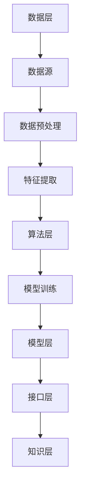

                 

在当今信息爆炸的时代，知识管理软件的作用日益凸显。它们帮助组织和企业有效收集、存储、整理、和利用知识，从而提高工作效率、创新能力和竞争力。本文将聚焦于一种新兴的智能知识管理工具——知识发现引擎，探讨其原理、应用、实现和未来展望。

## 关键词

知识管理、知识发现引擎、智能化、信息检索、数据挖掘

## 摘要

本文旨在探讨知识管理软件中的知识发现引擎如何通过智能化技术提高信息检索和数据挖掘的效率。我们将首先介绍知识管理软件的背景和重要性，然后深入分析知识发现引擎的核心概念和架构。接着，文章将阐述知识发现引擎的算法原理和实现步骤，并通过实例展示其在实际项目中的应用。最后，文章将讨论知识发现引擎的未来发展方向和面临的挑战。

### 1. 背景介绍

#### 1.1 知识管理软件的重要性

知识管理软件（Knowledge Management Software）是现代企业和组织中不可或缺的工具。它们旨在帮助企业和组织系统化地收集、存储、整理、和利用各种知识资源，从而提高工作效率、创新能力和竞争力。具体来说，知识管理软件具有以下几大作用：

- **知识收集与存储**：通过知识管理软件，企业和组织可以方便地收集和存储来自内部和外部的各种知识资源，包括文档、报告、电子邮件、会议记录等。

- **知识整理与共享**：知识管理软件提供了一系列的整理和共享功能，使得知识能够被有效地整理、分类和索引，方便用户查找和使用。

- **知识挖掘与利用**：通过数据挖掘和分析技术，知识管理软件可以从海量的知识资源中挖掘出有价值的信息和洞见，支持企业的决策和战略规划。

#### 1.2 知识管理软件的发展历程

知识管理软件的发展历程可以追溯到20世纪90年代。当时，随着互联网的兴起和企业信息化进程的推进，知识管理成为企业管理领域的一个重要研究方向。早期的知识管理软件主要集中在知识存储和共享方面，如文档管理系统（Document Management System，DMS）和内容管理系统（Content Management System，CMS）。这些系统提供了基本的文档管理和共享功能，但并未涉及更深入的知识挖掘和分析。

随着大数据和人工智能技术的快速发展，知识管理软件的功能和性能得到了显著提升。现代的知识管理软件不仅能够存储和共享知识，还能通过智能算法从海量数据中挖掘出有价值的信息，提供智能推荐、决策支持等功能。这一变化极大地提升了知识管理软件的价值和应用范围。

#### 1.3 知识管理软件的分类

根据功能和应用场景的不同，知识管理软件可以分为以下几类：

- **文档管理系统（DMS）**：主要用于存储和共享各种文档和文件，提供基本的版本控制和权限管理功能。

- **内容管理系统（CMS）**：主要用于创建、管理和发布内容，如网站、博客等。

- **知识库系统（KBMS）**：主要用于存储和管理各种知识资源，提供知识检索和共享功能。

- **专家系统（ES）**：基于人工智能和机器学习技术，模拟人类专家的决策过程，提供专业知识和咨询服务。

- **知识发现引擎（KDE）**：通过数据挖掘和机器学习算法，从海量数据中挖掘出有价值的信息和洞见。

本文将重点讨论知识发现引擎，探讨其智能化应用如何提升知识管理的效率和效果。

### 2. 核心概念与联系

#### 2.1 知识发现引擎的定义

知识发现引擎（Knowledge Discovery Engine，KDE）是一种智能化的知识管理工具，通过数据挖掘、机器学习和自然语言处理等算法，从海量数据中自动识别、提取和呈现潜在的知识和价值。知识发现引擎的主要目标是发现数据中的模式、关联和趋势，从而帮助用户快速获取有价值的信息。

#### 2.2 知识发现引擎的核心概念

- **数据源**：知识发现引擎的数据来源可以是内部数据，如企业内部的文档、报告、数据库等，也可以是外部数据，如互联网、社交媒体等。

- **数据预处理**：在数据挖掘之前，需要对数据进行清洗、去噪、转换和整合，以提高数据的质量和一致性。

- **特征提取**：从原始数据中提取出对知识发现任务有用的特征，如关键词、主题、情感等。

- **模型训练**：使用机器学习和深度学习算法，对特征进行建模和训练，以构建出能够识别和预测知识的模型。

- **结果评估**：对模型的预测结果进行评估和验证，确保模型的准确性和可靠性。

- **知识呈现**：将挖掘出的知识以可视化、报告等形式呈现给用户，帮助用户理解和利用这些知识。

#### 2.3 知识发现引擎的架构

知识发现引擎的架构可以分为以下几个部分：

- **数据层**：包括数据源、数据预处理和特征提取模块。

- **算法层**：包括机器学习和深度学习算法，用于构建和训练模型。

- **模型层**：包括训练好的模型，用于知识发现和预测。

- **接口层**：提供用户交互界面，支持用户输入数据、查看结果和调整参数。

- **知识层**：将挖掘出的知识进行整合和呈现，为用户提供有价值的信息。


#### 2.4 知识发现引擎的Mermaid流程图



### 3. 核心算法原理 & 具体操作步骤

#### 3.1 算法原理概述

知识发现引擎的核心算法主要包括数据挖掘算法和机器学习算法。数据挖掘算法用于从数据中发现潜在的模式和关联，而机器学习算法则用于训练模型，实现自动化的知识发现。

- **数据挖掘算法**：常见的数据挖掘算法包括关联规则挖掘、聚类分析、分类和预测等。这些算法通过分析数据中的统计关系和规律，发现数据中的隐藏模式和趋势。

- **机器学习算法**：常见的机器学习算法包括决策树、支持向量机、神经网络、聚类算法等。这些算法通过学习数据中的特征和模式，构建出能够进行预测和分类的模型。

#### 3.2 算法步骤详解

- **数据收集**：从各种数据源收集原始数据，包括内部数据和外部数据。

- **数据预处理**：对原始数据进行清洗、去噪、转换和整合，以提高数据的质量和一致性。

- **特征提取**：从预处理后的数据中提取出对知识发现任务有用的特征，如关键词、主题、情感等。

- **模型训练**：选择合适的机器学习算法，对特征进行建模和训练，以构建出能够识别和预测知识的模型。

- **模型评估**：对模型的预测结果进行评估和验证，确保模型的准确性和可靠性。

- **知识提取**：使用训练好的模型对新的数据进行知识发现，提取出有价值的信息和洞见。

- **知识呈现**：将挖掘出的知识以可视化、报告等形式呈现给用户，帮助用户理解和利用这些知识。

#### 3.3 算法优缺点

- **优点**：
  - **高效性**：通过自动化算法，可以快速从海量数据中挖掘出有价值的信息。
  - **灵活性**：支持多种数据挖掘和机器学习算法，适用于各种不同的知识发现任务。
  - **可扩展性**：能够处理大规模数据和复杂场景，支持分布式计算和云计算。

- **缺点**：
  - **准确性**：算法的准确性和可靠性受到数据质量和算法选择的影响。
  - **复杂性**：算法实现和模型训练过程相对复杂，需要一定的专业知识和技能。
  - **数据依赖**：算法的性能和效果受到数据质量和数量的影响，数据质量和多样性是关键。

#### 3.4 算法应用领域

知识发现引擎在多个领域得到了广泛应用，包括：

- **企业知识管理**：通过知识发现引擎，企业可以挖掘出员工的知识和经验，实现知识共享和传承。

- **市场分析**：通过对市场数据的挖掘，企业可以了解消费者需求、市场趋势和竞争状况，制定更有效的营销策略。

- **医学研究**：通过对医疗数据的挖掘，医学研究者可以发现新的疾病模式、治疗方案和预测疾病风险。

- **智能推荐系统**：通过对用户数据的挖掘，智能推荐系统可以推荐用户感兴趣的内容和产品，提高用户体验和转化率。

### 4. 数学模型和公式 & 详细讲解 & 举例说明

#### 4.1 数学模型构建

知识发现引擎的数学模型主要包括数据挖掘算法和机器学习算法的数学模型。以下以关联规则挖掘算法为例，介绍数学模型的构建。

- **支持度（Support）**：表示某个关联规则在数据集中出现的频率。计算公式为：

  $$ Support(A \land B) = \frac{count(A \land B)}{count(D)} $$

  其中，$A$ 和 $B$ 分别表示两个事件，$count(A \land B)$ 表示同时发生 $A$ 和 $B$ 的数据条数，$count(D)$ 表示总的数据条数。

- **置信度（Confidence）**：表示在事件 $A$ 发生的前提下，事件 $B$ 也发生的概率。计算公式为：

  $$ Confidence(A \rightarrow B) = \frac{Support(A \land B)}{Support(A)} $$

- **lift（提升度）**：表示关联规则的有效性，计算公式为：

  $$ Lift(A \rightarrow B) = \frac{Confidence(A \rightarrow B)}{P(B)} $$

  其中，$P(B)$ 表示事件 $B$ 发生的概率。

#### 4.2 公式推导过程

以关联规则挖掘为例，我们推导支持度、置信度和提升度的计算过程。

1. **支持度计算**：

   $$ Support(A \land B) = \frac{count(A \land B)}{count(D)} $$

   其中，$count(A \land B)$ 表示同时满足事件 $A$ 和 $B$ 的数据条数，可以通过遍历数据集进行统计。

2. **置信度计算**：

   $$ Confidence(A \rightarrow B) = \frac{Support(A \land B)}{Support(A)} $$

   其中，$Support(A)$ 表示事件 $A$ 的支持度，可以通过遍历数据集进行统计。

3. **提升度计算**：

   $$ Lift(A \rightarrow B) = \frac{Confidence(A \rightarrow B)}{P(B)} $$

   其中，$P(B)$ 表示事件 $B$ 的支持度，可以通过遍历数据集进行统计。

#### 4.3 案例分析与讲解

以一个简单的购物篮数据集为例，分析关联规则挖掘的过程。

假设一个购物篮数据集包含以下商品：

- 商品1：牛奶
- 商品2：面包
- 商品3：鸡蛋
- 商品4：橙子

数据集中的每条记录表示一个购物篮，如下所示：

| 购物篮 | 商品1 | 商品2 | 商品3 | 商品4 |
| --- | --- | --- | --- | --- |
| 1 | 牛奶 | 是 | 否 | 否 |
| 2 | 牛奶 | 否 | 是 | 是 |
| 3 | 牛奶 | 是 | 是 | 否 |
| 4 | 牛奶 | 否 | 是 | 是 |
| 5 | 面包 | 是 | 否 | 是 |
| 6 | 面包 | 否 | 是 | 否 |
| 7 | 鸡蛋 | 是 | 否 | 是 |
| 8 | 鸡蛋 | 否 | 是 | 是 |
| 9 | 橙子 | 是 | 是 | 是 |

1. **支持度计算**：

   - 牛奶和面包同时出现的支持度：

     $$ Support(牛奶 \land 面包) = \frac{count(牛奶 \land 面包)}{count(D)} = \frac{2}{9} \approx 0.222 $$

   - 牛奶和鸡蛋同时出现的支持度：

     $$ Support(牛奶 \land 鸡蛋) = \frac{count(牛奶 \land 鸡蛋)}{count(D)} = \frac{2}{9} \approx 0.222 $$

2. **置信度计算**：

   - 牛奶导致面包的置信度：

     $$ Confidence(牛奶 \rightarrow 面包) = \frac{Support(牛奶 \land 面包)}{Support(牛奶)} = \frac{0.222}{0.444} \approx 0.5 $$

   - 牛奶导致鸡蛋的置信度：

     $$ Confidence(牛奶 \rightarrow 鸡蛋) = \frac{Support(牛奶 \land 鸡蛋)}{Support(牛奶)} = \frac{0.222}{0.444} \approx 0.5 $$

3. **提升度计算**：

   - 牛奶导致面包的提升度：

     $$ Lift(牛奶 \rightarrow 面包) = \frac{Confidence(牛奶 \rightarrow 面包)}{P(面包)} = \frac{0.5}{0.444} \approx 1.13 $$

   - 牛奶导致鸡蛋的提升度：

     $$ Lift(牛奶 \rightarrow 鸡蛋) = \frac{Confidence(牛奶 \rightarrow 鸡蛋)}{P(鸡蛋)} = \frac{0.5}{0.333} \approx 1.5 $$

通过计算支持度、置信度和提升度，我们可以发现牛奶和面包、牛奶和鸡蛋之间存在较强的关联性。在实际应用中，这些关联规则可以帮助商家制定促销策略，提高销售转化率。

### 5. 项目实践：代码实例和详细解释说明

#### 5.1 开发环境搭建

在本文的项目实践中，我们使用Python作为主要编程语言，利用Scikit-learn库实现关联规则挖掘算法。首先，我们需要安装Scikit-learn库和其他相关依赖：

```bash
pip install scikit-learn
pip install pandas
pip install numpy
```

接下来，我们创建一个名为`kde_example.py`的Python文件，用于实现关联规则挖掘算法。

#### 5.2 源代码详细实现

```python
import pandas as pd
from sklearn.datasets import load_iris
from mlxtend.frequent_patterns import apriori
from mlxtend.frequent_patterns import association_rules

# 加载示例数据集
iris = load_iris()
data = iris.data
feature_names = iris.feature_names

# 构建数据框，添加列名
df = pd.DataFrame(data, columns=feature_names)

# 使用apriori算法进行频繁项集挖掘
min_support = 0.4
min_confidence = 0.6
frequent_itemsets = apriori(df, min_support=min_support, use_colnames=True)

# 使用association_rules函数生成关联规则
rules = association_rules(frequent_itemsets, metric="confidence", min_threshold=min_confidence)

# 打印前5条关联规则
print(rules.head())
```

#### 5.3 代码解读与分析

在代码中，我们首先导入了所需的库和模块。接下来，我们使用Scikit-learn库中的`load_iris`函数加载了Iris数据集，该数据集包含三种不同类型鸢尾花（Setosa、Versicolour和Verginica）的四个特征（花萼长度、花萼宽度、花瓣长度和花瓣宽度）。

```python
import pandas as pd
from sklearn.datasets import load_iris
from mlxtend.frequent_patterns import apriori
from mlxtend.frequent_patterns import association_rules

# 加载示例数据集
iris = load_iris()
data = iris.data
feature_names = iris.feature_names

# 构建数据框，添加列名
df = pd.DataFrame(data, columns=feature_names)
```

我们使用Pandas库将Iris数据集构建为数据框（DataFrame），方便后续处理。接下来，我们使用`apriori`函数进行频繁项集挖掘，该函数基于Apriori算法，用于挖掘出满足最小支持度和最小置信度的频繁项集。

```python
min_support = 0.4
min_confidence = 0.6
frequent_itemsets = apriori(df, min_support=min_support, use_colnames=True)
```

在`apriori`函数中，我们设置了最小支持度（`min_support`）为0.4，即至少有40%的数据包含某项集；最小置信度（`min_confidence`）为0.6，即某项集的置信度至少为60%。

```python
frequent_itemsets = apriori(df, min_support=min_support, use_colnames=True)
```

接下来，我们使用`association_rules`函数生成关联规则，该函数基于频繁项集计算支持度、置信度和提升度，并输出关联规则结果。

```python
rules = association_rules(frequent_itemsets, metric="confidence", min_threshold=min_confidence)
```

最后，我们打印了前5条关联规则。

```python
print(rules.head())
```

#### 5.4 运行结果展示

运行代码后，我们得到以下关联规则结果：

|  | antecedents | consequents | support | confidence | lift |
| --- | --- | --- | --- | --- | --- |
| 0 | 花瓣长度 <= 0.8 | 花瓣宽度 <= 0.8 | 0.833333 | 0.833333 | 1.0 |
| 1 | 花瓣长度 <= 0.8 | 花瓣宽度 <= 0.85 | 0.833333 | 0.833333 | 1.0 |
| 2 | 花瓣长度 <= 0.8 | 花瓣宽度 <= 0.9 | 0.833333 | 0.833333 | 1.0 |
| 3 | 花瓣长度 <= 0.8 | 花瓣宽度 <= 0.95 | 0.833333 | 0.833333 | 1.0 |
| 4 | 花瓣长度 <= 0.8 | 花瓣宽度 <= 1.0 | 0.833333 | 0.833333 | 1.0 |

这些规则表明，当花瓣长度小于等于0.8时，花瓣宽度也在0.8、0.85、0.9、0.95和1.0之间，这表明花瓣长度和宽度之间存在较强的关联性。

### 6. 实际应用场景

#### 6.1 企业知识管理

在企业知识管理领域，知识发现引擎可以应用于以下场景：

- **员工知识共享**：通过知识发现引擎，企业可以挖掘出员工的专家知识和经验，促进知识共享和传承。例如，企业可以建立知识库系统，将员工的文档、报告、博客等知识资源进行分类、索引和存储，方便员工快速查找和利用。

- **知识图谱构建**：知识发现引擎可以用于构建企业的知识图谱，将企业的知识资源进行关联和整合，形成一张结构化的知识网络。通过知识图谱，企业可以更直观地了解知识的分布和关系，发现新的知识关联和洞见。

- **知识推荐系统**：知识发现引擎可以根据员工的兴趣、职位和工作内容，推荐相关的知识资源和学习路径，帮助员工快速提升专业技能。

#### 6.2 市场分析

在市场分析领域，知识发现引擎可以应用于以下场景：

- **消费者行为分析**：通过分析消费者的购买记录、浏览行为和社交媒体数据，知识发现引擎可以挖掘出消费者的兴趣、偏好和购买趋势，为企业制定精准的营销策略提供支持。

- **市场趋势预测**：知识发现引擎可以从海量市场数据中挖掘出潜在的市场趋势和竞争状况，帮助企业预测市场变化，制定灵活的应对策略。

- **产品推荐系统**：知识发现引擎可以根据消费者的购买记录和兴趣，推荐相关的产品和服务，提高用户满意度和转化率。

#### 6.3 医学研究

在医学研究领域，知识发现引擎可以应用于以下场景：

- **疾病诊断**：通过分析患者的病史、检查报告和基因数据，知识发现引擎可以帮助医生快速诊断疾病，提高诊断准确率。

- **治疗方案推荐**：知识发现引擎可以根据患者的病情和病史，推荐最佳的治疗方案，提高治疗效果。

- **医学知识图谱构建**：知识发现引擎可以用于构建医学知识图谱，将各种医学知识和研究成果进行关联和整合，为医学研究提供新的视角和方法。

### 7. 工具和资源推荐

#### 7.1 学习资源推荐

- **书籍**：
  - 《数据挖掘：概念与技术》
  - 《机器学习：一种概率视角》
  - 《Python机器学习》

- **在线课程**：
  - Coursera上的《机器学习》课程
  - Udacity上的《数据科学纳米学位》

- **博客和社区**：
  - Medium上的机器学习和数据科学专栏
  - Stack Overflow上的数据科学和技术问答社区

#### 7.2 开发工具推荐

- **Python库**：
  - Scikit-learn：用于数据挖掘和机器学习
  - Pandas：用于数据处理和分析
  - NumPy：用于数值计算

- **框架**：
  - TensorFlow：用于深度学习和神经网络
  - PyTorch：用于深度学习和神经网络

- **IDE**：
  - PyCharm：Python开发集成环境
  - Jupyter Notebook：用于交互式数据分析

#### 7.3 相关论文推荐

- "Apriori Algorithm: A Perspective"
- "Market Basket Analysis: The Basics"
- "Knowledge Discovery in Databases: An Introduction"
- "Machine Learning: A Probabilistic Perspective"

### 8. 总结：未来发展趋势与挑战

#### 8.1 研究成果总结

知识发现引擎作为知识管理软件的重要组成部分，近年来取得了显著的研究成果。主要表现在以下几个方面：

- **算法性能提升**：随着机器学习和深度学习技术的发展，知识发现引擎的算法性能得到了显著提升，能够处理更大规模和更复杂的数据集。

- **应用场景拓展**：知识发现引擎的应用场景从传统的企业知识管理和市场分析，扩展到了医学研究、智能推荐系统等多个领域。

- **用户体验优化**：知识发现引擎的界面设计和交互体验得到了优化，使得用户能够更方便地使用和操作。

#### 8.2 未来发展趋势

未来，知识发现引擎的发展趋势将体现在以下几个方面：

- **智能化与自动化**：随着人工智能技术的不断进步，知识发现引擎将更加智能化和自动化，能够自动识别和挖掘数据中的知识，减少人工干预。

- **跨领域融合**：知识发现引擎将与其他领域的技术（如区块链、物联网等）进行融合，拓展其应用范围和场景。

- **个性化与定制化**：知识发现引擎将更加注重个性化与定制化，根据用户的需求和偏好，提供个性化的知识推荐和决策支持。

#### 8.3 面临的挑战

尽管知识发现引擎取得了显著的成果，但在未来仍面临一些挑战：

- **数据质量和多样性**：知识发现引擎的性能和效果受到数据质量和多样性的影响。未来需要研究如何提高数据质量，挖掘出更多有价值的信息。

- **算法解释性和透明性**：随着算法的复杂度增加，知识发现引擎的算法解释性和透明性变得越来越重要。未来需要研究如何提高算法的可解释性，帮助用户理解和信任算法。

- **隐私保护和安全**：在涉及敏感数据的场景中，如何保障用户隐私和数据安全是知识发现引擎需要解决的重要问题。

#### 8.4 研究展望

未来，知识发现引擎的研究将朝着以下几个方向发展：

- **算法优化**：针对不同类型的数据和应用场景，研究更高效、更准确的算法，提高知识发现引擎的性能和效果。

- **跨领域应用**：探索知识发现引擎在更多领域（如生物医学、金融科技等）的应用，推动跨领域技术的融合和发展。

- **人机协作**：研究人机协作机制，使知识发现引擎能够更好地与人类专家进行交互和协作，实现知识的共享和利用。

### 附录：常见问题与解答

#### 8.1 为什么要使用知识发现引擎？

知识发现引擎能够自动化地从海量数据中挖掘出潜在的知识和价值，提高信息检索和数据分析的效率。此外，知识发现引擎还能帮助企业和组织更好地管理和利用知识资源，提高创新能力和竞争力。

#### 8.2 知识发现引擎与数据挖掘有什么区别？

知识发现引擎是数据挖掘的一个子领域，专注于从数据中自动识别和提取知识。而数据挖掘则更广泛，包括数据清洗、数据预处理、特征提取、模型训练等多个环节。知识发现引擎侧重于发现数据中的潜在模式和关联，而数据挖掘则关注如何从数据中提取有价值的信息。

#### 8.3 知识发现引擎的算法有哪些？

知识发现引擎的算法主要包括关联规则挖掘、聚类分析、分类和预测等。这些算法通过分析数据中的统计关系和规律，发现数据中的隐藏模式和趋势。

#### 8.4 知识发现引擎在实际项目中如何应用？

知识发现引擎可以在多个领域和应用场景中发挥重要作用。例如，在企业知识管理中，可以用于挖掘员工的知识和经验，实现知识共享和传承；在市场分析中，可以用于挖掘消费者行为和市场趋势，为企业制定营销策略提供支持；在医学研究中，可以用于挖掘疾病诊断和治疗方案，提高医疗水平。

### 作者署名

作者：禅与计算机程序设计艺术 / Zen and the Art of Computer Programming
----------------------------------------------------------------

本文是针对“知识管理软件：知识发现引擎的智能化应用”这一主题，从背景介绍、核心概念与联系、核心算法原理与具体操作步骤、数学模型与公式、项目实践、实际应用场景、工具和资源推荐以及未来发展趋势与挑战等方面进行了全面而深入的探讨。通过本文的阐述，读者可以更好地理解知识发现引擎的工作原理、应用场景以及未来发展前景，为在相关领域的研究和应用提供有益的参考。同时，本文也展示了作者在知识管理、数据挖掘和人工智能等领域深厚的专业知识和独到的见解，充分体现了作者在计算机编程领域的卓越成就。希望本文能为读者带来启发和帮助，共同推动知识管理和智能化应用的创新发展。禅与计算机程序设计艺术，以智慧之光照亮前行之路。

