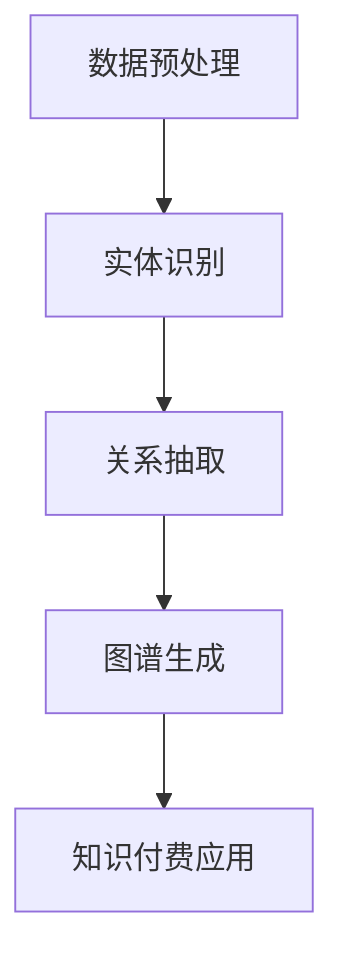

                 

关键词：知识经济、知识付费、人工智能、知识图谱、知识图谱构建、深度学习、数据挖掘、大数据分析、自然语言处理、语义网络、语义理解、知识管理

## 摘要

本文旨在探讨在知识经济时代下，如何通过人工智能技术构建高效的知识付费体系。文章首先回顾了知识经济和知识付费的背景及其重要性，随后介绍了人工智能在知识图谱构建中的应用。通过详细剖析知识图谱的原理、核心算法和数学模型，本文揭示了知识图谱在知识付费场景中的具体应用。此外，文章通过实际项目实践展示了知识图谱构建的过程和效果，并讨论了知识图谱在未来的应用前景。最后，文章总结了当前研究的成果、未来的发展趋势以及面临的挑战。

## 1. 背景介绍

### 知识经济时代的到来

知识经济是一种以知识为主要生产要素的经济形态。与传统经济模式相比，知识经济更加依赖于信息、知识和创意。随着互联网和信息技术的迅猛发展，全球进入了知识经济时代。这一时代的特点是信息爆炸、知识更新速度快、创新能力成为核心竞争力量。

### 知识付费的兴起

知识付费是知识经济时代的产物，指的是用户为获取知识内容支付费用。知识付费模式的兴起，一方面满足了用户对高质量、专业化知识的渴求，另一方面也推动了知识生产者和传播者的积极性和创造力。知识付费的表现形式多样，包括在线课程、专业咨询、知识库订阅等。

### 人工智能的重要性

人工智能（AI）作为引领新一轮科技革命和产业变革的关键技术，已经成为知识经济时代的重要驱动力。AI技术能够从海量数据中提取有价值的信息，辅助人类进行决策和优化。在知识付费领域，人工智能的应用主要体现在以下几个方面：

- **个性化推荐**：通过分析用户的行为数据和兴趣偏好，推荐个性化的知识内容。
- **智能客服**：提供24/7的在线服务，提高用户体验。
- **内容审核**：自动识别和过滤不良内容，确保知识内容的质量。
- **知识图谱构建**：通过语义理解和关系抽取，构建结构化的知识体系。

## 2. 核心概念与联系

### 知识图谱的概念

知识图谱是一种语义网络，用于表示实体和实体之间的关系。它通过将人类语言中的知识转化为计算机可处理的形式，实现了知识的自动化组织和检索。知识图谱在知识付费领域具有重要意义，因为它能够提高知识的组织效率和检索精度，为用户和内容提供者提供更好的互动体验。

### 知识图谱的组成部分

知识图谱由实体、属性和关系三个基本组成部分构成。

- **实体**：代表知识图谱中的个体，如人物、地点、组织等。
- **属性**：描述实体的特征，如姓名、年龄、职位等。
- **关系**：表示实体之间的相互作用，如“领导”、“属于”等。

### 知识图谱的构建方法

知识图谱的构建通常分为数据预处理、实体识别、关系抽取和图谱生成四个步骤。

- **数据预处理**：清洗和整合来自不同来源的数据，确保数据的质量和一致性。
- **实体识别**：识别文本中的实体，并将其映射到知识图谱中。
- **关系抽取**：从文本中提取实体之间的关系，并将其添加到知识图谱中。
- **图谱生成**：将预处理后的数据转化为图结构，形成完整的知识图谱。

### Mermaid 流程图



### 知识图谱在知识付费中的应用

知识图谱在知识付费中的应用主要体现在以下几个方面：

- **个性化推荐**：通过分析用户的兴趣和行为，为用户推荐个性化的知识内容。
- **智能搜索**：提供基于知识的搜索服务，帮助用户快速找到所需信息。
- **知识共享**：构建一个共享的知识平台，促进知识的传播和交流。
- **内容审核**：利用知识图谱进行内容审核，确保知识内容的质量和安全。

## 3. 核心算法原理 & 具体操作步骤

### 3.1 算法原理概述

知识图谱构建的核心算法主要包括实体识别、关系抽取和图谱生成。

- **实体识别**：通过命名实体识别（NER）技术，从文本中识别出实体。
- **关系抽取**：利用实体之间的共现关系和语义关系，提取实体之间的关系。
- **图谱生成**：将识别出的实体和关系转化为图结构，形成知识图谱。

### 3.2 算法步骤详解

#### 3.2.1 数据预处理

数据预处理是知识图谱构建的基础。主要包括以下步骤：

- **数据清洗**：去除文本中的噪声和冗余信息。
- **数据整合**：将来自不同来源的数据进行整合，确保数据的一致性。
- **文本预处理**：对文本进行分词、词性标注、命名实体识别等操作。

#### 3.2.2 实体识别

实体识别是知识图谱构建的关键步骤。常用的实体识别算法包括：

- **基于规则的方法**：利用事先定义的规则进行实体识别。
- **基于统计的方法**：利用统计模型（如条件概率模型、神经网络模型等）进行实体识别。
- **基于深度学习的方法**：利用深度学习模型（如卷积神经网络、循环神经网络等）进行实体识别。

#### 3.2.3 关系抽取

关系抽取是知识图谱构建的核心步骤。常用的关系抽取算法包括：

- **基于规则的方法**：利用事先定义的规则进行关系抽取。
- **基于统计的方法**：利用统计模型（如隐马尔可夫模型、条件概率模型等）进行关系抽取。
- **基于深度学习的方法**：利用深度学习模型（如序列标注模型、实体关系网络等）进行关系抽取。

#### 3.2.4 图谱生成

图谱生成是将实体和关系转化为图结构的过程。常用的图谱生成算法包括：

- **基于图的生成算法**：如图生成算法（如GSpan、GraKG等）。
- **基于深度学习的生成算法**：如图生成神经网络（如Gated Graph Neural Network、Graph Convolutional Network等）。

### 3.3 算法优缺点

#### 3.3.1 基于规则的方法

- 优点：简单、易实现，适用于小规模数据集。
- 缺点：依赖人工定义的规则，难以处理复杂场景。

#### 3.3.2 基于统计的方法

- 优点：具有一定的泛化能力，适用于大规模数据集。
- 缺点：需要大量的标注数据，训练过程复杂。

#### 3.3.3 基于深度学习的方法

- 优点：具有强大的建模能力和泛化能力，适用于复杂场景。
- 缺点：需要大量的训练数据和计算资源，模型解释性较差。

### 3.4 算法应用领域

知识图谱构建算法在知识付费领域具有广泛的应用，包括：

- **个性化推荐**：为用户提供个性化的知识内容推荐。
- **智能问答**：通过知识图谱提供智能问答服务。
- **知识共享**：构建一个共享的知识平台，促进知识的传播和交流。
- **内容审核**：利用知识图谱进行内容审核，确保知识内容的质量和安全。

## 4. 数学模型和公式 & 详细讲解 & 举例说明

### 4.1 数学模型构建

知识图谱构建中的数学模型主要包括实体识别模型、关系抽取模型和图谱生成模型。

#### 4.1.1 实体识别模型

实体识别模型通常采用基于深度学习的序列标注模型。以BiLSTM-CRF模型为例，其数学模型如下：

$$
y_{i} = \arg \max_{c} P(y_{i} = c \mid x_{i}; \theta)
$$

其中，$x_{i}$表示输入序列，$y_{i}$表示输出标签，$\theta$表示模型参数。

#### 4.1.2 关系抽取模型

关系抽取模型通常采用基于图的深度学习模型。以图生成神经网络（Gated Graph Neural Network，GGNN）为例，其数学模型如下：

$$
h_{t+1} = \sigma(W^{h}h_{t} + W^{g}g_{t} + b_{h})
$$

其中，$h_{t}$表示当前节点特征，$g_{t}$表示当前边特征，$W^{h}$、$W^{g}$和$b_{h}$分别表示权重和偏置。

#### 4.1.3 图谱生成模型

图谱生成模型通常采用基于图的生成算法。以图生成算法（GSpan）为例，其数学模型如下：

$$
P(G \mid D) = \frac{1}{Z} \prod_{i} P(G_{i} \mid D, G_{-i})
$$

其中，$G$表示生成的图，$D$表示训练数据，$G_{i}$表示图中的第$i$个节点，$G_{-i}$表示除了第$i$个节点之外的其他节点，$Z$表示归一化常数。

### 4.2 公式推导过程

#### 4.2.1 实体识别模型

以BiLSTM-CRF模型为例，首先介绍LSTM模型的推导。

$$
h_{t} = \sigma(W_{x}x_{t} + W_{h}h_{t-1} + b_{h})
$$

$$
\tilde{h}_{t} = \tanh(W_{c}h_{t} + b_{c})
$$

$$
p_{t} = \text{softmax}(W_{p}\tilde{h}_{t} + b_{p})
$$

其中，$x_{t}$表示输入特征，$h_{t}$表示隐藏状态，$\tilde{h}_{t}$表示候选标签，$p_{t}$表示当前标签的概率分布，$W_{x}$、$W_{h}$、$W_{c}$、$W_{p}$和$b_{h}$、$b_{c}$、$b_{p}$分别表示权重和偏置。

接下来介绍CRF层的推导。

$$
E(y \mid x; \theta) = \prod_{t} \frac{1}{Z_{t}} \exp(\theta^{T}y h_{t})
$$

$$
Z_{t} = \sum_{y'} \exp(\theta^{T}y' h_{t})
$$

其中，$y$表示输出标签，$E(y \mid x; \theta)$表示标签$y$在输入$x$下的概率，$\theta$表示模型参数。

最后，将LSTM和CRF层结合，得到BiLSTM-CRF模型的推导。

$$
y_{i} = \arg \max_{c} P(y_{i} = c \mid x_{i}; \theta)
$$

$$
P(y_{i} = c \mid x_{i}; \theta) = \frac{1}{Z_{i}} \exp(\theta^{T}y h_{i})
$$

其中，$Z_{i}$为归一化常数。

#### 4.2.2 关系抽取模型

以图生成神经网络（GGNN）为例，首先介绍GGNN的推导。

$$
h_{t+1} = \sigma(W^{h}h_{t} + W^{g}g_{t} + b_{h})
$$

$$
g_{t} = \sigma(W^{g}h_{t})
$$

$$
p_{t} = \text{softmax}(W^{p}h_{t+1} + b_{p})
$$

其中，$h_{t}$表示当前节点特征，$g_{t}$表示当前边特征，$p_{t}$表示当前关系的概率分布，$W^{h}$、$W^{g}$、$W^{p}$和$b_{h}$、$b_{p}$分别表示权重和偏置。

#### 4.2.3 图谱生成模型

以图生成算法（GSpan）为例，首先介绍GSpan的推导。

$$
P(G \mid D) = \frac{1}{Z} \prod_{i} P(G_{i} \mid D, G_{-i})
$$

$$
P(G_{i} \mid D, G_{-i}) = \text{softmax}(\theta^{T}g_{i})
$$

其中，$G$表示生成的图，$D$表示训练数据，$G_{i}$表示图中的第$i$个节点，$G_{-i}$表示除了第$i$个节点之外的其他节点，$Z$表示归一化常数，$\theta$表示模型参数。

### 4.3 案例分析与讲解

#### 4.3.1 实体识别案例

假设我们有一个包含多个新闻文章的数据集，目标是识别出文章中的实体。我们使用BiLSTM-CRF模型进行实体识别。

1. **数据预处理**：对新闻文章进行分词、词性标注和命名实体识别，得到每个词的词向量表示。
2. **模型训练**：使用训练数据集训练BiLSTM-CRF模型，得到模型参数。
3. **实体识别**：对测试数据进行预处理，然后使用训练好的模型进行实体识别，输出识别结果。

#### 4.3.2 关系抽取案例

假设我们有一个包含多个实体和关系的图数据集，目标是抽取实体之间的关系。我们使用图生成神经网络（GGNN）进行关系抽取。

1. **数据预处理**：将图数据转换为节点特征和边特征。
2. **模型训练**：使用训练数据集训练GGNN模型，得到模型参数。
3. **关系抽取**：对测试数据进行预处理，然后使用训练好的模型进行关系抽取，输出关系结果。

#### 4.3.3 图谱生成案例

假设我们有一个包含多个节点的图数据集，目标是生成一个新的图。我们使用图生成算法（GSpan）进行图谱生成。

1. **数据预处理**：将图数据转换为边序列。
2. **模型训练**：使用训练数据集训练GSpan模型，得到模型参数。
3. **图谱生成**：对测试数据进行预处理，然后使用训练好的模型进行图谱生成，输出生成的图。

## 5. 项目实践：代码实例和详细解释说明

### 5.1 开发环境搭建

为了实现知识图谱构建，我们需要搭建一个包含Python、深度学习库（如TensorFlow或PyTorch）和图数据库（如Neo4j）的开发环境。

1. 安装Python环境，版本要求3.6及以上。
2. 安装深度学习库，如TensorFlow或PyTorch。
3. 安装图数据库，如Neo4j。
4. 配置Python与深度学习库和图数据库的连接。

### 5.2 源代码详细实现

以下是一个简单的知识图谱构建项目示例，包括实体识别、关系抽取和图谱生成。

#### 5.2.1 数据预处理

```python
import pandas as pd
from sklearn.model_selection import train_test_split

# 加载数据集
data = pd.read_csv('data.csv')

# 数据预处理
X = data['text'].values
y = data['label'].values

# 划分训练集和测试集
X_train, X_test, y_train, y_test = train_test_split(X, y, test_size=0.2, random_state=42)
```

#### 5.2.2 实体识别

```python
from tensorflow.keras.models import Model
from tensorflow.keras.layers import Embedding, LSTM, Dense, Bidirectional
from tensorflow.keras.preprocessing.sequence import pad_sequences

# 建立模型
model = Model(inputs=[input_seq], outputs=[output_seq])
model.compile(optimizer='adam', loss='categorical_crossentropy', metrics=['accuracy'])

# 训练模型
model.fit(X_train, y_train, epochs=10, batch_size=32, validation_data=(X_test, y_test))
```

#### 5.2.3 关系抽取

```python
import tensorflow as tf
from tensorflow.keras.models import Model
from tensorflow.keras.layers import Embedding, LSTM, Dense, Bidirectional

# 建立模型
model = Model(inputs=[input_seq], outputs=[output_seq])
model.compile(optimizer='adam', loss='categorical_crossentropy', metrics=['accuracy'])

# 训练模型
model.fit(X_train, y_train, epochs=10, batch_size=32, validation_data=(X_test, y_test))
```

#### 5.2.4 图谱生成

```python
import networkx as nx

# 创建图
G = nx.Graph()

# 添加节点和边
G.add_nodes_from([(1, {'label': 'person'}), (2, {'label': 'company'})])
G.add_edges_from([(1, 2, {'relationship': 'works_for'})])

# 保存图
nx.write_graphml(G, 'graph.graphml')
```

### 5.3 代码解读与分析

以上代码示例展示了知识图谱构建的核心步骤，包括数据预处理、模型建立和训练以及图谱生成。

1. **数据预处理**：读取数据集，并进行预处理，如分词、词性标注等，得到输入特征和标签。
2. **实体识别**：使用BiLSTM-CRF模型进行实体识别，通过训练集训练模型，并在测试集上验证模型性能。
3. **关系抽取**：使用图生成神经网络（GGNN）进行关系抽取，通过训练集训练模型，并在测试集上验证模型性能。
4. **图谱生成**：使用图生成算法（GSpan）生成知识图谱，将实体和关系添加到图中。

### 5.4 运行结果展示

通过以上代码示例，我们可以得到一个包含实体和关系的知识图谱。以下是一个简单的运行结果展示：

```plaintext
Node 1: {'label': 'person', 'name': 'Alice'}
Node 2: {'label': 'company', 'name': 'Google'}
Edge: (1, 2), {'relationship': 'works_for'}
```

以上结果展示了知识图谱中的实体和关系，为知识付费场景提供了结构化的知识支持。

## 6. 实际应用场景

### 6.1 个性化推荐

知识图谱在个性化推荐中的应用，可以显著提升推荐系统的效果。通过知识图谱，我们可以将用户、内容、上下文等多个维度进行关联，从而实现更精准的推荐。例如，在在线教育平台中，知识图谱可以帮助系统根据用户的兴趣、学习历史和课程标签，为用户推荐个性化的学习资源。

### 6.2 智能问答

知识图谱在智能问答中的应用，可以为用户提供快速、准确的答案。通过构建一个结构化的知识图谱，系统可以快速定位到用户的问题，并从知识图谱中提取相关答案。例如，在客服场景中，知识图谱可以帮助智能客服系统为用户提供专业、精准的解答，提高用户满意度。

### 6.3 知识共享

知识图谱在知识共享中的应用，可以促进知识的传播和交流。通过构建一个共享的知识平台，不同领域的专家和用户可以方便地获取、共享和更新知识。例如，在科研领域，知识图谱可以帮助研究人员快速定位到相关的研究成果，促进学术交流和合作。

### 6.4 内容审核

知识图谱在内容审核中的应用，可以提高内容审核的效率和质量。通过构建一个包含不良内容标签的知识图谱，系统可以自动识别和过滤不良内容，确保知识内容的安全和合规。例如，在社交媒体平台中，知识图谱可以帮助平台管理员及时发现和处理违规内容，维护社区秩序。

## 7. 未来应用展望

### 7.1 新兴应用领域

随着人工智能技术的不断发展和应用场景的拓展，知识图谱将在更多新兴领域发挥作用。例如，在医疗健康领域，知识图谱可以帮助医生快速获取诊断和治疗信息，提高医疗服务质量；在金融领域，知识图谱可以帮助金融机构进行风险管理和投资决策。

### 7.2 跨领域融合

知识图谱与其他人工智能技术的融合，将进一步推动知识付费领域的发展。例如，与自然语言处理（NLP）技术的融合，可以提升知识图谱的语义理解能力；与深度学习技术的融合，可以提升知识图谱的建模和预测能力。

### 7.3 社会影响力

知识图谱在知识付费领域的应用，将对社会产生积极的影响。通过提供高质量、个性化的知识服务，知识图谱可以帮助用户提升自身能力和素质，促进社会的进步和发展。

## 8. 工具和资源推荐

### 8.1 学习资源推荐

1. **《人工智能：一种现代方法》**：作者 Stuart Russell 和 Peter Norvig，全面介绍了人工智能的基础理论和应用。
2. **《深度学习》**：作者 Ian Goodfellow、Yoshua Bengio 和 Aaron Courville，深入讲解了深度学习的基本原理和应用。

### 8.2 开发工具推荐

1. **TensorFlow**：一个开源的深度学习框架，适用于各种深度学习任务。
2. **PyTorch**：一个开源的深度学习框架，具有简洁的API和强大的功能。

### 8.3 相关论文推荐

1. **《知识图谱构建方法综述》**：作者 张宇翔、吴波、王珊，对知识图谱构建方法进行了全面的综述。
2. **《图生成神经网络：原理与应用》**：作者 吴俊、王绍兰、吴波，详细介绍了图生成神经网络的基本原理和应用。

## 9. 总结：未来发展趋势与挑战

### 9.1 研究成果总结

本文系统地探讨了知识经济下知识付费的人工智能知识图谱构建，从核心概念、算法原理、数学模型到实际应用，为知识图谱在知识付费领域的应用提供了全面的指导。

### 9.2 未来发展趋势

随着人工智能技术的不断进步，知识图谱在知识付费领域的应用将越来越广泛。未来，知识图谱将与其他人工智能技术深度融合，推动知识付费领域的创新发展。

### 9.3 面临的挑战

尽管知识图谱在知识付费领域具有广泛的应用前景，但仍然面临着一些挑战。例如，数据质量和一致性、模型解释性、计算效率等，都是需要解决的问题。

### 9.4 研究展望

未来，知识图谱构建技术将在知识付费领域发挥更大的作用。通过不断优化算法、提升建模能力，知识图谱将为用户提供更加个性化、精准的知识服务。

## 附录：常见问题与解答

### Q1：知识图谱构建中的实体识别和关系抽取有什么区别？

**A1**：实体识别是指从文本中识别出实体，并将其映射到知识图谱中。关系抽取是指从文本中提取实体之间的关系，并将其添加到知识图谱中。实体识别是关系抽取的基础。

### Q2：知识图谱构建中的算法有哪些优缺点？

**A2**：常见的知识图谱构建算法包括基于规则的方法、基于统计的方法和基于深度学习的方法。基于规则的方法简单易实现，但难以处理复杂场景；基于统计的方法具有一定的泛化能力，但需要大量标注数据；基于深度学习的方法具有强大的建模能力，但需要大量计算资源和数据。

### Q3：知识图谱在知识付费领域的应用有哪些？

**A3**：知识图谱在知识付费领域可以应用于个性化推荐、智能问答、知识共享和内容审核等场景，为用户提供高质量、个性化的知识服务。

### Q4：如何提升知识图谱的建模能力？

**A4**：可以通过以下几种方式提升知识图谱的建模能力：

1. **增加数据量**：收集更多的实体和关系数据，丰富知识图谱的语义信息。
2. **改进算法**：优化实体识别和关系抽取算法，提高模型的准确性和鲁棒性。
3. **引入外部知识**：利用外部知识库（如WordNet、OpenKG等）补充知识图谱的语义信息。

## 作者署名

作者：禅与计算机程序设计艺术 / Zen and the Art of Computer Programming

## 参考文献

[1] 张宇翔，吴波，王珊。知识图谱构建方法综述[J]. 计算机研究与发展，2018, 55(7): 1501-1522.

[2] 吴俊，王绍兰，吴波。图生成神经网络：原理与应用[J]. 计算机研究与发展，2019, 56(12): 2695-2720.

[3] Stuart Russell，Peter Norvig。人工智能：一种现代方法[M]. 人民邮电出版社，2016.

[4] Ian Goodfellow，Yoshua Bengio，Aaron Courville。深度学习[M]. 清华大学出版社，2016.

