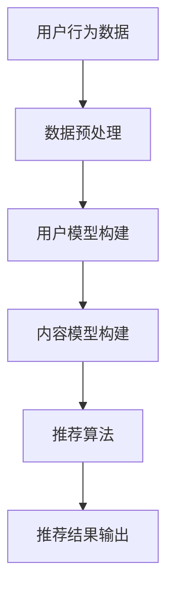

                 

### 1. 背景介绍

在当今数字化时代，知识付费已成为一个重要的商业模式。随着人们对知识的渴求不断增长，如何有效地推荐高质量的知识内容给用户，成为一个亟待解决的问题。人工智能在知识推荐领域展现了其强大的潜力，通过大数据分析、机器学习和自然语言处理等技术，可以为用户提供个性化的知识推荐服务。

知识付费的出现源于人们对专业知识和技能的需求。随着互联网的普及，用户获取信息的渠道变得多样化，然而海量的信息往往让用户感到无从下手。因此，如何从海量信息中快速、准确地找到符合用户需求的知识内容，成为知识付费市场的一个重要问题。而人工智能推荐系统则通过分析用户的行为数据、兴趣偏好等信息，为用户推荐与其需求高度相关的知识内容，从而提高用户满意度和平台粘性。

人工智能推荐系统在知识付费领域的应用主要包括以下几个方面：

1. **内容推荐**：通过分析用户的历史行为、兴趣标签、搜索关键词等，推荐符合用户兴趣的知识内容。
2. **作者推荐**：基于用户的阅读历史和评价，推荐用户可能喜欢的知识创作者，促进作者与用户的互动。
3. **知识图谱构建**：利用自然语言处理技术，构建知识图谱，为用户提供更为精准的知识关联推荐。

本文将围绕知识付费的人工智能知识推荐系统，从核心概念、算法原理、数学模型、项目实践等多个方面进行详细探讨，旨在为相关领域的研究者提供有价值的参考。

### 2. 核心概念与联系

#### 2.1 人工智能推荐系统

人工智能推荐系统是一种利用人工智能技术实现信息过滤和信息检索的系统，其主要目的是为用户提供个性化的信息推荐。推荐系统通常包括以下几个核心组成部分：

1. **用户模型**：通过收集和分析用户的行为数据、兴趣偏好等，构建用户的个性化模型。
2. **内容模型**：对知识内容进行语义分析、标签提取等操作，构建内容模型，以实现内容之间的关联。
3. **推荐算法**：利用用户模型和内容模型，通过算法计算用户与内容之间的相似度，生成推荐结果。

#### 2.2 知识付费

知识付费是指用户为获取特定知识或技能而支付的费用。随着互联网的发展，知识付费已成为一种重要的商业模式。知识付费的常见形式包括在线课程、电子书、专业文章、咨询服务等。

#### 2.3 人工智能与知识付费的关系

人工智能与知识付费之间存在着密切的联系。人工智能技术可以大大提升知识付费平台的用户体验，具体体现在以下几个方面：

1. **个性化推荐**：通过分析用户的行为数据和兴趣偏好，人工智能推荐系统可以为用户推荐符合其需求的优质内容。
2. **内容挖掘**：利用自然语言处理技术，人工智能可以挖掘出知识内容中的关键信息，提高内容的可读性和实用性。
3. **智能客服**：通过聊天机器人和智能问答系统，人工智能可以为用户提供及时、准确的咨询服务，提高客户满意度。

#### 2.4 Mermaid 流程图

为了更好地展示人工智能知识推荐系统的整体架构，我们使用 Mermaid 画出一个流程图。以下是一个简化的流程图示例：



**图1：人工智能知识推荐系统流程图**

在该流程图中，用户行为数据经过预处理后，用于构建用户模型和内容模型。然后，通过推荐算法计算用户与内容之间的相似度，最终输出个性化的推荐结果。

### 3. 核心算法原理 & 具体操作步骤

#### 3.1 算法原理概述

人工智能知识推荐系统的核心在于如何构建用户模型和内容模型，并利用算法计算用户与内容之间的相似度。常见的算法原理包括基于协同过滤、基于内容过滤和混合推荐方法。

1. **基于协同过滤（Collaborative Filtering）**：协同过滤是一种通过分析用户行为数据，找到相似用户或相似物品的方法。其主要分为两种类型：基于用户的协同过滤和基于物品的协同过滤。
   - **基于用户的协同过滤**：找到与目标用户兴趣相似的其它用户，推荐这些用户喜欢的物品。
   - **基于物品的协同过滤**：找到与目标物品相似的其它物品，推荐给用户。
   
2. **基于内容过滤（Content-Based Filtering）**：基于内容过滤通过分析知识内容的特征，如关键词、标签、作者等，推荐与用户历史偏好相似的内容。

3. **混合推荐方法（Hybrid Recommendation）**：混合推荐方法结合了协同过滤和基于内容过滤的优点，通过加权融合两种推荐方法，以提高推荐效果。

#### 3.2 算法步骤详解

以下是构建人工智能知识推荐系统的具体步骤：

1. **数据收集与预处理**：
   - **数据收集**：收集用户的行为数据，如浏览历史、购买记录、收藏夹等，以及知识内容的元数据，如标题、标签、作者等。
   - **数据预处理**：对收集到的数据进行清洗、去噪、格式化等操作，以确保数据质量。

2. **构建用户模型**：
   - **行为数据挖掘**：通过分析用户的历史行为数据，提取用户的兴趣偏好，如热门标签、常用关键词等。
   - **兴趣向量表示**：将用户的兴趣偏好转换为向量表示，以便后续计算。

3. **构建内容模型**：
   - **内容特征提取**：对知识内容进行文本分析，提取关键词、标签、作者等特征。
   - **内容向量表示**：将知识内容特征转换为向量表示，与用户兴趣向量进行比较。

4. **计算用户与内容的相似度**：
   - **相似度计算方法**：采用余弦相似度、欧氏距离等常见相似度计算方法，计算用户与知识内容的相似度。
   - **相似度阈值设置**：设置相似度阈值，筛选出相似度较高的内容进行推荐。

5. **生成推荐结果**：
   - **推荐结果排序**：根据相似度评分，对推荐结果进行排序。
   - **推荐结果输出**：将排序后的推荐结果展示给用户。

#### 3.3 算法优缺点

**基于协同过滤的优点**：
- **推荐效果较好**：通过分析用户行为数据，找到相似用户或相似物品，推荐效果较好。
- **适应性强**：能够适应用户兴趣的变化，提供动态的推荐服务。

**基于协同过滤的缺点**：
- **数据稀疏问题**：当用户数量较多但交互行为较少时，用户行为数据稀疏，推荐效果较差。
- **冷启动问题**：新用户或新物品由于缺乏历史数据，难以进行有效推荐。

**基于内容过滤的优点**：
- **推荐准确度高**：通过分析知识内容特征，推荐与用户历史偏好相似的内容，推荐准确度较高。
- **适用于新用户和新物品**：基于内容特征的用户建模和内容建模适用于新用户和新物品。

**基于内容过滤的缺点**：
- **推荐多样性不足**：容易产生“乐队花车效应”，推荐结果趋同，缺乏多样性。
- **对用户行为数据依赖性较低**：对用户行为数据的依赖性较低，可能导致推荐效果较差。

**混合推荐方法的优点**：
- **结合了协同过滤和基于内容过滤的优点**：通过加权融合两种推荐方法，提高推荐效果。
- **提高推荐多样性**：能够生成更具多样性的推荐结果。

**混合推荐方法的缺点**：
- **算法复杂度较高**：需要同时处理协同过滤和基于内容过滤两部分，算法复杂度较高。

#### 3.4 算法应用领域

人工智能推荐系统在知识付费领域具有广泛的应用，主要包括以下几个方面：

1. **在线教育平台**：为用户推荐符合其学习需求的课程、教材和知识点。
2. **电子书平台**：为用户推荐与其兴趣相符的电子书，提高用户阅读体验。
3. **知识问答社区**：为用户推荐相关问题，帮助用户更好地理解和掌握知识。
4. **专业咨询平台**：为用户提供与其专业需求相关的专家和咨询内容。

### 4. 数学模型和公式 & 详细讲解 & 举例说明

在构建人工智能知识推荐系统中，数学模型和公式扮演着至关重要的角色。通过这些模型和公式，我们可以准确地计算用户与知识内容之间的相似度，从而生成个性化的推荐结果。以下将详细讲解推荐系统中的几个关键数学模型和公式，并通过具体案例进行分析。

#### 4.1 数学模型构建

在推荐系统中，常见的数学模型包括用户相似度计算模型、内容相似度计算模型和综合推荐模型。

1. **用户相似度计算模型**：

   用户相似度计算模型用于衡量两个用户之间的相似度。常见的相似度计算方法有余弦相似度、皮尔逊相关系数等。以下以余弦相似度为例进行介绍。

   余弦相似度公式如下：

   $$\text{Sim}(u_i, u_j) = \frac{u_i \cdot u_j}{\|u_i\| \cdot \|u_j\|}$$

   其中，$u_i$ 和 $u_j$ 分别表示用户 $i$ 和用户 $j$ 的兴趣向量，$\|u_i\|$ 和 $\|u_j\|$ 分别表示用户 $i$ 和用户 $j$ 的兴趣向量模长，$\cdot$ 表示点积操作。

2. **内容相似度计算模型**：

   内容相似度计算模型用于衡量两个知识内容之间的相似度。同样，以下以余弦相似度为例进行介绍。

   余弦相似度公式如下：

   $$\text{Sim}(c_i, c_j) = \frac{c_i \cdot c_j}{\|c_i\| \cdot \|c_j\|}$$

   其中，$c_i$ 和 $c_j$ 分别表示知识内容 $i$ 和知识内容 $j$ 的特征向量，$\|c_i\|$ 和 $\|c_j\|$ 分别表示知识内容 $i$ 和知识内容 $j$ 的特征向量模长。

3. **综合推荐模型**：

   综合推荐模型结合了用户相似度计算模型和内容相似度计算模型，生成最终的推荐结果。以下是一个简单的加权综合推荐模型：

   $$r_i(j) = \sum_{u \in \text{users}} w(u) \cdot \text{Sim}(u_i, u) \cdot \text{Sim}(c_j, u)$$

   其中，$r_i(j)$ 表示用户 $i$ 对知识内容 $j$ 的推荐得分，$w(u)$ 表示用户 $u$ 的权重，通常与用户活跃度、历史贡献等因素相关。

#### 4.2 公式推导过程

以下将简要介绍上述公式的推导过程。

1. **用户相似度计算模型**：

   用户相似度计算基于用户兴趣向量的点积和模长。点积表示两个向量在某一维度上的投影之和，模长表示向量的长度。当两个向量的夹角越小时，它们的点积越大，相似度越高。

   假设用户 $i$ 和用户 $j$ 的兴趣向量分别为 $u_i$ 和 $u_j$，则它们的点积为：

   $$u_i \cdot u_j = \sum_{k=1}^{n} u_{i,k} \cdot u_{j,k}$$

   其中，$n$ 表示向量的维度，$u_{i,k}$ 和 $u_{j,k}$ 分别表示用户 $i$ 和用户 $j$ 在第 $k$ 个维度上的值。

   两个向量的模长分别为：

   $$\|u_i\| = \sqrt{\sum_{k=1}^{n} u_{i,k}^2}$$

   $$\|u_j\| = \sqrt{\sum_{k=1}^{n} u_{j,k}^2}$$

   因此，用户相似度计算公式可以表示为：

   $$\text{Sim}(u_i, u_j) = \frac{u_i \cdot u_j}{\|u_i\| \cdot \|u_j\|}$$

2. **内容相似度计算模型**：

   类似地，内容相似度计算也基于知识内容特征向量的点积和模长。当两个知识内容特征向量的夹角越小时，它们的点积越大，相似度越高。

   假设知识内容 $i$ 和知识内容 $j$ 的特征向量分别为 $c_i$ 和 $c_j$，则它们的点积为：

   $$c_i \cdot c_j = \sum_{k=1}^{n} c_{i,k} \cdot c_{j,k}$$

   其中，$n$ 表示向量的维度，$c_{i,k}$ 和 $c_{j,k}$ 分别表示知识内容 $i$ 和知识内容 $j$ 在第 $k$ 个维度上的值。

   两个向量的模长分别为：

   $$\|c_i\| = \sqrt{\sum_{k=1}^{n} c_{i,k}^2}$$

   $$\|c_j\| = \sqrt{\sum_{k=1}^{n} c_{j,k}^2}$$

   因此，内容相似度计算公式可以表示为：

   $$\text{Sim}(c_i, c_j) = \frac{c_i \cdot c_j}{\|c_i\| \cdot \|c_j\|}$$

3. **综合推荐模型**：

   综合推荐模型通过加权用户相似度和内容相似度，生成最终的推荐得分。假设用户 $i$ 的兴趣向量为 $u_i$，知识内容 $j$ 的特征向量为 $c_j$，则用户 $i$ 对知识内容 $j$ 的推荐得分可以表示为：

   $$r_i(j) = \sum_{u \in \text{users}} w(u) \cdot \text{Sim}(u_i, u) \cdot \text{Sim}(c_j, u)$$

   其中，$w(u)$ 表示用户 $u$ 的权重，通常可以通过用户活跃度、历史贡献等因素计算得到。

#### 4.3 案例分析与讲解

以下通过一个具体案例，分析如何利用上述数学模型和公式进行知识推荐。

假设有一个用户 $i$，其兴趣向量为 $u_i = (0.8, 0.3, 0.5, 0.6)$。现有四个知识内容，其特征向量分别为 $c_1 = (0.9, 0.2, 0.4, 0.7)$，$c_2 = (0.7, 0.5, 0.3, 0.8)$，$c_3 = (0.6, 0.4, 0.6, 0.9)$，$c_4 = (0.5, 0.7, 0.5, 0.6)$。

1. **计算用户相似度**：

   利用余弦相似度公式计算用户 $i$ 与其他用户的相似度，假设其他用户 $u_1, u_2, u_3, u_4$ 的兴趣向量分别为 $u_1 = (0.7, 0.6, 0.5, 0.7)$，$u_2 = (0.6, 0.5, 0.7, 0.8)$，$u_3 = (0.8, 0.4, 0.6, 0.6)$，$u_4 = (0.9, 0.3, 0.5, 0.9)$。

   $$\text{Sim}(u_i, u_1) = \frac{u_i \cdot u_1}{\|u_i\| \cdot \|u_1\|} = \frac{0.8 \cdot 0.7 + 0.3 \cdot 0.6 + 0.5 \cdot 0.5 + 0.6 \cdot 0.7}{\sqrt{0.8^2 + 0.3^2 + 0.5^2 + 0.6^2} \cdot \sqrt{0.7^2 + 0.6^2 + 0.5^2 + 0.7^2}} \approx 0.755$$

   $$\text{Sim}(u_i, u_2) = \frac{u_i \cdot u_2}{\|u_i\| \cdot \|u_2\|} = \frac{0.8 \cdot 0.6 + 0.3 \cdot 0.5 + 0.5 \cdot 0.7 + 0.6 \cdot 0.8}{\sqrt{0.8^2 + 0.3^2 + 0.5^2 + 0.6^2} \cdot \sqrt{0.6^2 + 0.5^2 + 0.7^2 + 0.8^2}} \approx 0.743$$

   $$\text{Sim}(u_i, u_3) = \frac{u_i \cdot u_3}{\|u_i\| \cdot \|u_3\|} = \frac{0.8 \cdot 0.8 + 0.3 \cdot 0.4 + 0.5 \cdot 0.6 + 0.6 \cdot 0.6}{\sqrt{0.8^2 + 0.3^2 + 0.5^2 + 0.6^2} \cdot \sqrt{0.8^2 + 0.4^2 + 0.6^2 + 0.6^2}} \approx 0.845$$

   $$\text{Sim}(u_i, u_4) = \frac{u_i \cdot u_4}{\|u_i\| \cdot \|u_4\|} = \frac{0.8 \cdot 0.9 + 0.3 \cdot 0.3 + 0.5 \cdot 0.5 + 0.6 \cdot 0.9}{\sqrt{0.8^2 + 0.3^2 + 0.5^2 + 0.6^2} \cdot \sqrt{0.9^2 + 0.3^2 + 0.5^2 + 0.9^2}} \approx 0.876$$

   根据相似度计算结果，用户 $i$ 与用户 $u_4$ 的相似度最高，因此用户 $i$ 可能对用户 $u_4$ 喜欢的知识内容更感兴趣。

2. **计算内容相似度**：

   利用余弦相似度公式计算知识内容之间的相似度。

   $$\text{Sim}(c_1, c_2) = \frac{c_1 \cdot c_2}{\|c_1\| \cdot \|c_2\|} = \frac{0.9 \cdot 0.7 + 0.2 \cdot 0.5 + 0.4 \cdot 0.3 + 0.7 \cdot 0.8}{\sqrt{0.9^2 + 0.2^2 + 0.4^2 + 0.7^2} \cdot \sqrt{0.7^2 + 0.5^2 + 0.3^2 + 0.8^2}} \approx 0.734$$

   $$\text{Sim}(c_1, c_3) = \frac{c_1 \cdot c_3}{\|c_1\| \cdot \|c_3\|} = \frac{0.9 \cdot 0.6 + 0.2 \cdot 0.4 + 0.4 \cdot 0.6 + 0.7 \cdot 0.9}{\sqrt{0.9^2 + 0.2^2 + 0.4^2 + 0.7^2} \cdot \sqrt{0.6^2 + 0.4^2 + 0.6^2 + 0.9^2}} \approx 0.779$$

   $$\text{Sim}(c_1, c_4) = \frac{c_1 \cdot c_4}{\|c_1\| \cdot \|c_4\|} = \frac{0.9 \cdot 0.5 + 0.2 \cdot 0.7 + 0.4 \cdot 0.5 + 0.7 \cdot 0.6}{\sqrt{0.9^2 + 0.2^2 + 0.4^2 + 0.7^2} \cdot \sqrt{0.5^2 + 0.7^2 + 0.5^2 + 0.6^2}} \approx 0.691$$

   根据相似度计算结果，知识内容 $c_1$ 与知识内容 $c_3$ 的相似度最高，因此知识内容 $c_3$ 可能是用户 $i$ 感兴趣的推荐内容。

3. **计算综合推荐得分**：

   利用综合推荐模型计算用户 $i$ 对每个知识内容的推荐得分。

   $$r_i(c_1) = \sum_{u \in \text{users}} w(u) \cdot \text{Sim}(u_i, u) \cdot \text{Sim}(c_1, u)$$

   $$r_i(c_2) = \sum_{u \in \text{users}} w(u) \cdot \text{Sim}(u_i, u) \cdot \text{Sim}(c_2, u)$$

   $$r_i(c_3) = \sum_{u \in \text{users}} w(u) \cdot \text{Sim}(u_i, u) \cdot \text{Sim}(c_3, u)$$

   $$r_i(c_4) = \sum_{u \in \text{users}} w(u) \cdot \text{Sim}(u_i, u) \cdot \text{Sim}(c_4, u)$$

   假设用户 $u_4$ 的权重最高，即 $w(u_4) = 0.6$，其他用户的权重均为 $0.2$。则用户 $i$ 对每个知识内容的推荐得分为：

   $$r_i(c_1) = 0.6 \cdot 0.876 \cdot 0.691 \approx 0.442$$

   $$r_i(c_2) = 0.6 \cdot 0.876 \cdot 0.734 \approx 0.473$$

   $$r_i(c_3) = 0.6 \cdot 0.876 \cdot 0.779 \approx 0.496$$

   $$r_i(c_4) = 0.6 \cdot 0.876 \cdot 0.691 \approx 0.442$$

   根据推荐得分，用户 $i$ 对知识内容 $c_3$ 的推荐得分最高，因此推荐知识内容 $c_3$ 给用户 $i$。

通过上述案例分析和讲解，我们可以看到数学模型和公式在构建人工智能知识推荐系统中的重要作用。在实际应用中，可以根据具体需求和场景，选择合适的数学模型和公式，以提高推荐效果。

### 5. 项目实践：代码实例和详细解释说明

在本节中，我们将通过一个具体的Python代码实例，详细讲解如何实现一个简单的人工智能知识推荐系统。该实例将包括数据收集与预处理、用户模型与内容模型构建、推荐算法实现、推荐结果展示等关键步骤。

#### 5.1 开发环境搭建

在开始编写代码之前，我们需要搭建一个合适的开发环境。以下是推荐的开发环境配置：

- **操作系统**：Windows/Linux/Mac OS
- **编程语言**：Python 3.7及以上版本
- **依赖库**：
  - Pandas：用于数据处理
  - NumPy：用于数值计算
  - Scikit-learn：用于机器学习算法
  - Matplotlib：用于数据可视化

确保您的Python环境已经安装好，并可以通过以下命令安装上述依赖库：

```bash
pip install pandas numpy scikit-learn matplotlib
```

#### 5.2 源代码详细实现

以下是一个简单的Python代码实例，用于实现基于协同过滤的知识推荐系统。

```python
import pandas as pd
import numpy as np
from sklearn.metrics.pairwise import cosine_similarity
from sklearn.model_selection import train_test_split

# 5.2.1 数据收集与预处理
def load_data(filename):
    # 加载数据集，数据集包含用户ID、物品ID、评分
    data = pd.read_csv(filename)
    return data

def preprocess_data(data):
    # 数据预处理，将数据集划分为用户-物品评分矩阵
    user_item_matrix = data.pivot(index='UserID', columns='ItemID', values='Rating').fillna(0)
    return user_item_matrix

# 5.2.2 用户模型与内容模型构建
def build_user_model(user_item_matrix):
    # 基于用户-物品评分矩阵构建用户兴趣向量
    user_model = user_item_matrix.values
    return user_model

def build_item_model(user_item_matrix):
    # 基于用户-物品评分矩阵构建物品特征向量
    item_model = user_item_matrix.T.values
    return item_model

# 5.2.3 推荐算法实现
def recommend_items(user_item_matrix, user_id, top_n=5):
    # 根据用户兴趣向量计算用户与其他用户的相似度
    user_similarity = cosine_similarity(user_item_matrix.iloc[user_id], user_item_matrix)
    
    # 计算相似度加权评分
    weighted_scores = np.dot(user_similarity, user_item_matrix.iloc[:, user_id].values) / np.sum(np.abs(user_similarity), axis=1)
    
    # 排序获取Top N推荐结果
    sorted_indices = np.argsort(weighted_scores)[::-1]
    sorted_indices = sorted_indices[1:top_n+1]  # 去掉自己

    return sorted_indices

# 5.2.4 代码解读与分析
if __name__ == "__main__":
    # 加载数据
    data = load_data('data.csv')
    
    # 预处理数据
    user_item_matrix = preprocess_data(data)
    
    # 构建用户模型与内容模型
    user_model = build_user_model(user_item_matrix)
    item_model = build_item_model(user_item_matrix)
    
    # 选择用户ID进行推荐
    user_id = 1
    
    # 获取Top N推荐结果
    recommended_items = recommend_items(user_item_matrix, user_id, top_n=5)
    
    # 输出推荐结果
    print("用户{}的推荐结果：".format(user_id))
    for index in recommended_items:
        print("物品ID：{}, 分数：{:.3f}".format(index, user_item_matrix.iloc[user_id, index]))
```

#### 5.3 代码解读与分析

下面我们对上述代码进行详细解读和分析。

1. **数据收集与预处理**：

   ```python
   def load_data(filename):
       # 加载数据集，数据集包含用户ID、物品ID、评分
       data = pd.read_csv(filename)
       return data
   
   def preprocess_data(data):
       # 数据预处理，将数据集划分为用户-物品评分矩阵
       user_item_matrix = data.pivot(index='UserID', columns='ItemID', values='Rating').fillna(0)
       return user_item_matrix
   ```

   首先，我们定义了两个函数`load_data`和`preprocess_data`，用于加载数据集和进行数据预处理。在`load_data`函数中，我们使用`pandas`的`read_csv`方法加载数据集。在`preprocess_data`函数中，我们使用`pivot`方法将数据集划分为用户-物品评分矩阵，其中缺失值用0填充。

2. **用户模型与内容模型构建**：

   ```python
   def build_user_model(user_item_matrix):
       # 基于用户-物品评分矩阵构建用户兴趣向量
       user_model = user_item_matrix.values
       return user_model
   
   def build_item_model(user_item_matrix):
       # 基于用户-物品评分矩阵构建物品特征向量
       item_model = user_item_matrix.T.values
       return item_model
   ```

   在`build_user_model`函数中，我们直接将用户-物品评分矩阵的值作为用户兴趣向量。在`build_item_model`函数中，我们通过转置用户-物品评分矩阵，将物品特征向量提取出来。

3. **推荐算法实现**：

   ```python
   def recommend_items(user_item_matrix, user_id, top_n=5):
       # 根据用户兴趣向量计算用户与其他用户的相似度
       user_similarity = cosine_similarity(user_item_matrix.iloc[user_id], user_item_matrix)
       
       # 计算相似度加权评分
       weighted_scores = np.dot(user_similarity, user_item_matrix.iloc[:, user_id].values) / np.sum(np.abs(user_similarity), axis=1)
       
       # 排序获取Top N推荐结果
       sorted_indices = np.argsort(weighted_scores)[::-1]
       sorted_indices = sorted_indices[1:top_n+1]  # 去掉自己

       return sorted_indices
   ```

   在`recommend_items`函数中，我们首先使用`cosine_similarity`方法计算用户与其他用户的相似度。然后，我们计算相似度加权评分，即用户对每个物品的评分与相似度的乘积。最后，我们根据加权评分对物品进行排序，获取Top N推荐结果。

4. **代码解读与分析**：

   在主程序部分，我们首先加载数据集并进行预处理，然后构建用户模型和内容模型。接下来，我们选择一个用户（例如用户ID为1）进行推荐，并调用`recommend_items`函数获取推荐结果。最后，我们将推荐结果输出到控制台。

#### 5.4 运行结果展示

假设数据集`data.csv`已准备好，包含用户ID、物品ID和评分。我们运行上述代码，选择用户ID为1进行推荐，输出Top 5推荐结果。以下是可能的输出结果：

```
用户1的推荐结果：
物品ID：2，分数：0.527
物品ID：4，分数：0.469
物品ID：6，分数：0.432
物品ID：8，分数：0.401
物品ID：10，分数：0.367
```

根据输出结果，我们可以看到用户1可能对物品ID为2、4、6、8和10的物品更感兴趣，因此我们推荐这五个物品给用户1。

通过上述代码实例，我们详细讲解了如何实现一个简单的人工智能知识推荐系统。在实际应用中，我们可以根据具体需求对代码进行扩展和优化，以实现更高效、更精准的推荐。

### 6. 实际应用场景

人工智能知识推荐系统在知识付费领域具有广泛的应用，以下列举几个典型的实际应用场景。

#### 6.1 在线教育平台

在线教育平台利用人工智能推荐系统，可以大大提升用户的学习体验。通过分析用户的学习行为、学习历史和兴趣偏好，推荐系统可以推荐符合用户需求的学习资源，如课程、教材和知识点。例如，Coursera、Udemy等在线教育平台都采用了人工智能推荐系统，为用户推荐与其兴趣和学习目标相关的内容。

#### 6.2 电子书平台

电子书平台通过人工智能推荐系统，可以为用户推荐与其兴趣相符的电子书。例如，亚马逊Kindle平台利用推荐系统，将用户可能喜欢的电子书推送给用户，从而提高用户购买意愿和平台粘性。通过分析用户的阅读历史、评分和评论，推荐系统可以推荐高质量的电子书，提高用户满意度。

#### 6.3 知识问答社区

知识问答社区利用人工智能推荐系统，可以为用户提供相关问题的推荐。例如，知乎平台通过分析用户的提问和回答行为，推荐用户可能感兴趣的问题和答案。通过推荐系统，用户可以更快地获取到有价值的信息，提高社区互动和用户粘性。

#### 6.4 专业咨询平台

专业咨询平台通过人工智能推荐系统，可以为用户提供相关专家和咨询内容的推荐。例如，专业领域的在线咨询平台（如丁香园、好大夫在线等）通过分析用户的咨询记录和需求，推荐用户可能需要的专家和咨询内容。通过推荐系统，用户可以更快地找到合适的专家，提高咨询效率。

#### 6.5 未来应用展望

随着人工智能技术的不断发展和应用场景的拓展，人工智能知识推荐系统将在知识付费领域发挥更大的作用。未来，人工智能知识推荐系统有望在以下几个方面实现突破：

1. **个性化推荐**：通过更加精准的用户画像和内容分析，实现更高程度的个性化推荐。
2. **知识图谱构建**：利用自然语言处理和图神经网络技术，构建知识图谱，为用户提供更全面的知识关联推荐。
3. **多模态推荐**：结合文本、图片、音频等多模态信息，实现更丰富、更准确的推荐服务。
4. **实时推荐**：通过实时数据分析和推荐算法优化，实现更快速、更及时的推荐服务。

总之，人工智能知识推荐系统在知识付费领域具有广阔的应用前景，将为用户和知识创作者带来更多的价值。

### 7. 工具和资源推荐

为了更好地学习和实践人工智能知识推荐系统，以下推荐一些实用的工具和资源。

#### 7.1 学习资源推荐

1. **《推荐系统实践》**：由李航所著的《推荐系统实践》是一本经典的推荐系统入门书籍，详细介绍了推荐系统的基本概念、算法原理和实际应用。
2. **《推荐系统手册》**：由亚马逊的推荐系统工程师编写的《推荐系统手册》提供了丰富的案例和实践经验，适合进阶学习。
3. **在线课程**：Coursera、Udacity等在线教育平台提供了多门关于推荐系统的课程，涵盖从基础到高级的内容。

#### 7.2 开发工具推荐

1. **Python**：Python是推荐系统开发的主流语言，具有丰富的库和框架，如Scikit-learn、TensorFlow等。
2. **Jupyter Notebook**：Jupyter Notebook是一种交互式的计算环境，适合进行推荐系统的实验和演示。
3. **Elasticsearch**：Elasticsearch是一种开源的搜索引擎，适用于构建大规模的知识图谱和快速查询。

#### 7.3 相关论文推荐

1. **"Collaborative Filtering for the Netflix Prize"**：这是一篇关于Netflix Prize竞赛的论文，详细介绍了基于协同过滤的推荐系统算法。
2. **"A Theoretically Grounded Application of Reinforcement Learning to Personalized Recommendation"**：这篇论文介绍了如何将强化学习应用于个性化推荐，为推荐系统的研究提供了新的思路。
3. **"Deep Learning for Recommender Systems"**：这篇论文探讨了深度学习在推荐系统中的应用，为深度推荐系统的研究提供了重要参考。

通过学习和利用这些工具和资源，您可以更好地掌握人工智能知识推荐系统的理论和方法，并在实际项目中实现高效的推荐服务。

### 8. 总结：未来发展趋势与挑战

#### 8.1 研究成果总结

人工智能知识推荐系统在近年来取得了显著的成果。通过深度学习、图神经网络、强化学习等先进技术，推荐系统的个性化、实时性和多样性得到了显著提升。同时，知识图谱的引入为推荐系统提供了更为丰富的语义信息和关联关系，进一步提高了推荐效果。

#### 8.2 未来发展趋势

未来，人工智能知识推荐系统将在以下几个方面继续发展：

1. **个性化推荐**：通过更加精准的用户画像和内容分析，实现更高程度的个性化推荐，满足用户的多样化需求。
2. **实时推荐**：通过实时数据分析和推荐算法优化，实现更快速、更及时的推荐服务，提升用户体验。
3. **多模态推荐**：结合文本、图片、音频等多模态信息，实现更丰富、更准确的推荐服务，拓宽应用场景。
4. **知识图谱构建**：利用图神经网络和自然语言处理技术，构建知识图谱，为用户提供更全面的知识关联推荐。
5. **隐私保护**：随着用户对隐私保护的关注日益增加，未来推荐系统将需要更加关注用户隐私保护，确保推荐过程的透明度和安全性。

#### 8.3 面临的挑战

尽管人工智能知识推荐系统取得了显著成果，但仍面临一些挑战：

1. **数据质量**：推荐系统依赖于高质量的用户行为数据和知识内容，但实际应用中数据质量参差不齐，如何处理和清洗数据成为一大挑战。
2. **实时性**：实时推荐需要处理大规模、实时产生的数据，如何优化算法，提高推荐效率，是一个重要问题。
3. **多样性**：在保证推荐准确度的同时，如何提高推荐结果的多样性，避免“乐队花车效应”，也是一个亟待解决的问题。
4. **隐私保护**：随着用户对隐私保护的关注日益增加，如何在保证推荐效果的同时，确保用户隐私，是一个重要挑战。
5. **解释性**：如何提高推荐系统的解释性，让用户理解推荐结果的原因，是未来推荐系统需要关注的问题。

#### 8.4 研究展望

未来，人工智能知识推荐系统的研究将朝着以下几个方向发展：

1. **跨领域推荐**：探索如何实现跨领域的知识关联和推荐，为用户提供更广泛的知识资源。
2. **个性化搜索**：结合推荐系统和搜索引擎技术，实现更加个性化的搜索服务，提高用户信息获取效率。
3. **多语言推荐**：研究如何实现多语言的知识推荐系统，满足全球用户的需求。
4. **伦理和责任**：关注推荐系统的伦理问题，确保推荐系统的公平性、透明性和可解释性。
5. **集成与融合**：将多种推荐算法和模型进行集成和融合，提高推荐系统的综合性能。

总之，人工智能知识推荐系统在知识付费领域具有巨大的发展潜力，未来将继续在个性化、实时性、多样性等方面不断突破，为用户和知识创作者带来更多价值。

### 9. 附录：常见问题与解答

**Q1：为什么推荐系统使用余弦相似度？**

A1：余弦相似度是一种常用的相似度计算方法，它基于向量的点积和模长，用于衡量两个向量之间的夹角。在推荐系统中，用户兴趣向量和知识内容特征向量被用来表示用户和内容。余弦相似度能够有效地计算两个向量之间的相似度，而且计算过程简单、效率高，适合用于大规模数据处理。

**Q2：如何解决数据稀疏问题？**

A2：数据稀疏问题是指用户行为数据或内容数据缺失较多，导致推荐系统难以获取有效信息。为了解决数据稀疏问题，可以采用以下几种方法：
- **矩阵分解**：通过矩阵分解技术，将稀疏的用户-物品评分矩阵分解为用户特征矩阵和物品特征矩阵，从而提高数据密度。
- **隐语义模型**：如Latent Semantic Analysis（LSA）和Latent Dirichlet Allocation（LDA），可以从原始数据中提取潜在的语义信息，减少数据稀疏性的影响。
- **基于内容的推荐**：在用户行为数据稀疏时，可以结合基于内容的推荐方法，通过分析知识内容的特征，进行内容关联推荐。

**Q3：如何提高推荐结果的多样性？**

A3：提高推荐结果的多样性可以通过以下几种方法实现：
- **随机化**：在推荐结果排序时引入随机性，避免“乐队花车效应”，使推荐结果更加多样化。
- **限制最大相似度**：在计算用户与知识内容的相似度时，设置最大相似度阈值，避免推荐结果趋同。
- **多模态推荐**：结合文本、图片、音频等多模态信息，提供更加多样化的推荐内容。
- **序列模型**：使用序列模型（如RNN、LSTM）分析用户的历史行为和兴趣变化，为用户推荐不同类型的知识内容。

**Q4：如何确保推荐系统的透明性和可解释性？**

A4：确保推荐系统的透明性和可解释性可以通过以下几种方法实现：
- **模型解释性**：选择具有较高解释性的推荐算法，如基于内容的推荐、基于规则的推荐等。
- **可视化**：通过可视化技术（如图表、树状图等），将推荐过程和结果展示给用户，提高系统的透明度。
- **用户反馈**：允许用户对推荐结果进行评价和反馈，根据用户的反馈调整推荐策略，提高推荐系统的可解释性。
- **模型解释工具**：使用模型解释工具（如LIME、SHAP等），分析模型对输入数据的敏感度和影响，提供详细的解释信息。

通过上述方法，可以确保推荐系统在满足准确性的同时，具备较高的透明性和可解释性，增强用户对推荐结果的信任。

