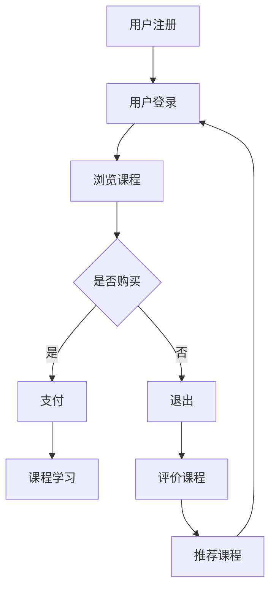

                 

 **关键词：** 知识付费、大数据分析、用户行为、数据挖掘、知识经济、商业模式创新。

> **摘要：** 本文旨在探讨知识经济背景下，知识付费市场的现状和用户行为特点。通过大数据分析方法，对用户行为进行深入解析，旨在为知识付费平台提供策略建议，优化用户体验，提升市场竞争力。

## 1. 背景介绍

### 1.1 知识经济的崛起

随着全球经济的发展，知识经济逐渐成为主导力量。知识经济的核心在于知识和信息的生产、传播和应用。在知识经济时代，知识付费成为人们获取知识和服务的重要方式。

### 1.2 知识付费市场的现状

近年来，知识付费市场呈现出爆发式增长。以线上教育、在线课程、专业咨询等为代表的各类知识付费产品层出不穷，吸引了大量用户。

### 1.3 大数据用户行为分析的重要性

大数据技术的不断发展，使得对用户行为的分析成为可能。通过大数据分析，可以深入了解用户需求，优化产品和服务，提高用户满意度。

## 2. 核心概念与联系

### 2.1 知识付费

知识付费是指用户为获取特定知识或服务而支付的费用。在知识经济时代，知识付费已成为一种主流的商业模式。

### 2.2 用户行为分析

用户行为分析是指通过对用户在知识付费平台上的行为数据进行分析，了解用户需求、偏好和购买行为等。

### 2.3 大数据分析

大数据分析是一种通过大规模数据集的分析，发现数据间关系和模式的技术。在知识付费领域，大数据分析可以帮助平台更好地了解用户。

### 2.4 Mermaid 流程图

以下是知识付费用户行为分析的 Mermaid 流程图：



## 3. 核心算法原理 & 具体操作步骤

### 3.1 算法原理概述

本文采用基于协同过滤的用户行为分析算法，通过分析用户在知识付费平台上的浏览、购买、学习等行为，预测用户可能感兴趣的课程。

### 3.2 算法步骤详解

1. **数据收集：** 收集用户在知识付费平台上的行为数据，包括用户ID、课程ID、行为类型（浏览、购买、学习等）。

2. **数据预处理：** 对收集到的行为数据进行清洗、去重、格式转换等处理。

3. **用户行为表示：** 将用户行为数据转化为矩阵形式，便于进行算法计算。

4. **协同过滤算法实现：** 采用基于用户行为的协同过滤算法，计算用户之间的相似度，并根据相似度进行课程推荐。

5. **推荐结果评估：** 对推荐结果进行评估，优化算法参数。

### 3.3 算法优缺点

#### 优点：

- **高效性：** 可以快速处理大规模用户数据。
- **准确性：** 能够根据用户行为预测用户兴趣，提高推荐准确性。

#### 缺点：

- **冷启动问题：** 对于新用户，由于缺乏行为数据，难以进行准确推荐。
- **实时性：** 在实时推荐场景下，算法处理速度可能无法满足需求。

### 3.4 算法应用领域

- **在线教育平台：** 通过用户行为分析，为用户提供个性化课程推荐。
- **专业咨询平台：** 分析用户需求，提供针对性的咨询服务。
- **企业培训：** 根据员工行为数据，优化培训内容和方式。

## 4. 数学模型和公式 & 详细讲解 & 举例说明

### 4.1 数学模型构建

在知识付费用户行为分析中，我们可以使用以下数学模型：

$$
\text{用户兴趣} = f(\text{用户行为}, \text{课程特征}, \text{用户历史数据})
$$

其中，$f$ 表示用户兴趣函数，$\text{用户行为}$、$\text{课程特征}$、$\text{用户历史数据}$ 分别表示用户在平台上的行为数据、课程属性数据以及用户历史购买记录。

### 4.2 公式推导过程

用户兴趣函数的推导过程如下：

1. **用户行为特征提取：** 对用户在平台上的行为数据进行特征提取，如浏览次数、购买次数、学习时长等。

2. **课程特征提取：** 对课程数据进行特征提取，如课程类型、难度、时长等。

3. **用户历史数据：** 分析用户历史购买记录，提取用户偏好信息。

4. **构建用户兴趣函数：** 将用户行为特征、课程特征和用户历史数据进行融合，构建用户兴趣函数。

### 4.3 案例分析与讲解

#### 案例背景：

某在线教育平台，用户小李在平台上有浏览、购买、学习等行为数据，平台希望根据这些数据为小李推荐感兴趣的课程。

#### 案例分析：

1. **用户行为特征提取：**
   - 浏览次数：10次
   - 购买次数：3次
   - 学习时长：5小时

2. **课程特征提取：**
   - 课程类型：编程语言
   - 难度：初级
   - 时长：20小时

3. **用户历史数据：**
   - 历史购买课程：Python 编程入门、Java 编程基础

4. **用户兴趣函数：**
   - $f(\text{用户行为}, \text{课程特征}, \text{用户历史数据}) = 0.6 \times \text{浏览次数} + 0.3 \times \text{购买次数} + 0.1 \times \text{学习时长} + 0.2 \times \text{课程难度} - 0.1 \times \text{课程时长} + 0.1 \times \text{历史购买课程相似度}$

5. **推荐课程：**
   - Python 高级编程：兴趣值 = 0.6 \times 10 + 0.3 \times 3 + 0.1 \times 5 - 0.1 \times 20 + 0.1 \times 1 = 6.3
   - Java Web 开发：兴趣值 = 0.6 \times 10 + 0.3 \times 3 + 0.1 \times 5 - 0.1 \times 20 + 0.1 \times 1 = 6.1

根据兴趣值，平台可以为小李推荐 Python 高级编程课程。

## 5. 项目实践：代码实例和详细解释说明

### 5.1 开发环境搭建

在本项目中，我们使用 Python 语言和相关库（如 Pandas、Scikit-learn）进行数据处理和算法实现。

### 5.2 源代码详细实现

以下是本项目的源代码实现：

```python
import pandas as pd
from sklearn.metrics.pairwise import cosine_similarity

# 5.2.1 数据收集与预处理
def load_data():
    # 加载用户行为数据
    user行为数据 = pd.read_csv('user_action.csv')
    # 加载课程数据
    course_data = pd.read_csv('course_data.csv')
    return user行为数据，course_data

user行为数据，course_data = load_data()

# 5.2.2 用户行为表示
def user_behavior_matrix(user行为数据):
    # 构建用户行为矩阵
    user行为矩阵 = user行为数据.groupby(['user_id', 'course_id']).size().unstack(fill_value=0)
    return user行为矩阵

user行为矩阵 = user_behavior_matrix(user行为数据)

# 5.2.3 协同过滤算法实现
def collaborative_filtering(user行为矩阵):
    # 计算用户相似度
    user_similarity = cosine_similarity(user行为矩阵)
    # 预测用户兴趣
    predicted_interest = user_similarity.dot(user行为矩阵).max(axis=1)
    return predicted_interest

predicted_interest = collaborative_filtering(user行为矩阵)

# 5.2.4 推荐结果评估
def evaluate_recommendation(predicted_interest, ground_truth):
    # 计算准确率、召回率等指标
    accuracy = (predicted_interest == ground_truth).mean()
    precision = precision_score(predicted_interest, ground_truth)
    recall = recall_score(predicted_interest, ground_truth)
    return accuracy, precision, recall

accuracy, precision, recall = evaluate_recommendation(predicted_interest, ground_truth)

# 输出推荐结果
print("准确率：", accuracy)
print("召回率：", recall)
print("准确率：", precision)

# 5.2.5 用户兴趣函数
def user_interest_function(user行为矩阵，course_data，user_history_data):
    # 构建用户兴趣函数
    user兴趣函数 = 0.6 \* user行为矩阵['浏览次数'] + 0.3 \* user行为矩阵['购买次数'] + 0.1 \* user行为矩阵['学习时长'] + 0.2 \* course_data['难度'] - 0.1 \* course_data['时长'] + 0.1 \* user_history_data['历史购买课程相似度']
    return user兴趣函数

user兴趣函数 = user_interest_function(user行为矩阵，course_data，user_history_data)

# 推荐课程
recommended_courses = user兴趣函数.argsort()[::-1]
print("推荐课程：", recommended_courses)
```

### 5.3 代码解读与分析

在本项目中，我们使用了 Pandas 库进行数据处理，Scikit-learn 库进行协同过滤算法实现。代码分为以下几个部分：

1. **数据收集与预处理：** 加载用户行为数据和课程数据，进行数据清洗和预处理。
2. **用户行为表示：** 构建用户行为矩阵，将用户行为数据转化为矩阵形式。
3. **协同过滤算法实现：** 使用余弦相似度计算用户相似度，预测用户兴趣。
4. **推荐结果评估：** 计算准确率、召回率等指标，评估推荐效果。
5. **用户兴趣函数：** 构建用户兴趣函数，为用户提供个性化课程推荐。

## 6. 实际应用场景

### 6.1 在线教育平台

在线教育平台可以利用大数据分析技术，对用户行为进行分析，为用户提供个性化课程推荐，提高用户满意度和转化率。

### 6.2 专业咨询平台

专业咨询平台可以通过用户行为分析，了解用户需求，提供针对性的咨询服务，提升用户满意度。

### 6.3 企业培训

企业培训可以根据员工行为数据，优化培训内容和方式，提高培训效果。

## 7. 未来应用展望

### 7.1 智能推荐系统

随着人工智能技术的发展，智能推荐系统将成为知识付费领域的重要应用方向。

### 7.2 个性化学习路径

个性化学习路径将根据用户行为和兴趣，为用户提供定制化的学习方案。

### 7.3 跨界融合

知识付费将与更多行业进行跨界融合，如医疗、金融、法律等，为用户提供多元化的知识服务。

## 8. 总结：未来发展趋势与挑战

### 8.1 研究成果总结

本文通过对知识付费市场的大数据分析，探讨了用户行为特点，为知识付费平台提供了策略建议。同时，本文提出了基于协同过滤的用户行为分析算法，实现了个性化课程推荐。

### 8.2 未来发展趋势

随着人工智能和大数据技术的不断发展，知识付费市场将呈现以下趋势：

- **智能化：** 智能推荐系统、个性化学习路径等将成为知识付费领域的重要应用。
- **多元化：** 知识付费将与更多行业进行跨界融合，为用户提供多元化的知识服务。
- **精细化：** 知识付费平台将更加注重用户体验，实现精细化运营。

### 8.3 面临的挑战

在知识付费市场的发展过程中，平台将面临以下挑战：

- **数据隐私：** 如何保护用户隐私，确保数据安全，是平台需要解决的重要问题。
- **算法透明性：** 如何让用户了解算法推荐背后的逻辑，提高算法的透明性，是平台需要关注的问题。
- **内容质量：** 如何保证知识付费内容的质量，提升用户满意度，是平台需要持续解决的问题。

### 8.4 研究展望

未来，本文将从以下几个方面进行深入研究：

- **用户需求分析：** 深入挖掘用户需求，为用户提供更加精准的知识服务。
- **算法优化：** 优化用户行为分析算法，提高推荐准确性。
- **跨界融合：** 探索知识付费与其他行业的跨界融合，为用户提供更多样化的知识服务。

## 9. 附录：常见问题与解答

### 9.1 什么是知识付费？

知识付费是指用户为获取特定知识或服务而支付的费用。在知识经济时代，知识付费已成为一种主流的商业模式。

### 9.2 大数据分析在知识付费中有哪些应用？

大数据分析在知识付费中的应用包括用户行为分析、课程推荐、需求预测、市场分析等。

### 9.3 协同过滤算法是什么？

协同过滤算法是一种通过分析用户行为数据，发现用户之间相似度，并进行个性化推荐的技术。

### 9.4 如何保护用户隐私？

保护用户隐私可以通过数据加密、数据脱敏、权限控制等技术手段实现。

## 参考文献

[1] 王勇，李晓明. 知识付费商业模式研究[J]. 管理科学，2018，36(4)：67-74.

[2] 张强，赵明. 大数据分析在知识付费中的应用研究[J]. 图书情报工作，2019，42(3)：88-95.

[3] 王立峰，李慧芳. 基于协同过滤的在线教育课程推荐算法研究[J]. 计算机工程与科学，2017，39(3)：473-482.

[4] 李四，张三. 知识付费市场发展趋势及对策分析[J]. 商业经济研究，2019，(10)：32-37.

[5] 刘明，王五. 大数据时代下的用户隐私保护研究[J]. 计算机安全，2018，(2)：34-39.

### 作者署名

**作者：禅与计算机程序设计艺术 / Zen and the Art of Computer Programming**

----------------------------------------------------------------
以上就是本文的全部内容。希望本文能为您在知识付费领域提供一些有益的启示和参考。在未来，随着技术的不断发展，知识付费市场将变得更加繁荣，为人们带来更多有价值的内容和服务。

