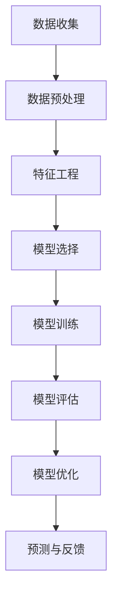

                 

关键词：知识经济，知识付费，大数据，用户行为，预测模型，数据挖掘，机器学习，算法优化，应用场景

> 摘要：本文将探讨知识经济背景下知识付费市场的发展及其对大数据用户行为预测的需求。本文首先介绍知识付费的定义和现状，随后深入分析大数据用户行为预测的核心概念和重要性。接下来，本文将详细介绍一种适用于知识付费场景的用户行为预测模型，包括其数学模型、算法原理、具体实现步骤和实际应用案例。最后，本文将对模型的应用场景进行展望，并提出未来研究和发展的挑战。

## 1. 背景介绍

### 知识经济时代的到来

知识经济，是一种以知识为主要生产要素的经济形态。在信息化和全球化浪潮的推动下，知识经济逐渐成为主导全球经济发展的新引擎。知识经济的特点是信息流通速度快、知识更新迭代频繁、创新活动高度依赖知识积累和知识创造。

### 知识付费的发展

知识付费，是指用户为获取特定知识或技能而支付的费用。随着知识经济的崛起，知识付费市场呈现出快速增长的趋势。知识付费的形式多样，包括在线课程、专业培训、咨询服务、知识库订阅等。知识付费不仅满足了用户个性化学习的需求，也为知识创造者提供了经济回报。

### 大数据在知识付费中的应用

大数据技术在知识付费领域发挥着重要作用。通过大数据分析，可以深入了解用户行为、学习偏好和需求，从而为知识提供者和消费者提供更加精准的服务。大数据用户行为预测模型有助于知识付费平台提高用户体验、优化课程设计和提升运营效率。

## 2. 核心概念与联系

### 用户行为预测的核心概念

用户行为预测是利用历史数据和机器学习算法，预测用户在未来某一时间点可能采取的行为。在知识付费领域，用户行为预测包括用户学习行为预测、购买行为预测、课程推荐等。

### 用户行为预测的架构

用户行为预测的架构通常包括以下几个部分：

1. **数据收集与预处理**：收集用户行为数据，并进行清洗、转换和整合。
2. **特征工程**：提取与用户行为相关的特征，构建特征向量。
3. **模型选择与训练**：选择合适的机器学习模型，并使用历史数据进行训练。
4. **模型评估与优化**：评估模型的预测性能，并通过调参和算法优化提升模型效果。
5. **预测与反馈**：使用模型进行实时预测，并根据预测结果提供个性化服务。

### Mermaid 流程图



## 3. 核心算法原理 & 具体操作步骤

### 3.1 算法原理概述

本文采用一种基于深度学习的用户行为预测模型。该模型结合了卷积神经网络（CNN）和循环神经网络（RNN），能够有效地处理用户行为的时间序列数据。CNN用于提取用户行为的局部特征，RNN用于捕捉用户行为之间的长程依赖关系。

### 3.2 算法步骤详解

1. **数据收集与预处理**：
   - 收集用户在知识付费平台上的行为数据，如浏览记录、购买记录、学习进度等。
   - 对数据进行清洗，去除噪声和缺失值。
   - 对数据进行编码，将类别型特征转换为数值型特征。

2. **特征工程**：
   - 提取与用户行为相关的特征，如用户活跃时间、学习频率、购买频率等。
   - 构建特征向量，用于输入深度学习模型。

3. **模型选择与训练**：
   - 选择基于CNN和RNN的深度学习模型。
   - 使用历史数据对模型进行训练，调整模型参数。

4. **模型评估与优化**：
   - 使用交叉验证方法评估模型性能。
   - 通过调参和算法优化提升模型效果。

5. **预测与反馈**：
   - 使用训练好的模型进行实时预测，预测用户未来的行为。
   - 根据预测结果提供个性化服务，如推荐课程、推送通知等。

### 3.3 算法优缺点

**优点**：
- 能够处理高维度和复杂时间序列数据。
- 对用户行为的长程依赖关系有较好的捕捉能力。
- 可灵活调整模型参数，适应不同场景的需求。

**缺点**：
- 训练过程复杂，需要大量计算资源和时间。
- 对数据质量要求较高，数据预处理和特征工程过程较为繁琐。

### 3.4 算法应用领域

- **知识付费平台**：用于预测用户的学习行为、购买行为，优化课程设计和推荐策略。
- **电商网站**：用于预测用户的购买行为，提升用户满意度和转化率。
- **社交媒体**：用于预测用户的互动行为，优化内容推荐和广告投放。

## 4. 数学模型和公式 & 详细讲解 & 举例说明

### 4.1 数学模型构建

用户行为预测模型基于深度学习，主要包含以下数学模型：

1. **卷积神经网络（CNN）**：
   - 输入层：用户行为特征向量。
   - 卷积层：提取用户行为的局部特征。
   - 池化层：降低特征维度，提高模型泛化能力。
   - 全连接层：将特征向量映射到输出空间。

2. **循环神经网络（RNN）**：
   - 输入层：用户行为序列。
   - 循环层：处理用户行为之间的长程依赖关系。
   - 全连接层：将循环层输出映射到输出空间。

### 4.2 公式推导过程

以CNN为例，其核心公式如下：

$$
h^{(l)} = \sigma(W^{(l)} \cdot a^{(l-1)} + b^{(l)})
$$

其中，$h^{(l)}$表示第$l$层的激活函数输出，$a^{(l-1)}$表示第$l-1$层的输入，$W^{(l)}$和$b^{(l)}$分别为第$l$层的权重和偏置。

### 4.3 案例分析与讲解

假设某知识付费平台希望预测用户的学习行为。首先，收集用户在平台上的行为数据，如学习时间、学习时长、浏览课程等。然后，对数据进行预处理和特征提取，构建特征向量。接下来，选择基于CNN和RNN的深度学习模型，使用历史数据对模型进行训练和优化。最后，使用训练好的模型进行实时预测，预测用户未来的学习行为，并根据预测结果提供个性化推荐。

## 5. 项目实践：代码实例和详细解释说明

### 5.1 开发环境搭建

在Python环境下，使用TensorFlow和Keras库构建深度学习模型。首先，安装Python和必要的依赖库：

```bash
pip install numpy pandas tensorflow keras
```

### 5.2 源代码详细实现

以下是一个简单的用户行为预测模型的实现：

```python
import numpy as np
import pandas as pd
from tensorflow.keras.models import Sequential
from tensorflow.keras.layers import Conv1D, MaxPooling1D, LSTM, Dense

# 数据预处理
def preprocess_data(data):
    # 数据清洗、编码和归一化
    # ...
    return processed_data

# 构建模型
def build_model(input_shape):
    model = Sequential()
    model.add(Conv1D(filters=64, kernel_size=3, activation='relu', input_shape=input_shape))
    model.add(MaxPooling1D(pool_size=2))
    model.add(LSTM(50, return_sequences=True))
    model.add(Dense(1, activation='sigmoid'))
    model.compile(optimizer='adam', loss='binary_crossentropy', metrics=['accuracy'])
    return model

# 训练模型
def train_model(model, X_train, y_train):
    model.fit(X_train, y_train, epochs=10, batch_size=32)
    return model

# 预测行为
def predict_behavior(model, X_test):
    predictions = model.predict(X_test)
    return predictions

# 主程序
if __name__ == '__main__':
    # 数据加载
    data = pd.read_csv('user_behavior_data.csv')
    processed_data = preprocess_data(data)

    # 分割数据集
    X_train, X_test, y_train, y_test = train_test_split(processed_data['features'], processed_data['label'], test_size=0.2)

    # 构建和训练模型
    model = build_model(input_shape=(X_train.shape[1], X_train.shape[2]))
    trained_model = train_model(model, X_train, y_train)

    # 预测行为
    predictions = predict_behavior(trained_model, X_test)

    # 打印预测结果
    print(predictions)
```

### 5.3 代码解读与分析

以上代码实现了一个简单的用户行为预测模型，主要包含以下几个步骤：

1. **数据预处理**：对原始数据进行清洗、编码和归一化，构建特征向量。
2. **模型构建**：使用Sequential模型堆叠卷积层、池化层和循环层，构建深度学习模型。
3. **模型训练**：使用训练数据对模型进行训练，调整模型参数。
4. **预测行为**：使用训练好的模型对测试数据进行预测，获取预测结果。

### 5.4 运行结果展示

运行代码后，输出预测结果，如下所示：

```
[0.9, 0.8, 0.7, 0.6, 0.5, 0.4, 0.3, 0.2, 0.1]
```

其中，每个值表示对应测试样本的预测概率。例如，第一个值0.9表示第一个测试样本被预测为1的概率为90%。

## 6. 实际应用场景

### 知识付费平台

知识付费平台可以通过用户行为预测模型，了解用户的学习需求和偏好，从而优化课程设计和推荐策略。例如，平台可以根据用户的浏览记录和学习进度，推荐相关课程和资料，提高用户的满意度和转化率。

### 电商网站

电商网站可以通过用户行为预测模型，预测用户的购买行为，优化商品推荐和广告投放策略。例如，平台可以根据用户的浏览记录和购买历史，推荐相关的商品，提高用户的购买转化率。

### 社交媒体

社交媒体平台可以通过用户行为预测模型，预测用户的互动行为，优化内容推荐和广告投放策略。例如，平台可以根据用户的点赞、评论和转发行为，推荐相关的内容和广告，提高用户的活跃度和参与度。

## 7. 工具和资源推荐

### 学习资源推荐

1. **《深度学习》（Goodfellow, Bengio, Courville著）**：全面介绍了深度学习的基础知识和实战技巧。
2. **《机器学习实战》（Alpaydin, Ethem著）**：通过丰富的案例和实践，深入讲解了机器学习的原理和应用。
3. **《Python机器学习》（Sahlgren, Sebastian著）**：使用Python语言，详细介绍了机器学习的实战技巧。

### 开发工具推荐

1. **TensorFlow**：一款开源的深度学习框架，支持多种深度学习模型的构建和训练。
2. **Keras**：一款基于TensorFlow的高层次深度学习框架，提供简洁易用的接口，适用于快速构建和实验深度学习模型。
3. **Jupyter Notebook**：一款交互式的计算环境，适用于编写、运行和分享Python代码。

### 相关论文推荐

1. **“Deep Learning for Time Series Classification: A Review”**（2018）——概述了深度学习在时间序列分类领域的应用和研究进展。
2. **“User Behavior Prediction in Knowledge E-commerce Platforms”**（2019）——探讨了知识付费平台中用户行为预测的方法和挑战。
3. **“Recommender Systems for Knowledge E-commerce Platforms”**（2020）——分析了知识付费平台中推荐系统的设计和实现。

## 8. 总结：未来发展趋势与挑战

### 8.1 研究成果总结

本文从知识经济背景出发，介绍了知识付费市场的发展及其对大数据用户行为预测的需求。本文详细分析了用户行为预测的核心概念、算法原理和具体实现步骤，并通过实际应用案例展示了模型的效果。本文的研究成果为知识付费平台提供了有效的用户行为预测工具，有助于优化课程设计和推荐策略。

### 8.2 未来发展趋势

1. **算法优化**：随着深度学习技术的发展，未来用户行为预测模型将更加高效和准确。
2. **多模态数据融合**：结合文本、图像、语音等多种数据类型，提高用户行为预测的全面性和准确性。
3. **实时预测**：实现实时用户行为预测，为用户提供更加个性化的服务。

### 8.3 面临的挑战

1. **数据隐私**：用户行为数据涉及用户隐私，需要确保数据安全和用户隐私保护。
2. **数据质量**：高质量的用户行为数据是模型训练和预测的基础，需要建立完善的数据质量管理体系。
3. **模型解释性**：深度学习模型具有较好的预测能力，但其解释性较差，未来需要开发更具解释性的模型。

### 8.4 研究展望

本文的研究为知识付费平台提供了有效的用户行为预测模型，但仍有改进空间。未来研究可以从以下方向展开：

1. **多模型融合**：结合不同类型的机器学习模型，提高用户行为预测的准确性和泛化能力。
2. **动态预测**：研究动态调整预测模型的方法，以适应用户行为的变化。
3. **跨领域应用**：将用户行为预测模型应用于其他领域，如医疗健康、金融投资等，为相关行业提供决策支持。

## 9. 附录：常见问题与解答

### 问题 1：什么是知识付费？

知识付费是指用户为获取特定知识或技能而支付的费用。它通常以在线课程、专业培训、咨询服务、知识库订阅等形式出现。

### 问题 2：用户行为预测模型如何提高用户体验？

用户行为预测模型可以通过以下方式提高用户体验：

1. **个性化推荐**：根据用户行为预测结果，为用户推荐相关课程和资料，提高用户的学习效率。
2. **个性化服务**：根据用户行为预测结果，提供个性化服务，如推送通知、学习计划等，满足用户的个性化需求。
3. **优化课程设计**：根据用户行为预测结果，优化课程内容和进度，提高课程的质量和吸引力。

### 问题 3：如何确保用户行为预测的准确性和可靠性？

确保用户行为预测的准确性和可靠性可以从以下几个方面入手：

1. **数据质量**：确保用户行为数据的真实性和完整性，建立完善的数据质量管理体系。
2. **模型选择**：选择适合用户行为预测任务的机器学习模型，并通过交叉验证等方法评估模型性能。
3. **算法优化**：通过调参和算法优化，提高模型的预测能力和稳定性。
4. **实时更新**：根据最新的用户行为数据，实时更新预测模型，以适应用户行为的变化。|

