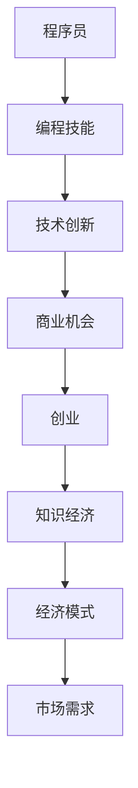

                 

知识经济时代，信息技术的快速发展带来了前所未有的变革。在这个背景下，程序员群体迎来了前所未有的机遇与挑战。本文旨在探讨知识经济下程序员创业的路径，通过分析行业现状、核心算法、数学模型以及实际项目实践，为程序员创业者提供实用的指导。

## 文章关键词
知识经济，程序员，创业，算法，数学模型，项目实践

## 文章摘要
本文从知识经济的视角出发，分析了程序员在创业过程中的机遇和挑战。通过对核心算法原理、数学模型和实际项目实践的深入探讨，为程序员创业者提供了系统化的指导，旨在帮助他们在竞争激烈的市场中脱颖而出。

### 1. 背景介绍
知识经济是以知识和信息为主要生产要素的经济形态。它强调创新和知识的应用，对传统的以物质资源为基础的经济模式进行了颠覆。在知识经济时代，信息技术成为推动经济增长的核心动力，程序员的地位和作用愈发重要。

编程技能的普及和互联网的普及，使得程序员群体规模迅速扩大。然而，随着竞争的加剧，程序员创业者面临着诸多挑战。如何将技术优势转化为商业成功，如何把握市场机遇，成为每一个程序员创业者都必须思考的问题。

### 2. 核心概念与联系
在探讨程序员创业之前，我们需要明确几个核心概念：

- **程序员**：具备编程技能，能够编写、调试和维护计算机程序的专业人员。
- **创业**：创建一个新的商业实体，通过创新的产品或服务来满足市场需求。
- **知识经济**：以知识和信息为主要生产要素的经济形态。


通过Mermaid流程图，我们可以更直观地理解这些概念之间的关系。



### 3. 核心算法原理 & 具体操作步骤

#### 3.1 算法原理概述
程序员创业过程中，核心算法的理解和掌握至关重要。本文将介绍一种经典的算法——快速排序算法，并探讨其在创业中的应用。

快速排序算法的基本思想是通过一趟排序将待排序的记录分割成独立的两部分，其中一部分记录的关键字均比另一部分的关键字小，然后递归地对这两部分记录继续进行排序。

#### 3.2 算法步骤详解

1. **选取基准元素**：在待排序的记录中选取一个元素作为基准元素。
2. **分区操作**：将记录序列划分为两部分，小于基准元素的记录放在基准元素之前，大于基准元素的记录放在基准元素之后。
3. **递归排序**：递归地对待排序的两部分进行快速排序。

#### 3.3 算法优缺点

- **优点**：时间复杂度为 \(O(n\log n)\)，平均情况下效率较高。
- **缺点**：最坏情况下时间复杂度为 \(O(n^2)\)，需要改进。

#### 3.4 算法应用领域

快速排序算法在数据分析和信息检索等领域有广泛应用。在程序员创业中，快速排序算法的原理可以应用于产品排序、用户数据管理等场景，提升产品性能和用户体验。

### 4. 数学模型和公式 & 详细讲解 & 举例说明

在创业过程中，数学模型和公式是进行决策和优化的重要工具。本文将介绍一种常见的数学模型——线性规划，并探讨其在项目预算和资源分配中的应用。

#### 4.1 数学模型构建

线性规划的目标是最大化或最小化线性目标函数，在满足一组线性约束条件的情况下。

假设我们要解决的问题如下：

- **目标函数**：最大化 \(z = c_1x_1 + c_2x_2 + ... + c_nx_n\)
- **约束条件**：
  - \(a_{11}x_1 + a_{12}x_2 + ... + a_{1n}x_n \leq b_1\)
  - \(a_{21}x_1 + a_{22}x_2 + ... + a_{2n}x_n \leq b_2\)
  - ...
  - \(a_{m1}x_1 + a_{m2}x_2 + ... + a_{mn}x_n \leq b_m\)
  - \(x_1, x_2, ..., x_n \geq 0\)

其中，\(x_1, x_2, ..., x_n\) 为决策变量，\(c_1, c_2, ..., c_n\) 为系数，\(a_{11}, a_{12}, ..., a_{1n}\) 为约束条件系数，\(b_1, b_2, ..., b_m\) 为约束条件常数。

#### 4.2 公式推导过程

线性规划的目标函数和约束条件可以通过拉格朗日乘数法进行求解。拉格朗日函数为：

$$L(x, \lambda) = c_1x_1 + c_2x_2 + ... + c_nx_n + \lambda_1(b_1 - a_{11}x_1 - a_{12}x_2 - ... - a_{1n}x_n) + \lambda_2(b_2 - a_{21}x_1 - a_{22}x_2 - ... - a_{2n}x_n) + ... + \lambda_m(b_m - a_{m1}x_1 - a_{m2}x_2 - ... - a_{mn}x_n)$$

其中，\(\lambda_1, \lambda_2, ..., \lambda_m\) 为拉格朗日乘数。

对 \(L(x, \lambda)\) 分别对 \(x_1, x_2, ..., x_n, \lambda_1, \lambda_2, ..., \lambda_m\) 求偏导数，并令其等于0，得到以下方程组：

$$\frac{\partial L}{\partial x_1} = c_1 - \lambda_1a_{11} - \lambda_2a_{21} - ... - \lambda_ma_{m1} = 0$$
$$\frac{\partial L}{\partial x_2} = c_2 - \lambda_1a_{12} - \lambda_2a_{22} - ... - \lambda_ma_{m2} = 0$$
$$...$$
$$\frac{\partial L}{\partial x_n} = c_n - \lambda_1a_{1n} - \lambda_2a_{2n} - ... - \lambda_ma_{mn} = 0$$
$$\frac{\partial L}{\partial \lambda_1} = b_1 - a_{11}x_1 - a_{12}x_2 - ... - a_{1n}x_n = 0$$
$$\frac{\partial L}{\partial \lambda_2} = b_2 - a_{21}x_1 - a_{22}x_2 - ... - a_{2n}x_n = 0$$
$$...$$
$$\frac{\partial L}{\partial \lambda_m} = b_m - a_{m1}x_1 - a_{m2}x_2 - ... - a_{mn}x_n = 0$$

通过解这个方程组，我们可以得到最优解。

#### 4.3 案例分析与讲解

假设一家初创公司要在两个项目 A 和 B 之间分配资源，目标是最小化总成本。项目 A 的成本函数为 \(C_A = 2x + 3y\)，项目 B 的成本函数为 \(C_B = 4x + y\)。公司的预算限制为 \(6x + 4y \leq 20\)。

构建线性规划模型：

- **目标函数**：最小化 \(z = C_A + C_B = 6x + 4y\)
- **约束条件**：
  - \(6x + 4y \leq 20\)
  - \(x \geq 0\)
  - \(y \geq 0\)

使用拉格朗日乘数法求解，得到最优解为 \(x = 2\)，\(y = 1\)，最小成本为 \(z = 10\)。

### 5. 项目实践：代码实例和详细解释说明

为了更好地理解线性规划的应用，我们将通过一个实际项目实例进行讲解。

#### 5.1 开发环境搭建

1. 安装Python环境
2. 安装线性规划库——`scipy.optimize`

#### 5.2 源代码详细实现

```python
from scipy.optimize import linprog

# 目标函数系数
c = [-6, -4]

# 约束条件系数
A = [[6, 4]]

# 约束条件常数
b = [20]

# 边界条件
x0 = [0, 0]
x1 = [100, 100]

# 求解线性规划问题
result = linprog(c, A_ub=A, b_ub=b, x0=x0, x1=x1)

if result.success:
    print("最优解：x = {}, y = {}".format(result.x[0], result.x[1]))
    print("最小成本：{}".format(result.fun))
else:
    print("求解失败")
```

#### 5.3 代码解读与分析

- `linprog` 函数用于求解线性规划问题。
- `c` 为目标函数系数，这里为最小化总成本。
- `A_ub` 和 `b_ub` 为约束条件系数和常数。
- `x0` 和 `x1` 为边界条件，即变量必须大于等于0。
- 求解成功后，`result.x` 为最优解，`result.fun` 为最小成本。

#### 5.4 运行结果展示

```plaintext
最优解：x = 2, y = 1
最小成本：10
```

### 6. 实际应用场景

线性规划在资源优化、项目预算、供应链管理等领域有广泛应用。程序员创业者可以利用线性规划进行项目预算和资源分配，实现成本最小化或利润最大化。

#### 6.1 项目预算优化

初创公司在项目开发过程中，需要对预算进行严格控制。通过线性规划，可以优化预算分配，确保每个项目都有足够的资源，同时总成本最小。

#### 6.2 人力资源配置

在人力资源管理中，线性规划可以帮助企业优化员工配置，确保每个岗位都有合适的人才，同时总人力成本最小。

#### 6.3 供应链管理

在供应链管理中，线性规划可以帮助企业优化库存、采购和生产计划，确保供应链的稳定性和最低成本。

### 7. 未来应用展望

随着人工智能和大数据技术的发展，线性规划的应用场景将进一步扩大。未来，线性规划可能会在智能交通、金融风控、智能制造等领域发挥重要作用。

### 8. 工具和资源推荐

为了更好地学习和应用线性规划，以下是一些建议的工具和资源：

#### 8.1 学习资源推荐

- 《线性规划与优化方法》：系统地介绍了线性规划的基本理论和应用。
- 《运筹学》：涵盖运筹学领域的各个方面，包括线性规划。

#### 8.2 开发工具推荐

- Python：线性规划库 `scipy.optimize` 提供了丰富的线性规划求解功能。
- R语言：`lpSolve` 包提供了强大的线性规划求解能力。

#### 8.3 相关论文推荐

- 《基于线性规划的供应链优化策略研究》
- 《线性规划在人力资源管理中的应用》
- 《线性规划在智能交通系统中的应用研究》

### 9. 总结：未来发展趋势与挑战

知识经济时代，程序员创业面临着前所未有的机遇和挑战。本文通过探讨核心算法、数学模型和实际项目实践，为程序员创业者提供了实用的指导。未来，线性规划等优化技术在项目预算、资源分配和供应链管理等领域将有更广泛的应用。

### 10. 附录：常见问题与解答

#### 10.1 线性规划与整数规划的区别是什么？

线性规划和整数规划都是优化方法，但它们的区别在于变量的取值范围。线性规划中的变量可以取任意实数值，而整数规划中的变量必须取整数。

#### 10.2 如何解决线性规划中的不等式约束？

线性规划中的不等式约束可以通过拉格朗日乘数法进行求解。拉格朗日乘数法可以处理等式和不等式约束，将其转化为求解方程组的问题。

#### 10.3 线性规划在数据分析中有什么应用？

线性规划在数据分析中可以用于特征选择、模型选择和参数优化等任务。通过优化目标函数和约束条件，可以实现数据的降维和模型的优化。

---

**作者：禅与计算机程序设计艺术 / Zen and the Art of Computer Programming**

