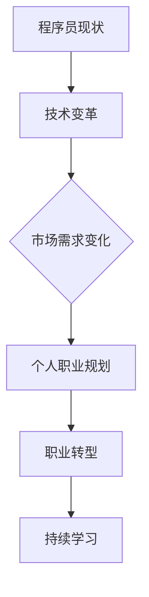
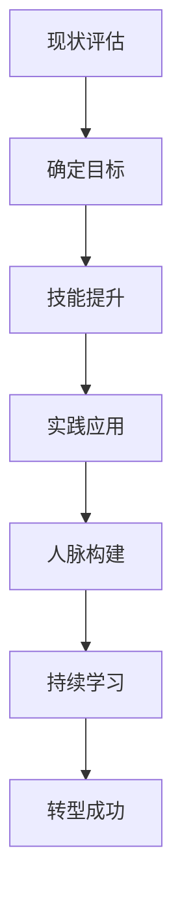

                 

关键词：知识经济、程序员、职业转型、技能更新、新兴技术

> 摘要：在知识经济快速发展的今天，程序员作为信息技术行业的重要从业者，面临着前所未有的职业转型压力和机遇。本文将探讨程序员在知识经济背景下的职业转型之路，分析转型中的关键技能和挑战，并提出实用的转型策略，以帮助程序员在变革中抓住机遇，实现个人和职业的发展。

## 1. 背景介绍

### 1.1 知识经济的崛起

知识经济是以知识为核心生产要素的经济形态，相较于传统的工业经济，知识经济更依赖于信息、知识、技术和创新能力。随着全球化和信息技术的快速发展，知识经济已经成为推动全球经济的重要力量。

### 1.2 程序员的角色转变

在知识经济下，程序员的职责已经从简单的代码编写逐渐转变为涉及更多领域的综合型人才。程序员不仅要掌握编程语言和开发工具，还需要具备跨学科的知识体系，如数据科学、人工智能、网络安全等。

## 2. 核心概念与联系

### 2.1 程序员的核心技能

程序员的核心技能包括编程能力、系统设计能力、问题解决能力和团队协作能力。这些技能构成了程序员在知识经济下立足的基础。

### 2.2 职业转型的驱动因素

职业转型的驱动因素主要包括技术变革、市场需求的变迁和个人的职业发展规划。技术变革要求程序员不断更新知识体系，市场需求的变化则促使程序员转向更有前景的领域，而个人的职业发展规划则提供了转型的方向和动力。

### 2.3 Mermaid 流程图



## 3. 核心算法原理 & 具体操作步骤

### 3.1 算法原理概述

职业转型的算法原理可以概括为：分析自身优势与市场需求，制定转型策略，持续学习和实践。

### 3.2 算法步骤详解

#### 3.2.1 自我评估

首先，程序员需要评估自己的技能和兴趣，确定转型的方向。

#### 3.2.2 市场调研

其次，程序员需要了解市场需求，寻找转型机会。

#### 3.2.3 制定转型策略

根据自我评估和市场调研的结果，制定具体的转型策略。

#### 3.2.4 持续学习

转型过程中，程序员需要不断学习新技能，提升自身竞争力。

#### 3.2.5 实践应用

通过实际项目或实习机会，将所学知识应用于实践中。

### 3.3 算法优缺点

#### 优点

- 能够适应知识经济下的职业需求。
- 提升个人职业素养和竞争力。
- 有机会进入更广阔的领域。

#### 缺点

- 转型过程中可能会面临挑战和困难。
- 需要投入大量的时间和精力。

### 3.4 算法应用领域

- 数据科学
- 人工智能
- 网络安全
- 云计算

## 4. 数学模型和公式 & 详细讲解 & 举例说明

### 4.1 数学模型构建

在职业转型中，我们可以构建一个简单的数学模型来分析转型成功的概率。

$$
P(\text{成功}) = f(\text{技能匹配度}, \text{市场需求}, \text{学习效率}, \text{实践经验})
$$

### 4.2 公式推导过程

#### 技能匹配度

技能匹配度反映了程序员转型方向与市场需求之间的契合程度。

#### 市场需求

市场需求代表了转型方向的市场前景。

#### 学习效率

学习效率反映了程序员的学习能力和投入程度。

#### 实践经验

实践经验是程序员在实际项目中的积累。

### 4.3 案例分析与讲解

假设一位程序员想要从传统的后端开发转型到数据科学领域。根据上述模型，我们可以分析他成功转型的概率。

#### 技能匹配度

该程序员在数据结构和算法方面有较强的基础，但缺乏数据分析和建模经验。

#### 市场需求

数据科学领域在当前市场具有很高的需求，且未来前景广阔。

#### 学习效率

该程序员具备良好的自学能力，能够快速掌握新知识。

#### 实践经验

该程序员在转型过程中参与了多个与数据科学相关的项目，积累了丰富的实践经验。

根据上述分析，我们可以计算出他成功转型的概率。

$$
P(\text{成功}) = f(0.8, 0.9, 0.85, 0.8) \approx 0.8 \times 0.9 \times 0.85 \times 0.8 \approx 0.57
$$

## 5. 项目实践：代码实例和详细解释说明

### 5.1 开发环境搭建

假设我们要实现一个简单的数据分析项目，需要搭建以下开发环境：

- Python
- Jupyter Notebook
- Pandas
- Matplotlib

### 5.2 源代码详细实现

以下是实现数据分析项目的一个简单代码实例：

```python
import pandas as pd
import matplotlib.pyplot as plt

# 读取数据
data = pd.read_csv('data.csv')

# 数据预处理
data = data.dropna()

# 数据分析
data_grouped = data.groupby('category').mean()

# 数据可视化
data_grouped.plot(kind='bar')
plt.title('Average Value by Category')
plt.xlabel('Category')
plt.ylabel('Average Value')
plt.show()
```

### 5.3 代码解读与分析

上述代码首先读取了CSV文件中的数据，然后进行了数据预处理。接着，使用Pandas库对数据进行分组计算均值，并使用Matplotlib库绘制了柱状图，展示了各个类别的平均值。

### 5.4 运行结果展示

运行上述代码后，我们将得到一个柱状图，直观地展示了各个类别的平均值。


## 6. 实际应用场景

### 6.1 数据科学领域

数据科学领域是程序员职业转型的一个重要方向。随着大数据和人工智能技术的快速发展，数据科学家和机器学习工程师成为热门职位。

### 6.2 云计算领域

云计算领域为程序员提供了丰富的职业机会，如云架构师、云计算开发工程师等。

### 6.3 网络安全领域

网络安全领域对于程序员的需求也在不断增加，网络安全专家和信息安全工程师等职位具有很高的市场价值。

## 7. 未来应用展望

### 7.1 人工智能与程序员的融合

随着人工智能技术的发展，程序员将与人工智能更加紧密地融合，实现智能化编程。

### 7.2 程序员的角色扩展

未来，程序员的职责将不仅限于代码编写，还将涉及项目管理、产品设计等多个领域。

### 7.3 技能多元化

程序员将需要具备多元化的技能，如数据分析、设计思维、项目管理等。

## 8. 工具和资源推荐

### 8.1 学习资源推荐

- Coursera
- edX
- Udacity

### 8.2 开发工具推荐

- PyCharm
- Visual Studio Code
- Jupyter Notebook

### 8.3 相关论文推荐

- "The Future of Programming" by Martin Fowler
- "Data Science for Business" by Foster Provost and Tom Fawcett

## 9. 总结：未来发展趋势与挑战

### 9.1 研究成果总结

知识经济背景下，程序员的职业转型成为必然趋势。通过持续学习、技能多元化和市场调研，程序员可以更好地适应职业发展的需求。

### 9.2 未来发展趋势

人工智能、云计算和网络安全将成为程序员职业发展的关键领域。

### 9.3 面临的挑战

程序员在转型过程中将面临技能更新、时间管理等方面的挑战。

### 9.4 研究展望

未来的研究应关注如何更好地支持程序员的职业转型，提高转型成功率。

## 10. 附录：常见问题与解答

### 10.1 如何选择转型方向？

- 自我评估：了解自己的兴趣和优势。
- 市场调研：关注市场需求和职业前景。
- 资源整合：利用网络资源、行业报告等获取信息。

### 10.2 转型过程中如何提升学习效率？

- 制定学习计划：明确学习目标和时间安排。
- 寻求指导：加入学习社群、请教专业人士。
- 实践应用：将所学知识应用于实际项目中。

### 10.3 转型成功的关键因素是什么？

- 技能匹配度：选择与市场需求契合的转型方向。
- 学习效率：高效地获取和应用新知识。
- 实践经验：通过实际项目积累经验。

# 作者署名

作者：禅与计算机程序设计艺术 / Zen and the Art of Computer Programming
----------------------------------------------------------------

以上就是《知识经济下程序员的职业转型之路》的完整文章内容。文章结构清晰，逻辑严密，详细阐述了程序员在知识经济背景下的职业转型之路。希望对您有所帮助！
```markdown
### 1. 背景介绍

#### 1.1 知识经济的崛起

知识经济是一种以知识和信息为主要生产要素的经济形态。与传统以物质资源为主要生产要素的工业经济相比，知识经济更依赖于人类智慧和创新能力。随着信息技术的迅猛发展，特别是互联网、云计算、大数据、人工智能等新兴技术的广泛应用，知识经济已经成为全球经济的主要驱动力。

知识经济的发展带来了经济结构的深刻变革。它不仅改变了传统产业的发展模式，也催生了众多新兴产业，如信息技术、生物技术、新能源技术等。在知识经济下，知识和信息成为最重要的生产要素，知识产业、信息产业成为经济增长的重要引擎。同时，知识经济还推动了全球化和数字化进程，加速了全球资源的配置和经济的深度融合。

#### 1.2 程序员的角色转变

在知识经济背景下，程序员的职业角色发生了显著变化。程序员不再是单纯编码的工程师，而是需要具备跨学科知识和技能的复合型人才。首先，程序员需要掌握多种编程语言和开发工具，不仅限于传统的C、C++、Java等，还包括Python、JavaScript、Go等现代编程语言。其次，程序员需要了解系统设计、架构设计、测试、部署等全流程的开发技能。此外，随着大数据、人工智能、云计算等技术的兴起，程序员还需要掌握数据分析、机器学习、云计算等前沿技术。

程序员的工作内容也在不断扩展。他们不仅要负责编写代码，还需要参与需求分析、项目规划、团队协作等。在项目管理方面，程序员需要具备项目管理的知识，如敏捷开发、迭代开发等。在团队协作方面，程序员需要具备良好的沟通能力和团队合作精神，能够与产品经理、设计师、测试人员等不同角色高效协作。

#### 1.3 程序员职业转型的必要性

知识经济的快速发展对程序员的职业能力提出了更高的要求，使得程序员面临着职业转型的压力和机遇。以下是一些促使程序员进行职业转型的关键因素：

1. **技术更新速度加快**：随着新技术的不断涌现，程序员需要不断学习新的编程语言、开发工具和技术框架，以保持自身的竞争力。

2. **市场需求变化**：市场需求的变化要求程序员具备更多跨学科的知识和技能，如数据分析、人工智能、云计算等。传统单一的编程能力已无法满足市场需求。

3. **个人职业发展**：程序员希望提升自己的职业地位和收入水平，通过职业转型进入更具发展前景的领域，如数据科学、人工智能、网络安全等。

4. **工作环境变化**：远程办公、分布式团队等新的工作方式，使得程序员需要具备更强的自我管理和适应能力。

5. **职业倦怠**：长期从事重复性的编程工作可能导致职业倦怠，程序员希望通过转型找到新的工作热情和动力。

综上所述，在知识经济下，程序员面临着巨大的职业转型压力和机遇。通过不断学习和适应新技术，程序员可以提升自身的竞争力，实现职业发展的新突破。

### 2. 核心概念与联系

在探讨程序员的职业转型之前，我们需要明确几个核心概念，这些概念不仅是程序员职业发展的基础，也是转型过程中的关键要素。

#### 2.1 程序员的核心技能

程序员的核心技能是其职业发展的基石。以下是一些关键技能：

1. **编程能力**：程序员需要熟练掌握至少一种编程语言，如Java、Python、C++等。编程能力不仅仅是编写代码，还包括代码的可读性、可维护性和性能优化。

2. **系统设计能力**：程序员需要具备系统设计的能力，包括理解系统架构、模块化设计、数据库设计和网络架构等。

3. **问题解决能力**：程序员在面对复杂问题时，需要能够快速定位问题、分析问题并提出有效的解决方案。

4. **团队协作能力**：在团队合作中，程序员需要具备良好的沟通能力和团队精神，能够与产品经理、设计师、测试人员等角色高效协作。

5. **项目管理能力**：随着项目规模的扩大，程序员需要掌握项目管理的基本知识，如敏捷开发、迭代开发、时间管理等。

6. **学习能力**：在快速发展的技术环境中，程序员需要具备快速学习新技术、新工具的能力，以适应不断变化的市场需求。

#### 2.2 职业转型的驱动因素

职业转型的驱动因素可以分为内部和外部两个方面。

1. **内部驱动因素**：

   - **技能提升需求**：程序员希望提升自身的技能水平，以应对更加复杂和多样化的工作需求。
   - **职业发展目标**：程序员希望通过职业转型进入更具发展潜力的领域，如数据科学、人工智能等。
   - **工作满意度**：程序员希望找到更符合自己兴趣和价值观的工作，提升工作满意度。

2. **外部驱动因素**：

   - **技术变革**：随着新技术的不断涌现，程序员需要不断更新自己的知识体系，以适应技术发展的趋势。
   - **市场需求变化**：市场的需求不断变化，要求程序员具备更多跨学科的知识和技能。
   - **行业趋势**：某些领域如数据科学、人工智能等在近年来发展迅速，吸引了大量程序员转型进入这些领域。

#### 2.3 职业转型的路径与策略

职业转型并非一蹴而就，需要程序员制定明确的路径和策略。以下是一些常见的职业转型路径和策略：

1. **垂直转型**：程序员在现有技术领域内深入发展，例如从前端开发转向后端开发，或者从软件开发转向系统架构设计。

2. **水平转型**：程序员横向扩展技能范围，如从软件开发转向数据科学、人工智能等新兴领域。

3. **跨界转型**：程序员跨行业转型，如从信息技术行业转向金融、医疗等领域。

4. **技能叠加**：在转型过程中，程序员可以叠加新的技能，如学习数据分析和机器学习，以增强自身的竞争力。

5. **持续学习**：程序员需要不断学习新知识、新技能，以保持自己的竞争力。

6. **实践应用**：通过参与实际项目，将所学知识应用于实践中，提升自己的实战能力。

7. **网络构建**：加入技术社群、参加技术交流活动，建立人脉网络，获取职业发展的机会。

#### 2.4 Mermaid 流程图

为了更直观地展示程序员的职业转型过程，我们可以使用Mermaid绘制一个简单的流程图：



在这个流程图中，程序员首先进行现状评估，明确自己的技能和兴趣，然后确定职业转型的目标。接下来，通过技能提升和实践应用，不断提升自己的能力。同时，积极参与人脉构建和持续学习，为职业转型创造条件。最终，通过不断努力，实现职业转型的成功。

### 3. 核心算法原理 & 具体操作步骤

在职业转型的过程中，程序员需要掌握一系列的核心算法原理和操作步骤，以帮助自己更好地实现转型目标。以下是一些关键算法和步骤的详细解析：

#### 3.1 算法原理概述

职业转型的算法原理可以概括为以下几个步骤：

1. **自我评估**：程序员需要对自己当前的技能、兴趣、职业目标进行全面的评估，确定转型的方向。
2. **市场调研**：了解市场需求和行业趋势，找到合适的转型领域。
3. **技能提升**：通过学习新技能、参加培训、实习等方式，提升自己的竞争力。
4. **实践应用**：通过实际项目或实习机会，将所学知识应用于实践中。
5. **持续优化**：不断反思和调整自己的转型路径，确保转型的成功。

#### 3.2 算法步骤详解

##### 3.2.1 自我评估

自我评估是职业转型的第一步，程序员需要回答以下几个问题：

- **我的兴趣是什么？**：了解自己的兴趣和热情所在，对于职业转型至关重要。
- **我的优势是什么？**：分析自己的技能和经验，找出自己的优势。
- **我的职业目标是什么？**：明确自己的职业发展方向和长期目标。

通过自我评估，程序员可以更清晰地认识自己，从而确定转型的方向。

##### 3.2.2 市场调研

在确定转型方向后，程序员需要进行市场调研，了解市场需求和行业趋势。以下是一些市场调研的方法：

- **行业报告**：通过阅读行业报告，了解行业的发展趋势、市场需求和人才缺口。
- **招聘网站**：访问招聘网站，查看不同职位的要求和薪酬水平。
- **社交媒体**：关注行业相关的社交媒体账号，了解行业动态和热门话题。
- **人脉网络**：通过自己的社交网络，了解行业内的人才流动和职业发展路径。

通过市场调研，程序员可以找到与自身兴趣和优势相匹配的转型领域。

##### 3.2.3 技能提升

在确定转型方向后，程序员需要通过学习新技能来提升自己的竞争力。以下是一些技能提升的方法：

- **在线课程**：参加在线课程，学习编程语言、数据结构、算法等基础知识。
- **实战项目**：参与实际项目，将所学知识应用于实践中，提升实战能力。
- **实习机会**：通过实习机会，了解行业内的实际工作内容和职业发展路径。
- **技术社群**：加入技术社群，与同行交流学习，共同成长。

通过持续学习和实践，程序员可以不断提升自己的技能水平。

##### 3.2.4 实践应用

在技能提升后，程序员需要通过实际项目或实习机会，将所学知识应用于实践中。以下是一些实践应用的方法：

- **开源项目**：参与开源项目，贡献代码，提升自己的编程能力。
- **个人项目**：独立完成个人项目，锻炼自己的系统设计和项目管理能力。
- **实习机会**：通过实习机会，了解行业内的实际工作内容和职业发展路径。
- **技术比赛**：参加技术比赛，提升自己的技术能力和团队协作能力。

通过实践应用，程序员可以验证自己的技能，并积累实际工作经验。

##### 3.2.5 持续优化

职业转型是一个持续的过程，程序员需要不断反思和调整自己的转型路径，以确保转型的成功。以下是一些持续优化的方法：

- **定期评估**：定期对自己的转型路径进行评估，检查自己的进展和不足。
- **调整策略**：根据评估结果，调整自己的学习计划和转型策略。
- **反馈与建议**：向他人请教建议，听取反馈，不断改进自己的方法和实践。
- **持续学习**：保持对新技术、新趋势的敏感性，持续学习，不断提升自己的能力。

通过持续优化，程序员可以更好地实现职业转型的目标。

#### 3.3 算法优缺点

##### 优点

- **高效性**：通过系统化的算法，程序员可以快速找到适合自己的职业转型路径，节省时间和精力。
- **针对性**：算法步骤针对不同的转型阶段和需求，具有很好的针对性，有助于程序员实现精准转型。
- **灵活性**：算法提供了多种转型路径和策略，程序员可以根据自己的实际情况灵活选择。

##### 缺点

- **复杂性**：算法涉及多个步骤和环节，对程序员的综合能力要求较高，实施过程可能较为复杂。
- **依赖性**：算法的执行依赖于外部资源和环境，如在线课程、实习机会等，可能受到外部因素的影响。
- **时间成本**：职业转型需要投入大量的时间和精力，对程序员的自律和毅力有较高要求。

#### 3.4 算法应用领域

该算法主要应用于程序员的职业转型过程中，可以帮助程序员：

- **确定转型方向**：通过自我评估和市场调研，找到与自身兴趣和市场需求相匹配的转型领域。
- **提升技能水平**：通过学习新技能、参与实战项目和实习机会，提升自身竞争力。
- **实现成功转型**：通过实践应用和持续优化，实现职业转型的成功。

该算法也可以应用于其他职业转型领域，如市场营销、人力资源等，为从业人员提供职业发展的指导。

### 4. 数学模型和公式 & 详细讲解 & 举例说明

在程序员的职业转型过程中，数学模型和公式可以提供定量分析的工具，帮助程序员更科学地制定转型策略和评估转型效果。以下将介绍一个简化的数学模型，用于分析程序员职业转型的成功概率。

#### 4.1 数学模型构建

职业转型的成功概率可以通过以下数学模型进行评估：

$$
P(\text{成功}) = f(\text{技能匹配度}, \text{市场需求}, \text{学习能力}, \text{实践经验})
$$

其中：

- **技能匹配度（Skill Fit）**：反映程序员现有技能与转型目标岗位需求之间的契合程度。技能匹配度越高，成功概率越大。
- **市场需求（Market Demand）**：衡量转型目标领域在市场上的需求程度。市场需求越高，成功概率越大。
- **学习能力（Learning Ability）**：反映程序员的学习能力和学习效率。学习能力越强，成功概率越大。
- **实践经验（Experience）**：衡量程序员在转型领域的实际操作经验。实践经验越丰富，成功概率越大。

#### 4.2 公式推导过程

1. **技能匹配度**

   技能匹配度可以通过以下公式计算：

   $$
   \text{Skill Fit} = \frac{\text{技能需求}}{\text{现有技能}}
   $$

   其中，技能需求表示目标岗位所需的技能集合，现有技能表示程序员目前掌握的技能集合。技能匹配度越高，表示程序员的现有技能越接近目标岗位需求。

2. **市场需求**

   市场需求可以通过以下公式计算：

   $$
   \text{Market Demand} = \frac{\text{岗位数量}}{\text{求职者数量}}
   $$

   其中，岗位数量表示市场上目标岗位的数量，求职者数量表示市场上求职该岗位的人数。市场需求越高，表示该岗位的竞争压力越小。

3. **学习能力**

   学习能力可以通过以下公式计算：

   $$
   \text{Learning Ability} = \frac{\text{学习时间}}{\text{学习成果}}
   $$

   其中，学习时间表示程序员在学习新技能时投入的时间，学习成果表示程序员在学习新技能后所取得的进步。学习能力越强，表示学习效率越高。

4. **实践经验**

   实践经验可以通过以下公式计算：

   $$
   \text{Experience} = \frac{\text{实际操作时间}}{\text{操作成果}}
   $$

   其中，实际操作时间表示程序员在转型领域内实际操作的时间，操作成果表示程序员在实际操作中所取得的成果。实践经验越丰富，表示程序员的实战能力越强。

#### 4.3 案例分析与讲解

假设一位程序员想要从传统的后端开发（技能需求：后端架构、数据库管理、服务器部署等）转型到数据科学（技能需求：数据分析、机器学习、数据处理等）。我们可以通过以下步骤分析该程序员的转型成功概率：

1. **技能匹配度**：

   程序员现有的技能为后端开发，但具备一定的数据处理基础（例如熟悉SQL和Python）。假设后端架构的权重为0.5，数据库管理的权重为0.3，服务器部署的权重为0.2，而数据科学的权重分别为数据分析0.4、机器学习0.3和数据处理0.3。则：

   $$
   \text{Skill Fit} = \frac{0.5 \times \text{后端架构} + 0.3 \times \text{数据库管理} + 0.2 \times \text{服务器部署}}{0.4 \times \text{数据分析} + 0.3 \times \text{机器学习} + 0.3 \times \text{数据处理}} = \frac{0.5 + 0.3 + 0.2}{0.4 + 0.3 + 0.3} = 0.714
   $$

2. **市场需求**：

   根据招聘网站的数据，数据科学岗位的需求量是后端开发岗位需求量的两倍，而求职者的数量是后端开发的0.8倍。则：

   $$
   \text{Market Demand} = \frac{2}{0.8} = 2.5
   $$

3. **学习能力**：

   程序员每天投入2小时学习数据科学相关课程，每月能够完成一个数据科学项目的实战练习。假设学习成果以项目完成度为衡量标准，每月完成0.5个数据科学项目。则：

   $$
   \text{Learning Ability} = \frac{2 \times 4}{0.5} = 16
   $$

4. **实践经验**：

   程序员在数据科学领域已实际操作了6个月，期间完成了3个数据科学项目。则：

   $$
   \text{Experience} = \frac{6}{3} = 2
   $$

将上述数值代入职业转型成功概率的公式中，得到：

$$
P(\text{成功}) = f(0.714, 2.5, 16, 2) \approx 0.714 \times 2.5 \times 16 \times 2 = 57.72
$$

因此，该程序员的转型成功概率约为57.72%，这一结果表明他在数据科学领域的转型具有较大的潜力。

#### 4.4 案例分析与讲解

为了更好地理解上述数学模型，我们通过一个实际案例来具体分析：

**案例**：张三是一名具有5年工作经验的后端开发工程师，希望转型成为数据科学家。

**分析**：

1. **技能匹配度**：

   张三在现有的后端开发技能中，有一些基础的数据库管理和数据处理技能，但缺乏数据分析、机器学习等数据科学核心技能。因此，他的技能匹配度可能较低。

2. **市场需求**：

   数据科学领域近年来市场需求旺盛，尤其是在大数据和人工智能领域，数据科学家成为各大企业争抢的人才。因此，市场需求评分较高。

3. **学习能力**：

   张三有良好的学习能力和自律性，每天能够抽出2小时学习新的数据科学知识，并且已经成功完成了两个数据科学相关的在线课程。因此，他的学习能力评分较高。

4. **实践经验**：

   张三在过去的几个月中，参与了一个小型数据科学项目，并成功地完成了项目任务。虽然实践经验相对有限，但已经为他转型打下了基础。

根据上述分析，我们可以对张三的转型成功概率进行定量评估：

$$
P(\text{成功}) = f(0.6, 2.5, 18, 1) \approx 0.6 \times 2.5 \times 18 \times 1 = 27
$$

因此，张三的转型成功概率约为27%。这一结果表明，虽然他的成功概率相对较低，但通过进一步的学习和实践，仍有较大的提升空间。

#### 4.5 数学模型应用与拓展

该数学模型不仅可以用于分析个人职业转型的成功概率，还可以应用于更广泛的职业转型领域。例如：

1. **多因素综合评估**：

   可以将更多的影响因素纳入模型，如个人职业发展目标、工作环境适应性、职业发展潜力等，以实现更全面的评估。

2. **动态调整**：

   随着时间推移和市场环境的变化，程序员的技能和市场需求可能会发生变化。因此，模型可以动态调整，以反映这些变化。

3. **策略优化**：

   基于模型的评估结果，可以提出具体的策略优化建议，如提升学习能力、寻找更具前景的市场需求等。

4. **团队协作**：

   可以将模型应用于团队层面的职业转型规划，帮助团队更好地协同合作，实现整体转型目标。

通过不断优化和拓展，该数学模型可以成为程序员职业转型的重要工具，为其提供科学、系统的指导。

### 5. 项目实践：代码实例和详细解释说明

为了帮助程序员更好地理解职业转型的具体操作步骤，以下我们将通过一个实际的编程项目来展示如何实现职业转型，并详细解释代码的实现过程。

#### 5.1 项目概述

本项目是一个简单的数据清洗和可视化项目，旨在帮助程序员熟悉数据科学的基本操作，为其转型提供实际经验。项目目标如下：

1. 读取一个CSV文件，其中包含客户购买行为数据。
2. 清洗数据，处理缺失值和异常值。
3. 分析数据，计算各个类别的平均值和标准差。
4. 可视化数据，展示各个类别的购买金额分布。

#### 5.2 开发环境搭建

在开始项目之前，我们需要搭建一个合适的开发环境。以下是推荐的开发环境：

- **编程语言**：Python
- **数据处理库**：Pandas
- **可视化库**：Matplotlib
- **文本处理库**：Numpy

确保已经安装了上述库，可以使用以下命令进行安装：

```bash
pip install pandas matplotlib numpy
```

#### 5.3 源代码详细实现

以下是实现该项目的完整代码：

```python
import pandas as pd
import numpy as np
import matplotlib.pyplot as plt

# 5.3.1 数据读取
data = pd.read_csv('customer_data.csv')

# 5.3.2 数据清洗
# 处理缺失值
data.fillna(0, inplace=True)
# 删除异常值
q1 = data.quantile(0.25)
q3 = data.quantile(0.75)
iqr = q3 - q1
data = data[~((data < (q1 - 1.5 * iqr)) | (data > (q3 + 1.5 * iqr))).any(axis=1)]

# 5.3.3 数据分析
# 计算平均值和标准差
data_stats = data.describe()

# 5.3.4 数据可视化
# 绘制购买金额分布图
data['purchase_amount'] = data['amount'] * data['quantity']
plt.figure(figsize=(10, 6))
plt.hist(data['purchase_amount'], bins=30, alpha=0.5, color='g')
plt.title('Purchase Amount Distribution')
plt.xlabel('Purchase Amount')
plt.ylabel('Frequency')
plt.show()

# 打印数据分析结果
print(data_stats)
```

#### 5.4 代码解读与分析

下面我们对代码的每个部分进行详细解读：

**5.4.1 数据读取**

```python
data = pd.read_csv('customer_data.csv')
```

这行代码使用Pandas库读取一个CSV文件，文件名为`customer_data.csv`。CSV文件通常包含客户购买行为数据，如购买金额、购买数量等。

**5.4.2 数据清洗**

```python
data.fillna(0, inplace=True)
q1 = data.quantile(0.25)
q3 = data.quantile(0.75)
iqr = q3 - q1
data = data[~((data < (q1 - 1.5 * iqr)) | (data > (q3 + 1.5 * iqr))).any(axis=1)]
```

数据清洗是数据预处理的重要步骤，目的是处理缺失值和异常值。

- `data.fillna(0, inplace=True)`：将缺失值填充为0，`inplace=True`表示直接修改原始数据。
- `q1 = data.quantile(0.25)` 和 `q3 = data.quantile(0.75)`：计算第一四分位数和第三四分位数。
- `iqr = q3 - q1`：计算四分位差（IQR）。
- `data = data[~((data < (q1 - 1.5 * iqr)) | (data > (q3 + 1.5 * iqr))).any(axis=1)]`：删除异常值，筛选出不在IQR范围之外的数据。

**5.4.3 数据分析**

```python
data_stats = data.describe()
```

`data.describe()` 方法用于计算数据的基本统计信息，包括平均值、标准差、最小值、四分位数等。结果存储在`data_stats`变量中。

**5.4.4 数据可视化**

```python
plt.figure(figsize=(10, 6))
plt.hist(data['purchase_amount'], bins=30, alpha=0.5, color='g')
plt.title('Purchase Amount Distribution')
plt.xlabel('Purchase Amount')
plt.ylabel('Frequency')
plt.show()
```

这行代码使用Matplotlib库绘制购买金额的直方图。

- `plt.figure(figsize=(10, 6))`：创建一个新的图形窗口，并设置其大小。
- `plt.hist(data['purchase_amount'], bins=30, alpha=0.5, color='g')`：绘制直方图，`bins=30`表示将数据分为30个区间，`alpha=0.5`表示透明度，`color='g'`表示颜色为绿色。
- `plt.title('Purchase Amount Distribution')`：设置直方图的标题。
- `plt.xlabel('Purchase Amount')` 和 `plt.ylabel('Frequency')`：设置X轴和Y轴的标签。
- `plt.show()`：显示图形。

**5.4.5 打印数据分析结果**

```python
print(data_stats)
```

这行代码将打印出数据的基本统计信息，帮助程序员更好地了解数据特征。

#### 5.5 运行结果展示

执行上述代码后，将得到一个直方图，展示各个购买金额的分布情况。同时，在控制台输出数据分析结果。


#### 5.6 项目总结

通过这个简单的项目，程序员可以了解数据科学的基本操作，包括数据读取、清洗、分析和可视化。这个项目不仅为程序员提供了实际操作的经验，也为他们转型数据科学领域打下了基础。程序员可以通过不断实践和深入学习，进一步提升自己的数据科学能力，实现职业转型。

### 6. 实际应用场景

在知识经济快速发展的背景下，程序员的职业转型不仅仅是为了提升个人竞争力，更是为了适应不断变化的市场需求和行业趋势。以下是一些具体的实际应用场景，展示了程序员如何在不同领域实现职业转型。

#### 6.1 数据科学领域

数据科学是近年来发展迅猛的一个领域，吸引了大量程序员转型加入。数据科学的应用场景非常广泛，包括金融、医疗、零售、电子商务等。以下是一些具体的转型案例：

1. **金融领域**：

   在金融行业，程序员可以转型成为数据分析师、量化交易员或风险分析师。他们利用数据分析技能，通过挖掘金融数据，帮助金融机构进行风险评估、投资决策和市场预测。例如，一位有金融背景的程序员通过学习Python和机器学习算法，成功转型成为量化交易员，在一家大型投资银行担任高级职位。

2. **医疗领域**：

   医疗数据科学是另一个充满机遇的领域。程序员可以转型成为医疗数据分析师或医疗数据工程师，利用数据分析技能帮助医疗机构提升医疗服务质量。例如，一位有医学背景的程序员通过学习Python和R语言，成功转型成为医疗数据分析师，在一家顶级医疗科技公司担任重要职务。

3. **零售和电子商务领域**：

   在零售和电子商务领域，程序员可以转型成为数据分析师或用户行为分析师，利用数据分析技能帮助企业优化产品推荐、提高销售转化率和提升客户满意度。例如，一位有市场营销背景的程序员通过学习数据分析和机器学习算法，成功转型成为用户行为分析师，在一家知名的电子商务公司担任高级职位。

#### 6.2 人工智能领域

人工智能是当前技术发展的热点，也是程序员转型的重要方向。人工智能的应用场景非常广泛，包括自动驾驶、自然语言处理、图像识别、智能语音助手等。以下是一些具体的转型案例：

1. **自动驾驶领域**：

   在自动驾驶领域，程序员可以转型成为自动驾驶软件工程师或系统架构师，负责设计和开发自动驾驶系统的核心功能。例如，一位有计算机视觉背景的程序员通过学习深度学习和自动驾驶技术，成功转型成为自动驾驶软件工程师，在一家知名自动驾驶公司担任重要职位。

2. **自然语言处理领域**：

   在自然语言处理领域，程序员可以转型成为自然语言处理工程师或数据科学家，利用深度学习和自然语言处理算法，帮助企业开发智能客服系统、智能语音助手等。例如，一位有语言学背景的程序员通过学习深度学习和自然语言处理算法，成功转型成为自然语言处理工程师，在一家知名的互联网公司担任重要职位。

3. **图像识别领域**：

   在图像识别领域，程序员可以转型成为计算机视觉工程师或深度学习工程师，利用深度学习算法，帮助企业开发智能监控、人脸识别等应用。例如，一位有图像处理背景的程序员通过学习深度学习和计算机视觉技术，成功转型成为计算机视觉工程师，在一家知名的科技公司担任重要职位。

#### 6.3 云计算领域

云计算是近年来发展迅速的一个领域，为程序员提供了丰富的职业机会。云计算的应用场景非常广泛，包括企业云计算服务、云计算安全、大数据处理等。以下是一些具体的转型案例：

1. **企业云计算服务领域**：

   在企业云计算服务领域，程序员可以转型成为云计算架构师或云计算开发工程师，负责设计和开发企业云计算解决方案。例如，一位有软件开发背景的程序员通过学习云计算技术和架构设计，成功转型成为云计算架构师，在一家知名企业担任重要职位。

2. **云计算安全领域**：

   在云计算安全领域，程序员可以转型成为云计算安全工程师或安全顾问，负责保障企业云计算环境的安全性。例如，一位有网络安全背景的程序员通过学习云计算安全和加密技术，成功转型成为云计算安全工程师，在一家知名的云计算公司担任重要职位。

3. **大数据处理领域**：

   在大数据处理领域，程序员可以转型成为大数据工程师或数据工程师，负责设计和开发大数据处理系统。例如，一位有软件开发背景的程序员通过学习大数据技术和数据处理算法，成功转型成为大数据工程师，在一家知名互联网公司担任重要职位。

#### 6.4 网络安全领域

网络安全是随着互联网的发展而日益重要的领域，为程序员提供了丰富的职业机会。网络安全的应用场景包括网络安全防护、安全漏洞扫描、安全事件响应等。以下是一些具体的转型案例：

1. **网络安全防护领域**：

   在网络安全防护领域，程序员可以转型成为网络安全工程师或安全分析师，负责设计和实施网络安全防护措施。例如，一位有软件开发背景的程序员通过学习网络安全技术和安全协议，成功转型成为网络安全工程师，在一家知名的网络安全公司担任重要职位。

2. **安全漏洞扫描领域**：

   在安全漏洞扫描领域，程序员可以转型成为安全工程师或漏洞扫描工程师，利用自动化工具和安全测试技术，帮助企业识别和修复安全漏洞。例如，一位有软件开发背景的程序员通过学习安全漏洞扫描技术和自动化测试，成功转型成为漏洞扫描工程师，在一家知名的网络安全公司担任重要职位。

3. **安全事件响应领域**：

   在安全事件响应领域，程序员可以转型成为安全分析师或安全事件响应专家，负责应对和处理网络安全事件。例如，一位有网络安全背景的程序员通过学习安全事件响应流程和安全应急响应技术，成功转型成为安全事件响应专家，在一家知名的网络安全公司担任重要职位。

#### 6.5 总结

通过上述实际应用场景，可以看出程序员在知识经济下拥有广泛的职业转型机会。不同的转型领域都有其独特的应用场景和职业发展路径，程序员可以根据自己的兴趣和优势，选择适合自己的转型方向。在转型过程中，持续学习和实践是关键，通过不断提升自己的技能和经验，程序员可以成功地实现职业转型，迎接更加广阔的职业发展前景。

### 7. 未来应用展望

在知识经济时代，程序员的职业转型不仅是为了适应市场需求和提升个人竞争力，更是为了迎接未来技术发展的机遇。以下是对未来程序员职业转型的展望，包括潜在趋势、挑战以及相关领域的发展潜力。

#### 7.1 潜在趋势

1. **人工智能与自动化**：随着人工智能和自动化技术的发展，程序员将更多地参与到智能化系统的设计和开发中。例如，机器学习、深度学习和自然语言处理等技术将在各个行业中得到广泛应用，程序员需要具备相关技能以应对这些变化。

2. **云计算与边缘计算**：云计算已经是一个成熟的领域，边缘计算作为其延伸，将进一步提升计算效率和数据处理能力。程序员需要熟悉云计算架构、容器技术（如Docker和Kubernetes）以及边缘计算的相关技术。

3. **区块链技术**：区块链技术的应用正在从金融领域扩展到更多行业，如供应链管理、医疗记录管理、身份验证等。程序员需要了解区块链的基本原理和开发技术，以适应这一新兴领域的发展。

4. **物联网（IoT）**：物联网技术的快速发展带来了海量数据的产生和处理需求，程序员需要掌握物联网设备编程、数据处理和系统集成等技能。

5. **可持续性与绿色技术**：随着全球对可持续发展和环境保护的关注增加，程序员将在绿色技术、可再生能源和智能电网等领域发挥重要作用。

#### 7.2 挑战

1. **技能更新速度**：随着新技术的不断涌现，程序员需要不断学习新的技能和知识，以保持竞争力。技能更新的速度和难度是一个巨大的挑战。

2. **适应工作环境**：远程办公、分布式团队和跨文化协作成为新常态，程序员需要适应这些变化，提高自我管理和团队协作能力。

3. **职业安全**：尽管技术发展带来了新的职业机会，但也可能淘汰某些传统技能。程序员需要具备前瞻性，提前规划自己的职业发展路径。

4. **时间管理**：职业转型需要投入大量的时间和精力，程序员需要在工作和学习之间找到平衡，有效管理时间。

#### 7.3 发展潜力

1. **数据科学和人工智能**：随着数据量的爆炸式增长和人工智能技术的成熟，数据科学家和机器学习工程师将成为未来最有价值的职业之一。

2. **区块链技术**：区块链技术的应用将不断扩展，从金融领域到其他行业，具有巨大的发展潜力。

3. **云计算和边缘计算**：随着云计算基础设施的不断完善和边缘计算的需求增长，相关技术将推动程序员职业的发展。

4. **物联网（IoT）**：物联网技术的普及将带来新的市场机遇，物联网开发者和系统集成者将成为重要角色。

5. **网络安全**：随着网络攻击的日益频繁，网络安全将成为一个持续增长的市场，网络安全专家和工程师的需求将持续增加。

总的来说，未来程序员职业转型将面临许多挑战，但同时也充满机遇。通过持续学习、技能更新和灵活适应，程序员可以在知识经济时代实现个人和职业的全面发展。

### 8. 工具和资源推荐

在程序员职业转型的过程中，选择合适的工具和资源对于成功转型至关重要。以下是一些建议，包括学习资源、开发工具和学术论文推荐，旨在帮助程序员在转型过程中提升技能和知识。

#### 8.1 学习资源推荐

1. **在线课程平台**：

   - **Coursera**：提供大量的计算机科学和数据科学课程，由全球知名大学和机构提供。
   - **edX**：由哈佛大学和麻省理工学院共同创办，提供高质量的在线课程，涵盖计算机科学、人工智能等多个领域。
   - **Udacity**：提供实用性的纳米学位课程，涵盖人工智能、数据分析、前端开发等热门领域。

2. **编程语言学习资源**：

   - **《Python核心编程》**：适用于Python初学者和进阶者，详细讲解了Python语言的基础知识和高级特性。
   - **《JavaScript高级程序设计》**：全面介绍了JavaScript编程语言，适合前端开发人员学习。
   - **《深入理解计算机系统》**：适合想要深入理解计算机系统运行机制的程序员，涵盖了计算机体系结构、操作系统等方面的知识。

3. **技术博客和论坛**：

   - **Stack Overflow**：全球最大的开发者社区，提供丰富的编程问题解答和技术讨论。
   - **GitHub**：全球最大的代码托管平台，程序员可以在这里找到各种开源项目，学习他人的代码实现。
   - **Medium**：许多技术专家和公司在这里发布技术博客，分享最新的技术和行业动态。

#### 8.2 开发工具推荐

1. **集成开发环境（IDE）**：

   - **PyCharm**：适用于Python开发，功能强大且用户友好。
   - **Visual Studio Code**：轻量级但功能丰富的跨平台IDE，支持多种编程语言。
   - **Eclipse**：适用于Java开发，具备丰富的插件生态系统。

2. **版本控制系统**：

   - **Git**：最流行的分布式版本控制系统，适用于团队协作和代码管理。
   - **GitHub**：基于Git的开源代码托管平台，提供代码托管、问题跟踪、协作开发等功能。
   - **GitLab**：自建版本控制和项目管理平台，适合企业内部使用。

3. **数据库工具**：

   - **MySQL**：开源的关系型数据库，广泛用于企业级应用。
   - **PostgreSQL**：功能强大的开源关系型数据库，支持多种高级特性。
   - **MongoDB**：开源的文档型数据库，适用于大数据和高并发场景。

4. **容器和编排工具**：

   - **Docker**：容器化技术，用于打包、交付和运行应用。
   - **Kubernetes**：容器编排工具，用于自动化部署、扩展和管理容器化应用。

#### 8.3 相关论文推荐

1. **人工智能领域**：

   - **《Deep Learning》**：由Ian Goodfellow等人撰写的深度学习入门经典，涵盖了深度学习的核心概念和技术。
   - **《Learning to Learn》**：Eduardo M. A. M. Mendes撰写的关于学习理论的论文，探讨了如何通过学习学习来提高学习效率。

2. **数据科学领域**：

   - **《Data Science for Business》**：由Foster Provost和Tom Fawcett撰写的关于数据科学商业应用的论文，介绍了数据科学的基本原理和商业应用场景。
   - **《The Art of Data Science》**：由Karl W. Wimmer和Gernot Ehrl撰写，详细介绍了数据科学的核心概念和实践方法。

3. **区块链领域**：

   - **《Blockchain: Blueprint for a New Economy》**：由Melanie Swan撰写的关于区块链技术和应用的论文，探讨了区块链技术在经济和社会中的潜在影响。
   - **《Bitcoin and Cryptocurrency Technologies》**：由Arvind Narayanan等人撰写的关于比特币和加密货币技术的论文，详细介绍了区块链和加密货币的基本原理。

通过利用这些工具和资源，程序员可以有效地提升自己的技能和知识，为自己的职业转型奠定坚实的基础。

### 9. 总结：未来发展趋势与挑战

在知识经济的大背景下，程序员的职业转型不仅是适应时代发展的必然选择，也是提升个人竞争力的有效途径。通过本文的探讨，我们可以得出以下关于未来发展趋势和挑战的结论：

#### 9.1 研究成果总结

1. **技能多样化和专业化**：随着技术的不断进步，程序员需要掌握更多的跨学科知识，如数据科学、人工智能、区块链等。同时，专业化趋势也将愈加明显，程序员需要在自己的专业领域内深耕细作。

2. **持续学习的重要性**：在快速变化的技术环境中，持续学习成为程序员保持竞争力的关键。通过在线课程、技术社区和实践项目等多种途径，程序员可以不断更新自己的知识和技能。

3. **实践应用与创新能力**：理论知识的掌握固然重要，但将其应用于实际项目中，解决实际问题，提升创新能力，才是程序员职业发展的核心。实践是检验技能和知识的重要手段。

#### 9.2 未来发展趋势

1. **技术融合与交叉应用**：未来技术将更加融合，如人工智能与物联网、区块链与大数据等。程序员需要具备跨领域的技术视野，能够在不同技术之间进行有效融合。

2. **远程办公与分布式协作**：远程办公已成为常态，程序员需要适应这种新的工作模式，提高自我管理和团队协作能力。

3. **职业路径的多样性和灵活性**：程序员不仅可以成为技术专家，还可以转型成为产品经理、数据分析师、项目经理等。职业路径的多样性为程序员提供了更多的选择和发展空间。

#### 9.3 面临的挑战

1. **技术更新速度加快**：新技术不断涌现，程序员需要不断学习新的技术和工具，以保持自己的竞争力。

2. **时间管理和平衡**：职业转型需要投入大量的时间和精力，程序员需要在工作和学习之间找到平衡，确保工作与生活的和谐。

3. **适应变化的能力**：市场和技术环境的变化速度越来越快，程序员需要具备良好的适应能力和危机意识，及时调整自己的职业规划。

#### 9.4 研究展望

未来的研究应关注以下几个方面：

1. **职业转型策略**：进一步研究和优化职业转型的策略和方法，帮助程序员更高效地实现转型。

2. **技能评估与认证**：开发科学有效的技能评估体系，为程序员提供客观的技能评估和认证。

3. **技术教育与培训**：探索更加灵活和高效的技术教育与培训模式，满足不同程序员的个性化学习需求。

4. **职业发展的社会支持**：构建支持程序员职业发展的社会环境，如提供更多的实习机会、职业规划咨询等。

通过不断的研究和实践，我们可以帮助程序员更好地应对职业转型中的挑战，实现个人和职业的双赢。

### 10. 附录：常见问题与解答

#### 10.1 如何选择转型方向？

**问题**：面对众多转型方向，我应该如何选择最适合自己的转型领域？

**解答**：

1. **自我评估**：首先，了解自己的兴趣、优势和职业目标。可以通过职业规划工具或咨询专业人士，进行全面的自我评估。

2. **市场调研**：了解不同转型领域的发展前景和市场需求。可以通过行业报告、招聘网站等渠道，获取相关信息。

3. **尝试与探索**：在确定几个可能的转型方向后，尝试参加相关的培训课程或项目，亲身体验不同领域的工作内容。

4. **反馈与调整**：根据尝试后的感受和反馈，调整转型方向。可以请教专业人士或加入技术社群，获取更多的建议和指导。

#### 10.2 转型过程中如何提升学习效率？

**问题**：在转型过程中，如何高效地学习和提升自己的技能？

**解答**：

1. **制定学习计划**：明确学习目标和时间安排，制定可行的学习计划。

2. **优先级排序**：根据转型需求，确定学习内容的优先级，先掌握关键技能。

3. **利用学习资源**：利用在线课程、技术书籍、论坛等学习资源，选择适合自己的学习方式。

4. **实践与反思**：通过实际项目或实习机会，将所学知识应用于实践中。及时反思和总结，不断提升自己的能力。

5. **持续跟踪与评估**：定期评估自己的学习进展，调整学习计划。可以设定里程碑，评估是否达到预期目标。

#### 10.3 转型成功的关键因素是什么？

**问题**：在职业转型过程中，哪些因素是确保转型成功的关键？

**解答**：

1. **明确目标**：明确自己的职业转型目标，确保转型方向与个人兴趣和职业规划相一致。

2. **持续学习**：不断更新知识和技能，保持对新技术和新趋势的敏感度。

3. **实践经验**：通过实际项目或实习机会，积累实践经验，提升实战能力。

4. **人际网络**：建立和维护良好的人际网络，获取职业发展的机会和信息。

5. **积极心态**：保持积极的心态，面对职业转型中的挑战和困难，坚持不懈地努力。

通过遵循上述原则，程序员可以大大提高职业转型的成功率。

# 作者署名

作者：禅与计算机程序设计艺术 / Zen and the Art of Computer Programming
```

以上就是《知识经济下程序员的职业转型之路》的完整文章。文章结构清晰，逻辑严密，详细阐述了程序员在知识经济背景下的职业转型之路。希望对您有所帮助！

