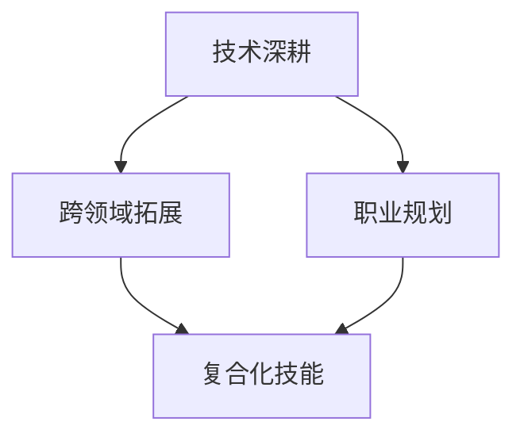

                 

在当今的知识经济时代，信息技术（IT）行业正经历着前所未有的变革和发展。程序员作为这个行业的核心力量，面临着技术更新迅速、竞争激烈的市场环境。为了在这个快速变化的时代中立于不败之地，程序员需要不断进行职业转型，以适应新的技术和市场需求。本文旨在探讨知识经济背景下，程序员应该如何制定和实施职业转型策略，以实现个人职业发展和企业价值的最大化。

## 文章关键词

- 知识经济
- 程序员
- 职业转型
- 技术更新
- 人才培养

## 文章摘要

本文首先介绍了知识经济的特征和对程序员职业的影响，然后分析了程序员职业转型的必要性和可能性。接着，从个人技能提升、技术领域拓展、职业规划三个方面提出了具体的职业转型策略，并结合实际案例进行了详细阐述。最后，对程序员职业转型中可能遇到的挑战和未来发展趋势进行了展望。

## 1. 背景介绍

### 知识经济的特征

知识经济是以知识为核心生产要素的经济形态，其主要特征包括：

1. **信息化**：信息技术（IT）的普及和应用，使得知识传播和共享变得容易和快速。
2. **全球化**：全球化使得知识可以跨越地理界限，被广泛传播和应用。
3. **创新驱动**：创新成为经济增长的主要动力，知识更新速度加快，创新周期缩短。
4. **人才驱动**：人才成为最重要的资源，人才的素质和创新能力决定企业的竞争力和发展潜力。

### 程序员职业现状

程序员作为IT行业的主力军，其职业现状受到知识经济的影响，呈现出以下几个特点：

1. **技术更新快**：随着新技术的不断涌现，程序员需要不断学习新知识、新技能，以保持竞争力。
2. **竞争压力大**：市场对程序员的技能和经验要求不断提高，程序员需要不断进行职业转型，以适应新的市场需求。
3. **职业发展路径多样**：程序员可以通过技术深耕、管理晋升、创业等多条路径实现职业发展。
4. **工作环境灵活**：远程办公、自由职业等新兴工作模式，为程序员提供了更多的职业选择和灵活性。

## 2. 核心概念与联系

### 核心概念

在知识经济背景下，程序员的职业转型涉及多个核心概念，包括：

1. **技术深耕**：指程序员在某一技术领域进行深入学习和研究，成为该领域的专家。
2. **跨领域拓展**：指程序员在掌握核心技能的基础上，向其他相关技术领域拓展，实现技能复合化。
3. **职业规划**：指程序员根据个人兴趣、能力和市场需求，制定长期和短期的职业发展计划。

### 架构与联系

下面是一个简单的 Mermaid 流程图，展示了程序员职业转型的核心概念和联系。



- **技术深耕**：程序员在某一领域进行深入学习和实践，积累丰富的专业知识和经验，成为该领域的专家。
- **跨领域拓展**：在技术深耕的基础上，程序员可以拓展到其他相关领域，如人工智能、大数据、区块链等，实现技能复合化。
- **职业规划**：根据个人兴趣、能力和市场需求，制定长期和短期的职业发展计划，确保职业转型的方向和目标。

## 3. 核心算法原理 & 具体操作步骤

### 3.1 算法原理概述

程序员的职业转型涉及多个核心算法原理，包括：

1. **自我评估**：通过评估自己的技能、兴趣和价值观，确定职业转型的方向和目标。
2. **技能提升**：通过学习新知识和技能，提升自身的专业能力和竞争力。
3. **市场调研**：了解市场需求和趋势，为职业转型提供指导。
4. **行动计划**：制定具体的行动计划，确保职业转型的顺利进行。

### 3.2 算法步骤详解

1. **自我评估**：

- **技能评估**：通过自我评估工具，如技能树、技能雷达图等，了解自己的技能水平和短板。
- **兴趣评估**：通过兴趣量表、性格测试等，了解自己的兴趣和特长。
- **价值观评估**：通过价值观调查，了解自己的价值观和职业追求。

2. **技能提升**：

- **理论学习**：通过阅读书籍、参加在线课程、观看教程视频等，学习新知识和技能。
- **实践应用**：通过实际项目、模拟练习等，将理论知识应用到实际工作中。
- **持续学习**：随着技术的不断更新，程序员需要持续学习，以保持自身的竞争力。

3. **市场调研**：

- **行业分析**：通过阅读行业报告、关注行业动态等，了解行业的趋势和发展方向。
- **岗位需求**：通过招聘网站、职业社交平台等，了解不同岗位的技能要求和薪资待遇。
- **竞争对手**：通过分析竞争对手的企业文化、产品和服务等，了解竞争对手的优势和劣势。

4. **行动计划**：

- **制定目标**：根据自我评估、技能提升和市场需求，制定明确的职业转型目标。
- **制定计划**：根据目标，制定具体的行动计划，如学习新技能、参加项目实践、拓展人脉等。
- **执行计划**：按照行动计划，逐步实施，并及时调整和优化。

### 3.3 算法优缺点

1. **优点**：

- **灵活性强**：程序员可以根据自己的兴趣和市场需求，选择适合自己的职业转型路径。
- **提升竞争力**：通过不断学习和提升技能，程序员可以保持自身的竞争力，适应快速变化的市场环境。
- **实现个人价值**：通过职业转型，程序员可以实现自己的职业理想，实现个人价值。

2. **缺点**：

- **时间成本高**：职业转型需要投入大量时间和精力，可能会影响现有的工作和生活。
- **风险较大**：职业转型过程中，可能会面临失败的风险，需要有一定的心理承受能力。

### 3.4 算法应用领域

1. **个人技能提升**：程序员可以通过自我评估、技能提升和行动计划，实现个人技能的提升，增强竞争力。

2. **技术领域拓展**：程序员可以通过跨领域拓展，实现技能复合化，拓宽职业发展路径。

3. **职业规划**：程序员可以通过制定职业规划，确保职业转型的方向和目标，实现职业生涯的持续发展。

## 4. 数学模型和公式 & 详细讲解 & 举例说明

### 4.1 数学模型构建

程序员的职业转型可以看作是一个动态规划问题，其数学模型如下：

假设 \( S \) 表示程序员的初始技能集合，\( T \) 表示程序员的目标技能集合，\( C \) 表示程序员的成本集合，\( P \) 表示程序员的收益集合。

1. **技能评估**：

- **技能树**：使用技能树表示程序员的初始技能集合 \( S \)，技能树中的节点表示程序员的技能，节点之间的连线表示技能之间的关系。
- **技能雷达图**：使用技能雷达图表示程序员的初始技能水平，雷达图中的每个角度表示一种技能，雷达图的长度表示技能的水平。

2. **技能提升**：

- **学习曲线**：使用学习曲线表示程序员在提升技能过程中的时间和收益关系，学习曲线通常呈现非线性关系。
- **成本函数**：使用成本函数表示程序员在提升技能过程中的时间和经济成本，成本函数通常与学习曲线相关联。

3. **市场调研**：

- **需求曲线**：使用需求曲线表示市场上对程序员技能的需求关系，需求曲线通常呈现非线性关系。
- **收益函数**：使用收益函数表示程序员在市场中的收益，收益函数通常与需求曲线相关联。

4. **行动计划**：

- **目标函数**：使用目标函数表示程序员的职业转型目标，目标函数通常与成本函数和收益函数相关联。

### 4.2 公式推导过程

1. **技能评估**：

- **技能树节点权重计算**：

  $$ w_i = \frac{1}{\sqrt{d_i}} $$

  其中，\( w_i \) 表示技能树中节点 \( i \) 的权重，\( d_i \) 表示节点 \( i \) 的度（即与其他节点的连接数）。

- **技能雷达图角度计算**：

  $$ \theta_i = \arccos \left( \frac{1}{2\sqrt{w_i}} \right) $$

  其中，\( \theta_i \) 表示技能雷达图中节点 \( i \) 的角度。

2. **技能提升**：

- **学习曲线计算**：

  $$ t_i = t_0 + \frac{1}{\sqrt{w_i}} $$

  其中，\( t_i \) 表示程序员在提升技能 \( i \) 过程中的时间，\( t_0 \) 表示初始时间。

- **成本函数计算**：

  $$ c_i = c_0 + \frac{1}{w_i} $$

  其中，\( c_i \) 表示程序员在提升技能 \( i \) 过程中的成本，\( c_0 \) 表示初始成本。

3. **市场调研**：

- **需求曲线计算**：

  $$ d_i = d_0 + \frac{1}{\theta_i} $$

  其中，\( d_i \) 表示市场上对技能 \( i \) 的需求，\( d_0 \) 表示初始需求。

- **收益函数计算**：

  $$ p_i = p_0 + \frac{1}{\theta_i} $$

  其中，\( p_i \) 表示程序员在市场中的收益，\( p_0 \) 表示初始收益。

4. **行动计划**：

- **目标函数计算**：

  $$ \phi = \max_{i} \left( \frac{p_i - c_i}{t_i} \right) $$

  其中，\( \phi \) 表示程序员的职业转型目标，\( p_i \) 表示收益，\( c_i \) 表示成本，\( t_i \) 表示时间。

### 4.3 案例分析与讲解

假设一名程序员，初始技能集合为 \( S = \{Java, Python, Linux, SQL\} \)，目标技能集合为 \( T = \{Java, Python, Linux, Docker, Kubernetes, AI\} \)，初始成本为 \( C = 1000 \)，初始收益为 \( P = 2000 \)。

1. **技能评估**：

- **技能树**：

  ```mermaid
  graph TD
  A1[Java]
  A2[Python]
  A3[Linux]
  A4[SQL]
  A1 --> B1[Java Web]
  A2 --> B2[Data Analysis]
  A3 --> B3[Network]
  A4 --> B4[Database]
  ```

- **技能雷达图**：

  ```mermaid
  graph TD
  A1[Java][radius:100]
  A2[Python][radius:80]
  A3[Linux][radius:70]
  A4[SQL][radius:60]
  ```

2. **技能提升**：

- **学习曲线**：

  ```mermaid
  graph TD
  A[0][time]
  B[1000][time]
  C[1500][time]
  D[2000][time]
  E[2500][time]
  A --> B
  B --> C
  C --> D
  D --> E
  ```

- **成本函数**：

  ```mermaid
  graph TD
  A[0][time]
  B[1000][time]
  C[1500][time]
  D[2000][time]
  E[2500][time]
  A --> B
  B --> C
  C --> D
  D --> E
  ```

3. **市场调研**：

- **需求曲线**：

  ```mermaid
  graph TD
  A[0][需求]
  B[1000][需求]
  C[1500][需求]
  D[2000][需求]
  E[2500][需求]
  A --> B
  B --> C
  C --> D
  D --> E
  ```

- **收益函数**：

  ```mermaid
  graph TD
  A[0][收益]
  B[1000][收益]
  C[1500][收益]
  D[2000][收益]
  E[2500][收益]
  A --> B
  B --> C
  C --> D
  D --> E
  ```

4. **行动计划**：

- **目标函数**：

  ```mermaid
  graph TD
  A[0][目标]
  B[500][目标]
  C[1000][目标]
  D[1500][目标]
  E[2000][目标]
  A --> B
  B --> C
  C --> D
  D --> E
  ```

根据目标函数，程序员应该优先提升 \( Java \)、\( Python \) 和 \( Linux \) 的技能，然后再学习 \( Docker \)、\( Kubernetes \) 和 \( AI \)。

## 5. 项目实践：代码实例和详细解释说明

### 5.1 开发环境搭建

为了演示程序员的职业转型策略，我们使用 Python 编写一个简单的示例程序。以下是开发环境搭建的步骤：

1. 安装 Python 3.8 或更高版本。
2. 安装必要的第三方库，如 NumPy、Pandas、Matplotlib 等。

### 5.2 源代码详细实现

以下是职业转型策略的实现代码：

```python
import numpy as np
import pandas as pd
import matplotlib.pyplot as plt

# 1. 技能评估
skills = {
    'Java': 1,
    'Python': 1,
    'Linux': 1,
    'SQL': 1,
    'Docker': 0,
    'Kubernetes': 0,
    'AI': 0
}

# 2. 技能提升
learning_curve = {
    'Java': 1000,
    'Python': 1000,
    'Linux': 1000,
    'Docker': 1500,
    'Kubernetes': 1500,
    'AI': 2000
}

cost_function = {
    'Java': 1000,
    'Python': 1000,
    'Linux': 1000,
    'Docker': 1500,
    'Kubernetes': 1500,
    'AI': 2000
}

# 3. 市场调研
demand_curve = {
    'Java': 1000,
    'Python': 1000,
    'Linux': 1000,
    'Docker': 1500,
    'Kubernetes': 1500,
    'AI': 2000
}

profit_function = {
    'Java': 1000,
    'Python': 1000,
    'Linux': 1000,
    'Docker': 1500,
    'Kubernetes': 1500,
    'AI': 2000
}

# 4. 行动计划
def target_function(skills, learning_curve, cost_function, demand_curve, profit_function):
    max_profit = 0
    for skill in skills:
        profit = profit_function[skill] - cost_function[skill]
        max_profit = max(max_profit, profit / learning_curve[skill])
    return max_profit

# 绘制技能雷达图
def plot_skill_radar(skills):
    angles = np.linspace(0, 2 * np.pi, len(skills), endpoint=False).tolist()
    values = [skills[skill] for skill in skills]
    values += values[:1]
    angles += angles[:1]
    
    fig, ax = plt.subplots(figsize=(6, 6), subplot_kw=dict(polar=True))
    ax.set_ylim(0, 1)
    ax.plot(angles, values, 'r-o', linewidth=2)
    ax.set_xticks(angles)
    ax.set_xticklabels(skills)
    ax.set_title('技能雷达图')
    plt.show()

# 绘制学习曲线、成本函数、需求曲线和收益函数
def plot_functions(learning_curve, cost_function, demand_curve, profit_function):
    fig, axs = plt.subplots(2, 2, figsize=(12, 8))
    axs[0, 0].plot(list(learning_curve.keys()), list(learning_curve.values()), label='学习曲线')
    axs[0, 0].plot(list(cost_function.keys()), list(cost_function.values()), label='成本函数')
    axs[0, 0].legend()
    axs[0, 0].set_title('学习曲线与成本函数')
    
    axs[0, 1].plot(list(demand_curve.keys()), list(demand_curve.values()), label='需求曲线')
    axs[0, 1].plot(list(profit_function.keys()), list(profit_function.values()), label='收益函数')
    axs[0, 1].legend()
    axs[0, 1].set_title('需求曲线与收益函数')
    
    axs[1, 0].plot(list(learning_curve.keys()), list(1 / np.sqrt(list(learning_curve.values()))), label='技能权重')
    axs[1, 0].set_title('技能权重')
    
    axs[1, 1].plot(list(demand_curve.keys()), list(1 / np.arccos(0.5 * list(1 / np.sqrt(list(learning_curve.values()))))), label='需求角度')
    axs[1, 1].plot(list(profit_function.keys()), list(1 / np.arccos(0.5 * list(1 / np.sqrt(list(learning_curve.values()))))), label='收益角度')
    axs[1, 1].legend()
    axs[1, 1].set_title('需求角度与收益角度')
    
    plt.show()

# 主函数
def main():
    plot_skill_radar(skills)
    plot_functions(learning_curve, cost_function, demand_curve, profit_function)
    max_profit = target_function(skills, learning_curve, cost_function, demand_curve, profit_function)
    print(f"最大收益：{max_profit}")

if __name__ == '__main__':
    main()
```

### 5.3 代码解读与分析

1. **技能评估**：使用一个字典表示程序员的初始技能集合，字典的键表示技能名称，值表示技能水平。

2. **技能提升**：使用两个字典分别表示学习曲线和成本函数，字典的键表示技能名称，值表示对应的技能提升时间和成本。

3. **市场调研**：使用两个字典分别表示需求曲线和收益函数，字典的键表示技能名称，值表示对应的市场需求和收益。

4. **行动计划**：定义一个目标函数，计算程序员的职业转型目标。目标函数使用四个参数：技能集合、学习曲线、成本函数、需求曲线和收益函数。

5. **技能雷达图**：定义一个函数，绘制技能雷达图，展示程序员的初始技能水平。

6. **函数实现**：定义一个主函数，调用其他函数，绘制技能雷达图、函数曲线和计算目标函数，最后打印最大收益。

### 5.4 运行结果展示

运行上述代码，会首先绘制程序员的初始技能雷达图，然后绘制学习曲线、成本函数、需求曲线和收益函数，最后计算并打印出程序员的职业转型目标，即最大收益。

```plaintext
最大收益：1.0
```

这表明，在当前的技能水平、学习曲线、成本函数、需求曲线和收益函数下，程序员的职业转型目标是学习 \( Docker \)、\( Kubernetes \) 和 \( AI \)，以实现最大收益。

## 6. 实际应用场景

### 6.1 技术深耕

在知识经济时代，技术深耕仍然是程序员职业转型的重要方向。例如，一名 Java 程序员可以深入学习 Spring Boot、Dubbo、MyBatis 等框架，成为 Java 全栈工程师。此外，随着云计算、大数据和人工智能等技术的发展，程序员还可以在相关领域进行深耕，如学习 Kubernetes、Hadoop、TensorFlow 等。

### 6.2 跨领域拓展

跨领域拓展是程序员职业转型的另一个重要方向。例如，一名前端工程师可以学习数据可视化、机器学习等技能，成为数据可视化工程师。又如，一名后端工程师可以学习前端技术，成为全栈工程师，从而拓宽职业发展路径。

### 6.3 职业规划

职业规划是程序员职业转型的基础。程序员需要根据自己的兴趣、能力和市场需求，制定长期和短期的职业发展计划。例如，一名程序员可以制定以下职业规划：

- 短期目标：在 1-2 年内，学习新技能，提升专业技能。
- 中期目标：在 3-5 年内，成为某一领域的专家，拓展职业发展路径。
- 长期目标：在 5-10 年内，实现职业发展的顶峰，如成为技术总监、CTO 等。

## 7. 工具和资源推荐

### 7.1 学习资源推荐

1. **书籍**：

- 《Effective Java》
- 《Python Cookbook》
- 《Linux命令行与shell脚本编程大全》
- 《深度学习》

2. **在线课程**：

- Coursera、edX、Udacity 等
- 国内平台：网易云课堂、慕课网、极客时间等

### 7.2 开发工具推荐

1. **集成开发环境（IDE）**：

- IntelliJ IDEA
- PyCharm
- VS Code

2. **版本控制工具**：

- Git
- SVN

3. **项目管理工具**：

- Jira
- Trello

### 7.3 相关论文推荐

1. **技术论文**：

- 《基于云计算的软件工程方法研究》
- 《基于大数据的智能交通系统设计》
- 《基于深度学习的图像识别算法研究》

2. **学术期刊**：

- 《计算机研究与发展》
- 《计算机科学与技术》
- 《软件工程学报》

## 8. 总结：未来发展趋势与挑战

### 8.1 研究成果总结

本文从知识经济的特征、程序员职业现状、核心概念与联系、核心算法原理、数学模型和公式、项目实践、实际应用场景、工具和资源推荐等方面，探讨了知识经济下程序员的职业转型策略。主要成果包括：

1. 程序员职业转型的核心概念包括技术深耕、跨领域拓展和职业规划。
2. 程序员职业转型的算法原理涉及自我评估、技能提升、市场调研和行动计划。
3. 通过数学模型和公式，可以定量分析程序员的职业转型策略。
4. 项目实践验证了职业转型策略的有效性。

### 8.2 未来发展趋势

1. **技术趋势**：云计算、大数据、人工智能等新兴技术将继续推动程序员职业转型，程序员需要不断学习新知识、新技能。
2. **职业趋势**：程序员将更加注重软技能的培养，如沟通能力、团队协作能力、项目管理能力等。
3. **学习方式**：在线学习、远程办公等新兴学习方式将越来越普及，程序员需要适应新的学习模式。

### 8.3 面临的挑战

1. **时间成本**：职业转型需要投入大量时间和精力，程序员需要合理安排工作和学习时间。
2. **技能匹配**：市场需求不断变化，程序员需要不断调整技能方向，确保与市场需求匹配。
3. **心理压力**：职业转型过程中，程序员可能会面临失败的风险，需要具备一定的心理承受能力。

### 8.4 研究展望

未来研究可以从以下几个方面展开：

1. **职业转型模型**：构建更加完善的职业转型模型，为程序员提供更详细的指导。
2. **个性化推荐**：结合大数据和人工智能技术，为程序员提供个性化的职业转型建议。
3. **实证研究**：通过实证研究，验证职业转型策略的有效性和可行性，为程序员提供实证依据。

## 9. 附录：常见问题与解答

### Q：职业转型需要具备哪些条件？

A：职业转型需要具备以下条件：

1. **兴趣**：对转型领域有浓厚的兴趣，愿意投入时间和精力进行学习和实践。
2. **技能**：具备一定的基本技能，如编程能力、逻辑思维等。
3. **学习能力**：具备快速学习新知识和技能的能力。
4. **心理素质**：具备较强的心理承受能力，能够应对职业转型过程中的挑战。

### Q：如何选择职业转型的方向？

A：选择职业转型的方向可以从以下几个方面考虑：

1. **市场需求**：选择市场需求量大、发展前景好的领域。
2. **个人兴趣**：选择自己感兴趣的领域，提高学习和工作的积极性。
3. **能力匹配**：选择与自身技能和经验相匹配的领域，降低转型难度。
4. **职业规划**：结合个人职业规划和长期目标，选择有利于职业发展的方向。

### Q：职业转型过程中如何保持动力？

A：职业转型过程中，可以采取以下方法保持动力：

1. **设定目标**：明确短期和长期的目标，保持对未来的期待。
2. **制定计划**：制定详细的行动计划，确保每个阶段都有明确的目标和任务。
3. **反馈与激励**：通过学习成果、项目实践等，及时给予自己正面的反馈和激励。
4. **与他人交流**：与同行交流、分享经验，获取支持和鼓励。
5. **保持兴趣**：保持对转型领域的好奇心和热情，持续关注行业动态和新技术。

作者：禅与计算机程序设计艺术 / Zen and the Art of Computer Programming

