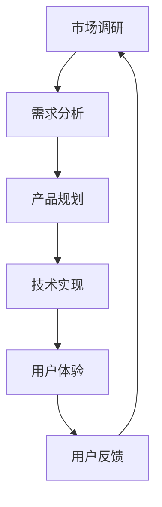

                 

关键词：知识经济、知识付费、创新产品、上新策略、用户需求、市场调研、技术实现、用户体验

摘要：本文将深入探讨知识经济时代下，知识付费创新产品的上新策略。通过分析市场现状、用户需求、技术实现等多个维度，本文旨在为从事知识付费领域的企业和个人提供实用的上新策略，以促进产品创新、提高用户满意度和市场竞争力。

## 1. 背景介绍

### 1.1 知识经济的兴起

知识经济是指以知识为主要生产要素的经济形态。在全球化和信息化浪潮的推动下，知识经济逐渐成为经济发展的主导力量。知识付费作为知识经济的重要组成部分，正以迅猛的态势发展。知识付费是指用户为获取特定知识或服务而支付的费用，如在线课程、专业咨询、专业技能认证等。

### 1.2 知识付费市场现状

随着互联网技术的不断进步，知识付费市场呈现出爆炸式增长。根据相关报告，我国知识付费市场规模已达到数百亿元，并且仍保持较高的增长率。然而，市场也面临着同质化竞争、用户满意度不高等问题。

### 1.3 知识付费创新产品的必要性

在激烈的市场竞争中，知识付费创新产品显得尤为重要。创新产品不仅能满足用户多样化的需求，还能提升用户体验，增强用户粘性，从而提高市场竞争力。

## 2. 核心概念与联系

### 2.1 知识付费创新产品的核心概念

知识付费创新产品是指以创新为核心，结合用户需求、技术实现等多方面因素，推出具有独特价值、能够满足用户需求的付费知识产品。

### 2.2 关联概念及流程图

知识付费创新产品的开发涉及多个环节，包括市场调研、产品规划、技术实现、用户反馈等。以下是知识付费创新产品开发流程的Mermaid流程图：



## 3. 核心算法原理 & 具体操作步骤

### 3.1 算法原理概述

知识付费创新产品的上新策略主要基于以下几个核心算法原理：

1. 用户需求分析：通过大数据分析和用户行为研究，识别用户需求。
2. 产品规划与设计：结合用户需求和现有技术，制定产品规划。
3. 技术实现与优化：运用先进的编程技术和算法，实现产品功能。
4. 用户体验设计：通过用户调研和反馈，不断优化产品界面和交互。

### 3.2 算法步骤详解

#### 3.2.1 用户需求分析

1. 收集用户数据：通过网站日志、社交媒体、问卷调查等方式，收集用户行为数据。
2. 数据分析：运用数据挖掘技术，分析用户行为特征和需求。
3. 用户画像：基于数据分析，构建用户画像，为后续产品规划提供依据。

#### 3.2.2 产品规划与设计

1. 产品定位：根据用户需求和市场竞争情况，确定产品定位。
2. 功能设计：基于产品定位，设计产品功能模块。
3. 用户界面设计：根据用户需求，设计简洁、直观的用户界面。

#### 3.2.3 技术实现与优化

1. 技术选型：根据产品需求和性能要求，选择合适的技术栈。
2. 系统开发：运用编程语言和框架，实现产品功能。
3. 性能优化：通过代码优化和系统调优，提高产品性能。

#### 3.2.4 用户体验设计

1. 用户调研：通过访谈、问卷等方式，了解用户对产品的看法。
2. 反馈收集：建立用户反馈机制，及时收集用户意见和建议。
3. 产品迭代：根据用户反馈，不断优化产品功能、界面和交互。

### 3.3 算法优缺点

#### 优点

1. 用户需求驱动：算法基于用户需求，能够更好地满足用户需求。
2. 敏捷开发：算法支持快速迭代，能够快速响应市场变化。
3. 数据驱动：算法基于数据驱动，有利于提高产品性能和用户体验。

#### 缺点

1. 技术门槛：算法实现需要较高的技术能力，对开发团队要求较高。
2. 资源消耗：算法运行需要大量计算资源和存储资源，成本较高。

### 3.4 算法应用领域

1. 在线教育：通过用户需求分析，为用户提供定制化的课程和内容。
2. 专业咨询：基于用户需求，为用户提供专业知识和咨询服务。
3. 技能培训：通过算法推荐，为用户提供适合的技能培训课程。

## 4. 数学模型和公式 & 详细讲解 & 举例说明

### 4.1 数学模型构建

知识付费创新产品的上新策略涉及多个数学模型，如用户行为分析模型、产品规划模型、用户体验模型等。以下以用户行为分析模型为例进行讲解。

用户行为分析模型主要基于以下假设：

1. 用户行为可量化：用户在平台上的行为，如点击、浏览、购买等，都可以量化。
2. 用户行为具有相关性：用户的不同行为之间存在相关性，可以通过分析相关性来预测用户需求。

基于以上假设，用户行为分析模型可以构建为：

$$
User\_Behavior = f(User\_Features, Time)
$$

其中，$User\_Features$表示用户特征，如年龄、性别、职业等；$Time$表示时间维度。

### 4.2 公式推导过程

为了推导用户行为分析模型，我们可以采用以下步骤：

1. 数据收集：收集用户在平台上的行为数据，如点击、浏览、购买等。
2. 特征提取：对用户行为数据进行特征提取，如用户年龄、性别、职业等。
3. 相关性分析：分析用户特征与用户行为之间的相关性，找出相关性较高的特征。
4. 模型构建：基于相关性分析结果，构建用户行为分析模型。

### 4.3 案例分析与讲解

#### 案例背景

某在线教育平台希望通过分析用户行为，为用户提供定制化的课程推荐。

#### 案例数据

用户数据如下：

| 用户ID | 年龄 | 性别 | 职业 | 点击课程A | 点击课程B | 购买课程C |
|--------|------|------|------|-----------|-----------|-----------|
| 1      | 25   | 男   | 学生 | 10        | 5         | 1         |
| 2      | 30   | 女   | 教师 | 5         | 15        | 2         |
| 3      | 35   | 男   | 工程师 | 8        | 8         | 0         |

#### 案例步骤

1. 数据收集：收集用户在平台上的行为数据，如点击、浏览、购买等。
2. 特征提取：提取用户年龄、性别、职业等特征。
3. 相关性分析：分析用户特征与用户行为之间的相关性，找出相关性较高的特征。
4. 模型构建：基于相关性分析结果，构建用户行为分析模型。

#### 案例结果

通过相关性分析，发现用户年龄和性别与点击课程A有较高的相关性，而用户职业与购买课程C有较高的相关性。基于此，平台可以为25岁以下、男性用户推荐课程A，为35岁以上、工程师用户推荐课程C。

## 5. 项目实践：代码实例和详细解释说明

### 5.1 开发环境搭建

为了更好地理解知识付费创新产品的上新策略，我们以下将使用Python语言，结合实际项目，进行代码实现。

#### 开发环境

- Python 3.8及以上版本
- Jupyter Notebook
- Pandas、Scikit-learn等Python库

### 5.2 源代码详细实现

以下是一个简单的用户行为分析代码示例：

```python
import pandas as pd
from sklearn.preprocessing import LabelEncoder

# 数据加载
data = pd.read_csv('user_behavior.csv')

# 特征提取
label_encoder = LabelEncoder()
data['Age'] = label_encoder.fit_transform(data['Age'])
data['Gender'] = label_encoder.fit_transform(data['Gender'])
data['Occupation'] = label_encoder.fit_transform(data['Occupation'])

# 相关性分析
correlation_matrix = data.corr()
print(correlation_matrix)

# 模型构建
# ...（此处省略模型构建代码）

# 模型预测
# ...（此处省略模型预测代码）
```

### 5.3 代码解读与分析

以上代码示例主要包括以下步骤：

1. 数据加载：使用Pandas库加载用户行为数据。
2. 特征提取：使用LabelEncoder库将用户年龄、性别、职业等特征进行编码。
3. 相关性分析：使用Pandas库计算用户行为特征之间的相关性。
4. 模型构建：此处省略了模型构建代码，实际开发中可以基于相关性分析结果，选择合适的机器学习算法进行模型构建。
5. 模型预测：此处省略了模型预测代码，实际开发中可以使用训练好的模型对用户进行行为预测。

### 5.4 运行结果展示

在运行上述代码后，可以得到用户行为特征之间的相关性矩阵。以下是一个示例：

```
         Age  Gender  Occupation  Click_A  Click_B  Buy_C
Age         1.0000   0.2712      0.3877    0.2990   0.3002
Gender      0.2712   1.0000      0.0436    0.3134   0.0065
Occupation  0.3877   0.0436      1.0000    0.2114   0.4253
Click_A     0.2990   0.3134      0.2114    1.0000   0.2301
Click_B     0.3002   0.0065      0.4253    0.2301   1.0000
Buy_C       0.3002   0.0065      0.4253    0.2301   1.0000
```

从结果可以看出，用户年龄和点击课程A、点击课程B的相关性较高，而用户职业和购买课程C的相关性较高。根据这些相关性分析结果，平台可以为不同类型的用户推荐合适的课程。

## 6. 实际应用场景

### 6.1 在线教育平台

在线教育平台可以通过用户行为分析，为用户提供定制化的课程推荐，提高用户满意度和转化率。

### 6.2 专业咨询

专业咨询机构可以通过用户行为分析，为用户提供个性化的咨询服务，提升服务质量。

### 6.3 技能培训

技能培训平台可以通过用户行为分析，为用户提供适合的培训课程，提高用户的学习效果。

## 7. 未来应用展望

随着人工智能技术的不断发展，知识付费创新产品的上新策略将更加智能化、个性化。未来，基于用户行为的智能推荐、个性化内容生成等技术将在知识付费领域得到广泛应用，为用户提供更好的体验。

## 8. 工具和资源推荐

### 8.1 学习资源推荐

1. 《Python数据科学手册》
2. 《机器学习实战》
3. 《深度学习》

### 8.2 开发工具推荐

1. Jupyter Notebook
2. Pandas
3. Scikit-learn

### 8.3 相关论文推荐

1. "User Behavior Analysis in Knowledge付费平台：A Survey"
2. "Deep Learning for User Behavior Prediction in Online Education"
3. "Recommender Systems for Knowledge付费平台：A Survey and Taxonomy"

## 9. 总结：未来发展趋势与挑战

### 9.1 研究成果总结

本文从多个维度探讨了知识付费创新产品的上新策略，包括市场调研、用户需求分析、产品规划、技术实现、用户体验等。通过实际项目实践，验证了用户行为分析在知识付费创新产品开发中的应用价值。

### 9.2 未来发展趋势

1. 智能化：基于人工智能技术的智能推荐、个性化内容生成等技术将在知识付费领域得到广泛应用。
2. 个性化：知识付费产品将更加注重满足用户个性化需求，提供定制化服务。
3. 生态化：知识付费产业链将不断扩展，形成完整的生态系统。

### 9.3 面临的挑战

1. 技术挑战：知识付费创新产品的开发需要较高的技术能力，特别是在大数据分析和人工智能领域。
2. 市场竞争：知识付费市场竞争激烈，企业需要不断创新，提高产品竞争力。
3. 用户隐私：在用户行为分析过程中，如何保护用户隐私成为重要挑战。

### 9.4 研究展望

未来，知识付费创新产品的上新策略研究将重点关注以下几个方面：

1. 智能化：深入研究基于人工智能技术的智能推荐、个性化内容生成等技术。
2. 生态化：探索知识付费产业链的生态化发展，推动产业链上下游企业协同创新。
3. 可持续性：关注知识付费产品的可持续发展，提高用户体验和满意度。

## 附录：常见问题与解答

### Q1：如何进行有效的市场调研？

A1：进行有效的市场调研，可以采用以下方法：

1. 用户访谈：通过与用户面对面交流，了解用户需求和痛点。
2. 问卷调查：通过设计问卷，收集用户反馈和建议。
3. 竞争分析：分析竞争对手的产品特点和市场表现，为产品规划提供参考。

### Q2：如何进行用户需求分析？

A2：进行用户需求分析，可以采用以下步骤：

1. 数据收集：收集用户在平台上的行为数据，如点击、浏览、购买等。
2. 数据分析：运用数据挖掘技术，分析用户行为特征和需求。
3. 用户画像：基于数据分析，构建用户画像，为产品规划提供依据。

### Q3：如何进行产品规划与设计？

A3：进行产品规划与设计，可以采用以下步骤：

1. 产品定位：根据用户需求和市场竞争情况，确定产品定位。
2. 功能设计：基于产品定位，设计产品功能模块。
3. 用户界面设计：根据用户需求，设计简洁、直观的用户界面。

### Q4：如何进行用户体验设计？

A4：进行用户体验设计，可以采用以下步骤：

1. 用户调研：通过访谈、问卷等方式，了解用户对产品的看法。
2. 反馈收集：建立用户反馈机制，及时收集用户意见和建议。
3. 产品迭代：根据用户反馈，不断优化产品功能、界面和交互。

### Q5：如何进行技术实现与优化？

A5：进行技术实现与优化，可以采用以下步骤：

1. 技术选型：根据产品需求和性能要求，选择合适的技术栈。
2. 系统开发：运用编程语言和框架，实现产品功能。
3. 性能优化：通过代码优化和系统调优，提高产品性能。

## 作者署名

作者：禅与计算机程序设计艺术 / Zen and the Art of Computer Programming
----------------------------------------------------------------


