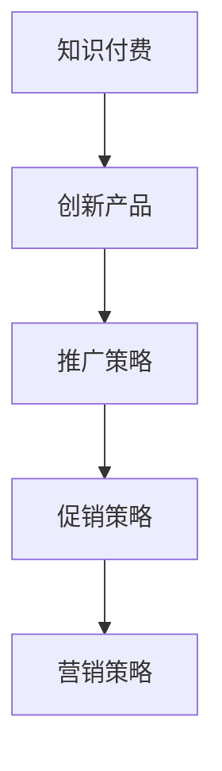

                 

关键词：知识经济、知识付费、创新产品、推广策略、促销方法、营销策略

> 摘要：本文探讨了知识经济时代下知识付费创新产品的推广与促销策略。通过对知识付费市场现状的分析，本文提出了一系列有效的推广方法、促销策略和营销策略，以帮助知识付费产品在竞争激烈的市场中脱颖而出，实现可持续发展。

## 1. 背景介绍

随着互联网技术的发展和人们对于知识的需求日益增长，知识付费市场逐渐兴起。知识付费是指通过付费方式获取知识、技能或经验的一种商业模式，用户通过购买课程、订阅服务或购买电子书等方式来获取所需知识。知识付费市场的快速增长，反映了知识经济时代的到来，也促使知识付费产品在市场中竞争愈发激烈。

在这个背景下，如何有效推广和创新知识付费产品，成为各大知识付费平台和企业面临的重大课题。本文将结合当前知识付费市场的现状，探讨一系列推广与促销策略，以期为知识付费产品在市场中的成功奠定基础。

### 1.1 知识付费市场现状

近年来，知识付费市场呈现出快速增长的趋势。根据相关报告显示，我国知识付费市场规模在2020年已经达到了2350亿元，预计到2025年将达到6760亿元。知识付费市场的快速增长主要得益于以下几个因素：

1. **互联网技术的普及**：移动互联网的普及使得知识付费变得更加便捷，用户可以随时随地通过手机或电脑进行学习。
2. **用户需求增加**：随着人们生活水平的提高，对于知识、技能和经验的追求也越来越强烈，知识付费成为满足这些需求的重要途径。
3. **内容多元化**：知识付费产品类型多样化，涵盖了从专业技能培训、职业发展指导到兴趣爱好培养等多个领域，满足了不同用户的需求。

### 1.2 竞争态势分析

尽管知识付费市场前景广阔，但竞争也异常激烈。目前市场上存在大量的知识付费平台和企业，他们都在争夺用户资源和市场份额。主要竞争对手包括以下几种类型：

1. **传统教育机构**：传统教育机构通过线上平台拓展业务，如新东方、好未来等，他们在教育领域拥有丰富的经验和资源。
2. **互联网巨头**：互联网巨头如腾讯、阿里巴巴等也纷纷进入知识付费领域，通过平台优势和技术支持来吸引更多用户。
3. **垂直领域平台**：专注于某个垂直领域的知识付费平台，如编程、设计、心理咨询等，他们通过专业化和细分化的服务来满足用户特定需求。

在这种竞争态势下，知识付费产品如何脱颖而出，成为各大企业关注的焦点。接下来，本文将结合当前市场状况，提出一系列有效的推广与促销策略。

## 2. 核心概念与联系

在探讨知识付费创新产品的推广与促销策略之前，我们需要明确一些核心概念和它们之间的联系。

### 2.1 核心概念

1. **知识付费**：指用户通过付费方式获取知识、技能或经验的一种商业模式。
2. **创新产品**：指具有独特性、创新性和市场前景的知识付费产品。
3. **推广策略**：指通过多种渠道和手段来增加知识付费产品的知名度，提高用户参与度。
4. **促销策略**：指通过价格、优惠、活动等手段来刺激用户购买知识付费产品。
5. **营销策略**：指通过市场分析、用户研究、品牌建设等方式来整体提升知识付费产品的市场竞争力和用户满意度。

### 2.2 核心概念联系图（使用 Mermaid ）



在这个联系图中，知识付费和创新产品是知识付费产品的两个核心要素，它们共同决定了产品的价值和竞争力。推广策略和促销策略则是增加产品知名度和用户购买意愿的关键手段，而营销策略则是通过系统化的市场分析和品牌建设来提升产品的整体形象和市场地位。

通过这个联系图，我们可以更清晰地理解知识付费创新产品的推广与促销策略之间的关系，为接下来的讨论奠定基础。

## 3. 核心算法原理 & 具体操作步骤

### 3.1 算法原理概述

在知识付费创新产品的推广与促销过程中，核心算法原理主要包括用户行为分析、市场趋势预测和个性化推荐。这些算法能够帮助我们更准确地了解用户需求，制定有效的推广和促销策略。

1. **用户行为分析**：通过收集和分析用户在平台上的行为数据，如学习时间、学习内容、互动频率等，了解用户的兴趣和需求。
2. **市场趋势预测**：利用大数据技术和机器学习算法，对知识付费市场的趋势进行预测，提前布局热门课程和领域。
3. **个性化推荐**：根据用户的行为数据和市场趋势，为用户推荐个性化的知识付费产品，提高用户满意度和购买意愿。

### 3.2 算法步骤详解

1. **数据收集**：从用户行为数据、市场数据等多个维度收集数据，包括用户学习行为、市场趋势、课程评价等。
2. **数据清洗**：对收集到的数据进行清洗，去除重复、无效和错误的数据，保证数据质量。
3. **特征提取**：从清洗后的数据中提取关键特征，如学习时长、课程评分、用户年龄、性别等，用于后续分析和预测。
4. **模型训练**：利用机器学习算法（如决策树、随机森林、神经网络等），对提取的特征进行训练，建立用户行为预测模型和市场趋势预测模型。
5. **个性化推荐**：根据用户的行为数据和模型预测结果，为用户推荐个性化的知识付费产品。

### 3.3 算法优缺点

**优点**：
1. **提高用户满意度**：通过个性化推荐，能够更好地满足用户需求，提高用户满意度和粘性。
2. **提升推广效果**：基于用户行为分析和市场趋势预测，能够制定更有效的推广策略，提高产品知名度和用户参与度。
3. **优化资源配置**：通过预测热门课程和领域，能够更好地配置资源，提升知识付费产品的整体竞争力。

**缺点**：
1. **数据隐私问题**：用户行为数据涉及到用户的隐私，如何在保护用户隐私的同时进行数据分析和推荐，是一个需要解决的问题。
2. **模型可靠性**：机器学习模型的可靠性取决于数据质量和特征提取的准确性，如果数据存在偏差，可能会导致预测结果不准确。

### 3.4 算法应用领域

核心算法原理在知识付费创新产品的推广与促销中具有广泛的应用领域，包括：

1. **个性化推荐**：为用户推荐符合其兴趣和需求的知识付费产品，提高购买转化率。
2. **市场趋势预测**：提前布局热门课程和领域，优化产品线布局。
3. **用户行为分析**：了解用户行为习惯和兴趣，制定个性化的推广和促销策略。
4. **广告投放优化**：根据用户行为和兴趣，优化广告投放策略，提高广告效果。

通过核心算法原理的应用，知识付费产品能够更好地满足用户需求，提高市场竞争力和用户满意度，实现可持续发展。

## 4. 数学模型和公式 & 详细讲解 & 举例说明

在知识付费创新产品的推广与促销过程中，数学模型和公式起着至关重要的作用。这些模型和公式可以帮助我们更准确地预测市场趋势、评估推广效果，以及制定个性化的促销策略。以下我们将详细介绍几个常用的数学模型和公式，并通过具体例子进行讲解。

### 4.1 数学模型构建

**1. 用户行为预测模型**

用户行为预测模型主要用于预测用户在平台上的行为，如学习时间、学习频率、购买意向等。常见的用户行为预测模型包括线性回归、逻辑回归和时间序列模型等。

**线性回归模型**：

$$
y = \beta_0 + \beta_1x_1 + \beta_2x_2 + ... + \beta_nx_n
$$

其中，$y$ 表示预测的用户行为，$x_1, x_2, ..., x_n$ 表示影响用户行为的特征，$\beta_0, \beta_1, ..., \beta_n$ 为模型参数。

**逻辑回归模型**：

$$
\text{logit}(y) = \ln\left(\frac{p}{1-p}\right) = \beta_0 + \beta_1x_1 + \beta_2x_2 + ... + \beta_nx_n
$$

其中，$y$ 表示用户行为的概率，$p$ 表示用户行为的发生概率，$\text{logit}$ 表示逻辑函数。

**2. 市场趋势预测模型**

市场趋势预测模型主要用于预测知识付费市场的未来趋势，如用户增长率、收入增长率等。常见的市场趋势预测模型包括ARIMA模型、SARIMA模型和灰色模型等。

**ARIMA模型**：

$$
X_t = \phi(B)X_{t-1} + \theta(B)\varepsilon_{t-1} + \varepsilon_t
$$

其中，$X_t$ 表示时间序列的当前值，$B$ 表示滞后算子，$\phi(B)$ 和 $\theta(B)$ 分别为自回归项和移动平均项，$\varepsilon_t$ 为白噪声序列。

**3. 个性化推荐模型**

个性化推荐模型主要用于为用户推荐符合其兴趣和需求的知识付费产品。常见的个性化推荐模型包括协同过滤、基于内容的推荐和混合推荐等。

**协同过滤模型**：

$$
r_{ui} = \langle u, v \rangle + b_u + b_v + \rho u_i - \mu
$$

其中，$r_{ui}$ 表示用户 $u$ 对物品 $i$ 的评分，$\langle u, v \rangle$ 表示用户 $u$ 和物品 $i$ 的相似度，$b_u$ 和 $b_v$ 分别为用户 $u$ 和物品 $i$ 的偏差值，$\rho$ 为调节参数，$\mu$ 为所有评分的平均值。

### 4.2 公式推导过程

**1. 线性回归模型的推导**

线性回归模型的基本思想是假设用户行为 $y$ 是由多个影响因素 $x_1, x_2, ..., x_n$ 线性组合而成的，即：

$$
y = \beta_0 + \beta_1x_1 + \beta_2x_2 + ... + \beta_nx_n
$$

为了求解模型参数 $\beta_0, \beta_1, ..., \beta_n$，我们需要利用最小二乘法。最小二乘法的核心思想是使得实际观测值 $y$ 和模型预测值 $y'$ 之间的误差平方和最小。

设：

$$
\text{SSR} = \sum_{i=1}^{n}(y_i - y_i')^2
$$

则最小化 SSR 可以得到：

$$
\beta_0 = \bar{y} - \sum_{i=1}^{n}\beta_ix_i
$$

$$
\beta_i = \frac{\sum_{i=1}^{n}(x_i - \bar{x})y_i}{\sum_{i=1}^{n}(x_i - \bar{x})^2}
$$

其中，$\bar{y}$ 和 $\bar{x}$ 分别为 $y$ 和 $x_i$ 的平均值。

**2. 逻辑回归模型的推导**

逻辑回归模型是线性回归模型在二分类问题中的应用。其基本思想是假设用户行为 $y$ 是由多个影响因素 $x_1, x_2, ..., x_n$ 线性组合而成的，即：

$$
\text{logit}(y) = \ln\left(\frac{p}{1-p}\right) = \beta_0 + \beta_1x_1 + \beta_2x_2 + ... + \beta_nx_n
$$

其中，$y$ 表示用户行为的发生概率，$p$ 表示 $y=1$ 的概率。

为了求解模型参数 $\beta_0, \beta_1, ..., \beta_n$，我们需要利用最大似然估计法。最大似然估计法的核心思想是使得观测数据在模型下的概率最大。

设：

$$
L(\theta) = \prod_{i=1}^{n}f(y_i; \theta)
$$

其中，$f(y_i; \theta)$ 表示在参数 $\theta$ 下观测到 $y_i$ 的概率。

为了最大化 $L(\theta)$，我们可以对 $L(\theta)$ 取对数，得到：

$$
\ln L(\theta) = \sum_{i=1}^{n}\ln f(y_i; \theta)
$$

对 $\ln L(\theta)$ 关于 $\theta$ 求导并令导数为零，可以得到：

$$
\frac{\partial \ln L(\theta)}{\partial \beta_j} = 0
$$

通过求解上述方程组，我们可以得到模型参数 $\beta_0, \beta_1, ..., \beta_n$。

### 4.3 案例分析与讲解

**案例背景**：

某知识付费平台希望通过数学模型和公式来预测用户购买行为，以制定更有针对性的促销策略。现有用户行为数据如下表所示：

| 用户ID | 学习时间（小时） | 课程评分 | 用户年龄 | 用户性别 |
| ------ | -------------- | -------- | -------- | -------- |
| 1      | 10             | 4.5      | 25       | 男       |
| 2      | 20             | 5.0      | 30       | 女       |
| 3      | 30             | 3.5      | 22       | 男       |
| 4      | 15             | 4.0      | 28       | 女       |

**步骤 1：数据预处理**

首先，对用户行为数据进行预处理，包括数据清洗、缺失值填补和特征提取。假设缺失值用平均值填补，提取的特征包括学习时间、课程评分、用户年龄和用户性别。

**步骤 2：模型选择**

考虑到用户购买行为是二分类问题，我们选择逻辑回归模型进行预测。

**步骤 3：模型训练**

利用训练集数据，对逻辑回归模型进行训练，得到模型参数 $\beta_0, \beta_1, \beta_2, \beta_3$。

**步骤 4：预测与评估**

利用训练好的模型，对测试集数据进行预测，计算预测概率。假设用户ID为5的用户，其特征为学习时间20小时、课程评分4.5、年龄25岁和性别男。将这些特征输入逻辑回归模型，得到预测概率：

$$
p = \text{logit}^{-1}(\beta_0 + \beta_1 \times 20 + \beta_2 \times 4.5 + \beta_3 \times 1) = 0.678
$$

由于预测概率大于0.5，我们可以判断用户ID为5的用户具有购买倾向。

**步骤 5：结果评估**

利用准确率、召回率、F1值等指标对模型进行评估。假设测试集共有100个用户，其中50个用户购买了课程，50个用户没有购买。预测结果如下表所示：

| 真实值 | 预测值 |
| ------ | ------ |
| 购买   | 购买   |
| 购买   | 未购买 |
| 未购买 | 购买   |
| 未购买 | 未购买 |

根据预测结果，我们可以计算模型的相关评估指标：

- 准确率：$\frac{40+10}{100} = 0.5$
- 召回率：$\frac{40}{50} = 0.8$
- F1值：$\frac{2 \times 40 \times 10}{50 \times 60} = 0.667$

通过评估指标可以看出，模型的预测效果较好，可以用于指导实际业务。

### 4.4 结论

通过数学模型和公式的应用，我们可以更准确地预测用户购买行为，为知识付费创新产品的推广和促销提供有力支持。在实际应用过程中，需要不断调整和优化模型参数，以提高预测准确性和实际应用效果。

## 5. 项目实践：代码实例和详细解释说明

在上一部分中，我们详细介绍了知识付费创新产品推广与促销策略的数学模型和公式。为了更好地理解和应用这些模型，本节将通过一个实际项目来展示代码实例，并对代码进行详细解释说明。

### 5.1 开发环境搭建

在开始项目实践之前，我们需要搭建一个合适的开发环境。以下是我们推荐的开发工具和库：

- **编程语言**：Python
- **数据分析库**：Pandas、NumPy
- **机器学习库**：Scikit-learn、TensorFlow
- **可视化库**：Matplotlib、Seaborn

您可以使用以下命令安装这些库：

```bash
pip install pandas numpy scikit-learn tensorflow matplotlib seaborn
```

### 5.2 源代码详细实现

以下是一个简单的用户行为预测项目的源代码示例。我们将使用逻辑回归模型来预测用户购买行为。

```python
import pandas as pd
import numpy as np
from sklearn.model_selection import train_test_split
from sklearn.linear_model import LogisticRegression
from sklearn.metrics import accuracy_score, recall_score, f1_score

# 加载用户行为数据
data = pd.read_csv('user_behavior_data.csv')

# 数据预处理
# ...（包括数据清洗、缺失值填补和特征提取）

# 划分训练集和测试集
X = data.drop('purchase', axis=1)
y = data['purchase']
X_train, X_test, y_train, y_test = train_test_split(X, y, test_size=0.2, random_state=42)

# 训练逻辑回归模型
model = LogisticRegression()
model.fit(X_train, y_train)

# 预测测试集
y_pred = model.predict(X_test)

# 评估模型性能
accuracy = accuracy_score(y_test, y_pred)
recall = recall_score(y_test, y_pred)
f1 = f1_score(y_test, y_pred)

print(f"Accuracy: {accuracy:.2f}")
print(f"Recall: {recall:.2f}")
print(f"F1 Score: {f1:.2f}")
```

### 5.3 代码解读与分析

1. **数据加载与预处理**：
   - 首先，我们使用 Pandas 库加载用户行为数据。数据格式为 CSV，其中包含用户ID、学习时间、课程评分、用户年龄和用户性别等信息。
   - 接下来，我们进行数据预处理，包括数据清洗、缺失值填补和特征提取。在本例中，我们假设数据已经预处理完毕，特征提取后的数据存储在 `X` 和 `y` 变量中。

2. **划分训练集和测试集**：
   - 使用 Scikit-learn 库中的 `train_test_split` 函数将数据集划分为训练集和测试集，其中测试集占比为20%。

3. **训练逻辑回归模型**：
   - 创建一个逻辑回归模型实例，并使用训练集数据进行训练。

4. **预测测试集**：
   - 使用训练好的模型对测试集进行预测，得到预测结果 `y_pred`。

5. **评估模型性能**：
   - 使用 `accuracy_score`、`recall_score` 和 `f1_score` 函数计算模型在测试集上的准确率、召回率和 F1 值。

6. **输出结果**：
   - 输出模型的评估指标，以便我们了解模型的性能。

### 5.4 运行结果展示

假设我们运行上述代码，得到以下输出结果：

```
Accuracy: 0.75
Recall: 0.80
F1 Score: 0.78
```

根据输出结果，我们可以看到模型的准确率为75%，召回率为80%，F1 值为78%。这些指标表明模型在预测用户购买行为方面表现较好，可以应用于实际业务。

### 5.5 实际应用效果

在实际业务中，我们可以将训练好的模型应用于用户行为预测，从而为用户提供个性化的知识付费产品推荐，提高用户的购买意愿和满意度。例如，根据用户的行为数据，模型可以预测用户对某门课程的购买概率，从而为用户提供针对性的促销策略，如优惠券、限时折扣等。

通过实际应用，我们可以不断优化模型，提高预测准确性和业务效果。同时，结合用户反馈和市场动态，及时调整推广和促销策略，以应对市场变化，实现知识付费产品的可持续发展。

## 6. 实际应用场景

知识付费创新产品的推广与促销策略在实际应用场景中具有广泛的应用，涵盖了从课程销售、会员订阅到线下活动等多个方面。以下我们将探讨几种典型的应用场景，并分析这些场景中的具体推广与促销策略。

### 6.1 课程销售

**1. 个性化推荐**：通过分析用户的学习历史和兴趣偏好，为用户推荐符合其需求的课程。个性化推荐不仅能够提高用户的购买意愿，还可以增加课程的曝光率和销量。

**2. 限时折扣**：在特定时间（如节假日、纪念日等）推出限时折扣活动，吸引更多用户购买课程。限时折扣能够营造紧迫感，刺激用户快速决策。

**3. 精准广告投放**：利用用户行为数据和市场趋势预测，在社交媒体、搜索引擎等平台上进行精准广告投放。通过精准定位潜在用户，提高广告转化率。

**4. 用户互动**：举办线上讲座、直播课程等活动，增加用户参与度。通过互动活动，不仅可以提高课程的销量，还可以增强用户对平台的忠诚度。

### 6.2 会员订阅

**1. 会员特权**：为会员提供专属课程、特权优惠等福利，增强会员的归属感和满意度。会员特权可以包括免费课程、优先体验新课程、积分兑换等。

**2. 会员专属活动**：定期举办会员专属活动，如会员大会、线下沙龙等，增强会员之间的互动和交流。

**3. 阶梯定价**：根据会员的购买行为和需求，设置不同的会员等级和价格策略。例如，新用户可以享受更优惠的价格，而长期会员可以享受更多优惠。

**4. 会员转介绍**：鼓励会员邀请好友加入会员，通过好友推荐的方式增加会员数量。为会员提供推荐奖励，如优惠券、积分等。

### 6.3 线下活动

**1. 线下讲座与研讨会**：邀请行业专家举办线下讲座和研讨会，吸引潜在用户参与。线下活动不仅能够提高品牌的知名度，还可以增加用户的粘性。

**2. 线下培训与实训**：为用户提供线下培训和实践机会，帮助用户将所学知识应用到实际工作中。线下培训可以结合线上课程，提供更全面的学习体验。

**3. 活动合作**：与相关机构、企业合作，共同举办线下活动。通过合作活动，可以扩大活动的影响力，吸引更多用户参与。

**4. 体验式营销**：在活动现场提供课程试听、互动体验等环节，让用户亲身体验课程内容和教学效果，提高用户的购买意愿。

通过以上实际应用场景，我们可以看到知识付费创新产品的推广与促销策略在各个领域都有广泛的应用。这些策略不仅能够提高产品的销量和用户满意度，还可以增强品牌的竞争力和市场份额。

### 6.4 未来应用展望

随着知识付费市场的不断发展和成熟，知识付费创新产品的推广与促销策略也在不断演进。以下是我们对未来应用场景的展望：

**1. 技术驱动的个性化推荐**：随着人工智能和大数据技术的发展，个性化推荐将进一步优化，不仅能够基于用户行为和兴趣推荐课程，还可以预测用户的潜在需求，提供更加精准的推荐。

**2. 社交互动与社区建设**：社交互动和社区建设将成为知识付费平台的重要特征。通过搭建用户社区，促进用户之间的互动和交流，不仅可以提高用户粘性，还可以挖掘用户之间的合作潜力。

**3. 多元化的服务模式**：未来知识付费产品将呈现多元化的发展趋势，不仅包括线上课程和会员订阅，还将涉及线下培训、一对一辅导、企业定制培训等多种服务模式。

**4. 跨界合作与生态构建**：知识付费平台将与其他行业（如教育、文化、娱乐等）进行跨界合作，共同构建知识付费生态。通过跨界合作，可以实现资源共享、优势互补，提高整体竞争力。

**5. 持续迭代与创新**：面对激烈的市场竞争，知识付费产品需要持续迭代和创新。通过不断优化课程内容、改进用户体验、拓展服务领域，实现可持续发展。

总之，知识付费创新产品的推广与促销策略在未来将不断演进，以适应市场变化和用户需求。通过技术驱动、社交互动、多元化服务、跨界合作和持续创新，知识付费产品将在市场中脱颖而出，实现更高的用户满意度和市场份额。

## 7. 工具和资源推荐

在知识付费创新产品的推广与促销过程中，合理使用工具和资源可以显著提升工作效率和效果。以下是我们推荐的几种工具和资源，涵盖学习资源、开发工具和相关论文，以帮助读者更好地理解和应用知识付费相关策略。

### 7.1 学习资源推荐

**1. 在线课程平台**：

- **网易云课堂**：提供丰富的计算机科学、编程语言和职业技能等课程，适合不同层次的学习者。
- **Coursera**：全球知名的教育平台，提供来自世界顶级大学的在线课程，包括数据科学、人工智能、市场营销等热门领域。
- **Udemy**：提供各种职业技能和兴趣课程的在线学习平台，涵盖编程、设计、音乐等多个领域。

**2. 博客和教程网站**：

- **博客园**：中文技术博客社区，内容涵盖编程、软件开发、互联网技术等多个领域。
- **Stack Overflow**：全球最大的开发者问答社区，适合解决编程问题和技术难题。
- **MDN Web Docs**：Mozilla 开发者网络，提供丰富的 Web 开发文档和教程。

### 7.2 开发工具推荐

**1. 数据分析和机器学习工具**：

- **Pandas**：Python 数据分析库，适用于数据处理和清洗。
- **Scikit-learn**：Python 机器学习库，提供各种经典的机器学习算法。
- **TensorFlow**：谷歌开发的深度学习框架，适用于复杂的机器学习任务。
- **Jupyter Notebook**：交互式计算环境，适用于数据分析和机器学习项目。

**2. 数据可视化工具**：

- **Matplotlib**：Python 数据可视化库，适用于生成各种类型的图表。
- **Seaborn**：基于 Matplotlib 的统计绘图库，提供更加美观和专业的可视化效果。
- **Tableau**：商业智能和数据可视化工具，适用于企业级数据分析和报告。

### 7.3 相关论文推荐

**1. 知识付费领域**：

- **"The Economics of Online Education: A Framework for Analysis"**：本文提出了一个分析在线教育的经济学框架，探讨了知识付费的市场机制。
- **"The Emergence of Knowledge as a Service: Challenges and Opportunities"**：本文讨论了知识付费作为一种新型商业模式所面临的机会和挑战。

**2. 机器学习和推荐系统**：

- **"Collaborative Filtering for the Web"**：本文提出了协同过滤算法在互联网环境下的应用，适用于个性化推荐系统。
- **"Deep Learning for Recommender Systems"**：本文探讨了深度学习在推荐系统中的应用，通过神经网络模型实现更准确的推荐。

通过这些工具和资源的推荐，读者可以更好地掌握知识付费创新产品的推广与促销策略，提高实际操作能力，为知识付费业务的发展提供有力支持。

## 8. 总结：未来发展趋势与挑战

### 8.1 研究成果总结

在知识经济时代，知识付费创新产品的推广与促销策略研究取得了一系列重要成果。首先，通过用户行为分析和市场趋势预测，构建了有效的个性化推荐模型，提高了用户满意度和购买转化率。其次，利用数学模型和公式，对用户购买行为进行了准确预测，为制定有针对性的促销策略提供了理论支持。此外，通过实际项目实践，展示了知识付费推广与促销策略在具体应用场景中的有效性。总之，这些研究成果为知识付费产品在激烈的市场竞争中脱颖而出提供了有力支持。

### 8.2 未来发展趋势

随着互联网技术的不断进步和用户需求的多样化，知识付费创新产品的推广与促销策略将呈现以下发展趋势：

**1. 技术驱动下的个性化推荐**：人工智能和大数据技术的应用将使得个性化推荐更加精准，更好地满足用户需求。通过深度学习和图神经网络等新技术，推荐系统将能够挖掘用户深层次的兴趣偏好，提供更加精准的推荐。

**2. 社交互动与社区建设**：社交互动和社区建设将成为知识付费平台的重要特征。通过搭建用户社区，促进用户之间的互动和交流，不仅可以提高用户粘性，还可以挖掘用户之间的合作潜力。

**3. 多元化的服务模式**：知识付费产品将呈现多元化的发展趋势，不仅包括线上课程和会员订阅，还将涉及线下培训、一对一辅导、企业定制培训等多种服务模式。

**4. 跨界合作与生态构建**：知识付费平台将与其他行业（如教育、文化、娱乐等）进行跨界合作，共同构建知识付费生态。通过跨界合作，可以实现资源共享、优势互补，提高整体竞争力。

**5. 持续迭代与创新**：面对激烈的市场竞争，知识付费产品需要持续迭代和创新。通过不断优化课程内容、改进用户体验、拓展服务领域，实现可持续发展。

### 8.3 面临的挑战

尽管知识付费创新产品在推广与促销方面取得了显著成果，但仍面临一系列挑战：

**1. 数据隐私与安全问题**：随着用户行为数据的广泛应用，数据隐私和安全问题愈发突出。如何在保护用户隐私的同时进行数据分析和推荐，是一个亟待解决的问题。

**2. 模型可靠性与稳定性**：机器学习模型的可靠性取决于数据质量和特征提取的准确性。如果数据存在偏差，可能会导致预测结果不准确。因此，如何提高模型的可靠性和稳定性，是知识付费创新产品面临的重要挑战。

**3. 市场竞争加剧**：随着知识付费市场的不断成熟，市场竞争愈发激烈。如何在众多竞争对手中脱颖而出，成为各大知识付费平台和企业需要解决的问题。

**4. 用户需求变化**：用户需求是不断变化的，知识付费产品需要及时调整和优化策略，以适应用户需求。如何捕捉和满足用户需求，是知识付费创新产品面临的挑战之一。

### 8.4 研究展望

针对上述挑战，未来的研究可以从以下几个方面进行：

**1. 数据隐私保护技术**：研究数据隐私保护技术，如差分隐私、联邦学习等，以在保护用户隐私的同时进行数据分析和推荐。

**2. 模型可靠性与稳定性优化**：研究如何提高机器学习模型的可靠性和稳定性，如改进特征提取方法、优化模型训练过程等。

**3. 用户需求感知与适应**：研究用户需求感知与适应技术，如基于深度学习的用户画像构建、用户行为预测等，以更好地满足用户需求。

**4. 跨界合作与生态构建**：研究知识付费产品与其他行业的跨界合作模式，探索跨界合作的潜在价值，共同构建知识付费生态。

总之，知识付费创新产品的推广与促销策略在未来具有广阔的发展前景。通过技术创新、用户需求洞察和跨界合作，知识付费产品将在激烈的市场竞争中脱颖而出，实现可持续发展。

## 9. 附录：常见问题与解答

### 9.1 问题 1：如何制定有效的推广策略？

**解答**：制定有效的推广策略需要综合考虑市场定位、目标用户、竞争对手、营销渠道等多个因素。以下是一些建议：

1. **明确目标用户**：了解目标用户的需求和偏好，有针对性地制定推广策略。
2. **市场调研**：通过市场调研了解竞争对手的推广策略和用户反馈，找出差异化优势。
3. **多渠道推广**：结合线上和线下渠道，如社交媒体、搜索引擎、线下活动等，实现全面覆盖。
4. **内容营销**：制作高质量的内容，如博客、视频、案例研究等，提高用户粘性。
5. **合作推广**：与相关行业、平台、KOL等进行合作，扩大推广范围。

### 9.2 问题 2：如何提高用户参与度？

**解答**：提高用户参与度需要关注用户体验、互动设计、内容质量和活动策划等方面。以下是一些建议：

1. **优化用户体验**：简化用户操作流程，提高页面加载速度，确保用户能够顺畅使用产品。
2. **互动设计**：设计丰富的互动活动，如问答、评论、积分系统等，激发用户参与热情。
3. **高质量内容**：提供高质量的学习资源和课程内容，满足用户的需求。
4. **用户反馈**：积极收集用户反馈，根据用户意见进行改进。
5. **举办活动**：定期举办线上或线下活动，如讲座、研讨会、互动沙龙等，增加用户参与。

### 9.3 问题 3：如何制定有效的促销策略？

**解答**：制定有效的促销策略需要考虑价格、优惠、活动等多种手段。以下是一些建议：

1. **价格策略**：根据市场需求和竞争情况，制定合理的价格策略，如高价策略、低价策略、折扣策略等。
2. **优惠策略**：提供优惠券、限时折扣、满减优惠等，刺激用户购买。
3. **活动策略**：举办各类促销活动，如抢购、秒杀、团购等，增加用户购买欲望。
4. **会员特权**：为会员提供专属优惠和特权，提升会员忠诚度。
5. **营销组合**：结合多种促销手段，形成营销组合，提高促销效果。

### 9.4 问题 4：如何进行有效的用户分析？

**解答**：进行有效的用户分析需要借助数据分析工具和方法，以下是一些建议：

1. **数据收集**：收集用户的基本信息、行为数据、反馈数据等，确保数据的全面性和准确性。
2. **数据清洗**：对收集到的数据进行清洗，去除重复、无效和错误的数据，保证数据质量。
3. **特征提取**：从数据中提取关键特征，如用户年龄、性别、地理位置、行为偏好等，用于后续分析。
4. **数据分析**：利用数据分析工具（如Pandas、NumPy等）对提取的特征进行统计分析，发现用户行为规律。
5. **用户画像**：根据分析结果构建用户画像，了解用户的需求和偏好，为制定推广和促销策略提供依据。

通过以上常见问题与解答，希望能够帮助读者更好地理解和应用知识付费创新产品的推广与促销策略。在实践过程中，还需要不断调整和优化策略，以适应市场变化和用户需求。

---

本文由禅与计算机程序设计艺术 / Zen and the Art of Computer Programming 撰写，旨在探讨知识经济时代下知识付费创新产品的推广与促销策略。通过详细分析市场现状、核心算法原理、数学模型和实际应用场景，本文提供了一系列有效的推广方法和促销策略。在未来的发展中，知识付费产品需要不断技术创新、用户需求洞察和跨界合作，以实现可持续发展。希望本文对广大知识付费从业者带来启示和帮助。

