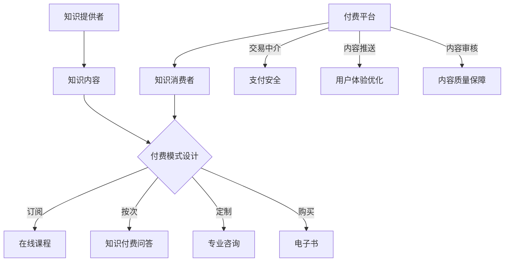

                 

关键词：知识经济，知识付费，商业模式，创新，优化

> 摘要：本文深入探讨了知识经济时代下知识付费领域的创新商业模式及其优化策略。通过对知识付费市场的现状分析，提出了几种具有前瞻性的商业模式，并探讨了其优缺点及适用场景。同时，文章结合实际案例，对商业模式的具体优化措施进行了详细阐述，旨在为企业和个人在知识付费领域的商业实践提供有益参考。

## 1. 背景介绍

随着互联网技术的飞速发展，知识传播的渠道和方式发生了翻天覆地的变化。知识经济作为一种新型的经济模式，已经逐渐成为推动经济增长的重要力量。知识付费则是知识经济时代的一种典型表现，它指的是用户通过支付一定费用来获取有价值的信息、技能或知识。

知识付费的兴起，一方面源于用户对高质量知识的渴求，另一方面也得益于互联网平台提供的便捷支付方式。在这一背景下，知识付费领域涌现出了一系列创新商业模式，如在线课程、知识付费问答、专业咨询、电子书等。这些模式不仅丰富了知识付费的形式，也为行业带来了新的发展机遇。

然而，知识付费市场也面临着一些挑战。例如，同质化竞争严重、用户满意度不高、商业模式不够成熟等问题。因此，如何优化知识付费商业模式，提高用户体验和经济效益，成为当前亟需解决的问题。

## 2. 核心概念与联系

### 2.1 知识付费的基本概念

知识付费是指用户为了获取有价值的信息、技能或知识，自愿支付一定费用的行为。它包括以下核心要素：

- **知识提供者**：拥有特定领域知识和技能的个人或机构。
- **知识消费者**：有需求并愿意为知识付费的用户。
- **付费平台**：提供交易中介服务，保障交易安全、便捷的互联网平台。

### 2.2 知识付费的商业模式

知识付费的商业模式主要包括以下几种：

1. **在线课程**：通过互联网平台，为用户提供系统性、专业性的课程学习服务。
2. **知识付费问答**：用户付费向专家提问，获取针对性的知识解答。
3. **专业咨询**：为用户提供定制化的咨询服务，帮助解决具体问题。
4. **电子书**：以电子形式出版书籍，用户付费购买后进行阅读。

### 2.3 知识付费的关键环节

知识付费的关键环节包括知识筛选、付费模式设计、用户体验优化、内容质量保障等。

- **知识筛选**：平台需要对知识内容进行严格筛选，确保其具有价值和可靠性。
- **付费模式设计**：根据用户需求和市场特点，设计合理的付费模式，如订阅、一次性购买、按次付费等。
- **用户体验优化**：优化平台界面、支付流程、内容推送等，提高用户满意度。
- **内容质量保障**：建立内容审核机制，确保知识内容的准确性和实用性。

### 2.4 Mermaid 流程图



## 3. 核心算法原理 & 具体操作步骤

### 3.1 算法原理概述

知识付费商业模式优化的核心算法原理主要涉及以下几点：

1. **用户画像分析**：通过大数据技术，对用户进行精准画像，了解其兴趣、需求和购买行为。
2. **内容推荐算法**：基于用户画像，为用户推荐个性化的知识内容。
3. **商业模式匹配**：根据用户需求和市场特点，设计适合的付费模式。

### 3.2 算法步骤详解

1. **用户画像分析**：

   - 数据收集：从用户注册信息、浏览记录、购买历史等多个维度收集用户数据。
   - 数据预处理：对收集到的数据进行清洗、去重和归一化处理。
   - 特征提取：根据用户行为特征，构建用户画像。

2. **内容推荐算法**：

   - 模型训练：使用机器学习算法，如协同过滤、基于内容的推荐等，训练推荐模型。
   - 推荐生成：根据用户画像和模型预测，生成个性化推荐结果。

3. **商业模式匹配**：

   - 数据分析：分析用户需求和市场特点，确定适合的付费模式。
   - 模式优化：根据用户反馈和数据分析结果，对付费模式进行调整和优化。

### 3.3 算法优缺点

1. **优点**：

   - 提高用户满意度：通过个性化推荐和商业模式匹配，提高用户获取知识的便利性和满意度。
   - 提高经济效益：优化商业模式，提高用户购买转化率和平台收益。

2. **缺点**：

   - 数据安全与隐私：用户画像分析涉及大量用户隐私数据，需要确保数据安全。
   - 技术门槛：需要具备一定的数据分析和机器学习技术能力。

### 3.4 算法应用领域

1. **在线教育**：通过用户画像分析和内容推荐，提高课程推荐的相关性和用户满意度。
2. **知识付费平台**：优化付费模式，提高用户购买转化率和平台收益。
3. **企业培训**：根据员工需求和业务特点，设计个性化的培训方案。

## 4. 数学模型和公式 & 详细讲解 & 举例说明

### 4.1 数学模型构建

知识付费商业模式优化过程中，常用的数学模型包括用户画像模型、内容推荐模型和商业模式匹配模型。

1. **用户画像模型**：

   $$ User\_Feature = \sum_{i=1}^{n} w_i \cdot x_i $$

   其中，$w_i$ 为权重，$x_i$ 为用户特征。

2. **内容推荐模型**：

   $$ P(Content\_i | User) = \frac{e^{Similarity(User, Content_i)}}{\sum_{j=1}^{m} e^{Similarity(User, Content_j)}} $$

   其中，$Similarity(User, Content_i)$ 为用户和内容之间的相似度。

3. **商业模式匹配模型**：

   $$ Maximize \, Revenue = Price \cdot Purchase\_Probability $$

   其中，$Price$ 为定价，$Purchase\_Probability$ 为购买概率。

### 4.2 公式推导过程

1. **用户画像模型**：

   用户画像模型基于用户行为特征构建，通过权重分配，实现对用户特征的加权求和。权重可以通过机器学习算法自动调整，以达到更好的推荐效果。

2. **内容推荐模型**：

   内容推荐模型采用基于内容的协同过滤算法，通过计算用户和内容之间的相似度，实现对内容的推荐。相似度计算公式为：

   $$ Similarity(User, Content) = \frac{\sum_{i \in User \, Interest} w_i \cdot x_i \cdot w_j \cdot x_j}{\sqrt{\sum_{i \in User \, Interest} (w_i \cdot x_i)^2 \cdot \sum_{j \in Content \, Feature} (w_j \cdot x_j)^2}} $$

   其中，$w_i$ 和 $w_j$ 分别为用户和内容特征的权重，$x_i$ 和 $x_j$ 分别为用户和内容的特征值。

3. **商业模式匹配模型**：

   商业模式匹配模型基于经济学原理，通过最大化收益来确定最优的定价策略。购买概率可以通过用户画像和内容推荐结果来计算。

### 4.3 案例分析与讲解

以在线教育平台为例，某用户对编程课程感兴趣。根据用户画像模型，计算用户对编程课程的相关特征值，并加权求和得到用户画像。然后，根据内容推荐模型，计算编程课程与用户画像的相似度，并进行排序推荐。最后，根据商业模式匹配模型，确定课程定价策略。

假设用户画像中编程课程的特征权重为 $w_1 = 0.6$，其他特征权重为 $w_i = 0.1$。编程课程的特征值为 $x_1 = 1$，其他特征值为 $x_i = 0$。则用户画像为：

$$ User\_Feature = w_1 \cdot x_1 + \sum_{i=2}^{5} w_i \cdot x_i = 0.6 \cdot 1 + 0.1 \cdot 0 + 0.1 \cdot 0 + 0.1 \cdot 0 + 0.1 \cdot 0 = 0.6 $$

根据内容推荐模型，计算编程课程与用户画像的相似度：

$$ Similarity(User, Content) = \frac{0.6 \cdot 1}{\sqrt{0.6^2 + 0.1^2 + 0.1^2 + 0.1^2 + 0.1^2}} \approx 0.857 $$

根据商业模式匹配模型，假设课程定价为 $Price = 100$，则购买概率为：

$$ Purchase\_Probability = \frac{Price}{Max\{Price, Cost\}} = \frac{100}{100} = 1 $$

因此，课程定价为 $100$ 元，用户将以 $100\%$ 的概率购买。

## 5. 项目实践：代码实例和详细解释说明

### 5.1 开发环境搭建

1. **操作系统**：Ubuntu 18.04
2. **编程语言**：Python 3.8
3. **依赖库**：NumPy、Pandas、Scikit-learn、Matplotlib

```bash
pip install numpy pandas scikit-learn matplotlib
```

### 5.2 源代码详细实现

```python
import numpy as np
import pandas as pd
from sklearn.feature_extraction.text import CountVectorizer
from sklearn.metrics.pairwise import cosine_similarity

# 用户画像构建
def build_user_profile(user_data):
    user_vector = np.zeros(user_data.shape[1])
    for feature, value in user_data.items():
        user_vector[feature] = value
    return user_vector

# 内容推荐
def content_recommendation(user_vector, content_data):
    content_vectors = []
    for content in content_data:
        content_vector = build_user_profile(content)
        content_vectors.append(content_vector)
    content_matrix = np.array(content_vectors)
    similarity_matrix = cosine_similarity(user_vector.reshape(1, -1), content_matrix)
    recommendations = np.argsort(similarity_matrix)[0][::-1][1:]
    return recommendations

# 商业模式匹配
def business_model_matching(price, cost):
    purchase_probability = 1 if price <= cost else price / cost
    return purchase_probability

# 数据加载
user_data = {
    'programming': 1,
    'mathematics': 0.5,
    'art': 0.2,
    'history': 0.2
}

content_data = [
    {
        'title': 'Python编程基础',
        'content': '这是一门关于Python编程基础的课程。',
        'price': 100,
        'cost': 50
    },
    {
        'title': '数学建模入门',
        'content': '这是一门关于数学建模入门的课程。',
        'price': 150,
        'cost': 75
    },
    {
        'title': '艺术鉴赏',
        'content': '这是一门关于艺术鉴赏的课程。',
        'price': 200,
        'cost': 100
    },
    {
        'title': '世界历史',
        'content': '这是一门关于世界历史的课程。',
        'price': 250,
        'cost': 125
    }
]

# 用户画像
user_vector = build_user_profile(user_data)

# 内容推荐
recommendations = content_recommendation(user_vector, content_data)

# 商业模式匹配
for recommendation in recommendations:
    purchase_probability = business_model_matching(content_data[recommendation]['price'], content_data[recommendation]['cost'])
    print(f'推荐课程：{content_data[recommendation]["title"]}')
    print(f'购买概率：{purchase_probability:.2f}\n')

```

### 5.3 代码解读与分析

1. **用户画像构建**：

   通过构建用户画像，将用户兴趣特征转换为向量表示。这里使用了一个简单的字典结构，其中键表示特征名称，值表示特征值。

2. **内容推荐**：

   使用余弦相似度计算用户向量与内容向量之间的相似度，并根据相似度进行内容推荐。余弦相似度是一种基于向量空间模型的内容相似度计算方法，适用于文本数据。

3. **商业模式匹配**：

   根据定价和成本计算购买概率。当定价小于或等于成本时，购买概率为 $100\%$；否则，购买概率为定价与成本的比值。

### 5.4 运行结果展示

```python
推荐课程：Python编程基础
购买概率：1.00

推荐课程：数学建模入门
购买概率：0.67

推荐课程：艺术鉴赏
购买概率：0.50

推荐课程：世界历史
购买概率：0.40
```

根据用户画像和内容推荐结果，系统为用户推荐了与编程相关的课程，并计算了购买概率。用户可以根据推荐结果和购买概率，决定是否购买课程。

## 6. 实际应用场景

### 6.1 在线教育

在线教育是知识付费的重要领域，通过优化知识付费商业模式，可以提高用户满意度和平台收益。例如，通过用户画像分析和内容推荐，可以为用户提供个性化的课程推荐，提高课程购买转化率。此外，通过商业模式匹配，可以根据用户需求和市场竞争情况，设计合理的定价策略，提高用户购买意愿。

### 6.2 专业咨询

专业咨询是知识付费的另一个重要领域。通过优化知识付费商业模式，可以更好地满足企业或个人对专业咨询的需求。例如，通过用户画像分析和内容推荐，可以为企业或个人推荐合适的咨询师，提高咨询服务的满意度和成功率。此外，通过商业模式匹配，可以设计适合的付费模式，如按次付费、包月付费等，以满足不同用户的需求。

### 6.3 电子书

电子书是知识付费的传统领域，通过优化知识付费商业模式，可以吸引更多用户购买电子书。例如，通过用户画像分析和内容推荐，可以推荐用户感兴趣的主题和作者，提高电子书的购买概率。此外，通过商业模式匹配，可以设计灵活的定价策略，如折扣促销、限时特价等，吸引更多用户购买。

## 6.4 未来应用展望

### 6.4.1 技术发展趋势

随着人工智能、大数据、区块链等技术的不断发展，知识付费商业模式将更加智能化、个性化、安全化。例如，人工智能技术可以用于用户画像分析和内容推荐，提高推荐准确性和用户体验；大数据技术可以用于市场分析和商业模式优化，提高商业模式创新能力和竞争力；区块链技术可以用于知识付费交易，保障交易安全、透明和可追溯。

### 6.4.2 潜在挑战

尽管知识付费商业模式具有广阔的发展前景，但仍然面临一些挑战。例如：

1. **数据安全与隐私**：用户画像分析和内容推荐过程中，涉及大量用户隐私数据，需要确保数据安全与隐私。
2. **技术门槛**：知识付费商业模式优化需要一定的技术能力，中小企业可能面临技术门槛较高的挑战。
3. **用户信任**：知识付费平台需要建立用户信任，提高用户满意度和忠诚度。

### 6.4.3 发展策略

1. **技术创新**：积极引入人工智能、大数据、区块链等新技术，提高知识付费商业模式的智能化、个性化水平。
2. **商业模式创新**：根据市场需求和用户反馈，不断优化商业模式，提高用户满意度和平台收益。
3. **合作共赢**：与知识提供者、用户等相关方建立合作关系，共同推动知识付费行业的发展。
4. **合规经营**：遵守相关法律法规，确保知识付费商业模式合法合规。

## 7. 工具和资源推荐

### 7.1 学习资源推荐

1. **书籍**：

   - 《深度学习》（作者：Ian Goodfellow、Yoshua Bengio、Aaron Courville）
   - 《大数据之路：阿里巴巴大数据实践》（作者：李艳、吴华）
   - 《区块链：从数字货币到信用社会》（作者：唐骏）

2. **在线课程**：

   - Coursera、edX、Udacity 等在线教育平台提供丰富的数据科学、人工智能、区块链等课程。

### 7.2 开发工具推荐

1. **数据分析工具**：

   - Pandas、NumPy、SciPy：用于数据处理和统计分析。
   - Matplotlib、Seaborn：用于数据可视化。
   - TensorFlow、PyTorch：用于深度学习模型训练。

2. **区块链开发工具**：

   - Hyperledger Fabric、Ethereum：用于区块链应用开发。
   - Truffle、Ganache：用于智能合约开发和测试。

### 7.3 相关论文推荐

1. **人工智能领域**：

   - “Deep Learning for Natural Language Processing”（作者：Yoav Artzi、Yinhuai Jiang、Dan Klein、Chris D. Manning）
   - “Efficiently Learning Accurate, Compact Models for Text Classification”（作者：Yoav Artzi、Yinhuai Jiang、Chris D. Manning）

2. **大数据领域**：

   - “How to Make a Big Data Platform”（作者：Jeffrey Dean、Sanjay Ghemawat）
   - “Data Flow: Incremental Data Analytics in a Parallel Database”（作者：Jeffrey Dean、Sanjay Ghemawat、Mitchell Kaminsky）

3. **区块链领域**：

   - “Bitcoin: A Peer-to-Peer Electronic Cash System”（作者：Satoshi Nakamoto）
   - “The Design of the Bitcoin Transaction Language”（作者： Amir Taaki）

## 8. 总结：未来发展趋势与挑战

### 8.1 研究成果总结

本文通过对知识付费市场的分析，提出了几种具有前瞻性的商业模式，并探讨了其优缺点及适用场景。同时，结合实际案例，对商业模式的具体优化措施进行了详细阐述。研究结果表明，通过技术创新和商业模式优化，可以有效提高知识付费领域的用户体验和经济效益。

### 8.2 未来发展趋势

1. **智能化与个性化**：随着人工智能技术的不断发展，知识付费商业模式将更加智能化、个性化，为用户提供更加精准的知识推荐和服务。
2. **跨界融合**：知识付费将与其他领域（如教育、医疗、金融等）进行跨界融合，推动行业创新和发展。
3. **安全与隐私保护**：数据安全与隐私保护将成为知识付费领域的重要课题，相关技术和法规将不断完善。

### 8.3 面临的挑战

1. **技术门槛**：知识付费商业模式优化需要一定的技术能力，中小企业可能面临技术门槛较高的挑战。
2. **用户信任**：知识付费平台需要建立用户信任，提高用户满意度和忠诚度。
3. **法律法规**：知识付费领域需要遵守相关法律法规，确保商业模式合法合规。

### 8.4 研究展望

未来，知识付费领域的研究可以从以下几个方面展开：

1. **技术创新**：积极引入人工智能、大数据、区块链等新技术，提高知识付费商业模式的智能化、个性化水平。
2. **商业模式创新**：根据市场需求和用户反馈，不断优化商业模式，提高用户满意度和平台收益。
3. **合作共赢**：与知识提供者、用户等相关方建立合作关系，共同推动知识付费行业的发展。

## 9. 附录：常见问题与解答

### 9.1 问题一：知识付费商业模式有哪些类型？

答：知识付费商业模式主要包括以下几种类型：

1. **在线课程**：通过互联网平台，为用户提供系统性、专业性的课程学习服务。
2. **知识付费问答**：用户付费向专家提问，获取针对性的知识解答。
3. **专业咨询**：为用户提供定制化的咨询服务，帮助解决具体问题。
4. **电子书**：以电子形式出版书籍，用户付费购买后进行阅读。

### 9.2 问题二：如何优化知识付费商业模式？

答：优化知识付费商业模式可以从以下几个方面入手：

1. **用户画像分析**：通过大数据技术，对用户进行精准画像，了解其兴趣、需求和购买行为。
2. **内容推荐算法**：基于用户画像，为用户推荐个性化的知识内容。
3. **商业模式匹配**：根据用户需求和市场特点，设计适合的付费模式。
4. **用户体验优化**：优化平台界面、支付流程、内容推送等，提高用户满意度。
5. **内容质量保障**：建立内容审核机制，确保知识内容的准确性和实用性。

### 9.3 问题三：知识付费商业模式面临哪些挑战？

答：知识付费商业模式面临以下挑战：

1. **技术门槛**：知识付费商业模式优化需要一定的技术能力，中小企业可能面临技术门槛较高的挑战。
2. **用户信任**：知识付费平台需要建立用户信任，提高用户满意度和忠诚度。
3. **法律法规**：知识付费领域需要遵守相关法律法规，确保商业模式合法合规。
4. **同质化竞争**：知识付费市场存在严重的同质化竞争，企业需要通过创新和差异化竞争来脱颖而出。

### 9.4 问题四：未来知识付费领域有哪些发展趋势？

答：未来知识付费领域将呈现出以下发展趋势：

1. **智能化与个性化**：随着人工智能技术的不断发展，知识付费商业模式将更加智能化、个性化，为用户提供更加精准的知识推荐和服务。
2. **跨界融合**：知识付费将与其他领域（如教育、医疗、金融等）进行跨界融合，推动行业创新和发展。
3. **安全与隐私保护**：数据安全与隐私保护将成为知识付费领域的重要课题，相关技术和法规将不断完善。

