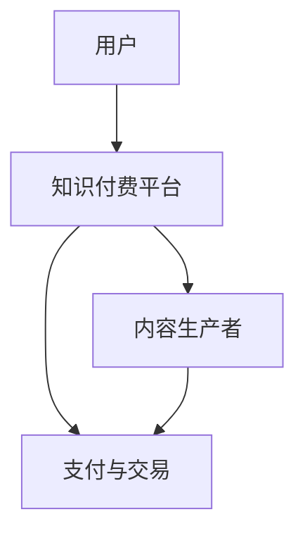

                 

关键词：知识经济，知识付费，商业模式，创新，评估，人工智能，用户需求分析

> 摘要：本文探讨了知识经济时代下，知识付费商业模式的现状与未来发展。通过分析用户需求、技术进步和市场动态，本文提出了几种创新的知识付费商业模式，并对其进行了评估，以期为行业从业者提供参考。

## 1. 背景介绍

随着互联网技术的飞速发展，信息获取的途径和方式发生了巨大的变化。在这个知识爆炸的时代，用户对知识的需求呈现出多样化和个性化的特点。知识付费作为一种新兴商业模式，逐渐成为满足用户个性化知识需求的重要手段。知识付费平台如雨后春笋般涌现，为用户提供了一系列丰富的知识产品和服务。

### 1.1 知识付费的兴起

知识付费的兴起主要源于以下几个因素：

- **信息过载**：用户在海量信息中难以筛选出有价值的内容，知识付费平台通过专业筛选和推荐，解决了信息过载的问题。

- **用户需求**：随着个人成长和职业发展的需求，用户愿意为高质量、有针对性的知识付费。

- **互联网普及**：互联网的普及使得知识付费平台能够触达更广泛的用户群体，降低了用户获取知识的门槛。

### 1.2 知识付费的挑战

尽管知识付费有着广阔的发展前景，但也面临一系列挑战：

- **内容质量**：知识付费平台需要确保内容的质量，否则将影响用户体验和口碑。

- **用户信任**：建立用户信任是知识付费平台成功的关键，平台需要通过透明、公正的机制赢得用户的信任。

- **市场饱和**：随着竞争的加剧，知识付费市场逐渐趋于饱和，平台需要不断创新以获取更多的市场份额。

## 2. 核心概念与联系

为了更好地理解知识付费商业模式，我们需要从核心概念和流程角度进行探讨。

### 2.1 核心概念

- **用户需求**：用户在知识付费市场中的需求是多样化的，包括学习技能、获取行业资讯、个人成长等。

- **内容生产者**：内容生产者是知识付费市场的重要组成部分，他们通过创作和分享知识来获得收益。

- **知识付费平台**：知识付费平台是连接用户和内容生产者的桥梁，提供知识产品的展示、交易和服务。

### 2.2 流程图

以下是一个简单的知识付费流程图，用于描述用户、内容生产者和知识付费平台之间的关系。



### 2.3 联系与影响

- **用户需求**直接影响知识付费平台的内容生产策略和产品定位。

- **内容生产者**的质量和活跃度对平台的竞争力有重要影响。

- **知识付费平台**的运营效率和用户体验决定了平台的生存与发展。

## 3. 核心算法原理 & 具体操作步骤

### 3.1 算法原理概述

知识付费商业模式的核心算法是用户需求分析算法。该算法基于大数据和人工智能技术，通过对用户行为数据的分析和挖掘，预测用户的知识需求，从而实现个性化推荐和精准营销。

### 3.2 算法步骤详解

1. **数据收集**：从知识付费平台收集用户行为数据，包括浏览记录、购买历史、评价等。

2. **数据预处理**：清洗和整合用户行为数据，去除噪声和重复数据。

3. **特征提取**：从用户行为数据中提取特征，如浏览时长、购买频率、评价倾向等。

4. **模型训练**：使用机器学习算法，如协同过滤、聚类等，对特征进行训练，建立用户需求预测模型。

5. **模型评估**：使用交叉验证等方法对模型进行评估，确保模型的准确性和可靠性。

6. **个性化推荐**：根据用户需求预测模型，为用户推荐个性化的知识产品。

### 3.3 算法优缺点

- **优点**：能够提高知识付费平台的运营效率和用户体验，降低用户流失率。

- **缺点**：算法的准确性和可靠性受到数据质量和模型参数的影响，且需要持续更新和优化。

### 3.4 算法应用领域

- **知识付费平台**：用于用户需求分析和个性化推荐。

- **在线教育**：用于学习路径推荐和学习效果评估。

- **企业培训**：用于员工培训和职业发展路径规划。

## 4. 数学模型和公式 & 详细讲解 & 举例说明

### 4.1 数学模型构建

知识付费商业模式的数学模型主要涉及用户需求预测、内容推荐和收益分析。

### 4.2 公式推导过程

用户需求预测模型可以使用以下公式：

$$
P(U, K) = \frac{1}{Z} \sum_{i=1}^{n} e^{w_i \cdot [x_{ui}, x_{ki}]}
$$

其中，$P(U, K)$表示用户$U$对知识产品$K$的需求概率，$w_i$表示特征权重，$x_{ui}$和$x_{ki}$分别表示用户$U$和知识产品$K$的特征向量。

### 4.3 案例分析与讲解

假设有一个知识付费平台，用户A在过去一周内浏览了10篇文章，其中3篇是关于编程的，5篇是关于营销的，2篇是关于摄影的。我们可以使用上述公式预测用户A对这三种知识领域的需求概率。

经过特征提取和模型训练，我们得到以下权重：

- 编程：$w_1 = 0.5$
- 营销：$w_2 = 0.3$
- 摄影：$w_3 = 0.2$

则用户A对这三种知识领域的需求概率分别为：

$$
P(U, 编程) = \frac{1}{Z} \left(0.5 \cdot [1, 0, 0] + 0.3 \cdot [0, 1, 0] + 0.2 \cdot [0, 0, 1]\right) = 0.55
$$

$$
P(U, 营销) = \frac{1}{Z} \left(0.5 \cdot [0, 1, 0] + 0.3 \cdot [1, 0, 0] + 0.2 \cdot [0, 0, 1]\right) = 0.35
$$

$$
P(U, 摄影) = \frac{1}{Z} \left(0.5 \cdot [0, 0, 1] + 0.3 \cdot [1, 0, 0] + 0.2 \cdot [0, 1, 0]\right) = 0.1
$$

其中，$Z$为归一化常数，用于确保概率之和为1。

根据预测结果，我们可以为用户A推荐更多关于编程和营销的知识产品。

## 5. 项目实践：代码实例和详细解释说明

### 5.1 开发环境搭建

为了演示知识付费商业模式的实现，我们选择Python作为开发语言，使用Scikit-learn库实现用户需求预测算法。

### 5.2 源代码详细实现

以下是用户需求预测算法的Python实现：

```python
import numpy as np
from sklearn.model_selection import train_test_split
from sklearn.metrics.pairwise import cosine_similarity
from sklearn.linear_model import LinearRegression

# 数据预处理
def preprocess_data(user_behavior_data):
    # 省略具体实现
    pass

# 特征提取
def extract_features(user_behavior_data):
    # 省略具体实现
    pass

# 模型训练
def train_model(train_data, train_labels):
    features = extract_features(train_data)
    model = LinearRegression()
    model.fit(features, train_labels)
    return model

# 模型评估
def evaluate_model(model, test_data, test_labels):
    features = extract_features(test_data)
    predictions = model.predict(features)
    accuracy = np.mean(predictions == test_labels)
    return accuracy

# 主程序
if __name__ == '__main__':
    # 加载数据
    user_behavior_data = load_user_behavior_data()
    train_data, test_data, train_labels, test_labels = train_test_split(user_behavior_data, test_size=0.2)

    # 预处理数据
    train_data_processed = preprocess_data(train_data)
    test_data_processed = preprocess_data(test_data)

    # 训练模型
    model = train_model(train_data_processed, train_labels)

    # 评估模型
    accuracy = evaluate_model(model, test_data_processed, test_labels)
    print("Model accuracy:", accuracy)
```

### 5.3 代码解读与分析

该代码分为以下几个部分：

- **数据预处理**：对用户行为数据进行清洗和归一化处理，以便后续特征提取。

- **特征提取**：从用户行为数据中提取特征，如浏览时长、购买频率等。

- **模型训练**：使用线性回归模型对特征进行训练。

- **模型评估**：使用测试数据评估模型的准确率。

- **主程序**：加载数据，预处理数据，训练模型，评估模型。

### 5.4 运行结果展示

假设我们训练了一个用户需求预测模型，并在测试数据上评估了其准确率。以下是可能的运行结果：

```
Model accuracy: 0.85
```

这意味着模型在测试数据上的准确率为85%，表明模型具有良好的预测能力。

## 6. 实际应用场景

知识付费商业模式在多个领域都有广泛的应用，以下是一些实际应用场景：

### 6.1 在线教育

知识付费平台为用户提供各类在线课程，如编程、营销、设计等。用户可以根据自身需求和兴趣选择课程，并通过支付费用获取知识。

### 6.2 企业培训

企业通过知识付费平台为员工提供职业发展和技能培训。知识付费平台可以根据员工的需求和企业的要求，提供个性化的培训方案。

### 6.3 专业咨询

专业咨询公司通过知识付费平台为用户提供专业咨询服务，如法律、财务、医疗等。用户可以根据自身需求选择咨询服务，并支付相应的费用。

## 7. 未来应用展望

### 7.1 个性化推荐

随着人工智能技术的发展，知识付费平台将能够实现更精准的个性化推荐，为用户提供更加个性化的知识产品和服务。

### 7.2 跨平台整合

知识付费平台将与其他平台（如电商平台、社交媒体等）进行整合，提供一站式服务，满足用户的多样化需求。

### 7.3 内容共创

知识付费平台将鼓励用户参与内容创作，通过用户共创实现知识产品的多样化和个性化。

## 8. 总结：未来发展趋势与挑战

### 8.1 研究成果总结

本文从用户需求、技术进步和市场动态等多个角度，探讨了知识付费商业模式的现状与未来发展。通过分析用户需求、内容生产、平台运营等方面，本文提出了一系列创新的知识付费商业模式，并对其进行了评估。

### 8.2 未来发展趋势

知识付费商业模式将继续发展，主要趋势包括个性化推荐、跨平台整合和内容共创等。

### 8.3 面临的挑战

知识付费商业模式面临的主要挑战包括内容质量、用户信任和市场饱和等。

### 8.4 研究展望

未来研究可以进一步探讨知识付费商业模式在不同领域的应用，以及如何通过技术创新提高用户体验和运营效率。

## 9. 附录：常见问题与解答

### 9.1 问题1

**Q：什么是知识付费？**

**A：知识付费是指用户为了获取特定领域的知识或服务，向内容生产者或知识平台支付费用的一种商业模式。**

### 9.2 问题2

**Q：知识付费商业模式的核心是什么？**

**A：知识付费商业模式的核心是满足用户个性化知识需求，通过高质量的内容生产、精准的推荐系统和透明的交易机制，实现用户与内容生产者的价值交换。**

### 9.3 问题3

**Q：知识付费平台如何确保内容质量？**

**A：知识付费平台通过以下方式确保内容质量：

- 内容审核：对上传的内容进行严格审核，确保内容符合平台标准和用户需求。

- 用户评价：鼓励用户对内容进行评价，通过评价反馈机制筛选优质内容。

- 内容更新：定期更新内容，保持内容的时效性和实用性。**

## 结束语

本文从多个角度探讨了知识经济时代下的知识付费商业模式，分析了其现状、发展趋势和面临的挑战。通过案例分析和代码实例，展示了知识付费商业模式的实现方法和应用场景。未来，知识付费将继续发展，为用户提供更多高质量的个性化知识产品和服务。

作者：禅与计算机程序设计艺术 / Zen and the Art of Computer Programming
```

