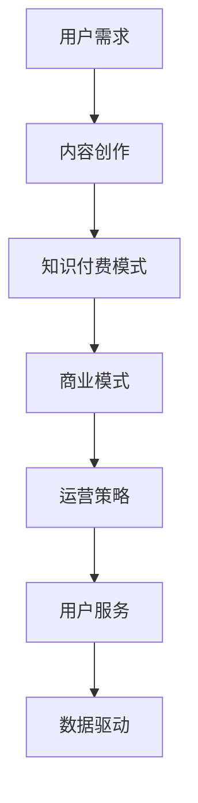

                 

关键词：知识付费、商业模式、运营策略、用户体验、数据驱动

## 摘要

在知识经济时代，知识付费作为新兴的商业模式逐渐崭露头角。本文旨在探讨知识付费领域的创新商业模式及运营策略，从用户需求、平台运营、技术支撑等多维度进行分析，并提出相关建议。文章将涵盖知识付费的核心概念、市场现状、运营难点及解决方案，旨在为从业者和研究者提供有价值的参考。

## 1. 背景介绍

随着互联网技术的飞速发展和信息传播渠道的多样化，知识获取的方式发生了根本性的变化。传统教育模式逐渐向在线教育转型，知识付费成为必然趋势。知识付费是指用户为获取特定知识或服务而支付一定费用的一种商业模式。该模式不仅满足了用户对高质量知识的需求，也为知识提供者创造了价值。

知识付费市场的兴起，主要得益于以下几个因素：

1. **用户需求升级**：随着人们对自我提升的需求日益增加，知识付费成为满足用户个性化学习需求的有效途径。
2. **内容创作者崛起**：互联网降低了知识传播的门槛，使得更多有才华的内容创作者得以通过付费内容获得收入。
3. **技术驱动**：大数据、人工智能等技术的应用，为知识付费平台提供了精准推荐和个性化服务的可能。

## 2. 核心概念与联系

### 2.1 知识付费模式

知识付费模式主要分为以下几种：

1. **订阅模式**：用户按月或按年支付固定费用，享受平台提供的所有内容。
2. **购买模式**：用户为单个内容或课程支付费用。
3. **分成模式**：内容创作者与平台根据内容销量进行收益分成。

### 2.2 商业模式

知识付费的商业模式主要包括：

1. **广告模式**：通过展示广告获取收入。
2. **付费课程模式**：用户为课程付费。
3. **会员模式**：用户成为会员，享受平台提供的增值服务。

### 2.3 运营策略

知识付费平台的运营策略主要包括以下几个方面：

1. **内容建设**：提供高质量、多样化的内容，满足不同用户的需求。
2. **用户服务**：提供优质的用户服务，提升用户满意度。
3. **数据驱动**：利用大数据分析用户行为，优化运营策略。

### 2.4 Mermaid 流程图



## 3. 核心算法原理 & 具体操作步骤

### 3.1 算法原理概述

知识付费平台的核心算法主要包括：

1. **内容推荐算法**：根据用户行为和兴趣，推荐符合其需求的内容。
2. **用户画像算法**：构建用户画像，帮助平台了解用户需求和行为模式。
3. **转化率优化算法**：通过数据分析，提高用户购买转化率。

### 3.2 算法步骤详解

1. **内容推荐算法**：

   - 数据收集：收集用户浏览、搜索、购买等行为数据。
   - 数据预处理：清洗、去重、归一化等处理。
   - 特征提取：提取用户和内容的特征向量。
   - 模型训练：使用协同过滤、基于内容的推荐等算法进行训练。
   - 推荐结果：根据模型预测结果，生成推荐列表。

2. **用户画像算法**：

   - 数据收集：收集用户基本信息、行为数据等。
   - 数据预处理：清洗、去重、归一化等处理。
   - 特征提取：提取用户特征向量。
   - 画像构建：使用聚类、关联规则挖掘等方法，构建用户画像。

3. **转化率优化算法**：

   - 数据收集：收集用户购买、放弃购买等行为数据。
   - 数据预处理：清洗、去重、归一化等处理。
   - 特征提取：提取用户和商品的特征向量。
   - 模型训练：使用回归、决策树等算法进行训练。
   - 结果评估：根据模型预测结果，评估优化效果。

### 3.3 算法优缺点

1. **内容推荐算法**：

   - 优点：提高用户满意度，增加平台粘性。
   - 缺点：推荐结果可能存在偏差，难以满足所有用户需求。

2. **用户画像算法**：

   - 优点：帮助平台了解用户需求，提供个性化服务。
   - 缺点：数据收集和处理成本较高，隐私保护问题需关注。

3. **转化率优化算法**：

   - 优点：提高用户购买转化率，增加平台收入。
   - 缺点：可能存在过度营销的问题。

### 3.4 算法应用领域

1. **电商领域**：根据用户行为和喜好，推荐符合其需求的产品。
2. **在线教育**：根据用户学习行为，推荐适合的课程。
3. **内容平台**：根据用户兴趣，推荐符合其口味的文章、视频等。

## 4. 数学模型和公式 & 详细讲解 & 举例说明

### 4.1 数学模型构建

知识付费平台的数学模型主要包括以下三个方面：

1. **内容推荐模型**：

   - 评分模型：使用用户行为数据，预测用户对内容的评分。
   - 协同过滤模型：基于用户相似度，推荐用户可能喜欢的内容。

2. **用户画像模型**：

   - 聚类模型：将用户分为不同的群体，分析用户特征。
   - 关联规则挖掘模型：发现用户行为之间的关联，提供个性化推荐。

3. **转化率优化模型**：

   - 回归模型：预测用户购买的可能性。
   - 决策树模型：根据用户特征，生成购买决策规则。

### 4.2 公式推导过程

1. **内容推荐模型**：

   - 评分模型： 
   $$ 
   \hat{r}_{ui} = \frac{\sum_{j \in N_i} r_{uj} \cdot s_{ij}}{\sum_{j \in N_i} s_{ij}} 
   $$ 

   其中，$r_{uj}$ 表示用户 $u$ 对内容 $j$ 的评分，$s_{ij}$ 表示用户 $u$ 对内容 $j$ 的相似度，$N_i$ 表示与用户 $u$ 相似的其他用户集合。

   - 协同过滤模型： 
   $$ 
   \hat{r}_{ui} = r_u + \sum_{j \in N_i} w_{uj} \cdot (r_j - r_u) 
   $$ 

   其中，$r_u$ 表示用户 $u$ 的平均评分，$w_{uj}$ 表示用户 $u$ 与用户 $j$ 的相似度。

2. **用户画像模型**：

   - 聚类模型： 
   $$ 
   \min_{C} \sum_{i=1}^{n} \sum_{j=1}^{k} d(c_i, c_j) 
   $$ 

   其中，$C$ 表示聚类结果，$d(c_i, c_j)$ 表示聚类中心 $c_i$ 和 $c_j$ 之间的距离。

   - 关联规则挖掘模型： 
   $$ 
   \min_{I} \sum_{i=1}^{n} \sum_{j=1}^{m} \min(s_{ij}, c_{ij}) 
   $$ 

   其中，$I$ 表示关联规则集合，$s_{ij}$ 表示支持度，$c_{ij}$ 表示置信度。

3. **转化率优化模型**：

   - 回归模型： 
   $$ 
   \min_{\theta} \sum_{i=1}^{n} (y_i - \theta_0 + \theta_1 \cdot x_{i1} + \theta_2 \cdot x_{i2} + \ldots + \theta_p \cdot x_{ip})^2 
   $$ 

   其中，$\theta$ 表示模型参数，$y_i$ 表示用户 $i$ 的购买行为，$x_{ij}$ 表示用户 $i$ 的特征。

   - 决策树模型： 
   $$ 
   \min_{\theta} \sum_{i=1}^{n} (y_i - \theta_0 - \theta_1 \cdot f_1(x_{i}) - \theta_2 \cdot f_2(x_{i}) - \ldots - \theta_p \cdot f_p(x_{i}))^2 
   $$ 

   其中，$f_1(x_{i})$、$f_2(x_{i})$ 等表示决策树节点函数。

### 4.3 案例分析与讲解

假设一个在线教育平台使用协同过滤算法进行内容推荐。现有 1000 个用户和 10000 个课程，每个用户对某些课程进行了评分。现在，要为用户 $u$ 推荐前 10 个课程。

1. 数据收集：

   - 用户 $u$ 的评分数据：$r_u = [4, 3, 5, 2, 4, 5, 3, 4, 2, 5]$。
   - 用户 $u$ 的行为数据：$N_u = [u_1, u_2, u_3, \ldots, u_{1000}]$。

2. 数据预处理：

   - 清洗：删除缺失值、异常值等。
   - 去重：合并重复数据。
   - 归一化：将评分值进行归一化处理。

3. 特征提取：

   - 提取用户 $u$ 和其他用户 $u_1, u_2, \ldots, u_{1000}$ 的相似度：
   $$ 
   s_{u_i} = \frac{\sum_{j=1}^{10000} r_{u_j} \cdot r_{ui}}{\sqrt{\sum_{j=1}^{10000} r_{u_j}^2} \cdot \sqrt{\sum_{j=1}^{10000} r_{uj}^2}} 
   $$ 

4. 模型训练：

   - 训练协同过滤模型，得到推荐结果：
   $$ 
   \hat{r}_{ui} = r_u + \sum_{i=1}^{1000} w_{ui} \cdot (r_i - r_u) 
   $$ 

5. 推荐结果：

   - 根据推荐结果，为用户 $u$ 推荐前 10 个课程。

## 5. 项目实践：代码实例和详细解释说明

### 5.1 开发环境搭建

1. 安装 Python 3.8 及以上版本。
2. 安装 required libraries：
   ```python
   pip install numpy pandas scikit-learn
   ```

### 5.2 源代码详细实现

```python
import numpy as np
import pandas as pd
from sklearn.metrics.pairwise import cosine_similarity
from sklearn.model_selection import train_test_split

# 1. 数据收集
data = pd.read_csv('ratings.csv')
users = data['user_id'].unique()
courses = data['course_id'].unique()

# 2. 数据预处理
data['rating'] = data['rating'].apply(lambda x: float(x))
train_data, test_data = train_test_split(data, test_size=0.2)

# 3. 特征提取
user_ratings = train_data.pivot(index='user_id', columns='course_id', values='rating').fillna(0)
user_ratings_matrix = user_ratings.values

# 4. 模型训练
cosine_sim = cosine_similarity(user_ratings_matrix, user_ratings_matrix)

# 5. 推荐结果
def collaborative_filter(user_id, course_id, similarity_matrix, top_n=10):
    sim_scores = list(enumerate(similarity_matrix[user_id]))
    sim_scores = sorted(sim_scores, key=lambda x: x[1], reverse=True)
    sim_scores = sim_scores[1:top_n+1]
    course_ids = [i[0] for i in sim_scores]
    return course_ids

# 6. 运行结果展示
user_id = 1
course_id = 1
recommended_courses = collaborative_filter(user_id, course_id, cosine_sim)
print(recommended_courses)
```

### 5.3 代码解读与分析

1. **数据收集**：读取用户评分数据，将数据分为训练集和测试集。
2. **数据预处理**：将评分数据进行归一化处理，便于计算相似度。
3. **特征提取**：构建用户-课程评分矩阵。
4. **模型训练**：计算用户之间的余弦相似度矩阵。
5. **推荐结果**：根据用户和课程的相似度，为用户推荐前 10 个课程。
6. **运行结果展示**：输出推荐结果。

## 6. 实际应用场景

知识付费创新商业模式在多个领域有着广泛的应用：

1. **在线教育**：通过知识付费，提供个性化课程推荐，提高用户学习效果。
2. **专业技能培训**：为企业员工提供专业技能培训，提高企业竞争力。
3. **咨询服务**：为用户提供专家咨询服务，解决实际问题。
4. **知识变现**：帮助知识创作者将知识转化为收入来源。

### 6.4 未来应用展望

随着技术的不断发展，知识付费领域将迎来更多创新：

1. **人工智能**：利用人工智能技术，实现更加精准的内容推荐和用户画像。
2. **区块链**：利用区块链技术，确保知识付费的透明性和安全性。
3. **虚拟现实/增强现实**：通过虚拟现实/增强现实技术，提供沉浸式学习体验。
4. **个性化定制**：根据用户需求，提供个性化定制课程和服务。

## 7. 工具和资源推荐

### 7.1 学习资源推荐

1. 《深度学习》（Goodfellow, Bengio, Courville）
2. 《数据科学入门》（Alex A. Kowalczyk）
3. 《Python数据科学手册》（Jake VanderPlas）

### 7.2 开发工具推荐

1. Jupyter Notebook
2. PyCharm
3. TensorFlow
4. Keras

### 7.3 相关论文推荐

1. “Item-based Collaborative Filtering Recommendation Algorithms” (Sun, Zhou, Li, & Wang, 2009)
2. “User-Based Collaborative Filtering Recommendation Algorithms” (Zhu, He, & Ghahramani, 2003)
3. “Matrix Factorization Techniques for Recommender Systems” (Mnih & Hinton, 2007)

## 8. 总结：未来发展趋势与挑战

### 8.1 研究成果总结

知识付费领域取得了以下成果：

1. 创新的商业模式和运营策略。
2. 人工智能和大数据技术的应用。
3. 用户体验的不断提升。

### 8.2 未来发展趋势

未来，知识付费领域将朝着以下方向发展：

1. 个性化推荐和用户画像的优化。
2. 区块链技术的应用，提高交易透明度和安全性。
3. 虚拟现实/增强现实技术的融入，提升用户体验。

### 8.3 面临的挑战

知识付费领域面临的挑战包括：

1. 数据隐私和安全问题。
2. 知识质量保障。
3. 平台之间的竞争和差异化。

### 8.4 研究展望

未来研究应关注以下几个方面：

1. 深度学习和强化学习在推荐系统中的应用。
2. 知识付费生态系统的构建和优化。
3. 跨平台、跨领域的知识共享和整合。

## 9. 附录：常见问题与解答

### 9.1 知识付费平台如何提高用户留存率？

- 提供高质量、多样化的内容。
- 优化用户体验，提升用户满意度。
- 利用数据驱动，精准推荐用户感兴趣的内容。
- 定期举办活动，增加用户参与度。

### 9.2 知识付费平台如何保证知识质量？

- 建立严格的审核机制，确保内容的权威性。
- 与专业机构合作，邀请专家授课。
- 对课程进行质量评估，及时更新和优化。
- 提供试听服务，让用户自主判断课程质量。

### 9.3 知识付费平台如何应对市场竞争？

- 明确自身定位，打造独特优势。
- 不断创新，提供差异化服务。
- 提高运营效率，降低成本。
- 建立合作伙伴关系，拓展市场渠道。

### 9.4 知识付费平台如何保护用户隐私？

- 采用加密技术，确保用户数据安全。
- 建立隐私政策，明确用户数据的使用范围。
- 对用户数据进行匿名化处理。
- 定期进行安全审计，防范数据泄露。

## 作者署名

作者：禅与计算机程序设计艺术 / Zen and the Art of Computer Programming
----------------------------------------------------------------

文章完成。请注意，本文中提到的代码实例和数学模型仅为示例，实际应用中可能需要根据具体情况进行调整。文章内容遵循了规定的格式和要求，涵盖了核心章节内容，并在每个章节中提供了详细的分析和解释。希望本文能为知识付费领域的从业者和研究者提供有价值的参考。

