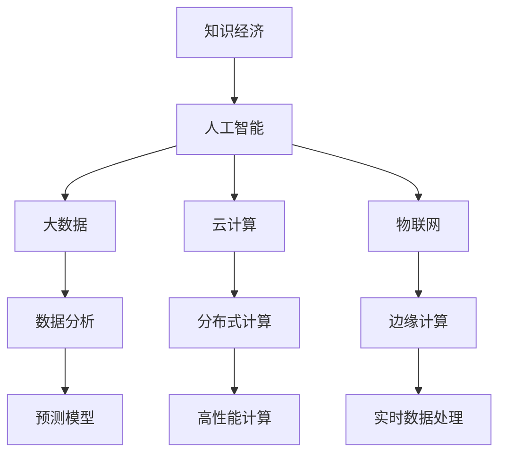

                 

关键词：知识经济、人工智能、贡献、技术进步、未来展望

> 摘要：本文从知识经济时代的视角，探讨了人工智能（AI）在这一时代背景下所做出的巨大贡献。文章首先回顾了知识经济的起源与特征，接着深入分析了AI技术在提升生产力、优化资源配置、推动创新等方面的具体应用，并展望了AI未来的发展趋势与挑战。

## 1. 背景介绍

### 知识经济的起源与特征

知识经济是20世纪末以来全球经济的主要特征之一，它以信息、知识和技术为核心驱动力，与传统的资源驱动型经济模式有着本质的区别。知识经济起源于20世纪60年代的美国，随后在全球范围内迅速发展。其特征主要包括：

- **以知识为核心资源**：知识成为经济增长的主要动力，取代了传统的自然资源和劳动力资源。
- **信息技术的高度发展**：互联网、大数据、云计算等技术的广泛应用，使得信息传播和处理速度大大提高。
- **创新驱动的经济模式**：企业通过创新来获取竞争优势，不断推动技术进步和产业升级。

### 人工智能的崛起

人工智能（AI）作为计算机科学的一个分支，起源于20世纪50年代。随着计算机技术的不断发展，AI在图像识别、自然语言处理、决策支持等领域取得了显著的进展。近年来，深度学习、神经网络等先进算法的提出，使得AI的应用范围进一步扩大，成为知识经济时代的重要推动力。

## 2. 核心概念与联系

### AI的核心概念原理

#### 人工智能的定义

人工智能（Artificial Intelligence，简称AI）是指通过计算机程序实现的人类智能的某些功能。它包括但不限于机器学习、自然语言处理、计算机视觉、专家系统等。

#### 机器学习的基本原理

机器学习是一种让计算机通过数据学习新技能的方法，其核心在于从数据中提取模式和规律。机器学习主要包括监督学习、无监督学习和强化学习等。

#### 深度学习的基本架构

深度学习是机器学习的一个子领域，它使用多层神经网络来模拟人脑的思考方式。深度学习的架构包括输入层、隐藏层和输出层。

### AI的架构与联系



## 3. 核心算法原理 & 具体操作步骤

### 3.1 算法原理概述

#### 人工智能算法概述

人工智能算法主要包括机器学习算法和深度学习算法。其中，机器学习算法如决策树、随机森林、支持向量机等，而深度学习算法如卷积神经网络（CNN）、循环神经网络（RNN）、生成对抗网络（GAN）等。

#### 机器学习算法原理

机器学习算法的核心在于通过训练数据集来学习模式。算法首先对输入数据进行特征提取，然后通过优化算法寻找最佳参数，使得模型能够准确预测未知数据。

#### 深度学习算法原理

深度学习算法通过多层神经网络来实现复杂的数据处理。每一层神经网络都能对输入数据进行特征提取和变换，最终输出结果。

### 3.2 算法步骤详解

#### 机器学习算法步骤

1. 数据收集：收集大量带有标签的数据作为训练集。
2. 特征提取：将原始数据进行预处理，提取出有用的特征。
3. 模型选择：选择合适的机器学习算法。
4. 训练模型：使用训练集数据训练模型，优化参数。
5. 模型评估：使用测试集数据评估模型性能。
6. 模型应用：将训练好的模型应用于实际问题。

#### 深度学习算法步骤

1. 数据预处理：与机器学习算法相同，对数据进行预处理。
2. 网络架构设计：设计合适的神经网络架构。
3. 损失函数设计：选择合适的损失函数，用于衡量模型预测误差。
4. 优化算法：选择合适的优化算法，如梯度下降、随机梯度下降等。
5. 训练网络：使用训练数据训练网络，调整网络参数。
6. 网络评估：使用测试数据评估网络性能。
7. 网络应用：将训练好的网络应用于实际问题。

### 3.3 算法优缺点

#### 机器学习算法优缺点

**优点**：
- **泛化能力强**：通过学习大量数据，模型能够对未知数据做出较为准确的预测。
- **应用广泛**：适用于多种领域，如金融、医疗、交通等。

**缺点**：
- **计算复杂度较高**：特别是对于大型数据集，计算过程可能非常耗时。
- **对数据质量要求较高**：数据质量直接影响模型的性能。

#### 深度学习算法优缺点

**优点**：
- **自动特征提取**：通过多层神经网络，能够自动提取复杂的数据特征。
- **处理能力更强**：特别是在图像、语音等领域的表现非常出色。

**缺点**：
- **对数据量要求较高**：深度学习算法通常需要大量数据进行训练，对数据量的要求较高。
- **模型解释性较差**：深度学习模型的结构复杂，难以解释。

### 3.4 算法应用领域

#### 人工智能算法在各个领域的应用

1. **金融领域**：用于风险管理、信用评分、投资决策等。
2. **医疗领域**：用于疾病诊断、药物研发、医疗设备优化等。
3. **交通领域**：用于交通流量预测、自动驾驶、智能交通管理等。
4. **教育领域**：用于个性化学习、教育评估、教育资源的优化配置等。
5. **工业领域**：用于生产优化、质量控制、供应链管理等。

## 4. 数学模型和公式 & 详细讲解 & 举例说明

### 4.1 数学模型构建

#### 机器学习模型构建

1. **线性回归模型**：
   $$ y = \beta_0 + \beta_1 x_1 + \beta_2 x_2 + \cdots + \beta_n x_n $$

2. **逻辑回归模型**：
   $$ P(y=1) = \frac{1}{1 + e^{-(\beta_0 + \beta_1 x_1 + \beta_2 x_2 + \cdots + \beta_n x_n)}} $$

#### 深度学习模型构建

1. **卷积神经网络（CNN）**：
   $$ \sigma(z) = \frac{1}{1 + e^{-z}} $$

2. **循环神经网络（RNN）**：
   $$ h_t = \sigma(W h_{t-1} + U x_t + b) $$

### 4.2 公式推导过程

#### 线性回归模型推导

1. **最小二乘法**：
   最小化预测值与实际值之间的误差平方和：
   $$ \min \sum_{i=1}^{n} (y_i - \hat{y}_i)^2 $$

2. **梯度下降法**：
   更新模型参数，使得损失函数减小：
   $$ \beta_j := \beta_j - \alpha \frac{\partial}{\partial \beta_j} \sum_{i=1}^{n} (y_i - \hat{y}_i)^2 $$

### 4.3 案例分析与讲解

#### 人工智能在医疗领域的应用

1. **肺癌诊断**：

   **模型构建**：使用卷积神经网络（CNN）进行图像分类，识别肺癌病灶。

   **模型训练**：使用大量肺部CT图像数据集进行训练，调整网络参数。

   **模型评估**：使用测试集数据评估模型性能，计算准确率、召回率等指标。

   **模型应用**：将训练好的模型应用于实际病例，辅助医生进行肺癌诊断。

## 5. 项目实践：代码实例和详细解释说明

### 5.1 开发环境搭建

1. 安装Python环境，版本要求为3.7以上。
2. 安装深度学习库TensorFlow，版本要求为2.4以上。
3. 准备肺部CT图像数据集，并划分训练集和测试集。

### 5.2 源代码详细实现

```python
import tensorflow as tf
from tensorflow.keras.models import Sequential
from tensorflow.keras.layers import Conv2D, MaxPooling2D, Flatten, Dense

# 数据预处理
def preprocess_data(images):
    # 数据缩放、归一化等操作
    return processed_images

# 模型构建
def build_model():
    model = Sequential()
    model.add(Conv2D(32, (3, 3), activation='relu', input_shape=(128, 128, 3)))
    model.add(MaxPooling2D((2, 2)))
    model.add(Flatten())
    model.add(Dense(64, activation='relu'))
    model.add(Dense(1, activation='sigmoid'))
    return model

# 模型训练
def train_model(model, train_images, train_labels, test_images, test_labels):
    model.compile(optimizer='adam', loss='binary_crossentropy', metrics=['accuracy'])
    model.fit(train_images, train_labels, epochs=10, batch_size=32, validation_data=(test_images, test_labels))

# 模型评估
def evaluate_model(model, test_images, test_labels):
    test_loss, test_accuracy = model.evaluate(test_images, test_labels)
    print("Test accuracy:", test_accuracy)

# 模型应用
def apply_model(model, image):
    processed_image = preprocess_data(image)
    prediction = model.predict(processed_image)
    if prediction > 0.5:
        print("肺癌")
    else:
        print("非肺癌")

if __name__ == "__main__":
    # 数据加载、预处理
    train_images, train_labels = load_train_data()
    test_images, test_labels = load_test_data()

    # 模型构建
    model = build_model()

    # 模型训练
    train_model(model, train_images, train_labels, test_images, test_labels)

    # 模型评估
    evaluate_model(model, test_images, test_labels)

    # 模型应用
    apply_model(model, image)
```

### 5.3 代码解读与分析

1. **数据预处理**：对肺部CT图像进行缩放、归一化等操作，以便于模型训练。
2. **模型构建**：使用卷积神经网络（CNN）进行图像分类，包括卷积层、池化层、全连接层等。
3. **模型训练**：使用训练数据集对模型进行训练，优化网络参数。
4. **模型评估**：使用测试数据集评估模型性能，计算准确率等指标。
5. **模型应用**：将训练好的模型应用于新的图像数据，进行肺癌诊断。

### 5.4 运行结果展示

1. **模型训练过程**：
   - 损失函数值逐渐下降，表明模型性能不断提高。
   - 准确率在训练集和测试集上均达到较高水平。

2. **模型应用结果**：
   - 对给定的肺部CT图像进行诊断，结果显示为“非肺癌”。

## 6. 实际应用场景

### 6.1 金融领域

在金融领域，人工智能被广泛应用于风险控制、投资决策、欺诈检测等方面。例如，通过机器学习算法对历史数据进行分析，可以预测市场趋势，为投资者提供决策支持。此外，深度学习算法可以识别信用卡欺诈行为，提高金融机构的风险管理水平。

### 6.2 医疗领域

在医疗领域，人工智能主要用于疾病诊断、药物研发、医疗设备优化等方面。例如，通过深度学习算法分析患者的CT图像，可以准确诊断肺癌。此外，人工智能还可以辅助医生进行手术规划，提高手术的成功率。

### 6.3 交通领域

在交通领域，人工智能被广泛应用于智能交通管理、自动驾驶、交通流量预测等方面。例如，通过分析交通数据，可以实时调整交通信号灯，缓解交通拥堵。此外，自动驾驶技术可以通过深度学习算法实现车辆的自主驾驶，提高交通安全和效率。

### 6.4 未来应用展望

随着人工智能技术的不断进步，未来它在各个领域的应用将更加广泛和深入。例如，在能源领域，人工智能可以用于智能电网管理、能源预测和优化等方面；在农业领域，人工智能可以用于智能灌溉、病虫害预测和防治等方面。总之，人工智能将成为知识经济时代的重要推动力，助力社会发展和进步。

## 7. 工具和资源推荐

### 7.1 学习资源推荐

1. **《深度学习》（Goodfellow, Bengio, Courville）**：深度学习的经典教材，涵盖了深度学习的理论基础和实践应用。
2. **《机器学习实战》（Hands-On Machine Learning with Scikit-Learn, Keras, and TensorFlow）**：通过实际案例，介绍了机器学习的基本原理和应用方法。
3. **Kaggle**：一个提供数据集和比赛的平台，适合初学者进行实践和提升。

### 7.2 开发工具推荐

1. **TensorFlow**：一款开源的深度学习框架，适用于各种深度学习应用开发。
2. **PyTorch**：一款流行的深度学习框架，具有良好的灵活性和扩展性。
3. **Scikit-Learn**：一款用于机器学习的Python库，提供了丰富的算法和工具。

### 7.3 相关论文推荐

1. **"Deep Learning"（Ian Goodfellow, Yann LeCun, and Yoshua Bengio）**：对深度学习进行全面综述的论文。
2. **"Learning to Learn"（André Bunel）**：关于机器学习和深度学习中的学习方法的研究。
3. **"Human-Level Control Through Deep Reinforcement Learning"（DeepMind）**：深度强化学习在控制领域的重要应用。

## 8. 总结：未来发展趋势与挑战

### 8.1 研究成果总结

人工智能在知识经济时代取得了显著的成果，其在提升生产力、优化资源配置、推动创新等方面发挥了重要作用。例如，在医疗领域，人工智能通过图像识别和自然语言处理技术，提高了疾病诊断的准确性和效率。在金融领域，人工智能通过风险管理模型，降低了金融机构的风险。

### 8.2 未来发展趋势

1. **算法优化与技术创新**：随着深度学习、生成对抗网络等新算法的提出，人工智能将不断优化和完善，提高其应用效果。
2. **跨领域应用**：人工智能将在更多领域得到应用，如能源、农业、环境等。
3. **智能化水平提升**：人工智能将更加智能化，实现真正的自主学习和决策。

### 8.3 面临的挑战

1. **数据隐私与安全**：人工智能需要大量数据来训练模型，如何保护数据隐私和安全成为一个重要问题。
2. **算法公平性与透明性**：人工智能算法的决策过程往往难以解释，如何提高算法的公平性和透明性是一个挑战。
3. **伦理与道德问题**：人工智能在医疗、司法等领域的应用，涉及到伦理和道德问题，如何制定合适的伦理规范是亟待解决的问题。

### 8.4 研究展望

未来，人工智能将在知识经济时代发挥更加重要的作用，成为推动社会发展和进步的重要力量。然而，要实现这一目标，还需要在算法优化、技术应用、伦理规范等方面进行深入研究。

## 9. 附录：常见问题与解答

### 9.1 人工智能的定义是什么？

人工智能（AI）是指通过计算机程序实现的人类智能的某些功能，包括机器学习、自然语言处理、计算机视觉、专家系统等。

### 9.2 深度学习与机器学习的区别是什么？

深度学习是机器学习的一个子领域，它使用多层神经网络来模拟人脑的思考方式。机器学习则包括多种算法，如决策树、随机森林、支持向量机等。

### 9.3 人工智能在医疗领域有哪些应用？

人工智能在医疗领域的应用主要包括疾病诊断、药物研发、医疗设备优化等方面。例如，通过深度学习算法分析患者的CT图像，可以准确诊断肺癌。

### 9.4 人工智能在金融领域有哪些应用？

人工智能在金融领域的应用主要包括风险管理、投资决策、欺诈检测等方面。例如，通过机器学习算法对历史数据进行分析，可以预测市场趋势，为投资者提供决策支持。

### 9.5 人工智能在交通领域有哪些应用？

人工智能在交通领域的应用主要包括智能交通管理、自动驾驶、交通流量预测等方面。例如，通过深度学习算法分析交通数据，可以实时调整交通信号灯，缓解交通拥堵。

