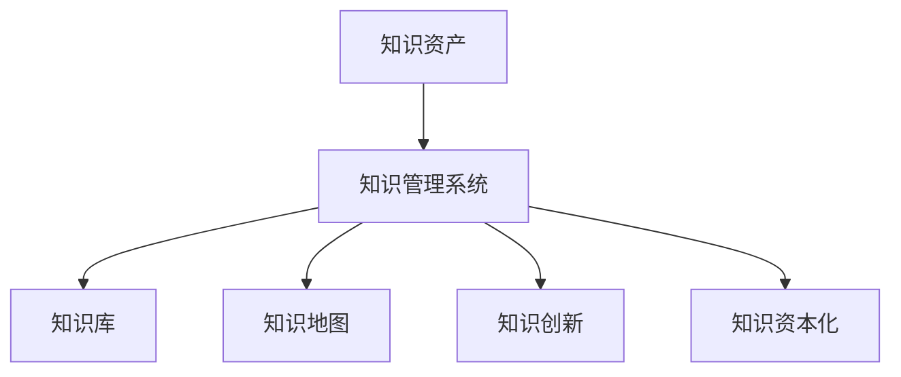

                 

# 知识资产模式实现知识的资本化运作

## 1. 背景介绍

### 1.1 问题由来

在信息爆炸的时代，知识资产作为企业核心竞争力的重要组成部分，正越来越受到各界的关注。然而，传统的知识管理方式存在诸多问题，如知识的获取、存储、传播、应用效率低下，难以实现知识的快速迭代和资本化运作。知识资产模式作为一种新兴的知识管理理念和方法，旨在通过系统化和资本化的方式，优化知识获取、存储、传播、应用的全生命周期管理，提升企业知识资产的价值。

### 1.2 问题核心关键点

知识资产模式的关键点在于，通过对知识的系统化管理，实现知识的资本化运作。其核心思想是通过知识管理系统，将分散在企业内外部的知识资源集中化、标准化，形成易于获取、传播、应用的知识库，以知识为资本驱动企业创新和业务增长。

知识资产模式的构建，涉及知识获取、知识存储、知识传播、知识应用等环节，需要跨部门、跨业务的协同合作，同时也需要借助先进的信息技术和数据驱动的管理方式。

### 1.3 问题研究意义

研究知识资产模式，对于提升企业的知识管理水平、加速企业知识创新、提升企业竞争力具有重要意义：

1. **提升知识管理效率**。通过系统化的知识管理，实现知识获取、存储、传播、应用的规范化、标准化、流程化，大大提升知识管理的效率和效果。
2. **加速企业知识创新**。构建知识资产模式，可以快速响应市场需求变化，提升企业知识应用的灵活性和创造性，加速企业产品和服务的迭代。
3. **提升企业竞争力**。以知识为资本，通过知识共享、知识传播、知识应用，驱动企业创新和业务增长，提升企业在市场中的竞争力和影响力。
4. **支持企业可持续发展**。通过持续的知识积累和应用，支持企业长期的可持续发展，增强企业的市场适应能力和风险抵御能力。

## 2. 核心概念与联系

### 2.1 核心概念概述

为更好地理解知识资产模式，本节将介绍几个密切相关的核心概念：

- **知识资产(Knowledge Assets)**：指企业拥有的、可用于支持企业创新、优化业务流程、提升产品服务质量、增强市场竞争力的知识资源。
- **知识管理系统(Knowledge Management System, KMS)**：一种集成的知识管理平台，支持知识获取、存储、传播、应用等全生命周期管理。
- **知识库(Knowledge Base)**：集中存储企业知识资源的数据库，供员工检索、使用和分享。
- **知识地图(Knowledge Map)**：描绘企业知识资产结构、分类、关联关系，帮助用户快速定位知识资源。
- **知识创新(Knowledge Innovation)**：通过知识共享、知识应用，推动企业产品和服务的持续创新。
- **知识资本化(Knowledge Capitalization)**：将知识转化为企业的资本，通过知识应用驱动企业增长，提升企业价值。

这些核心概念之间的逻辑关系可以通过以下Mermaid流程图来展示：



这个流程图展示了这个知识资产管理系统的核心概念及其之间的关系：

1. 知识资产通过知识管理系统进行集中化管理。
2. 知识管理系统通过知识库和知识地图，实现知识的存储、传播和应用。
3. 知识库和知识地图支持知识创新，推动企业产品和服务的持续优化。
4. 知识创新和应用，驱动知识资本化运作，提升企业价值。

## 3. 核心算法原理 & 具体操作步骤

### 3.1 算法原理概述

知识资产模式的实现，本质上是通过知识管理系统对企业知识资源进行系统化、资本化的管理。其核心思想是：通过知识管理系统，将知识资源转化为可被检索、共享、应用的知识库，支持企业知识创新的同时，实现知识的资本化运作。

形式化地，假设企业拥有的知识资源为 $K$，知识管理系统的目标是将 $K$ 转化为可被检索、共享、应用的知识库 $L$，以支持企业创新和业务增长。知识管理系统的优化目标是最小化知识获取、存储、传播、应用的成本 $C$，即：

$$
\min_{L} C = \min_{L} \left( \sum_{i=1}^{n} C_i \right)
$$

其中 $n$ 为知识资源的种类，$C_i$ 为第 $i$ 种知识资源的管理成本。

通过优化知识管理系统的运行效率，降低知识管理的成本，知识资产模式可以实现知识的资本化运作，提升企业竞争力。

### 3.2 算法步骤详解

知识资产模式的构建，主要包括以下几个关键步骤：

**Step 1: 知识资产盘点**

- 对企业内外部所有的知识资源进行全面盘点，包括文档、数据、代码、技术、经验、工艺、方法等。
- 对每个知识资源进行分类、标注、评价，确定其对企业创新的贡献价值。

**Step 2: 知识库搭建**

- 选择合适的知识管理系统，建立企业级知识库，支持知识集中存储、检索、应用。
- 设计合理的知识库结构，包括分类、层次、关联关系等，方便知识的管理和使用。

**Step 3: 知识地图构建**

- 利用自然语言处理、图神经网络等技术，构建企业知识地图，描绘知识资产结构、分类、关联关系。
- 开发知识地图查询工具，帮助用户快速定位知识资源。

**Step 4: 知识应用支持**

- 开发知识应用平台，支持企业员工基于知识库进行知识检索、分享、应用。
- 集成知识应用工具，如文本挖掘、数据可视化、项目管理等，提升知识应用的效率和效果。

**Step 5: 知识创新驱动**

- 建立知识创新机制，鼓励员工基于知识库进行创新实践，提升产品和服务质量。
- 利用数据挖掘技术，分析知识应用效果，提供知识创新的指导和支持。

**Step 6: 知识资本化运作**

- 通过知识应用平台和知识创新机制，将知识转化为企业的资本，驱动企业增长。
- 建立知识评估体系，定期评估知识资产的价值和应用效果，优化知识管理策略。

以上是知识资产模式的一般流程。在实际应用中，还需要针对具体企业的情况，对知识资产盘点、知识库搭建、知识地图构建、知识应用支持、知识创新驱动等环节进行优化设计，以最大限度地发挥知识资产模式的潜力。

### 3.3 算法优缺点

知识资产模式具有以下优点：

1. **系统化管理**：通过知识管理系统，实现知识资源的有序管理，避免知识碎片化、重复存储等问题。
2. **资本化运作**：将知识转化为企业的资本，通过知识应用驱动企业创新和增长，提升企业价值。
3. **支持创新**：通过知识共享、知识应用，支持企业产品和服务的持续创新，提升产品竞争力。
4. **快速响应**：知识管理系统可以快速响应用户需求，提升知识应用的灵活性和效率。

同时，该方法也存在一定的局限性：

1. **成本高昂**：知识管理系统的搭建和维护需要较高的成本，特别是对大型企业而言。
2. **技术复杂**：知识管理系统的设计和实现需要较强的技术背景，对企业信息技术人员的要求较高。
3. **数据质量**：知识资产盘点和知识库搭建需要高质量的知识资源数据，数据质量问题可能会影响知识管理效果。
4. **动态性不足**：知识管理系统对外部环境变化响应较慢，难以快速适应市场和技术的变化。
5. **知识共享难度**：企业内部文化差异、利益冲突等因素，可能会影响知识共享的积极性。

尽管存在这些局限性，但就目前而言，知识资产模式仍是企业知识管理的主流范式。未来相关研究的重点在于如何进一步降低知识管理的成本，提高知识共享的积极性，增强知识管理系统的动态性和灵活性，以及提升数据质量控制等。

### 3.4 算法应用领域

知识资产模式在企业管理、科研机构、高校等多个领域都有广泛的应用，以下是几个典型的应用场景：

1. **企业知识管理**：在企业中，知识资产模式用于提升产品创新、优化业务流程、提升员工知识水平等，如研发机构的知识库建设、企业内部培训等。
2. **科研机构知识共享**：科研机构通过知识资产模式，共享研究数据、技术成果、研究方法等，提升科研效率和影响力。
3. **高校知识创新**：高校利用知识资产模式，推动学科建设、师资培养、科研创新等，提升教学和科研水平。
4. **政府数据治理**：政府通过知识资产模式，实现数据标准化、开放共享、应用优化，提升政府治理能力。

此外，知识资产模式还广泛应用于健康医疗、金融保险、智能制造等各行业，为提升行业知识管理水平、加速行业知识创新提供了重要手段。

## 4. 数学模型和公式 & 详细讲解 & 举例说明

### 4.1 数学模型构建

本节将使用数学语言对知识资产模式的实现过程进行更加严格的刻画。

记企业拥有的知识资源为 $K$，知识管理系统的目标是将 $K$ 转化为可被检索、共享、应用的知识库 $L$。知识管理系统的优化目标是最小化知识获取、存储、传播、应用的成本 $C$，即：

$$
\min_{L} C = \min_{L} \left( \sum_{i=1}^{n} C_i \right)
$$

其中 $n$ 为知识资源的种类，$C_i$ 为第 $i$ 种知识资源的管理成本。

### 4.2 公式推导过程

知识管理系统对知识资源的优化管理，可以通过以下步骤实现：

1. **知识资源获取**：
   - 从企业内外部的各种渠道获取知识资源 $K$，包括文档、数据、代码、技术、经验、工艺、方法等。
   - 对获取的知识资源进行清洗、标注、分类、评价，去除冗余、错误、重复的信息，保留对企业创新有价值的知识资源。

2. **知识资源存储**：
   - 将清洗后的知识资源 $K$ 存储到知识库 $L$ 中，利用元数据进行标准化、分类、关联关系描述。
   - 设计合理的知识库结构，包括分类、层次、关联关系等，方便知识的管理和使用。

3. **知识资源传播**：
   - 通过知识地图和搜索工具，帮助员工快速定位和获取需要的知识资源。
   - 利用知识推荐算法，根据员工的历史行为和兴趣，推荐相关的知识资源，提升知识传播的效率和效果。

4. **知识资源应用**：
   - 开发知识应用平台，支持员工基于知识库进行知识检索、分享、应用。
   - 集成知识应用工具，如文本挖掘、数据可视化、项目管理等，提升知识应用的效率和效果。

5. **知识资源评估**：
   - 定期对知识库中的知识资源进行评估，分析其应用效果和对企业创新的贡献价值。
   - 根据评估结果，优化知识库结构和知识管理策略，提升知识库的质量和应用效果。

### 4.3 案例分析与讲解

以下以企业知识库的构建为例，展示知识资产模式的实现过程。

假设某企业拥有以下知识资源：

1. 文档资源 $K_1$：包括企业内部文档、客户案例、行业报告等。
2. 代码资源 $K_2$：包括企业内部开发的项目代码、开源代码库等。
3. 技术资源 $K_3$：包括专利、技术方案、技术白皮书等。

知识管理系统的优化目标是最小化知识获取、存储、传播、应用的成本 $C$，即：

$$
\min_{L} C = \min_{L} \left( C_1 + C_2 + C_3 \right)
$$

具体步骤如下：

1. **知识资源获取**：
   - 从企业内外部的各种渠道获取知识资源 $K_1$、$K_2$、$K_3$。
   - 对获取的知识资源进行清洗、标注、分类、评价，去除冗余、错误、重复的信息，保留对企业创新有价值的知识资源。

2. **知识资源存储**：
   - 将清洗后的知识资源 $K_1$、$K_2$、$K_3$ 存储到知识库 $L$ 中，利用元数据进行标准化、分类、关联关系描述。
   - 设计合理的知识库结构，包括分类、层次、关联关系等，方便知识的管理和使用。

3. **知识资源传播**：
   - 通过知识地图和搜索工具，帮助员工快速定位和获取需要的知识资源。
   - 利用知识推荐算法，根据员工的历史行为和兴趣，推荐相关的知识资源，提升知识传播的效率和效果。

4. **知识资源应用**：
   - 开发知识应用平台，支持员工基于知识库进行知识检索、分享、应用。
   - 集成知识应用工具，如文本挖掘、数据可视化、项目管理等，提升知识应用的效率和效果。

5. **知识资源评估**：
   - 定期对知识库中的知识资源进行评估，分析其应用效果和对企业创新的贡献价值。
   - 根据评估结果，优化知识库结构和知识管理策略，提升知识库的质量和应用效果。

通过上述步骤，企业可以构建起一个高效、系统的知识管理系统，实现知识的资本化运作，提升企业的竞争力。

## 5. 项目实践：代码实例和详细解释说明

### 5.1 开发环境搭建

在进行知识资产模式实践前，我们需要准备好开发环境。以下是使用Python进行Jupyter Notebook开发的环境配置流程：

1. 安装Anaconda：从官网下载并安装Anaconda，用于创建独立的Python环境。

2. 创建并激活虚拟环境：
```bash
conda create -n knowledge-env python=3.8 
conda activate knowledge-env
```

3. 安装必要的Python库：
```bash
pip install numpy pandas matplotlib jupyter notebook 
```

4. 安装数据处理库：
```bash
pip install beautifulsoup4 requests
```

5. 安装知识管理系统相关的库：
```bash
pip install elasticsearch tika
```

完成上述步骤后，即可在`knowledge-env`环境中开始知识资产模式的项目实践。

### 5.2 源代码详细实现

我们以构建企业知识库为例，展示如何使用Python和Jupyter Notebook实现知识资产模式。

首先，我们需要定义一个知识资源类：

```python
from pydataframe import DataFrame
from pyelasticsearch import Elasticsearch
from tika import Tika

class KnowledgeResource:
    def __init__(self, resource_type):
        self.resource_type = resource_type
        self.df = None
        self.index = 'knowledge'
        self.es = Elasticsearch()
    
    def load_data(self):
        if self.resource_type == 'document':
            self.df = self._load_documents()
        elif self.resource_type == 'code':
            self.df = self._load_codes()
        elif self.resource_type == 'technology':
            self.df = self._load_technology()
        else:
            raise ValueError('Unsupported resource type')
    
    def _load_documents(self):
        tika = Tika()
        data = []
        with open('documents.txt', 'r') as f:
            for line in f:
                text = tika.parse_from_string(line)
                data.append([text, 'document'])
        return DataFrame(data)
    
    def _load_codes(self):
        data = []
        with open('codes.txt', 'r') as f:
            for line in f:
                data.append([line, 'code'])
        return DataFrame(data)
    
    def _load_technology(self):
        data = []
        with open('technology.txt', 'r') as f:
            for line in f:
                data.append([line, 'technology'])
        return DataFrame(data)
    
    def store_data(self):
        if self.df is None:
            raise ValueError('Data not loaded')
        self.df.to_csv('knowledge.csv')
        self.es.index(index=self.index, body=self.df.to_json(), refresh=True)
    
    def search_data(self, query):
        res = self.es.search(index=self.index, body={'query': {'match': {'content': query}}})
        return [doc['_source'] for doc in res['hits']['hits']]
```

然后，我们定义一个知识管理系统类，负责管理知识库的构建和应用：

```python
from knowledge_resource import KnowledgeResource

class KnowledgeManagementSystem:
    def __init__(self):
        self.knowledge_resources = []
    
    def add_knowledge_resource(self, resource_type):
        self.knowledge_resources.append(KnowledgeResource(resource_type))
    
    def load_knowledge_resources(self):
        for resource in self.knowledge_resources:
            resource.load_data()
    
    def store_knowledge_resources(self):
        for resource in self.knowledge_resources:
            resource.store_data()
    
    def search_knowledge(self, query):
        results = []
        for resource in self.knowledge_resources:
            results.extend(resource.search_data(query))
        return results
```

最后，启动知识管理系统的应用流程：

```python
km = KnowledgeManagementSystem()
km.add_knowledge_resource('document')
km.add_knowledge_resource('code')
km.add_knowledge_resource('technology')
km.load_knowledge_resources()
km.store_knowledge_resources()
print(km.search_knowledge('机器学习'))
```

以上就是使用Python和Jupyter Notebook构建企业知识库的完整代码实现。可以看到，通过封装知识资源类和知识管理系统类，我们可以用相对简洁的代码实现知识资产模式的实践。

### 5.3 代码解读与分析

让我们再详细解读一下关键代码的实现细节：

**KnowledgeResource类**：
- `__init__`方法：初始化资源类型、数据框架、Elasticsearch连接等。
- `load_data`方法：根据资源类型加载数据到数据框架中。
- `store_data`方法：将数据框架数据存储到Elasticsearch中。
- `search_data`方法：在Elasticsearch中搜索符合查询条件的数据。

**KnowledgeManagementSystem类**：
- `__init__`方法：初始化知识资源列表。
- `add_knowledge_resource`方法：添加不同类型的知识资源。
- `load_knowledge_resources`方法：加载所有知识资源数据。
- `store_knowledge_resources`方法：存储所有知识资源数据到Elasticsearch。
- `search_knowledge`方法：在Elasticsearch中搜索符合查询条件的所有知识资源。

**代码执行流程**：
1. 创建知识管理系统实例。
2. 添加不同类型的知识资源。
3. 加载所有知识资源数据。
4. 存储所有知识资源数据到Elasticsearch。
5. 搜索符合查询条件的知识资源。

可以看到，通过封装和组合不同的知识资源类和知识管理系统类，我们可以灵活实现知识资产模式的实践，支持不同类型的知识资源管理。

当然，工业级的系统实现还需考虑更多因素，如Elasticsearch集群管理、数据安全、用户权限控制等。但核心的知识资产模式框架基本与此类似。

## 6. 实际应用场景

### 6.1 智能制造

在智能制造领域，知识资产模式通过整合企业内部的工艺流程、技术方案、设备数据等知识资源，支持企业的生产优化、设备维护、故障诊断等，提升企业的生产效率和产品质量。

### 6.2 智慧医疗

在智慧医疗领域，知识资产模式通过整合医疗机构的知识资源，如病历数据、医学文献、临床指南等，支持医生的诊疗决策、疾病预测、患者管理等，提升医疗服务的质量和效率。

### 6.3 金融服务

在金融服务领域，知识资产模式通过整合金融机构的客户数据、市场数据、交易数据等知识资源，支持风险评估、投资决策、客户服务、反欺诈等，提升金融服务的安全性和精准性。

### 6.4 未来应用展望

随着知识资产模式的不断发展，未来在更多领域将得到广泛应用，为各行各业带来变革性影响。

在教育领域，知识资产模式通过整合教育资源、教学方法、评估数据等，支持个性化学习、知识共享、教学创新等，提升教育质量和公平性。

在城市治理领域，知识资产模式通过整合城市数据、公共服务数据、城市规划数据等，支持智慧城市建设、应急响应、交通管理等，提升城市治理的效率和效果。

在农业领域，知识资产模式通过整合农业技术、气象数据、农业生产数据等，支持农业知识传播、生产优化、灾害预防等，提升农业生产水平和可持续发展能力。

此外，在能源、环保、旅游、餐饮等众多领域，知识资产模式也将不断拓展应用场景，为各行各业的知识管理提供新的技术路径。相信随着知识资产模式的持续演进，知识管理将变得更加系统化、资本化，为人类社会带来更深远的影响。

## 7. 工具和资源推荐

### 7.1 学习资源推荐

为了帮助开发者系统掌握知识资产模式的知识管理理念和方法，这里推荐一些优质的学习资源：

1. 《知识管理理论与实践》系列博文：由知识管理领域专家撰写，深入浅出地介绍了知识管理的基本概念、核心技术和实践方法。

2. 《知识管理》课程：麻省理工学院开设的在线课程，涵盖知识管理的基本原理、实践工具和应用案例，适合系统学习知识管理知识。

3. 《企业知识管理系统建设》书籍：深入探讨企业知识管理系统建设的策略、方法和案例，适合企业知识管理从业人员参考。

4. 《知识管理工具与技术》书籍：详细介绍当前主流的知识管理工具和技术，如Elasticsearch、Sphinx、Alfresco等，适合技术实现人员参考。

5. 《知识管理与组织创新》会议论文集：收录知识管理领域的最新研究成果和应用案例，适合深度学习和研究。

通过对这些资源的学习实践，相信你一定能够快速掌握知识资产模式的精髓，并用于解决实际的知识管理问题。

### 7.2 开发工具推荐

高效的开发离不开优秀的工具支持。以下是几款用于知识资产模式开发的常用工具：

1. Jupyter Notebook：强大的数据处理和可视化工具，支持Python编程和数据共享。
2. Elasticsearch：分布式搜索引擎，适合大规模知识库的存储和检索。
3. Tika：开源文本解析工具，支持多种文档格式解析。
4. PyElasticsearch：Elasticsearch的Python接口，支持Elasticsearch的快速集成。
5. PyDataFrame：开源数据框架，支持Python语言的数据处理和分析。
6. Apache Nutch：开源爬虫框架，支持大规模知识资源的采集和管理。

合理利用这些工具，可以显著提升知识资产模式开发和应用的效率，加速知识的传播和应用。

### 7.3 相关论文推荐

知识资产模式的研究源自学界的持续研究。以下是几篇奠基性的相关论文，推荐阅读：

1. "Knowledge Management: Creating a Knowledge-Sharing Culture Within Your Organization"（Knowledge Management: 在组织内创建知识共享文化）：探讨了知识管理的概念、目标和实践方法。
2. "A Knowledge Base for Managing Organizational Knowledge"（构建知识库以管理组织知识）：介绍了知识库的设计和应用，强调了知识库在知识管理中的重要性。
3. "Knowledge Management Systems: Foundations and Future Directions"（知识管理系统：基础与未来方向）：综述了知识管理系统的研究进展和未来方向。
4. "Knowledge Asset Management: A Review"（知识资产管理综述）：总结了知识资产管理的理论基础和实践案例，为知识资产模式的构建提供了重要参考。
5. "Integrating Knowledge Management Systems into Organizational Frameworks"（将知识管理系统集成到组织框架中）：介绍了知识管理系统与组织框架的集成方法，为知识资产模式的实现提供了技术指导。

这些论文代表了大规模知识管理系统的研究进展，通过学习这些前沿成果，可以帮助研究者把握学科前进方向，激发更多的创新灵感。

## 8. 总结：未来发展趋势与挑战

### 8.1 研究成果总结

本文对知识资产模式进行了全面系统的介绍。首先阐述了知识资产模式的理论基础和实践意义，明确了知识管理系统对企业知识资源的系统化、资本化管理的目标。其次，从原理到实践，详细讲解了知识管理系统的构建流程和方法，给出了知识资产模式实现的完整代码实例。同时，本文还广泛探讨了知识资产模式在智能制造、智慧医疗、金融服务等多个领域的应用前景，展示了知识资产模式的广泛适用性和巨大潜力。最后，本文推荐了相关的学习资源、开发工具和研究论文，为读者提供了全方位的知识资产模式学习路径。

通过本文的系统梳理，可以看到，知识资产模式通过系统化、资本化的方式，优化企业知识资源的管理，实现知识的快速迭代和资本化运作，提升企业的竞争力。知识资产模式作为一种新兴的知识管理理念和方法，正逐渐被企业所接受，其应用前景广阔。

### 8.2 未来发展趋势

展望未来，知识资产模式的发展趋势如下：

1. **技术自动化**：知识管理系统的自动化程度将不断提高，自动化的数据清洗、标注、分类等技术将大大提升知识管理的效率。
2. **数据集成**：企业内部和外部的数据集成将更加紧密，数据孤岛现象将得到改善，知识资产将更加丰富、全面。
3. **个性化服务**：知识管理系统的个性化服务将更加精细，能够根据不同用户的需求，提供定制化的知识服务。
4. **知识共享平台**：知识共享平台将更加普及，支持跨组织、跨行业的知识共享和协同创新。
5. **全球化管理**：知识资产模式将扩展到全球范围内，支持跨国企业和国际化组织的知识管理。

以上趋势表明，知识资产模式将在全球范围内得到广泛应用，进一步提升企业的知识管理水平和创新能力。

### 8.3 面临的挑战

尽管知识资产模式已经取得了一定的成果，但在实际应用中仍面临诸多挑战：

1. **数据质量问题**：知识管理系统的数据质量直接影响知识管理效果，数据清洗、标注、分类等环节需要高成本、高精度的处理。
2. **系统复杂性**：知识管理系统的设计和实现需要较强的技术背景，系统复杂度高，开发和维护成本较高。
3. **知识共享难度**：企业内部文化差异、利益冲突等因素，可能会影响知识共享的积极性。
4. **技术更新迅速**：知识管理系统需要不断升级，以适应新技术和市场变化，技术更新迅速带来的维护成本和风险。
5. **用户接受度**：企业员工对知识管理系统的接受度和使用习惯需要时间培养，初期推广难度较大。

尽管存在这些挑战，但知识资产模式作为一种系统化、资本化的知识管理方式，其发展前景仍然广阔。未来相关研究的重点在于如何进一步降低知识管理的成本，提高知识共享的积极性，增强知识管理系统的动态性和灵活性，以及提升数据质量控制等。

### 8.4 研究展望

面对知识资产模式所面临的挑战，未来的研究需要在以下几个方面寻求新的突破：

1. **知识自动获取**：开发自动化的知识获取技术，如自然语言处理、机器学习、数据挖掘等，自动从互联网、文献、数据库等渠道获取知识资源。
2. **知识共享机制**：构建知识共享机制，通过激励和约束手段，鼓励员工主动分享知识，提升知识共享的积极性。
3. **知识应用工具**：开发知识应用工具，支持知识资源的快速检索、共享、应用，提升知识管理的效率和效果。
4. **知识创新平台**：构建知识创新平台，支持员工基于知识库进行创新实践，提升产品和服务质量。
5. **知识评估体系**：建立知识评估体系，定期评估知识资产的价值和应用效果，优化知识管理策略。

这些研究方向的探索，必将引领知识资产模式的发展，提升企业知识管理水平和创新能力，为社会各行业带来更多的价值。面向未来，知识资产模式需要与其他人工智能技术进行更深入的融合，如自然语言处理、知识图谱、数据挖掘等，共同推动企业知识管理系统的进步。只有勇于创新、敢于突破，才能不断拓展知识资产模式的边界，让知识管理更好地服务于企业的创新和业务增长。

## 9. 附录：常见问题与解答

**Q1：什么是知识资产模式？**

A: 知识资产模式是一种系统化、资本化的知识管理方式，通过构建知识管理系统，将企业内外部的知识资源集中化、标准化，形成易于获取、传播、应用的知识库，以知识为资本驱动企业创新和业务增长。

**Q2：知识资产模式的实施难度大吗？**

A: 知识资产模式的实施难度较大，主要在于：
1. 数据质量问题：知识资产模式的实施需要高质量的知识资源数据，数据清洗、标注、分类等环节需要高成本、高精度的处理。
2. 系统复杂性：知识管理系统的设计和实现需要较强的技术背景，系统复杂度高，开发和维护成本较高。
3. 知识共享难度：企业内部文化差异、利益冲突等因素，可能会影响知识共享的积极性。
4. 技术更新迅速：知识管理系统需要不断升级，以适应新技术和市场变化，技术更新迅速带来的维护成本和风险。

**Q3：如何提升知识管理系统的数据质量？**

A: 提升知识管理系统的数据质量，需要从以下几个方面入手：
1. 数据清洗：对获取的知识资源进行清洗，去除冗余、错误、重复的信息，保留对企业创新有价值的知识资源。
2. 数据标注：对清洗后的知识资源进行标注，确定其对企业创新的贡献价值。
3. 数据分类：对标注后的知识资源进行分类，建立知识资源的结构和层次关系。
4. 数据标准化：对分类后的知识资源进行标准化，方便知识的管理和使用。

**Q4：知识管理系统的开发工具有哪些？**

A: 知识管理系统的开发需要借助一些专业的工具和框架，以下是一些常用的开发工具：
1. Jupyter Notebook：强大的数据处理和可视化工具，支持Python编程和数据共享。
2. Elasticsearch：分布式搜索引擎，适合大规模知识库的存储和检索。
3. Tika：开源文本解析工具，支持多种文档格式解析。
4. PyElasticsearch：Elasticsearch的Python接口，支持Elasticsearch的快速集成。
5. PyDataFrame：开源数据框架，支持Python语言的数据处理和分析。
6. Apache Nutch：开源爬虫框架，支持大规模知识资源的采集和管理。

**Q5：知识资产模式的应用领域有哪些？**

A: 知识资产模式在企业管理、科研机构、高校等多个领域都有广泛的应用，以下是几个典型的应用场景：
1. 企业知识管理：在企业中，知识资产模式用于提升产品创新、优化业务流程、提升员工知识水平等，如研发机构的知识库建设、企业内部培训等。
2. 科研机构知识共享：科研机构通过知识资产模式，共享研究数据、技术成果、研究方法等，提升科研效率和影响力。
3. 高校知识创新：高校利用知识资产模式，推动学科建设、师资培养、科研创新等，提升教学和科研水平。
4. 政府数据治理：政府通过知识资产模式，实现数据标准化、开放共享、应用优化，提升政府治理能力。

通过本文的系统梳理，可以看到，知识资产模式通过系统化、资本化的方式，优化企业知识资源的管理，实现知识的快速迭代和资本化运作，提升企业的竞争力。知识资产模式作为一种新兴的知识管理理念和方法，正逐渐被企业所接受，其应用前景广阔。

