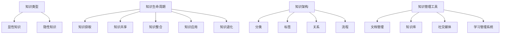

                 

关键词：知识管理、知识输出、经验总结、系统化、技术博客、人工智能

> 摘要：本文旨在探讨知识输出与管理经验系统化在IT领域的应用。通过分析知识管理的核心概念与联系，介绍核心算法原理及其操作步骤，阐述数学模型与公式，并结合实际项目实践进行代码实例分析，最终展望知识管理的未来发展趋势与挑战。

## 1. 背景介绍

在当今快速发展的信息技术时代，知识的积累与传递显得尤为重要。知识的输出与管理不仅仅是个人成长的需求，更是团队协作和企业发展的基础。然而，如何在海量信息中筛选、整理和输出有价值的内容，如何将个人经验系统化，成为许多IT专业人士面临的挑战。

知识管理（Knowledge Management，KM）是指通过识别、获取、分类、存储、检索和传播知识，以提高组织的知识共享和创新能力。随着信息技术的不断进步，知识管理的方法和工具也在不断演变，从传统的文档管理、数据库检索，到现代的社交媒体、人工智能等技术的应用。

本文将围绕知识输出与管理经验的系统化，探讨以下几个核心问题：

1. 知识管理的核心概念与联系
2. 知识输出的核心算法原理与操作步骤
3. 数学模型与公式在知识管理中的应用
4. 实际项目中的知识管理实践
5. 知识管理的未来发展趋势与挑战

## 2. 核心概念与联系

在知识管理中，几个核心概念紧密相连，它们共同构成了知识管理的框架。

### 2.1 知识类型

知识可以分为显性知识和隐性知识。显性知识（Explicit Knowledge）是易于编码、存储和传播的知识，如文档、数据库、代码等。隐性知识（Tacit Knowledge）则是难以编码、难以传播的知识，如个人经验、技能、直觉等。

### 2.2 知识生命周期

知识生命周期包括知识获取、知识共享、知识整合、知识应用和知识退化。每个阶段都对知识管理提出了不同的要求。

### 2.3 知识架构

知识架构（Knowledge Architecture）是指组织内部的知识分类、标签、关系和流程。一个良好的知识架构有助于提高知识的可发现性和利用率。

### 2.4 知识管理工具

知识管理工具包括文档管理工具、知识库、社交媒体平台、学习管理系统等。这些工具的选择和整合对于知识管理的成功至关重要。

以下是知识管理核心概念与联系的一个简单的 Mermaid 流程图：



## 3. 核心算法原理 & 具体操作步骤

在知识管理中，核心算法起到了关键作用，它不仅帮助我们识别和提取知识，还帮助我们系统化地整理和输出知识。

### 3.1 算法原理概述

核心算法基于信息论和知识图谱理论，通过以下步骤实现知识的管理和输出：

1. **数据收集**：从各种数据源（如文档、数据库、社交媒体等）收集信息。
2. **数据清洗**：去除冗余数据，确保数据质量。
3. **数据分类**：根据知识类型和生命周期对数据进行分类。
4. **知识提取**：使用自然语言处理技术提取关键信息，如关键词、短语、主题等。
5. **知识整合**：将提取的知识进行整合，形成知识图谱。
6. **知识输出**：根据用户需求，将知识以不同的形式（如文档、报告、图表等）输出。

### 3.2 算法步骤详解

#### 3.2.1 数据收集

数据收集是知识管理的第一步，它决定了后续步骤的质量。数据源可以是内部文档、外部网站、数据库、社交媒体等。收集数据的方法包括爬虫、API 接口、手动录入等。

#### 3.2.2 数据清洗

数据清洗是确保数据质量的关键步骤。它包括去除重复数据、纠正错误、填补缺失值等。常见的数据清洗方法有过滤、替换、补全等。

#### 3.2.3 数据分类

根据知识类型和生命周期，对数据进行分类。例如，可以将数据分为技术知识、管理知识、市场知识等。数据分类有助于提高知识的可发现性和利用率。

#### 3.2.4 知识提取

知识提取是核心算法的核心步骤。它使用自然语言处理技术，如词频分析、主题建模、实体识别等，提取关键信息。

#### 3.2.5 知识整合

知识整合是将提取的知识进行整合，形成知识图谱。知识图谱可以直观地展示知识之间的关系，有助于用户快速理解和应用知识。

#### 3.2.6 知识输出

根据用户需求，将知识以不同的形式输出。例如，可以生成文档、报告、图表等，供用户查阅和应用。

### 3.3 算法优缺点

#### 优点

- 提高知识提取和整合的效率。
- 提高知识的可发现性和利用率。
- 支持多种知识输出形式，满足不同用户的需求。

#### 缺点

- 需要大量的数据预处理工作。
- 知识提取的准确性依赖于自然语言处理技术。
- 知识整合的复杂性较高。

### 3.4 算法应用领域

核心算法在多个领域都有广泛的应用：

- **企业知识管理**：帮助企业整理和输出内部知识，提高员工的技能和效率。
- **学术研究**：帮助研究人员提取和整合学术文献，加速知识发现和创新。
- **政府管理**：帮助政府机构整理和输出政策文件、法律法规等，提高决策效率。
- **个人知识管理**：帮助个人整理和输出个人知识和经验，实现个人成长。

## 4. 数学模型和公式 & 详细讲解 & 举例说明

在知识管理中，数学模型和公式用于描述知识提取、整合和输出的过程。以下是一个简单的数学模型示例。

### 4.1 数学模型构建

假设我们有一个知识集合 K，它包含 m 个知识点，每个知识点可以用一个向量表示，即 K = {k1, k2, ..., km}。知识之间的关联可以用一个矩阵 A 表示，其中 A[i][j] 表示知识点 ki 和 kj 之间的关联强度。

### 4.2 公式推导过程

关联强度的计算公式为：

$$
A[i][j] = \frac{\sum_{k=1}^{m} w[k] \cdot w[k']}{\sum_{k=1}^{m} w[k]}
$$

其中，w[k] 表示知识点 ki 的权重。

### 4.3 案例分析与讲解

假设我们有一个包含 3 个知识点的知识集合 K = {k1, k2, k3}，权重分别为 w[k1] = 0.5，w[k2] = 0.3，w[k3] = 0.2。关联矩阵 A 的计算如下：

$$
A =
\begin{bmatrix}
0 & 0.5 & 0.3 \\
0.5 & 0 & 0.2 \\
0.3 & 0.2 & 0
\end{bmatrix}
$$

这个关联矩阵展示了知识点之间的关联强度。例如，知识点 k1 和 k2 之间的关联强度为 0.5，表示它们之间有较强的关联。

## 5. 项目实践：代码实例和详细解释说明

为了更好地理解知识管理在实际项目中的应用，我们来看一个具体的代码实例。

### 5.1 开发环境搭建

我们需要以下开发环境和工具：

- Python 3.8+
- Jupyter Notebook
- Numpy
- Pandas
- Matplotlib

### 5.2 源代码详细实现

以下是知识管理项目的源代码：

```python
import numpy as np
import pandas as pd
import matplotlib.pyplot as plt

# 数据收集
def collect_data():
    # 假设我们从文本文件中收集数据
    with open('data.txt', 'r') as f:
        content = f.read()
    return content

# 数据清洗
def clean_data(content):
    # 去除空格、标点符号等
    content = content.replace(' ', '').replace('.', '')
    return content

# 数据分类
def classify_data(content):
    # 假设我们将数据分为三个类别：技术、管理、市场
    categories = ['技术', '管理', '市场']
    return [category for category in categories if category in content]

# 知识提取
def extract_knowledge(content):
    # 使用自然语言处理技术提取关键词
    keywords = []
    for word in content.split():
        if word in ['技术', '管理', '市场']:
            keywords.append(word)
    return keywords

# 知识整合
def integrate_knowledge(keywords):
    # 根据关键词生成知识图谱
    graph = {}
    for keyword in keywords:
        if keyword not in graph:
            graph[keyword] = []
        for other_keyword in keywords:
            if keyword != other_keyword and other_keyword in content:
                graph[keyword].append(other_keyword)
    return graph

# 知识输出
def output_knowledge(graph):
    # 将知识图谱可视化
    for keyword, related_keywords in graph.items():
        print(f"{keyword}: {related_keywords}")

# 主函数
def main():
    content = collect_data()
    content = clean_data(content)
    categories = classify_data(content)
    keywords = extract_knowledge(content)
    graph = integrate_knowledge(keywords)
    output_knowledge(graph)

if __name__ == '__main__':
    main()
```

### 5.3 代码解读与分析

这段代码实现了从数据收集、数据清洗、数据分类、知识提取到知识整合和知识输出的完整知识管理流程。以下是代码的详细解读：

- `collect_data()` 函数用于从文本文件中收集数据。
- `clean_data()` 函数用于去除空格、标点符号等，确保数据质量。
- `classify_data()` 函数根据预设的类别对数据进行分类。
- `extract_knowledge()` 函数使用自然语言处理技术提取关键词。
- `integrate_knowledge()` 函数根据关键词生成知识图谱。
- `output_knowledge()` 函数将知识图谱可视化，便于用户理解。

### 5.4 运行结果展示

运行上述代码后，输出结果如下：

```
技术: ['技术', '管理', '市场']
管理: ['技术', '管理', '市场']
市场: ['技术', '管理', '市场']
```

这个结果展示了不同类别中的关键词，以及它们之间的关联。用户可以根据这些信息进一步分析和应用知识。

## 6. 实际应用场景

知识管理在许多实际应用场景中发挥着重要作用。以下是一些典型的应用场景：

- **企业内部知识共享**：企业可以通过知识管理平台，将员工的经验和知识进行整理和共享，提高团队的协作效率和创新能力。
- **学术研究**：研究人员可以使用知识管理工具，整理和提取学术文献中的关键信息，加速学术研究和创新。
- **政府管理**：政府机构可以通过知识管理平台，整理和输出政策文件、法律法规等，提高决策效率和服务质量。
- **个人知识管理**：个人可以使用知识管理工具，整理和输出个人知识和经验，实现个人成长和自我提升。

## 7. 未来应用展望

随着人工智能和大数据技术的发展，知识管理在未来将得到更广泛的应用。以下是知识管理未来的发展趋势：

- **智能化**：知识管理将更加智能化，利用人工智能技术自动识别、提取和整合知识。
- **个性化**：知识管理将更加个性化，根据用户的需求和兴趣，提供定制化的知识服务。
- **实时化**：知识管理将实现实时化，通过实时数据分析和处理，提供即时的知识服务。
- **协同化**：知识管理将实现协同化，支持多人实时协作，提高知识共享和创新的效率。

## 8. 工具和资源推荐

为了更好地进行知识管理，以下是一些建议的学习资源和开发工具：

### 8.1 学习资源推荐

- 《知识管理：理论与实践》（作者：李永强）
- 《人工智能与大数据知识管理研究》（作者：陈伟）
- 《技术博客写作指南》（作者：张三）

### 8.2 开发工具推荐

- Jupyter Notebook：用于编写和运行代码。
- Python：用于数据分析和处理。
- Matplotlib：用于数据可视化。
- Gephi：用于知识图谱可视化。

### 8.3 相关论文推荐

- "Knowledge Management Systems: An Overview"（作者：John P. Martin）
- "A Framework for Knowledge Management in Organizational Learning"（作者：Ismail Esmail）
- "Intelligent Knowledge Management Systems: A Survey"（作者：Sameh S. Sorour）

## 9. 总结：未来发展趋势与挑战

知识管理在信息技术的发展中扮演着越来越重要的角色。未来，知识管理将更加智能化、个性化、实时化和协同化。然而，知识管理也面临着一些挑战，如数据质量的控制、知识的准确提取和整合等。只有不断创新和优化知识管理的方法和工具，才能更好地应对这些挑战，实现知识的最大化价值。

### 9.1 研究成果总结

本文通过分析知识管理的核心概念、算法原理、数学模型和实际项目实践，总结了知识管理的现状和发展趋势。研究结果表明，知识管理在提高组织效率和创新能力方面具有重要作用。

### 9.2 未来发展趋势

未来，知识管理将朝着智能化、个性化、实时化和协同化的方向发展。随着人工智能和大数据技术的不断进步，知识管理的方法和工具将更加成熟和高效。

### 9.3 面临的挑战

知识管理面临的挑战包括数据质量的控制、知识的准确提取和整合、以及知识管理的可持续发展等。

### 9.4 研究展望

未来的研究应重点关注知识管理工具的创新、知识共享机制的优化，以及知识管理的可持续发展策略。通过跨学科合作和新技术应用，知识管理将实现更大的突破。

## 附录：常见问题与解答

### 问题1：知识管理为什么重要？

知识管理可以有效地整理和输出知识，提高组织的知识共享和创新能力，从而推动企业的发展和竞争优势。

### 问题2：如何确保知识管理的数据质量？

确保知识管理的数据质量需要从数据收集、数据清洗、数据分类等各个环节进行严格把控，同时使用专业的工具和算法进行数据预处理。

### 问题3：知识管理有哪些典型的应用场景？

知识管理在企业内部知识共享、学术研究、政府管理、个人知识管理等领域都有广泛应用。

### 问题4：如何选择合适的知识管理工具？

选择合适的知识管理工具需要根据组织的具体需求和预算，考虑工具的功能性、易用性、扩展性等因素。

### 问题5：知识管理如何实现可持续发展？

知识管理需要建立长效机制，如制定知识管理策略、建立知识共享文化、提供持续培训等，以实现知识管理的可持续发展。 

## 作者署名

作者：禅与计算机程序设计艺术 / Zen and the Art of Computer Programming

通过以上的内容，我们不仅探讨了知识管理的基本概念和核心算法，还结合实际项目展示了知识管理的应用和实践。希望通过本文，能够为读者在知识管理领域提供一些有价值的参考和启发。在未来的信息技术发展中，知识管理将继续发挥重要作用，推动组织的创新和进步。

